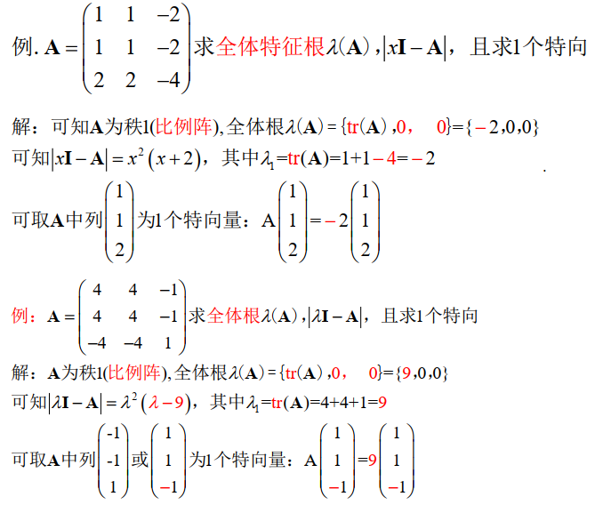

> 矩阵论准备知识，很多内容都是线性代数的扩展

<!--more-->

## 相似

> 设 A、B为n阶方阵，如果存在可逆阵P，使得 $P^{-1}AP=B$ ，则称A与B相似，记为 $A\sim B$

### 相似性质

1. 自反性：$A\sim A$ ，$I^{-1}AI = A$
2. 对称性：$A\sim B \Rightarrow B\Rightarrow A$
3. 传递性：$A\sim B \quad 且 \quad B\sim C\Rightarrow A\sim B$

所以，方阵之间的相似关系是一种等价关系

### 定理：A与B相似，则有相同特征根公式

若A与B相似，则有
$$
\begin{aligned}
|xI-A|=|xI-B|
\end{aligned}
$$
即A与B的特征根公式相同，其中A与B都是n阶方阵

#### *证明

可设 $P^{-1}AP = B$ ，则有 
$$
\begin{aligned}
\mid xI-B\mid &=\mid xI-P^{-1}AP\mid=\mid P^{-1}(xI-A)P\mid \\
&\overset{\text{行列式计算}}{=}\mid xI-A\mid 
\end{aligned}
$$
由相似，可将A与B矩阵表示为 $A\sim B$ 或者 $AP=PB$ ，其中P为可逆矩阵

#### 推论

1. n阶方阵 $A_{n\times n}$ 的特征值为 $\lambda(A)=\{\lambda_1,\lambda_2,...,\lambda_n\}$ 可包含重复特征值

$$
\begin{aligned}
&eg：\\
&A=\left ( 
\begin{matrix}
1\quad 1\\
1\quad 1
\end{matrix}
\right),\lambda(A)=\{2,0\}\\\\
&A=\left ( 
\begin{matrix}
2\quad 1\\
0\quad 3
\end{matrix}
\right),\lambda(A)=\{2,3\}\\\\
&A=\left ( 
\begin{matrix}
2\quad 1\\
0\quad 2
\end{matrix}
\right),\lambda(A)=\{2,2\}
\end{aligned}
$$

2. 进而，特征多项式 $\mid \lambda I-A \mid$ 必可分解为 $\mid (\lambda-\lambda_1)(\lambda-\lambda_2)...(\lambda-\lambda_n)\mid$
3. 若 $A\sim B$ ，则特征多项式相同，进而其分解式相等，得出结论，A与B的特征值相同，即 $\lambda(A)=\lambda(B)$

总结：$相似 \Leftrightarrow 特征多项式相同\Rightarrow 特征值相等$

$特征值相等\overset{实对称矩阵}{\Rightarrow} 相似$

**特征值是相似变化下的不变量**

## 换位公式

设问：若 $A=A_{n\times p},B=B_{p\times n}，且p\le n$ ，则 $\Rightarrow (A\bullet B)$ 为 n 阶方阵， $(B\bullet A)$ 为 p 阶方阵，求其特征值

### 定义

$\mid \lambda I_n-AB \mid= \lambda^{n-p}\mid \lambda I_p-BA \mid $

- AB为n阶方阵，BA为P阶方阵

可见AB与BA两个方阵特征值基本相等

#### *证明

### 推论

若 $A=A_{n\times p},B=B_{p\times n}，且p\le n$ ，则 $\Rightarrow (A\bullet B)$ 为 n 阶方阵， $(B\bullet A)$ 为 p 阶方阵

1. 若BA的特征根 $\lambda(BA)=\{\lambda_1,\lambda_2,...,\lambda_p\}$ ，则 AB 的特征根 $\lambda(AB)=\{\lambda_1,\lambda_2...,\lambda_p,0,...,0\}(含n-p个零根)$ ，可见 $AB$ 与 $BA$ 只差 $n-p$ 个零根，其余根相同

   

   即AB与BA必有相同非零根

   

2. 由于 AB与BA 只相差 n-p 个零根，所以 $tr(AB) = tr(BA)$ 

   证：$tr(AB)=\lambda_1+\lambda_2+\cdots+\lambda_p+0+\cdots+0=tr(BA)$

3. $\mid I_n \pm AB\mid = \mid I_p\pm BA\mid$ ，当 $\lambda = 1,A取-A$ 时，分别可证

4. 若 n>p，则 $\mid AB \mid=0$ 
   $$
   \begin{aligned}
   &证：AB为n阶矩阵，由于r(AB)\le r(A)\le p<n(矩阵的秩越乘越小)\\
   &故\mid AB\mid=0
   \end{aligned}
   $$
   或者考虑 AB 为 n 阶方阵，而只有p个非零特征值，p < n，故必有零特征值，$\mid AB \mid = \prod\lambda_i = 0$
   
   

$$
\begin{aligned}
&例3：
P = \left(
\begin{matrix}
I\quad A \\
0\quad I
\end{matrix}
\right),求证P^{-1}=\left(
\begin{matrix}
I\quad -A\\
0\quad I
\end{matrix}
\right)
\end{aligned}
$$

其实也就是二阶矩阵求逆 
$$
\begin{aligned}
A=\left(
\begin{matrix}
B\quad C\\
D\quad E
\end{matrix}
\right),则A^{-1}=\left(
\begin{matrix}
E\quad -C\\
-D\quad B
\end{matrix}
\right)
\end{aligned}
$$

## 秩1矩阵

$$
\begin{aligned}
A&=\left(
\begin{matrix}
&a_1b_1\quad &a_1b_2\quad &\cdots\quad &a_1b_n\\
&a_2b_1\quad &a_2b_2\quad &\cdots\quad &a_2b_n\\
&\vdots\quad &\vdots\quad &\ddots\quad &\vdots\\
&a_nb_1\quad &a_nb_2\quad &\cdots\quad &a_nb_n
\end{matrix}
\right)_{n\times n}\\\\
&=\left(
\begin{matrix}
a_1\\a_2\\\vdots \\a_n
\end{matrix}
\right)\left(
b_1\quad b_2\quad \cdots \quad b_n
\right)\\\\
&\overset{\Delta}{=}\alpha \beta^{T},其中 \alpha=\left(
\begin{matrix}
a_1\\a_2\\\vdots \\a_n
\end{matrix}
\right),\beta=\left(
\begin{matrix}
b_1\\b_2\\\vdots \\b_n
\end{matrix}
\right)
\end{aligned}
$$

### 秩1矩阵特征方程

$$
\begin{aligned}
&\mid \lambda E-A\mid = \mid \lambda E-\alpha_{n\times 1}\beta_{1\times n}^T\mid=\lambda^{n-1}\mid\lambda I-\beta_{1\times n}^T\alpha_{n\times 1}I\mid\\
&=\lambda^{n-1}(\lambda I-tr(A)),其中 tr(A)=\sum\limits_{i=1}^\limits{n}a_{i}b_i
\end{aligned}
$$

#### eg

### 秩1矩阵的特征值

若n阶方针，秩为1，r(A)=1，则全体特征值为 $\lambda(A)=\{tr(A),0,...,0\}$ ，其中 $tr(A)=a_1b_1+a_2b_2+...+a_nb_n=\beta^T\alpha$ 

由换位公式可知，$\alpha_{n\times 1}\beta_{1\times n}^T$ 与 $\beta_{1\times n}^T\alpha_{n\times 1}$ 相差 n-1 个零根，即有一个相等的非零特征根，而 $\beta_{1\times n}^T\alpha_{n\times 1}$ 为1阶矩阵，所以 $\lambda_1=\beta_{1\times n}^T\alpha_{n\times 1}=a_1b_1+a_2b_2+...+a_nb_n=tr(A)$

### 秩1矩阵特征向量

$A=\alpha \beta^T$ 的每个列向量都是 $\lambda_1=tr(A)$ 的特征向量

证明：
$$
\begin{aligned}
A\alpha = (\alpha \beta)\alpha=\lambda_1 \alpha
\end{aligned}
$$

#### eg

## 平移矩阵

> $A+cI$ 称为A的平移矩阵

### 平移法

#### 特征值

若 $\lambda(A)=\{\lambda_1+c,\lambda_2+c,...,\lambda_n+c\}$

#### 特征向量

$A+cI$ 与 $A$ 有 相同的特征向量

证明：
$$
\begin{aligned}
&令A的n个特征向量x_1,x_2,...,x_n，有\\\\
&Ax_1=\lambda_1 x_1,Ax_1=\lambda_2 x_2,...Ax_n=\lambda_1 x_n\\\\
\Leftrightarrow &
\left\{
\begin{aligned}
(A+cI)x_1 = \lambda_1x_1+cx_1=(\lambda_1+c)x_1\\
(A+cI)x_2 = \lambda_2x_2+cx_2=(\lambda_2+c)x_2\\
\cdots\\
(A+cI)x_n = \lambda_nx_n+cx_n=(\lambda_n+c)x_n
\end{aligned}
\right.\\\\
故&\lambda(A)=\{\lambda_1,\lambda_2,...,\lambda_n\}
\end{aligned}
$$

#### eg：平移法求特征向量

$$
\begin{aligned}
&(1)A-E=\left(
\begin{matrix}
0\quad 1\quad 0\\
0\quad 1\quad 0\\
0\quad 1\quad 0
\end{matrix}
\right)\\
&由秩1公式,\lambda(A-E)=\{tr(A),0,0\},\\
&由平移公式 \lambda(A)=\{tr(A-E)+1,1,1\}=\{2,1,1\}\\
&且(A-E)与A的特征向量相等，A-E的列向量\left(
\begin{matrix}
1\\1\\1
\end{matrix}
\right)\\
&(2)A-E=\left(
\begin{matrix}
3\quad 6 \quad 0\\
-3\quad -6\quad 0\\
-3\quad -6\quad 0\\
\end{matrix}
\right),\lambda(A-E)=\{-3,0,0\},
\\&故\lambda(A)=\{-2,1,1\},A的特征向量为\left(
\begin{matrix}
3\\-3\\6
\end{matrix}
\right)
\end{aligned}
$$

### 倍法

若 $\lambda(A)=\{\lambda_1,...,\lambda_n\}$ ，则 $\lambda(kA)=\{k\lambda_1,k\lambda_2,...,k\lambda_n,\}(k\neq 0)$ 

$k\lambda(A)$ 与 $\lambda(kA)$ 有相同的特征向量

## 平移矩阵与秩1矩阵的综合应用

$$
\begin{aligned}
&A=\left(
\begin{matrix}
-1\quad -2\quad 6\\
-1\quad 0\quad 3\\
-1\quad -1\quad 4
\end{matrix}
\right)，A-I=\left(
\begin{matrix}
-2\quad -2\quad 6\\
-1\quad -1\quad 3\\
-1\quad -1\quad 3
\end{matrix}
\right),\lambda(A-I)=\{0,0,0\}\\
&,则\lambda(A)=\lambda(A-I)+1=\{1,1,1\}
\end{aligned}
$$

---

$$
\begin{aligned}
&A=\left(
\begin{matrix}
7\quad 4\quad -1\\
4\quad 7\quad -1\\
-4\quad -4\quad 4
\end{matrix}
\right),A-3I=\left(
\begin{matrix}
4\quad 4\quad -1\\
4\quad 4\quad -1\\
-4\quad -4\quad 1
\end{matrix}
\right),\lambda(A-3I)=\{9,0,0\}\\
\\&\lambda(A)=\lambda(A-3I)+3=\{12,3,3\}
\end{aligned}
$$

## 复数域

### 复数

> $C:\{z=a+bi\mid a,b\in R\}$ ，其中 $i^2=-1,\sqrt{-1}=i$

- $R\subset C$ ：实数都是复数

$若z=a+bi,则\overline{z}=\overline{a+bi}=a-bi$

### 复数域表示

$$
\begin{aligned}
&n维实列向量X=\left(
\begin{matrix}
x_1\\ x_2 \\ \vdots \\x_n
\end{matrix}
\right),x_i\in R,
n维实复列向量X=\left(
\begin{matrix}
x_1\\ x_2 \\ \vdots \\x_n
\end{matrix}
\right),x_i\in C\\\\
&列向量可表示为转置形式 X=\left(x_1,x_2,...,x_n\right)^T\\\\
&m\times n 实矩阵R_{m\times n} = \{A=(a_{ij})\mid a_{i,j}\in R,1\le i\le m,1\le j\le n\}\\

&m\times n复矩阵C^{m\times n}=\{A=(a_{ij})\mid a_{ij}\in C,1\le i\le m,1\le j\le n\}\\
&且 R_{m\times n}\in C^{m\times n}
\end{aligned}
$$

$$
\begin{aligned}
&A_{m\times n}=\left(
\begin{matrix}
&a_{11}\quad &a_{12}&\cdots\quad &a_{1n}\\
&a_{21}\quad &a_{22}&\cdots\quad &a_{2n}\\
&\vdots\quad &\vdots &\ddots\quad &\vdots\\
&a_{m1}\quad &a_{m2}&\cdots \quad &a_{mn}
\end{matrix}
\right)\in C^{m\times n}\\\\
&可表示为A=(\alpha_1,\alpha_2,\cdots,\alpha_n),且\alpha_i\in C^{m}
\end{aligned}
$$

### 共轭公式

由 $z\overline{z}=(a+bi)(a-bi)=a^2+b^2$

- 规定 $\mid z \mid=\sqrt{a^2+b^2}$ 为z的模长

模公式 $z\overline z=\overline zz=\mid z\mid^2=a^2+b^2$

#### 复矩阵的共轭

$$
\begin{aligned}
&A=(a_{ij})=\left(
\begin{matrix}
&a_{11}&\cdots &a_{1n}\\
&\vdots &\ddots &\vdots\\
&a_{n1}&\cdots &a_{nn}\\
\end{matrix}
\right),\\\\&A的共轭矩阵 \overline{A} = (\overline{a_{ij}})=\left(
\begin{matrix}
&\overline{a_{11}}&\cdots &\overline{a_{1n}}\\
&\vdots &\ddots &\vdots\\
&\overline{a_{n1}}&\cdots &\overline{a_{nn}}\\
\end{matrix}
\right)
\end{aligned}
$$

**eg：**

**乘后共轭=共轭后乘** ： $\overline{A\bullet B}=\overline{A}\bullet \overline{B}$

### Hermite变换

> 共轭转置记为 Hemite 变换，即 $A^H = \overline{A}^T=\overline{A^T}$ ，

$$
\begin{aligned}
&A=(a_{ij})=\left(
\begin{matrix}
&a_{11}&\cdots &a_{1n}\\
&\cdots &\ddots &\cdots\\
&a_{m1}&\cdots &a_{mn}
\end{matrix}
\right)\in C,\\
&\overline{A}=\left(
\begin{matrix}
&\overline{a_{11}}&\cdots &\overline{a_{1n}}\\
&\vdots &\ddots &\vdots\\
&\overline{a_{m1}}&\cdots &\overline{a_{mn}}
\end{matrix}
\right)\in C\\
&X=\left(
\begin{matrix}
x_1\\
x_2\\
\vdots\\
x_n
\end{matrix}
\right)\in C_n,则X^H=(\overline{x_1},\overline{x_2},...,\overline{x_n})
\end{aligned}
$$

共轭不会使矩阵变型，转置使矩阵变型 $A\in C^{n\times p}\Rightarrow A^H\in C^{p\times n}$

eg：
$$
\begin{aligned}
A=\left(
\begin{matrix}
1\quad i\\
1\quad i\\
1\quad i
\end{matrix}
\right)\in C^{3\times2},则A^H=\left(
\begin{matrix}
1\quad -i\\
1\quad -i\\
1\quad -i
\end{matrix}
\right)^T
=\left(
\begin{matrix}
1\quad 1\quad 1\\
-i\quad -i\quad -i
\end{matrix}
\right) \in C^{2\times 3}
\end{aligned}
$$

#### Hermite变换性质

| Hermite变换                       | 转置              |
| --------------------------------- | ----------------- |
| $(A^H)^H=A$                       | $(A^T)^T=A$       |
| $(kA)^H=\overline{k}A^H$          | $(kA)^T=kA^T$     |
| $(A+B)^H=A^H+B^H$                 | $(A+B)^T=A^T+B^T$ |
| $(AB)^H=B^HA^H,(ABC)^H=C^HB^HA^H$ | $(AB)^T=B^TA^T$   |

实数阵的 Hermite 变换仍是其本身

定理：$a\in C 是实数 \iff \overline{a}=a\iff a^H=a$

#### Hermite变换相关的矩阵分类

| Hermite变换            | 转置                |
| ---------------------- | ------------------- |
| $A^H=A$ Hermite矩阵    | $A^T=A$ ，对称阵    |
| $A^H=-A$ 斜Hermite矩阵 | $A^T=-A$ ，反对称阵 |

**Hermite矩阵性质**：如果A是Hermite矩阵，则其对角线上元素全是实数
$$
\begin{aligned}
&A=\left(
\begin{matrix}
&a_{11}&\quad&\quad &*\\
&\quad&a_{22}&\quad&\quad \\
&\quad &\quad&\ddots&\quad\\
&*&\quad&\quad&a_{nn}
\end{matrix}
\right),\\
&而A^H=\left(
\begin{matrix}
&\overline{a_{11}}&\quad&\quad &*\\
&\quad&\overline{a_{22}}&\quad&\quad \\
&\quad &\quad&\ddots&\quad\\
&*&\quad&\quad&\overline{a_{nn}}
\end{matrix}
\right),Hermite矩阵A^H=A\\
&a_{11}=\overline{a_{11}},a_{22}=\overline{a_{22}},...,a_{nn}=\overline{a_{nn}},可见Hermite矩阵对角线元素是实数
\end{aligned}
$$

### 模长

#### 模长性质

1. $\mid z \mid = \mid\overline z \mid$
2. $\mid kz \mid=k\mid z\mid,k\in C$
3. $\mid z_1+z_2 \mid \le \mid z_1 \mid+\mid z_2 \mid$
4. $\overline{z_1\bullet z_2}=\overline{z_1} \bullet \overline{z_2}$

#### 复向量模长

##### 列向量模长

$$
\begin{aligned}
&X=\left(
\begin{matrix}
x_1\\x_2\\\vdots\\x_n
\end{matrix}
\right)\in C,则其模长 \mid X \mid = \sqrt{ \mid x_1 \mid^2+ \mid x_2 \mid^2+
 \cdots \mid x_n \mid^2}
 \end{aligned}
$$

**区分** ：复数的模平方和复数平方的模

- 复数的模平方 $\mid x_1 \mid^2=(a+bi)(a-bi)=a^2+b^2 \ge 0$
- 复数平方的模：$\mid x_1^2 \mid=(a+bi)^2= a^2-b^2+2abi$

**模长性质**

$\mid k\bullet X \mid = \mid k \mid \bullet \mid X \mid ,k\in C$ 

$\vert \frac{X}{k} \vert=\frac{\vert X\vert}{\vert k \vert},(k\neq \vec{0})$

$\vert X\pm Y\vert \le \vert X\vert + \vert Y \vert$

##### 模平方公式

$$
\begin{aligned}
&令X=\left(
\begin{matrix}
x_1\\
x_2\\
\vdots\\
x_n
\end{matrix}
\right)\in C,则 \left\{
\begin{aligned}
&①\quad X^HX=\mid X \mid^2\\\\
&②\quad tr(X^HX)=tr(XX^H)=\mid X \mid^2
\end{aligned}
\right.,其中\\ 
&\mid X \mid^2 = \mid x_1 \mid ^2 + \mid x_2 \mid^2+\cdots+\mid x_n \mid^2=\sum\limits_{i=1}\limits^{n}\mid x_i \mid^2
\end{aligned}
$$

**eg**
$$
\begin{aligned}
&X=\left(
\begin{matrix}
1\\i\\1
\end{matrix}
\right)\in C^3,XX^H=\left(
\begin{matrix}
1\\i\\1
\end{matrix}
\right)(1\quad -i\quad 1)=\left(
\begin{matrix}
&1\quad &\quad &*\\
&\quad &1&\quad\\
&*&\quad&1
\end{matrix}
\right)\\
&\therefore tr(X^HX)=tr(XX^H)=\vert 1 \vert^2+\vert  -i^2 \vert^2+\vert 1 \vert^2 = 3
\end{aligned}
$$

#### 复矩阵模长

$$
\begin{aligned}
&令A=(a_{ij})\in C,则模长(矩阵的F范数)\mid \mid A \mid\mid=\sqrt{\sum\limits_{i=1}\limits^{n}\mid a_{ij} \mid^2}
\end{aligned}
$$

##### 复矩阵的模平方公式

$$
\begin{aligned}
&设A=(a_{ij})_{n\times p},则 \quad tr(A^HA)=tr(AA^H)=\mid\mid A\mid\mid = \sum\limits_{i=1}\limits^{n}\mid a_{ij} \mid^2
\end{aligned}
$$

**eg**
$$
\begin{aligned}
X=\left(
\begin{matrix}
1\\i\\1
\end{matrix}
\right)\in C^{3\times 1},则\mid X \mid^2 = X^HX=(1,-i,1)\left(
\begin{matrix}
1\\i\\1
\end{matrix}
\right)=1+-i^2+1=3
\end{aligned}
$$
对于方阵 $A=(a_{ij})_{n\times n}$ ，有
$$
\begin{aligned}
\left\{
\begin{aligned}
&tr(A)\overset{\Delta}{=} a_{11}+a_{22}+\cdots+a_{nn}=\sum\limits_{i=1}\limits^{n}\lambda_i\\
&det(A) = \mid A \mid = \prod\limits_{i=1}\limits^{n}\lambda_i
\end{aligned}
\right.
\end{aligned}
$$

### $A^HA$ 型Hermite矩阵

**任一矩阵 $A_{n\times p}，A^HA与AA^H$ 都是Hermite矩阵**  
$$
\begin{aligned}
&(A^HA)^H=A^HA,(AA^H)^H=A
\end{aligned}
$$

$$
\begin{aligned}
&A_{n\times p}=\left(
\begin{matrix}
&a_{11}&\cdots&a_{1p}\\
&\vdots&\ddots&\vdots\\
&a_{n1}&\cdots&a_{np}
\end{matrix}
\right)\in C^{n\times p},\\
&A^H_{p\times n}=\left(
\begin{matrix}
&\overline{a_{11}}&\cdots&\overline{a_{n1}}\\
&\vdots&\ddots&\vdots\\
&\overline{a_{1p}}&\cdots&\overline{a_{np}}
\end{matrix}
\right)\in C^{p\times n}\\
&AA^H=\left(
\begin{matrix}
&a_{11}&\cdots&a_{1p}\\
&\vdots&\ddots&\vdots\\
&a_{n1}&\cdots&a_{np}
\end{matrix}
\right)\left(
\begin{matrix}
&\overline{a_{11}}&\cdots&\overline{a_{n1}}\\
&\vdots&\ddots&\vdots\\
&\overline{a_{1p}}&\cdots&\overline{a_{np}}
\end{matrix}
\right)\\
&=\left(
\begin{matrix}
&a_{11}\overline{a_{11}}+a_{12}\overline{a_{12}}+\cdots+a_{1p}\overline{a_{1p}}&\quad &\quad&\ast\\
&\quad&a_{21}\overline{a_{21}}+a_{22}\overline{a_{22}}+\cdots+a_{2p}\overline{a_{2p}}&\quad&\quad\\
&\quad &\quad &\ddots&\quad\\
&\ast &\quad&\quad&a_{n1}\overline{a_{n1}}+a_{n2}\overline{a_{n2}}+\cdots+a_{np}\overline{a_{np}}
\end{matrix}
\right)
\end{aligned}
$$

#### $A^HA$ 矩阵的迹

$$
\begin{aligned}
&tr(A^HA)=tr(AA^H)=\\
&(\mid a_{11} \mid^2+\mid a_{12} \mid^2+...+\mid a_{1p} \mid^2)+(\mid a_{21} \mid^2+\mid a_{22} \mid^2+...+\mid a_{2p} \mid^2)+\\
&...+(\mid a_{n1} \mid^2+\mid a_{n2} \mid^2+...+\mid a_{np} \mid^2)
=\sum\limits_{i=1,j=1}\limits^{i=n,j}\mid a_{ij} \mid^2
\end{aligned}
$$

**推论**

$tr(AB^H)=tr(B^HA)=\sum a_{ij}\overline{b_ij}$

- 将 A B 矩阵按列分块，可验证 $tr(B^HA)$
  $$
  \begin{aligned}
  &A=(\alpha_1,\alpha_2),B=(\beta_1,\beta_2),B^H=\left(
  \begin{matrix}
  \overline{\beta_1}^T\\
  \overline{\beta_2}^T\\
  \end{matrix}
  \right)\\
  &B^HA=\left(
  \begin{matrix}
  \overline{\beta_1}^T\\
  \overline{\beta_2}^T\\
  \end{matrix}
  \right)(\alpha_1,\alpha_2)=\left(
  \begin{matrix}
  &\overline{\beta_1}^T\alpha_1\quad &\overline{\beta_1}^T\alpha_2\\
  &\overline{\beta_2}^T\alpha_1\quad &\overline{\beta_2}^T\alpha_2
  \end{matrix}
  \right)\\
  &tr(B^HA)=\overline{\beta_1}^T\alpha_1+\overline{\beta_2}^T\alpha_2=\\
  &\quad (a_{11}\overline{b_{11}}+a_{21}\overline{b_{21}}+a_{31}\overline{b_{31}})+
  (a_{12}\overline{b_{12}}+a_{22}\overline{b_{22}}+a_{32}\overline{b_{32}})\\
  &=\sum a_{ij}\overline{b_{ij}}
  \end{aligned}
  $$
  
- 将 A B矩阵按行分块，可验证 $tr(AB^H)$
  $$
  \begin{aligned}
  &A=\left(
  \begin{matrix}
  \alpha_1\\
  \alpha_2\\
  \alpha_3
  \end{matrix}
  \right),
  B=\left(
  \begin{matrix}
  \beta_1\\
  \beta_2\\
  \beta_3
  \end{matrix}
  \right)，B^H=(\overline{\beta_1}^T,\overline{\beta_2}^T,\overline{\beta_3}^T)\\
  &AB^H=\left(
  \begin{matrix}
  \alpha_1\\
  \alpha_2\\
  \alpha_3
  \end{matrix}
  \right)(\overline{\beta_1}^T,\overline{\beta_2}^T,\overline{\beta_3}^T)=\left(
  \begin{matrix}
  &\alpha_1\overline{\beta_1}^T\quad&\alpha_1\overline{\beta_2}^T\quad&\alpha_1\overline{\beta_3}^T\\
  &\alpha_2\overline{\beta_1}^T\quad&\alpha_2\overline{\beta_2}^T\quad&\alpha_3\overline{\beta_3}^T\\
  &\alpha_3\overline{\beta_1}^T\quad&\alpha_3\overline{\beta_2}^T\quad&\alpha_3\overline{\beta_3}^T
  \end{matrix}
  \right)\\
  &tr(AB^H)=(a_{11}\overline{b_{11}}+a_{12}\overline{b_{12}})+(a_{21}\overline{b_{21}}+a_{22}\overline{b_{22}})+(a_{31}\overline{b_{31}}+a_{32}\overline{b_{32}})\\
  &\quad\quad\quad\quad = \sum a_{ij}\overline{b_{ij}}
  \end{aligned}
  $$
  

#### 向量 $X^HX$ 的迹

$$
\begin{aligned}
&X=\left(
\begin{matrix}
x_1\\
x_2\\\vdots \\x_n
\end{matrix}
\right),X^H=(\overline{x_1},\overline{x_2},\cdots,\overline{x_n})\\
&tr(X^HX)=tr(XX^H)=\mid x_1 \mid^2+\mid x_2 \mid^2+\cdots\mid x_n \mid^2=\sum \mid x_j \mid^2
\end{aligned}
$$

**推论**
$$
\begin{aligned}
tr(XY^H)=tr(Y^HX)=x_1\overline{y_1}+\cdots+x_n\overline{y_n}
=\sum\limits_{i=1}\limits^{n}x_i\overline{y_i}
\end{aligned}
$$

## 内积

$$
\begin{aligned}
&X=\left(
\begin{matrix}
x_1\\x_2\\\vdots\\x_n
\end{matrix}
\right),Y=\left(
\begin{matrix}
y_1\\y_2\\\vdots\\y_n
\end{matrix}
\right)\in C^n
\end{aligned}
$$

### 复向量内积

$$
\begin{aligned}
(X,Y)&\overset{\Delta}{=}Y^HX=x_1\overline{y_1}+x_2\overline{y_2}+\cdots+x_n\overline{y_n}=\sum\limits_{i=1}\limits^{n}x_i\overline{y_i}\\
&=tr(Y^HX)\\
(Y,X)&=X^HY=\overline{x_1}y_1+\overline{x_2}y_2+\cdots+\overline{x_n}y_1=\sum\limits_{i=1}\limits^{n}\overline{x_i}y_i\\
&=tr(X^HY)
\end{aligned}
$$

若取Y=X，则其内积
$$
\begin{aligned}
(X,X)&=X^HX=x_1\overline{x_1}+x_2\overline{x_2}+\cdots+x_n\overline{x_n}=\sum\limits_{i=1}\limits^{n}x_i\overline{x_i}\\
&=\vert x_1 \vert^2+\vert x_2 \vert^2+\cdots+\vert x_n \vert^2 = \vert X \vert^2\\
&=tr(X^HX)=tr(XX^H)
\end{aligned}
$$

#### 向量内积性质

1. $(X,X)\ge 0$ ；若 $X\neq 0 ,(X,X)\ge 0$ 
2. $(X,Y)=\overline{(Y,X)}$ 
3. $(kX,Y)=k(X,Y),(X,kY)=\overline{k}(X,Y)$
4. (X+Y,W)=(X,Y)+(X,W)
5. $\vert (X,Y) \vert^2\le \vert X \vert\cdot\vert Y \vert$

###  复矩阵内积

#### 定义

$$
\begin{aligned}
&(A,B)\overset{\Delta}{=}tr(AB^H)=tr(A^HB)=\sum a_{ij}\overline{b_{ij}},A,B\in C^{m,n}
\end{aligned}
$$

矩阵A的模长：$\$

#### 性质

1. $(A,A)=tr(AA^H)=\sum\vert a_{ij} \vert^2 \ge 0$ ；若 $A\neq 0$ ，则 $(A,A)>0$

2. $(A,B)=\overline{(B,A)}$

3. $(kA,B)=k(A,B),(A,kB)=\overline{k}(A,B)$

4. (A+B,D)=(A,D)+(B,D)，(D,A+B)=(D,A)+(D,B)

5. $$
   \vert (A,B) \vert^2 \le \vert A\vert\cdot\vert B \vert
   $$

### 单位化

若 $X\neq \vec{0}$ ，$\frac{X}{\vert X \vert}$ 是一个单位向量（$\vert \frac{X}{\vert X \vert} \vert=1$）

