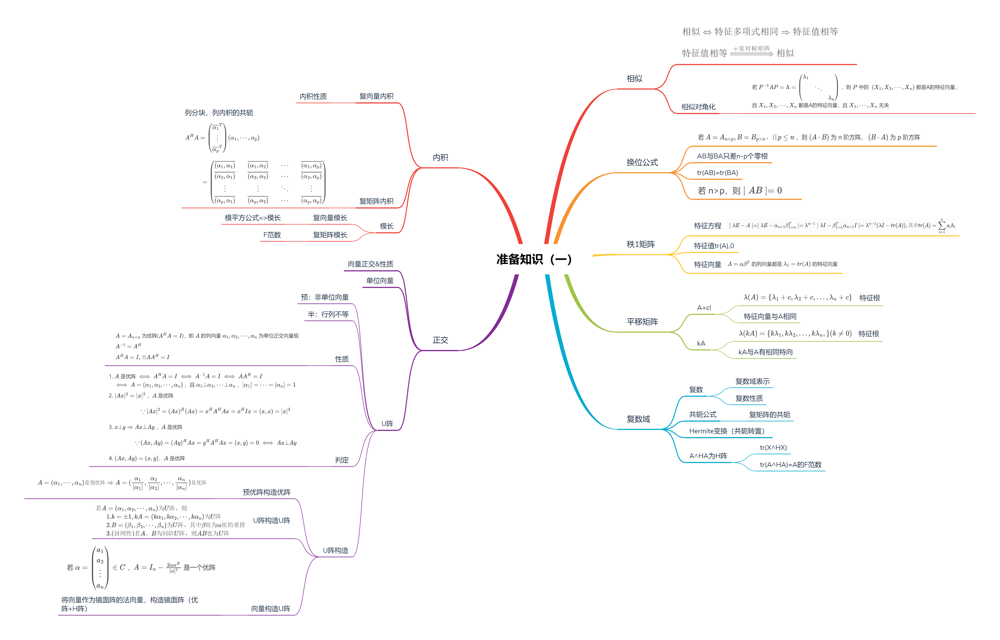
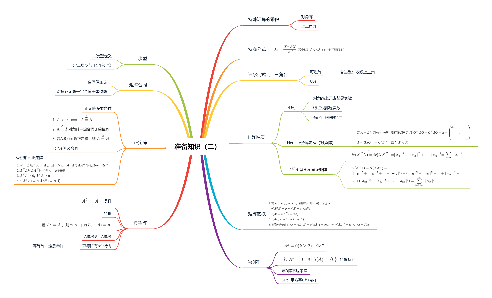

> 矩阵论准备知识，很多内容都是线性代数的扩展

<!--more-->

## 1.1 相似

> 设 A、B为n阶方阵，如果存在可逆阵P，使得 $P^{-1}AP=B$ ，则称A与B相似，记为 $A\sim B$

### 1.1.1 相似性质

1. 自反性：$A\sim A$ ，$I^{-1}AI = A$
2. 对称性：$A\sim B \Rightarrow B\Rightarrow A$
3. 传递性：$A\sim B \quad 且 \quad B\sim C\Rightarrow A\sim B$

所以，方阵之间的相似关系是一种等价关系

### 1.1.2 定理：A与B相似，则有相同特征根公式

若A与B相似，则有
$$
\begin{aligned}
|xI-A|=|xI-B|
\end{aligned}
$$
即A与B的特征根公式相同，其中A与B都是n阶方阵

#### *证明

可设 $P^{-1}AP = B$ ，则有 
$$
\begin{aligned}
\mid xI-B\mid &=\mid xI-P^{-1}AP\mid=\mid P^{-1}(xI-A)P\mid \xlongequal{行列式计算}\mid xI-A\mid 
\end{aligned}
$$
由相似，可将A与B矩阵表示为 $A\sim B$ 或者 $AP=PB$ ，其中P为可逆矩阵

#### 推论

1. n阶方阵 $A_{n\times n}$ 的特征值为 $\lambda(A)=\{\lambda_1,\lambda_2,...,\lambda_n\}$ 可包含重复特征值

   **eg** 
   $$
   \begin{aligned}
   &A=\left ( 
   \begin{matrix}
   1\quad 1\\
   1\quad 1
   \end{matrix}
   \right),\lambda(A)=\{2,0\}\\\\
   &A=\left ( 
   \begin{matrix}
   2\quad 1\\
   0\quad 3
   \end{matrix}
   \right),\lambda(A)=\{2,3\}\\\\
   &A=\left ( 
   \begin{matrix}
   2\quad 1\\
   0\quad 2
   \end{matrix}
   \right),\lambda(A)=\{2,2\}
   \end{aligned}
   $$

2. 进而，特征多项式 $\mid \lambda I-A \mid$ 必可分解为 $\mid (\lambda-\lambda_1)(\lambda-\lambda_2)...(\lambda-\lambda_n)\mid$
3. 若 $A\sim B$ ，则特征多项式相同，进而其分解式相等，得出结论，A与B的特征值相同，即 $\lambda(A)=\lambda(B)$

总结：

$相似 \Leftrightarrow 特征多项式相同\Rightarrow 特征值相等$

$特征值相等\xRightarrow{+实对称矩阵} 相似$

**特征值是相似变化下的不变量** 

### 1.1.3 相似对角化

若 $P^{-1}AP=\Lambda=\left(\begin{matrix}\lambda_1&&\\&\ddots&\\&&\lambda_n\end{matrix}\right)$ ，则 $P$ 中的  $(X_1,X_2,\cdots,X_n)$ 都是A的特征向量，且 $X_1,X_2,\cdots,X_n$ 都是A的特征向量，且 $X_1,\cdots,X_n$ 无关 

## 1.2 换位公式

设问：若 $A=A_{n\times p},B=B_{p\times n}，$且 $p\le n$ ，则 $(A\cdot B)$ 为 n 阶方阵， $(B\cdot A)$ 为 p 阶方阵，求其特征值？

### 1.2.1 定义

$\vert \lambda I_n-AB \vert= \lambda^{n-p}\vert \lambda I_p-BA \vert$

-  $AB$ 为 $n$ 阶方阵， $BA$ 为 $P$ 阶方阵

可见 $AB$ 与 $BA$ 两个方阵特征值基本相等

#### *证明

### 1.2.2 推论

若 $A=A_{n\times p},B=B_{p\times n}$ ，且 $p\le n$ ，则 $A\cdot B$ 为 n 阶方阵， $B\cdot A$ 为 p 阶方阵

1. 若 $BA$ 的特征根 $\lambda(BA)=\{\lambda_1,\lambda_2,...,\lambda_p\}$ ，则 $AB$ 的特征根 $\lambda(AB)=\{\lambda_1,\lambda_2...,\lambda_p,0,...,0\}(含n-p个零根)$ ，可见 $AB$ 与 $BA$ 只差 $n-p$ 个零根，其余根相同

   

   即 $AB$ 与 $BA$ 必有相同非零根

   

2. 由于 AB与BA 只相差 $n-p$ 个零根，所以 $tr(AB) = tr(BA)$ 

   证：$tr(AB)=\lambda_1+\lambda_2+\cdots+\lambda_p+0+\cdots+0=tr(BA)$

3. $\mid I_n \pm AB\mid = \mid I_p\pm BA\mid$ ，当 $\lambda = 1,A取-A$ 时，分别可证

4. 若 n>p，则 $\mid AB \mid=0$ 
   
   证明：
   
   $AB$ 为 $n$ 阶矩阵，由于 $r(AB)\le r(A)\le p<n(矩阵的秩越乘越小)$ ，故 $\mid AB\mid=0$ 
   
   或者考虑 $AB$ 为 $n$ 阶方阵，必有 $n-p$ 个零特征值，$\mid AB \mid = \prod\lambda_i = 0$ 
   
   
   
   例3：$P = \left(\begin{matrix}I&A \\0&I\end{matrix}\right)$ ，求证 $P^{-1}=\left(\begin{matrix}I&-A\\0& I\end{matrix}\right)$ （其实也就是二阶矩阵求逆）
   $$
   \begin{aligned}
   A=\left(
   \begin{matrix}
   B\quad C\\
   D\quad E
   \end{matrix}
   \right),则A^{-1}=\frac{1}{\vert A\vert}\left(
   \begin{matrix}
   E\quad -C\\
   -D\quad B
   \end{matrix}
   \right)
   \end{aligned}
   $$

## 1.3 秩1矩阵

$$
\begin{aligned}
A&=\left(
\begin{matrix}
a_1b_1\quad &a_1b_2\quad &\cdots\quad &a_1b_n\\
a_2b_1\quad &a_2b_2\quad &\cdots\quad &a_2b_n\\
\vdots\quad &\vdots\quad &\ddots\quad &\vdots\\
a_nb_1\quad &a_nb_2\quad &\cdots\quad &a_nb_n
\end{matrix}
\right)_{n\times n}=\left(
\begin{matrix}
a_1\\a_2\\\vdots \\a_n
\end{matrix}
\right)\left(
b_1\quad b_2\quad \cdots \quad b_n
\right)\overset{\Delta}{=}\alpha \beta^{T}\\\\
&其中 \alpha=\left(
\begin{matrix}
a_1\\a_2\\\vdots \\a_n
\end{matrix}
\right),\beta=\left(
\begin{matrix}
b_1\\b_2\\\vdots \\b_n
\end{matrix}
\right)
\end{aligned}
$$

### 1.3.1 秩1矩阵特征方程

$$
\begin{aligned}
&\mid \lambda I_n-A\mid = \mid \lambda I_n-\alpha_{n\times 1}\beta_{1\times n}^T\mid\xlongequal{换位公式:\vert\lambda_n-(AB)_n \vert=\lambda^{n-p}\vert \lambda I_p-(BA)_p\vert}\lambda^{n-1}\mid\lambda I_1-\beta_{1\times n}^T\alpha_{n\times 1}I_1\mid\\
&=\lambda^{n-1}(\lambda I-tr(A)),其中 tr(A)=\sum\limits_{i=1}\limits^{n}a_{ii}b_{ii}
\end{aligned}
$$

**eg** 

### 1.3.3 秩1矩阵的特征值

若 $A = A_{n\times n}$ ，$r(A)=1$ ，则全体特征值为 $\lambda(A)=\{tr(A),0,...,0\}$ ，其中 $tr(A)=a_1b_1+a_2b_2+...+a_nb_n=\beta^T\alpha$ 

**证明：**

由换位公式可知，$\alpha_{n\times 1}\beta_{1\times n}^T$ 与 $\beta_{1\times n}^T\alpha_{n\times 1}$ 相差 n-1 个零根，即有一个相等的非零特征根，而 $\beta_{1\times n}^T\alpha_{n\times 1}$ 为1阶矩阵，所以 $\lambda_1=\beta_{1\times n}^T\alpha_{n\times 1}=a_1b_1+a_2b_2+...+a_nb_n=tr(A)$

### 1.3.4 秩1矩阵特征向量

$A=\alpha \beta^T$ 的列向量都是 $\lambda_1=tr(A)$ 的特征向量

证明：
$$
\begin{aligned}
A\alpha = (\alpha \beta)\alpha=\lambda_1 \alpha
\end{aligned}
$$

#### eg

$$
\begin{aligned}
&A为秩1矩阵，\lambda(A)=\{tr(A),0,0\}=\{-2,0,0\}\\
&可知 \vert \lambda I-A\vert=x^2(x+2),其中\lambda_1=-2,可取\left(\begin{matrix}1\\1\\2\end{matrix}\right)为A的特向，A\left(\begin{matrix}1\\1\\2\end{matrix}\right)=-2\left(\begin{matrix}1\\1\\2\end{matrix}\right)
\end{aligned}
$$

---

$$
\begin{aligned}
&A为秩1矩阵，全体特根\lambda(A)=\{tr(A),0,0\}=\{9,0,0\},可知 \vert \lambda I-A\vert=\lambda^2(\lambda-9)\\
&\lambda_1=9,可知A的列向量\left(\begin{matrix}1\\1\\-1\end{matrix}\right)为一个特向，A\left(\begin{matrix}1\\1\\-1\end{matrix}\right)=9\left(\begin{matrix}1\\1\\-1\end{matrix}\right)
\end{aligned}
$$

## 1.4 平移矩阵

> $A+cI$ 称为A的平移矩阵

### 1.4.1 平移法

#### a. 特征值

若 $\lambda(A)=\{\lambda_1+c,\lambda_2+c,...,\lambda_n+c\}$

#### b. 特征向量

$A+cI$ 与 $A$ 有相同的特征向量

证明：
$$
\begin{aligned}
&令A的n个特征向量x_1,x_2,...,x_n，有\\\\
&Ax_1=\lambda_1 x_1,Ax_1=\lambda_2 x_2,...Ax_n=\lambda_1 x_n\\\\
\Leftrightarrow &
\left\{
\begin{aligned}
(A+cI)x_1 = \lambda_1x_1+cx_1=(\lambda_1+c)x_1\\
(A+cI)x_2 = \lambda_2x_2+cx_2=(\lambda_2+c)x_2\\
\cdots\\
(A+cI)x_n = \lambda_nx_n+cx_n=(\lambda_n+c)x_n
\end{aligned}
\right.\\\\
故&\lambda(A)=\{\lambda_1,\lambda_2,...,\lambda_n\}
\end{aligned}
$$

**eg**：平移法求特征向量

$$
\begin{aligned}
&(1)A-E=\left(
\begin{matrix}
0\quad 1\quad 0\\
0\quad 1\quad 0\\
0\quad 1\quad 0
\end{matrix}
\right)\\
&由秩1公式,\lambda(A-E)=\{tr(A),0,0\},\\
&由平移公式 \lambda(A)=\{tr(A-E)+1,1,1\}=\{2,1,1\}\\
&且(A-E)与A的特征向量相等，A-E的列向量\left(
\begin{matrix}
1\\1\\1
\end{matrix}
\right)\\
&(2)A-E=\left(
\begin{matrix}
3& 6 & 0\\
-3& -6& 0\\
-3& -6& 0\\
\end{matrix}
\right),\lambda(A-E)=\{-3,0,0\},
\\&故\lambda(A)=\{-2,1,1\},A的特征向量为\left(
\begin{matrix}
3\\-3\\6
\end{matrix}
\right)
\end{aligned}
$$

---

$$
\begin{aligned}
&A=\left(
\begin{matrix}
-1& -2& 6\\
-1& 0& 3\\
-1& -1& 4
\end{matrix}
\right)，A-I=\left(
\begin{matrix}
-2& -2& 6\\
-1& -1& 3\\
-1& -1& 3
\end{matrix}
\right),\lambda(A-I)=\{0,0,0\}\\
&,则\lambda(A)=\lambda(A-I)+1=\{1,1,1\}
\end{aligned}
$$

---

$$
\begin{aligned}
&A=\left(
\begin{matrix}
7& 4& -1\\
4& 7& -1\\
-4& -4& 4
\end{matrix}
\right),A-3I=\left(
\begin{matrix}
4& 4& -1\\
4& 4& -1\\
-4& -4& 1
\end{matrix}
\right),\lambda(A-3I)=\{9,0,0\}\\
\\&\lambda(A)=\lambda(A-3I)+3=\{12,3,3\}
\end{aligned}
$$

### 1.4.2 倍法

若 $\lambda(A)=\{\lambda_1,...,\lambda_n\}$ ，则 $\lambda(kA)=\{k\lambda_1,k\lambda_2,...,k\lambda_n,\}(k\neq 0)$ 

$kA$ 与 $A$ 有相同的特征向量

## 1.5 复数域

### 1.5.1 复数

> $C:\{z=a+bi\mid a,b\in R\}$ ，其中 $i^2=-1,\sqrt{-1}=i$

- $R\subset C$ ：实数都是复数

$若z=a+bi,则\overline{z}=\overline{a+bi}=a-bi$

#### a. 复数域表示

$n$ 维实列向量, $X=\left(\begin{matrix}x_1\\ x_2 \\ \vdots \\x_n\end{matrix}\right),x_i\in R$ ，$n$ 维实复列向量 $X=\left(\begin{matrix}x_1\\ x_2 \\ \vdots \\x_n\end{matrix}\right),x_i\in C$ ，列向量可表示为转置形式 $X=\left(x_1,x_2,...,x_n\right)^T,X\in C^n$ ，实矩阵 $R_{m\times n} = \{A=(a_{ij})\mid a_{i,j}\in R,1\le i\le m,1\le j\le n\}$ ，复矩阵 $C^{m\times n}=\{A=(a_{ij})\mid a_{ij}\in C,1\le i\le m,1\le j\le n\}$ ，且 $R_{m\times n}\in C^{m\times n}$ ，$A_{m\times n}=\left(
\begin{matrix}
a_{11}\quad &a_{12}&\cdots\quad &a_{1n}\\
a_{21}\quad &a_{22}&\cdots\quad &a_{2n}\\
\vdots\quad &\vdots &\ddots\quad &\vdots\\
a_{m1}\quad &a_{m2}&\cdots \quad &a_{mn}
\end{matrix}
\right)\in C^{m\times n}$ ，可表示为 $A=(\alpha_1,\alpha_2,\cdots,\alpha_n)$ ，且 $\alpha_i\in C^{m}$

#### b. 复数性质

1. $\mid z \mid = \mid\overline z \mid$
2. $\mid kz \mid=k\mid z\mid,k\in C$
3. $\mid z_1+z_2 \mid \le \mid z_1 \mid+\mid z_2 \mid$
4. $\overline{z_1\cdot z_2}=\overline{z_1} \cdot \overline{z_2}$

### 1.5.2 共轭公式

由 $z\overline{z}=(a+bi)(a-bi)=a^2+b^2$

- 规定 $\mid z \mid=\sqrt{a^2+b^2}$ 为z的模长

模公式 $z\overline z=\overline zz=\mid z\mid^2=a^2+b^2$

#### 复矩阵的共轭

$A=(a_{ij})=\left(
\begin{matrix}
a_{11}&\cdots &a_{1n}\\
\vdots &\ddots &\vdots\\
a_{n1}&\cdots &a_{nn}\\
\end{matrix}
\right)$ ，$A$ 的共轭矩阵 $\overline{A} = (\overline{a_{ij}})=\left(
\begin{matrix}
\overline{a_{11}}&\cdots &\overline{a_{1n}}\\
\vdots &\ddots &\vdots\\
\overline{a_{n1}}&\cdots &\overline{a_{nn}}\\
\end{matrix}
\right)$

**eg：** 

**乘后共轭=共轭后乘** ： $\overline{A\cdot B}=\overline{A}\cdot \overline{B}$

### 1.5.3 Hermite变换

> 共轭转置记为 Hermite 变换，即 $A^H = \overline{A}^T=\overline{A^T}$ 

$$
\begin{aligned}
&A=(a_{ij})=\left(
\begin{matrix}
a_{11}&\cdots &a_{1n}\\
\cdots &\ddots &\cdots\\
a_{m1}&\cdots & a^{mn}
\end{matrix}
\right)\in C^{m\times n},\\
&\overline{A}=\left(
\begin{matrix}
\overline{a_{11}}&\cdots &\overline{a_{1n}}\\
\vdots &\ddots &\vdots\\
\overline{a_{m1}}&\cdots &\overline{a_{mn}}
\end{matrix}
\right)\in C^{m\times n}\\
&X=\left(
\begin{matrix}
x_1\\
x_2\\
\vdots\\
x_n
\end{matrix}
\right)\in C^n,则X^H=(\overline{x_1},\overline{x_2},...,\overline{x_n})
\end{aligned}
$$

共轭不会使矩阵变型，转置使矩阵变型 $A\in C^{n\times p}\Rightarrow A^H\in C^{p\times n}$

eg：
$$
\begin{aligned}
A=\left(
\begin{matrix}
1\quad i\\
1\quad i\\
1\quad i
\end{matrix}
\right)\in C^{3\times2},则A^H=\left(
\begin{matrix}
1\quad -i\\
1\quad -i\\
1\quad -i
\end{matrix}
\right)^T
=\left(
\begin{matrix}
1\quad 1\quad 1\\
-i\quad -i\quad -i
\end{matrix}
\right) \in C^{2\times 3}
\end{aligned}
$$

#### a. Hermite变换性质

| Hermite变换                       | 转置              |
| --------------------------------- | ----------------- |
| $(A^H)^H=A$                       | $(A^T)^T=A$       |
| $(kA)^H=\overline{k}A^H$          | $(kA)^T=kA^T$     |
| $(A+B)^H=A^H+B^H$                 | $(A+B)^T=A^T+B^T$ |
| $(AB)^H=B^HA^H,(ABC)^H=C^HB^HA^H$ | $(AB)^T=B^TA^T$   |

实数阵的 Hermite 变换仍是其本身

- $a\in C 是实数 \iff \overline{a}=a\iff a^H=a$ 

#### b. Hermite变换相关的矩阵分类

| Hermite变换            | 转置                |
| ---------------------- | ------------------- |
| $A^H=A$ Hermite矩阵    | $A^T=A$ ，对称阵    |
| $A^H=-A$ 斜Hermite矩阵 | $A^T=-A$ ，反对称阵 |

## 1.6 内积

$X=\left(
\begin{matrix}
x_1\\x_2\\\vdots\\x_n
\end{matrix}
\right),Y=\left(
\begin{matrix}
y_1\\y_2\\\vdots\\y_n
\end{matrix}
\right)\in C^n$ 

### 1.6.1 复向量内积

$(X,Y)\overset{\Delta}{=}Y^HX=x_1\overline{y_1}+x_2\overline{y_2}+\cdots+x_n\overline{y_n}=\sum\limits_{i=1}\limits^{n}x_i\overline{y_i}=tr(Y^HX)$

$(Y,X)=X^HY=\overline{x_1}y_1+\overline{x_2}y_2+\cdots+\overline{x_n}y_1=\sum\limits_{i=1}\limits^{n}\overline{x_i}y_i=tr(X^HY)$

若取 $Y=X$ ，则其内积
$$
\begin{aligned}
(X,X)&=X^HX=x_1\overline{x_1}+x_2\overline{x_2}+\cdots+x_n\overline{x_n}=\sum\limits_{i=1}\limits^{n}x_i\overline{x_i}\\
&=\vert x_1 \vert^2+\vert x_2 \vert^2+\cdots+\vert x_n \vert^2 = \vert X \vert^2\\
&=tr(X^HX)=tr(XX^H)
\end{aligned}
$$

#### 向量内积性质

1. $(X,X)\ge 0$ ；若 $X\neq 0 ,(X,X)\ge 0$ 
2. $(X,Y)=\overline{(Y,X)}$ 
3. $(kX,Y)=k(X,Y),(X,kY)=\overline{k}(X,Y)$
4. (X+Y,W)=(X,Y)+(X,W)
5. $\vert (X,Y) \vert^2\le \vert X \vert\cdot\vert Y \vert$

###  1.6.2 复矩阵内积

#### a. 定义

$$
\begin{aligned}
&(A,B)\overset{\Delta}{=}tr(B^HA)=tr(A^HB)=\sum a_{ij}\overline{b_{ij}},A,B\in C^{m,n}\\
&(A,A)\xlongequal{\Delta}tr(A^HA)=tr(AA^H)=\sum a_{ij}\overline{a_{ij}}=\sum \vert a_{ij} \vert^2
\end{aligned}
$$

矩阵A的模长：$\vert \vert A \vert \vert=\sqrt{(A,A)}=\sqrt{tr(AA^H)}=\sqrt{\sum\vert a_{ij} \vert^2}$

#### b. 性质

1. $(A,A)=tr(A^HA)=\sum\vert a_{ij} \vert^2 \ge 0$ ；若 $A\neq 0$ ，则 $(A,A)>0$

2. $(A,B)=\overline{(B,A)}$

3. $(kA,B)=k(A,B),(A,kB)=\overline{k}(A,B)$

4. (A+B,D)=(A,D)+(B,D)，(D,A+B)=(D,A)+(D,B)

5. $\vert (A,B) \vert^2 \le \vert A\vert\cdot\vert B \vert$

#### c. 矩阵的内积形式

##### 列分块（常用）

$$
\begin{aligned}
A&=\left(
\begin{matrix}
a_{11}\quad&\cdots&a_{1p}\\
\vdots\quad&\ddots&\vdots\\
a_{n1}\quad&\cdots&a_{np}
\end{matrix}
\right)\in C^{n\times p}\\
&=(\alpha_1,\cdots,\alpha_p),其中\alpha_i为n维列向量(n\times 1阶矩阵)\\\\
A^H&=\left(
\begin{matrix}
\overline{a_{11}}\quad&\cdots\quad &\overline{a_{n1}}\\
\vdots\quad &\ddots&\vdots\\
\overline{a_{1p}}\quad&\cdots\quad &\overline{a_{np}}\\
\end{matrix}
\right)\in C^{p\times n}\\
&=\left(
\begin{matrix}
\overline{\alpha_1}^T\\
\vdots\\
\overline{\alpha_p}^T
\end{matrix}
\right)，其中\overline{\alpha_1}^T是n维行向量(1\times n阶矩阵)\\\\
\end{aligned}
$$

$$
\begin{aligned}
A^HA&=\left(
\begin{matrix}
\overline{\alpha_1}^T\\
\vdots\\
\overline{\alpha_p}^T
\end{matrix}
\right)(\alpha_1,\cdots,\alpha_p)\\\\
&=\left(
\begin{matrix}
\overline{\alpha_1}^T\alpha_1\quad&\overline{\alpha_1}^T\alpha_2\quad &\cdots&\overline{\alpha_1}^T\alpha_p\\
\overline{\alpha_2}^T\alpha_1\quad&\overline{\alpha_2}^T\alpha_2\quad &\cdots&\overline{\alpha_2}^T\alpha_p\\
\vdots\quad&\vdots\quad &\ddots\quad &\vdots\\
\overline{\alpha_p}^T\alpha_1\quad&\overline{\alpha_p}^T\alpha_2\quad &\cdots&\overline{\alpha_p}^T\alpha_p
\end{matrix}
\right)\\\\
&=\left(
\begin{matrix}
(\alpha_1,\alpha_1)\quad &(\alpha_2,\alpha_1)\quad&\cdots\quad &(\alpha_p,\alpha_1)\\
(\alpha_1,\alpha_2)\quad &(\alpha_2,\alpha_2)\quad&\cdots\quad &(\alpha_p,\alpha_2)\\
\vdots\quad&\vdots\quad &\ddots\quad &\vdots\\
(\alpha_1,\alpha_p)\quad &(\alpha_2,\alpha_p)\quad&\cdots\quad &(\alpha_p,\alpha_p)
\end{matrix}
\right)\\\\
&=\left(
\begin{matrix}
\overline{(\alpha_1,\alpha_1)}\quad &\overline{(\alpha_1,\alpha_2)}\quad&\cdots\quad &\overline{(\alpha_1,\alpha_p)}\\
\overline{(\alpha_2,\alpha_1)}\quad &\overline{(\alpha_2,\alpha_2)}\quad&\cdots\quad &\overline{(\alpha_2,\alpha_p)}\\
\vdots\quad&\vdots\quad &\ddots\quad &\vdots\\
\overline{(\alpha_p,\alpha_1)}\quad &\overline{(\alpha_p,\alpha_2)}\quad&\cdots\quad &\overline{(\alpha_p,\alpha_p)}
\end{matrix}
\right)\\
\end{aligned}
$$

##### 行分块

$$
\begin{aligned}
A&=\left(
\begin{matrix}
a_{11}\quad&\cdots&a_{1p}\\
\vdots\quad&\ddots&\vdots\\
a_{n1}\quad&\cdots&a_{np}
\end{matrix}
\right)\in C^{n\times p}\\
&=\left(
\begin{matrix}
\alpha_1\\
\alpha_2\\
\vdots\\
\alpha_n
\end{matrix}
\right),其中\alpha_i为p维行向量(1\times p阶矩阵)\\\\
A^H&=\left(
\begin{matrix}
\overline{\alpha_1}^T\quad \overline{\alpha_2}^T\quad \cdots\quad \overline{\alpha_n}^T 
\end{matrix}
\right),其中\overline{\alpha_i}^T 为p维列向量(p\times 1阶矩阵)
\end{aligned}
$$

$$
\begin{aligned}
AA^H&=\left(
\begin{matrix}
\alpha_1\\
\alpha_2\\
\vdots\\
\alpha_n
\end{matrix}
\right)\left(
\begin{matrix}
\overline{\alpha_1}^T\quad \overline{\alpha_2}^T\quad \cdots\quad \overline{\alpha_n}^T 
\end{matrix}
\right)\\\\
&=\left(
\begin{matrix}
\alpha_1\overline{\alpha_1}^T\quad &\alpha_1\overline{\alpha_2}^T\quad&\cdots\quad &\alpha_1\overline{\alpha_n}^T\\
\alpha_2\overline{\alpha_1}^T\quad &\alpha_2\overline{\alpha_2}^T\quad&\cdots\quad &\alpha_2\overline{\alpha_n}^T\\
\vdots\quad &\vdots\quad &\ddots\quad &\vdots\\
\alpha_n\overline{\alpha_1}^T
&\quad\alpha_n\overline{\alpha_2}^T\quad&\cdots\quad &\alpha_n\overline{\alpha_n}^T
\end{matrix}
\right)\\\\
&=\left(
\begin{matrix}
(\alpha_1,\alpha_1)\quad &(\alpha_1,\alpha_2)\quad &\cdots\quad &(\alpha_1,\alpha_n)\\
(\alpha_2,\alpha_1)\quad &(\alpha_2,\alpha_2)\quad &\cdots\quad &(\alpha_2,\alpha_n)\\
\vdots\quad &\vdots\quad &\ddots\quad &\vdots\\
(\alpha_n,\alpha_1)\quad &(\alpha_n,\alpha_2)\quad &\cdots\quad &(\alpha_n,\alpha_n)
\end{matrix}
\right)
\end{aligned}
$$

### 1.6.3 模长

#### a. 复向量模长

##### 列向量模长

$$
\begin{aligned}
&X=\left(
\begin{matrix}
x_1\\x_2\\\vdots\\x_n
\end{matrix}
\right)\in C,则其模长 \mid X \mid = \sqrt{ \mid x_1 \mid^2+ \mid x_2 \mid^2+
 \cdots \mid x_n \mid^2}
 \end{aligned}
$$

##### 模长性质

$\mid k\cdot X \mid = \mid k \mid \cdot \mid X \mid ,k\in C$ 

$\vert \frac{X}{k} \vert=\frac{\vert X\vert}{\vert k \vert},(k\neq \vec{0})$ 

$\vert X\pm Y\vert \le \vert X\vert + \vert Y \vert$

##### 模平方公式

$$
\begin{aligned}
&令X=\left(
\begin{matrix}
x_1\\
x_2\\
\vdots\\
x_n
\end{matrix}
\right)\in C,则 \left\{
\begin{aligned}
&① X^HX=\mid X \mid^2\\\\
&②tr(X^HX)=tr(XX^H)=\mid X \mid^2
\end{aligned}
\right.,其中\\ 
&\mid X \mid^2 = \mid x_1 \mid ^2 + \mid x_2 \mid^2+\cdots+\mid x_n \mid^2=\sum\limits_{i=1}\limits^{n}\mid x_i \mid^2
\end{aligned}
$$

**区分** ：复数的模平方和复数平方的模

- 复数的模平方 $\mid x_1 \mid^2=(a+bi)(a-bi)=a^2+b^2 \ge 0$
- 复数平方的模：$\mid x_1^2 \mid=(a+bi)^2= a^2-b^2+2abi$

**eg** 
$$
\begin{aligned}
&X=\left(
\begin{matrix}
1\\i\\1
\end{matrix}
\right)\in C^3,XX^H=\left(
\begin{matrix}
1\\i\\1
\end{matrix}
\right)(1\quad -i\quad 1)=\left(
\begin{matrix}
&1\quad &\quad &*\\
&\quad &1&\quad\\
&*&\quad&1
\end{matrix}
\right)\\
&\therefore tr(X^HX)=tr(XX^H)=\vert 1 \vert^2+\vert  -i^2 \vert^2+\vert 1 \vert^2 = 3
\end{aligned}
$$

#### b. 复矩阵模长

$$
\begin{aligned}
&令A=(a_{ij})\in C,则模长(矩阵的F范数)\mid \mid A \mid\mid=\sqrt{\sum\limits_{i=1}\limits^{n}\mid a_{ij} \mid^2}
\end{aligned}
$$

##### 复矩阵的模平方公式

$$
\begin{aligned}
&设A=(a_{ij})_{n\times p},则 \quad tr(A^HA)=tr(AA^H)=\mid\mid A\mid\mid = \sum\limits_{i=1}\limits^{n}\mid a_{ij} \mid^2
\end{aligned}
$$

**eg**
$$
\begin{aligned}
X=\left(
\begin{matrix}
1\\i\\1
\end{matrix}
\right)\in C^{3\times 1},则\mid X \mid^2 = X^HX=(1,-i,1)\left(
\begin{matrix}
1\\i\\1
\end{matrix}
\right)=1+-i^2+1=3
\end{aligned}
$$
对于方阵 $A=(a_{ij})_{n\times n}$ ，有
$$
\begin{aligned}
\left\{
\begin{aligned}
&tr(A)\overset{\Delta}{=} a_{11}+a_{22}+\cdots+a_{nn}=\sum\limits_{i=1}\limits^{n}\lambda_i\\
&det(A) = \mid A \mid = \prod\limits_{i=1}\limits^{n}\lambda_i
\end{aligned}
\right.
\end{aligned}
$$

## 1.7 正交

### 1.7.1 向量正交

$$
\begin{aligned}
X&=\left(
\begin{matrix}
x_1\\
x_2\\
\vdots\\
x_n
\end{matrix}
\right),Y=\left(
\begin{matrix}
y_1\\
y_2\\
\vdots\\
y_n
\end{matrix}
\right)\in C^{n}
\end{aligned}
$$

$$
\begin{aligned}
X\bot Y\iff (X,Y)=0&=x_1\overline{y_1}+x_2\overline{y_2}+\cdots+x_n\overline{y_n}\\\\
&=\overline{\overline{x_1}y_1+\overline{x_2}y_2+\cdots+\overline{x_n}y_n}\\
=(Y,X)
\end{aligned}
$$

#### 正交性质

1. $X\bot Y\Rightarrow aX\bot bY$

   证：$(aX,bY)=\overline{b}Y^HaX=a\overline{b}Y^HX=a\overline{b}(X,Y)=0$

2. 勾股定理：$X_1\bot X_2\bot \cdots \pm X_n\Rightarrow \vert c_1X_1\pm c_2X_2\bot \cdots \pm c_nX_n\vert^2=\vert c_1X_1\vert^2+\vert c_2X_2\vert^2+\cdots+\vert c_nX_n\vert^2$

   此时，$X_1,X_2,\cdots,x_n$ 称为一个正交组

### 1.7.2 单位向量

若 $X\neq \vec{0}$ ，$\frac{X}{\vert X \vert}$ 是一个单位向量（$\vert \frac{X}{\vert X \vert} \vert=1$）

### 1.7.3 优阵(正交阵)

预：非单位列向量

半：p个n维列向量(p<n)

#### a. 预-半优阵(预-半正交阵)

$\alpha_1,\alpha_2,\cdots,\alpha_p$ 是 $n$ 维列向量，且 $p\le n$ ，且 $\alpha_1\bot\alpha_2\bot \cdots\bot\alpha_p$ 
，则称 $A=(\alpha_1,\alpha_2,\cdots,\alpha_p)$ 为预半优阵

##### 判定

$A=(\alpha_1,\alpha_2,\cdots,\alpha_p)$ 是预半优阵 $\iff A^HA=\left(
\begin{matrix}
(\alpha_1,\alpha_1)&\cdots&0\\
\vdots&\ddots&0\\
0&\cdots&(\alpha_p,\alpha_p)
\end{matrix}
\right)$ 是对角阵，其中 $\alpha_1,\alpha_2,\cdots,\alpha_p$ 是 $n$ 维列向量

**区分** ： $A^HA$ 是 $p \times p$ 阶满秩方阵，而 $AA^H$ 是 $n\times n$ 不满秩方阵

#### b. 半优阵(半正交阵)

$A=(\alpha_1,\alpha_2,\cdots,\alpha_p)$ 是预半优阵，其中 $\alpha_i$ 是 $n$ 维列向量，若满足 $\vert \alpha_1 \vert=\vert \alpha_2 \vert=\cdots=\vert \alpha_p \vert = 1$ ，则A为半优阵

##### 判定

$A=(\alpha_1,\cdots,\alpha_p)$ 是半优阵 $\iff \alpha_1\bot\cdots\bot\alpha_p$ ，且 $\vert \alpha_1 \vert=\cdots=\vert \alpha_p \vert=1$ $\iff A^HA=I_{p}$

##### 性质

1. **保模长** A为半U阵，则 $\vert Ax \vert^2=\vert x \vert^2$

   $\vert Ax \vert^2=(Ax)^H(Ax)=x^HA^HAx=\vert X\vert^2$

2. **保正交** A为半优阵，$x\bot y$ ，则$Ax\bot Ay$

#### c. 预-优阵(预-单位正交阵)

$\alpha_1,\alpha_2,\cdots,\alpha_n$ 是 $n$ 维列向量，且 $\alpha_1\bot\alpha_2\bot\cdots\bot\alpha_n$ ，则 $A=(\alpha_1,\alpha_2,\cdots,\alpha_n)$ 是预优阵

**eg**
$$
\begin{aligned}
&X_1=\left(
\begin{matrix}
1\\i\\i
\end{matrix}
\right),X_2=\left(
\begin{matrix}
2i\\1\\1
\end{matrix}
\right),X_3=\left(
\begin{matrix}
0\\1\\-1
\end{matrix}
\right)\\\\
&(X_1,X_2)=0,(X_2,X_3)=0,(X_1,X_3)=0,\\\\
&\therefore X_1\bot X_2\bot X_3,A=(X_1,X_2,X_3)是预-优阵
\end{aligned}
$$

##### 判定

$$
\begin{aligned}
A&=(\alpha_1,\alpha_2,\cdots,\alpha_n)\\
&\iff A^HA=\left(
\begin{matrix}
&(\alpha_1,\alpha_1)&\cdots&0\\
&\vdots&\ddots&0\\
&0&\cdots&(\alpha_n,\alpha_n)
\end{matrix}
\right)是对角阵\\
&其中，\alpha_1,\alpha_2,\cdots,\alpha_p是n维列向量
\end{aligned}
$$

#### d. 优阵(正交阵)

$\alpha_1,\alpha_2,\cdots,\alpha_n$ 是 $n$ 维列向量，$\alpha_1\bot\alpha_2\bot\cdots\bot\alpha_n$ 且 $\vert \alpha_1 \vert=\cdots=\vert \alpha_n \vert=1$ ，则 $A$ 是一个优阵(正交阵)

##### 性质

- $A=A_{n\times n}$ 为优阵($A^HA=I$)，即 $A$ 的列向量 $\alpha_1,\alpha_2,\cdots,\alpha_n$ 为单位正交向量组
- $A^{-1}=A^H$
- $A^HA=I,且AA^H=I$ 

##### 判定

1. $A$ 是优阵 $\iff A^HA=I\iff A^{-1}A=I\iff AA^H=I$ $\iff A=(\alpha_1,\alpha_2,\cdots,\alpha_n)$ ，且 $\alpha_1\bot\alpha_2,\cdots\bot\alpha_n$ ，$\vert \alpha_1\vert=\cdots=\vert\alpha_n\vert=1$ 

2. $\vert Ax\vert^2=\vert x \vert^2$ ，$A$ 是优阵
   $$
   \because \vert Ax\vert^2 = (Ax)^H(Ax)=x^HA^HAx=x^HIx=(x,x)=\vert x \vert^2
   $$

3. $x\bot y \Rightarrow Ax\bot Ay$ ，$A$ 是优阵
   $$
   \because (Ax,Ay)=(Ay)^HAx=y^HA^HAx=(x,y)=0\iff Ax\bot Ay
   $$

4. $(Ax,Ay)=(x,y)$，$A$ 是优阵

##### 优阵构造

**预优阵到优阵** 
$$
\begin{aligned}
A=(\alpha_1,\cdots,\alpha_n) 是预优阵\Rightarrow A=(\frac{\alpha_1}{\vert \alpha_1\vert},\frac{\alpha_2}{\vert \alpha_2\vert},\cdots,\frac{\alpha_n}{\vert \alpha_n \vert})是优阵
\end{aligned}
$$

**优阵到优阵**

若 $A=(\alpha_1,\alpha_2,\cdots,\alpha_n)$ 为优阵，则

1. $k=\pm1,kA=(k\alpha_1,k\alpha_2,\cdots,k\alpha_n)$ 为优阵
2. $B=(\beta_1,\beta_2,\cdots,\beta_n)$ 为优阵，其中 $\beta$ 组为 $\alpha$ 组的重排
3. (封闭性)若 $A$、$B$ 为同阶优阵，则 $AB$ 也为优阵

**向量构造优阵**

> 将向量作为镜面阵的法向量，构造镜面阵（优阵+H阵）

若 $\alpha=\left(
\begin{matrix}
a_1\\a_2\\\vdots \\ a_n
\end{matrix}
\right)\in C$ ，$A=I_n-\frac{2\alpha\alpha^H}{\vert \alpha \vert^2}$ 是一个优阵

1. $A^H=A$ 且 $A^2=I(A^{-1}=A)$ 

2. $A$ 为优阵 $(A^HA=I)$
   $$
   \begin{aligned}
   1.A^2&=(I_n-\frac{2\alpha\alpha^H}{\vert \alpha \vert^2})(I_n-\frac{2\alpha\alpha^H}{\vert \alpha \vert^2})\\
   &=I_n^2-\frac{4\alpha\alpha^H}{\vert \alpha \vert^2}+\frac{4(\alpha\alpha^H)(\alpha\alpha^H)}{\vert \alpha\vert^4}=I_n-\frac{4\alpha\alpha^H}{\vert \alpha \vert^2}+\frac{4\alpha(\alpha^H\alpha)\alpha^H}{\vert \alpha\vert^4} \\
   &=I_n-\frac{4\alpha\alpha^H}{\vert \alpha \vert^2}+\frac{4\alpha(\vert \alpha\vert^2)\alpha^H}{\vert \alpha\vert^4}=I_n-\frac{4\alpha\alpha^H}{\vert \alpha \vert^2}+\frac{4\alpha\alpha^H}{\vert \alpha \vert^2}=I_n\\
   2.A^HA&=(I_n-\frac{2\alpha\alpha^H}{\vert \alpha \vert^2})^H(I_n-\frac{2\alpha\alpha^H}{\vert \alpha \vert^2})\\
   &=(I_n-\frac{2\alpha\alpha^H}{\vert \alpha \vert^2})(I_n-\frac{2\alpha\alpha^H}{\vert \alpha \vert^2})=A^2=I\\
   &\therefore A是U阵
   \end{aligned}
   $$

**eg** ：
$$
\begin{aligned}
\alpha=\left(
\begin{matrix}
1\\1\\1
\end{matrix}
\right),其U阵为 I_3-\frac{2\alpha\alpha^H}{\vert \alpha\vert^2}&=\left(
\begin{matrix}
1&0&0\\0&1&0\\0&0&1\\
\end{matrix}
\right)-\frac{2}{3}\left(
\begin{matrix}
1&1&1\\1&1&1\\1&1&1\\
\end{matrix}
\right)\\
&=\left(
\begin{matrix}
\frac{1}{3}&-\frac{2}{3}&-\frac{2}{3}\\
-\frac{2}{3}&\frac{1}{3}&-\frac{2}{3}\\
-\frac{2}{3}&-\frac{2}{3}&\frac{1}{3}\\
\end{matrix}
\right)
\end{aligned}
$$

## 1.8 特殊矩阵的乘积

### 1.8.1 对角阵的乘积

$$
\begin{aligned}
&\Lambda=\left(
\begin{matrix}
\lambda_1 &\quad&\quad&\quad\\
\quad &\lambda_2 &\quad&\quad\\
\quad &\quad &\ddots&\quad\\
\quad &\quad &\quad&\lambda_n\\
\end{matrix}
\right)\\
&\Lambda^H\Lambda=\left(
\begin{matrix}
\overline{\lambda_1}\lambda_1&\quad&\quad&\quad\\
&\overline{\lambda_2}\lambda_2 &\quad&\quad\\
&&\ddots&\quad\\
&&&\overline{\lambda_n}\lambda_n\\
\end{matrix}
\right)
=\left(
\begin{matrix}
\vert \lambda_1\vert^2 &\quad&\quad&\quad\\
&\vert \lambda_2\vert^2 &\quad&\quad\\
&&\ddots&\quad\\
&&&\vert \lambda_n\vert^2\\
\end{matrix}
\right)
\end{aligned}
$$

### 1.8.2 上三角阵的乘积

## 1.9 特商公式

$$
\begin{aligned}
&\lambda_1=\frac{X^HAX}{\vert X\vert^2},其中(X\neq 0为\lambda_1的一个特征向量)\\\\
&证明:X^HAX=X^H\lambda X=\lambda X^HX=\lambda \vert X\vert^2(\vert X\vert^2>0)
\end{aligned}
$$

## 1.10 许尔公式(上三角)

### 1.10.1 Xhur 1-1

任一方阵，$A\in C^{n\times n}$ ，必存在可逆阵 $P$ ，使 $P^{-1}AP=B$ ，$B=\left(
\begin{matrix}
\lambda_1&*&\cdots&*\\
0&\lambda_2&\cdots&*\\
\vdots&\vdots &\ddots&\vdots\\
0&0 &\cdots&\lambda_n\\
\end{matrix}
\right)$ 为上三角阵

#### 若当型

由Xhur公式1-1，一定 $\exist$ 更好的可逆阵 $P$ ，使得 $P^{-1}AP=B=\left(
\begin{matrix}
\lambda_1&*&&\\
&\lambda_2&*&\\
&&\ddots&*\\
&&&\lambda_n
\end{matrix}
\right)$ ，其中 $*$ 为 $0或1$ ，也称为双线上三角

### 1.10.2 Xhur 1-2

任一方阵，$A\in C^{n\times n}$ ，必存在优阵 $Q$ ，使 $Q^{-1}AQ=Q^HAQ=B$ ，$B=\left(
\begin{matrix}
\lambda_1&*&\cdots&*\\
0&\lambda_2&\cdots&*\\
\vdots&\vdots &\ddots&\vdots\\
0&0 &\cdots&\lambda_n\\
\end{matrix}
\right)$ 为上三角阵

- 每个矩阵都优相似于上三角阵

## 1.11 H阵

> 定义：$A^H=A$ ，则矩阵为 $A$ 

### 1.11.1 性质

#### a. 对角线上元素都是实数

**证明：**

$A=\left(
\begin{matrix}
a_{11}&\quad&\quad &*\\
\quad&a_{22}&\quad&\quad \\
\quad &\quad&\ddots&\quad\\
*&\quad&\quad&a_{nn}
\end{matrix}
\right)$ ，而 $A^H=\left(
\begin{matrix}
\overline{a_{11}}&\quad&\quad &*\\
\quad&\overline{a_{22}}&\quad&\quad \\
\quad &\quad&\ddots&\quad\\
*&\quad&\quad&\overline{a_{nn}}
\end{matrix}
\right)$ ，由Hermite性质，$A^H=A$ ，则 $a_{11}=\overline{a_{11}},a_{22}=\overline{a_{22}},...,a_{nn}=\overline{a_{nn}}$ ，可见 Hermite阵对角线元素为实数

#### b. 特根

若 $A^H=A$ 是Hermite矩阵，则特征根都是实数，$\{\lambda_1,\cdots,\lambda_n\}\in R$ 
$$
\begin{aligned}
&由特商公式\lambda=\frac{X^HAX}{\vert X \vert^2}，其中X\neq 0，为\lambda的特征向量\\
&其中\vert X \vert\ge 0 ，为实数.\\
&\therefore 若证\lambda 为实数，即证 X^HAX为实数\\
&已知X^HAX为一维数字，则只需证明(X^HAX)^H=X^HAX即可,\\
&已知A=A^H为Hermite矩阵，(X^HAX)^H=X^HA^HX=X^HAX\in R
\end{aligned}
$$

#### c. 特向

若 $A=A^H\in C^{n\times n}$ ，则 $A$ 有 $n$ 个互相正交的特征向量，即 $X_1\bot X_2\bot...\bot X_n$ 
$$
\begin{aligned}
&若A为Hermite阵，则\exist U阵Q，使Q^{-1}AQ=Q^HAQ=\Lambda=\left(
\begin{matrix}
\lambda_1&&\\
&\ddots&\\
&&\lambda_n
\end{matrix}
\right)\\
&令Q=(X_1,X_2,\cdots,X_n)，且X_1\bot X_2\bot...\bot X_n,\\
&AQ=Q\Lambda\iff \left(
\begin{matrix}
AX_1&&\\
&AX_2&&\\
&&\ddots&\\
&&&AX_n
\end{matrix}
\right)=\left(
\begin{matrix}
\lambda_1X_1&&&\\
&\lambda_2X_2&&\\
&&\ddots&\\
&&&\lambda_nX_n
\end{matrix}
\right)\\
&即X_i为矩阵A的\lambda_i的特征向量
\end{aligned}
$$

### 1.11.2 Hermite分解定理(对角阵)

若 $A=A^H$ 是Hermite阵，则存在优阵 $Q$ ,使 $Q^{-1}AQ=Q^HAQ=\Lambda=\left(
\begin{matrix}
\lambda_1&\quad&\quad\\
\quad&\ddots&\quad\\
\quad&\quad&\lambda_n
\end{matrix}
\right)$ $A=Q\Lambda Q^{-1} = Q\Lambda Q^H$ ，且 $\lambda(A)\in R$ 

#### a. 证明

$$
\begin{aligned}
&由许尔公式\Rightarrow 有U阵Q使Q^{-1}AQ=Q^HAQ=B\\
&=\left(
\begin{matrix}
\lambda_1&*&\cdots&*\\
0&\lambda_2&\cdots&*\\
\vdots&\vdots &\ddots&\vdots\\
0&0 &\cdots&\lambda_n\\
\end{matrix}
\right)\\
&由A是Hermite矩阵，则A^H=A,(Q^HAQ)^H=Q^HA^HQ=Q^HAQ\\
&=\left(
\begin{matrix}
\overline{\lambda_1}&0&\cdots&0\\
*&\overline{\lambda_2}&\cdots&0\\
\vdots&\vdots &\ddots&\vdots\\
*&* &\cdots&\overline{\lambda_n}\\
\end{matrix}
\right)\\
&由此可见，B为对角阵，且 \lambda_i 为实数
\end{aligned}
$$

#### b. 推论

若 $A^H=A$ 是Hermite矩阵，则特征根都是实数，$\{\lambda_1,\cdots,\lambda_n\}\in R$ 

证明：
$$
\begin{aligned}
&由特商公式\lambda=\frac{X^HAX}{\vert X \vert^2}，其中X\neq 0，为\lambda的特征向量\\
&其中\vert X \vert\ge 0 ，为实数.\therefore 若证\lambda 为实数，即证 X^HAX为实数\\
&已知X^HAX为一维数字，则只需证明(X^HAX)^H=X^HAX即可,\\
&已知A=A^H为Hermite矩阵，(X^HAX)^H=X^HA^HX=X^HAX\in R
\end{aligned}
$$

### 1.11.3 $A^HA$ 型Hermite矩阵

**任一矩阵 $A_{n\times p}，A^HA与AA^H$ 都是Hermite矩阵** 
$$
\begin{aligned}
&(A^HA)^H=A^HA,(AA^H)^H=A
\end{aligned}
$$

#### a. 向量 $X^HX$ 的迹

$$
\begin{aligned}
&X=\left(
\begin{matrix}
x_1\\
x_2\\\vdots \\x_n
\end{matrix}
\right),X^H=(\overline{x_1},\overline{x_2},\cdots,\overline{x_n})\\
&tr(X^HX)=tr(XX^H)=\mid x_1 \mid^2+\mid x_2 \mid^2+\cdots\mid x_n \mid^2=\sum \mid x_j \mid^2
\end{aligned}
$$

**推论** 
$$
\begin{aligned}
tr(XY^H)=tr(Y^HX)=x_1\overline{y_1}+\cdots+x_n\overline{y_n}
=\sum\limits_{i=1}\limits^{n}x_i\overline{y_i}
\end{aligned}
$$

#### b. $A^HA$ 矩阵的迹

$A_{n\times p}=\left(
\begin{matrix}
a_{11}&\cdots&a_{1p}\\
\vdots&\ddots&\vdots\\
a_{n1}&\cdots&a_{np}
\end{matrix}
\right)\in C^{n\times p}$ ，$A^H_{p\times n}=\left(
\begin{matrix}
\overline{a_{11}}&\cdots&\overline{a_{n1}}\\
\vdots&\ddots&\vdots\\
\overline{a_{1p}}&\cdots&\overline{a_{np}}
\end{matrix}
\right)\in C^{p\times n}$
$$
\begin{aligned}
&AA^H=\left(
\begin{matrix}
a_{11}&\cdots&a_{1p}\\
\vdots&\ddots&\vdots\\
a_{n1}&\cdots&a_{np}
\end{matrix}
\right)\left(
\begin{matrix}
\overline{a_{11}}&\cdots&\overline{a_{n1}}\\
\vdots&\ddots&\vdots\\
\overline{a_{1p}}&\cdots&\overline{a_{np}}
\end{matrix}
\right)\\
&=\left(
\begin{matrix}
a_{11}\overline{a_{11}}+a_{12}\overline{a_{12}}+\cdots+a_{1p}\overline{a_{1p}}&\quad &\quad&\ast\\
\quad&a_{21}\overline{a_{21}}+a_{22}\overline{a_{22}}+\cdots+a_{2p}\overline{a_{2p}}&\quad&\quad\\
\quad &\quad &\ddots&\quad\\
\ast &\quad&\quad&a_{n1}\overline{a_{n1}}+a_{n2}\overline{a_{n2}}+\cdots+a_{np}\overline{a_{np}}
\end{matrix}
\right)
\end{aligned}
$$

$$
\begin{aligned}
&tr(A^HA)=tr(AA^H)=\\
&(\mid a_{11} \mid^2+\mid a_{12} \mid^2+...+\mid a_{1p} \mid^2)+(\mid a_{21} \mid^2+\mid a_{22} \mid^2+...+\mid a_{2p} \mid^2)+\\
&...+(\mid a_{n1} \mid^2+\mid a_{n2} \mid^2+...+\mid a_{np} \mid^2)
=\sum\limits_{i=1,j=1}\limits^{n}\mid a_{ij} \mid^2
\end{aligned}
$$

**推论** 

$tr(AB^H)=tr(B^HA)=\sum a_{ij}\overline{b_{ij}}$

- 将 A、B 矩阵按列分块，可验证 $tr(B^HA)$
  $$
  \begin{aligned}
  &A=(\alpha_1,\alpha_2),B=(\beta_1,\beta_2),B^H=\left(
  \begin{matrix}
  \overline{\beta_1}^T\\
  \overline{\beta_2}^T\\
  \end{matrix}
  \right)\\
  &B^HA=\left(
  \begin{matrix}
  \overline{\beta_1}^T\\
  \overline{\beta_2}^T\\
  \end{matrix}
  \right)(\alpha_1,\alpha_2)=\left(
  \begin{matrix}
  &\overline{\beta_1}^T\alpha_1\quad &\overline{\beta_1}^T\alpha_2\\
  &\overline{\beta_2}^T\alpha_1\quad &\overline{\beta_2}^T\alpha_2
  \end{matrix}
  \right)\\
  &tr(B^HA)=\overline{\beta_1}^T\alpha_1+\overline{\beta_2}^T\alpha_2=\\
  &\quad (a_{11}\overline{b_{11}}+a_{21}\overline{b_{21}}+a_{31}\overline{b_{31}})+
  (a_{12}\overline{b_{12}}+a_{22}\overline{b_{22}}+a_{32}\overline{b_{32}})\\
  &=\sum a_{ij}\overline{b_{ij}}
  \end{aligned}
  $$

- 将 A、B 矩阵按行分块，可验证 $tr(AB^H)$
  $$
  \begin{aligned}
  &A=\left(
  \begin{matrix}
  \alpha_1\\
  \alpha_2\\
  \alpha_3
  \end{matrix}
  \right),
  B=\left(
  \begin{matrix}
  \beta_1\\
  \beta_2\\
  \beta_3
  \end{matrix}
  \right)，B^H=(\overline{\beta_1}^T,\overline{\beta_2}^T,\overline{\beta_3}^T)\\
  &AB^H=\left(
  \begin{matrix}
  \alpha_1\\
  \alpha_2\\
  \alpha_3
  \end{matrix}
  \right)(\overline{\beta_1}^T,\overline{\beta_2}^T,\overline{\beta_3}^T)=\left(
  \begin{matrix}
  \alpha_1\overline{\beta_1}^T\quad&\alpha_1\overline{\beta_2}^T\quad&\alpha_1\overline{\beta_3}^T\\
  \alpha_2\overline{\beta_1}^T\quad&\alpha_2\overline{\beta_2}^T\quad&\alpha_3\overline{\beta_3}^T\\
  \alpha_3\overline{\beta_1}^T\quad&\alpha_3\overline{\beta_2}^T\quad&\alpha_3\overline{\beta_3}^T
  \end{matrix}
  \right)\\
  &tr(AB^H)=(a_{11}\overline{b_{11}}+a_{12}\overline{b_{12}})+(a_{21}\overline{b_{21}}+a_{22}\overline{b_{22}})+(a_{31}\overline{b_{31}}+a_{32}\overline{b_{32}})\\
  &\quad\quad\quad\quad = \sum a_{ij}\overline{b_{ij}}
  \end{aligned}
  $$

## 1.12 二次型

### 1.12.1 Hermite二次型定义

令 $A^H=A\in C^{n\times n}$ ，$X=\left(
\begin{matrix}
x_1\\
x_2\\
\vdots\\
x_n
\end{matrix}
\right)$ ，称 $X^HAX=\left(\overline{x_1},\overline{x_2},\cdots,\overline{x_n}\right)A\left(
\begin{matrix}
x_1\\
x_2\\
\vdots\\
x_n
\end{matrix}
\right)$ ，为矩阵 $A$ 产生的二次型，记为 $f(x)=X^HAX$ 

### 1.13.2 正定二次型与正定阵定义

若 $A^H=A$ ,对一切 $X\neq 0$ ,有 $X^HAX>0$ ,则 $f(x)=X^HAX$ 为正定二次型，A为正定阵，记为 $A>0$
若 $A^H=A$ ,对一切  $X\neq 0$ ，有 $X^HAX\ge 0$ ,则 $f(x)=X^HAX$ 为半正定二次型，A为半正定阵，记为 $A\ge 0$

## 1.13 矩阵合同

若 $P^HAP=B(P可逆)$ ,则 $A$ 与 $B$ 合同，记为 $A\overset{\Delta}{=}B$

1. 对称性: $A\overset{\Delta}{=}B\iff B\overset{\Delta}{=}A$ 
2. 传递性: $A\overset{\Delta}{=}B,B\overset{\Delta}{=}C\iff A\overset{\Delta}{=}C$ 

### 1.13.1 合同保正定

若 $A$ 与 $B$ 合同，且 $A$ 是正定阵，则 $B$ 也是正定阵

- 相似与合同都能生成新的矩阵，相似不保持正根，合同保持正根

证明：
$$
\begin{aligned}
&由A\overset{\Delta}{=}B,且X^HAX>0，若证B为正定阵，即证存在可逆阵Y，使得Y^HBY>0\\
&令Y=P^{-1}X，则X=PY,代入二次型XAX=(PY)^HA(PY)=Y^HP^HAPY\\
&=Y^HBY>0\\
&\therefore B>0为正定阵
\end{aligned}
$$

### 1.13.2 对角正定阵一定合同于单位阵

## 1.14 正定阵

### 1.14.1 正定阵的定理

$A>0\iff$  $A$ 为Hermite阵，且 $\lambda_1,\lambda_2,\cdots,\lambda_n > 0$ 
$A\ge 0 \iff$  $A$ 为Hermite阵，且 $\lambda_1,\lambda_2,\cdots,\lambda_n \ge 0$ 

---

**证明**

$\Rightarrow$ 

若 $A$ 为正定阵，则 $A$ 生成的二次型 $f(x)=X^HAX>0$ ，$\therefore \lambda_i=\frac{X^HAX}{\vert X\vert^2}>0$

$\Leftarrow$ 
$$
\begin{aligned}
&由Hermite分解定理，A为Hermite阵，则存在U阵Q，\\
&使得Q^HAQ=\Lambda=\left(
\begin{matrix}
\lambda_1&\quad&\quad\\
&\ddots&\quad\\
&\quad&\lambda_n\\
\end{matrix}
\right)\\
&\therefore A\overset{\Delta}{=}\Lambda,而\lambda_i>0，\Lambda 为正定阵，故A为正定阵
\end{aligned}
$$
**单位阵是正定阵** ：$\lambda_i= 1$ 显然大于0

### 1.14.2 正定阵间必合同

1. $A>0（正定阵） \iff A\overset{\Delta}{=}\Lambda$
2. $\Lambda\overset{\Delta}{=}I$ **对角阵一定合同于单位阵**
3. 若A,B为同阶正定阵，则 $A\overset{\Delta}{=} B$ 

**证明1：**
$$
\begin{aligned}
&若A正定，则有A^H=A\\
&由Hermite分解定理，必\exist 优阵Q使得Q^HAQ=\Lambda,且\lambda_i>0\\
\end{aligned}
$$
**证明2：** 
$$
\begin{aligned}
若\Lambda&=\left(
\begin{matrix}
\lambda_1&\quad&\quad\\
&\ddots&\\
&&\lambda_n
\end{matrix}
\right),其中\lambda_i>0\\
&\Rightarrow f(x)=X^H\Lambda X=\lambda_1\vert x_1\vert^2+\lambda_2\vert x_2\vert^2+\cdots+\lambda_n\vert x_n\vert^2>0\\
&\Rightarrow 可分解为\Lambda=\left(
\begin{matrix}
\sqrt{\lambda_1}&\quad&\quad\\
\quad&\ddots&\quad\\
\quad&\quad&\sqrt{\lambda_n}\\
\end{matrix}
\right)I\left(
\begin{matrix}
\sqrt{\lambda_1}&&\\
&\ddots&\\
&&\sqrt{\lambda_n}\\
\end{matrix}
\right)\\
&\quad \quad\quad\quad\quad \quad \quad=PIP\\
&可知P可逆，且P^H=P,故P^HIP=\Lambda\\
&即对角正定阵合同于单位阵，记为\Lambda\overset{\Delta}{=}I
\end{aligned}
$$
**证明3：**
$$
\begin{aligned}
&由A>0,B>0,则A\overset{\Delta}{=}I,B\overset{\Delta}{=}I\Rightarrow A\overset{\Delta}{=}B
\end{aligned}
$$

### 1.14.3 乘积形式的正定阵

1. 对一切矩阵 $A=A_{n\times p}$ 且 $n\ge p$ ，$A^HA$ 与 $AA^H$ 都是Hermite阵
2. $A^HA$ 与 $AA^H$ 只相差 $n-p$ 个0根
3. $A^HA\ge0$ ，$A^HA\ge 0$ 
4. $r(A^HA)=r(AA^H)=r(A)$ 

---

#### a. $A^HA$ 为Hermite阵

$$
\begin{aligned}
(A^HA)^H=A^HA，且(AA^H)^H=AA^H，则A^HA与AA^H为Hermite阵
\end{aligned}
$$

#### b. $A^HA与AA^H$ 相差n-p个0根

$$
\begin{aligned}
&A=A_{n\times p},B={p\times n},且n\ge p\\
&由换位公式 \vert \lambda I-AB\vert=\lambda^{n-p}\vert \lambda I-BA \vert,\\
&则 AB与BA必有相同的非零根，故A^HA与AA^H只相差n-p个零根
\end{aligned}
$$

#### c. $A^HA与AA^H$ 是半正定阵（不是方阵的正定阵）

$$
\begin{aligned}
&对任意非零向量X，有二次型f(x)=X^HA^HAX=(AX)^H(AX)=\vert AX \vert^2\ge 0,\\
&可知f(x)为半正定二次型，A^HA为半正定阵
\end{aligned}
$$

#### d. $r(AA^H)=r(A^HA)=r(A)$

$$
\begin{aligned}
&由A^HA为半正定阵，则A^HA与AA^H都只有非负根\\
&可写为\lambda(A^HA)=\{\lambda_1,\lambda_2,...\lambda_p\}\ge 0\\
&由换位公式，知\lambda{A^HA}与\lambda{AA^H}只相差n-p个零根\\
&\therefore \lambda(AA^H)=\{\lambda_1,\lambda_2,...,\lambda_p,0,0,...,0\}\ge 0\\
&r(A^HA)=r(AA^H)=p=r(A)=r(A^H)
\end{aligned}
$$

$$
\begin{aligned}
&齐次方程组AX=0,A^HAX=0，解集相同(同解)\\
&若(A^HA)X=0成立，则\vert AX \vert^2=(AX)^H(AX)=X^HA^HAX=(AX)^2=0\\
&\therefore AX=0,r(A^HA)=r(A)
\end{aligned}
$$

## 1.15 矩阵的秩

1. 若 $A=A_{n\times p},n>p$ ，(列满秩)，即 $r(A)=p\le n$

   $r(A^HA)=p=r(A)=r(AA^H)$

   $r(A)=r(A^H)=r(\overline{A})$

2. 矩阵秩越乘越小：$r(AB)<min\{r(A),r(B)\}$ 

## 1.16 幂0阵

### 1.16.1 条件

$A^k=0(k\ge 2)$ ，且 $A\neq 0$ ，则为 $k$ 次幂0阵

- 若 $(A-bI)^k=0$ ，$A\neq bI$ ，则  $A$ 为平移幂0阵

### 1.16.2 特根特向

若 $A^k=0$ ，则 $\lambda(A)=\{0\}$ 

- 由 Cayley 定理，$\lambda^k=0\Rightarrow \lambda=0$ 
- 由特向(4.1)求法，$A\cdot A=0$ ，则 $A$ 中各列都是0根的特向

若 $(A-bI)^k=0\Rightarrow \lambda(A)=\{b,\cdots,b\}$

### 1.16.3 幂0阵不是单阵

$$
\begin{aligned}
&设A^k=0(A\neq 0) ，假设A为单阵，\Rightarrow P^{-1}AP\xlongequal{相似}D=\left(
\begin{matrix}
\lambda_1\\&\ddots\\&&\lambda_n
\end{matrix}
\right)=0\\
&与A\neq 0 矛盾，故A为幂0阵，则非单阵
\end{aligned}
$$

推论：$A$ 与 $A-bI$ 同为单阵或非单阵，则 **平移不改变单阵或非单阵**

- 若 $(A-bI)^k=0$ 且 $A-bI\neq 0$ 则A非单阵 ，且 $\lambda(A)=\{b,b,\cdots,b\}$ 

  则 $f(A)=f(b)I+\frac{f'(b)}{1!}(A-bI)+\frac{f''(b)}{2!}(A-bI)^2+\cdots \frac{f^{k-1}(b)}{(k-1)!}(A-bI)^{k-1}$  为 $f(x)$ 的解析式

### 1.16.4 记忆：平方幂0

若 $A^2=0(A\neq 0)$ ，则A中列都是0根特向

- A中列 $\left(\begin{matrix}1\\-1\end{matrix}\right),\left(\begin{matrix}1\\1\end{matrix}\right)$ 为 $\lambda=0$ 的特向

**eg** 
$$
A=\left(
\begin{matrix}
3&1\\-1&1
\end{matrix}
\right)
$$

$$
\begin{aligned}
&A-2I=\left(
\begin{matrix}
1&1\\-1&-1
\end{matrix}
\right),则0为A-2I的特根，其特向为\left(\begin{matrix}1\\1\end{matrix}\right),\left(\begin{matrix}1\\-1\end{matrix}\right) \\
&\Rightarrow A的特向为\{2,2\},其特向为 \left(\begin{matrix}1\\1\end{matrix}\right),\left(\begin{matrix}1\\-1\end{matrix}\right)
\end{aligned}
$$

## 1.17 幂等阵性质

幂等条件：$A^2=A$

特根：$\lambda(A)=1或0$ 
$$
\begin{aligned}
&由Cayley定理，\lambda^2=\lambda\Rightarrow \lambda=1或0,可写全体特根\lambda(A)=\{\underbrace{1,\cdots,1}_{(r)个1},\underbrace{0,\cdots,0}_{(n-r)个0}\}
\end{aligned}
$$

### 1.17.1 幂等阵一定为单阵(相似于对角阵)

$A\sim D=\left(\begin{matrix}1\\&\ddots\\&&1\\&&&0\\&&&&\ddots\\&&&&&0\end{matrix}\right)$ 

单阵引理：

- $f(x)$ 为A的0化式，若 $f(A)=0$ ,且f(x)无重根，则A为单阵
  $$
  \begin{aligned}
  &若A^2=A\Rightarrow A^2-A=0或A(A-I)=0,则A有0化式f(x)=x^2-x，无重根,故A为单阵
  \end{aligned}
  $$

### 1.17.2 r(A)与r(I-A)关系

若 $A^2=A$ ，则 $r(A)+r(I_n-A)=n$ 
$$
\begin{aligned}
&由于 A(A-I)=0\Rightarrow r(A)+r(A-I)\le n\iff r(A)+r(I_n-A)\le n\\
&又 I=A+(I-A)，n=r(I)=r(A+(I-A))\le r(A)+r(I-A)\le n\\
&\therefore r(A)+r(I_n-A)=r(A)+r(A-I_n)=n
\end{aligned}
$$

### 1.18.3 A幂等$\iff$ I-A幂等

$A^2=A\iff (I-A)^2=(I-A)$

- 则有 $tr(I-A)=tr(I)-tr(A)=n-r=r(I-A)$  

证明：
$$
\begin{aligned}
&A^2=A\Rightarrow (I-A)^2=I^2-2A+A^2=I-A\\
\end{aligned}
$$

### 1.18.4 幂等阵的特向

A是幂等阵，则 $A$ 有 $n$ 个无关特向
$$
\begin{aligned}
&设特根0的特向为X_0,AX_0=0,则齐次方程线性无关解的个数为n-r(A)\\
&设特根1的特向为X_1,AX_1=X_1\iff (A-I)X_1=0，则齐次方程线性无关解的个数为 n-r(I-A)=r(A)\\
&故特向有n个
\end{aligned}
$$

### 1.18.5 谱分解中谱阵为幂等阵

谱分解 $A=\lambda_1G_2+\cdots+\lambda_kG_k$ 中 $G_i$ 为幂等阵（$G_1^2=G_1,\cdots,G_k^2=G_k$）
