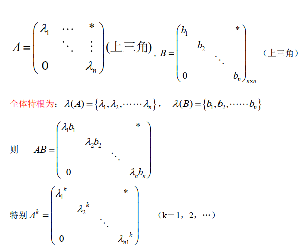

> 相似对角化，正定阵

<!--more-->

## 2.1 基本概念

### 2.1.1 特殊矩阵的乘积

#### 对角阵的乘积

$$
\begin{aligned}
\Lambda=\left(
\begin{matrix}
&\lambda_1 &\quad&\quad&\quad\\
&\quad &\lambda_2 &\quad&\quad\\
&\quad &\quad &\ddots&\quad\\
&\quad &\quad &\quad&\lambda_n\\
\end{matrix}
\right),\Lambda^H\Lambda&=\left(
\begin{matrix}
&\overline{\lambda_1}\lambda_1&\quad&\quad&\quad\\
&\quad &\overline{\lambda_2}\lambda_2 &\quad&\quad\\
&\quad &\quad &\ddots&\quad\\
&\quad &\quad &\quad&\overline{\lambda_n}\lambda_n\\
\end{matrix}
\right)\\
&=\left(
\begin{matrix}
&\vert \lambda_1\vert^2 &\quad&\quad&\quad\\
&\quad &\vert \lambda_2\vert^2 &\quad&\quad\\
&\quad &\quad &\ddots&\quad\\
&\quad &\quad &\quad&\vert \lambda_n\vert^2\\
\end{matrix}
\right)
\end{aligned}
$$

#### 上三角阵的乘积

### 2.1.2 特商公式

$$
\begin{aligned}
&\lambda_1=\frac{X^HAX}{\vert X\vert^2},其中(X\neq 0为\lambda_1的一个特征向量)\\\\
&证明:X^HAX=X^H\lambda X=\lambda X^HX=\lambda \vert X\vert^2(\vert X\vert^2>0)
\end{aligned}
$$

### 2.1.3 许尔公式

#### Xhur 1-1

$$
\begin{aligned}
&任一方阵，A\in C^{n\times n} ，必存在可逆阵P，使P^{-1}AP=B，\\
&B=\left(
\begin{matrix}
&\lambda_1&*&\cdots&*\\
&0&\lambda_2&\cdots&*\\
&\vdots&\vdots &\ddots&\vdots\\
&0&0 &\cdots&\lambda_n\\
\end{matrix}
\right)为上三角阵
\end{aligned}
$$

##### 若当型

$$
\begin{aligned}
由Xhur公式1-1，一定\exist 更好的可逆阵P，使得 P^{-1}AP&=B\\&=\left(
\begin{matrix}
&\lambda_1&*&\quad&\quad\\
&\quad &\lambda_2&*&\quad\\
&\quad &\quad&\ddots&*\\
&\quad&\quad&\quad&\lambda_n
\end{matrix}
\right)\\
，其中*为0或1
\end{aligned}
$$

也称为双线上三角

#### Xhur 1-2

$$
\begin{aligned}
&任一方阵，A\in C^{n\times n} ，必存在U阵Q，使Q^{-1}AQ=Q^HAQ=B，\\
&B=\left(
\begin{matrix}
&\lambda_1&*&\cdots&*\\
&0&\lambda_2&\cdots&*\\
&\vdots&\vdots &\ddots&\vdots\\
&0&0 &\cdots&\lambda_n\\
\end{matrix}
\right)为上三角阵
\end{aligned}
$$

### 2.1.4 Hermite分解定理

$$
\begin{aligned}
若A=A^H是Hermite阵，&则存在U阵Q,使Q^{-1}AQ=Q^HAQ\\\\
&=\Lambda=\left(
\begin{matrix}
&\lambda_1&\quad&\quad\\
&\quad&\ddots&\quad\\
&\quad&\quad&\lambda_n
\end{matrix}
\right)\\
\end{aligned}
$$
有Hermite分解定理， $Q^{-1}AQ=\Lambda$ 可得，$A=Q\Lambda Q^{-1} = Q\Lambda Q^H$

#### 证明

$$
\begin{aligned}
&由许尔公式\Rightarrow 有U阵Q使Q^{-1}AQ=Q^HAQ=B\\
&=\left(
\begin{matrix}
&\lambda_1&*&\cdots&*\\
&0&\lambda_2&\cdots&*\\
&\vdots&\vdots &\ddots&\vdots\\
&0&0 &\cdots&\lambda_n\\
\end{matrix}
\right)\\
&由A是Hermite矩阵，则A^H=A,(Q^HAQ)^H=Q^HA^HQ=Q^HAQ\\
&=\left(
\begin{matrix}
&\overline{\lambda_1}&0&\cdots&0\\
&*&\overline{\lambda_2}&\cdots&0\\
&\vdots&\vdots &\ddots&\vdots\\
&*&* &\cdots&\overline{\lambda_n}\\
\end{matrix}
\right)\\
&由此可见，B为对角阵，且 \lambda_i 为实数
\end{aligned}
$$
#### 推论

$$
1.若A^H=A是Hermite矩阵，则特征根都是实数，\{\lambda_1,\cdots,\lambda_n\}\in R,
$$

证：
$$
\begin{aligned}
&由特商公式\lambda=\frac{X^HAX}{\vert X \vert^2}，其中X\neq 0，为\lambda的特征向量\\
&其中\vert X \vert\ge 0 ，为实数.\therefore 若证\lambda 为实数，即证 X^HAX为实数\\
&已知X^HAX为一维数字，则只需证明(X^HAX)^H=X^HAX即可,\\
&已知A=A^H为Hermite矩阵，(X^HAX)^H=X^HA^HX=X^HAX\in R
\end{aligned}
$$

## 2.2 二次型

### 2.2.1 Hermite二次型定义

$$
\begin{aligned}
&令A^H=A\in C^{n\times n}，X=\left(
\begin{matrix}
x_1\\
x_2\\
\vdots\\
x_n
\end{matrix}
\right),称X^HAX=\left(\overline{x_1},\overline{x_2},\cdots,\overline{x_n}\right)A\left(
\begin{matrix}
x_1\\
x_2\\
\vdots\\
x_n
\end{matrix}
\right)\\
&为矩阵A产生的二次型，记为 f(x)=X^HAX
\end{aligned}
$$

### 2.2.2 正定二次型与正定阵定义

$$
\begin{aligned}
&若A^H=A,对一切X\neq 0,有X^HAX>0,则f(x)=X^HAX为正定二次型，\\
&A为正定阵，记为A>0\\
&若A^H=A,对一切 X\neq 0，有X^HAX\ge 0,则f(x)=X^HAX为半正定二次型\\
&A为半正定阵，记为A\ge 0
\end{aligned}
$$

## 2.3 矩阵合同

$$
\begin{aligned}
若P^HAP&=B(P可逆),则A与B合同，记为A\overset{\Delta}{=}B\\
&1. 对称性:A\overset{\Delta}{=}B\iff B\overset{\Delta}{=}A\\
&2. 传递性:A\overset{\Delta}{=}B,B\overset{\Delta}{=}C\iff A\overset{\Delta}{=}C
\end{aligned}
$$

### 2.3.1 合同保正定

$$
若A与B合同，且A是正定阵，则B也是正定阵
$$

- 相似与合同都能生成新的矩阵，相似不保持正根，合同保持正根

证明：
$$
\begin{aligned}
&要证Y^HBY>0，由A\overset{\Delta}{=}B,且X^HAX>0\\
&令Y=P^{-1}X，(PY)^HA(PY)=Y^HP^HAPY=Y^HBY>0\\
&\therefore B>0
\end{aligned}
$$

### 2.3.2 对角正定阵一定合同于单位阵

$$
\begin{aligned}
若\Lambda&=\left(
\begin{matrix}
&\lambda_1&\quad&\quad\\
&\quad&\ddots&\quad\\
&\quad&\quad&\lambda_n
\end{matrix}
\right),其中\lambda_i>0\\
&\Rightarrow f(x)=X^H\Lambda X=\lambda_1\vert x_1\vert^2+\lambda_2\vert x_2\vert^2+\cdots+\lambda_n\vert x_n\vert^2\\
&\Rightarrow 可分解为\Lambda=\left(
\begin{matrix}
&\sqrt{\lambda_1}&\quad&\quad\\
&\quad&\ddots&\quad\\
&\quad&\quad&\sqrt{\lambda_n}\\
\end{matrix}
\right)I\left(
\begin{matrix}
&\sqrt{\lambda_1}&\quad&\quad\\
&\quad&\ddots&\quad\\
&\quad&\quad&\sqrt{\lambda_n}\\
\end{matrix}
\right)\\
&\quad \quad\quad\quad\quad \quad \quad=PIP\\
&可知P可逆，且P^H=P,故P^HIP=\Lambda\\
&即对角正定阵合同于单位阵，记为\Lambda\overset{\Delta}{=}I
\end{aligned}
$$

## 2.4 正定阵

### 2.4.1 正定阵的定理

$$
\begin{aligned}
&1.若A为正定阵，则\{\lambda_1,\lambda_2,\cdots,\lambda_n\}>0\\
&2.若A为半正定阵，则\{\lambda_1,\lambda_2,\cdots,\lambda_n\}\ge 0
\end{aligned}
$$

证明：
$$
若A为正定阵，则A生成的二次型f(x)=X^HAX>0 \\
\therefore \lambda_i=\frac{X^HAX}{\vert X\vert^2}>0
$$

### 2.4.2 **正定阵等价条件**

$$
A>0\iff 若A为Hermite阵，且\lambda_1,\lambda_2,\cdots,\lambda_n > 0\\
A\ge 0 \iff 若A为Hermite阵，且\lambda_1,\lambda_2,\cdots,\lambda_n \ge 0
$$

证明：
$$
\begin{aligned}
&由Hermite分解定理，Q为U阵，Q^HAQ=\Lambda=\left(
\begin{matrix}
&\lambda_1&\quad&\quad\\
&\quad&\ddots&\quad\\
&\quad&\quad&\lambda_n\\
\end{matrix}
\right)\\
&\therefore A\overset{\Delta}{=}\Lambda,而\lambda_i>0，\Lambda 为正定阵，故A为正定阵
\end{aligned}
$$
**单位阵是正定阵** ：$\lambda_i= 1$ 显然大于0

### 2.4.3 正定阵必合同

1. $A>0 \iff A\overset{\Delta}{=}I$
2. 若A,B为同阶正定阵，则 $A\overset{\Delta}{=} B$ 

证明1：
$$
\begin{aligned}
&若A正定，则有A^H=A\\
&由Hermite分解定理，必\exist U阵Q使得Q^HAQ=\Lambda,且\lambda_i>0\\
&由引理\Lambda \overset{\Delta}{=}I,结论得证
\end{aligned}
$$
证明2：
$$
\begin{aligned}
&由A>0,B>0,则A\overset{\Delta}{=}I,B\overset{\Delta}{=}I\Rightarrow A\overset{\Delta}{=}B
\end{aligned}
$$

### 2.4.4 正定阵分解

#### $A=P^HP$

$$
定理：若A>0\iff A=P^HP(P可逆)=PP^H(P可逆)\\
$$

**$\Rightarrow$**
$$
\begin{aligned}
&若A是正定阵，则A必是Hermite阵，A的特征值是正实数\\
&又\because 正定阵一定与单位阵合同，即A\overset{\Delta}{=}\Lambda=\sqrt{\Lambda}I\sqrt{\Lambda},\\
&令P=\sqrt{\Lambda},可知P可逆，且P^H=P\\
&得证结论，A>0\Rightarrow A=P^HP=PP^H
\end{aligned}
$$
**$\Leftarrow$**
$$
\begin{aligned}
&若A=P^HP=P^HIP,由于P可逆，则A\overset{\Delta}{=}I>0,则A是正定阵
\end{aligned}
$$

$$
\begin{aligned}
&由二次型X^HAX=X^HP^HPX=(PX)^H(PX)=\vert PX\vert^2>0,为正定二次型\\
&\therefore A是正定阵
\end{aligned}
$$

#### 平方根定理

$$
\begin{aligned}
&A>0\Rightarrow \exist B>0,使得，A=B\bullet B=B^2
\end{aligned}
$$

证明：

1. $\exist B,使得A=B\bullet B$

$$
\begin{aligned}
&\because A>0，则A^H=A，由Hermite分解定理\Rightarrow 存在U阵Q，使得Q^HAQ=\Lambda\\
&=\left(
\begin{matrix}
&\lambda_1&\quad&\quad\\
&\quad&\ddots&\quad\\
&\quad&\quad&\lambda_n
\end{matrix}
\right)=\left(
\begin{matrix}
&\sqrt{\lambda_1}\quad&\quad\\
&\quad&\ddots&\quad\\
&\quad&\quad&\sqrt{\lambda_n}
\end{matrix}
\right)^2=\Lambda'^2,\quad(\lambda_i > 0)\\
&而A=Q\Lambda Q^H=Q\sqrt{\Lambda}\sqrt{\Lambda}Q^H=Q\sqrt{\Lambda}Q^HQ\sqrt{\Lambda}Q^H\\
&令B=Q\sqrt{\Lambda}Q^H，则A=B^2
\end{aligned}
$$

2. $B是正定阵$

$$
\begin{aligned}
&由Hermite分解定理，\exist U阵Q，使得Q^HAQ=\Lambda=\\
&\left(
\begin{matrix}
&\sqrt{\lambda_1}\quad&\quad\\
&\quad&\ddots&\quad\\
&\quad&\quad&\sqrt{\lambda_n}
\end{matrix}
\right)^2=\Lambda'^2,\Lambda'=\sqrt{\Lambda}>0,为正定阵\\
&已知Q^H\sqrt{\Lambda}Q=B,即B\overset{\Delta}{=}\sqrt{\Lambda}>0,B为正定阵
\end{aligned}
$$

### 2.4.5 乘积形式的正定阵

$$
\begin{aligned}
&1. 对一切矩阵A=A_{n\times p}，有A^HA\ge0,A^HA\ge0\\
&2. 且r(A^HA)=r(AA^H)=r(A)
\end{aligned}
$$

#### 证1

$$
\begin{aligned}
若矩阵A_{n\times p} &= \left(
\begin{matrix}
&a_{11}&a_{12}&\cdots&a_{1p}\\
&a_{21}&a_{22}&\cdots&a_{2p}\\
&\vdots&\vdots&\ddots&\vdots\\
&a_{n1}&a_{n2}&\cdots&a_{np}\\
\end{matrix}
\right),A^H=\left(
\begin{matrix}
&a_{11}&a_{21}&\cdots&a_{n1}\\
&a_{12}&a_{22}&\cdots&a_{n2}\\
&\vdots&\vdots&\ddots&\vdots\\
&a_{1p}&a_{2p}&\cdots&a_{np}\\
\end{matrix}
\right)\\
A^HA&=\left(
\begin{matrix}
&\overline{a_{11}}a_{11}+...+\overline{a_{n1}}a_{n1}&*&*\\
&*&\ddots&*\\
&*&\cdots&\overline{a_{1p}}a_{1p}+...+\overline{a_{np}}a_{np}\\
\end{matrix}
\right)\ge 0\\
\therefore & \quad A^HA为半正定矩阵
\end{aligned}
$$

#### 证2

$$
\begin{aligned}
&1. 二次型f(x)=X^HA^HAX=(AX)^H(AX)=\vert AX \vert^2\ge 0,\\
&由(A^HA)^H=A^HA,可知A^HA为Hermite阵\\
&同理，二次型f(y)=Y^HAA^HY=(A^HY)^H(A^HY)=\vert A^HY \vert^2\ge 0,\\
&\therefore A^HA与AA^H都只有非负根，可写为\lambda(A^HA)=\{\lambda_1,\lambda_2,...\lambda_p\}\ge 0\\
&\lambda(AA^H)=\{\lambda_1,\lambda_2,...,\lambda_p,0,0,...,0\}\ge 0\\
&r(A^HA)=r(AA^H)=p=r(A)=r(A^H)
\end{aligned}
$$

$$
\begin{aligned}
&齐次方程组AX=0,A^HAX=0，解集相同(同解)\\
&若(A^HA)X=0成立，则\vert AX \vert^2=(AX)^H(AX)=X^HA^HAX=(AX)^2=0\\
&\therefore AX=0,r(A^HA)=r(A)
\end{aligned}
$$

### 2.4.6 矩阵的秩

1. 若 $A=A_{n\times p},n>p$ ，(列满秩)，即 $r(A)=p\le n$

   $r(A^HA)=p=r(A)=r(AA^H)$

   $r(A)=r(A^H)=r(\overline{A})$

2. $r(AB)<min\{r(A),r(B)\}$

## 2.5 正定阵与特征向量

$$
\begin{aligned}
&若P^{-1}AP=\Lambda=\left(
\begin{aligned}
&\lambda_1&&\\
&&\ddots&\\
&&&\lambda_n
\end{aligned}
\right),则P中的(X_1,X_2,\cdots,X_n)都是A的特征向量\\
&且X_1,X_2,\cdots,X_n都是A的特征向量，且X_1,\cdots,X_n无关
\end{aligned}
$$

### 2.5.1 推论

$$
\begin{aligned}
若A=A^H\in C^{n\times n} ，则A有n个互相正交的特征向量，即X_1\bot X_2\bot...\bot X_n
\end{aligned}
$$

#### 证明

$$
\begin{aligned}
&若A为Hermite阵，则\exist U阵Q，使Q^{-1}AQ=Q^HAQ=\Lambda=\left(
\begin{matrix}
&\lambda_1&&\\
&&\ddots&\\
&&&\lambda_n
\end{matrix}
\right)\\
&令Q=(X_1,X_2,\cdots,X_n)，则X_1\bot X_2\bot...\bot X_n,\\
&AQ=Q\Lambda\iff \left(
\begin{matrix}
&AX_1&&\\
&&AX_2&&\\
&&&\ddots&\\
&&&&AX_n
\end{matrix}
\right)=\left(
\begin{matrix}
&\lambda_1X_1&&&\\
&&\lambda_2X_2&&\\
&&&\ddots&\\
&&&&\lambda_nX_n
\end{matrix}
\right)\\
&即X_i为矩阵A的\lambda_i的特征向量
\end{aligned}
$$

