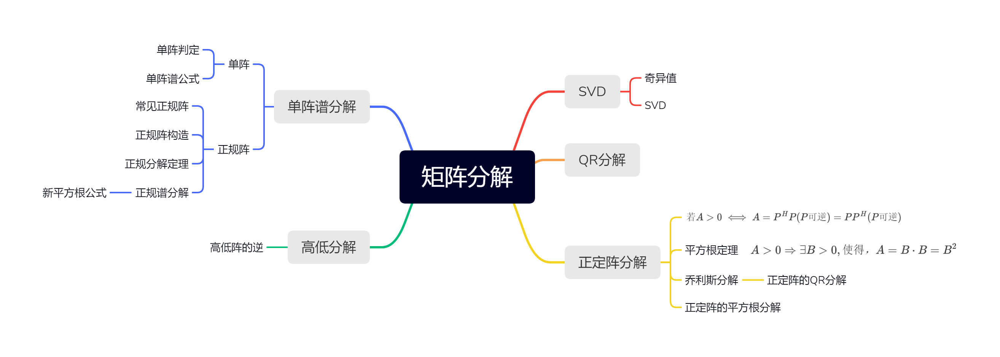

> 矩阵分解可以得到简化的乘积矩阵，可以简化后续的计算与处理度

<!--more-->

## 2.1 奇异值与SVD

### 2.1.1 奇异值

$$
\begin{aligned}
&给定A=A_{n\times p} ，则A^HA与AA^H有相同的正根\lambda_1\ge \lambda_2\ge \cdots\ge\lambda_r\ge0\\
&称\sqrt{\lambda_1},\sqrt{\lambda_2},\cdots,\sqrt{\lambda_r}为A的奇异值\\\\
&若r(A^HA)=r(AA^H)=r(A)=r，恰有r个正根\lambda_1\ge\lambda_2\ge\cdots\ge \lambda_r > 0，则称\\
&\sqrt{\lambda_1},\sqrt{\lambda_2},\cdots,\sqrt{\lambda_r} 为A的正奇异值\\
&记作 S_+(A)=\{s_1,s_2,\cdots,s_r\}=\{\sqrt{\lambda_1},\sqrt{\lambda_2},\cdots,\sqrt{\lambda_r}\},且\sqrt{\lambda_1} 称为最大奇异值\\\\
&对于n阶方阵A=A_{n\times n} ，则A^HA与AA^H有n个相同非负根,则\lambda_1\ge\cdots\ge \lambda_n\ge 0\\
&，此时\sqrt{\lambda_1},\sqrt{\lambda_2},\cdots,\sqrt{\lambda_n}为A的全体奇异值，记作S(A)=\{s_1,s_2,\cdots,s_n\}\\
&=\{\sqrt{\lambda_1},\sqrt{\lambda_2},\cdots,\sqrt{\lambda_n}\},\lambda_1\ge \cdots\ge \lambda_r，\lambda_{r+1}=\cdots=\lambda_n=0
\end{aligned}
$$

#### a. 正奇值例题

$$
\begin{aligned}
&(1)A=\left(
\begin{matrix}
1&2\\
0&0\\
0&0
\end{matrix}
\right)\quad (2)A=\left(
\begin{matrix}
1&1\\
0&0\\
1&1
\end{matrix}
\right)
\quad (3)A=\left(
\begin{matrix}
1&-1\\
1&1
\end{matrix}
\right)
\\\\
&(1)A^HA=\left(
\begin{matrix}
1&2\\
2&4
\end{matrix}
\right),为秩1矩阵，可知\lambda(A^HA)=\{5,0\}\\
&\therefore s^+(A)=\{\sqrt{5}\}\\\\
&(2)A^HA=\left(
\begin{matrix}
2&2\\
2&2
\end{matrix}
\right)，为秩1矩阵，则\lambda(A)=\{4,0\}\\
&则s^+(A)=\{2\}\\\\
&(3)A^HA=\left(
\begin{matrix}
2&0\\
0&2
\end{matrix}
\right),为对角阵，\therefore\lambda(A^HA)=\{2,2\}\\
&则 s^+(A)=\{\sqrt{2},\sqrt{2}\}
\end{aligned}
$$

#### b. 半正定Hermite阵的奇异值与特征值相同

$$
\begin{aligned}
&设全体特征值为 \lambda(A)=\{\lambda_1,\cdots,\lambda_n\}，且A^H=A\Rightarrow A^HA=A^2,\\
&\therefore 可知\lambda(A^HA)=\lambda(A^2)=\{\lambda_1^2,\cdots,\lambda_n^2\}\\
&\because A半正定可知\lambda_1\ge 0,\cdots,\lambda_n\ge 0\\
&故，全体奇异值s(A)=\{\sqrt{\lambda_1^2},\cdots,\sqrt{\lambda_n^2}\}=\{\lambda_1,\cdots,\lambda_n\}=\lambda(A)
\end{aligned}
$$

### 2.1.2 奇异值分解SVD

#### a. 正SVD

$$
\begin{aligned}
&设A=A_{m\times n}，r(A)>0,正奇值\sqrt{\lambda_1},\cdots,\sqrt{\lambda_r},则有分解A=P\Delta Q^H\\
&其中\Delta=\left(
\begin{matrix}
&\sqrt{\lambda_1}&&\\
&&\ddots&\\
&&&\sqrt{\lambda_r}
\end{matrix}
\right)，P_{m\times r}，Q_{n\times r}为半U阵,P^HP=I_r=Q^HQ\\
&可写正SVD公式A=P\left(
\begin{matrix}
&\sqrt{\lambda_1}&&\\
&&\ddots&\\
&&&\sqrt{\lambda_r}
\end{matrix}
\right)Q^H
\end{aligned}
$$

---

**证明**

1. $P_{m\times r}，Q_{n\times r}$ 的构造

$$
\begin{aligned}
&A^HA为Hermite阵，由Hermite分解定理，存在U阵\\
&使U^H(A^HA)U=\left(
\begin{matrix}
&\lambda_1&&\\
&&\ddots&\\
&&&\lambda_n
\end{matrix}
\right)_{n\times n}，\\
&,且A^HA为半正定阵，有\lambda_1,\cdots,\lambda_r>0,\lambda_{r+1}=\cdots=\lambda_n=0,r(A)=r\\
&而U的列向量(q_1,q_2,\cdots,q_n)为 A^HA 的特征向量\\
&且A^HAq_1=\lambda_1q_1,\cdots,A^HAq_r=\lambda_rq_r,A^HAq_{r+1}=0,A^HAq_{n}=0\\\\
&令Q=(q_1,q_2,\cdots,q_r)_{n\times r}，P=(\frac{Aq_1}{\vert Aq_1\vert},\cdots,\frac{Aq_r}{\vert Aq_r\vert})_{m\times r}
\end{aligned}
$$

2. P与Q为半U阵
   $$
   \begin{aligned}
   &已知Q中列向量为U阵的r个非零列向量，则Q为半U阵\\
   &而(Aq_1,Aq_2)=(Aq_2)^H(Aq_1)=q_2A^HAq_1=\lambda_1q_2^Hq_1=(\lambda_1q_1,q_2)=0\\
   &同理，Aq_i与Aq_j都正交\\
   &\vert Aq_1\vert^2=(Aq_1)^H(Aq_1)=q_1^HA^HAq_1=\lambda_1q_1^Hq_1=\lambda_1\ge0\\
   &\quad\quad\quad\Rightarrow P=\left(\frac{Aq_1}{\vert Aq_1 \vert},\frac{Aq_2}{\vert Aq_2 \vert},\cdots,\frac{Aq_r}{\vert Aq_r \vert}\right)=\left(\frac{Aq_1}{\sqrt{\lambda_1}},\frac{Aq_2}{\sqrt{\lambda_2}},\cdots,\frac{Aq_r}{\sqrt{\lambda_r}}\right)\\
   &即P阵为半U阵
   \end{aligned}
   $$
   
3. 代入P,Q
   $$
   \begin{aligned}
   &P\Delta Q^H=\left(\frac{Aq_1}{\sqrt{\lambda_1}},\frac{Aq_2}{\sqrt{\lambda_2}},\cdots,\frac{Aq_r}{\sqrt{\lambda_r}}\right)\left(
   \begin{matrix}
   &\sqrt{\lambda_1}&&\\
   &&\ddots&\\
   &&&\sqrt{\lambda_r}
   \end{matrix}
   \right)\left(
   \begin{matrix}
   q_1^H\\
   q_2^H\\
   \vdots\\
   q_r^H
   \end{matrix}
   \right)\\
   &=(Aq_1,Aq_2,\cdots,Aq_r)\left(
   \begin{matrix}
   q_1^H\\
   q_2^H\\
   \vdots\\
   q_r^H
   \end{matrix}
   \right)=\left(Aq_1q_1^H,Aq_2q_2^H,，\cdots,Aq_rq_r^H,\right)
   \end{aligned}
   $$

4. 验证 $\left(Aq_1q_1^H,Aq_2q_2^H,，\cdots,Aq_rq_r^H,\right)=A$
   $$
   \begin{aligned}
   &由A^HA为半正定Hermite阵，r(A^HA)=r\\
   &由同解定理，A^HAx=0\iff Ax=0\\
   &A^HAq_{r+1}=\cdots=A^HAq_{n}=0\Rightarrow Aq_{r+1}=\cdots=Aq_{n}=0\\
   &\Rightarrow A(q_{r+1}q_{r+1}^H+\cdots+q_nq_n^H)=0\\
   &而A(q_1q_1^H+\cdots+q_rq_r^H+q_{r+1}q_{r+1}^H+\cdots+q_nq_n^H)=AI=A\\
   &即A(q_1q_1^H+\cdots+q_rq_r^H)=A
   \end{aligned}
   $$

最后得证 正SVD公式，$A=P\Delta Q^H=P\left(
\begin{matrix}
&\sqrt{\lambda_1}&&\\
&&\ddots&\\
&&&\sqrt{\lambda_r}
\end{matrix}
\right)Q^H$

##### 分解方法

1. 求 $A^HA$ 的特征值，$\lambda_1\ge\cdots,\ge\lambda_r>0$

   正奇值为 $\sqrt{\lambda_1},\cdots\sqrt{\lambda_r}$

2. 求 $\lambda_1,\cdots,\lambda_r$ 的正交特征向量（不必单位化）

3. 令列半U阵 $Q=\left(\frac{X_1}{\vert X_1\vert},\cdots,\frac{X_r}{\vert X_r\vert}\right),P=\left(\frac{AX_1}{\vert AX_1\vert},\cdots,\frac{AX_r}{\vert AX_r\vert}\right)$

###### eg

$$
\begin{aligned}
A=\left(
\begin{matrix}
1&1\\
0&0\\
1&1
\end{matrix}
\right)
\end{aligned}
$$

---

$$
\begin{aligned}
&A^HA=\left(
\begin{matrix}
2&2\\
2&2
\end{matrix}
\right),由A^HA为秩1矩阵，得\lambda=\{4,0\}，正奇值为\sqrt(\lambda)=\sqrt{2}\\
&而\lambda_1=4的特征向量为X_1=\left(
\begin{matrix}
1\\1
\end{matrix}
\right),则\Delta=\left(
2
\right)\\
&令Q=\left(\frac{X_1}{\vert X_1\vert}\right)=\left(
\begin{matrix}
\frac{1}{\sqrt{2}}\\
\frac{1}{\sqrt{2}}
\end{matrix}
\right),P=\left(
\begin{matrix}
\frac{AX_1}{\vert AX_1\vert}
\end{matrix}
\right)=\left(
\begin{matrix}
\frac{1}{\sqrt{2}}\\0\\\frac{1}{\sqrt{2}}
\end{matrix}
\right)\\
&则A的正SVD为A=P\Delta Q^H=\left(
\begin{matrix}
\frac{1}{\sqrt{2}}\\0\\\frac{1}{\sqrt{2}}
\end{matrix}
\right)\left(2\right)\left(
\frac{1}{\sqrt{2}},\frac{1}{\sqrt{2}}
\right)
\end{aligned}
$$

考虑 $B=\left(
\begin{matrix}
1&0&1\\1&0&1\\
\end{matrix}
\right)$ 的正SVD

---

$$
\begin{aligned}
&已知B=A^H,且有A的正SVD，A=P\Delta Q^H=\left(
\begin{matrix}
\frac{1}{\sqrt{2}}\\0\\\frac{1}{\sqrt{2}}
\end{matrix}
\right)\left(2\right)\left(
\frac{1}{\sqrt{2}},\frac{1}{\sqrt{2}}
\right)\\
&B=(P\Delta Q^H)^H=Q\Delta P^H=\left(
\begin{matrix}
\frac{1}{\sqrt{2}}\\\frac{1}{\sqrt{2}}
\end{matrix}
\right)\left(2\right)\left(
\frac{1}{\sqrt{2}},0,\frac{1}{\sqrt{2}}
\right)
\end{aligned}
$$

#### b. SVD(将P，Q，D都扩充为方阵)

$$
\begin{aligned}
&设A=A_{m\times n}，r(A)>0,正奇值\sqrt{\lambda_1},\cdots,\sqrt{\lambda_r}>0,则有分解A=W\Delta V^H\\
&其中D=\left(
\begin{matrix}
\Delta&0\\
0&0
\end{matrix}
\right)_{m\times n}，W_{m\times m}=(P,P_1),V_{n\times n}=(Q,Q_1)\\
&可写SVD公式A=W\left(
\begin{matrix}
\Delta&0\\
0&0
\end{matrix}
\right)V^H=P\Delta Q^H,其中\left(
\begin{matrix}
\sqrt{\lambda_1}&&\\
&\ddots&\\
&&\sqrt{\lambda_r}
\end{matrix}
\right)
\end{aligned}
$$

**证明:**
$$
\begin{aligned}
&由正SVD：A=P\Delta Q^H,分别把P，Q扩充为U阵，即W=(P,P_1),V=(Q,Q_1)，\\
&V^H=\left(
\begin{matrix}
Q^H\\
A_1^H
\end{matrix}
\right),则WDV^H=(P,P_1)\left(
\begin{matrix}
\Delta&0\\
0&0
\end{matrix}
\right)\left(
\begin{matrix}
Q^H\\
A_1^H
\end{matrix}
\right)=\left(
P\Delta\quad 0\\
\right)\left(
\begin{matrix}
Q^H\\
A_1^H
\end{matrix}
\right)=P\Delta Q^H
\end{aligned}
$$

##### 分解方法

1. 求 $A^HA$ 的特征值，$\lambda_1\ge\cdots,\ge\lambda_r>0$

   正奇值为 $\sqrt{\lambda_1},\cdots\sqrt{\lambda_r}$

2. 求 $\lambda_1,\cdots,\lambda_r$ 的正交特征向量（不必单位化）

3. 令列U半阵 $Q=\left(\frac{X_1}{\vert X_1\vert},\cdots,\frac{X_r}{\vert X_r\vert}\right),P=\left(\frac{AX_1}{\vert AX_1\vert},\cdots,\frac{AX_r}{\vert AX_r\vert}\right)$ ，则有正SVD：$A=P\Delta Q^H$ 

4. 将P，Q扩充为W，V **扩充方法不唯一** 由证明可知，不管 $P_1,Q_1$ 为何，都会被消去

   得SVD公式 $A=WDV^H$

###### eg

$$
\begin{aligned}
A=\left(
\begin{matrix}
1&1\\
0&0\\
1&1
\end{matrix}
\right)
\end{aligned}
$$

$$
\begin{aligned}
&扩充为两个U阵V=\left(Q,X\right)=\left(
\begin{matrix}
\frac{1}{\sqrt{2}}&\frac{1}{\sqrt{2}}\\
\frac{1}{\sqrt{2}}&-\frac{1}{\sqrt{2}}
\end{matrix}
\right),W=\left(P,Y\right)=\left(
\begin{matrix}
\frac{1}{\sqrt{2}}&0&\frac{1}{\sqrt{2}}\\
0&0&0\\
\frac{1}{\sqrt{2}}&0&-\frac{1}{\sqrt{2}}
\end{matrix}
\right)\\
&则有奇异分解SVD，A=\left(
\begin{matrix}
\frac{1}{\sqrt{2}}&0&\frac{1}{\sqrt{2}}\\
0&0&0\\
\frac{1}{\sqrt{2}}&0&-\frac{1}{\sqrt{2}}
\end{matrix}
\right)\left(
\begin{matrix}
2&0\\
0&0\\
0&0
\end{matrix}
\right)\left(
\begin{matrix}
\frac{1}{\sqrt{2}}&\frac{1}{\sqrt{2}}\\
\frac{1}{\sqrt{2}}&-\frac{1}{\sqrt{2}}
\end{matrix}
\right)
\end{aligned}
$$

---

$$
\begin{aligned}
A=\left(
\begin{matrix}
2i&1\\
1&i\\
1&i
\end{matrix}
\right)
\end{aligned}
$$

$$
\begin{aligned}
&A^HA=\left(
\begin{matrix}
-2i&1&1\\
1&-i&-i
\end{matrix}
\right)\left(
\begin{matrix}
2i&1\\
1&i\\
1&i
\end{matrix}
\right)=\left(
\begin{matrix}
6&0\\
0&3
\end{matrix}
\right)，可知正奇值S(A)_+=\{\sqrt{6},\sqrt{3}\}\\
&\lambda_1=6,X_1=\left(
\begin{matrix}
1\\0
\end{matrix}
\right),AX_1=\left(
\begin{matrix}
2i\\1\\1
\end{matrix}
\right)\vert AX_1\vert=\sqrt{6};\lambda_2=3,X_2=\left(
\begin{matrix}
0\\1
\end{matrix}
\right),AX_2=\left(
\begin{matrix}
1\\i\\i
\end{matrix}
\right)\\
&令Q=\left(
\begin{matrix}
X_1,X_2
\end{matrix}
\right)=\left(
\begin{matrix}
1&0\\0&1
\end{matrix}
\right),P=\left(
\begin{matrix}
\frac{AX_1}{\vert AX_1\vert},\frac{AX_2}{\vert AX_2\vert}
\end{matrix}
\right)=\left(
\begin{matrix}
\frac{2i}{\sqrt{6}}&\frac{1}{\sqrt{3}}\\
\frac{1}{\sqrt{6}}&\frac{i}{\sqrt{3}}\\
\frac{1}{\sqrt{6}}&\frac{i}{\sqrt{3}}
\end{matrix}
\right)\\
&则有正SVD，A=P\Delta Q^H=\left(
\begin{matrix}
\frac{2i}{\sqrt{6}}&\frac{1}{\sqrt{3}}\\
\frac{1}{\sqrt{6}}&\frac{i}{\sqrt{3}}\\
\frac{1}{\sqrt{6}}&\frac{i}{\sqrt{3}}
\end{matrix}
\right)\left(
\begin{matrix}
\sqrt{6}&\\
&\sqrt{3}
\end{matrix}
\right)\left(
\begin{matrix}
1&0\\0&1
\end{matrix}
\right)^H\\
&可知SVD，A=WDV=\left(
\begin{matrix}
\frac{2i}{\sqrt{6}}&\frac{1}{\sqrt{3}}&0\\
\frac{1}{\sqrt{6}}&\frac{i}{\sqrt{3}}&\frac{1}{\sqrt{2}}\\
\frac{1}{\sqrt{6}}&\frac{i}{\sqrt{3}}&-\frac{1}{\sqrt{2}}
\end{matrix}
\right)\left(
\begin{matrix}
\sqrt{6}&\\
&\sqrt{3}
\end{matrix}
\right)\left(
\begin{matrix}
1&0\\0&1
\end{matrix}
\right)^H
\end{aligned}
$$

---

**一个SVD解答**
$$
\begin{aligned}
A=\left(
\begin{matrix}
i&2\\
1&i\\1&i
\end{matrix}
\right)，求正SVD与SVD
\end{aligned}
$$

$$
\begin{aligned}
&\because A^HA=\left(
\begin{matrix}
-i&1&1\\
2&-i&-i
\end{matrix}
\right)\left(
\begin{matrix}
i&2\\
1&i\\1&i
\end{matrix}
\right)=\left(
\begin{matrix}
3&0\\
0&6
\end{matrix}
\right)为对角阵，令\lambda_1=3,\lambda_2=6\\
&A^H有两个特向X_1=\left(
\begin{matrix}
1\\0
\end{matrix}
\right),X_2=\left(
\begin{matrix}
0\\1
\end{matrix}
\right)(互正交)，正奇值为 \sqrt{\lambda_1}=\sqrt{3},\sqrt{\lambda_2}=\sqrt{6}\\
&AX_1=\left(
\begin{matrix}
i\\1\\1
\end{matrix}
\right),AX_2=\left(
\begin{matrix}
2\\i\\i
\end{matrix}
\right),\vert AX_1 \vert=\sqrt{3},\vert AX_2 \vert=\sqrt{6}\\
&令P=\left(
\frac{AX_1}{\vert AX_1\vert},\frac{AX_2}{\vert AX_2\vert}
\right)=\left(
\begin{matrix}
\frac{i}{\sqrt{3}}&\frac{2}{\sqrt{6}}\\
\frac{1}{\sqrt{3}}&\frac{i}{\sqrt{6}}\\
\frac{i}{\sqrt{3}}&\frac{i}{\sqrt{6}}\\
\end{matrix}
\right),则正SVD\\
&A=P\Delta Q^H=\left(
\begin{matrix}
\frac{i}{\sqrt{3}}&\frac{2}{\sqrt{6}}\\
\frac{1}{\sqrt{3}}&\frac{i}{\sqrt{6}}\\
\frac{i}{\sqrt{3}}&\frac{i}{\sqrt{6}}\\
\end{matrix}
\right)\left(
\begin{matrix}
\sqrt{3}&\\
&\sqrt{6}
\end{matrix}
\right)\left(
\begin{matrix}
1&0\\
0&1
\end{matrix}
\right)
\end{aligned}
$$

$$
\begin{aligned}
&令W=(P,P_1)=\left(
\begin{matrix}
\frac{i}{\sqrt{3}}&\frac{2}{\sqrt{6}}&0\\
\frac{1}{\sqrt{3}}&\frac{i}{\sqrt{6}}&\frac{1}{\sqrt{2}}\\
\frac{i}{\sqrt{3}}&\frac{i}{\sqrt{6}}&-\frac{1}{\sqrt{2}}\\
\end{matrix}
\right),或\left(
\begin{matrix}
\frac{i}{\sqrt{3}}&\frac{2}{\sqrt{6}}&0\\
\frac{1}{\sqrt{3}}&\frac{i}{\sqrt{6}}&\frac{i}{\sqrt{2}}\\
\frac{i}{\sqrt{3}}&\frac{i}{\sqrt{6}}&-\frac{i}{\sqrt{2}}\\
\end{matrix}
\right),\\
&有SVD，A=\left(
\begin{matrix}
\frac{i}{\sqrt{3}}&\frac{2}{\sqrt{6}}&0\\
\frac{1}{\sqrt{3}}&\frac{i}{\sqrt{6}}&\frac{1}{\sqrt{2}}\\
\frac{i}{\sqrt{3}}&\frac{i}{\sqrt{6}}&-\frac{1}{\sqrt{2}}\\
\end{matrix}
\right)\left(
\begin{matrix}
\sqrt{3}&0\\
0&\sqrt{6}\\
0&0
\end{matrix}
\right)\left(
\begin{matrix}
1&0\\
0&1
\end{matrix}
\right)
\end{aligned}
$$

#### c. 当A是向量时

$$
\begin{aligned}
&A=\left(
\begin{matrix}
a_1\\
\vdots\\
a_n
\end{matrix}
\right)\neq 0,则其正SVD
\end{aligned}
$$

---

$$
\begin{aligned}
&A^HA=\left(\overline{a_1},\cdots,\overline{a_n}\right)\left(
\begin{matrix}
a_1\\
\vdots\\
a_n
\end{matrix}
\right)=\vert a_1\vert^2+\cdots+\vert a_n\vert^2>0\\
&\lambda_1=\vert a_1 \vert^2+\cdots+\vert a_n\vert^2，令\Delta=\left(\sqrt{\lambda_1}\right),Q=(1)\\
&X_1=(1)，P=\frac{1}{\sqrt{\vert a_1 \vert^2+\vert a_2 \vert^2+\cdots+\vert a_n \vert^n}}\left(
\begin{matrix}
a_1\\\vdots\\a_n
\end{matrix}
\right),\\
&正SVD：A=P\Delta Q^H=\\
&\frac{1}{\sqrt{\vert a_1 \vert^2+\vert a_2 \vert^2+\cdots+\vert a_n \vert^n}}\left(
\begin{matrix}
a_1\\\vdots\\a_n
\end{matrix}
\right)\left(\sqrt{\vert a_1 \vert^2+\vert a_2 \vert^2+\cdots+\vert a_n}\right)\left(1\right)
\end{aligned}
$$

#### d. $A^H$与A的SVD只需求一个

$$
若已知正SVD，A=P\Delta Q^H,可得A^H的正SVD=(P\Delta Q^H)^H
$$

$$
\begin{aligned}
A=\left(
\begin{matrix}
2&0&0\\
3&0&0
\end{matrix}
\right)与B=A^H的正SVD与SVD
\end{aligned}
$$

---

### 2.1.3 正SVD的等价写法

$$
\begin{aligned}
&A=P\Delta Q^H,\Delta=\left(
\begin{matrix}
s_1&&\\
&\ddots&\\
&&s_r
\end{matrix}
\right),令P=\left(\frac{AX_1}{\vert AX_1\vert},\cdots,\frac{AX_r}{\vert AX_r\vert} \right)=\left(p_1,\cdots,p_r\right)\\
&Q=\left(X_1,\cdots,X_r\right)=\left(q_1,\cdots,q_r\right),则有正SVD\\
&A=s_1p_1q_1^H+\cdots+s_rp_rq_r^H
\end{aligned}
$$

## 2.2 QR分解

### 2.2.1 Schmidt正交化

设有3个n阶向量 $\alpha_1,\alpha_2,\alpha_3$ 线性无关
$$
\begin{aligned}
令&\beta_1=\alpha_1\\
&\beta_2=\alpha_2-\frac{(\alpha_2,\beta_1)}{\vert \beta_1\vert^2}\\
&\beta_3=\alpha_3-\frac{(\alpha_3,\beta_2)}{\vert \beta_2\vert^2}-\frac{(\alpha_1,\beta_2)}{\vert \beta_2\vert^2}
\end{aligned}
$$
用 Schmidt 方法可构造半U阵 $Q=\left(\frac{\beta_1}{\vert \beta_1\vert},\frac{\beta_2}{\vert \beta_2\vert},\frac{\beta_3}{\vert \beta_3\vert}\right)$ 是半U阵，可知 $Q^HQ=I$

#### 2.2.2 QR分解

#### a. 定义

##### case1

$$
\begin{aligned}
&设A=\left(\alpha_1,\cdots,\alpha_p\right)_{n\times p}，列无关(高阵)，则有分解A=QR，其中\\
&Q=\left(\epsilon_1,\cdots,\epsilon_p \right)_{n\times p}为半U阵，R=\left(
\begin{matrix}
b_1&&*\\
&\ddots&\\
0&&b_p
\end{matrix}
\right)是上三角,b_p>0
\end{aligned}
$$

###### Q阵求法

$$
\begin{matrix}
&由Schmidt公式，产生正交向量组\beta_1,\beta_2,\cdots,\beta_p，\\
&\epsilon_1=\frac{\beta_1}{\vert \beta_1\vert},\cdots,\epsilon_1=\frac{\beta_p}{\vert \beta_p\vert}，则Q是半U阵，Q^HQ=I
\end{matrix}
$$

###### R阵求法

$$
\begin{aligned}
A=QR,则Q^HA=Q^HQR=R\Rightarrow R=Q^HA
\end{aligned}
$$

##### case2

$$
\begin{aligned}
&设方阵A=\left(\alpha_1,\cdots,\alpha_n\right)可逆，则有A=QR，其中\\
&Q=Q_{n\times n} 是U阵，R=\left(
\begin{matrix}
b_1&&*\\
&\ddots&\\
0&&b_p
\end{matrix}
\right)是上三角，且b_i>0
\end{aligned}
$$

###### case 3

$$
\begin{aligned}
任一方阵A=A_{n\times n}都有A=QR，Q是U阵，R=\left(
\begin{matrix}
b_1&&*\\
&\ddots&\\
0&&b_p
\end{matrix}
\right)是上三角
\end{aligned}
$$

#### b. QR分解步骤

1. 先用 Schmidt 公式，求U阵Q或半U阵Q
2. 在用 $R=Q^HA$，求上三角阵R
3. 写出分解A=QR

**eg**
$$
\begin{aligned}
&A=\left(
\begin{matrix}
1&2i\\
i&1\\
i&0
\end{matrix}
\right)=\left(\alpha_1,\alpha_2\right)，求QR分解
\end{aligned}
$$

$$
\begin{aligned}
&\beta_1=\alpha_1=\left(
\begin{matrix}
1\\i\\i
\end{matrix}
\right),\beta_2=\alpha_1-\frac{(\alpha_2,\beta_1)}{\vert \beta_2 \vert^2}\beta_1=\frac{1}{3}\left(
\begin{matrix}
5i\\4\\1
\end{matrix}
\right)\\
&\epsilon_1=\frac{\beta_1}{\vert \beta_1 \vert}=\frac{1}{\sqrt{3}}\left(
\begin{matrix}
1\\i\\i
\end{matrix}
\right),\epsilon_2=\frac{\beta_2}{\vert \beta_2\vert}=\frac{1}{42}\left(
\begin{matrix}
5i\\4\\1
\end{matrix}
\right),\\
&令Q=\left(\epsilon_1,\cdots,\epsilon_2\right)=\left(
\begin{matrix}
\frac{1}{\sqrt{3}}&\frac{5i}{\sqrt{42}}\\
\frac{i}{3}&\frac{4}{\sqrt{42}}\\
\frac{i}{3}&\frac{1}{\sqrt{42}}
\end{matrix}
\right)为半U阵\\
&R=Q^HA=\left(
\begin{matrix}
\frac{1}{\sqrt{3}}&\frac{-i}{3}&\frac{-i}{3}\\
\frac{-5i}{\sqrt{42}}&\frac{4}{\sqrt{42}}&\frac{1}{\sqrt{42}}\\
\end{matrix}
\right)A=\left(
\begin{matrix}
\sqrt{3}&\frac{i}{\sqrt{3}}\\
0&\frac{\sqrt{14}}{\sqrt{3}}
\end{matrix}
\right)为上三角,\\
&可得A=QR=\left(
\begin{matrix}
\frac{1}{\sqrt{3}}&\frac{5i}{\sqrt{42}}\\
\frac{i}{3}&\frac{4}{\sqrt{42}}\\
\frac{i}{3}&\frac{1}{\sqrt{42}}
\end{matrix}
\right)\left(
\begin{matrix}
\sqrt{3}&\frac{i}{\sqrt{3}}\\
0&\frac{\sqrt{14}}{\sqrt{3}}
\end{matrix}
\right)

\end{aligned}
$$

#### c. 例题

##### case2

$$
\begin{aligned}
&A=\left(
\begin{matrix}
1&i\\
i&1
\end{matrix}
\right)=\left(\alpha_1,\alpha_2\right)
\end{aligned}
$$

$$
\begin{aligned}
&令\beta_1=\alpha_1=\left(
\begin{matrix}
1\\i
\end{matrix}
\right),\vert \beta_1\vert^2=2,\vert \beta_1\vert=\sqrt{2}\\
&\beta_2=\alpha_2-\frac{(\alpha_2,\beta_1)}{\vert \beta_1\vert^2}\beta_1=\left(
\begin{matrix}
i\\1
\end{matrix}
\right)\\
&单位化，令\epsilon_1=\frac{\beta_1}{\vert \beta_1\vert}=\frac{1}{\sqrt{2}}\beta_1,\epsilon_2=\frac{\beta_2}{\vert \beta_2\vert}=\frac{1}{\sqrt{2}}\beta_2\\
&令Q=\left(
\begin{matrix}
\epsilon_1,\epsilon_2
\end{matrix}
\right)=\left(
\begin{matrix}
\frac{1}{\sqrt{2}}&\frac{i}{\sqrt{2}}\\
\frac{i}{\sqrt{2}}&\frac{1}{\sqrt{2}}
\end{matrix}
\right),R=Q^HA=\left(
\begin{matrix}
\sqrt{2}&0\\
0&\sqrt{2}
\end{matrix}
\right)\\
&可得A=QR=\left(
\begin{matrix}
\frac{1}{\sqrt{2}}&\frac{i}{\sqrt{2}}\\
\frac{i}{\sqrt{2}}&\frac{1}{\sqrt{2}}
\end{matrix}
\right)\left(
\begin{matrix}
\sqrt{2}&0\\
0&\sqrt{2}
\end{matrix}
\right)
\end{aligned}
$$

##### case1

$$
\begin{aligned}
&A=\left(
\alpha_1,\alpha_2,\alpha_3
\right)=\left(
\begin{matrix}
1&-1&4\\
1&4&-2\\
1&4&2\\
1&-1&0
\end{matrix}
\right)_{4\times 3},求A=QR
\end{aligned}
$$

$$
\begin{aligned}
&令\beta_1=\alpha_1=\left(
\begin{matrix}
1\\1\\1\\1
\end{matrix}
\right),\vert \beta_1\vert^2=4,\vert \beta_1\vert=2\\
&\beta_2=\alpha_2-\frac{(\alpha_2,\beta_1)}{\vert \beta_1\vert^2}\beta_1=\frac{5}{2}\left(
\begin{matrix}
-1\\1\\1\\-1
\end{matrix}
\right),\vert \beta_2\vert=5,\\
&\beta_3=\alpha_3-\frac{(\alpha_3,\beta_2)}{\vert \beta_2\vert^2}\beta_2-\frac{(\alpha_3,\beta_1)}{\vert \beta_1\vert^2}=2\left(
\begin{matrix}
1\\-1\\1\\-1
\end{matrix}
\right),\vert \beta_3\vert=4\\
&\epsilon_1=\frac{\beta_1}{\vert \beta_1\vert}=\frac{1}{2}\left(
\begin{matrix}
1\\1\\1\\1
\end{matrix}
\right),\epsilon_2=\frac{\beta_2}{\vert \beta_2\vert}=\frac{1}{2}\left(
\begin{matrix}
-1\\1\\1\\-1
\end{matrix}
\right),\epsilon_3=\frac{\beta_3}{\vert \beta_3\vert}=\frac{1}{2}\left(
\begin{matrix}
1\\-1\\1\\-1
\end{matrix}
\right)\\
&
令Q=\left(\epsilon_1,\epsilon_2,\epsilon_3\right)=\frac{1}{2}\left(
\begin{matrix}
1&-1&1\\
1&1&-1\\
1&1&1\\
1&-1&-1
\end{matrix}
\right),为半U阵.R=Q^HA=\left(
\begin{matrix}
2&3&2\\
0&5&-2\\
0&0&4
\end{matrix}
\right)\\
&则A=QR=\frac{1}{2}\left(
\begin{matrix}
1&-1&1\\
1&1&-1\\
1&1&1\\
1&-1&-1
\end{matrix}
\right)\left(
\begin{matrix}
2&3&2\\
0&5&-2\\
0&0&4
\end{matrix}
\right)
\end{aligned}
$$

---

#### d. QR分解证明

$$
\begin{aligned}
&有Schmidt公式，可将A的列向量写为:\\
&\left\{
\begin{aligned}
&\beta_1=\alpha_1\\
&\vdots\\
&\beta_p=\alpha_p-\frac{(\alpha_p,\beta_1)}{\vert \beta_1\vert^2}\beta_1-\cdots-\frac{(\alpha_p,\beta_{p-1})}{\vert \beta_{p-1}\vert^2}\beta_{p-1}\\
\end{aligned}
\right.\\
&可知 \alpha向量组与\beta向量组可互相表出：\\
&\left\{
\begin{aligned}
&\alpha_1=\beta_1\\
&\alpha_2=(*)\beta_2+\beta_1\\
&\vdots\\
&\alpha_p=(*)\beta_1+(*)\beta_2+\cdots+\beta_p
\end{aligned}
\right.\\
&\Rightarrow \left(\alpha_1,\cdots,\alpha_p\right)=\left(\beta_1,\beta_2,\cdots,\beta_p\right)\left(
\begin{matrix}
1&*&\cdots&*\\
0&1&\cdots&*\\
\vdots&\vdots&\ddots&\vdots\\
0&0&\cdots&1
\end{matrix}
\right)\\
&若将\beta向量组单位化：\epsilon_1=\frac{\beta_1}{\vert \beta_1\vert},\epsilon=\frac{\beta_2}{\vert \beta_2\vert},\cdots,\epsilon_p=\frac{\beta_p}{\vert \beta_p\vert}\\
&则\left(\beta_1,\beta_2,\cdots,\beta_p\right)=\left(
\vert \beta_1\vert\epsilon_1,\vert \beta_2\vert\epsilon_2,\cdots,\vert \beta_p\vert\epsilon_p
\right)\\
&=\left(\epsilon_1,\epsilon_2,\cdots,\epsilon_p\right)\left(
\begin{matrix}
\vert \beta_1\vert &&\\
&&\vert \beta_2\vert& \\
&&&\ddots&\\
&&&&\vert \beta_p\vert
\end{matrix}
\right)\\
&故A=\left(\beta_1,\beta_2,\cdots,\beta_p\right)\left(
\begin{matrix}
1&*&\cdots&*\\
0&1&\cdots&*\\
\vdots&\vdots&\ddots&\vdots\\
0&0&\cdots&1
\end{matrix}
\right)\\
&=\left(\epsilon_1,\epsilon_2,\cdots,\epsilon_p\right)\left(
\begin{matrix}
\vert \beta_1\vert &&\\
&&\vert \beta_2\vert& \\
&&&\ddots&\\
&&&&\vert \beta_p\vert
\end{matrix}
\right)\left(
\begin{matrix}
1&*&\cdots&*\\
0&1&\cdots&*\\
\vdots&\vdots&\ddots&\vdots\\
0&0&\cdots&1
\end{matrix}
\right)\\
&=\left(\epsilon_1,\epsilon_2,\cdots,\epsilon_p\right)\left(
\begin{matrix}
\vert \beta_1\vert&*&\cdots&*\\
0&\vert \beta_2\vert&\cdots&*\\
\vdots&\vdots&\ddots&\vdots\\
0&0&\cdots&\vert \beta_p\vert
\end{matrix}
\right)\\
&=QR
\end{aligned}
$$

#### e. QR分解的平移性质

$$
\begin{aligned}
&若方阵A_{n\times n}不可逆，(\vert A\vert =0)，令A_{\epsilon}=(A+\epsilon I),A_{\epsilon}可逆\Rightarrow A_\epsilon=Q_\epsilon R_{\epsilon}\\
&若\epsilon\rightarrow 0\Rightarrow A=QR,Q为U阵，R为上三角阵
\end{aligned}
$$

## 2.3 正定阵分解

#### a. 乔利斯分解——正定阵的QR分解

$$
\begin{aligned}
&若A>0(正定)，则有A=R^HR，其中R=\left(
\begin{matrix}
b_1&&*\\
&\ddots&\\
0&&b_n
\end{matrix}
\right)为上三角阵，\\
&且b_1>0,\cdots,b_n>0，则A=R^HR为乔利斯分解
\end{aligned}
$$

**证明**
$$
\begin{aligned}
&A>0必有可逆阵P，使A=P^HP,对P使用QR分解，其中R为上三角，Q为U阵\\
&\Rightarrow A=P^HP=(QR)^H(QR)=R^H(Q^HQ)R=R^HR\\
&可写分解：A=R^HR,R=\left(
\begin{matrix}
b_1&&*\\
&\ddots&\\
0&&b_n
\end{matrix}
\right)为上三角，且b_1>0,\cdots,b_n>0
\end{aligned}
$$

#### b. 平方根分解

$$
\begin{aligned}
&A>0(正定),则有A=B^2,B>0(正定)，且矩阵B唯一\\
&可写B=\sqrt{A},A=(\sqrt{A})^2
\end{aligned}
$$

---

**证明**
$$
\begin{aligned}
&对A>0，必有Hermite分解(Q为U阵)：\\
&A=Q\Lambda Q^H,其中\Lambda=\left(
\begin{matrix}
\lambda_1&&0\\
&\ddots&\\
0&&\lambda_n
\end{matrix}
\right),\lambda_i>0\\
&令\sqrt{\Lambda}=\left(
\begin{matrix}
\sqrt{\lambda_1}&&0\\
&\ddots&\\
0&&\sqrt{\lambda_n}
\end{matrix}
\right),且\sqrt{\Lambda}为正定阵\\
&令B=Q\sqrt{\Lambda}Q^H\Rightarrow B为正定Hermite阵(\lambda(B)>0)\\
&B^2=(Q\sqrt{\Lambda}Q^H)(Q\sqrt{\Lambda}Q^H)=Q\Lambda Q^H=A
\end{aligned}
$$
                                                                              

## 2.4 单阵

> 单阵A（又叫单纯阵，可对角阵），即满足 $P^{-1}AP=D=\left(\begin{matrix}\lambda_1&&0\\&\ddots&\\0&&\lambda_n\end{matrix}\right)$ ，Q可逆，Q中列向量为A的特征向量

### 2.4.1 单阵谱公式

> 若A为单阵，全体不同特征根为 $\lambda_1,\lambda_2,\cdots,\lambda_k$ ，则有 $A=\lambda_1G_1+\cdots+\lambda_kG_k$ 为A的谱分解

满足性质：
$$
\begin{aligned}
&①G_1+G_2+\cdots+G_k=I\\
&②G_1G_2=0,\cdots,G_iG_j=0(i\neq j)\\
&③G_1^2=G_1,\cdots,G_k^2=G_k,但G_1^H=G_1,\cdots,G_k^H=G_k不一定成立\\
&④A^p=\lambda_1^pG_1+\cdots+\lambda_k^pG_p,p=0,1,...\\
&⑤f(A)=f(\lambda_1)G_1+\cdots+f(\lambda_k)G_k\\
&⑥G_1=\frac{(A-\lambda_2)\cdots(A-\lambda_k)}{(\lambda_1-\lambda_2)\cdots(\lambda_1-\lambda_k)},\cdots,G_k=\frac{(A-\lambda_1)\cdots(A-\lambda_{k-1})}{(\lambda_k-\lambda_1)\cdots(\lambda_k-\lambda_{k-1})}\\
&⑦谱阵G_1,\cdots,G_k中各列都是A的特征向量
\end{aligned}
$$
**eg**
$$
A=\left(\begin{matrix}
3&1\\2&2
\end{matrix}\right),求A^{100}
$$

$$
\begin{aligned}
&由A是行和相等矩阵，所以行和4为特征值，\lambda(A)=\{4,tr(A)-4\}=\{4,1\}\\
&故二阶阵有2个不同特征值，所以必为单阵\\
&G_1=\frac{A-\lambda_2I}{\lambda_1-\lambda_2}=\frac{1}{3}\left(
\begin{matrix}
2&1\\2&1
\end{matrix}
\right),G_2=-\frac{1}{3}\left(
\begin{matrix}
1&-1\\-2&2
\end{matrix}
\right)\\
&可知A^{100}=4^{100}G_1+1^{100}G_2=\\
&本例中，特向\left(
\begin{matrix}
1\\1
\end{matrix}
\right),\left(
\begin{matrix}
1\\-2
\end{matrix}
\right)不正交，不是正规阵
\end{aligned}
$$

#### a. 单阵逆公式

$$
\begin{aligned}
A^{-1}=\frac{1}{\lambda_1}G_1+\frac{1}{\lambda_2}G_2+\cdots+\frac{1}{\lambda_k}G_k
\end{aligned}
$$

其中A为单阵

#### b. 单阵函数公式

$$
若f_1(x),f_2(x),\cdots,f_k(x)为x的k-1次多项式，则f_1(x)+f_2(x)+\cdots+f_k(x)=1\\
且f_1(A)+f_2(A)+\cdots+f_k(A)=I
$$

---

$$
f_1(A),\cdots,f_k(A)中非0列都是A的特征向量
$$

### 2.4.2 单阵判定

#### a. 充分条件

若存在可逆阵P，使A相似于对角阵，则A为单阵
$$
P^{-1}AP=D=\left(\begin{matrix}\lambda_1&&\\&\ddots\\&&\lambda_k\end{matrix}\right)
$$

1. 正规阵为单阵

   

2. 设n阶方阵A恰有n个不同根 $\lambda_1,\cdots,\lambda_n$ ,则A为单阵（必相似于对角阵）

   A为正规阵，则A必相似于对角阵

   证：A为正规阵，则存在U阵Q使 $Q^HAQ= \Lambda$  ，使A阵U相似于对角阵，故正规阵一定是单阵

3. **A有n个无关的特征向量，** $X_1,X_2,\cdots,X_n$ 

   令 $P=\left(X_1,X_2,\cdots,X_n\right) \Rightarrow P^{-1}AP=D$ 

4. 若每个k重根 $\lambda$ ，恰有k个特征向量，则A为单阵

   - 方程 $(A-\lambda_1)X=0$ 有 $n-r(A-\lambda_1I)$ 个基本解

     $\Rightarrow AX=\lambda_1X 有n-r(A-\lambda_1I)个基本解$ 

     常通过判断 A-重根I 的秩判断A是否为单阵

     **$\Rightarrow r(A-\lambda_1I)=n-k$ ，$\lambda_1$ 有k个特征向量 ，则A可能是单阵**

     **$\Rightarrow r(A-\lambda_1I)\neq n-k$ ，则A必不是单阵**

   - **eg1**
     $$
     A=\left(\begin{matrix}
     1&1&0\\0&2&0\\0&0&1
     \end{matrix}\right),\lambda(A)=\{2,1,1\} ，\lambda_1=1为2重根
     $$
     验证A是否为单阵：
     $$
     \begin{aligned}
     A-1I=\left(
     \begin{matrix}
     0&1&0\\0&1&0\\0&1&0
     \end{matrix}
     \right),r(A-I)=1=3-2\,\therefore A是单阵
     \end{aligned}
     $$

   - **eg2**
     $$
     A=\left(\begin{matrix}
     1&1&0\\0&1&0\\0&0&2
     \end{matrix}\right),\lambda(A)=\{2,1,1\} ，\lambda_1=1为2重根
     $$
     验证A是否为单阵：
     $$
     A-1I=\left(
     \begin{matrix}
     0&1&0\\0&0&0\\0&0&1
     \end{matrix}
     \right),r(A-I)=2 \neq 3-2=1,\therefore A不是单阵
     $$

5. 设 $\lambda_1,\lambda_2,\cdots,\lambda_k$ 为A的全体不同根
   $$
   \begin{aligned}
   &若(A-\lambda_1I)(A-\lambda_2I)\cdots(A-\lambda_kI)=0,则A为单阵(A相似与对角阵)\\
   &若(A-\lambda_1I)(A-\lambda_2I)\cdots(A-\lambda_kI)\neq 0,则A不是单阵
   \end{aligned}
   $$
   **eg**
   $$
   A=\left(\
   \begin{matrix}
   1&1&0\\0&2&0\\0&1&1
   \end{matrix}
   \right)是否为单阵，求A^{100}的谱公式
   $$

   $$
   \begin{aligned}
   &\vert A-\lambda I\vert=\left |  \begin{matrix} 1-\lambda &1&0\\ 0&2-\lambda &0\\0&1&1-\lambda\end{matrix}  \right |=(1-\lambda)^2(2-\lambda)=0,\therefore \lambda(A)=\{1,1,2\}\\
   &令\lambda_1=1,\lambda_2=2,(A-I)(A-2I)=\left(
   \begin{matrix}
   0&1&0\\0&1&0\\0&1&0
   \end{matrix}
   \right)\left(
   \begin{matrix}
   -1&1&0\\0&0&0\\0&1&-1
   \end{matrix}
   \right)=0\\
   &\therefore A为单阵\\
   &令G_1=\frac{A-\lambda_2}{\lambda_1-\lambda_2}=\left(
   \begin{matrix}
   1&-1&0\\0&0&0\\0&-1&1
   \end{matrix}
   \right),G_2=I-G_1=\left(
   \begin{matrix}
   0&1&0\\0&1&0\\0&1&0
   \end{matrix}
   \right)\\
   &得谱公式：A=1G_1+2G_2,且f(A)=f(1)G_1+f(2)G_2\\
   &A^{100}=G_1+2^{100}G_2
   \end{aligned}
   $$

   ---

   上述判定方法也适用于分块阵
   $$
   \begin{aligned}
   A=\left(
   \begin{matrix}
   2&1&0\\1&2&0\\0&0&2
   \end{matrix}
   \right)=\left(
   \begin{matrix}
   A_1&0\\0&A_2
   \end{matrix}
   \right),求A^{100}
   \end{aligned}
   $$

   $$
   \begin{aligned}
   &由A_1阵为行和阵，特征值\lambda(A_1)=\{3,tr(A_1)-3\}=\{3,1\}\\
   &(A_1-3I)(A_1-2I)=\left(
   \begin{matrix}
   -1&1\\1&-1
   \end{matrix}
   \right)\left(
   \begin{matrix}
   1&1\\1&1
   \end{matrix}
   \right)=0,\quad \therefore A_1为单阵\\
   &故有谱分解 A_1=3G_1+G_2=3\frac{A_1-\lambda_2}{\lambda_1-\lambda_2I}+\frac{A-\lambda_2I}{\lambda_2-\lambda_1}=3*\frac{1}{2}\left(\begin{matrix}1&1\\1&1\end{matrix}\right)+\frac{1}{2}\left(
   \begin{matrix}
   1&-1\\-1&1
   \end{matrix}
   \right)\\
   &A_1^{100}=3^{100}G_1+1G_2=\frac{3^{100}}{2}\left(
   \begin{matrix}
   1&1\\1&1
   \end{matrix}
   \right)+\frac{1}{2}\left(
   \begin{matrix}
   1&-1\\-1&1
   \end{matrix}
   \right)\\
   &A_2^{100}=(2^{100})\\
   &\therefore A^{100}=\left(
   \begin{matrix}
   A_1^{100}&\\
   &A_2^{100}
   \end{matrix}
   \right)=\left(
   \begin{matrix}
   \frac{3^{100}+1}{2}&\frac{3^{100}-1}{2}&0\\
   \frac{3^{100}-1}{2}&\frac{3^{100}+1}{2}&0\\
   0&0&2^{100}
   \end{matrix}
   \right)
   \end{aligned}
   $$

#### b. 单阵充要条件：0化式判别法(了解，判断用重根矩阵秩)

$$
A为单阵\iff 极小式m(x)无重根；若m(x)有重根，则A不是单阵
$$

##### 单阵判定与极小式

$$
若 \lambda_1,\cdots,\lambda_k为不同根，且(A-\lambda_1I)(A-\lambda_2I)\cdots(A-\lambda_kI)=0,则A必为单阵\\
此时称m(x)=(x-\lambda_1)(x-\lambda_2)\cdots(x-\lambda_k)为A的极小式
$$

##### 0化式与极小式定义

$$
\begin{aligned}
&若多项式f(x)使f(A)=0,则称f(x)为A的0化式\\
&若m(A)=0且m(x)有最小次数，则m(x)为A的极小式，即极小式为次数最少的0化式
\end{aligned}
$$

- eg1：
  $$
  \begin{aligned}
  &A=I=\left(\begin{matrix}1&0\\0&1\end{matrix}\right),满足A^2=I，可知f(x)=x^2-1=0,且f(A)=A^2-I=0\\
  &f(x)=x^2-1=(x-1)(x+1)为A的0化式\\
  &\because A-I=0,\therefore x-1也是A的0化式，且m(x)=x-1为极小式
  \end{aligned}
  $$

- eg2:
  $$
  \begin{aligned}
  &A=\left(
  \begin{matrix}
  -1&0\\0&1
  \end{matrix}
  \right)，A^2=I,即A^2-I=0,\\
  &f(x)=x^2-1=(x-1)(x+1)为A的0化式，但由于A-I\neq 0且A+I \neq 0\\
  &故A的极小式m(x)=x^2-1
  \end{aligned}
  $$

**若f(x)=0无重根，且f(A)=0,则A必为单阵**

定理：

- 若f(A)=0，则f(A)g(A)=0,可知f(x)g(x)也是0化式

- 特征多项式 $f(x) = \vert xI-A \vert=a_0+a_1x+a_2x^2+\cdots+a_nx^n$ 一定是0化式

  即 $f(A)=a_0+a_1A+\cdots+a_nA^n=0$

- 极小式为特征多项式的因式，可表示为 $\vert xI-A \vert=m(x)g(x)$ 

- 极小式必为每个0化式f(x)的因子，即若f(A)=0，则f(x)=m(x)g(x)

##### 极小式求法

1. 对于 $\vert xI-A \vert=(x-a)^2(x-b)$ 

   - 若 $(A-aI)(A-bI)=0$ ，则极小式为 $m(x)=(x-a)(x-b)$

   - 若 $(A-aI)(A-bI)\neq 0$ ，则极小式为 $m(x)=(x-a)^2(x-b)^2$

2. 对于 $\vert xI-A \vert=(x-a)(x-b)(x-c)$ ，则极小式为 $m(x)=(x-a)(x-b)(x-c)$

##### 应用

1. 列出特征方程，求出极小式，即证明A是单阵
2. 根据极小式，写出单阵谱分解
3. 计算f(A)

$$
A=\left(
\begin{matrix}
2&2&1\\1&3&1\\1&2&2
\end{matrix}
\right)，求A的谱分解p
$$

$$
\begin{aligned}
&\begin{matrix}
\vert A-\lambda I\vert=(x-5)(x-1)^2,且(A-5I)(A-I)=0\Rightarrow A为单阵
\end{matrix}\\
&\Rightarrow 单阵A有谱分解A=5G_1+G_2=
\end{aligned}
$$

---

$$
A=\left(
\begin{matrix}
1&1&0\\0&2&0\\0&0&3
\end{matrix}
\right),求谱分解\\
A为上三角阵，所以A有三个互异特征根1,2,3，极小式为 (x-1)(x-2)(x-2)=0\\
故A由谱分解A=G_1+2G_2+3G_3
$$

---

$$
A=\left(
\begin{matrix}
1&1&0\\0&2&0\\0&0&3
\end{matrix}
\right),求谱分解\\
A为上三角阵，所以A有三个互异特征根1,2,3，极小式为 (x-1)(x-2)(x-2)=0\\
故A由谱分解A=G_1+2G_2+3G_3
$$

### 2.4.3  正规阵

#### a. 定义

> 若方阵A满足 $A^HA=AA^H$ ，则A为正规阵
>
> 正规条件：$A^HA=AA^H$

#### b. 正规阵特点

1. 正规阵必为方阵 ($A^HA与AA^H$ 的阶数相等，即行列数相等)
2. $A正规\iff A^H正规$ ，$A不正规\iff A^H不正规$

#### c. 常见正规阵

##### 对角阵

对角阵 $A=\left(\begin{matrix}a_1&&\\&\ddots&\\&&a_n\end{matrix}\right)$ 必正规

###### 三角正规阵必对角

> 若三角阵 $B=\left(\begin{matrix}b_{1}&b_{12}&\cdots&b_{1n}\\&b_{2}&\cdots&b_{2n}\\&&\ddots&\\&&&b_n\end{matrix}\right)$ 正规，则 $B=\left(\begin{matrix}b_1&&&&\\&b_2&&\\&&\ddots&\\&&&b_n\end{matrix}\right)$ 为对角形

证明：**严格三角阵不是正规阵** 
$$
\begin{aligned}
&设B=\left(
\begin{matrix}
b_1&b_{12}&b_{13}\\
&b_2&b_{23}\\
&&b_{3}
\end{matrix}
\right)为正规阵，B^H=\left(
\begin{matrix}
\overline{b_1}&&\\
\overline{b_{12}}&\overline{b_2}&\\
\overline{b_{13}}&\overline{b_{23}}&\overline{b_3}
\end{matrix}
\right)\\
&BB^H=\left(
\begin{matrix}
b_1&b_{12}&b_{13}\\
&b_2&b_{23}\\
&&b_{3}
\end{matrix}
\right)\left(
\begin{matrix}
\overline{b_1}&&\\
\overline{b_{12}}&\overline{b_2}&\\
\overline{b_{13}}&\overline{b_{23}}&\overline{b_3}
\end{matrix}
\right)\\
&=\left(
\begin{matrix}
\vert b_1 \vert^2+\vert b_{12} \vert^2+\vert b_{13} \vert^2 &&\\
&\vert b_{23} \vert^2+\vert b_2 \vert^2&\\
&&\vert b_3 \vert^2
\end{matrix}
\right)\\
&B^HB=\left(
\begin{matrix}
\overline{b_1}&&\\
\overline{b_{12}}&\overline{b_2}&\\
\overline{b_{13}}&\overline{b_{23}}&\overline{b_3}
\end{matrix}
\right)\left(
\begin{matrix}
b_1&b_{12}&b_{13}\\
&b_2&b_{23}\\
&&b_{3}
\end{matrix}
\right)\\
&=\left(
\begin{matrix}
\vert b_1\vert^2 &&\\
&\vert b_{12}\vert^2+\vert b_2\vert^2&\\
&&\vert b_{13}\vert^2+\vert b_{23}\vert^2+\vert b_{3}\vert^2
\end{matrix}
\right),\\
&若B满足正规阵，则B^HB=BB^H,即\\
&\Rightarrow \left\{
\begin{aligned}
\vert b_1\vert^2 = \vert b_1 \vert^2+\vert b_{12} \vert^2+\vert b_{13} \vert^2\\
\vert b_{12}\vert^2+\vert b_2\vert^2=\vert b_{23} \vert^2+\vert b_2 \vert^2\\
\vert b_3 \vert^2=\vert b_{13}\vert^2+\vert b_{23}\vert^2+\vert b_{3}\vert^2
\end{aligned}
\right.\Rightarrow \left\{
\begin{aligned}
\vert b_{12} \vert^2=0\\
\vert b_{13} \vert^2=0\\
\vert b_{23} \vert^2=0
\end{aligned}
\right.\\
&\Rightarrow b_{12}=b_{13}=b_{23}=0，即B=\left(
\begin{matrix}
b_{1}&&\\
&b_{2}&\\
&&b_{3}
\end{matrix}
\right)为对角形
\end{aligned}
$$

若分块阵 $A=\left(\begin{matrix} B&C\\0&D \end{matrix}\right)$ 正规，则C=0，且B，D都正规，$A=\left(\begin{matrix} B&0\\0&D \end{matrix}\right)$ 
$$
\begin{aligned}
&A^HA=\left(
\begin{matrix}
B^H&0\\
C^H&D^H
\end{matrix}
\right)\left(
\begin{matrix}
B&C\\
0&D
\end{matrix}
\right)=\left(
\begin{matrix}
B^HB&B^HC\\
C^HB&C^HC+D^HD
\end{matrix}
\right)\\
&AA^H=\left(
\begin{matrix}
B&C\\
0&D
\end{matrix}
\right)\left(
\begin{matrix}
B^H&0\\
C^H&D^H
\end{matrix}
\right)=\left(
\begin{matrix}
BB^H+CC^H&CD^H\\
DC^H&C^HC+DD^H
\end{matrix}
\right)\\
&由于tr(A^HA)=tr(AA^H),\therefore tr(CC^H)=0,\\
&利用迹公式可写tr(CC^H)=\sum \vert c_{i,j} \vert^2=0，其中C=(c_{i,j})，C为零阵\\
&且BB^H=B^HB,DD^H=D^HD
\end{aligned}
$$
由证明过程可见，严格三角阵为非正规阵

##### H阵与斜H阵

Hermite阵与斜Hermite阵必正规
$$
\begin{aligned}
若A是Hermite阵，则A^H=A，A^HA=AA=AA^H
\end{aligned}
$$

- 实对称阵与反对称阵都是正规阵

##### U阵

U阵必正规（实正交阵）
$$
\begin{aligned}
A^HA=I=AA^H
\end{aligned}
$$

#### e. 正规阵的构造方法

##### 倍数法则

> 若A正规，取倍数k，则kA为正规阵

$$
\begin{aligned}
\left(
\begin{matrix}
0&i&i\\
i&0&i\\
i&i&i
\end{matrix}
\right)=i\left(
\begin{matrix}
0&1&1\\
1&0&1\\
1&1&1
\end{matrix}
\right),\left(
\begin{matrix}
i&i\\
i&2i
\end{matrix}
\right)=i\left(
\begin{matrix}
1&1\\1&2
\end{matrix}
\right)都是正规阵\\
A=\frac{1}{\sqrt{2}}\left(
\begin{matrix}
i&1\\
1&i
\end{matrix}
\right)为正规U阵，则\sqrt{2}A=\left(
\begin{matrix}
i&1\\
1&i
\end{matrix}
\right)
\end{aligned}
$$

##### 平移法则

> 若A正规，则 $A\pm cI$ 正规

$$
\begin{aligned}
若A是正规阵，则(A\pm cI)^H(A\pm cI)&=(A^H\pm cI)(A\pm cI)\\
&=A^HA\pm cA^H\pm cA+c^2I\\
&=AA^H\pm cA\pm cA^H+c^2I\\
&=(A\pm cI)(A^H\pm cI)
\end{aligned}
$$

##### U相似

> 若A正规，则 $Q^HAQ$ 也正规，其中Q为U阵($Q^H=Q^{-1}$)，即正规阵的U相似阵一定正规

证明：
$$
\begin{aligned}
&\because A^HA=AA^H，且存在U阵Q，使得Q^HAQ=B，即证B^HB=BB^H\\
&B^HB=(Q^HAQ)^H(Q^HAQ)=Q^HA^HQQ^HAQ=Q^HA^HAQ\\
&BB^H=(Q^HAQ)(QAQ^H)^H=Q^HAQQ^HA^HQ=Q^HAA^HQ\overset{AA^H=A^HA}{=}Q^HA^HAQ\\
&\therefore B^HB=BB^H,B为正规阵
\end{aligned}
$$

##### 多项式正规

> 若 A 正规，则 $f(A)=\lambda_0I+\lambda_1A+\lambda_2A^2+\cdots+\lambda_nA^K$ 正规

#### f. 正规阵与其H阵的特征向量相同

> 若A正规，则 $A^H$ 与 A 有相同的向量

$$
\begin{aligned}
若A正规，且AX=\lambda X，则A^HX=\overline{\lambda}X
\end{aligned}
$$

**证明**
$$
\begin{aligned}
&只需证 (A^H-\overline{\lambda}I)X=0,即(A-\lambda I)^HX=0,由(A-\lambda I)X=0\\
&\vert A-\lambda I \vert^2=0\Rightarrow ((A-\lambda I)X)^H(A-\lambda I)X=0\Rightarrow X^H(A-\lambda I)^H(A-\lambda I)X=0\\
&由于A-\lambda I 正规，(A-\lambda I)^H(A-\lambda I)=(A-\lambda I)(A-\lambda I)^H\\
&即有 X^H((A-\lambda I)^H)^H(A-\lambda I)^HX=0\\
&\Rightarrow ((A-\lambda I)^HX)^H(A-\lambda I)^HX=\vert (A-\lambda I)^HX\vert^2=0\\
&\Rightarrow (A-\lambda I)^HX=0\Rightarrow (A^H-\overline{\lambda}I)X=0\Rightarrow A^HX=\overline{\lambda}X\\
&故结论得证，若A正规，则AX=\lambda X\iff A^HX=\overline{\lambda}X\\
&其中，若\lambda(A)=\{\lambda_1,\cdots,\lambda_n\},则\lambda(A^H)=\{\overline{\lambda_1},\cdots,\overline{\lambda_n}\}
\end{aligned}
$$

### 2.4.4 正规分解定理

> (相似对角化)若 $A=A_{n\times n}$ 正规，则存在U阵Q，使 $Q^HAQ=\Lambda=\left(\begin{matrix}\lambda_1&&\\&\ddots&\\&&\lambda_n\end{matrix}\right)$ 

**证明**
$$
\begin{aligned}
&设A=A_{n\times n} 正规，由U相似定理，Q^HAQ正规，由许尔公式，存在U阵Q，使\\
&Q^HAQ=D=\left(
\begin{matrix}
\lambda_1&&*\\
&\ddots&\\
&&\lambda_n
\end{matrix}
\right)为上三角阵\\
&D=Q^HAQ为正规三角阵，由 "正规三角定理" 可知D为对角阵\\
&即Q^{-1}AQ=D=\left(
\begin{matrix}
\lambda_1&&\\
&\ddots&\\
&&\lambda_n
\end{matrix}
\right)成立
\end{aligned}
$$

#### a. 正规阵A恰有n个正交特向

$$
\begin{aligned}
&由Q^{-1} AQ=D=\left(
\begin{matrix}
\lambda_1&&\\
&\ddots&\\
&&\lambda_n
\end{matrix}
\right)\Rightarrow AQ=QD\\&\Rightarrow A\left(q_1,\cdots,q_n\right)=\left(q_1,\cdots,q_n\right)D\\
&\Rightarrow\left(Aq_1,\cdots,Aq_n\right)=\left(\lambda_1q_1,\cdots,\lambda_nq_n\right)\\
&U阵Q为A的特征向量组成的矩阵，且n个特征向量相互正交，q_1\bot \cdots \bot q_n
\end{aligned}
$$

#### b. 正规分解方法

1. 先令特征根 $\lambda_1,\cdots,\lambda_n$ ，求正交特征向量 $X_1\bot \cdots \bot X_n$ 

2. 令U阵 $Q=\left(q_1,\cdots,q_n\right)=\left(\frac{X_1}{\vert X_1\vert},\cdots,\frac{X_n}{\vert X_n \vert}\right)$ 

   则有U相似阵 $Q^HAQ=D=\left(\begin{matrix}\lambda_1&&\\&\ddots&\\&&\lambda_n\end{matrix}\right)$ 为对角阵

3. 可写正规分解 $A=QDQ^H$ 

##### 定义法

对矩阵 $A=\left(\begin{matrix} 1&-1\\1&0\end{matrix}\right)$ 正规分解
$$
\begin{aligned}
&A=\left(
\begin{matrix}
1&-1\\
1&0
\end{matrix}
\right)为正规阵，计算可得\lambda_1=i,\lambda_2=-i，X_1=\left(
\begin{matrix}
i\\1
\end{matrix}
\right),X_2=\left(
\begin{matrix}
1\\i
\end{matrix}
\right),\\
&且X_1与X_2为不同特征值的特征向量，所以X_1\bot X_2\\
&令U阵Q=\left(
\begin{matrix}
\frac{X_1}{\vert X_1\vert},\frac{X_2}{\vert X_2\vert}
\end{matrix}
\right)=\frac{1}{\sqrt{2}}\left(
\begin{matrix}
i&1\\
1&i
\end{matrix}
\right),可得Q^HAQ=D=\left(
\begin{matrix}
i&\\
&-i
\end{matrix}
\right)\\
&则有正规分解 A=QDQ^H=\frac{1}{\sqrt{2}}\left(
\begin{matrix}
i&1\\
1&i
\end{matrix}
\right)\left(
\begin{matrix}
i&\\
&-i
\end{matrix}
\right)\frac{1}{\sqrt{2}}\left(
\begin{matrix}
-i&1\\
1&-i
\end{matrix}
\right)
\end{aligned}
$$

##### 平移法

$$
\begin{aligned}
&令B=\left(
\begin{matrix}
1&-1\\
1&1
\end{matrix}
\right)=I+A=\left(
\begin{matrix}
1&\\
&1
\end{matrix}
\right)+\left(
\begin{matrix}
0&-1\\
1&0
\end{matrix}
\right),其中A为正规U阵\\
&\lambda(B)=\{\lambda_1,\lambda_2\}=\{1+i,1-i\},X_1=\left(
\begin{matrix}
i\\1
\end{matrix}
\right),X_2=\left(
\begin{matrix}
1\\i
\end{matrix}
\right),\\
&得U阵Q=\left(\frac{X_1}{\vert X_1\vert},\frac{X_2}{\vert X_2\vert}\right)=\frac{1}{\sqrt{2}}\left(
\begin{matrix}
i&1\\
1&i
\end{matrix}
\right)，故有正规分解A=QDQ^H\\
&=\frac{1}{\sqrt{2}}\left(
\begin{matrix}
i&1\\
1&i
\end{matrix}
\right)\left(
\begin{matrix}
1+i&\\
&1-i
\end{matrix}
\right)\frac{1}{\sqrt{2}}\left(
\begin{matrix}
-i&1\\
1&-i
\end{matrix}
\right)
\end{aligned}
$$

### 2.4.5 正规谱分解

#### a. 正规分解推导

$$
\begin{aligned}
&若A=A_{n\times n} 正规，互异根为 \lambda_1,\cdots,\lambda_k，则有Q^HAQ=D=\left(
\begin{matrix}
\lambda_1I_1&&\\
&\ddots&\\
&&\lambda_kI_k
\end{matrix}
\right)\\
&其中Q为U阵，Q^H=Q^{-1},I_1,\cdots,I_k为单位阵\\
&\left(如D=\left(
\begin{matrix}
2\left(
\begin{matrix}
1&\\
&1
\end{matrix}
\right)\\
&3\left(
\begin{matrix}
1&\\
&1
\end{matrix}
\right)
\end{matrix}
\right)=\left(
\begin{matrix}
2I_1&\\
&3I_2
\end{matrix}
\right)\right)\\
&可设 Q^{-1}AQ=D=\left(
\begin{matrix}
\lambda_1I_1&&0\\
&\ddots&\\
0&&\lambda_kI_k
\end{matrix}
\right)(Q为U阵，Q^H=Q^{-1})\\
&写为D=\lambda_1\left(
\begin{matrix}
I_1&&0\\
&\ddots&\\
0&&0
\end{matrix}
\right)+\lambda_2\left(
\begin{matrix}
0&&0\\
&I_2&\\
0&&\ddots
\end{matrix}
\right)+\cdots+\lambda_k\left(
\begin{matrix}
0&&0\\
&\ddots&\\
0&&I_k
\end{matrix}
\right)\\
&则令D_1=\left(
\begin{matrix}
I_1&&0\\
&\ddots&\\
0&&0
\end{matrix}
\right),D_2=\left(
\begin{matrix}
0&&0\\
&I_2&\\
0&&\ddots
\end{matrix}
\right),\cdots,D_k=\left(
\begin{matrix}
0&&0\\
&\ddots&\\
0&&I_k
\end{matrix}
\right)\\
&\Rightarrow Q^{-1}AQ=D=\lambda_1D_1+\lambda_2D_2+\cdots+\lambda_kD_k\\
\end{aligned}
$$

则可得出结论：
$$
\begin{aligned}
&①和为单位阵：D_1+D_2+\cdots+D_k=\left(
\begin{matrix}
I_1&&\\
&\ddots&\\
&&I_k
\end{matrix}
\right)=I(单位阵)，\\
&②正交：D_1D_2=0,\cdots,D_iD_j=0(i\neq j)\\
&③幂等：D_1^2=D_1,\cdots,D_k^2=D_k，且D_1^H=D_1,\cdots,D_k^H=D_k\\
\end{aligned}
$$
故可等价写为：
$$
\begin{aligned}
&Q^HAQ=D=\lambda_1D_1+\lambda_2D_2+\cdots+\lambda_kD_k\\
&\Rightarrow A=QDQ^H=\lambda_1QD_1Q^H+\lambda_2QD_2Q^H+\cdots+\lambda_kQD_kQ^H\\
&可令G_1=QD_1Q^H,\cdots,G_k=QD_kQ^H\\
&\Rightarrow A=\lambda_1G_1+\cdots+\lambda_kG_k
\end{aligned}
$$

有类似推论：
$$
\begin{aligned}
&①G_1+G_2+\cdots+G_k=I\\
&\quad \because G_1+G_2+\cdots+G_k=Q(D_1Q^{-1}+D_2+\cdots+D_k)Q^{-1}=QIQ^{-1}=I
\\
&②G_1G_2=0,\cdots,G_iG_j=0(i \neq j)\\
&\quad \because G_1G_2=(QD_1Q^{-1})(QD_2Q^{-1})=0\\
&③G_1^2=G_1,\cdots,G_k^2=G_k,且G_1^H=G_1,\cdots,G_k^H=G_k都是Hermite阵
\end{aligned}
$$

#### b.  正规阵谱分解与谱阵性质

$$
\begin{aligned}
&若A=A_{n\times n} 正规，全体互异根为 \lambda_1,\cdots,\lambda_k，则有A=\lambda_1G_1+\lambda_2G_2+\cdots+\lambda_kG_k\\
&其中G_1,\cdots,G_k为A的谱阵
\end{aligned}
$$

##### 性质

$$
\begin{aligned}
&①和为I：G_1+G_2+\cdots+G_k=I\\
&②正交：G_1G_2=0,\cdots,G_iG_j=0(i\neq j)\\
&③幂等： G_1^{2}=G_1,\cdots,G_k^{2}=G_k(幂等),且G_1^H=G_1,\cdots ,G_k^H=G_k\\
&④正规阵幂次：A^p=\lambda_1^pG_1+\cdots+\lambda_kG_k,p=0,1,2.\cdots\\
&⑤正规阵函数：f(A)=f(\lambda_1)G_1+\cdots+f(\lambda_k)G_k,f(x)=c_0+c_1x_1+\cdots+c_px^p\\
& \quad \because f(A)=c_0I+c_1A+\cdots+c_kA^p\\
&   \quad \quad =c_0(G_1+\cdots+G_k)+c_1(\lambda_1G_1+\lambda_2G_2+\cdots+\lambda_kG_k)+\\
& \quad \quad \quad \cdots+c_p(\lambda_1^pG_1+\lambda_2^pG_2+\cdots+\lambda_p^kG_k)\\
& \quad \quad =(c_0+c_1\lambda_1+c_p\lambda_1^k)G_1+(c_0+c_1\lambda_2+\cdots+c_p\lambda_2^pk)G_2+\\
& \quad \quad \quad \cdots+(c_0+c_1\lambda_k+\cdots+c_p\lambda_k^p)G_k\\
& \quad \quad =f(\lambda_1)G_1+\cdots+f(\lambda_k)G_k\\
&⑥正规阵求法：设A正规，全体不同根为 \lambda_1,\lambda_2,\cdots,\lambda_k，则有谱阵公式G_1,G_2,\cdots,G_k\\
&\quad G_1=\frac{(A-\lambda_2I)\cdots(A-\lambda_kI)}{(\lambda_1-\lambda_2)\cdots(\lambda_1-\lambda_k)},G_1=\frac{(A-\lambda_1I)(A-\lambda_3I)\cdots(A-\lambda_kI)}{(\lambda_2-\lambda_1)(\lambda_2-\lambda_3)\cdots(\lambda_2-\lambda_k)}\\
&\quad\cdots\\
&\quad G_k=\frac{(A-\lambda_1I)(A-\lambda_2I)\cdots(A-\lambda_{k-1}I)}{(\lambda_k-\lambda_1)(\lambda_k-\lambda_2)\cdots(\lambda_k-\lambda_{k-1})}\\
&⑦谱阵中列是A的特征向量：AG_1=\lambda_1G_1,AG_2=\lambda_2G_2,\cdots,AG_k=\lambda_kG_k\\
&\quad \because AG_1=(\lambda_1G_1+\cdots+\lambda_kG_k)G_1=\lambda_1G_1
\end{aligned}
$$

##### 谱阵求法

由推论⑤可知，取k个不同的函数f(x)可求出谱阵 $G_1,G_2,\cdots.G_k$

**证明**：

###### A正规有2个不同根

$$
\begin{aligned}
G_1=\frac{A-\lambda_2I}{\lambda_1-\lambda_2},G_2=I-G_1=\frac{A-\lambda_1I}{\lambda_2-\lambda_1}
\end{aligned}
$$

###### A正规且有3个不同根

$$
\begin{aligned}
&G_1=\frac{(A-\lambda_2I)(A-\lambda_3I)}{(\lambda_1-\lambda_2)(\lambda_1-\lambda_3)},G_2=\frac{(A-\lambda_1I)(A-\lambda_3I)}{(\lambda_2-\lambda_1)(\lambda_2-\lambda_3)},\\
&G_3=I-G_1-G_2=\frac{(A-\lambda_1I)(A-\lambda_2I)}{(\lambda_3-\lambda_1)(\lambda_3-\lambda_2)}
\end{aligned}
$$

##### 正规分解性质的应用例

###### 1

$$
\begin{aligned}
A=\left(
\begin{matrix}
1&0&-2\\
0&0&0\\
-2&0&4
\end{matrix}
\right)(实对称正规阵)，求A与f(A)的谱分解，与A^{100}
\end{aligned}
$$

$$
\begin{aligned}
&可知A为秩1矩阵，r(A)=1,特征根为\lambda(A)={5,0,0},不同根为\lambda_1=5,\lambda_2=0\\
&G_1=\frac{A-\lambda_2I}{\lambda_1-\lambda_2}=\frac{1}{5}\left(
\begin{matrix}
1&0&-2\\
0&0&0\\
-2&0&4
\end{matrix}
\right),G_2=\frac{A-\lambda_1I}{\lambda_2-\lambda_1}=I-G_1=\frac{1}{5}\left(
\begin{matrix}
4&0&2\\
0&5&0\\
2&0&1
\end{matrix}
\right)\\
&得谱分解：A=\lambda_1G_1+\lambda_2G_2,且f(A)=f(\lambda_1)G_1+f(\lambda_2)G_2\\
&即f(A)=f(5)G_1+f(0)G_2\\
&令f(x)=x^{100}\Rightarrow A^{100}=f(5)G_1+f(0)G_2=5^{100}G_1=5^{100}\frac{1}{5}A=5^{99}A\\
&由于G中列向量都是A的特征向量，所以\lambda_1=5的特征向量\alpha_1=\left(
\begin{matrix}
1\\0\\-2
\end{matrix}
\right)\\
&\lambda_2=0的特征向量\alpha_2=\left(
\begin{matrix}
2\\0\\1
\end{matrix}
\right),\alpha_3=\left(
\begin{matrix}
0\\1\\0
\end{matrix}
\right)
\end{aligned}
$$

###### 2

###### 2.分块法

#### c. 新平方根公式

$$
\begin{aligned}
&\sqrt{A}=\sqrt{\lambda_1}G_1+\sqrt{\lambda_2}G_2+\cdots+\sqrt{\lambda_n}G_n\\
&条件：A正规，且A=\lambda_1G_1+\cdots+\lambda_kG_k
\end{aligned}
$$

##### 证明：

$$
\begin{aligned}
(\sqrt{A})^2&=(\sqrt{\lambda_1}G_1+\sqrt{\lambda_2}G_2+\cdots+\sqrt{\lambda_k}G_k)^2\\
&=\lambda_1G_1^2+\lambda_2G_2^2+\cdots+\lambda_kG_k^2\\
&=\lambda_1G_1+\lambda_2G_2+\cdots+\lambda_kG_k
\end{aligned}
$$

##### eg

$$
A=\left(
\begin{matrix}
5&4\\
4&5
\end{matrix}
\right),求\sqrt{A}
$$

---

$$
\begin{aligned}
&由于A为行和相等矩阵，\therefore \lambda(A)=\{9,tr(A)-9\}=\{9,1\},令\lambda_1=9,\lambda_2=1\\
&\Rightarrow G_1=\frac{A-\lambda_2I}{\lambda_1-\lambda_2}=\frac{1}{2}\left(
\begin{matrix}
1&1\\1&1
\end{matrix}
\right),G_2=\frac{A-\lambda_1I}{\lambda_2-\lambda_1}=\frac{1}{2}\left(
\begin{matrix}
1&-1\\-1&1
\end{matrix}
\right)\\
&\Rightarrow \sqrt{A}=\sqrt{\lambda_1}G_1+\sqrt{\lambda_2}G_2=3G_1+G_2=\left(
\begin{matrix}
2&1\\1&2
\end{matrix}
\right)
\end{aligned}
$$

## 2.5 高低分解

设 $A=A_{m\times n}$ 秩r(A)>0,则有高低分解 $A_{m\times n}=B_{m\times r}C_{r\times n}$ ，其中B为列满秩序(高阵)，C为行满秩(低阵)

**性质**
$$
若A=BC,则有 A^H=C^HB^H
$$

###  2.5.1 高低分解方法

把 $A=A_{m\times n}$ 做行变换
$$
\begin{aligned}
&A\overset{行变换}{\longrightarrow}\left(
\begin{matrix}
I_r&*\\
\cdots&\cdots\\
0&0
\end{matrix}
\right)，r(A)=r,I_r=\left(
\begin{matrix}
1&&\\&\ddots&\\&&1
\end{matrix}
\right)_{r\times r}取出A中前r列，记为\alpha_1,\cdots,\alpha_r\\
&令B=(\alpha_1,\cdots,\alpha_r),C=(I_r,*)，可得A=BC\\

\end{aligned}
$$
eg：
$$
\begin{aligned}
A=\left(
\begin{matrix}
1&1&2\\0&1&1\\1&1&2
\end{matrix}
\right)，求高低分解A=BC
\end{aligned}
$$

$$
\begin{aligned}
&A\overset{行变换}{\longrightarrow}\left(
\begin{matrix}
1&0&1\\0&1&1\\0&0&0
\end{matrix}
\right),令B=(\alpha_1,\alpha_2)=\left(
\begin{matrix}
1&1\\0&1\\1&1
\end{matrix}
\right),C=\left(
\begin{aligned}
\begin{matrix}
1&0&1\\0&1&1
\end{matrix}
\end{aligned}
\right)\\
&得高低分解A=BC=(\alpha_1,\alpha_2)=\left(
\begin{matrix}
1&1\\0&1\\1&1
\end{matrix}
\right)\left(
\begin{aligned}
\begin{matrix}
1&0&1\\0&1&1
\end{matrix}
\end{aligned}
\right)
\end{aligned}
$$

---

$$
求A=\left(
\begin{matrix}
1&3&2&1&4\\
2&6&1&0&7\\
3&9&3&1&11\\
\end{matrix}
\right)
$$

$$
\begin{aligned}
&解1:\\
&A\overset{r_3-r_1-r_2}{\longrightarrow}\left(
\begin{matrix}
1&3&2&1&4\\
2&6&1&0&7\\
0&0&0&0&0
\end{matrix}
\right)\overset{r_2-2r_1}{\longrightarrow}\left(
\begin{matrix}
1&3&2&1&4\\
0&0&-3&-2&-1\\
0&0&0&0&0
\end{matrix}
\right)\overset{r_1+4r_2}{\longrightarrow}\left(
\begin{matrix}
1&3&-10&-7&0\\
0&0&3&2&1\\
0&0&0&0&0
\end{matrix}
\right)\\
&故可取A中第1列和第5列作为高阵B，C=\left(
\begin{matrix}
1&3&-10&-7&0\\
0&0&3&2&1
\end{matrix}
\right)
\end{aligned}
$$

$$
\begin{aligned}
&解2:\\
&A\overset{r_3-r_1-r_2}{\longrightarrow}\left(
\begin{matrix}
1&3&2&1&4\\
2&6&1&0&7\\
0&0&0&0&0
\end{matrix}
\right)\overset{r_2-2r_1}{\longrightarrow}\left(
\begin{matrix}
1&3&2&1&4\\
0&0&3&2&1\\
0&0&0&0&0
\end{matrix}
\right)\overset{\frac{1}{3}r_2}{\longrightarrow}\left(
\begin{matrix}
1&3&2&1&4\\
0&0&1&\frac{2}{3}&\frac{1}{3}\\
0&0&0&0&0
\end{matrix}
\right)\\
&\overset{r_1-2r_2}{\longrightarrow}\left(
\begin{matrix}
1&3&0&-\frac{1}{3}&\frac{10}{3}\\
0&0&1&\frac{2}{3}&\frac{1}{3}\\
0&0&0&0&0
\end{matrix}
\right),\\
&取A中的第1,3列为高阵B=\left(
\begin{matrix}
1&2\\
2&1\\
3&3
\end{matrix}
\right),C=\left(
\begin{matrix}
1&3&0&-\frac{1}{3}&\frac{10}{3}\\
0&0&1&\frac{2}{3}&\frac{1}{3}\\
0&0&0&0&0
\end{matrix}
\right)
\end{aligned}0
$$

### 2.5.2 秩1分解法

$$
若r(A)=1,则A=\left(
\begin{matrix}
\alpha_1\\\vdots\\\alpha_n
\end{matrix}
\right)\left(b_1\cdots b_n\right)=\alpha \beta，其中\alpha 为A中的非零列
$$

#### eg

$$
A=\left(
\begin{matrix}
1&-1&2&3\\
2&-2&4&6\\
1&-1&2&3
\end{matrix}
\right)(各列成比例),r(A)=1
$$

$$
\begin{aligned}
&取\alpha=\left(
\begin{matrix}
1\\2\\1
\end{matrix}
\right),\beta=\left(
1\quad -1\quad 2\quad 3
\right)\\
&A=BC=\left(
\begin{matrix}
1\\2\\1
\end{matrix}
\right)\left(
1\quad -1\quad 2\quad 3
\right)
\end{aligned}
$$

---

$$
A=\left(
\begin{matrix}
1&0&-i&4&2\\
-1&0&i&-4&2\\
-1&0&-i&-3&1+i
\end{matrix}
\right)
$$

$$
\begin{aligned}
&A\overset{r_2+r_1,r_3+r_1}{\longrightarrow}\left(
\begin{matrix}
1&0&-i&4&2\\
0&0&0&0&4\\
0&0&-2i&1&3+i
\end{matrix}
\right)\overset{\frac{r_2}{4},-\frac{r_3}{2i}}{\longrightarrow}\left(
\begin{matrix}
1&0&-i&4&2\\
0&0&0&0&1\\
0&0&1&-\frac{1}{2i}&-\frac{3+i}{2i}
\end{matrix}
\right)\\
&\overset{r_1+ir_3,r_1-r_2,r_3-r_2}{\longrightarrow}\left(
\begin{matrix}
1&0&0&\frac{7}{2}&0\\
0&0&0&0&1\\
0&0&1&-\frac{1}{2i}&0
\end{matrix}
\right),故选第1,3,5列作为高阵B\\
&即B=\left(
\begin{matrix}
1&-i&2\\
-1&i&2\\
-1&-i&1+i
\end{matrix}
\right),C=\left(
\begin{matrix}
1&0&0&\frac{7}{2}&0\\
0&0&0&0&1\\
0&0&1&-\frac{1}{2i}&0
\end{matrix}
\right),A=BC
\end{aligned}
$$

### 2.5.3  高阵低阵的逆

#### a. 高阵的左逆

设 $B=B_{m\times r}$ (列无关) 为高阵，则有左逆公式 $B_L=(B^HB)^{-1}B^H$ ，使 $B_LB=I_r$ ,其中 $B_L=B_{r\times m}$

证明：
$$
\begin{aligned}
&先证 B^HB可逆，r(B^HB)=r(B)=r(列向量极大无关组元素)\\
&B^HB为r阶方针，且秩为r，故B^HB一定可逆\Rightarrow (B^HB)^{-1}存在\\
&再证B_LB=(B^HB)^{-1}B^HB=I_r
\end{aligned}
$$
性质：

- 高阵消去法：

  设B为高阵，且BX=BY，则X=Y

  证明：
  $$
  \begin{aligned}
  &令B_L=(B^HB)^{-1}B^H,对于BX=BY，等号两边同时左乘B_L,得B_LBX=B_LBY\\
  &I_rX=I_rY\Rightarrow X=Y
  \end{aligned}
  $$

#### b. 低阵的右逆

设 $C=C_{r\times n}$ 存在右逆阵，$C_R=C^H(CC^H)^{-1}$ ，使 $CC_R=I_r$

