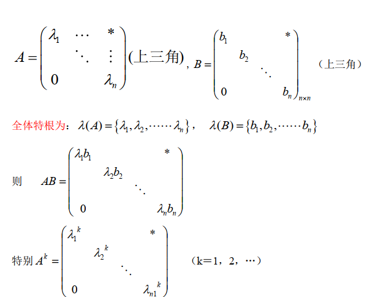

> 许尔公式

<!--more-->

## 2.1 稀疏矩阵乘积

### 对角阵

$$
\begin{aligned}
\Lambda=\left(
\begin{matrix}
&\lambda_1 &\quad&\quad&\quad\\
&\quad &\lambda_2 &\quad&\quad\\
&\quad &\quad &\ddots&\quad\\
&\quad &\quad &\quad&\lambda_n\\
\end{matrix}
\right),\Lambda^H\Lambda&=\left(
\begin{matrix}
&\overline{\lambda_1}\lambda_1&\quad&\quad&\quad\\
&\quad &\overline{\lambda_2}\lambda_2 &\quad&\quad\\
&\quad &\quad &\ddots&\quad\\
&\quad &\quad &\quad&\overline{\lambda_n}\lambda_n\\
\end{matrix}
\right)\\
&=\left(
\begin{matrix}
&\vert \lambda_1\vert^2 &\quad&\quad&\quad\\
&\quad &\vert \lambda_2\vert^2 &\quad&\quad\\
&\quad &\quad &\ddots&\quad\\
&\quad &\quad &\quad&\vert \lambda_n\vert^2\\
\end{matrix}
\right)
\end{aligned}
$$

### 上三角阵

## 2.2 许尔公式

### 2.2.1 特商公式

$$
\begin{aligned}
&\lambda_1=\frac{X^HAX}{\vert X\vert^2},其中(X\neq 0为\lambda_1的一个特征向量)\\
&证明:X^HAX=X^H\lambda X=\lambda X^HX=\lambda \vert X\vert^2

\end{aligned}
$$

### 2.2.2 许尔公式

$$
\begin{aligned}
&任一方阵，A\in C^{n\times n} ，必存在U阵Q，使Q^{-1}AQ=B，\\
&B=\left(
\begin{matrix}
&\lambda_1&*&\cdots&*\\
&0&\lambda_2&\cdots&*\\
&\vdots&\vdots &\ddots&\vdots\\
&0&0 &\cdots&\lambda_n\\
\end{matrix}
\right)为上三角阵
\end{aligned}
$$

### 2.2.3 H阵的相似对角化

定理：
$$
\begin{aligned}
若A是Hermite阵，则存在U阵Q,使Q^{-1}AQ&=Q^HAQ\\
&=\Lambda=\left(
\begin{matrix}
&\lambda_1&\quad&\quad\\
&\quad&\ddots&\quad\\
&\quad&\quad&\lambda_n
\end{matrix}
\right)\\
\end{aligned}
$$
证明：
$$
\begin{aligned}
由许尔公式\Rightarrow 有U阵Q使Q^{-1}AQ=Q^HAQ&=B\\
&=\left(
\begin{matrix}
&\lambda_1&*&\cdots&*\\
&0&\lambda_2&\cdots&*\\
&\vdots&\vdots &\ddots&\vdots\\
&0&0 &\cdots&\lambda_n\\
\end{matrix}
\right)\\
由A是Hermite矩阵，则A^H=A,(Q^HAQ)^H&=Q^HA^HQ=Q^HAQ\\
&=\left(
\begin{matrix}
&\overline{\lambda_1}&0&\cdots&0\\
&*&\overline{\lambda_2}&\cdots&0\\
&\vdots&\vdots &\ddots&\vdots\\
&*&* &\cdots&\overline{\lambda_n}\\
\end{matrix}
\right)
\end{aligned}
$$
由此可见，B为对角阵，且 $\lambda_i$ 为实数

#### A的分解

$Q^{-1}AQ=\Lambda$ 可得，$A=Q\Lambda Q^{-1} = Q\Lambda Q^H$

