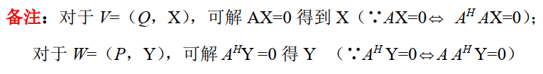
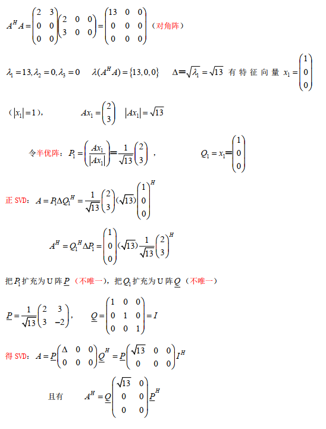

> 奇异值，奇异值分解

<!--more-->

## 3.1 奇异值

$$
\begin{aligned}
&给定A=A_{n\times p} ，则A^HA与AA^H有相同的正根\lambda_1\ge \lambda_2\ge \cdots\ge\lambda_r\ge0\\
&称\sqrt{\lambda_1},\sqrt{\lambda_2},\cdots,\sqrt{\lambda_r}为A的奇异值\\\\
&若r(A^HA)=r(AA^H)=r(A)=r，恰有r个正根\lambda_1\ge\lambda_2\ge\cdots\ge \lambda_r > 0，则称\\
&\sqrt{\lambda_1},\sqrt{\lambda_2},\cdots,\sqrt{\lambda_r} 为A的正奇异值\\
&记作 S_+(A)=\{s_1,s_2,\cdots,s_r\}=\{\sqrt{\lambda_1},\sqrt{\lambda_2},\cdots,\sqrt{\lambda_r}\},且\sqrt{\lambda_1} 称为最大奇异值\\\\
&对于n阶方阵A=A_{n\times n} ，则A^HA与AA^H有n个相同非负根,则\lambda_1\ge\cdots\ge \lambda_n\ge 0\\
&，此时\sqrt{\lambda_1},\sqrt{\lambda_2},\cdots,\sqrt{\lambda_n}为A的全体奇异值，记作S(A)=\{s_1,s_2,\cdots,s_n\}\\
&=\{\sqrt{\lambda_1},\sqrt{\lambda_2},\cdots,\sqrt{\lambda_n}\},\lambda_1\ge \cdots\ge \lambda_r，\lambda_{r+1}=\cdots=\lambda_n=0
\end{aligned}
$$

### 3.1.1 正奇值例题

$$
\begin{aligned}
&(1)A=\left(
\begin{matrix}
1&2\\
0&0\\
0&0
\end{matrix}
\right)\quad (2)A=\left(
\begin{matrix}
1&1\\
0&0\\
1&1
\end{matrix}
\right)
\quad (3)A=\left(
\begin{matrix}
1&-1\\
1&1
\end{matrix}
\right)
\\\\
&(1)A^HA=\left(
\begin{matrix}
&1&2\\
&2&4
\end{matrix}
\right),为秩1矩阵，可知\lambda(A^HA)=\{5,0\}\\
&\therefore s^+(A)=\{\sqrt{5}\}\\\\
&(2)A^HA=\left(
\begin{matrix}
2&2\\
2&2
\end{matrix}
\right)，为秩1矩阵，则\lambda(A)=\{4,0\}\\
&则s^+(A)=\{2\}\\\\
&(3)A^HA=\left(
\begin{matrix}
2&0\\
0&2
\end{matrix}
\right),为对角阵，\therefore\lambda(A^HA)=\{2,2\}\\
&则 s^+(A)=\{\sqrt{2},\sqrt{2}\}
\end{aligned}
$$

### 3.1.2 半正定Hermite阵的奇异值与特征值相同

$$
\begin{aligned}
&设全体特征值为 \lambda(A)=\{\lambda_1,\cdots,\lambda_n\}，且A^H=A\Rightarrow A^HA=A^2,\\
&\therefore 可知\lambda(A^HA)=\lambda(A^2)=\{\lambda_1^2,\cdots,\lambda_n^2\}\\
&\because A半正定可知\lambda_1\ge 0,\cdots,\lambda_n\ge 0\\
&故，全体奇异值s(A)=\{\sqrt{\lambda_1^2},\cdots,\sqrt{\lambda_n^2}\}=\{\lambda_1,\cdots,\lambda_n\}=\lambda(A)
\end{aligned}
$$

## 3.2 奇异值分解SVD

### 3.2.1 正SVD

$$
\begin{aligned}
&设A=A_{m\times n}，r(A)>0,正奇值\sqrt{\lambda_1},\cdots,\sqrt{\lambda_r},则有分解A=P\Delta Q^H\\
&其中\Delta=\left(
\begin{matrix}
&\sqrt{\lambda_1}&&\\
&&\ddots&\\
&&&\sqrt{\lambda_r}
\end{matrix}
\right)，P_{m\times r}，Q_{n\times r}为半U阵,P^HP=I_r=Q^HQ\\
&可写正SVD公式A=P\left(
\begin{matrix}
&\sqrt{\lambda_1}&&\\
&&\ddots&\\
&&&\sqrt{\lambda_r}
\end{matrix}
\right)Q^H
\end{aligned}
$$

---

**证明**

1. $P_{m\times r}，Q_{n\times r}$ 的构造

$$
\begin{aligned}
&A^HA为Hermite阵，由Hermite分解定理，存在U阵\\
&使U^H(A^HA)U=\left(
\begin{matrix}
&\lambda_1&&\\
&&\ddots&\\
&&&\lambda_n
\end{matrix}
\right)_{n\times n}，\\
&,且A^HA为半正定阵，有\lambda_1,\cdots,\lambda_r>0,\lambda_{r+1}=\cdots=\lambda_n=0,r(A)=r\\
&而U的列向量(q_1,q_2,\cdots,q_n)为 A^HA 的特征向量\\
&且A^HAq_1=\lambda_1q_1,\cdots,A^HAq_r=\lambda_rq_r,A^HAq_{r+1}=0,A^HAq_{n}=0\\\\
&令Q=(q_1,q_2,\cdots,q_r)_{n\times r}，P=(\frac{Aq_1}{\vert Aq_1\vert},\cdots,\frac{Aq_r}{\vert Aq_r\vert})_{m\times r}
\end{aligned}
$$

2. P与Q为半U阵
   $$
   \begin{aligned}
   &已知Q中列向量为U阵的r个非零列向量，则Q为半U阵\\
   &而(Aq_1,Aq_2)=(Aq_2)^H(Aq_1)=q_2A^HAq_1=\lambda_1q_2^Hq_1=(\lambda_1q_1,q_2)=0\\
   &同理，Aq_i与Aq_j都正交\\
   &\vert Aq_1\vert^2=(Aq_1)^H(Aq_1)=q_1^HA^HAq_1=\lambda_1q_1^Hq_1=\lambda_1\ge0\\
   &\quad\quad\quad\Rightarrow P=\left(\frac{Aq_1}{\vert Aq_1 \vert},\frac{Aq_2}{\vert Aq_2 \vert},\cdots,\frac{Aq_r}{\vert Aq_r \vert}\right)=\left(\frac{Aq_1}{\sqrt{\lambda_1}},\frac{Aq_2}{\sqrt{\lambda_2}},\cdots,\frac{Aq_r}{\sqrt{\lambda_r}}\right)\\
   &即P阵为半U阵
   \end{aligned}
   $$
   
3. 代入P,Q
   $$
   \begin{aligned}
   &P\Delta Q^H=\left(\frac{Aq_1}{\sqrt{\lambda_1}},\frac{Aq_2}{\sqrt{\lambda_2}},\cdots,\frac{Aq_r}{\sqrt{\lambda_r}}\right)\left(
   \begin{matrix}
   &\sqrt{\lambda_1}&&\\
   &&\ddots&\\
   &&&\sqrt{\lambda_r}
   \end{matrix}
   \right)\left(
   \begin{matrix}
   q_1^H\\
   q_2^H\\
   \vdots\\
   q_r^H
   \end{matrix}
   \right)\\
   &=(Aq_1,Aq_2,\cdots,Aq_r)\left(
   \begin{matrix}
   q_1^H\\
   q_2^H\\
   \vdots\\
   q_r^H
   \end{matrix}
   \right)=\left(Aq_1q_1^H,Aq_2q_2^H,，\cdots,Aq_rq_r^H,\right)
   \end{aligned}
   $$

4. 验证 $\left(Aq_1q_1^H,Aq_2q_2^H,，\cdots,Aq_rq_r^H,\right)=A$
   $$
   \begin{aligned}
   &由A^HA为半正定Hermite阵，r(A^HA)=r\\
   &由同解定理，A^HAx=0\iff Ax=0\\
   &A^HAq_{r+1}=\cdots=A^HAq_{n}=0\Rightarrow Aq_{r+1}=\cdots=Aq_{n}=0\\
   &\Rightarrow A(q_{r+1}q_{r+1}^H+\cdots+q_nq_n^H)=0\\
   &而A(q_1q_1^H+\cdots+q_rq_r^H+q_{r+1}q_{r+1}^H+\cdots+q_nq_n^H)=AI=A\\
   &即A(q_1q_1^H+\cdots+q_rq_r^H)=A
   \end{aligned}
   $$

最后得证 正SVD公式，$A=P\Delta Q^H=P\left(
\begin{matrix}
&\sqrt{\lambda_1}&&\\
&&\ddots&\\
&&&\sqrt{\lambda_r}
\end{matrix}
\right)Q^H$

#### 分解方法

1. 求 $A^HA$ 的特征值，$\lambda_1\ge\cdots,\ge\lambda_r>0$

   正奇值为 $\sqrt{\lambda_1},\cdots\sqrt{\lambda_r}$

2. 求 $\lambda_1,\cdots,\lambda_r$ 的正交特征向量（不必单位化）

3. 令列半U阵 $Q=\left(\frac{X_1}{\vert X_1\vert},\cdots,\frac{X_r}{\vert X_r\vert}\right),P=\left(\frac{AX_1}{\vert AX_1\vert},\cdots,\frac{AX_r}{\vert AX_r\vert}\right)$

##### eg

$$
\begin{aligned}
A=\left(
\begin{matrix}
1&1\\
0&0\\
1&1
\end{matrix}
\right)
\end{aligned}
$$

---

$$
\begin{aligned}
&A^HA=\left(
\begin{matrix}
2&2\\
2&2
\end{matrix}
\right),由A^HA为秩1矩阵，得\lambda=\{4,0\}，正奇值为\sqrt(\lambda)=\sqrt{2}\\
&而\lambda_1=4的特征向量为X_1=\left(
\begin{matrix}
1\\1
\end{matrix}
\right),则\Delta=\left(
2
\right)\\
&令Q=\left(\frac{X_1}{\vert X_1\vert}\right)=\left(
\begin{matrix}
\frac{1}{\sqrt{2}}\\
\frac{1}{\sqrt{2}}
\end{matrix}
\right),P=\left(
\begin{matrix}
\frac{AX_1}{\vert AX_1\vert}
\end{matrix}
\right)=\left(
\begin{matrix}
\frac{1}{\sqrt{2}}\\0\\\frac{1}{\sqrt{2}}
\end{matrix}
\right)\\
&则A的正SVD为A=P\Delta Q^H=\left(
\begin{matrix}
\frac{1}{\sqrt{2}}\\0\\\frac{1}{\sqrt{2}}
\end{matrix}
\right)\left(2\right)\left(
\frac{1}{\sqrt{2}},\frac{1}{\sqrt{2}}
\right)
\end{aligned}
$$

考虑 $B=\left(
\begin{matrix}
1&0&1\\1&0&1\\
\end{matrix}
\right)$ 的正SVD

---

$$
\begin{aligned}
&已知B=A^H,且有A的正SVD，A=P\Delta Q^H=\left(
\begin{matrix}
\frac{1}{\sqrt{2}}\\0\\\frac{1}{\sqrt{2}}
\end{matrix}
\right)\left(2\right)\left(
\frac{1}{\sqrt{2}},\frac{1}{\sqrt{2}}
\right)\\
&B=(P\Delta Q^H)^H=Q\Delta P^H=\left(
\begin{matrix}
\frac{1}{\sqrt{2}}\\\frac{1}{\sqrt{2}}
\end{matrix}
\right)\left(2\right)\left(
\frac{1}{\sqrt{2}},0,\frac{1}{\sqrt{2}}
\right)
\end{aligned}
$$

### 3.2.2 SVD

$$
\begin{aligned}
&设A=A_{m\times n}，r(A)>0,正奇值\sqrt{\lambda_1},\cdots,\sqrt{\lambda_r}>0,则有分解A=W\Delta V^H\\
&其中D=\left(
\begin{matrix}
\Delta&0\\
0&0
\end{matrix}
\right)_{m\times n}，W_{m\times m}=(P,P_1),V_{n\times n}=(Q,Q_1)\\
&可写SVD公式A=W\left(
\begin{matrix}
\Delta&0\\
0&0
\end{matrix}
\right)V^H=P\Delta Q^H,其中\left(
\begin{matrix}
\sqrt{\lambda_1}&&\\
&\ddots&\\
&&\sqrt{\lambda_r}
\end{matrix}
\right)
\end{aligned}
$$

**证明:**
$$
\begin{aligned}
&由正SVD：A=P\Delta Q^H,分别把P，Q扩充为U阵，即W=(P,P_1),V=(Q,Q_1)，\\
&V^H=\left(
\begin{matrix}
Q^H\\
A_1^H
\end{matrix}
\right),则WDV^H=(P,P_1)\left(
\begin{matrix}
\Delta&0\\
0&0
\end{matrix}
\right)\left(
\begin{matrix}
Q^H\\
A_1^H
\end{matrix}
\right)=\left(
P\Delta\quad 0\\
\right)\left(
\begin{matrix}
Q^H\\
A_1^H
\end{matrix}
\right)=P\Delta Q^H
\end{aligned}
$$

#### 分解方法

1. 求 $A^HA$ 的特征值，$\lambda_1\ge\cdots,\ge\lambda_r>0$

   正奇值为 $\sqrt{\lambda_1},\cdots\sqrt{\lambda_r}$

2. 求 $\lambda_1,\cdots,\lambda_r$ 的正交特征向量（不必单位化）

3. 令列U半阵 $Q=\left(\frac{X_1}{\vert X_1\vert},\cdots,\frac{X_r}{\vert X_r\vert}\right),P=\left(\frac{AX_1}{\vert AX_1\vert},\cdots,\frac{AX_r}{\vert AX_r\vert}\right)$ ，则有正SVD：$A=P\Delta Q^H$ 

4. 将P，Q扩充为W，V **扩充方法不唯一** 由证明可知，不管 $P_1,Q_1$ 为何，都会被消去

   得SVD公式 $A=WDV^H$

##### eg

$$
\begin{aligned}
A=\left(
\begin{matrix}
1&1\\
0&0\\
1&1
\end{matrix}
\right)
\end{aligned}
$$

---

$$
\begin{aligned}
&扩充为两个U阵V=\left(Q,X\right)=\left(
\begin{matrix}
\frac{1}{\sqrt{2}}&\frac{1}{\sqrt{2}}\\
\frac{1}{\sqrt{2}}&-\frac{1}{\sqrt{2}}
\end{matrix}
\right),W=\left(P,Y\right)=\left(
\begin{matrix}
\frac{1}{\sqrt{2}}&0&\frac{1}{\sqrt{2}}\\
0&0&0\\
\frac{1}{\sqrt{2}}&0&-\frac{1}{\sqrt{2}}
\end{matrix}
\right)\\
&则有奇异分解SVD，A=\left(
\begin{matrix}
\frac{1}{\sqrt{2}}&0&\frac{1}{\sqrt{2}}\\
0&0&0\\
\frac{1}{\sqrt{2}}&0&-\frac{1}{\sqrt{2}}
\end{matrix}
\right)\left(
\begin{matrix}
2&0\\
0&0\\
0&0
\end{matrix}
\right)\left(
\begin{matrix}
\frac{1}{\sqrt{2}}&\frac{1}{\sqrt{2}}\\
\frac{1}{\sqrt{2}}&-\frac{1}{\sqrt{2}}
\end{matrix}
\right)
\end{aligned}
$$

### 3.2.3 SVD例题

$$
\begin{aligned}
A=\left(
\begin{matrix}
2i&1\\
1&i\\
1&i
\end{matrix}
\right)
\end{aligned}
$$

---

$$
\begin{aligned}
&A^HA=\left(
\begin{matrix}
-2i&1&1\\
1&-i&-i
\end{matrix}
\right)\left(
\begin{matrix}
2i&1\\
1&i\\
1&i
\end{matrix}
\right)=\left(
\begin{matrix}
6&0\\
0&3
\end{matrix}
\right)，可知正奇值S(A)_+=\{\sqrt{6},\sqrt{3}\}\\
&\lambda_1=6,X_1=\left(
\begin{matrix}
1\\0
\end{matrix}
\right),AX_1=\left(
\begin{matrix}
2i\\1\\1
\end{matrix}
\right)\vert AX_1\vert=\sqrt{6};\lambda_2=3,X_2=\left(
\begin{matrix}
0\\1
\end{matrix}
\right),AX_2=\left(
\begin{matrix}
1\\i\\i
\end{matrix}
\right)\\
&令Q=\left(
\begin{matrix}
X_1,X_2
\end{matrix}
\right)=\left(
\begin{matrix}
1&0\\0&1
\end{matrix}
\right),P=\left(
\begin{matrix}
\frac{AX_1}{\vert AX_1\vert},\frac{AX_2}{\vert AX_2\vert}
\end{matrix}
\right)=\left(
\begin{matrix}
\frac{2i}{\sqrt{6}}&\frac{1}{\sqrt{3}}\\
\frac{1}{\sqrt{6}}&\frac{i}{\sqrt{3}}\\
\frac{1}{\sqrt{6}}&\frac{i}{\sqrt{3}}
\end{matrix}
\right)\\
&则有正SVD，A=P\Delta Q^H=\left(
\begin{matrix}
\frac{2i}{\sqrt{6}}&\frac{1}{\sqrt{3}}\\
\frac{1}{\sqrt{6}}&\frac{i}{\sqrt{3}}\\
\frac{1}{\sqrt{6}}&\frac{i}{\sqrt{3}}
\end{matrix}
\right)\left(
\begin{matrix}
\sqrt{6}&\\
&\sqrt{3}
\end{matrix}
\right)\left(
\begin{matrix}
1&0\\0&1
\end{matrix}
\right)^H\\
&可知SVD，A=WDV=\left(
\begin{matrix}
\frac{2i}{\sqrt{6}}&\frac{1}{\sqrt{3}}&0\\
\frac{1}{\sqrt{6}}&\frac{i}{\sqrt{3}}&\frac{1}{\sqrt{2}}\\
\frac{1}{\sqrt{6}}&\frac{i}{\sqrt{3}}&-\frac{1}{\sqrt{2}}
\end{matrix}
\right)\left(
\begin{matrix}
\sqrt{6}&\\
&\sqrt{3}
\end{matrix}
\right)\left(
\begin{matrix}
1&0\\0&1
\end{matrix}
\right)^H
\end{aligned}
$$

#### 当A是向量时

$$
\begin{aligned}
&A=\left(
\begin{matrix}
a_1\\
\vdots\\
a_n
\end{matrix}
\right)\neq 0,则其正SVD
\end{aligned}
$$

---

$$
\begin{aligned}
&A^HA=\left(\overline{a_1},\cdots,\overline{a_n}\right)\left(
\begin{matrix}
a_1\\
\vdots\\
a_n
\end{matrix}
\right)=\vert a_1\vert^2+\cdots+\vert a_n\vert^2>0\\
&\lambda_1=\vert a_1 \vert^2+\cdots+\vert a_n\vert^2，令\Delta=\left(\sqrt{\lambda_1}\right),Q=(1)\\
&X_1=(1)，P=\frac{1}{\sqrt{\vert a_1 \vert^2+\vert a_2 \vert^2+\cdots+\vert a_n \vert^n}}\left(
\begin{matrix}
a_1\\\vdots\\a_n
\end{matrix}
\right),\\
&正SVD：A=P\Delta Q^H=\\
&\frac{1}{\sqrt{\vert a_1 \vert^2+\vert a_2 \vert^2+\cdots+\vert a_n \vert^n}}\left(
\begin{matrix}
a_1\\\vdots\\a_n
\end{matrix}
\right)\left(\sqrt{\vert a_1 \vert^2+\vert a_2 \vert^2+\cdots+\vert a_n}\right)\left(1\right)
\end{aligned}
$$

#### $A^H$与A的SVD只需求一个

$$
若已知正SVD，A=P\Delta Q^H,可得A^H的正SVD=(P\Delta Q^H)^H
$$

$$
\begin{aligned}
A=\left(
\begin{matrix}
2&0&0\\
3&0&0
\end{matrix}
\right)与B=A^H的正SVD与SVD
\end{aligned}
$$

---

#### 一个SVD解答

$$
\begin{aligned}
A=\left(
\begin{matrix}
i&2\\
1&i\\1&i
\end{matrix}
\right)，求正SVD与SVD
\end{aligned}
$$

---

$$
\begin{aligned}
&\because A^HA=\left(
\begin{matrix}
-i&1&1\\
2&-i&-i
\end{matrix}
\right)\left(
\begin{matrix}
i&2\\
1&i\\1&i
\end{matrix}
\right)=\left(
\begin{matrix}
3&0\\
0&6
\end{matrix}
\right)为对角阵，令\lambda_1=3,\lambda_2=6\\
&A^H有两个特向X_1=\left(
\begin{matrix}
1\\0
\end{matrix}
\right),X_2=\left(
\begin{matrix}
0\\1
\end{matrix}
\right)(互正交)，正奇值为 \sqrt{\lambda_1}=\sqrt{3},\sqrt{\lambda_2}=\sqrt{6}\\
&AX_1=\left(
\begin{matrix}
i\\1\\1
\end{matrix}
\right),AX_2=\left(
\begin{matrix}
2\\i\\i
\end{matrix}
\right),\vert AX_1 \vert=\sqrt{3},\vert AX_2 \vert=\sqrt{6}\\
&令P=\left(
\frac{AX_1}{\vert AX_1\vert},\frac{AX_2}{\vert AX_2\vert}
\right)=\left(
\begin{matrix}
\frac{i}{\sqrt{3}}&\frac{2}{\sqrt{6}}\\
\frac{1}{\sqrt{3}}&\frac{i}{\sqrt{6}}\\
\frac{i}{\sqrt{3}}&\frac{i}{\sqrt{6}}\\
\end{matrix}
\right),则正SVD\\
&A=P\Delta Q^H=\left(
\begin{matrix}
\frac{i}{\sqrt{3}}&\frac{2}{\sqrt{6}}\\
\frac{1}{\sqrt{3}}&\frac{i}{\sqrt{6}}\\
\frac{i}{\sqrt{3}}&\frac{i}{\sqrt{6}}\\
\end{matrix}
\right)\left(
\begin{matrix}
\sqrt{3}&\\
&\sqrt{6}
\end{matrix}
\right)\left(
\begin{matrix}
1&0\\
0&1
\end{matrix}
\right)
\end{aligned}
$$

---

$$
\begin{aligned}
&令W=(P,P_1)=\left(
\begin{matrix}
\frac{i}{\sqrt{3}}&\frac{2}{\sqrt{6}}&0\\
\frac{1}{\sqrt{3}}&\frac{i}{\sqrt{6}}&\frac{1}{\sqrt{2}}\\
\frac{i}{\sqrt{3}}&\frac{i}{\sqrt{6}}&-\frac{1}{\sqrt{2}}\\
\end{matrix}
\right),或\left(
\begin{matrix}
\frac{i}{\sqrt{3}}&\frac{2}{\sqrt{6}}&0\\
\frac{1}{\sqrt{3}}&\frac{i}{\sqrt{6}}&\frac{i}{\sqrt{2}}\\
\frac{i}{\sqrt{3}}&\frac{i}{\sqrt{6}}&-\frac{i}{\sqrt{2}}\\
\end{matrix}
\right),\\
&有SVD，A=\left(
\begin{matrix}
\frac{i}{\sqrt{3}}&\frac{2}{\sqrt{6}}&0\\
\frac{1}{\sqrt{3}}&\frac{i}{\sqrt{6}}&\frac{1}{\sqrt{2}}\\
\frac{i}{\sqrt{3}}&\frac{i}{\sqrt{6}}&-\frac{1}{\sqrt{2}}\\
\end{matrix}
\right)\left(
\begin{matrix}
\sqrt{3}&0\\
0&\sqrt{6}\\
0&0
\end{matrix}
\right)\left(
\begin{matrix}
1&0\\
0&1
\end{matrix}
\right)
\end{aligned}
$$

### 3.2.4 正SVD的等价写法

$$
\begin{aligned}
&A=P\Delta Q^H,\Delta=\left(
\begin{matrix}
s_1&&\\
&\ddots&\\
&&s_r
\end{matrix}
\right),令P=\left(\frac{AX_1}{\vert AX_1\vert},\cdots,\frac{AX_r}{\vert AX_r\vert} \right)=\left(p_1,\cdots,p_r\right)\\
&Q=\left(X_1,\cdots,X_r\right)=\left(q_1,\cdots,q_r\right),则有正SVD\\
&A=s_1p_1q_1^H+\cdots+s_rp_rq_r^H
\end{aligned}
$$

