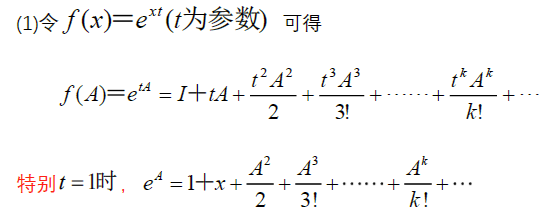

> 矩阵函数

<!--more-->

## 3.1  常见泰勒解析函数

### 3.1.1 指数函数

**引入参数** 

### 3.1.2 正弦级数

**引入参数**

### 3.1.3 余弦级数

**引入参数**

### 3.1.4 一些约定

#### a. A为0阵

#### 

#### b. 奇偶性

#### c. 单位阵

$e^{tI}=e^tI,sin(tI)=sin(t)I,cos(tI)=cos(t)I$

#### d. 转置穿脱

$$
(e^{A})^H=e^{A^H}
$$

#### e. H阵

$$
A^H=A,则 e^{iA}为U阵，即 (e^{iA})^H=(e^{iA})^{-1},或(e^{iA})^He^{iA}=I\\
A^H=-A,则 e^{A}为U阵，即 (e^{A})^H=(e^{A})^{-1},或(e^{A})^He^{A}=I
$$

## 3.2 欧拉公式

> $e^x$ 与 $cosx$ 和 $sinx$ 的关系
>
> 

$$
\begin{aligned}
&e^{iA}=cosA+isinA,e^{-A}=cosA-isinA,i=\sqrt{-1}\\
&cosA=\frac{1}{2}(e^{iA}+e^{-iA}),sinA=\frac{1}{2i}(e^{iA}-e^{-iA})
\end{aligned}
$$

**引入参数** 
$$
\begin{aligned}
e^{itx}=cos(tx)+isin(tx),e^{-itx}=cos(tx)-isin(tx)\\
e^{itA}=cos(tA)+isin(tA),e^{-itA}=cos(tA)-isin(tA)
\end{aligned}
$$

## 3.3 $e^A$ 

### 3.3.1 $e^A$ 性质

#### a. 交换公式

$$
若AB=BA可交换，则有交换公式e^A\cdot e^B=e^{A+B} =e^B\cdot e^A\\
若AB\neq BA，则交换公式不成立
$$

若满足交换公式，则有
$$
\begin{aligned}
&(A+B)^2=A^2+2AB+B^2\\
&(A+B)^3=A^3+3A^2B+3AB^2+B^3
\end{aligned}
$$
**SP**
$$
e^A\cdot e^{-A}=e^{-A}e^A=I
$$

#### b. 可逆公式

任一方阵 $A$ 都有 $e^A$ 可逆，且 $(e^A)^{-1}=e^{-A}$

**引入参数** 

$(e^{tA})^{-1}=e^{-tA}$ ，且 $e^{tA}e^{-tA}=I$

eg：证明 $sin^2A+cos^2A=I$ 
$$
\begin{aligned}
&由欧拉公式 cosA=\frac{1}{2}(e^{iA}+e^{-iA}),sinA=\frac{1}{2i}(e^{iA}-e^{-iA}),\\
&cos^2A=\frac{1}{4}(e^{2iA}+2e^{iA-iA}+e^{-2iA})=\frac{1}{4}(e^{2iA}+2e^0+e^{-2iA}),sin^2A=-\frac{1}{4}(e^{2iA}-2e^0+e^{-2iA})\\
&sin^2A+cos^2A=\frac{1}{2}e^0+\frac{1}{2}e^0=I
\end{aligned}
$$

### 3.3.2 $e^A$ 特根公式

设方阵A特根 $\lambda(A)=\{\lambda_1,\cdots,\lambda_n\}$ ，则 $e^A$ 特根为 $\lambda(e^A)=\{e^{\lambda_1},e^{\lambda_2},\cdots,e^{\lambda_n}\}$

### 3.3.3 $e^A$ 行列式

$$
\begin{aligned}
&令n阶方阵A=(a_{ij})，则f(A)=e^A的行列式为：\\
&\vert e^A\vert=\prod e^{\lambda_i} = e^{\sum \lambda_i}=e^{tr(A)}\\
&由行列式可知 e^{tr(A)} \neq 0，所以e^A一定可逆
\end{aligned}
$$

### 3.3.4 一些特殊矩阵 $e^A$ 可求

#### a. 幂等阵

若 $A^2=A$ ，则有 $e^{iA}=I+(e^t-1)A$

**第一列与第二列每个元素绝对值差1的，很有可能是幂等阵**

**eg** 

$$
\begin{aligned}
&A^2=\left(
\begin{matrix}
1&0\\1&0
\end{matrix}
\right)\left(
\begin{matrix}
1&0\\1&0
\end{matrix}
\right)=\left(
\begin{matrix}
1&0\\1&0
\end{matrix}
\right)=A,B^2=\left(
\begin{matrix}
1&0\\-1&0
\end{matrix}
\right)\left(
\begin{matrix}
1&0\\-1&0
\end{matrix}
\right)=\left(
\begin{matrix}
1&0\\-1&0
\end{matrix}
\right)=B为幂等阵\\
&可知 e^{tA}=I+tA+\frac{(tA)^2}{2!}+\frac{(tA)^3}{3!}+\cdots+\frac{(tA)^n}{n!}=I+[t+\frac{(t)^2}{2!}+\frac{(t)^3}{3!}+\cdots+\frac{(t)^n}{n!}]A\\
&=I+(e^t-1)A\\
&同理，可得e^{tB}=I+(e^t-1)B
\end{aligned}
$$

---

$$
\begin{aligned}
A^2=A,则e^A=I+(e^t-1)A=\left(
\begin{matrix}
1&0\\0&1
\end{matrix}
\right)+(e^t-1)\left(
\begin{matrix}
2&-2\\1&-1
\end{matrix}
\right)=\left(
\begin{matrix}
e^t-1&-2e^t+2\\e^t-1&2-e^t
\end{matrix}
\right)
\end{aligned}
$$

#### b. 对角阵

> 对角阵 $D=\left(\begin{matrix}\lambda_1&&\\&\ddots&\\&&\lambda_n\end{matrix}\right)$ ，则 $f(D)=\left(\begin{matrix}f(\lambda_1)&&\\&\ddots&\\&&f(\lambda_n)\end{matrix}\right)$ 

令函数 $f(x)=e^{tA}(t为参数)=\sum_{k=0}\limits^\infty\frac{(tx)^k}{k!}$ ,则 $f(D)=e^{tD}=\sum_{k=0}\limits^\infty\frac{(tD)^k}{k!}$ 

**sp**
$$
\begin{aligned}
&D=\left(
\begin{matrix}
\lambda_1&&\\&\ddots&\\&&\lambda_n
\end{matrix}
\right)，则e^{tD}=\left(
\begin{matrix}
e^{t\lambda_1}&&\\&\ddots&\\&&e^{t\lambda_n}
\end{matrix}
\right)
\end{aligned}
$$
**eg**

$$
\begin{aligned}
\because A+B=\left(
\begin{matrix}
2&\\&0
\end{matrix}
\right)为对角阵\Rightarrow e^{A+B}=\left(
\begin{matrix}
e^2&\\&e^0
\end{matrix}
\right)=\left(
\begin{matrix}
e^2&\\&1
\end{matrix}
\right)
\end{aligned}
$$

#### c. 单阵(谱公式)

$$
A=\lambda_1G_1+\cdots+\lambda_kG_k,且f(A)=f(\lambda_1)G_1+\cdots+f(\lambda_k)G_k,\\
其中f(x)=c_0+c_1+x+\cdots+c_kx^k+\cdots
$$

$$
\begin{aligned}
&计算可得\lambda(A)=\{i,-i\},A是单阵，对于任意解析函数f(x)有谱公式：f(A)=f(i)G_1+f(-i)G_2\\
&其中，G_1=\frac{A-\lambda_2I}{\lambda_1-\lambda_2}=\frac{1}{2i}\left(
\begin{matrix}
i&1\\-1&i
\end{matrix}
\right),G_2=\frac{A-\lambda_1I}{\lambda_2-\lambda_1}=-\frac{1}{2i}\left(
\begin{matrix}
-i&1\\-1&-i
\end{matrix}
\right)=\frac{1}{2i}\left(
\begin{matrix}
i&-1\\1&i
\end{matrix}
\right)\\
&令f(x)=e^{tx}，则f(i)=e^{ti},f(-i)=e^{^{-ti}}\\
&\therefore e^{tA}=e^{ti}G_1+e^{-ti}G_2=\frac{e^{ti}}{2i}\left(
\begin{matrix}
i&1\\-1&i
\end{matrix}
\right)+\frac{e^{-ti}}{2i}\left(
\begin{matrix}
i&-1\\1&i
\end{matrix}
\right)=\left(
\begin{matrix}
\frac{e^{ti}+e^{-ti}}{2}&\frac{e^{ti}-e^{-ti}}{2i}\\
-\frac{e^{ti}-e^{-ti}}{2i}&\frac{e^{ti}+e^{-ti}}{2}
\end{matrix}
\right)=\left(
\begin{matrix}
cost&sint\\-sint&cost
\end{matrix}
\right)
\end{aligned}
$$

---

$$
\begin{aligned}
&A是行和矩阵，故\lambda(A)=\{5,tr(A)-5\}=\{5,-2\},A有两个互异特征根，故A为单阵，有谱分解\\
&f(A)=f(5)G_1+f(-2)G_2,其中G_1=\frac{A-\lambda_2I}{\lambda_1-\lambda_2}=\frac{1}{7}\left(
\begin{matrix}
3&4\\3&4
\end{matrix}
\right),G_2=I-G_1=\frac{1}{7}\left(
\begin{matrix}
4&-4\\-3&3
\end{matrix}
\right)\\
&令f(x)=e^{tx},则f(5)=e^{5t},f(-2)=e^{-2t}\\
&\therefore e^{tA}=e^{5t}G_1+e^{-2t}G_2=\frac{e^{5t}}{7}\left(
\begin{matrix}
3&4\\3&4
\end{matrix}
\right)+\frac{e^{-2t}}{7}\left(
\begin{matrix}
4&-4\\-3&3
\end{matrix}
\right)=\frac{1}{7}\left(
\begin{matrix}
3e^{5t}+4e^{-2t}&4e^{5t}-4e^{-2t}\\
3e^{5t}+4e^{-2t}&4e^{5t}-4e^{-2t}\\
\end{matrix}
\right)\\
&\vert e^{tA}\vert=e^{tr(tA)}=e^{3t}\\
&(e^{(tA)})^{-1}=e^{-tA},即将t替换为-t即可,e^{-tA}=\frac{1}{7}\left(
\begin{matrix}
3e^{-5t}+4e^{2t}&4e^{-5t}-4e^{2t}\\
3e^{-5t}+4e^{2t}&4e^{-5t}-4e^{2t}\\
\end{matrix}
\right)
\end{aligned}
$$

---

$$
\begin{aligned}
&通过特征方程\vert A-\lambda I\vert计算得\lambda(A)=\{-2,1,1\},且A-I=\left(
\begin{matrix}
3&6&0\\-3&-6&0\\-3&-6&0
\end{matrix}
\right),r(A-I)=3-2=1\\
&\therefore A为单阵，有谱分解 f(A)=f(1)G_1+f(-2)G_2\\
&令f(x)=e^{tx},f(1)=e^{t},f(-2)=e^{-2t},G_1=\frac{A-\lambda_2 I}{\lambda_1-\lambda_2}=\frac{1}{3}(A+2I)=\left(
\begin{matrix}
2&2&0\\-1&-1&0\\-1&-2&1
\end{matrix}
\right),G_2=I-G_1=\left(
\begin{matrix}
-1&-2&0\\1&2&0\\1&2&0
\end{matrix}
\right)\\
&代入得e^{tA}=e^tG_1+e^{-2t}G_2=e^t\left(
\begin{matrix}
2&2&0\\-1&-1&0\\-1&-2&1
\end{matrix}
\right)+e^{-2t}\left(
\begin{matrix}
-1&-2&0\\1&2&0\\1&2&0
\end{matrix}
\right)=\left(
\begin{matrix}
2e^t-e^{-2t}&2e^t-2e^{-2t}&0\\
e^{-2t}-e^{-t}&2e^{-2t}-e^t&0\\
e^{-2t}-e^t&2e^{-2t}-2e^t&e^t
\end{matrix}
\right)\\
&令t=1，可得e^A=\left(
\begin{matrix}
2e-e^{-2}&2e-2e^{-2}&0\\
e^{-2}-e^{-1}&2e^{-2}-e&0\\
e^{-2}-e&2e^{-2}-2e&e
\end{matrix}
\right)\\
&\vert e^A\vert = e^{tr(A)}=e^{0}=1
\end{aligned}
$$

#### d. 幂0阵(泰勒公式)

> $A^k=0$ ，则 $A$ 为幂0阵

$$
\begin{aligned}
&(1)\\
&A^2=\left(
\begin{matrix}
1&-1\\1&-1
\end{matrix}
\right)\left(
\begin{matrix}
1&-1\\1&-1
\end{matrix}
\right)=0,由幂等公式A^2=0，则\\
&e^{tA}=I+tA+\frac{A^2}{2!}+\cdots=I+tA+0+\cdots=I+tA=\left(
\begin{matrix}
1+t&-t\\t&1-t
\end{matrix}
\right)\\
&sin(tA)=tA-\frac{(tA)^3}{3!}+\cdots=tA=\left(
\begin{matrix}
t&-t\\t&-t
\end{matrix}
\right)\\
&cos(tA)=I-\frac{t^2A^2}{2!}=I=\left(
\begin{matrix}
1&0\\0&1
\end{matrix}
\right)\\
&t=-t时，可得(e^{tA})^{-1}=e^{(-t)A}=\left(
\begin{matrix}
1-t&t\\-t&1+t
\end{matrix}
\right)
\end{aligned}
$$
 

### 3.3.5 常用 $e^{tA}$

$$
e^{t\left(
\begin{matrix}
0&1\\-1&0
\end{matrix}
\right)}=\left(
\begin{matrix}
cost&sint\\-sint&cost
\end{matrix}
\right)\\
e^{t\left(
\begin{matrix}
0&a\\-a&0
\end{matrix}
\right)}=\left(
\begin{matrix}
cosat&sinat\\-sinat&cosat
\end{matrix}
\right)
$$

## 3.4 谱公式计算矩阵函数

### 3.4.1 前置知识

#### a. 根遗传公式

设 $n$ 阶方阵 $A$ 特根 $\lambda(A)=\{\lambda_1,\cdots,\lambda_n\}$ ，则 $f(A)$ 的特根为 $\lambda(f(A))=\{f(\lambda_1),\cdots,f(\lambda_n)\}$ ，其中 $\lambda(f(A))=\{f(\lambda_1),\cdots,f(\lambda_n)\}$ 为任意多项式函数，满足 $f(A)=c_0I+c_1A+c_2A^2+\cdots+c_kA^k$ 

#### b. 0化式、特根与幂0阵

> 0化式：若多项式 $f(x)$ 使 $f(A)=0$ ,称 $f(x)$ 为 $A$ 的0化式

- **A的全体特根是任意0化式 $f(x)$ 的根** 或 **A的0化式 $f(x)$ 含有A的全体不同根**
- **sp** ：若 $A$ 为单阵，则0化式 $f(x)$ 不含重复根，即不含大于2的幂次项

$$
\begin{aligned}
&设f(x)=(x-1)(x-2)，且有 (A-I)(A-2I)=\left(
\begin{matrix}
0&0&0\\0&0&0\\0&0&2
\end{matrix}
\right)\left(
\begin{matrix}
-1&0&0\\0&-1&0\\0&0&0
\end{matrix}
\right)=0,\\
&\therefore (x-1)(x-2)为A的0化式
\end{aligned}
$$

若 $A^k=0(k\ge 2)$ 为幂0阵，则A的全体特根为 $\lambda(A)=\{0,\cdots,0\}$ 

若 $(A-aI)^k=0(k\ge 2)$ 为平移幂0阵，则A的全体根为 $\lambda(A)=\{a,\cdots,a\}$ 

### 3.4.2 单阵谱公式

$$
单阵A有谱分解A=\lambda_1G_1+\lambda_2G_2+\cdots+\lambda_kG_k,且f(A)=f(\lambda_1)G_1+\cdots+f(\lambda_k)G_k
$$

### 3.4.3 广谱公式(非单阵2根2重)

$$
\begin{aligned}
&若A满足(A-aI)^2(A-bI)=0,且a\neq b，即A有0化式(x-a)^2(x-b),则有广谱公式：\\
&f(A)=f(a)G_1+f(b)G_2+f'(a)D_1,其中G_1+G_2=I,D_1为固定矩阵
\end{aligned}
$$

$$
\begin{aligned}
&解：\vert A-\lambda A\vert=\left | 
\begin{matrix}
-1-\lambda & 0 &1\\1 & 2-\lambda &0\\-4&0&3-\lambda
\end{matrix}
\right |= (\lambda-1)^2(\lambda-2)=0\Rightarrow \lambda(A)=\{1,1,2\}\\
&由于(A-I)(A-2I)\neq 0,0化式有重根，所以A不是单阵\\
&或r(A-I)=r\left(
\begin{matrix}
-2&0&1\\1&1&0\\-4&0&2
\end{matrix}
\right)=2\neq 3-2=1,\therefore A不是单阵\\
&\because (A-I)^2(A-I)=0,\therefore 对任一解析函数f(x)有广谱公式：\\
&f(A)=f(1)G_1+f(2)G_2+f'(1)D_1\\
&取不同的多项式求G_1,G_2,D_1\\
&\quad(1)令f(x)=(x-1)(x-2),f'(x)=(x-1)+(x-2)=2x-3,有f(1)=f(2)=0,f'(1)=-1\\
&\quad \quad代入公式后得，(A-I)(A-2I)=-D_1\Rightarrow D_1=-\left(
\begin{matrix}
-2&0&1\\1&1&0\\-4&0&2
\end{matrix}
\right)\left(
\begin{matrix}
-3&0&1\\1&0&0\\-4&0&1
\end{matrix}
\right)=\left(
\begin{matrix}
-2&0&1\\2&0&-1\\-4&0&2
\end{matrix}
\right)\\
&\quad (2)令f(x)=(x-1)^2,f(1)=0,f(2)=1,f'(x)=2(x-1),f'(1)=0\\
&\quad \quad(A-I)^2=G_2=\left(
\begin{matrix}
0&0&0\\-1&1&1\\0&0&0
\end{matrix}
\right)\\
&\quad \quad G_1=I-G_2=\left(
\begin{matrix}
1&0&0\\1&0&-1\\0&0&1
\end{matrix}
\right)\\
&\quad (2)'若令f(x)=(x-2)^2,f(2)=f'(2)=0,f(1)=-1,可求G_1\\
&令f(x)=e^{tx},f'(x)=te^{tx},f(A)=e^{tA}=f(1)G_1+f(2)G_2+f'(1)D_1=e^tG_1+e^{2t}G_2+te^{t}D_1\\
&即e^{tA}=e^t\left(
\begin{matrix}
1&0&0\\1&0&-1\\0&0&1
\end{matrix}
\right)+e^{2t}\left(
\begin{matrix}
0&0&0\\-1&1&1\\0&0&0
\end{matrix}
\right)+te^t\left(
\begin{matrix}
-2&0&1\\2&0&-1\\-4&0&2
\end{matrix}
\right)=\left(
\begin{matrix}
e^t-2te^t&0&te^t\\e^t-e^{2t}+2te^t&e^{2t}&e^{2t}-e^t-te^t\\-4te^t&0&e^t+2te^t
\end{matrix}
\right)
\end{aligned}
$$

---

$$
\begin{aligned}
&\lambda(A)=\{1,1,2\},由于(A-I)(A-2I)\neq 0,\therefore A不是单阵，(A-I)^2(A-2I)=0\\
&有广谱公式 f(A)=f(1)G_1+f(2)G_2+f'(1)D_1\\
&取不同多项式求G_1,G_2,D_1\\
& \quad (1)令f(x)=(x-1)(x-2),f'(x)=(x-1)+(x-2),f(1)=f(2)=0,f'(1)=-1\\
&\quad \quad (A-I)(A-2I)=-D_1\Rightarrow D_1=-(A-I)(A-2I)=\left(
\begin{matrix}
0&1&0\\0&0&0\\0&0&0
\end{matrix}
\right)\\
&\quad (2)令f(x)=(x-1)^2,f(1)=f'(1)=0,f(2)=1,代入解析式得：\\
&\quad \quad (A-I)^2=G_2=\left(
\begin{matrix}
0&0&0\\0&0&0\\0&0&1
\end{matrix}
\right),G_1=I-G_2=\left(
\begin{matrix}
1&0&0\\0&1&0\\0&0&0
\end{matrix}
\right)\\
&\therefore f(A)=f(1)G_1+f(2)G_2+f'(1)D_1=f(1)\left(
\begin{matrix}
1&0&0\\0&1&0\\0&0&0
\end{matrix}
\right)+f(2)\left(
\begin{matrix}
0&0&0\\0&0&0\\0&0&1
\end{matrix}
\right)+f'(1)\left(
\begin{matrix}
0&1&0\\0&0&0\\0&0&0
\end{matrix}
\right)\\
&f(x)=e^{tx},f(1)=e^t,f(2)=e^{2t},f'(1)=te^{t}\\
&可得e^{tA}=\left(
\begin{matrix}
e^t&te^t&\\&e^t&\\&&e^{2t}
\end{matrix}
\right)
\end{aligned}
$$

## 3.5 幂0与Taylor求解f(A)(最一般化求解)

> 若有 $A^k=0(k\ge 2)$ ，则 $f(x)$ 为任一解析式，则有
> $$
> \begin{aligned}
> f(A)=f(0)+f'(0)A+\frac{f''(0)}{2!}A^2+\cdots+\frac{f^{k-1}(0)}{(k-1)!}A^{k-1}
> \end{aligned}
> $$

- 对于平移幂0阵 $(A-aI)^k=0(k\ge 2)$ ，$f(x)$ 为任一解析函数，则有公式 $f(A)=f(a)I+f'(a)(A-aI)+\frac{f''(a)}{2!}(A-aI)^2+\cdots+\frac{f(a)^{k-1}}{(k-1)!}(A-aI)^{k-1}$

**eg** 

$$
\begin{aligned}
&A为行和矩阵，\lambda(A)=\{0,tr(A)-0\}=\{0,0\},则(A-\lambda_1I)(A-\lambda_2I)=A^2=0\\
&f(A)=f(0)I+f'(0)A\\
&令f(x)=e^{tx},则f(0)=1,f'(0)=t,\Rightarrow f(A)=I+tA=\left(
\begin{matrix}
1+t&-t\\t&1-t
\end{matrix}
\right)\\
&令f(x)=cos(tx),则f(0)=1,f(0)=-tsin(tx)=0,\Rightarrow f(A)=I=\left(
\begin{matrix}
1&0\\0&1
\end{matrix}
\right)
\end{aligned}
$$

---

$$
\begin{aligned}
&\lambda(A)=\{2,2,2\},r(A-2I)=2\neq 3-3=0,A不是单阵，由Cayley公式，(x-2)^3=0\Rightarrow (A-2I)^3=0\\
&由幂0公式与泰勒公式，f(A)=f(2)I+f'(2)(A-2I)+\frac{f''(2)}{2!}(A-2I)^2\\
&令f(x)=e^{tx},f(2)=e^{2t},f'(2)=te^{2t},f''(2)=t^{2}e^{2t}\\
&\quad \therefore e^{tA}=e^{2t}I+te^{2t}(A-2I)+\frac{t^2e^{2t}}{2}(A-2I)^2=e^{2t}\left[I+t\left(
\begin{matrix}
0&1&0\\0&0&1\\0&0&0
\end{matrix}
\right)+\frac{t^2}{2}\left(
\begin{matrix}
0&0&1\\0&0&0\\0&0&0
\end{matrix}
\right)\right]\\
&\quad \quad \quad =e^{2t}\left(
\begin{matrix}
1&t&\frac{t^2}{2}\\0&1&t\\0&0&1
\end{matrix}
\right)\\
&令f(x)=sin(tx),f(2)=sin2t,f'(2)=tcos(2t),f''(2)=-t^2sin(2t)\\
&\quad \therefore sin(tA)=sin(2t)I+tcos(2t)(A-2I)-t^2sin(2t)(A-2I)^2=\\
&\quad \quad \quad =sin(2t)\left(
\begin{matrix}
1&0&0\\0&1&1\\0&0&1
\end{matrix}
\right)+tcos(2t)\left(
\begin{matrix}
0&1&0\\0&0&1\\0&0&0
\end{matrix}
\right)-t^2\left(
\begin{matrix}
0&0&1\\0&0&0\\0&0&0
\end{matrix}
\right)=\left(
\begin{matrix}
sin(2t)&tcos(2t)&-\frac{t^2}{2}sin(2t)\\
0&sin(2t)&tcos(2t)\\
0&0&sin(2t)
\end{matrix}
\right)
\end{aligned}
$$

---

$$
\begin{aligned}
&由特征方程计算得：\lambda(A)=\{2,2,2\},(A-2I)\neq 0,故A不是单阵，(A-2I)^2=0\\
&故可用泰勒求解矩阵函数，解析式为f(x)=f(2)+f'(2)(x-2),矩阵函数为f(A)=f(2)I+f'(2)(A-2I)\\
&令f(x)=e^{tx},f(2)=e^{2t},f'(2)=te^{2t},f'(2)=t^2e^{2t}\\
&\quad \Rightarrow e^{tA}=e^{2t}I+te^{2t}(A-2I)=e^{2t}\left[I+t\left(
\begin{matrix}
0&0&0\\1&-1&1\\1&-1&1
\end{matrix}
\right)\right]=e^{2t}\left[
\begin{matrix}
1&0&0\\t&1-t&t\\t&-t&1+t
\end{matrix}
\right]\\
&令f(x)=sin(tx),f(2)=sin(2t),f'(2)=tcos(2t)\\
&\quad \Rightarrow sin(tA)=sin(2t)I+tcos(2t)(A-2I)=\left(
\begin{matrix}
sin(2t)&0&0\\0&sin(2t)&0\\0&0&sin(2t)
\end{matrix}
\right)+\left(
\begin{matrix}
0&0&0\\tcos(2t)&-tcos(2t)&tcos(2t)\\tcos(2t)&-tcos(2t)&tcos(2t)
\end{matrix}
\right)\\
&\quad \quad \quad \quad \quad \quad =\left(
\begin{matrix}
sin(2t)&0&0\\tcos(2t)&sin(2t)-tcos(2t)&tcos(2t)\\tcos(2t)&tcos(2t)&sin(2t)+tcos(2t)
\end{matrix}
\right)
\end{aligned}
$$

---

$$
\begin{aligned}
&A-I=\left(
\begin{matrix}
-2&-2&6\\-1&-1&3\\-1&-1&3
\end{matrix}
\right)为秩1阵，可知\lambda(A-I)=\{0,0,0\},故\lambda(A)=\{1,1,1\},A-I\neq 0，故A不是单阵\\
&(A-I)^2=0,故可写解析函数f(x)=f(1)+f'(1)(x-1),矩阵函数为f(A)=f(1)I+f'(1)(A-I)\\
&令f(x)=e^{tx},f(1)=e^t,f'(t)=te^t\\
&\Rightarrow f(A)=f(1)I+f'(1)(A-I)=e^t\left[
I+t\left(\begin{matrix}
-2&-2&6\\-1&-1&3\\-1&-1&3
\end{matrix}
\right)
\right]=e^t\left(
\begin{matrix}
1-2t&-2t&6t\\-t&1-t&3t\\-t&-t&1+3t
\end{matrix}
\right)
\end{aligned}
$$

### 3.5.1 若当阵的矩阵函数

#### a. 若当阵

$$
\begin{aligned}
&n阶上三角A=\left(
\begin{matrix}
a&1&&&0\\&a&1&&\\&&\ddots&\ddots&\\&&&\ddots&1\\&&&&a
\end{matrix}
\right)_{n\times n},为n阶若当阵,\lambda=a为n重根，\\
&若a=0,可得n阶0根若当阵D=\left(
\begin{matrix}
0&1&&&0\\&0&1&&\\&&\ddots&\ddots&\\&&&\ddots&1\\&&&&0
\end{matrix}
\right)_{n\times n},\\
&可知A-aI=D=\left(
\begin{matrix}
0&1&&&0\\&0&1&&\\&&\ddots&\ddots&\\&&&\ddots&1\\&&&&0
\end{matrix}
\right)_{n\times n}
\end{aligned}
$$

> 对于n阶0根若当阵，有 

#### b. n阶若当阵的矩阵函数

对于n阶若当阵 $\left(
\begin{matrix}
a&1&&&0\\&a&1&&\\&&\ddots&\ddots&\\&&&\ddots&1\\&&&&a
\end{matrix}
\right)$ ，对任一解析函数 $f(x)$ 有

**eg**

$$
\begin{aligned}
&由于(A-2I)^3=0,故f(A)=\left(
\begin{matrix}
f(2)&f'(2)&\frac{f''(2)}{2!}\\
&f(2)&f'(2)\\
&&f(2)
\end{matrix}
\right)\\
&令f(x)=sin(tx),f(2)=sin(2t),f'(2)=tcos(2t),f''(2)=-t^2sin(2t)\\
&\Rightarrow sin(tA)=\left(
\begin{matrix}
f(2)&f'(2)&\frac{f''(2)}{2!}\\
&f(2)&f'(2)\\
&&f(2)
\end{matrix}
\right)=\left(
\begin{matrix}
sin(2t)&tcos(2t)&-\frac{t^2}{2}sin(2t)\\
&sin(2t)&tcos(2t)\\
&&sin(2t)
\end{matrix}
\right)
\end{aligned}
$$

---

$$
\begin{aligned}
令f(x)=e^{tx},f(A)=\left(
\begin{matrix}
e^{ta}&te^{ta}&\frac{t^2}{2!}e^{ta}&\cdots &\frac{t^{k-1}}{(k-1)!}e^{ta}\\
&e^{ta}&te^{ta}&\cdots&\frac{t^{k-2}}{(k-2)!}e^{ta}\\
&&\ddots&\ddots&\vdots\\
&&&e^{ta}&te^{ta}\\
&&&&e^{ta}
\end{matrix}
\right)
\end{aligned}
$$

### 3.5.2 分块阵

**eg**

$$
\begin{aligned}
&(1)A=\left(
\begin{matrix}
A_1&\\&A_2
\end{matrix}
\right),A_1=\left(
\begin{matrix}
1&1\\0&1
\end{matrix}
\right),A_2=\left(
\begin{matrix}
2
\end{matrix}
\right),\\
&A_1为若当阵，故f(A_1)=\left(
\begin{matrix}
f(1)&f'(1)\\0&f(1)
\end{matrix}
\right),f(A_2)=(f(2)),故f(A)=\left(
\begin{matrix}
f(1)&f'(1)&0\\0&f(1)&0\\0&0&f(2)
\end{matrix}
\right)\\
&令f(x)=e^{tx},\Rightarrow f'(x)=te^{tx},f(1)=e^t,f'(1)=te^{t},f(2)=e^{2t}\\
&\Rightarrow f(A)=\left(
\begin{matrix}
e^t&te^t&0\\0&e^t&0\\0&0&e^{2t}
\end{matrix}
\right),A^{100}=\left(
\begin{matrix}
1&100&0\\0&1&0\\0&0&2^{100}
\end{matrix}
\right)
\end{aligned}
$$

## 3.6 矩阵函数求导

### 3.6.1 积分与求导定义

设 $m\times n$ 阶矩阵 $A(x)=\left(a_{ij}(x)\right)_{m\times n}$ 中的元素都是 x 的可导函数，则 $A(x)$ 为关于 $x$ 的求导为：
$$
A'(x)=\frac{dA(x)}{dx}=\left(\frac{da_{ij}(x)}{dx}\right)_{m\times n}
$$

---

设 $A(x)=\left(a_{ij}(x)\right)_{m\times n}$ 的元素在区间 $[a,b]$ 连续，在区间 $[a,b]$ 上的积分记为
$$
\int_a^bA(x)dx=\int_a^b\left(a_{ij}(x)dx\right)_{m\times n}
$$
**eg**

### 3.6.2 运算性质

1. 若 $A'(x)=\frac{dA(x)}{dx}\equiv 0$ $\iff$ $A(x)=D(常数矩阵)$

2. 求和求导：设 $A(x)=(a_{ij}(x))_{n\times n}$ ，$B(x)=(b_{ij}(x))_{n\times n}$ 在区间 $[a,b]$ 可到，则有 $\frac{d(A(x)+B(x))}{dx}=\frac{dA(x)}{dx}+\frac{dB(x)}{dx}=A'(x)+B'(x)$ 

3. 乘积求导：

   

4. 参数化：

   

5. 求和积分：

   

6. 积分倍乘：

   

7. 

8. N-L公式

   

9. 逆阵求导：

   

### 3.6.3 讨论含参阵的求导

### 3.6.4 3个含参矩阵函数的求导

对于三个矩阵函数 $f(tA)=e^{tA},cos(tA),sin(tA)$ ，设方阵 $A\in C^{n\times n}$ ，则有求导公式
$$
\begin{aligned}
&\frac{de^{tA}}{dt}=Ae^{tA}\\
&\frac{d(sin(tA))}{dt}=Acos(tA)\\
&\frac{dcos(tA)}{dt}=-Asin(tA)
\end{aligned}
$$
SP
$$
\begin{aligned}
&\frac{de^{-tA}}{dt}=-Ae^{-tA}\\
&\frac{d[e^{-tA}X(t)]}{dt}=X'(t)e^{-tA}-AX(t)e^{-tA}
\end{aligned}
$$

---

由欧拉公式
$$
e^{tx}=costx+isintx,e^{-tx}=costx-isintx\\
cos(tx)=\frac{e^{itx}+e^{-itx}}{2},sin(tx)=\frac{e^{itA}-e^{-itA}}{2i}
$$

$$
\frac{dcos(tA)}{dt}=\frac{1}{2}(e^{itA}iA-iAe^{-itA})=\frac{i^2}{2i}A(e^{itA}-e^{-itA})=-\frac{e^{itA}-e^{-itA}}{2i}A=-Asin(tA)\\
\frac{dsin(tA)}{dt}=\frac{1}{2i}(e^{itA}iA+iAe^{-itA})=\frac{i}{2i}A(e^{itA}+e^{-itA})=\frac{e^{itA}+e^{-itA}}{2}A=Asin(tA)
$$

### 3.6.5 对于 $W(t)=f(tA)$ 求导

若已知 $W(t)=f(tA)$ ，两边求导 $\frac{df(tA)}{dt}=\frac{dW(t)}{dt}\Rightarrow W'(t)=Af'(tA)$ 

- 令 $t=0$ ，可得 $W'(0)=f'(0)A$

若 $W(t)=e^{tA}$ ，两边求导 $\frac{dW(t)}{dt}=\frac{d(e^{tA})}{dt} \Rightarrow W'(t)=Ae^{tA}$

- 令 $t=0$ ，可得 $W'(0)=A$

#### eg

$$
\begin{aligned}
&\frac{de^{tA}}{dt}=\left(
\begin{matrix}
(cosat)'&(-sinat)'\\(sinat)'&(cosat)'
\end{matrix}
\right)=\left(
\begin{matrix}
-asinat&-acosat\\acosat&-asinat
\end{matrix}
\right)\\
&令t=0,得A=\left(
\begin{matrix}
0&-a\\a&0
\end{matrix}
\right)
\end{aligned}
$$

---

$$
\begin{aligned}
&令e^{tA}=e^{2t}B,则(e^{tA})'=(e^{2t}B)'=2e^{2t}B+e^{2t}B'=2e^{2t}\left(
\begin{matrix}
1&0&0\\t&1-t&t\\t&-t&1+t
\end{matrix}
\right)+e^{2t}\left(
\begin{matrix}
0&0&0\\1&-1&1\\1&-1&1
\end{matrix}
\right)\\
&=e^{2t}\left(
\begin{matrix}
2&0&0\\2t+1&1-2t&2t+1\\2t+1&-2t-1&3+2t
\end{matrix}
\right)\\
&由于(e^{tA})'=Ae^{tA},若t=0，可得A=(e^{tA})',代入的A=\left(
\begin{matrix}
2&0&0\\1&1&1\\1&-1&3
\end{matrix}
\right)
\end{aligned}
$$

## 3.7 一阶线性常系数微分方程组

$$
\begin{aligned}
&对于一阶线性常系数微分方程，有\left\{
\begin{aligned}
\frac{dx_1(t)}{dt}&=a_{11}x_1(t)+\cdots+a_{1n}x_n(t)+f_1(t)\\
&\vdots\\
\frac{dx_n(t)}{dt}&=a_{n1}x_1(t)+\cdots+a_{nn}x_n(t)+f_n(t)\\
\end{aligned}
\right. ,满足x_i(t_0)=c_i,i=1,\cdots,n\\
&若令A=\left(a_{ij}\right)_{n\times n},\vec{c}=\left(
\begin{matrix}
c_1\\\vdots\\c_n
\end{matrix}
\right)，x(t)=\left(
\begin{matrix}
x_1(t)\\x_2(t)\\\vdots\\x_n(t)
\end{matrix}
\right),f(t)=\left(
\begin{matrix}
f_1(t)\\\vdots\\f_n(t)
\end{matrix}
\right)\\
&可表示为\left\{
\begin{aligned}
&\frac{dx(t)}{dt}=Ax(t)+f(t)\\
&x(t=0)=\vec{c}
\end{aligned}
\right.,其中f(t)为非齐次项\\
&若f(t)=\left(
\begin{matrix}
f_1(t)\\\vdots\\f_n(t)
\end{matrix}
\right)=\vec{0},可得齐次微分方程，\left\{
\begin{aligned}
&\frac{dx(t)}{dt}=Ax(t)\\
&x(t=0)=\vec{c}
\end{aligned}
\right.
\end{aligned}
$$

$$
若\frac{dA(t)}{dt}=A'(t)\equiv 0,则A(t)\equiv 0
$$

### 3.7.1 求解齐次方程组

#### a. 一阶微分

$$
齐次方程组 \frac{dA(t)}{dt}=Ax有唯一解公式:x=e^{At}\vec{c}，即x=e^{At}x(0)
$$

**eg**

$$
\begin{aligned}
&(1)求e^{tA}\\
&A-I=\left(
\begin{matrix}
-4&4&2\\-2&2&1\\-2&2&1
\end{matrix}
\right)=\left(
\begin{matrix}
2\\1\\1
\end{matrix}
\right)(-2,2,1),r(A-I)=1,且\lambda(A-I)=\{-1,0,0\}\Rightarrow \lambda(A)=\{0,1,1\}\\
&对于2重根\lambda_2=1,有r(A-I)=3-2=1,故A为单阵\\
&A有谱分解，A=\lambda_1G_1+\lambda_2G_2，令f(x)=e^{tx},f(\lambda_1)=e^{0}=1,f(\lambda_2)=e^{t\cdot1}=e^t,G_1=\frac{A-\lambda_2I}{\lambda_1-\lambda_2}=I-A,G_2=\frac{A-\lambda_1I}{\lambda_2-\lambda_1}=A\\
&e^{tA}=f(\lambda_1)G_1+f(\lambda_2)G_2=G_1+e^tG_2=I-A+e^tA=I+(e^t-1)A=\left(
\begin{matrix}
4-3e^t&4e^t-4&2e^t-2\\2-2e^t&3e^t-2&e^t-1\\2-2e^t&2e^t-2&2e^t-1
\end{matrix}
\right)\\
&(2)求齐次线性方程的解X=e^{tA}\vec{c}=\left(
\begin{matrix}
4-3e^t&4e^t-4&2e^t-2\\2-2e^t&3e^t-2&e^t-1\\2-2e^t&2e^t-2&2e^t-1
\end{matrix}
\right)\left(
\begin{matrix}
0\\1\\0
\end{matrix}
\right)=\left(
\begin{matrix}
4e^t-4\\3e^t-2\\2e^t-2
\end{matrix}
\right)\\
&(3)代入t=0检验,X(0)=\left(
\begin{matrix}
0\\1\\0
\end{matrix}
\right)=\vec{c}
\end{aligned}
$$

---

$$
\begin{aligned}
&令A=\left(
\begin{matrix}
3&-1\\1&1
\end{matrix}
\right),X=\left(
\begin{matrix}
x\\y
\end{matrix}
\right),可写方程\frac{dX}{dt}=AX,通解公式为X=e^{tA}\vec{c},\vec{c}_{t=0}=\left(
\begin{matrix}
c_1\\c_2
\end{matrix}
\right)\\
&(1)A为行和矩阵，\lambda(A)=\{2,tr(A)-2\}=\{2,2\},A-2I=\left(
\begin{matrix}
1&-1\\1&-1
\end{matrix}
\right),r(A-2I)=1\neq2-2=0\\
&\quad A不是单阵，(A-2I)^2=0,故由平移幂0阵可写解析函数f(x)=f(2)+f'(2)(A-2I)\\
&\quad 矩阵函数为f(A)=f(2)I+f'(2)(A-2I)\\
&\quad 令f(A)=e^{tx},f(2)=e^{2t},f'(2)=te^{2t},则e^{tA}=e^{2t}I+te^{2t}(A-2I)=e^{2t}\left[
I+t(A-2I)
\right]=e^{2t}\left[
\left(
\begin{matrix}
1&\\&1
\end{matrix}
\right)+\begin{aligned}
\left(
\begin{matrix}
t&-t\\t&-t
\end{matrix}
\right)
\end{aligned}
\right]=e^{2t}\left(
\begin{matrix}
1+t&-t\\t&1-t
\end{matrix}
\right)\\
&(2) 求通解X=e^{tA}C=e^{2t}\left(
\begin{matrix}
1+t&-t\\t&1-t
\end{matrix}
\right)\left(
\begin{matrix}
c_1\\c_2
\end{matrix}
\right)=e^{2t}\left(
\begin{matrix}
(1+t)c_1-tc_2\\tc_1+(1-t)c_2
\end{matrix}
\right)\\
&\quad \left\{
\begin{aligned}
&x=e^{2t}[(1+t)c_1-tc_2]\\
&y=e^{2t}[tc_1+(1-t)c_2]
\end{aligned}
\right.,c_1,c_2为任意常数
\end{aligned}
$$

---

##### 二阶微分

$$
\begin{aligned}
&令y=x'=x'(t),可写方程组\left\{
\begin{aligned}
&\frac{dx}{dt}=y\\
&\frac{dy}{dt}=-x
\end{aligned}
\right.\iff \left\{
\frac{d}{dt}\left(
\begin{matrix}
x\\y
\end{matrix}
\right)
\right.=\left(
\begin{matrix}
0&1\\-1&0
\end{matrix}
\right)\left(
\begin{matrix}
x\\y
\end{matrix}
\right)\\
&令X=\left(
\begin{matrix}
x\\y
\end{matrix}
\right),A=\left(
\begin{matrix}
0&1\\-1&0
\end{matrix}
\right)\Rightarrow \frac{dX}{dt}=AX\\
&通解公式为 e^{tA}\vec{c}_{t=0},\vec{c}_{t=0}=\left(
\begin{matrix}
c_1\\c_2
\end{matrix}
\right)\Rightarrow e^{tA}=\left(
\begin{matrix}
cost&sint\\-sint&cost
\end{matrix}
\right)\\
&可知X=e^{tA}C=\left(
\begin{matrix}
cost&sint\\-sint&cost
\end{matrix}
\right)\left(
\begin{matrix}
c_1\\c_2
\end{matrix}
\right)=\left(
\begin{matrix}
c_1cost+c_2sint\\c_2cost-c_1sint
\end{matrix}
\right)，故原方程通解x=c_1cost+c_2sint
\end{aligned}
$$

---

$$
\begin{aligned}
&x''=-a^2x,令\left\{
\begin{aligned}
&x'=ay(t)\\
&y'(t)=-ax&(ay'(t)=-a^{2}x=x^2)
\end{aligned}
\right.,即\frac{dX}{dt}=AX,A=\left\{
\begin{matrix}
0&a\\-a&0
\end{matrix}
\right\},X=\left(
\begin{matrix}
x\\y
\end{matrix}
\right)\\
&通解为 X=e^{tA}C,其中e^{tA}=e^{\left(
\begin{matrix}
0&at\\-at&0
\end{matrix}
\right)}=\left(
\begin{matrix}
cosat&sinat\\-sinat&cosat
\end{matrix}
\right),设C=\left(
\begin{matrix}
c_1\\c_2
\end{matrix}
\right)\\
&X=e^{tA}C=\left(
\begin{matrix}
cosat&sinat\\-sinat&cosat
\end{matrix}
\right)\left(
\begin{matrix}
c_1\\c_2
\end{matrix}
\right)=\left(
\begin{matrix}
c_1cosat+c_2sinat\\
c_2cosat-c_1sinat
\end{matrix}
\right)
\end{aligned}
$$

