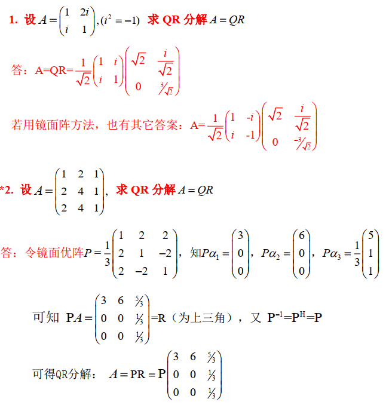

> 正交化，

<!--more-->

## 4.1 Schmidt正交化

设有3个n阶向量 $\alpha_1,\alpha_2,\alpha_3$ 线性无关
$$
\begin{aligned}
令&\beta_1=\alpha_1\\
&\beta_2=\alpha_2-\frac{(\alpha_2,\beta_1)}{\vert \beta_1\vert^2}\\
&\beta_3=\alpha_3-\frac{(\alpha_3,\beta_2)}{\vert \beta_2\vert^2}-\frac{(\alpha_1,\beta_2)}{\vert \beta_2\vert^2}
\end{aligned}
$$
用 Schmidt 方法可构造半U阵 $Q=\left(\frac{\beta_1}{\vert \beta_1\vert},\frac{\beta_2}{\vert \beta_2\vert},\frac{\beta_3}{\vert \beta_3\vert}\right)$ 是半U阵，可知 $Q^HQ=I$

## 4.2 QR分解

### 4.2.1 定义

#### case1

$$
\begin{aligned}
&设A=\left(\alpha_1,\cdots,\alpha_p\right)_{n\times p}，列无关(高阵)，则有分解A=QR，其中\\
&Q=\left(\epsilon_1,\cdots,\epsilon_p \right)_{n\times p}为半U阵，R=\left(
\begin{matrix}
b_1&&*\\
&\ddots&\\
0&&b_p
\end{matrix}
\right)是上三角,b_p>0
\end{aligned}
$$

##### Q阵求法

$$
\begin{matrix}
&由Schmidt公式，产生正交向量组\beta_1,\beta_2,\cdots,\beta_p，\\
&\epsilon_1=\frac{\beta_1}{\vert \beta_1\vert},\cdots,\epsilon_1=\frac{\beta_p}{\vert \beta_p\vert}，则Q是半U阵，Q^HQ=I
\end{matrix}
$$

##### R阵求法

$$
\begin{aligned}
A=QR,则Q^HA=Q^HQR=R\Rightarrow R=Q^HA
\end{aligned}
$$

#### case2

$$
\begin{aligned}
&设方阵A=\left(\alpha_1,\cdots,\alpha_n\right)可逆，则有A=QR，其中\\
&Q=Q_{n\times n} 是U阵，R=\left(
\begin{matrix}
b_1&&*\\
&\ddots&\\
0&&b_p
\end{matrix}
\right)是上三角，且b_i>0
\end{aligned}
$$

#### case 3

$$
\begin{aligned}
任一方阵A=A_{n\times n}都有A=QR，Q是U阵，R=\left(
\begin{matrix}
b_1&&*\\
&\ddots&\\
0&&b_p
\end{matrix}
\right)是上三角
\end{aligned}
$$

### 4.2.2 QR分解步骤

1. 先用 Schmidt 公式，求U阵Q或半U阵Q
2. 在用 $R=Q^HA$，求上三角阵R
3. 写出分解A=QR

**eg**
$$
\begin{aligned}
&A=\left(
\begin{matrix}
1&2i\\
i&1\\
i&0
\end{matrix}
\right)=\left(\alpha_1,\alpha_2\right)，求QR分解
\end{aligned}
$$

----

$$
\begin{aligned}
&\beta_1=\alpha_1=\left(
\begin{matrix}
1\\i\\i
\end{matrix}
\right),\beta_2=\alpha_1-\frac{(\alpha_2,\beta_1)}{\vert \beta_2 \vert^2}\beta_1=\frac{1}{3}\left(
\begin{matrix}
5i\\4\\1
\end{matrix}
\right)\\
&\epsilon_1=\frac{\beta_1}{\vert \beta_1 \vert}=\frac{1}{\sqrt{3}}\left(
\begin{matrix}
1\\i\\i
\end{matrix}
\right),\epsilon_2=\frac{\beta_2}{\vert \beta_2\vert}=\frac{1}{42}\left(
\begin{matrix}
5i\\4\\1
\end{matrix}
\right),\\
&令Q=\left(\epsilon_1,\cdots,\epsilon_2\right)=\left(
\begin{matrix}
\frac{1}{\sqrt{3}}&\frac{5i}{\sqrt{42}}\\
\frac{i}{3}&\frac{4}{\sqrt{42}}\\
\frac{i}{3}&\frac{1}{\sqrt{42}}
\end{matrix}
\right)为半U阵\\
&R=Q^HA=\left(
\begin{matrix}
\frac{1}{\sqrt{3}}&\frac{-i}{3}&\frac{-i}{3}\\
\frac{-5i}{\sqrt{42}}&\frac{4}{\sqrt{42}}&\frac{1}{\sqrt{42}}\\
\end{matrix}
\right)A=\left(
\begin{matrix}
\sqrt{3}&\frac{i}{\sqrt{3}}\\
0&\frac{\sqrt{14}}{\sqrt{3}}
\end{matrix}
\right)为上三角,\\
&可得A=QR=\left(
\begin{matrix}
\frac{1}{\sqrt{3}}&\frac{5i}{\sqrt{42}}\\
\frac{i}{3}&\frac{4}{\sqrt{42}}\\
\frac{i}{3}&\frac{1}{\sqrt{42}}
\end{matrix}
\right)\left(
\begin{matrix}
\sqrt{3}&\frac{i}{\sqrt{3}}\\
0&\frac{\sqrt{14}}{\sqrt{3}}
\end{matrix}
\right)

\end{aligned}
$$

### 4.2.3 例题

#### case2

$$
\begin{aligned}
&A=\left(
\begin{matrix}
1&i\\
i&1
\end{matrix}
\right)=\left(\alpha_1,\alpha_2\right)
\end{aligned}
$$

---

$$
\begin{aligned}
&令\beta_1=\alpha_1=\left(
\begin{matrix}
1\\i
\end{matrix}
\right),\vert \beta_1\vert^2=2,\vert \beta_1\vert=\sqrt{2}\\
&\beta_2=\alpha_2-\frac{(\alpha_2,\beta_1)}{\vert \beta_1\vert^2}\beta_1=\left(
\begin{matrix}
i\\1
\end{matrix}
\right)\\
&单位化，令\epsilon_1=\frac{\beta_1}{\vert \beta_1\vert}=\frac{1}{\sqrt{2}}\beta_1,\epsilon_2=\frac{\beta_2}{\vert \beta_2\vert}=\frac{1}{\sqrt{2}}\beta_2\\
&令Q=\left(
\begin{matrix}
\epsilon_1,\epsilon_2
\end{matrix}
\right)=\left(
\begin{matrix}
\frac{1}{\sqrt{2}}&\frac{i}{\sqrt{2}}\\
\frac{i}{\sqrt{2}}&\frac{1}{\sqrt{2}}
\end{matrix}
\right),R=Q^HA=\left(
\begin{matrix}
\sqrt{2}&0\\
0&\sqrt{2}
\end{matrix}
\right)\\
&可得A=QR=\left(
\begin{matrix}
\frac{1}{\sqrt{2}}&\frac{i}{\sqrt{2}}\\
\frac{i}{\sqrt{2}}&\frac{1}{\sqrt{2}}
\end{matrix}
\right)\left(
\begin{matrix}
\sqrt{2}&0\\
0&\sqrt{2}
\end{matrix}
\right)
\end{aligned}
$$

#### case1

$$
\begin{aligned}
&A=\left(
\alpha_1,\alpha_2,\alpha_3
\right)=\left(
\begin{matrix}
1&-1&4\\
1&4&-2\\
1&4&2\\
1&-1&0
\end{matrix}
\right)_{4\times 3},求A=QR
\end{aligned}
$$

---

$$
\begin{aligned}
&令\beta_1=\alpha_1=\left(
\begin{matrix}
1\\1\\1\\1
\end{matrix}
\right),\vert \beta_1\vert^2=4,\vert \beta_1\vert=2\\
&\beta_2=\alpha_2-\frac{(\alpha_2,\beta_1)}{\vert \beta_1\vert^2}\beta_1=\frac{5}{2}\left(
\begin{matrix}
-1\\1\\1\\-1
\end{matrix}
\right),\vert \beta_2\vert=5,\\
&\beta_3=\alpha_3-\frac{(\alpha_3,\beta_2)}{\vert \beta_2\vert^2}\beta_2-\frac{(\alpha_3,\beta_1)}{\vert \beta_1\vert^2}=2\left(
\begin{matrix}
1\\-1\\1\\-1
\end{matrix}
\right),\vert \beta_3\vert=4\\
&\epsilon_1=\frac{\beta_1}{\vert \beta_1\vert}=\frac{1}{2}\left(
\begin{matrix}
1\\1\\1\\1
\end{matrix}
\right),\epsilon_2=\frac{\beta_2}{\vert \beta_2\vert}=\frac{1}{2}\left(
\begin{matrix}
-1\\1\\1\\-1
\end{matrix}
\right),\epsilon_3=\frac{\beta_3}{\vert \beta_3\vert}=\frac{1}{2}\left(
\begin{matrix}
1\\-1\\1\\-1
\end{matrix}
\right)\\
&
令Q=\left(\epsilon_1,\epsilon_2,\epsilon_3\right)=\frac{1}{2}\left(
\begin{matrix}
1&-1&1\\
1&1&-1\\
1&1&1\\
1&-1&-1
\end{matrix}
\right),为半U阵.R=Q^HA=\left(
\begin{matrix}
2&3&2\\
0&5&-2\\
0&0&4
\end{matrix}
\right)\\
&则A=QR=\frac{1}{2}\left(
\begin{matrix}
1&-1&1\\
1&1&-1\\
1&1&1\\
1&-1&-1
\end{matrix}
\right)\left(
\begin{matrix}
2&3&2\\
0&5&-2\\
0&0&4
\end{matrix}
\right)
\end{aligned}
$$

### 4.2.4 QR分解证明

$$
\begin{aligned}
&有Schmidt公式，可将A的列向量写为:\\
&\left\{
\begin{aligned}
&\beta_1=\alpha_1\\
&\vdots\\
&\beta_p=\alpha_p-\frac{(\alpha_p,\beta_1)}{\vert \beta_1\vert^2}\beta_1-\cdots-\frac{(\alpha_p,\beta_{p-1})}{\vert \beta_{p-1}\vert^2}\beta_{p-1}\\
\end{aligned}
\right.\\
&可知 \alpha向量组与\beta向量组可互相表出：\\
&\left\{
\begin{aligned}
&\alpha_1=\beta_1\\
&\alpha_2=(*)\beta_2+\beta_1\\
&\vdots\\
&\alpha_p=(*)\beta_1+(*)\beta_2+\cdots+\beta_p
\end{aligned}
\right.\\
&\Rightarrow \left(\alpha_1,\cdots,\alpha_p\right)=\left(\beta_1,\beta_2,\cdots,\beta_p\right)\left(
\begin{matrix}
1&*&\cdots&*\\
0&1&\cdots&*\\
\vdots&\vdots&\ddots&\vdots\\
0&0&\cdots&1
\end{matrix}
\right)\\
&若将\beta向量组单位化：\epsilon_1=\frac{\beta_1}{\vert \beta_1\vert},\epsilon=\frac{\beta_2}{\vert \beta_2\vert},\cdots,\epsilon_p=\frac{\beta_p}{\vert \beta_p\vert}\\
&则\left(\beta_1,\beta_2,\cdots,\beta_p\right)=\left(
\vert \beta_1\vert\epsilon_1,\vert \beta_2\vert\epsilon_2,\cdots,\vert \beta_p\vert\epsilon_p
\right)\\
&=\left(\epsilon_1,\epsilon_2,\cdots,\epsilon_p\right)\left(
\begin{matrix}
\vert \beta_1\vert &&\\
&&\vert \beta_2\vert& \\
&&&\ddots&\\
&&&&\vert \beta_p\vert
\end{matrix}
\right)\\
&故A=\left(\beta_1,\beta_2,\cdots,\beta_p\right)\left(
\begin{matrix}
1&*&\cdots&*\\
0&1&\cdots&*\\
\vdots&\vdots&\ddots&\vdots\\
0&0&\cdots&1
\end{matrix}
\right)\\
&=\left(\epsilon_1,\epsilon_2,\cdots,\epsilon_p\right)\left(
\begin{matrix}
\vert \beta_1\vert &&\\
&&\vert \beta_2\vert& \\
&&&\ddots&\\
&&&&\vert \beta_p\vert
\end{matrix}
\right)\left(
\begin{matrix}
1&*&\cdots&*\\
0&1&\cdots&*\\
\vdots&\vdots&\ddots&\vdots\\
0&0&\cdots&1
\end{matrix}
\right)\\
&=\left(\epsilon_1,\epsilon_2,\cdots,\epsilon_p\right)\left(
\begin{matrix}
\vert \beta_1\vert&*&\cdots&*\\
0&\vert \beta_2\vert&\cdots&*\\
\vdots&\vdots&\ddots&\vdots\\
0&0&\cdots&\vert \beta_p\vert
\end{matrix}
\right)\\
&=QR
\end{aligned}
$$

### 4.2.5 QR分解的平移性质

$$
\begin{aligned}
&若方阵A_{n\times n}不可逆，(\vert A\vert =0)，令A_{\epsilon}=(A+\epsilon I),A_{\epsilon}可逆\Rightarrow A_\epsilon=Q_\epsilon R_{\epsilon}\\
&若\epsilon\rightarrow 0\Rightarrow A=QR,Q为U阵，R为上三角阵
\end{aligned}
$$

