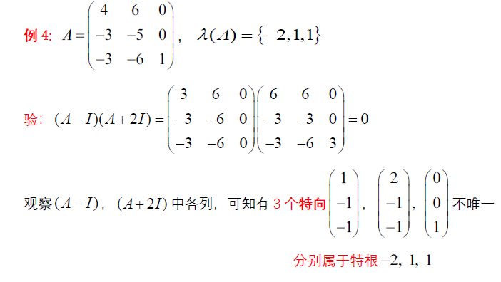
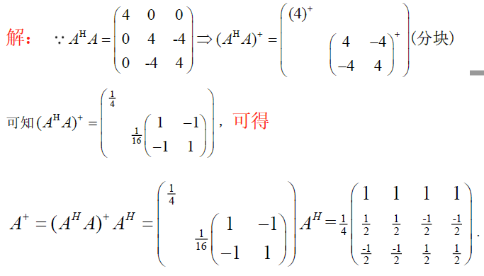
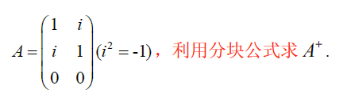
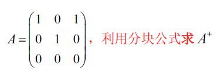

> 矩阵上的运算：特根特向求法，张量积，广义逆

<!--more-->

## 4.1 特根特向求法

### 4.1.1 特根求法

$$
若n阶方阵A=(a_{ij})中 "行和=常数k" ，则常数k为A的一个特征根，全1向量X=\left(
\begin{matrix}
1\\\vdots\\1
\end{matrix}
\right)为k相应的特向
$$

$$
若n阶方阵A=(a_{ij})中“列和=常数k”,则常数k为A^T的一个特根，全1向量=\left(
\begin{matrix}
1\\\vdots\\1
\end{matrix}
\right)为A^T的一个特向
$$

**eg**
$$
\$$
\begin{aligned}
&A=\left(
\begin{matrix}
1&2\\0&-1
\end{matrix}
\right)，B=\left(
\begin{matrix}
3&3&3\\-1&-1&-1\\-1&-1&-1
\end{matrix}
\right),可知A与B都是列和为1的矩阵，可以验证\\
&X=\left(
\begin{matrix}
1\\1
\end{matrix}
\right),AX=\left(
\begin{matrix}
3\\-1
\end{matrix}
\right),Y=\left(
\begin{matrix}
1\\1\\1
\end{matrix}
\right)，BY=\left(
\begin{matrix}
3&3&3\\-1&-1&-1\\-1&-1&-1
\end{matrix}
\right)\left(
\begin{matrix}
1\\1\\1
\end{matrix}
\right)=\left(
\begin{matrix}
9\\-3\\-3
\end{matrix}
\right)\\
&故全一向量不是列和矩阵的特征向量\\
&而对于A^T=\left(
\begin{matrix}
1&0\\2&-1
\end{matrix}
\right)与B^T=\left(
\begin{matrix}
3&-1&-1\\3&-1&-1\\3&-1&-1
\end{matrix}
\right)为行和矩阵，
\end{aligned}，特征值1对象的特征向量为全一向量
$$
$$
\begin{aligned}
&已知二阶阵A=\left(
\begin{matrix}
3&1\\2&2
\end{matrix}
\right)(行和阵),特根为4,tr(A)-4=1,相应特向X=\left(
\begin{matrix}
1\\1
\end{matrix}
\right),Y=\left(
\begin{matrix}
1\\-2
\end{matrix}
\right)\\
&X，Y线性无关，所以P=\left(
X,Y
\right)=\left(
\begin{matrix}
1&1\\1&-2
\end{matrix}
\right)为可逆阵，故A可相似对角化为对角阵\\
&P^{-1}AP=D=\left(
\begin{matrix}
4&0\\
0&1
\end{matrix}
\right),故可知A为单阵
\end{aligned}
$$

**实对称阵特根为实数**

### 4.1.2 特征向量
$$
若(A-\lambda_1I)P=0,则P中的列都是\lambda_1的特征向量
$$
证明：
$$
\begin{aligned}
&(A-\lambda_1I)P=0\iff AP=\lambda_1 P,令P=(X_1,\cdots,X_n)，按列分块，则有\\
&A(X_1,\cdots,X_n)=\lambda_1(X_1,\cdots,X_n)\Rightarrow (AX_1,\cdots,AX_n)=(\lambda_1X_1,\cdots,\lambda_nX_n)\\
&则P中各列都是\lambda_1的特征向量
\end{aligned}
$$
#### a. 两个互异特根的特向
$$
若 (A-\lambda_1I)(A-\lambda_2I)=0,则(A-\lambda_2I)的列都是\lambda_1的特向，(A-\lambda_1I)的列是\lambda_2的特向
$$
eg：
$$
\begin{aligned}
&A=\left(
\begin{matrix}
1&0&-2\\0&0&0\\-2&0&4
\end{matrix}
\right)(为正规H单阵)，全体特征根\lambda(A)=\{5,0,0\},不同特征根为5,0\\
&由于A是单阵，必有(A-\lambda_1I)(A-\lambda_2I)=(A-5I)(A-0I)=0\\
&其中，\lambda_1=5对应的特征向量为A中的一个列向量\left(
\begin{matrix}
1\\0\\-2
\end{matrix}
\right)，\\
&\lambda_2=0对应的特征向量为A-5I=\left(
\begin{matrix}
-4&0&-2\\0&-5&0\\-2&0&-1
\end{matrix}
\right)的列向量\\
&分别为 \left(
\begin{matrix}
0\\1\\0
\end{matrix}
\right)\left(
\begin{matrix}
2\\0\\1
\end{matrix}
\right)
\end{aligned}
$$
---

#### b. 幂等阵的一个特向
$$
若A为幂等阵：A^2=A，则必有(A-I)A=0,则A中的列都是\lambda_1=1的特征向量
$$
如：
$$
A=\left(
\begin{matrix}
1&0\\-1&0
\end{matrix}
\right),A^2=A为幂等阵，则A中非0列\left(
\begin{matrix}
1\\-1
\end{matrix}
\right)是\lambda_1=1的特征向量
$$
#### c. 三个互异特根的特向
$$
\begin{aligned}
若&(A-\lambda_1I)(A-\lambda_2I)(A-\lambda_3I)=0,则\\
&(A-\lambda_2I)(A-\lambda_3I)中非零列为\lambda_1的特向\\
&(A-\lambda_1I)(A-\lambda_3I)中非零列为\lambda_2的特向\\
&(A-\lambda_1I)(A-\lambda_2I)中非零列为\lambda_3的特向
\end{aligned}
$$
**eg**
$$
A=\left(
\begin{matrix}
-1&i&0\\-i&0&-i\\0&i&-i
\end{matrix}
\right)，求特征向量
$$

$$
\begin{aligned}
&由特征多项式计算得\lambda(A)=\{1,-1,2\}，3阶方阵有3个互异特征根，故A为单阵\\
&且有0化式(x-1)(x+1)(x-2)成立，即(A-I)(A+I)(A-2I)=0成立，\\
&可知\lambda_1=1,\lambda_2=-1,\lambda_3=2对应的特征向量\\
&分别为(A+I)(A-2I),(A-I)(A-2I),(A-I)(A+I)的列向量,即有X_1=\left(
\begin{matrix}
1\\-2i\\1
\end{matrix}
\right)\\
&X_2=\left(
\begin{matrix}
-1\\0\\1
\end{matrix}
\right),X_3=\left(
\begin{matrix}
1\\i\\1
\end{matrix}
\right),可令U阵Q=\left(
\frac{X_1}{\sqrt{6}},\frac{X_2}{\sqrt{2}},\frac{X_3}{\sqrt{3}}
\right),必有Q^{-1}AQ=D=\left(
\begin{matrix}
1&&\\
&-1&\\
&&-2
\end{matrix}
\right)
\end{aligned}
$$
#### d. 重根的特向
$$
\begin{aligned}
&若(A-\lambda I)^2=0,则(A-\lambda I)中非0列都是\lambda的特向\\
&SP:若A^2=0,则A中非0列都是\lambda 的特向
\end{aligned}
$$
**eg**

---
$$
A=\left(
\begin{matrix}
2&0&0\\1&1&1\\1&-1&3
\end{matrix}
\right)，其A的特向
$$

$$
\begin{aligned}
&\lambda(A)=\{2,2,2\},0化式为(x-2)^3，且 (A-2I)^2=\left(
\begin{matrix}
0&0&0\\1&-1&1\\1&-1&1
\end{matrix}
\right)\left(
\begin{matrix}
0&0&0\\1&-1&1\\1&-1&1
\end{matrix}
\right)=0\\
&可见其特向为 \left(
\begin{matrix}
0\\1\\1
\end{matrix}
\right),且三重根\lambda=2只有一个特向，所以A不是单阵
\end{aligned}
$$
### 4.1.3 交换定理与公共特征向量
$$
若方阵AB=BA(可交换)，任取A的特根的特向X，满足AX=\lambda X,BX=tX\\
即X是A和B的公共特征向量
$$

$$
若A，B为n阶实对称阵，且可交换AB=BA，则存在正交阵Q，使Q^{-1}AQ,Q^{-1}BQ为对角阵
$$
## 4.2 张量积

### 4.2.1 定义
$$
\begin{aligned}
&设A=(a_{ij})_{m\times n},B=(b_{ij})_{p\times q},则称如下分块矩阵\left(
\begin{matrix}
a_{11}B&a_{12}B&\cdots&a_{1n}B\\
a_{21}B&a_{22}B&\cdots&a_{2n}B\\
\vdots&\vdots&\ddots&\vdots\\
a_{n1}B&a_{n2}&\cdots&a_{nn}
\end{matrix}
\right)为A与B的张量积\\
&记作A\otimes B=(a_{ij}B)_{mp\times nq}
\end{aligned}
$$
**eg**
$$
A=\left(
\begin{matrix}
a&b\\c&d
\end{matrix}
\right),B=\left(
\begin{matrix}
2\\3
\end{matrix}
\right)
$$

$$
\begin{aligned}
&A\otimes B=\left(
\begin{matrix}
aB&bB\\cB&dB
\end{matrix}
\right)=\left(
\begin{matrix}
2a&2b\\3a&3b\\2c&2d\\3c&3d
\end{matrix}
\right),B\otimes A=\left(
\begin{matrix}
2A\\3B
\end{matrix}
\right)=\left(
\begin{matrix}
2a&2b\\2c&2d\\3a&3b\\3c&3d
\end{matrix}
\right)
\end{aligned}
$$
- **张量积不满足交换律**

#### 定理

1. 两个上三角的张量积也是上三角
2. 两个对角阵的张量积是对角阵
3. $I_n\otimes I_m=I_{m}\otimes I_n=I_{m\times n}$

### 4.2.2 计算

#### a. 分块法

**右进右出**
$$
\left(
\begin{matrix}
A&B\\C&D
\end{matrix}
\right)\otimes F=\left(
\begin{matrix}
A\otimes F&B\otimes F\\C\otimes F&D\otimes F
\end{matrix}
\right)
(A\quad B)\otimes F=(A\otimes F\quad B\otimes F)
$$
一般情况下：$(A\quad B) \otimes F\neq (A\otimes F\quad B\otimes F)$

#### b. 向量与向量张量积
$$
列向量\alpha=\left(
\begin{matrix}
a_1\\a_2\\\vdots\\a_n
\end{matrix}
\right)\beta=\left(
\begin{matrix}
b_1\\b_2\\\vdots\\b_q
\end{matrix}
\right),则\alpha \otimes \beta=\left(
\begin{matrix}
a_1\otimes \beta\\a_2\otimes \beta\\\vdots\\a_n\otimes \beta
\end{matrix}
\right)_{nq\times 1}=\left(
\begin{matrix}
a_1b_1\\a_1b_2\\\vdots\\a_1b_q\\\vdots \\a_nb_1\\a_nb_2\\\vdots\\a_nb_q
\end{matrix}
\right)_{nq\times 1}
$$
#### c. 向量与矩阵张量积
$$
列向量\alpha=\left(
\begin{matrix}
a_1\\a_2\\\vdots\\a_m
\end{matrix}
\right),B_{n\times q}=(\beta_1,\beta_2,\cdots,\beta_q)，\alpha\otimes B=\left(
\begin{matrix}
a_1B\\a_2B\\\vdots\\a_mB
\end{matrix}
\right)=\left(
\begin{matrix}
a_1(\beta_1,\beta_2,\cdots,\beta_q)\\
a_2(\beta_1,\beta_2,\cdots,\beta_q)\\
\vdots\\
a_m(\beta_1,\beta_2,\cdots,\beta_q)\\
\end{matrix}
\right)=\left(
\begin{matrix}
a_1b_{11}&a_1b_{12}&\cdots&a_1b_{1q}\\
a_1b_{21}&a_1b_{22}&\cdots&a_1b_{2q}\\
\vdots&\vdots&\ddots&\vdots\\
a_1b_{p1}&a_1b_{p2}&\cdots&a_1b_{pq}\\
a_2b_{11}&a_2b_{12}&\cdots&a_2b_{1q}\\
a_2b_{21}&a_2b_{22}&\cdots&a_2b_{2q}\\
\vdots&\vdots&\ddots&\vdots\\
a_2b_{p1}&a_2b_{p2}&\cdots&a_2b_{pq}\\
\vdots&\vdots&\vdots&\vdots\\
a_mb_{11}&a_mb_{12}&\cdots&a_mb_{1q}\\
a_mb_{21}&a_mb_{22}&\cdots&a_mb_{2q}\\
\vdots&\vdots&\ddots&\vdots\\
a_mb_{p1}&a_mb_{p2}&\cdots&a_mb_{pq}\\
\end{matrix}
\right)_{mp\times q}
$$
### 4.2.3 运算律

1. $k(A\otimes B)=(kA)\otimes B=A\otimes (kB)$

2. 分配律：$(A+B)\otimes C=A\otimes C+B\otimes C$ ，$C\otimes(A+B)=C\otimes A+C\otimes B$

3. 结合律：$(A\otimes B)\otimes C=A\otimes (B\otimes C)$

4. 吸收律：$(A\otimes B)(C\otimes D)=(AC)\otimes (BD)$

   

   推论：
$$
   \begin{aligned}
   &若A=A_{m\times m}为m阶方阵,B=B_{n\times n}为n阶方阵，则\\
   &(A\otimes B)^k=A^k\otimes B^k\\
   &(A\otimes I_n)(I_m\otimes B)=A\otimes B
   \end{aligned}
$$

$$
   \begin{aligned}
   &(A_1\otimes B_1)(A_2\otimes B_2)\cdots(A_k\otimes B_k)=(A_1A_2\cdots A_k)\otimes (B_1\otimes B_2\cdots B_k)\\
   &(A_1\otimes A_2\otimes \cdots\otimes A_k)(B_1\otimes B_2\otimes \cdots\otimes B_k)=(A_1B_1)\otimes(A_2\otimes \cdots\otimes A_k)(B_2\otimes \cdots\otimes B_k)=(A_1B_1)\otimes (A_2B_2)\otimes \cdots \otimes (A_kB_k)
   \end{aligned}
$$
   eg：
$$
   A=A_{m\times m}，证明e^{A\otimes I_n}=e^A\otimes I_n
$$

$$
   \begin{aligned}
   &e^{A\otimes I_n}=\sum_{k=1}\limits^\infty\frac{1}{k!}(A\otimes I)^k=\sum_{k=1}\limits^\infty\frac{1}{k!}(A^k\otimes I^k)=(\sum_{k=1}\limits^\infty\frac{1}{k!}A^k)\otimes I^k=e^A\otimes I
   \end{aligned}
$$
5. 转置公式：
$$
   \begin{aligned}
   &(A\otimes B)^H=A^H\otimes B^H\\
   &(A\otimes B)^{-1}= A^{-1}\otimes B^{-1}
   \end{aligned}
$$
6. 若A与B都是U阵，则 $A\otimes B$ U阵

7. 秩公式：$r(A\otimes B)=r(A)r(B)$

   推论：
$$
   \begin{aligned}
   &若X_1、\cdots、X_p为C^m中p个线性无关的列向量，Y_1、\cdots、Y_q为C^n中q个线性无关列向量，则\\
   &则pq个列向量(X_i\otimes Y_j)线性无关
   \end{aligned}
$$
   由于 $r(\{X\otimes Y\})=r(\{X\})r(\{Y\})$ ，张量积的秩等于两个向量组的秩的乘积，所以张量积线性无关

### 4.2.4 张量积行列式

设 $A=(a_{ij}) \in C^{m\times m} ，B=(b_{ij})\in C^{n\times n}$ ，则
$$
\begin{aligned}
&tr(A\otimes B)=tr(A)*tr(B)\\
&\vert A\otimes B \vert=\vert A \vert^n\vert B \vert^m
\end{aligned}
$$
证明：

$$
\begin{aligned}
&由许尔公式，存在可逆阵P使P^{-1}AP=\left(
\begin{matrix}
\lambda_1&&*\\
&\ddots&\\
0&&\lambda_m
\end{matrix}
\right)为上三角，且P\otimes I为可逆阵，构造一个新公式\\
&(P\otimes I)^{-1}A\otimes B(P\otimes I)=(P^{-1}AP)\otimes B=A_1\otimes B=\left(
\begin{matrix}
\lambda_1B&&&(*B)\\
&\lambda_2B&&\\
&&\ddots&\\
0&&&\lambda_mB
\end{matrix}
\right)\\
&故\vert A\otimes B \vert=\vert \lambda_1^nB\vert\vert \lambda_2^nB\vert\cdots\vert \lambda_m^nB\vert^m=\vert \lambda_1^n\lambda_2^n\cdots\lambda_m^n\vert\vert B \vert^m = \vert A \vert^n\vert B\vert ^m
\end{aligned}
$$
### 4.2.5 张量积特征值特征向量

#### 特征值
$$
\begin{aligned}
&若A=A_{m\times m} 的特征根为\lambda_1,\lambda_2,\cdots,\lambda_m，B=B_{n\times n} 的特征根为t_1,t_2,\cdots,t_n，则\\
&A\otimes B的全体特征根为mn个数\{\lambda_kt_j\}，(k=1,2,\cdots,m\quad j=1,2,\cdots,n)
\end{aligned}
$$
#### 特征向量
$$
\begin{aligned}
&设\{X_1,\cdots,X_p\}是A\in C^{m\times m}关于\lambda的线性无关的特征向量,\{Y_1,\cdots,Y_q\}是B\in C^{n\times n}关于t的线性\\
&无关的特征向量，则pq个向量 \{X_i\otimes Y_j\} 是A\otimes B关于\lambda t的特征向量
\end{aligned}
$$

**eg**

$$
\begin{aligned}
&A=\left(
\begin{matrix}
2&2\\1&3
\end{matrix}
\right)\otimes \left(
\begin{matrix}
1&-1\\0&1
\end{matrix}
\right)=B\otimes D,且B为行和等矩阵，D为上三角阵，则\lambda(A)=\{4,tr(A)-4\}=\{4,1\},\lambda(B)=\{1,1\}\\
&\therefore A\otimes B=\prod\lambda_A\lambda_B=\{4,4,1,1\},特式\vert \lambda I-A\vert=(\lambda-4)^2(\lambda-1)^2\\
&可知，\left(
\begin{matrix}
1\\1
\end{matrix}
\right)\left(
\begin{matrix}
-2\\1
\end{matrix}
\right)是B的特征向量，\left(
\begin{matrix}
1\\0
\end{matrix}
\right)是D的特征向朗,故A\otimes B的特征向量为\left(
\begin{matrix}
1\\0\\1\\0
\end{matrix}
\right),\left(
\begin{matrix}
-2\\0\\1\\0
\end{matrix}
\right)
\end{aligned}
$$
#### $A\otimes I\pm I\otimes B$

## 4.3 广义逆

### 4.3.1 定义
$$
\begin{aligned}
&若 m\times n 矩阵A=A_{m\times n} 与矩阵 X=X_{n\times m} 满足四个条件\\
&①AXA=A,\quad ② XAX=X，\quad ③(AX)^H=AX,\quad ④(XA)^H=XA\\
&则X为A的加号逆(广义逆)，记为X=A^+
\end{aligned}
$$
#### a. 性质

- A与X互为加号逆

- $A^{+}$ 具有唯一性
  $$
  \begin{aligned}
    &证明：(反证法)\\
    &假设X，Y都满足四个条件,有AXA=A,XAX=X,(AX)^H=AX,(AY)^H=AY,\\
    &AYA=A,YAY=Y,(AY)^H=AY,(YA)^H=YA\\
    &有X=XAX\xlongequal{A=AYA(替换右侧X)}XAYAX=X(AY)^H(AX)^H=X[(AX)(AY)]^H\\
    &\xlongequal{AXA=A}X(AY)^H=XAY\xlongequal{AYA=A(消去左侧X)}XAYAY=(XA)^H(YA)^HY=\\
    &[(YA)(XA)]^HA=(YA)^HY=Y\\
    &故可得A^+具有唯一性
    \end{aligned}
  $$

- $A^+$ 的H穿脱公式：$(A^H)^+=(A^+)^H$

- 乘积的加号逆无穿脱公式：$(AB)^+\neq B^+A^+$

#### b. 特殊矩阵的广义逆

- $A=0$ ，则 $A^{+}=0$ 

- 若方阵 $A=A_{n\times n}$ 可逆 ($\vert A \vert\neq 0$) ，则 $A^+=A^{-1}$

- 若 $A=(a)$ 为1阶阵，即 $A=(复数a)$ ，则有 $(a)^+=a^+=\left\{\begin{aligned}a^{-1},&a\neq 0\\0,&a=0\end{aligned}\right.$ 

- 对角阵 $D=\left(\begin{matrix}a_1&&&\\&a_2&&\\&&\ddots\\&&&a_n\end{matrix}\right)$ ，则 $D^+=\left(\begin{matrix}a_1^+&&&\\&a_2^+&&\\&&\ddots\\&&&a_n^+\end{matrix}\right)$ 

  **eg：**

  

   $D^+D=DD^+$ ，且 $(D^+)^k=(D^k)^+$ ，(k=1,2,...)

  **证明：**

  

- A为Hermite幂等阵，即 $A^H=A=A^2$ ，则 $A^+=A$ 

- 若A为列优阵($A^HA=I$) ，则 $A^+=A^H$
  $$
  \begin{aligned}
  &证明:由于 A 是列半U阵，则 A^HA=I\\
  &A^HAA^H=A^H,AA^HA=A,(A^HA)^H=I=A^HA,(AA^H)^H=AA^H
  \end{aligned}
  $$
  若 $A^H$ 为列优阵(A为行优阵)($AA^H=I$) ，则  $A^+=A^H$
  $$
  \begin{aligned}
  &证明:由于 A 是行半U阵，则 AA^H=I\\
  &A^HAA^H=A^H,AA^HA=A,(A^HA)^H=A^HA,(AA^H)^H=I=AA^H
  \end{aligned}
  $$

- 若A为U阵(`单位正交阵`)，则 $A^+=A^H=A^{-1}$ 

  若A为U阵，则 $A^HA=AA^H=I,A^H=A^{-1}$

  $A^HAA^H=A^H,AA^HA=A,(AA^H)^H=I=AA^H,(A^HA)^H=A^HA$ ，故 $A^+=A^H$

- 若A为单阵(`可相似对角化`)且**可逆** ，则有谱分解 $A=\lambda_1G_1+\cdots+\lambda_kG_k$ 且 $A^+=\lambda_1^{-1}G_1+\cdots+\lambda_k^{-1}G_k$ 

  若不满足可逆条件，则未必成立
  
- 若A为正规阵(`正规方阵`)，则 $A^+$ 也为正规阵

  有正规分解 $A=QDD^H$ ，则 $A^+=QD^+Q^H$

  有谱分解 $A=\lambda_1^+G_1+\cdots+\lambda_k^+G_k$ 

#### c. $AA^+$ 与 $A^+A$ 相关结论

- $AA^+$ 与 $A^+A$ 都是Hermite阵

- $r(A^+A)=r(AA^+)=r(A)$

  由于矩阵的秩越乘越小，则 $r(AA^+)\le r(A)$ 而 $A=AA^+A$ ，则 $r(A)\le r(AA^+)$ ，故有 $r(AA^+)\le r(A)\le r(AA^+)$

- 幂等性：$(AA^+)^2=AA^+$ ，$(A^+A)^2=A^+A$

  

  
$$
\begin{aligned}
  &(1)A=\left(
  \begin{matrix}1&0\\2&1
  \end{matrix}
  \right)为可逆阵，则A^+=A^{-1}=\left(
  \begin{matrix}1&0\\-2&1
  \end{matrix}
  \right),A=\left(
  \begin{matrix}
  a&b\\c&d
  \end{matrix}
  \right)=\frac{1}{\vert A\vert}\left(
  \begin{matrix}
  d&-b\\-c&a
  \end{matrix}
  \right)\\
  &(2)(3)(4)中A为对角阵
  \end{aligned}
$$

- $\lambda(AA^+) 与 \lambda(A^+A)$ 都有r(A) 个1

  设 $A\in C^{m,n},A^+\in C^{n,m}$ 由于 $AA^+$ 与 $A^+A$ 都是 Hermite 阵，且 $A^+A$ 是幂等阵， $(AA^+)^2=AA^+,(A^+A)^2=A^+A$ ，由Caley定理 $x^2=x$ 则其0化式为 $x^2-x=0$ ，$AA^+$ 有两个不同的根1和0

  已知 $r(A^+A)=r(AA^+)=r(A)=r$ ，

  则 $AA^+$ 有r个正根，m-r 个0根;$A^+A$ 有r个正根，n-r 个0根

- $A^+A$ 与 $AA^+$ 都是半正定阵 ($AA^+ \ge 0,A^+A\ge 0$)

  已知 $A^+A$ 为幂等阵，则 $(AA^+)^2=(AA^+)^H(AA^+)\xlongequal{P=AA^+}P^HP\ge 0$ ，故 $AA^+$ 为半正定阵，同理 $AA+$ 为半正定阵

  由Caley定理，$x^2=x$ ，则0化式 $x(x-1)=0$ ，故特根 $\ge$ 0 ，为半正定阵

- 一般有 $AA^+\neq I$ , $A^+A\neq I$ （列半U以上）, 且 $AA^+\neq A^+A$ (正规阵)

- 若 A 为正规阵，则 $A^+A=AA^+$ ，且 $(A^+)^k=(A^k)^+,k=0,1,2,\cdots$ 
  $$
  \begin{aligned}
  &由于A是正规阵，则AA^H=A^HA,A有正规分解A=QDQ^H=Q\left(
  \begin{matrix}
  \lambda_1&&\\&\ddots&\\&&\lambda_n
  \end{matrix}
  \right)Q^H,其中Q为U阵\Rightarrow \\
  &\Rightarrow A^+=(QDQ^H)^+=(Q^H)^+D^+Q^+\xlongequal{Q^+=Q^H}QD^+Q^H,\\
  &\Rightarrow (A^+)^k=(QD^+Q^H)^k=Q(D^+)^kQ^H=Q(D^k)^+Q^H=(A^k)^+\\
  &且A^+A=(QD^+Q^H)QDQ^H=(QD^+DQ^H)=QDD^+Q^H=(QDQ^H)(QD^+Q^H)=AA^+
  \end{aligned}
  $$

### 4.3.2 $A^+$ 计算

#### a. 秩1公式

$$
\begin{matrix}
若A=(a_{ij})_{m\times n},r(A)=1,则A^+=\frac{1}{\sum \vert a_{ij}\vert^2}A^H=\frac{1}{tr(A^HA)}A^H
\end{matrix}
$$

$A^HA$ 的相关结论：

- $tr(A^HA)=t(AA^H)=\sum\vert a_{ij}\vert^2=\Vert A \Vert_F^2$
- $r(A^HA)=r(AA^H)=r(A)$
- $A^HA,AA^H$ 为半正定阵

证明：
$$
\begin{aligned}
&由于r(A)=1,则A^HA优相似与对角阵D=\left(
\begin{matrix}
\lambda_1&&&\\&0&\\&&\ddots&\\&&&0
\end{matrix}
\right)，其中\sqrt{\lambda_1} 为正奇值\Rightarrow\\
&tr(A^HA)=tr(AA^H)=\lambda_1=\sum\vert a_{ij}\vert^2,则A的正SVD为A=P\Delta Q^H=P\left(\sqrt{\lambda_1}\right)Q^H,其中P^HP=Q^HQ=I\\
&A^H=Q\Delta P^H=Q(\sqrt{\lambda_1})P^H,A^+=Q\Delta^{-1}P^H=Q(\frac{1}{\sqrt{\lambda_1}})P^H\\
&\Rightarrow A^+=\frac{1}
{(\sqrt{\lambda_1})^2}Q(\sqrt{\lambda_1})P^H=\frac{1}{(\sqrt{\lambda_1})^2}Q\Delta P^H=\frac{1}{(\sqrt{\lambda_1})^2}A^H=\frac{1}{tr(A^HA)}A^H=\frac{1}{\sum \vert a_{ij}\vert^2}A^H\\
\end{aligned}
$$
**eg**：

#### b. 正奇公式(第一公式)

$$
\begin{aligned}
&若A=A_{m\times n} 有正SVD，A=P\Delta Q^H,\Delta=\left(
\begin{matrix}
s_1&&\\&\ddots&\\&&s_r
\end{matrix}
\right)>0,，其中P，Q为半U阵，P^HP=I_r=Q^HQ\\
&则有公式A^+=Q\Delta^{-1}P^H,其中 \Delta^{-1}=\Delta^{+}
\end{aligned}
$$
由 $A^+$ 的正奇公式，可证 **逆的H穿脱公式** $(A^H)^+=(A^+)^H$ 

- $A^+$ 的正奇值为 $\{s_1^{-1},s_2^{-1},\cdots,s_r^{-1}\}$ ，且有公式 $\Vert A^+\Vert_F=\sqrt{s_1^{-2},\cdots,s_r^{-2}}$ ，$\Vert A^+\Vert_2=s_r^{-1}$

**证明**：
$$
\begin{aligned}
&A=P\Delta Q^H\Rightarrow A^H=Q\Delta P^H为A^H的正SVD\\
&A^+=Q\Delta^{-1}P^H,(A^H)^+=P\Delta^{-1}Q^H\Rightarrow (A^+)^H=P\Delta^{-1}Q^H=(A^H)^+
\end{aligned}
$$
**eg**

$$
\begin{aligned}
&(1)求正奇值，A^HA=\left(
\begin{matrix}
1&0&2\\0&1&0
\end{matrix}
\right)\left(
\begin{matrix}
1&0\\0&1\\2&0
\end{matrix}
\right)=\left(
\begin{matrix}
5&0\\0&1
\end{matrix}
\right),\lambda(A)=\{5,1\},正奇值为\sqrt{5},1,令\Delta=\left(
\begin{matrix}
\sqrt{5} & 0\\0&1
\end{matrix}
\right)\\
&(2)SVD，Q=(q_1,q_2)=\left(
\begin{matrix}
1&0\\0&1
\end{matrix}
\right),P=\left(
\begin{matrix}
\frac{Aq_1}{\vert Aq_1\vert},\frac{Aq_2}{\vert Aq_2\vert}
\end{matrix}
\right)=\left(
\begin{matrix}
\frac{1}{\sqrt{5}}&0\\0&1\\\frac{2}{\sqrt{5}}&0\\
\end{matrix}
\right),A=P\Delta Q^H=\left(
\begin{matrix}
\frac{1}{\sqrt{5}}&0\\0&1\\\frac{2}{\sqrt{5}}&0\\
\end{matrix}
\right)\left(
\begin{matrix}
\sqrt{5} & 0\\0&1
\end{matrix}
\right)\left(
\begin{matrix}
1&0\\0&1
\end{matrix}
\right)^H\\
&(3)A^+=Q\Delta^{-1}P^H=\left(
\begin{matrix}
1&0\\0&1
\end{matrix}
\right)\frac{1}{\sqrt{5}}\left(
\begin{matrix}
1&0\\0&\sqrt{5}
\end{matrix}
\right)\left(
\begin{matrix}
\frac{1}{\sqrt{5}}&0&\frac{2}{\sqrt{5}}\\0&1&0\\
\end{matrix}
\right)=\left(
\begin{matrix}
\frac{1}{\sqrt{5}}&0\\0&1
\end{matrix}
\right)\left(
\begin{matrix}
\frac{1}{\sqrt{5}}&0&\frac{2}{\sqrt{5}}\\0&1&0\\
\end{matrix}
\right)=\left(
\begin{matrix}
\frac{1}{5}&0&\frac{2}{5}\\
0&1&0
\end{matrix}
\right)\\
&(4)\because B=A^H,则B^+=(A^H)^+=(A^+)^H=\left(
\begin{matrix}
\frac{1}{5}&0\\0&1\\\frac{2}{5}&0
\end{matrix}
\right)
\end{aligned}
$$
---

$$
\begin{aligned}
&A^HA=\left(
\begin{matrix}
2&1\\1&2
\end{matrix}
\right),\lambda(A^HA)=\{3,1\},正奇值S^+=\{\sqrt{3},1\},故A^HA优相似与\Delta=\left(
\begin{matrix}
\sqrt{3}&0\\0&1
\end{matrix}
\right),\\
&\lambda_1=3的特根q_1=\left(
\begin{matrix}
1\\1
\end{matrix}
\right),\lambda_2=1的特根为q_2=\left(
\begin{matrix}
1\\-1
\end{matrix}
\right),\\
&Q=(q_1,q_2)=\left(
\begin{matrix}
\frac{1}{\sqrt{2}}&\frac{1}{\sqrt{2}}\\
\frac{1}{\sqrt{2}}&-\frac{1}{\sqrt{2}}
\end{matrix}
\right),P=\left(\frac{Aq_1}{\vert Aq_1 \vert},\frac{Aq_2}{\vert Aq_2 \vert}\right)=\left(
\begin{matrix}
\frac{1}{\sqrt{6}}\left(
\begin{matrix}
1\\1\\2
\end{matrix}
\right),\frac{1}{\sqrt{2}}\left(
\begin{matrix}
1\\-1\\0
\end{matrix}
\right)
\end{matrix}
\right)=\left(
\begin{matrix}
\frac{1}{\sqrt{6}}&\frac{1}{\sqrt{2}}\\
\frac{1}{\sqrt{6}}&-\frac{1}{\sqrt{2}}\\
\frac{2}{\sqrt{6}}&0\\
\end{matrix}
\right)\\
&A=P\Delta Q^H=\left(
\begin{matrix}
\frac{1}{\sqrt{6}}&\frac{1}{\sqrt{2}}\\
\frac{1}{\sqrt{6}}&-\frac{1}{\sqrt{2}}\\
\frac{2}{\sqrt{6}}&0\\
\end{matrix}
\right)\left(
\begin{matrix}
\sqrt{3}&0\\0&1
\end{matrix}
\right)\left(
\begin{matrix}
\frac{1}{\sqrt{2}}&\frac{1}{\sqrt{2}}\\
\frac{1}{\sqrt{2}}&-\frac{1}{\sqrt{2}}
\end{matrix}
\right)\\
&A^+=Q\Delta^{-1}P^H=\left(
\begin{matrix}
\frac{1}{\sqrt{2}}&\frac{1}{\sqrt{2}}\\
\frac{1}{\sqrt{2}}&-\frac{1}{\sqrt{2}}
\end{matrix}
\right)\left(
\begin{matrix}
\frac{1}{\sqrt{3}}&0\\0&1
\end{matrix}
\right)\left(
\begin{matrix}
\frac{1}{\sqrt{6}}&\frac{1}{\sqrt{6}}&\frac{2}{\sqrt{6}}\\\frac{1}{\sqrt{2}}&-\frac{1}{\sqrt{2}}&0\\
\end{matrix}
\right)=\frac{1}{6}=\left(
\begin{matrix}
4&-2&2\\-2&4&2
\end{matrix}
\right)
\end{aligned}
$$
#### c. 优分解公式
$$
\begin{aligned}
&设P,Q为优阵，则 (PDQ)^+=Q^HD^+P^H=Q^HDP^H
\end{aligned}
$$
- 引理：若 $D=\left(\begin{matrix}\lambda_1&&\\&\ddots&\\&&\lambda_n\end{matrix}\right)$ 为对角阵，则 $D^+D=DD^+$ ，且 $(D^+)^k=(D^k)^+$ ，(k=1,2,...)

####  d. QR分解公式
$$
\begin{aligned}
&设A=A_{m\times p}为高阵，且有QR分解，A=QR，Q为列U阵，R=R_{p\times p},则A^+=R^{-1}Q^H
\end{aligned}
$$
**eg**

$$
\begin{aligned}
&(1)求A的QR分解，令\beta_1=\left(
\begin{matrix}
1\\0\\2
\end{matrix}
\right),\beta_2=\alpha_2-\frac{(\alpha_2,\beta_1)}{(\beta_1,\beta_1)}\beta_1=\left(
\begin{matrix}
2\\0\\-1
\end{matrix}
\right),Q=\frac{1}{\sqrt{5}}\left(
\begin{matrix}
1&2\\0&0\\2&-1
\end{matrix}
\right)\\
&\quad R=Q^HA=\sqrt{5}\left(
\begin{matrix}
1&1\\0&1
\end{matrix}
\right)\Rightarrow A=QR=\frac{1}{\sqrt{5}}\left(
\begin{matrix}
1&2\\0&0\\2&-1
\end{matrix}
\right)\sqrt{5}\left(
\begin{matrix}
1&1\\0&1
\end{matrix}
\right)\\
&(2)A^+=(QR)^+=R^+Q^+=R^{-1}Q^H=\frac{1}{\sqrt{5}}\left(
\begin{matrix}
1&-1\\0&1
\end{matrix}
\right)\frac{1}{\sqrt{5}}\left(
\begin{matrix}
1&0&2\\2&0&-1
\end{matrix}
\right)=\frac{1}{5}\left(
\begin{matrix}
-1&0&3\\
2&0&-1
\end{matrix}
\right)
\end{aligned}
$$
#### e. 单阵谱分解 

若A为单阵不可逆，则不能用谱分解方式求逆

$$
\begin{aligned}
&tr(A)=1,故A^+=\frac{1}{2}A^H=\frac{1}{2}\left(
\begin{matrix}
1&0\\1&0
\end{matrix}
\right)\\
&A的特征多项式为 \vert A-\lambda I\vert=\lambda(1-\lambda)\Rightarrow \lambda(A)=\{1,0\},G_1=\frac{A-\lambda_2I}{\lambda_1-\lambda_2}=\left(
\begin{matrix}
1&1\\0&0
\end{matrix}
\right)\\
&A有谱分解A=G_1,A^+\neq A,故对于不可逆的单阵，A^+\neq \lambda_1^{-1}G_1+\cdots+\lambda_k^{-1}G_k
\end{aligned}
$$
---

若A为单阵且**可逆**，则有谱分解 $A=\lambda_1G_1+\cdots+\lambda_kG_k$ 且 $A^+=\lambda_1^{-1}G_1+\cdots+\lambda_k^{-1}G_k$ 

$$
\begin{aligned}
&A为行和阵，\lambda(A)=\{4,1\},G_1=\frac{A-\lambda_2I}{\lambda_1-\lambda_2}=\frac{1}{3}\left(
\begin{matrix}
1&2\\1&2
\end{matrix}
\right),G_2=\frac{1}{3}\left(
\begin{matrix}
2&-2\\-1&1
\end{matrix}
\right),A=4G_1+G_2\\
&r(A)=2，则A可逆，故\Rightarrow A^+=A^{-1}=\frac{1}{3}G_1+G_2=\frac{1}{4}\left(
\begin{matrix}
3&-2\\-1&2
\end{matrix}
\right)
\end{aligned}
$$

##### 正规阵谱分解

$$
\begin{aligned}
&若A为正规阵，且有谱分解：A=\lambda_1G_1+\cdots+\lambda_kG_k,则有 A^+=\lambda_1^+G_1+\lambda_2^+G_2+\cdots+\lambda_k^+G_k
\end{aligned}
$$

**eg**

$$
\begin{aligned}
&(1)求A的谱分解：\\
&\quad A有特征多项式 \vert A-\lambda I \vert=\left|
\begin{matrix}
2-\lambda&1-i\\1+i&1-\lambda
\end{matrix}
\right|=(2-\lambda)(1-\lambda)-2=\lambda(\lambda-3)\Rightarrow \lambda(A)=\{3,0\}\\
&\quad G_1=\frac{A-\lambda_2I}{\lambda_1-\lambda_2}=\frac{1}{3}\left(
\begin{matrix}
2&1-i\\1+i&1
\end{matrix}
\right),G_2=I-G_1=\frac{1}{3}\left(
\begin{matrix}
1&1-i\\-1-i&2
\end{matrix}
\right)\\
&\quad 可得谱分解 A=3G_1+0G_2\\
&(2)A^+=3^+G_1=\frac{1}{3}G_1=\frac{1}{9}\left(
\begin{matrix}
2&1-i\\1+i&1
\end{matrix}
\right)\\
&验证：\\
&\quad (1-i)r_2=r_1，即A为秩1公式，故有A^+=\frac{1}{\sum\vert a_{ij}\vert^2}\left(
\begin{matrix}
2&1+i\\1-i&1
\end{matrix}
\right)=\frac{1}{9}\left(
\begin{matrix}
2&1-i\\1+i&1
\end{matrix}
\right)
\end{aligned}
$$

#### f. 高低分解公式(第二公式)

##### 引理

高低阵引理：

高低阵消去性质：

Hermite性质：

##### 高低广逆公式

$$
\begin{aligned}
&高阵公式：若A=A_{m\times r} 为列满秩阵(高阵)，则有加号逆 A^+=(A^HA)^{-1}A^H,且A^+A=I\\
&低阵公式：若A=A_{r\times n} 为行满秩阵(低阵)，则有加号逆 A^+=A^H(AA^H)^{-1},且AA^+=I
\end{aligned}
$$

##### eg

$$
\begin{aligned}
&由高阵公式：A^+=(A^HA)^{-1}A^H,计算可得 A^HA=\left(
\begin{matrix}
2&0\\0&1
\end{matrix}
\right),(A^HA)^{-1}=\frac{1}{2}\left(
\begin{matrix}
1&0\\0&2
\end{matrix}
\right),\\
&可得A^+=(A^HA)^{-1}A^H=\frac{1}{2}\left(
\begin{matrix}
1&0\\0&2
\end{matrix}
\right)\left(
\begin{matrix}
1&0&1\\0&1&0
\end{matrix}
\right)=\frac{1}{2}\left(
\begin{matrix}
1&0&1\\0&2&0
\end{matrix}
\right),可验证\\
&A^+A=I
\end{aligned}
$$

---

$$
\begin{aligned}
&由于B=A^H,则B^+=(A^H)^+=(A^+)^H=\frac{1}{2}\left(
\begin{matrix}
1&0\\0&2\\1&0
\end{matrix}
\right)
\end{aligned}
$$

---

$$
\begin{aligned}
&由低阵公式A^+=A^H(AA^H)^{-1},AA^H=\left(
\begin{matrix}
2&1\\1&2
\end{matrix}
\right),(AA^H)^{-1}=\frac{1}{3}\left(
\begin{matrix}
2&-1\\-1&2
\end{matrix}
\right)\\
&A^+=A^H(AA^H)^{-1}=\frac{1}{3}\left(
\begin{matrix}
1&1\\-1&2\\2&-1
\end{matrix}
\right)\\
&由于B=A^H,B^+=(A^H)^+=(A^+)^H=\frac{1}{3}\left(
\begin{matrix}
1&-1&2\\1&2&-1
\end{matrix}
\right)
\end{aligned}
$$

##### $A^+$ 第二公式（高低分解公式）

$$
\begin{aligned}
&若有高低分解 A=BC，则有公式：A^+=C^+B^+,其中B^+=(B^HB)^{-1}B^H,C^+=A^H(AA^H)^{-1}\\
&且有B^+B=I,CC^+=I
\end{aligned}
$$

**注**

$(BC)^+$ 一般不成立，只有在高低分解时才成立

**eg**

$$
\begin{aligned}
&\because A=\left(
\begin{matrix}
1&0&0\\0&1&-1\\0&0&0\\0&0&0
\end{matrix}
\right),故选第1,2列作为高阵，B=\left(
\begin{matrix}
1&0\\0&1\\1&0\\2&1
\end{matrix}
\right),C=\left(
\begin{matrix}
1&0&0\\0&1&-1
\end{matrix}
\right),A=BC(高低分解)\\
&(B^HB)^{-1}=\frac{1}{4}\left(
\begin{matrix}
1&-1\\-1&3
\end{matrix}
\right),(CC^H)^{-1}=\frac{1}{2}\left(
\begin{matrix}
2&0\\0&1
\end{matrix}
\right),\\
&B^+=(B^HB)^{-1}B^H=\frac{1}{4}\left(
\begin{matrix}
1&-1\\-1&3
\end{matrix}
\right)\left(
\begin{matrix}
1&0&1&2\\0&1&0&1
\end{matrix}
\right)=\frac{1}{4}\left(
\begin{matrix}
1&0&1&1\\-1&3&-1&1
\end{matrix}
\right),\\
&C^+=C^H(CC^H)^{-1}=\frac{1}{2}\left(
\begin{matrix}
2&0\\0&1\\0&-1
\end{matrix}
\right),\\
&A=C^+B^+=\frac{1}{8}\left(
\begin{matrix}
2&-2&2&2\\-1&3&-1&1\\1&-3&1&-1
\end{matrix}
\right)
\end{aligned}
$$

---

#### g. 第三公式

$$
A^+=(A^HA)^+A^H
$$

##### 应用

**eg**

#### h. 张量分解公式

$$
(A\otimes B)^+=A^+\otimes B^+
$$

#### i. 分块公式

$$
\left(
\begin{matrix}
A\\0
\end{matrix}
\right)^+=\left(A^+,0\right),(A,0)^+=\left(
\begin{matrix}
A^+,0
\end{matrix}
\right)\\
\left(
\begin{matrix}
A_1&0\\0&A_2
\end{matrix}
\right)^+=\left(
\begin{matrix}
A_1^+&0\\0&A_2^+
\end{matrix}
\right)\\
\left(
\begin{matrix}
0&A_1\\A_2&0
\end{matrix}
\right)^+=\left(
\begin{matrix}
0&A_1^+\\A_2^+&0
\end{matrix}
\right)\\
\left(
\begin{matrix}
A\\A\\A
\end{matrix}
\right)^+=\frac{1}{3}\left(A^+,A^+,A^+\right)\\
(A,A,A)^+=\frac{1}{3}\left(
\begin{matrix}
A^+\\A^+\\A^+
\end{matrix}
\right)\\
\left(
\begin{matrix}
A&A\\A&A
\end{matrix}
\right)^+=\frac{1}{4}\left(
\begin{matrix}
A^+&A^+\\A^+&A^+
\end{matrix}
\right)
$$

**eg**

---

$$
\begin{aligned}
&A=\left(
\begin{matrix}
D\\0
\end{matrix}
\right),D为低阵，D^+=D^H(DD^H)^{-1}=\frac{1}{2}\left(
\begin{matrix}
1&0\\0&2\\1&0
\end{matrix}
\right),A^+=\left(
\begin{matrix}
D^+&0
\end{matrix}
\right)=\left(
\begin{matrix}
\frac{1}{2}&0&0\\0&1&0\\\frac{1}{2}&0&0
\end{matrix}
\right)
\end{aligned}
$$

---

---

**eg**

---

