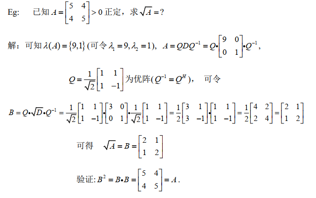

> 乔利斯分解

<!--more-->

## 5.1 乔利斯分解

$$
\begin{aligned}
&若A>0(正定)，则有A=R^HR，其中R=\left(
\begin{matrix}
b_1&&*\\
&\ddots&\\
0&&b_n
\end{matrix}
\right)为上三角阵，\\
&且b_1>0,\cdots,b_n>0，则A=R^HR为乔利斯分解
\end{aligned}
$$

**证明**
$$
\begin{aligned}
&A>0必有可逆阵P，使A=P^HP,对P使用QR分解，其中R为上三角，Q为U阵\\
&\Rightarrow A=P^HP=(QR)^H(QR)=R^H(Q^HQ)R=R^HR\\
&可写分解：A=R^HR,R=\left(
\begin{matrix}
b_1&&*\\
&\ddots&\\
0&&b_n
\end{matrix}
\right)为上三角，且b_1>0,\cdots,b_n>0
\end{aligned}
$$

## 5.2 平方根分解

$$
\begin{aligned}
&A>0(正定),则有A=B^2,B>0(正定)，且矩阵B唯一\\
&可写B=\sqrt{A},A=(\sqrt{A})^2
\end{aligned}
$$

---

**证明**
$$
\begin{aligned}
&对A>0，必有Hermite分解(Q为U阵)：\\
&A=Q\Lambda Q^H,其中\Lambda=\left(
\begin{matrix}
\lambda_1&&0\\
&\ddots&\\
0&&\lambda_n
\end{matrix}
\right),\lambda_i>0\\
&令\sqrt{\Lambda}=\left(
\begin{matrix}
\sqrt{\lambda_1}&&0\\
&\ddots&\\
0&&\sqrt{\lambda_n}
\end{matrix}
\right),且\sqrt{\Lambda}为正定阵\\
&令B=Q\sqrt{\Lambda}Q^H\Rightarrow B为正定Hermite阵(\lambda(B)>0)\\
&B^2=(Q\sqrt{\Lambda}Q^H)(Q\sqrt{\Lambda}Q^H)=Q\Lambda Q^H=A
\end{aligned}
$$
