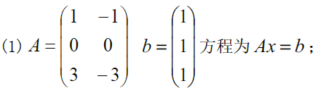
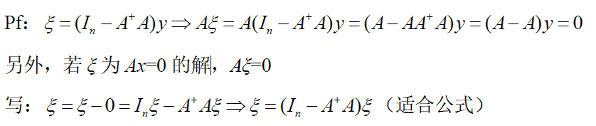

> 子空间与正规方程

<!--more-->

## 5.1 子空间

### 5.1.1. 定义

设 $W\subset C^n$ ，即子空间对线性组合封闭
$$
\begin{aligned}
若 &(1)对\forall \alpha,\beta\in W，有\alpha+\beta\in W(对加法封闭)\\
&(2)对\forall \alpha\in W,\forall k\in C ，有k\alpha \in W(对数乘封闭)
\end{aligned}
$$

- **子空间 W 一定含有零向量 $\vec{0} \in W$ **；若不包含零向量，则不是子空间

- 齐次方程解集 $W(A)=\{X\in C^n\vert AX=0\}$ ，对加法，数乘封闭($AX_1=0,AX_2=0,A(X_1+X_2)=0$)，($AX_1 =0$,$A(kX_1)=k(AX_1)=0$) ，且有零向量
- 非齐次方程解集 $W(A)=\{X\in C^n\vert AX=b\neq 0\}$ 不含零向量，故W(A) 不是子空间，且对加法，数乘不封闭

### 5.1.2 生成子空间

#### a. 引理

由 $C^n$ 中向量 $\alpha_1,\alpha_2\cdots,\alpha_m$ 的所有**线性组合生成的向量集合** $W(A)=\{x=k_1\alpha_1+k_2\alpha_2+\cdots+k_m\alpha_m\}$ 是一个子空间，称W为由$\alpha_1,\cdots,\alpha_m$ 生成的子空间，记为 $W=L(\alpha_1,\cdots,\alpha_m)$ 或 $W=span(\alpha_1,\cdots,\alpha_m)$

### 5.1.3 基定义

$$
\begin{aligned}
若 &(1)子空间W中有r个向量\alpha_1,\cdots,\alpha_r线性无关\\
&(2)W中任一向量\alpha可由\alpha_1,\cdots,\alpha_r表示：\alpha=k_1\alpha_1+\cdots+k_r\alpha_r\\
则&称[\alpha_1,\cdots,\alpha_r]为W的一个基，r为W的维数，记作dim	W=r
\end{aligned}
$$

空间W可由基 $\alpha_1,\cdots,\alpha_r$ 生成，即 $W=L(\alpha_1,\cdots,\alpha_r)$ 或 $W=span(\alpha_1,\cdots,\alpha_r)$

#### a. 基性质

- 设 W 是r维子空间 ($dim W=r$) ，则W中任 r+1 个向量必线性相关
  $$
  \begin{aligned}
  证明：&设W的基为 \alpha_1,\cdots,\alpha_r，任取\beta_1,\cdots,\beta_r,\beta_{r+1} \in W，可知每个\beta 可有\alpha 基向量表示，即\\
  &向量组\{\beta_1,\cdots,\beta_r\}的秩\le r(\alpha_q,\cdots,\alpha_r) =r\le r+1，故\{\beta\}向量组线性相关
  \end{aligned}
  $$

- W的基 $[\alpha_1,\cdots,\alpha_r]$ 必是向量组W的一个极大无关组，从而 $dim W=r(W)$

### 5.1.4 A产生的子空间

#### a. 列空间（值域）

$A=A_{m\times n}$ 的值域 $R(A)=\{全体y=Ax\vert x\in C^n\}\subset C^m$ 
$$
\begin{aligned}
&A=A_{m\times n}=(\alpha_1,\cdots,\alpha_n),其中\alpha_i\in C^m ，X=\left(
\begin{matrix}
x_1\\\vdots\\x_n
\end{matrix}
\right)\in C^n\\
&Y=AX=x_1\alpha_1+\cdots+x_n\alpha_n=\left(x_1\alpha_1,\cdots,x_n\alpha_n\right)为A的生成列空间
\end{aligned}
$$
即对 $C^n$ 中的所有列向量进行A变换产生的列生成空间，记为 $R(A)=\{y=x_1\alpha_1+\cdots+x_n\alpha_n\vert X\in C^n\}$ 

$R(A)=L(\alpha_1,\cdots,\alpha_n)$ 或 $R(A)=span(\alpha_1,\cdots,\alpha_n)$ 

维数=秩， $dimR(A)=r(A)=r$ 

#### b. A的核空间

$A=A_{m,n}$ 的核空间为 $N(A)=\{X\in C^n\vert AX=0\}=\{X=(I-A^+A)Y\mid \forall Y\in C^n\}\subset C^n$ （解空间）

##### 维数公式

$dim N(A)+dim R(A)=n$ 或 $dim N(A)+r(A)=n$ ，即 $dim N(A)=n-r(A)$ 

AX=0的通解 (I-AA)Y

### 5.1.5 正交引理

#### a. $C^m$ 中正交引理(列空间中向量的正交向量)

任取 $b\in C^m$ ，令 $x_0=A^+b\in C^n$ ，则 $(b-Ax_0)\bot Ax,\forall x\in C^n$ 

##### 正交子空间

设 $A\in C^{m\times n}$ ，则有 $N(A)\bot R(A^H)$ ，且 $N(A^H)\bot R(A)$ 

**证明：**
$$
\begin{aligned}
&任取 y\in N(A),即满足Ay=0。任取A^Hx\in R(A^H),若证N(A)\bot R(A^H) ，则只需证(y,A^Hx)=0,\\
&\because (y,A^Hx)=(A^Hx)^Hy=x^HAy=X^H(Ay)=X^H0=0，即有N(A)\bot R(A^H)
\end{aligned}
$$

$A^H\in C^{n\times m}$ ，$R(A^H)\subset C^n$ ,$N(A^H)\subset C^m$ ，$R(A^H)+N(A^H)=C^n$ 

#### b. $C^n$ 中正交引理(核空间的正交向量)

任取 $b\in C^m$ ，令 $x_0=A^+b\in C^n$ ，则 $x_0\bot N(A)$ ，即 $x_0\bot y ,y\in \{y\vert Ay=0\}$ 

**证明：**
$$
\begin{aligned}
&由于y在A的解空间，则已知Ay=0,要证x_0\bot y,即证内积(y,x_0)=0\\
&(y,x_0)=x_0^Hy=(A^+b)^Hy=(A^+AA^+b)^Hy=(A^+b)^H(A^+A)^Hy=(A^+b)^HA^+Ay=0\\
&\Rightarrow x_0\bot y,即 x_0\bot N(A)
\end{aligned}
$$

##### $x_0=A^+b$ 为 $Ax=b$ 的最小解

$$
\begin{aligned}
&令x_0=A^+b，\forall x\in N(A),Ay=b有通解y= x_0+tx,而\vert y\vert^2=\vert x_0+x\vert^2\\
&\because x_0\bot x,由勾股定理\Rightarrow \vert x_0+x\vert^2=\vert x_0\vert^2+\vert x \vert^2\ge \vert x_0\vert^2   
\end{aligned}
$$

## 5.2 正规方程

$$
\begin{aligned}
A^HAx=A^Hb为Ax=b的正规方程
\end{aligned}
$$

### 5.2.1 正规方程必有解

**正规方程 $A^HAx=A^Hb$ 必有解** ，且特解为 $x_0=A^+b$ ，使 $A^HAx_0=A^Hb$

**证明**
$$
\begin{aligned}
&由于A^HAA^+\xlongequal{(AA^+)^H=AA^+}A^H(AA^+)^H=(AA^+A)^H=A^H,\\
&令x_0=A^+b,则AA^Hx_0=A^HAA^+b=A^Hb
\end{aligned}
$$
**推论**

若矩阵方程 $AXD=B$ 有解，则有特解 $X_1=A^+BD^+$

### 5.2.2 Ax=b 与 $A^HAx=A^Hb$ 的关系

$$
1. 若Ax=b有解，则 A^HAx=A^Hb有解，且两个方程组同解（相容）\\
2. 若Ax=b无解，则 A^Hx=A^Hb仍然有解，且特解为A^+b（不相容）
$$

#### a. $Ax=b$ 有解判定

若 $Ax=b$ 有解(相容)，则可知 $b\in R(A)=\{y=Ax\vert x\in C^n\}$ ，即 $Ax=b$ 有解 $\iff$ $b\in R(A)$ 

#### b. 无解定理

$$
\begin{aligned}
&若Ax=b无解(不相容)，则对一切x\in C^n,Ax\neq b,即Ax=b无解\iff b\notin R(A)\\
&若Ax=b无解，则队一切x\in C^n，Ax\neq b必有\Vert Ax-b\Vert^2>0,即 Ax=b无解\iff \Vert Ax-b \Vert^2>0
\end{aligned}
$$

$$
若x_0=A^+b 使Ax_0\neq b,则 Ax=b 无解（不相容）
$$

#### c. 高阵的解

若 $A=A_{m\times n}$ 为列满秩阵，则有 $N(A)=\{\vec{0}\}$ ，即 $AX=0$ 只有零解 $X=\vec{0}$ 

若A为高阵，则 $Ax=b$ 的解为 $x_0=A^+b$ 的唯一解

**eg**

---

### 5.2.3 通解公式

#### a. $Ax=b$ 有解情形

设 $Ay=0$ 基本解为 $Y_1,Y_2,\cdots,Y_k$ ，则 $Ay=0$ 有通解，$y=t_1Y_1+t_2Y_2+\cdots+t_kY_k$ ,可写 $N(A)=\{y\vert Ay=0\}=\{全体y=t_1Y_1+t_2Y_2+\cdots+t_kY_k\}$

且 $Ay=b$ 通解公式为 $x=x_0+(t_1Y_1+t_2Y_2+\cdots+t_kY_k)\xlongequal{\Delta}x_0+y,\forall y\in N(A)$ ,**k=n-r(A)**

##### 最小二乘解

若 $Ax=b$ 有解，则哪个解x的长度平方 $\vert x\vert^2=x^Hx=\vert x_1\vert^2+\cdots+\vert x_k\vert^2 $ 最小：**$x_0=A^+b$** 

**eg**

$$
\begin{aligned}
&r(A)=r(A\vert b)=1，故Ax=b有解\\
&x_0=A^+b=\left(
\begin{matrix}
1&1\\2&2
\end{matrix}
\right)^+b=\frac{1}{10}\left(
\begin{matrix}
1&2\\1&2
\end{matrix}
\right)\left(
\begin{matrix}
1\\2
\end{matrix}
\right)=\frac{1}{10}\left(
\begin{matrix}
5\\5
\end{matrix}
\right)=\left(
\begin{matrix}
\frac{1}{2}\\\frac{1}{2}
\end{matrix}
\right)\\
&Ax=0\Rightarrow\left(
\begin{matrix}
1&1\\2&2
\end{matrix}
\right)\left(
\begin{matrix}
x_1\\x_2
\end{matrix}
\right)=0\Rightarrow x_1+x_2=0\Rightarrow Ax=0通解x=\left(
\begin{matrix}
1\\-1
\end{matrix}
\right)\\
&Ax=b的通解公式为 X=\left(
\begin{matrix}
\frac{1}{2}\\\frac{1}{2}
\end{matrix}
\right)+t\left(
\begin{matrix}
1\\-1
\end{matrix}
\right)
\end{aligned}
$$

#### b. $A x=b$ 无解情形

> 若 $Ax=b$ 无解，则 $\vert Ax-b\vert^2>0$ ，对于 $x\in C^n$ ，如何使 $\vert Ax-b\vert$ 最小：**$x_0=A^+b$**

若 $\vert Ax_0-b\vert ^2$ 为 $\vert Ax-b\vert^2$ 的最小值，则 $x_0$ 为 $Ax-b$ 的一个极小二乘解，即 $\vert Ax_0-b\vert^2$ 为 $AX$ 与 $b$ 的最小平方距离

**证明**
$$
\begin{aligned}
&Ax-Ax_0=A(x-x_0)\in R(A),\therefore (b-Ax_0)\bot A(x-x_0)\\
&\vert Ax-b\vert^2\xlongequal{勾股定理}\vert A(x-x_0)+A(x_0-b)\vert^2 \ge \vert A(x-x_0)\vert^2 + \vert A(x_0-b)\vert^2\ge \vert A(x_0-b)\vert^2\\
&当且仅当A(x-x_0) =0时， \vert Ax_0-b\vert^2=\vert A(x_0-b)\vert ^2最小
\end{aligned}
$$

##### 小二解公式

令 $x_0=A^+b$ ，则 $Ax=b$ 的全体小二解为 $x=x_0+Y,Y\in N(A),AY=0$ 

 

##### 最佳小二解

若 $Ax=b$ 无解，则 $x_0=A^+b$ 为最佳小二解

**eg**

$$
\begin{aligned}
&r(A)=1,r(A\vert b)=3，故Ax=b无解\\
&最佳小二解x_0=A^+b=\frac{1}{6}\left(
\begin{matrix}
1&1&1\\1&1&1
\end{matrix}
\right)\left(
\begin{matrix}
1\\2\\3
\end{matrix}
\right)=\left(
\begin{matrix}
1\\1
\end{matrix}
\right),令Ay=0,\Rightarrow x_1+x_2=0,即Y=\left(
\begin{matrix}
1\\-1
\end{matrix}
\right)\\
&全体小二解为X=x_0+tY=\left(
\begin{matrix}
1\\1
\end{matrix}
\right)+t\left(
\begin{matrix}
1\\-1
\end{matrix}
\right)
\end{aligned}
$$

---

$$
\begin{aligned}
&r(A)=1\neq r(A\vert b)=2,\therefore Ax=b无解\\
&最佳小二解x_0=A^+b=\frac{1}{10}\left(
\begin{matrix}
1&2\\1&2
\end{matrix}
\right)\left(
\begin{matrix}
1\\3
\end{matrix}
\right)=\frac{1}{10}\left(
\begin{matrix}
7\\7
\end{matrix}
\right)\\
&设Ay=0\Rightarrow \left(
\begin{matrix}
1&1\\2&2
\end{matrix}
\right)\left(
\begin{matrix}
y_1\\y_2
\end{matrix}
\right)=y_1+y_2=0\Rightarrow 齐次方程Ay=0的通解为 y=\left(
\begin{matrix}
1\\-1
\end{matrix}
\right)\\
&\therefore Ax=b的通解为 x=x_0+ty=\frac{1}{10}\left(
\begin{matrix}
7\\7
\end{matrix}
\right)+t\left(
\begin{matrix}
1\\-1
\end{matrix}
\right)
\end{aligned}
$$

### 5.2.4 其他通解公式

#### a. $Ax=0$ 的通解公式

$$
Ax=0的通解为 \xi=(I_n-A^+A)y,y\in C^n\\
$$

可写核空间公式 $N(A)=\{w=(I-A^+A)y\vert y\in C^n\}$ 

#### b. $Ax=b$ 的通解

$Ax=b$ 的通解公式为 $x=(A^+b)+(I_n-A^+A)y,y\in C^n$ 

