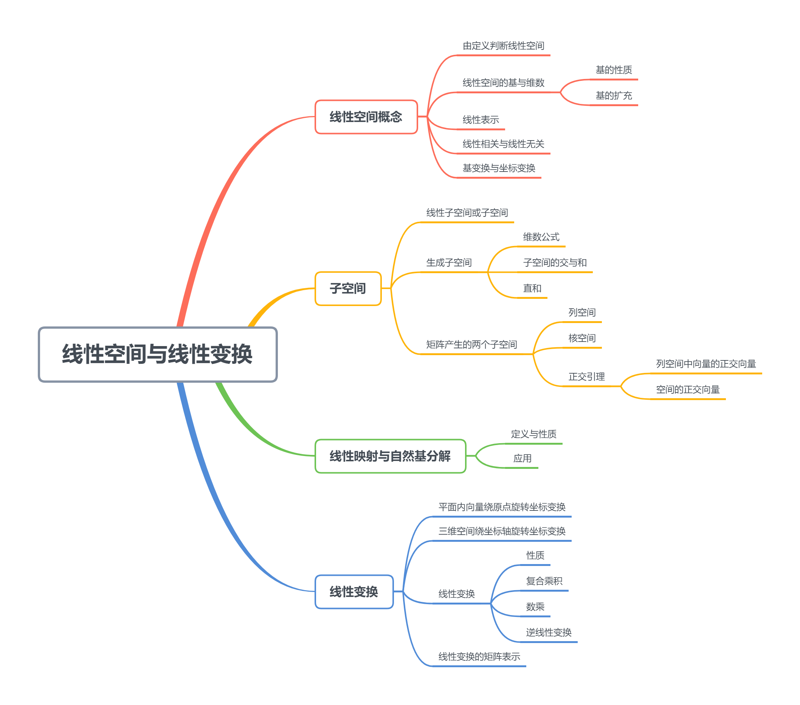

<!--more-->

## 5.1 线性空间概念

### 5.1.1 定义与性质

**数域**：含0和1，且对加减乘除封闭的数集

#### a. 定义

设 $V$ 是一个非空集合，其元素为 $x,y,z$ ，$K$ 是一个数域，如果 $V$ 中元素满足

1. $V$ 对加法封闭，即当 $x,y\in V$ 时，有唯一 $x\oplus y\in V$ ，且加法满足：
   - 结合律：$(x\oplus y)\oplus z=x\oplus (y\oplus z)$ 
   - 交换律：$x\oplus y=y\oplus x$
   - 存在零元素：$x\oplus 0=x$
   - 存在负元素：对 $\forall x\in V，\exist y\in V$ ，使 $x\oplus y=0$ ，则称 $y$ 为 $x$ 的负元素，记为 $-x$   
2. $V$ 对数乘运算封闭，即当 $x\in V,k\in K$ 时，有唯一 $k\circ x\in V$ ，且数乘运算满足
   - $1\circ x=x$ （幺元素）
   - $k\circ(x\oplus y)=k\circ x\oplus k\circ y$
   - $(k+l)\circ x=k\circ x\oplus l\circ x$
   - $k\circ(l\circ x)=(k\circ l)\circ x$

则称 $V$ 为数域 $K$ 上的线性空间或向量空间

> 当 $K=R$ 时，称为实线性空间
>
> 当 $K=C$ 时，称为复线性空间

**eg**

实数域上全体 $n$ 维向量的集合 $R^n=\{\left(\begin{matrix}x_1\\\vdots\\x_n\end{matrix}\right)\vert x_1,\cdots,x_n\in R\}$ ， $\alpha=\left(\begin{matrix}x_1\\x_2\\\vdots\\x_n\end{matrix}\right),\beta=\left(\begin{matrix}y_1\\y_2\\\vdots\\y_n\end{matrix}\right)\in R^n,k\in R$ 

-  加法： $\alpha+\beta=\left(\begin{matrix}x_1+y_1\\x_2+y_2\\\vdots\\x_n+y_n\end{matrix}\right)\in R^n$  
- 数乘：$k\alpha=\left(\begin{matrix}kx_1\\kx_2\\\vdots\\kx_n\end{matrix}\right)\in R^n$  

$R^n$ 是数域 $R$ 上的线性空间

$C^n$ 是数域 $C$ 上的线性空间

---

正弦函数集合 $S[x]=\{asin(x+b)\vert a,b\in R\}$ ，$s_1,s_2\in S[x]$

- 加法
  $$
  \begin{aligned}
  s_1+s_2&=A_1sin(x+B_1)+A_2sin(x+B_2)\\
  &=(A_1sinB_1cosx+A_1cosB_1sinx)+(A_2sinB_2cosx+A_2cosB_2sinx)\\
  &=(a_1cosx+b_1sinx)+(a_2cosx+b_2sinx)\\
  &=(a_1+a_2)cosx+(b_1+b_2)sinx\\
  &=Asin(x+B)\in S[x]
  \end{aligned}
  $$
  
- 数乘
  $$
  \begin{aligned}
  \lambda s_1=\lambda A_1sin(x+B_1)=(\lambda A_1)sin(x+B_1)\in S[x]
  \end{aligned}
  $$

$\therefore S[x]$ 是一个线性空间

---

设 $R^+$ 为所有正实数组成的数集，加法和数乘定义为：$m\oplus n=mn$ ，$k\circ m=m^k$ ，证： $R^+$ 为 $R$ 上的线性空间

- 加法： $a\oplus b=ab\in R^+$ 

  $a\oplus b=ab=ba=b\oplus a$

  $(a\oplus b)\oplus c=(ab)\oplus c=a(bc)=a\oplus(b\oplus c)$

  $R^+$ 中存在零元素1，$\forall a\in R^+$，有 $a\oplus 1=a\cdot 1=a$ 

  $\forall a\in R^+$ ，$a\oplus x=a\cdot x=1\Rightarrow x=a^{-1}$ ，即有负元素 $a^{-1}$

- 数乘：$\forall k\in R$ ，$ka=a^k\in R^+$ 

  $1\circ a=a^1=a$ 

  $\lambda\circ(\mu\circ a)=\lambda\circ a^\mu=(a^{\mu})^{\lambda}=a^{\lambda\mu}=(\lambda\mu)\circ a$

  $(\lambda+\mu)\circ a=a^{\lambda+\mu}=a^{\lambda}a^{\mu}=a^\lambda\oplus a^\mu=\lambda\circ a\oplus\mu \circ a$

  $\lambda\circ (a\oplus b)=\lambda\circ (ab)=(ab)^\lambda=a^\lambda b^\lambda=a^\lambda\oplus b^\lambda=\lambda\circ a\oplus \lambda\circ b$ 

故 $R^+$ 是一个线性空间

#### b. 性质

> 线性空间 $V$ 中的元素，有唯一的零元素，任意元素有唯一的负元素

$$
\begin{aligned}
证明：&假设0_1,0_2是V的两个零元素，由于 0_1=0_1+0_2=0_2,所以零元素唯一\\
&设元素 x有两个负元素 x_1,x_2,由于x_1=x_1+0=x_1+(x_2+x)=(x_1+x)+x_2=x_2\\
&\therefore 任意元素有唯一负元素
\end{aligned}
$$

### 5.1.2 线性空间的基与维数

#### a. 线性表示

如果 $x_1,\cdots,x_m$ 为线性空间 $V$ 中的 $m$ 个向量，$x\in V$ ，且存在数域 $K$ 中一组数 $c_1,\cdots,c_m$ ，使 $x=c_1x_1+\cdots+c_mx_m$ ，则称 $x$ 为向量组 $x_1,\cdots,x_m$ 的线性组合，即 $x$ 可由 $x_1,\cdots,x_m$ 线性表示

#### b. 线性相关与线性无关

对于 $x_1,\cdots,x_m\in V$ ，如果存在不全为零的 $m$ 个数 $c_1,\cdots,c_m\in K$ ，使 $c_1x_1+\cdots+c_mx_m=0$ ，则称向量组 $x_1,\cdots,x_m$ 线性相关，否则为线性无关

#### c. 基与维数

如果 $x_1,\cdots,x_m$ 是线性空间 $V$ 中 $m$ 个元素且满足：

- $x_1,\cdots,x_m$ 线性无关
- $\forall x\in V$ 可由 $x_1,\cdots,x_m$ 线性表示

则 $x_1,\cdots,x_m$ 为 $V$ 的一个基，$m$ 称为 $V$ 的维数，记为 $dim V=m$ 

维数为 $m$ 的线性空间 $V$ 记为 $V^m$ ，当 $m=+\infty$ 时，称为 无限维线性空间

##### 基性质

- 设 $V$ 是 $r$ 维子空间 ($dim V=r$) ，则 $W$ 中任 $r+1$ 个向量必线性相关
  $$
  \begin{aligned}
  证明：&设V的基为 \alpha_1,\cdots,\alpha_r，任取\beta_1,\cdots,\beta_r,\beta_{r+1} \in V，可知每个\beta 可有\alpha 基向量表示，即\\
  &向量组\{\beta_1,\cdots,\beta_r\}的秩\le r(\alpha_q,\cdots,\alpha_r) =r\le r+1，故\{\beta\}向量组线性相关
  \end{aligned}
  $$

- $V$ 的基 $[\alpha_1,\cdots,\alpha_r]$ 必是向量组 $V$ 的一个极大无关组，从而 $dim V=r(V)$

##### 基的扩充

设 $W$ 是数域 $K$ 上的线性空间 $V^n$ 的一个 $m$ 维子空间，$x_1,\cdots,x_m$ 是 $W$ 的基，则这 $m$ 个基向量必可扩充为 $V^n$ 的一个基
$$
\begin{aligned}
归纳法：&当n-m=0时，定理显然成立\\
&假定 n-m=k时成立，则当 n-m=k+1时，由于 x_1,\cdots,x_m不是V^n的基\\
&则在V^n中至少有一个向量 x_{m+1}不能由x_1,\cdots,x_m线性表示，\therefore x_1,\cdots,x_m,x_{m+1}线性无关\\
&子空间L(x_1,\cdots,x_m,x_{m+1}) 是m+1维的\\
&\because n-(m+1)=n-m-1=k，\therefore L(x_1,\cdots,x_m,x_{m+1})的基 x_1,\cdots,x_m,x_{m+1} 可以扩充为 V^n的一个基
\end{aligned}
$$

#### d. 坐标

设线性空间 $V^n$ 的一个基 $x_1,\cdots,x_n,x\in V^n$ ，$x=\xi_1x_1+\xi_2x_2+\xi_nx_n$ ，则称 $\xi_1,\cdots,\xi_n$ 为 $x$ 在该基下的坐标，记为 $(\xi_1,\cdots,\xi_n)^T$ 

**定理** ：设 $x_1,\cdots,x_n$ 是 $V^n$ 的一个基，且 $x\in V^n$ ，则 $x$ 可唯一表示为 $x_1,\cdots,x_n$ 的线性组合

#### e. 基变换与坐标变换

设 $I:x_1,\cdots,x_n;II:y_1,\cdots,y_n$ 是 $V^n$ 的两个基，则有：
$$
\left\{
\begin{aligned}
&y_1=c_{11}x_1+c_{21}x_2+\cdots+c_{n1}x_n\\
&y_2=c_{12}x_1+c_{22}x_2+\cdots+c_{n2}x_n\\
&\vdots\\
&y_n=c_{1n}x_1+c_{2n}x_2+\cdots+c_{nn}x_n\\
\end{aligned}
\right.
$$
有 $(y_1,\cdots,y_n)=(x_1,\cdots,x_n)C$ ，其中矩阵 $C=\left(\begin{matrix}c_{11}&c_{12}&\cdots&c_{1n}\\c_{21}&c_{22}&\cdots&c_{2n}\\\vdots&\vdots&\ddots&\vdots\\c_{n1}&c_{n2}&\cdots&c_{nn}\end{matrix}\right)$ 称为基 $I$ 到基 $II$ 的过渡矩阵

---

对于同一向量，在不同基下有不同表示方式
$$
\begin{aligned}
x&=(x_1,\cdots,x_n)\left(
\begin{matrix}
\xi_1\\\vdots\\\xi_n
\end{matrix}
\right)\\
&=(y_1,\cdots,y_n)\left(
\begin{matrix}
\eta_1\\\vdots\\\eta_n
\end{matrix}
\right)=(x_1,\cdots,x_n)C\left(
\begin{matrix}
\eta_1\\\vdots\\\eta_n
\end{matrix}
\right)
\end{aligned}
$$
则有 **坐标变换** $\left(\begin{matrix}\xi_1\\\vdots\\\xi_n\end{matrix}\right)=C\left(\begin{matrix}\eta_1\\\vdots\\\eta_n\end{matrix}\right)$ 

---

**eg**

设矩阵空间 $K^{2\times 2}$ 的两个基

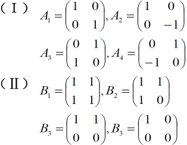

求过渡矩阵
$$
\begin{aligned}
解：&令E_{11}=\left(\begin{matrix}1&0\\0&0\end{matrix}\right),E_{12}=\left(\begin{matrix}0&1\\0&0\end{matrix}\right),E_{21}=\left(\begin{matrix}0&0\\1&0\end{matrix}\right),E_{22}=\left(\begin{matrix}0&0\\0&1\end{matrix}\right)\\
&则有基变换 (A_1,A_2,A_3,A_4)=(E_{11},E_{12},E_{21},E_{22})C_1\\
&(B_1,B_2,B_3,B_4)=(E_{11},E_{12},E_{21},E_{22})C_2\\
&其中C_1=\left(
\begin{matrix}
1&1&0&0\\0&0&1&1\\0&0&1&-1\\1&-1&0&0
\end{matrix}
\right),C_2=\left(
\begin{matrix}
1&1&1&1\\1&1&1&0\\1&1&0&0\\1&0&0&0
\end{matrix}
\right)\\
&\therefore (B_1,B_2,B_3,B_4)=(A_1,A_2,A_3,A_4)C_1^{-1}C_2\\
&得到由基(I)到基(II)的过渡矩阵 C=C_1^{-1}C_2=\frac{1}{2}\left(
\begin{matrix}
2&1&1&1\\0&1&1&1\\2&2&1&0\\0&0&1&0
\end{matrix}
\right)
\end{aligned}
$$

## 5.2 子空间

### 5.2.1 定义

设 $W\subset V$ ，$W$ 是数域 $K$ 上的线性空间 $V$ 的一个非空子集合，且
$$
\begin{aligned}
&(1)对\forall \alpha,\beta\in W，有\alpha+\beta\in W(对加法封闭)\\
&(2)对\forall \alpha\in W,\forall k\in K ，有k\alpha \in W(对数乘封闭)
\end{aligned}
$$

则称 $W$ 为 $V$ 的线性子空间或子空间

- 平凡子空间 $W=V$ 或 $\varphi=\{0\}$ ；其余称为非平凡子空间

- **子空间 $W$ 一定含有零向量 $\vec{0} \in W$**；若不包含零向量，则不是子空间
- 齐次方程解集 $W(A)=\{X\in C^n\vert AX=0\}$ ，对加法，数乘封闭($AX_1=0,AX_2=0,A(X_1+X_2)=0$)，($AX_1 =0$,$A(kX_1)=k(AX_1)=0$) ，且有零向量，故是 $C^n$ 的子空间
- 非齐次方程解集 $W(A)=\{X\in C^n\vert AX=b\neq 0\}$ 不含零向量，故W(A) 不是子空间，且对加法，数乘不封闭

### 5.2.2 生成子空间

#### a. 引理

由 $C^n$ 中向量 $\alpha_1,\alpha_2\cdots,\alpha_m$ 的所0有 **线性组合生成的向量集合** $W(A)=\{x=k_1\alpha_1+k_2\alpha_2+\cdots+k_m\alpha_m\}$ 是一个子空间，称W为由$\alpha_1,\cdots,\alpha_m$ 生成的子空间，记为 $W=L(\alpha_1,\cdots,\alpha_m)$ 或 $W=span(\alpha_1,\cdots,\alpha_m)$ 

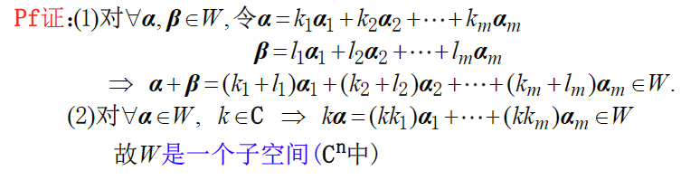

#### b. 维数公式

$dim (V_1+V_2)=dimV_1+dim V_2-dim(V_1\bigcap V_2)$ 

#### c. 子空间的交与和

**交**：如果 $V_1$ ，$V_2$ 是数域 $K$ 上的线性空间 $V$ 的两个子空间，那么 $V_1\bigcap V_2$ 也是 $V$ 的子空间

**和** ：设 $V_1$ ，$V_2$ 都是 $V$ 的子空间，则集合 $\{z\vert z=x+y,x\in V_1,y\in V_2\}$ 称为 $V_1$ 与 $V_2$ 的和，记为 $V_1+V_2$ 

如果 $V_1$ ，$V_2$ 都是 $V$ 的子空间，则 $V_1+V_2$ 也是 $V$ 的子空间

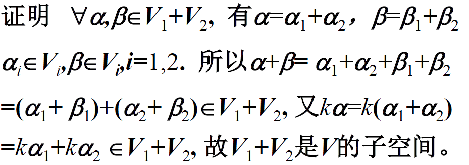

- $V_1\bigcap V_2$ 是包含在 $V_1$ ，$V_2$ 的最大子空间
- $V_1+V_2$ 是包含 $V_1,V_2$ 的最小子空间

**eg**

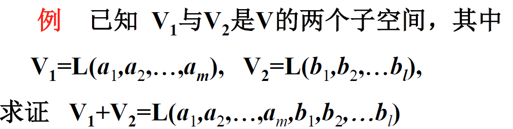
$$
\begin{aligned}
&显然V_1+V_2\supset L(a_1,\cdots,a_m,b_1,\cdots,b_l)，\\
&又\forall x\in V_1+V_2，有x=x_1+x_2,x_1\in V_1,x_2\in V_2\\
&\therefore x_1=k_1a_1+\cdots+k_ma_m,x_2=p_1b_1+\cdots+p_lb_l\\
&\therefore x\in L(a_1,\cdots,a_m,b_1,\cdots,b_l)\\
&可得V_1+V_2\subset L(a_1,\cdots,a_m,b_1,\cdots,b_l)
\end{aligned}
$$

#### d. 直和

如果 $V_1+V_2$ 中的任一向量只能唯一地表示为$V_1$ 的一个向量和 $V_2$ 中的一个向量的和，则称 $V_1+V_2$ 为 $V_1$ 与 $V_2$ 的直和，记为 $V_1\oplus V_2$ 

**定理**：若 $V_1+V_2$ 为直和$\iff V_1\bigcap V_2=L(0)$ 

- 不存在公共部分，即无法用公共部分的向量代替

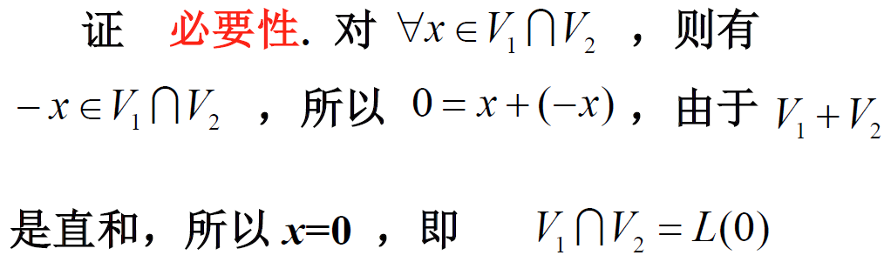

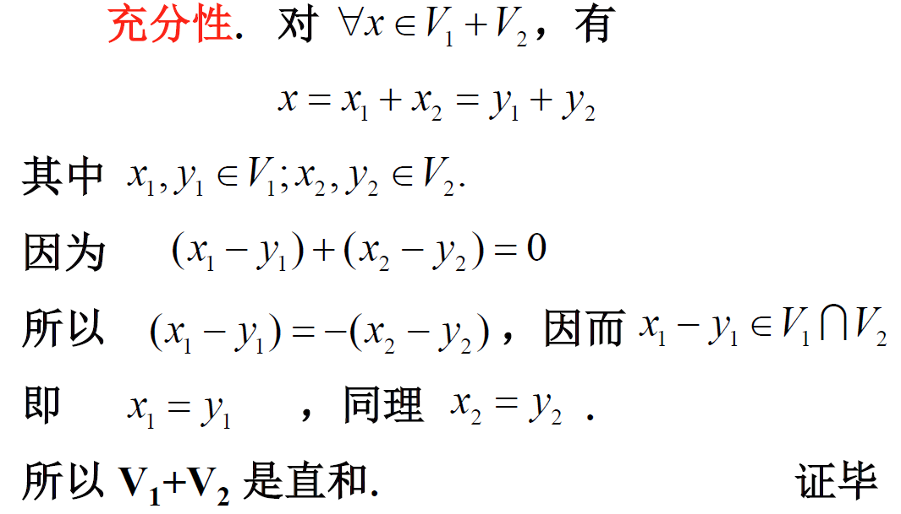

**推论：**

- 设 $V_1$ ,$V_2$ 都是 $V$ 的子空间，则 $V_1+V_2$ 是直和 $\iff dim(V_1+V_2)=dim V_1+dimV_2$ 
- 如果 $x_1,\cdots,x_k$ 为 $V_1$ 的基，$y_1,\cdots,y_l$ 为 $V_2$ 的基，且 $V_1+V_2$ 为直和，则 $x_1,\cdots,x_k,y_1,\cdots,y_l$ 为 $V_1\oplus V_2$ 的基

**eg**

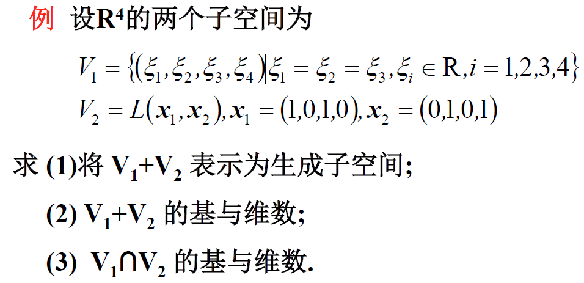
$$
\begin{aligned}
(1)&由于V_1:(\xi_1,\xi_2,\xi_3,\xi_4)=(\xi_1,\xi_1,\xi_1,\xi_4)=\xi_1(1,1,1,0)+\xi_4(0,0,0,1)\\
&设 y_1=(1,1,1,0),y_2=(0,0,0,1),则有V_1=L(y_1,y_2)\\
&则有V_1+V_2=L(y_1,y_2,x_1,x_2)\\
(2)&\because x_2=y_1+y_2-x_1,\Rightarrow r(y_1,y_2,x_1,x_2)=dim(V_1+V_2)=3\\
&y_1,y_2,x_1为V_1+V_2的一个基\\
(3)&设x\in V_1\bigcap V_1,则有k_1,k_2,l_1,l_2,使x=k_1y_1+k_2y_2=l_1x_1+l_2x_2\\
&\therefore \left\{
\begin{aligned}
k_1-l_1=0\\
k_1-l_2=0\\
k_1-l_1=0\\
k_2-l_2=0
\end{aligned}
\right.\Rightarrow \left\{
\begin{aligned}
&k_1=l_1\\
&k_1=l_2\\
&k_2=l_2
\end{aligned}
\right.\Rightarrow k_1=l_2=l_1=k_2\\
&\therefore x=k_1y_1+k_1y_2=k_1(1,1,1,1)\\
&\therefore (1,1,1,1)为 V_1\bigcap V_2的一个基，dim (V_1\bigcap V_2)=1
\end{aligned}
$$

---

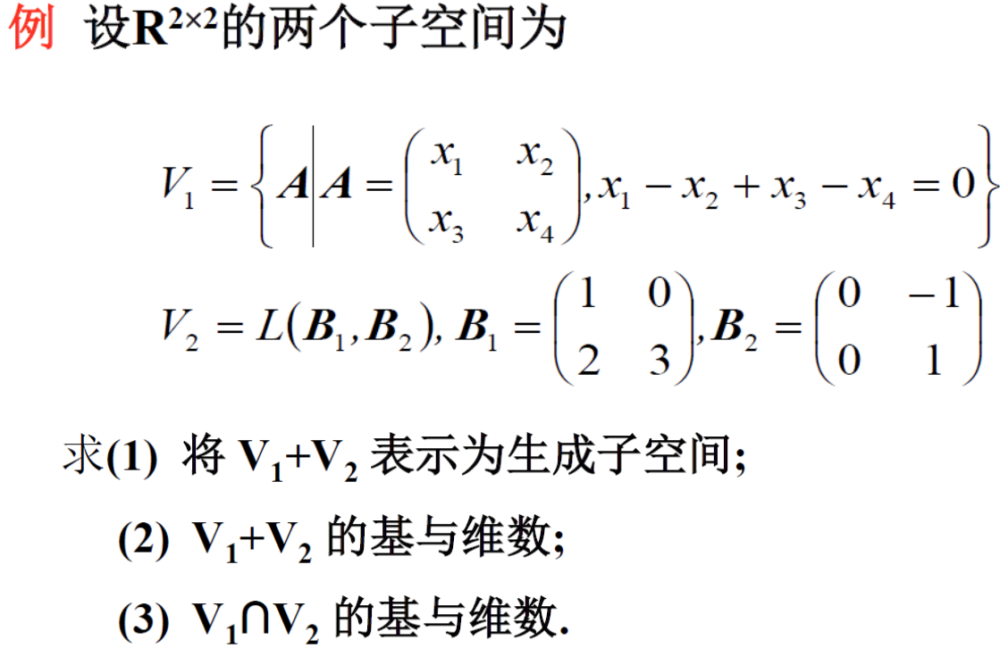

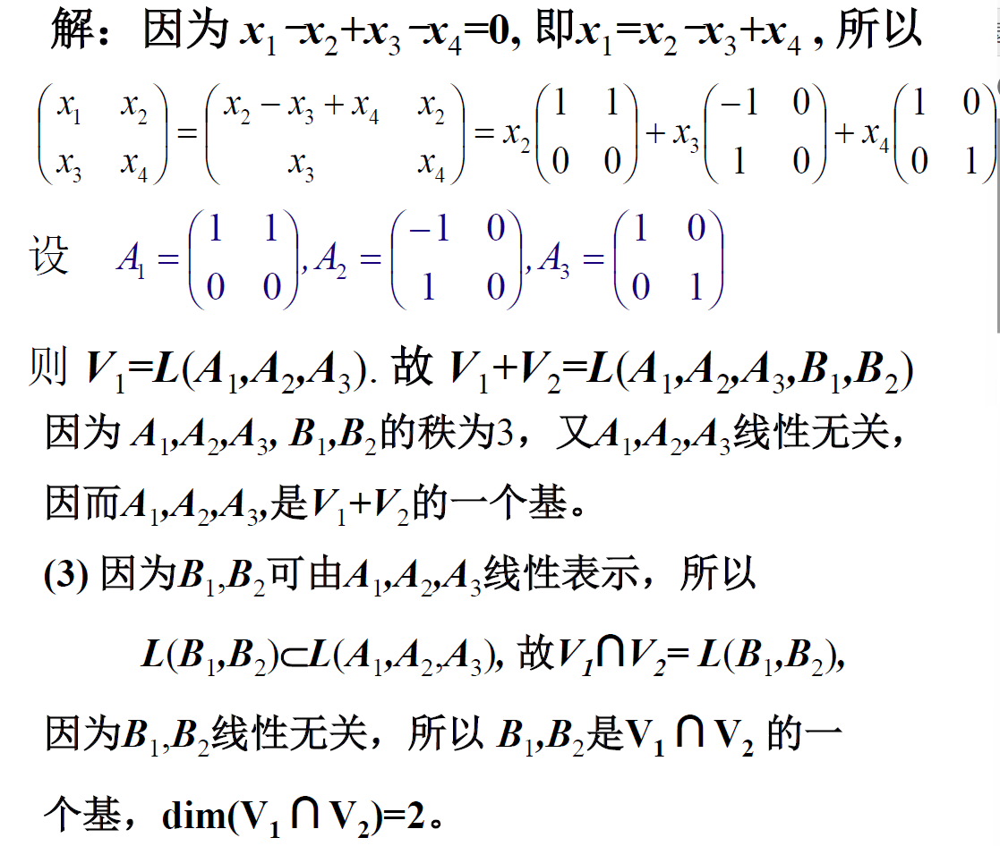

### 5.2.3 A产生的子空间

#### a. 列空间（值域）

$A=A_{m\times n}$ 的值域 $R(A)=\{全体y=Ax\vert x\in C^n\}\subset C^m$ 
$$
\begin{aligned}
&A=A_{m\times n}=(\alpha_1,\cdots,\alpha_n),其中\alpha_i\in C^m ，X=\left(
\begin{matrix}
x_1\\\vdots\\x_n
\end{matrix}
\right)\in C^n\\
&Y=AX=x_1\alpha_1+\cdots+x_n\alpha_n=\left(x_1\alpha_1,\cdots,x_n\alpha_n\right)为A的生成列空间
\end{aligned}
$$
即对 $C^n$ 中的所有列向量进行 $A$ 变换产生的列生成空间，记为 $R(A)=\{y=x_1\alpha_1+\cdots+x_n\alpha_n\vert X\in C^n\}$ 

$R(A)=L(\alpha_1,\cdots,\alpha_n)$ 或 $R(A)=span(\alpha_1,\cdots,\alpha_n)$ 

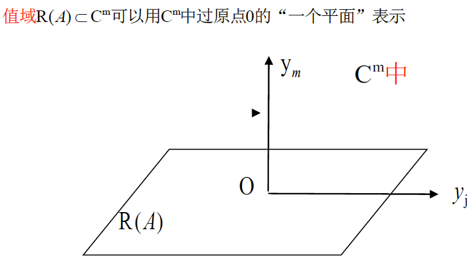

$r(A)=r(\alpha_1,\cdots,\alpha_n)\overset{\Delta}{=}r(A)\Rightarrow 维数：dimR(A)=r(A)（维数=秩数）$

#### b. A的核空间

> 前置知识：$AX=0$ 的其他通解形式 $X=(I-A^+A)Y,\forall Y\in C^n$ 

$A=A_{m\times n}$ 的核空间为 $N(A)=\{X\vert AX=0\}\subset C^n=\{X=(I-A^+A)Y\mid \forall Y\in C^n\}\subset C^n$ （解空间）

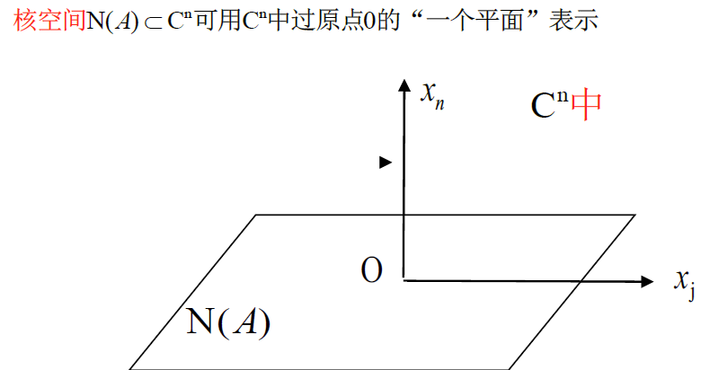

可知，$N(A)=R(I-A^-A)=R(I-A^+A)$ ，则有 $dim N(A)=dim R(I_n-A^-A)=r(I_n-A^+A)$ 由于 $A^-A,A^+A$ 为幂等阵 $r(I_n-A^-A)=r(I_n-A^+A)=n-r(A)$ ，即 $dimN(A)=n-r(A)$    

##### 维数公式

$dim N(A)+dim R(A)=n$ 或 $dim N(A)+r(A)=n$ ，即 $dim N(A)=n-r(A)$ 

#### c. 正交引理

##### $C^m$ 中正交引理(列空间中向量的正交向量)

任取 $b\in C^m$ ，令 $x_0=A^+b\in C^n$ ，则 $(b-Ax_0)\bot Ax,\forall x\in C^n$ 

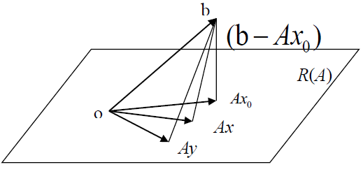

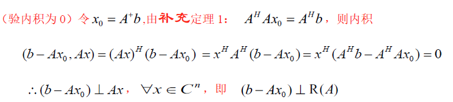

###### 正交子空间

设 $A\in C^{m\times n}$ ，则有 $N(A)\bot R(A^H)$ ，且 $N(A^H)\bot R(A)$ 

**证明：**
$$
\begin{aligned}
&任取 y\in N(A),即满足Ay=0。任取A^Hx\in R(A^H),若证N(A)\bot R(A^H) ，则只需证(y,A^Hx)=0,\\
&\because (y,A^Hx)=(A^Hx)^Hy=x^HAy=X^H(Ay)=X^H0=0，即有N(A)\bot R(A^H)
\end{aligned}
$$

$A^H\in C^{n\times m}$ ，$R(A^H)\subset C^n$ ,$N(A^H)\subset C^m$ ，$R(A^H)+N(A^H)=C^n$ 

#####  $C^n$ 中正交引理(核空间的正交向量)

任取 $b\in C^m$ ，令 $x_0=A^+b\in C^n$ ，则 $x_0\bot N(A)$ ，即 $x_0\bot y ,y\in \{y\vert Ay=0\}$ 

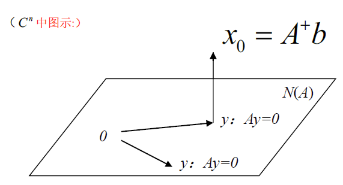

**证明：**
$$
\begin{aligned}
&由于y在A的解空间，则已知Ay=0,要证x_0\bot y,即证内积(y,x_0)=0\\
&(y,x_0)=x_0^Hy=(A^+b)^Hy=(A^+AA^+b)^Hy=(A^+b)^H(A^+A)^Hy=(A^+b)^HA^+Ay=0\\
&\Rightarrow x_0\bot y,即 x_0\bot N(A)
\end{aligned}
$$

###### $x_0=A^+b$ 为 $Ax=b$ 的最小解

$$
\begin{aligned}
&令x_0=A^+b，\forall x\in N(A),Ay=b有通解y= x_0+tx,而\vert y\vert^2=\vert x_0+x\vert^2\\
&\because x_0\bot x,由勾股定理\Rightarrow \vert x_0+x\vert^2=\vert x_0\vert^2+\vert x \vert^2\ge \vert x_0\vert^2   
\end{aligned}
$$

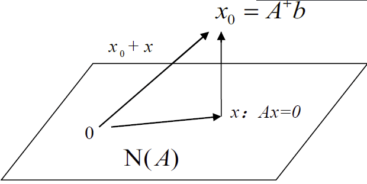

## 5.3 线性映射与自然基分解

同一空间——线性变换

不同空间——线性映射

**自然基** ：$R^n$ 中的自然基为：
$$
\epsilon_1=\left(
\begin{matrix}
1\\0\\\vdots\\0
\end{matrix}
\right),\epsilon_2=\left(
\begin{matrix}
0\\1\\\vdots\\0
\end{matrix}
\right),\cdots,\epsilon_n=\left(
\begin{matrix}
0\\0\\\vdots\\1
\end{matrix}
\right)
$$
$R^n$ 中每一向量 $\alpha=(a_1,a_2,\cdots,a_n)$ 都有分解公式 $\alpha=a_1\epsilon_1+a_2\epsilon_2+\cdots+a_n\epsilon_n$

**映射**：设 $S$ 和 $S'$ 是两个集合，存在一个法则 $\sigma:S\rightarrow S'$ ，它使 $S$ 中的每个元素 $a$ 在 $S'$ 中有一个确定的元素 $a'$ 与之对应，记为 
$$
\sigma(a)=a' 或 a\rightarrow a'
$$
称为集合 $S$ 到 $S'$ 的映射， $a'$ 称为 $a$ 在映射 $\sigma$ 下的 `象` ，$a$ 为 $a'$ 在映射 $\sigma$ 下的 `原象`  

**交换**：$S$ 到 $S$ 自身的映射

**相等**：设 $\sigma_1$ 与 $\sigma_2$ 都是集合 $S$ 到 $S'$ 的映射，如果对于 $\forall a\in S$ ，都有 $\sigma_1(a)=\sigma_2(a)$ ，则称 $\sigma_1$ 与 $\sigma_2$ 相等，记为 $\sigma_1=\sigma_2$ 

**乘法**：设 $\sigma$ ，$\tau$ 依次是集合 $S$ 到 $S_1$ ，$S_1$ 到 $S_2$ 的映射 ，乘积 $\tau \sigma$ 定义为$(\tau\sigma)(a)\overset{\Delta}{=}\tau(\sigma(a)),a\in S$ ，$\tau\sigma$ 是 $S$ 到 $S_2$ 的一个映射

- 不满足交换律： $\tau\sigma\neq \sigma \tau$ 
- 满足结合律：$\mu(\tau\sigma)=(\mu\tau)\sigma$ ($\mu$ 是 $S_2$ 到 $S_3$ 的映射)

### 5.3.1 定义与性质

设 $W$ 为一个线性空间，且 $\varphi:W\rightarrow R^n$ 是一个映射 $(\alpha,\beta\in W,k\in R)$ ，若满足：
$$
\begin{aligned}
(1)&\varphi(\alpha+\beta)=\varphi(\alpha)+\varphi(\beta)\\
(2)&\varphi(k\alpha)=k\varphi(\alpha)
\end{aligned}
$$
则称 $\varphi$ 为 $W$ 到 $R^n$ 的一个线性映射  

#### 性质

零点不变：$\varphi(0)=0$

线性映射保持线性组合结构 ：$\varphi(k_1\alpha_1+k_2\alpha_2+\cdots+k_p\alpha_p)=k_1\varphi(\alpha_1)+k_2\varphi(\alpha_2)+\cdots+k_p\varphi(\alpha_p),k_1,k_2,\cdots,k_p\in R$

- `原象` 线性相关（无关），则 `像` 也线性相关（无关） 

### 5.3.2 应用

1. 构造一个线性映射，把未知问题转化为求原象问题
2. 写出自然基分解公式，然后找出自然基的原象
3. 写出自然基原象的线性组合，可得所求原象

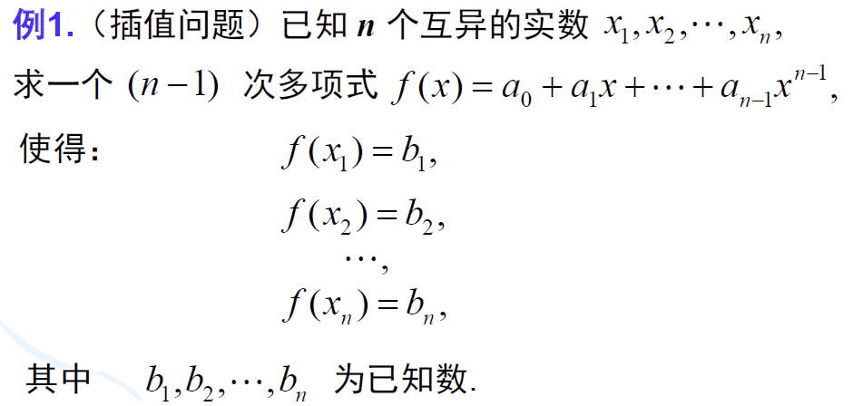

解：令多项式集合 $W=\{f(x)=a_0+a_1x+\cdots+a_{n-1}x^{n-1}\vert a_j\in R,0\le j\le n-1\}$ ， $W$ 为一个线性空间，$dim(W)=n$ 

引入映射 $\varphi:W\rightarrow R^n,\forall f,g\in W$ 
$$
\varphi(f)=(f(x_1),f(x_2),\cdots,f(x_n))\\
\varphi(g)=(g(x_1),g(x_2),\cdots,g(x_n))
$$
对于映射 $\varphi$ ，有 $\varphi(f+g)=\varphi(f)+\varphi(g)$ ，$\varphi(kf)=k\varphi(f)$ ，可知 $\varphi$ 为线性映射（**不改变组合结构**）

设 $f(x)\in W$ 为所求的多项式，满足：$f(x_1)=b_1,f(x_2)=b_2,\cdots,f(x_n)=b_n$ 

令 $\beta=(b_1,b_2,\cdots,b_n)\in R^n$ ，则有 $\varphi(f)=(f(x_1),f(x_2),\cdots,f(x_n))=(b_1,b_2,\cdots,b_n)=\beta$ 

即问题转化为求一个 $f$ ，使 $\varphi(f)=\beta=b_1\epsilon_1+b_2\epsilon_2+\cdots+b_n\epsilon_n$ ，其原象 $f_1,f_2,\cdots,f_n\in W$ 使 $\varphi(f_1)=\epsilon_1,\varphi(f_2)=\epsilon_2,\cdots,\varphi(f_n)=\epsilon_n$ 

则必有 $\varphi(f)=b_1\varphi(f_1)+b_2\varphi(f_2)+\cdots+b_n\varphi(f_n)=b_1\epsilon_1+b_2\epsilon_2+\cdots+b_n\epsilon_n=\beta$ 

若 $\varphi(f_1)=\epsilon_1=(1,0,\cdots,0)\Rightarrow (f_1(x_1),f_1(x_2),\cdots,f_n(x_n))=(1,0,\cdots,0)\\\Rightarrow f_1(x_1)=1,f_1(x_2)=\cdots=f_1(x_n)=0$  

则 $(n-1)$ 次多项式 $f_1$ 恰有 $n-1$ 个根为 $x_2,x_3,\cdots,x_n$ ，可设 
$$
\begin{aligned}
&f_1(x)=k_1(x-x_2)(x-x_3)\cdots(x-x_n)\\
&\xRightarrow{1=f_1(x_1)}k_1=\frac{1}{(x_1-x_2)(x_1-x_3)\cdots(x_1-x_n)} \\
&\Rightarrow f_1(x)=\frac{(x-x_2)(x-x_3)\cdots(x-x_n)}{(x_1-x_2)(x_1-x_3)\cdots(x_1-x_n)}
\end{aligned}
$$
 同理：
$$
\begin{aligned}
&f(x)=b_1f_1(x)+b_2f_2(x)+\cdots+b_nf_n(x)\\
&f_1(x)=\frac{(x-x_2)(x-x_3)\cdots(x-x_n)}{(x_1-x_2)(x_1-x_3)\cdots(x_1-x_n)}\\
&f_2(x)=\frac{(x-x_1)(x-x_2)\cdots(x-x_n)}{(x_2-x_1)(x_2-x_3)\cdots(x_2-x_n)}\\
&\vdots\\
&f_n(x)=\frac{(x-x_1)(x-x_2)\cdots(x-x_{n-1})}{(x_n-x_1)(x_n-x_2)\cdots(x_n-x_{n-1})}
\end{aligned}
$$
**eg** 

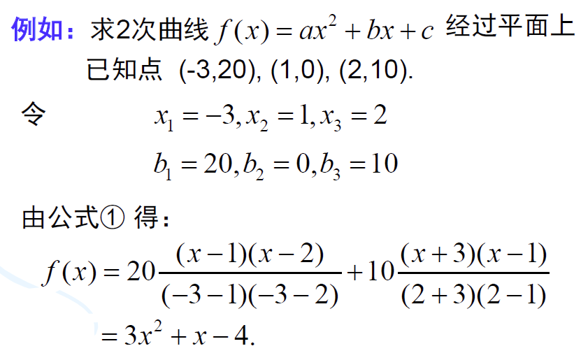

---

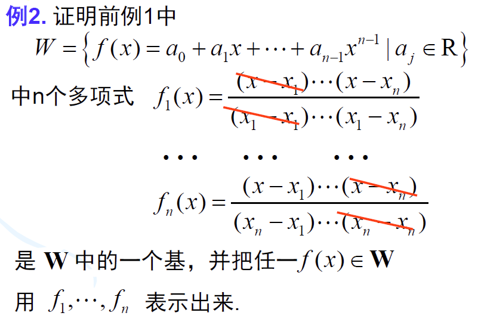
$$
\begin{aligned}
&由 \varphi(f)=(f(x_1),f(x_2),\cdots,f(x_n))\in R^n，可知\varphi(f_1)=\epsilon_1,\varphi(f_2)=\epsilon_2,\cdots,\varphi(f_n)=\epsilon_n\\
&由于 \epsilon_1,\cdots,\epsilon_n线性无关，由线性映射可知，f_1,f_2,\cdots,f_n线性无关，任取f(x)\in W，则\\
&f=k_1f_1+k_2f_2+\cdots+k_nf_n\\
&由\varphi(f)=k_1\varphi(f_1)+k_2\varphi(f_2)
+\cdots+k_n\varphi(f_n)=k_1\epsilon_1+k_2\epsilon_2+\cdots+k_n\epsilon_n=(k_1,k_2,\cdots,k_n)\\
&\Rightarrow (f(x_1),f(x_2),\cdots,f(x_n))=(\epsilon_1,\epsilon_2,\cdots,\epsilon_n)\\
&\Rightarrow k_1=f(x_1),k_2=f(x_2),\cdots,k_n=f(x_n)\\
&\Rightarrow f(x)=f(x_1)f_1(x)+f(x_2)f_2(x)+\cdots+f(x_n)f_n(x)
\end{aligned}
$$

## 5.4 线性变换

### 5.4.1 平面内向量绕原点旋转坐标变换

设向量 $V=\left(\begin{matrix}x\\y\end{matrix}\right)$ 旋转 $\theta$ 角后变为 $V'=\left(\begin{matrix}x'\\y'\end{matrix}\right)$ ，$V$ 的倾角为 $\varphi$ 

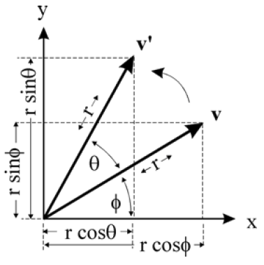

可写
$$
\begin{aligned}
&x=rcos\varphi,y=rsin\varphi\\
&\left\{
\begin{aligned}
&x'=rcos(\theta+\varphi)=rcos\theta cos\varphi-rsin\theta sin\varphi\\
&y'=rsin(\theta+\varphi)=rsin\theta cos\varphi+rcos\theta sin\varphi
\end{aligned}
\right.\\
&\iff\left\{
\begin{aligned}
x'=xcos\theta-ysin\theta\\
y'=xsin\theta+ycos\theta
\end{aligned}
\right.\\
&令A=\left(
\begin{matrix}
cos\theta&-sin\theta\\
sin\theta&cos\theta
\end{matrix}
\right),可写\left(
\begin{matrix}
x'\\y'
\end{matrix}
\right)=\left(
\begin{matrix}
cos\theta&-sin\theta\\sin\theta&cos\theta
\end{matrix}
\right)\left(
\begin{matrix}
x\\y
\end{matrix}
\right)=A\left(
\begin{matrix}
x\\y
\end{matrix}
\right)
\end{aligned}
$$

### 5.4.2 三维空间绕坐标轴旋转坐标变换

#### a. 绕z轴旋转

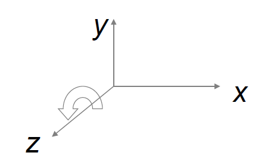
$$
\begin{aligned}
&\left\{
\begin{aligned}
&x'=xcos\varphi-ysin\varphi\\
&y'=xsin\varphi+ycos\varphi\\
&z'=z
\end{aligned}
\right.\quad,\varphi为V与V'在xoy面投影的夹角\\
&记为\left(
\begin{matrix}
x'\\y'\\z'
\end{matrix}
\right)=\left(
\begin{matrix}
cos\varphi&-sin\varphi&0\\
sin\varphi&cos\varphi&0\\
0&0&1
\end{matrix}
\right)\left(
\begin{matrix}
x\\y\\z
\end{matrix}
\right)
\end{aligned}
$$

#### b. 绕x轴旋转

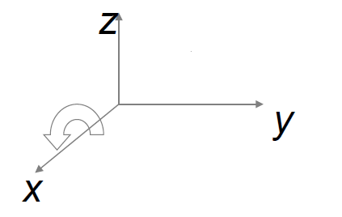
$$
\begin{aligned}
&\left\{
\begin{aligned}
&x'=x\\
&y'=ycos\alpha-zsin\alpha\\
&z'=ysin\alpha+zcos\alpha
\end{aligned}
\right.\quad,\alpha为V与V'在zoy面投影的夹角\\
&记为\left(
\begin{matrix}
x'\\y'\\z'
\end{matrix}
\right)=\left(
\begin{matrix}
1&0&0\\
0&cos\alpha&-sin\alpha\\
0&sin\alpha&cos\alpha\\
\end{matrix}
\right)\left(
\begin{matrix}
x\\y\\z
\end{matrix}
\right)
\end{aligned}
$$

#### c. 绕y轴旋转

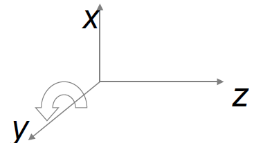
$$
\begin{aligned}
&\left\{
\begin{aligned}
&y'=y\\
&z'=zcos\beta-xsin\beta\\
&x'=zsin\beta+xcos\beta\\
\end{aligned}
\right.\quad,\beta为V与V'在xoz面投影的夹角\\
&记为\left(
\begin{matrix}
x'\\y'\\z'
\end{matrix}
\right)=\left(
\begin{matrix}
cos\beta&0&sin\beta\\
0&1&0\\
-sin\beta&0&cos\beta\\
\end{matrix}
\right)\left(
\begin{matrix}
x\\y\\z
\end{matrix}
\right)
\end{aligned}
$$

### 5.4.3 线性变换

设 $V$ 为数域 $K$ 上的线性空间，若变换 $\sigma:V\rightarrow V$ ，对于 $\forall \alpha,\beta\in V,k\in K$ ，满足
$$
\sigma(\alpha+\beta)=\sigma(\alpha)+\sigma(\beta)\\
\sigma(k\alpha)=k\sigma(\alpha)
$$
则称 $\sigma$ 为空间 $V$ 上的线性变换

#### a. 性质

1. $\sigma$ 为 $V$ 的线性变换，则 $\sigma(0)=0$ ，$\sigma(-\alpha)=-\sigma(\alpha)$

2. 线性变换保持线性组合及关系式不变

   若 $\beta=k_1\alpha_1+k_2\alpha_2+\cdots+k_r\alpha_r$ ，则 $\sigma(\beta)=k_1\sigma(\alpha_1)+k_2\sigma(\alpha_2)+\cdots+k_r\sigma(\alpha_r)$

3. 线性变换不改变线性相关性，但不保持线性无关性。即

   若 $\alpha_1,\alpha_2,\cdots,\alpha_r$ 线性相关，则 $\sigma(\alpha_1),\sigma(\alpha_2),\cdots,\sigma(\alpha_r)$ 线性相关

   若 $\alpha_1,\alpha_2,\cdots,\alpha_r$ 线性无关，则 $\sigma(\alpha_1),\sigma(\alpha_2),\cdots,\sigma(\alpha_r)$ 未必无关

#### b. 复合乘积

设 $\sigma$ ，$\tau$ 为线性空间 $V$ 的两个线性变换，复合乘积为 $\sigma\tau$ ：$(\sigma\tau)(\alpha)=\sigma(\tau(\alpha))，\forall \alpha\in V$ ，则 $\sigma\tau$ 也是 $V$ 上的线性变换

- 结合律：$(\sigma\tau)\varphi=\sigma(\tau\varphi)$
- $I\sigma=\sigma I=\sigma$ ，$I$ 为恒等变换

#### c. 数乘

设 $\sigma$ 为空间 $V$ 的线性变换，定义  $k$ 与 $\sigma$ 的数乘：$(k\sigma)(x)=k\sigma(x),\forall x\in V$ ，则 $k\sigma$ 也是 $V$ 的线性变换

性质：

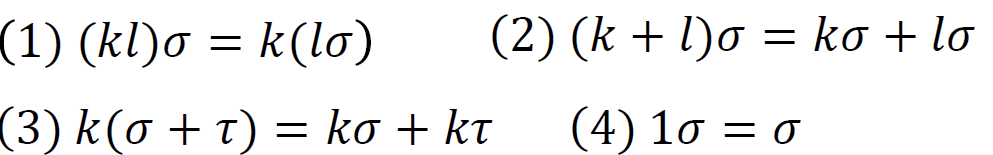

#### d. 逆线性变换

设 $\sigma$ 为空间 $V$ 的线性变换，若有 $V$ 的变换 $\tau$ 使 $\sigma\tau=\tau\sigma=I$ ，则称 $\sigma$ 为可逆变换，$\tau$ 为 $\sigma$ 的逆变换，记为 $\sigma^{-1}$ 

- 可逆变换 $\sigma$ 的逆变换 $\sigma^{-1}$ 也是线性变换
- 线性变换 $\sigma$ 可逆 $\iff$ 线性变换 $\sigma$ 是一一对应的
- 设 $\epsilon_1,\epsilon_2,\cdots,\epsilon_n$ 是线性空间 $V$ 的一组基，$\sigma$ 为 $V$ 的线性变换，则 $\sigma$ 可逆当且仅当 $\sigma(\epsilon_1),\cdots,\sigma(\epsilon_n)$ 线性无关
- 可逆线性变换是把 无关向量变成无关向量

### 5.4.4 线性变换的矩阵表示

设 $\epsilon_1,\epsilon_2,\cdots,\epsilon_n$ 为数域 $F$ 上线性空间 $V$ 的一组基，$\sigma$  为 $V$ 的线性变换，基向量的像可被基线性表示，即
$$
\left\{
\begin{aligned}
&\sigma(\epsilon_1)=a_{11}\epsilon_1+a_{21}\epsilon_{2}+\cdots+a_{n1}\epsilon_n\\
&\sigma(\epsilon_2)=a_{12}\epsilon_1+a_{22}\epsilon_{2}+\cdots+a_{n2}\epsilon_n\\
\vdots\\
&\sigma(\epsilon_n)=a_{1n}\epsilon_1+a_{2n}\epsilon_{2}+\cdots+a_{nn}\epsilon_n\\
\end{aligned}
\right.
$$
$\sigma(\epsilon_1,\epsilon_2,\cdots,\epsilon_n)=(\epsilon_1,\epsilon_2,\cdots,\epsilon_n)A$ ，其中 $A=\left(\begin{matrix}a_{11}&a_{12}&\cdots&a_{1n}\\a_{21}&a_{22}&\cdots&a_{2n}\\\vdots&\vdots&\ddots&\vdots\\a_{n1}&a_{n2}&\cdots&a_{nn}\end{matrix}\right)$ 

矩阵 $A$ 为线性变换 $\sigma$ 在基 $\epsilon_1,\epsilon_2,\cdots,\epsilon_n$ 下的矩阵

**定理：**

设 $\epsilon_1,\epsilon_2,\cdots,\epsilon_n$ 为数域 $F$ 上线性空间 $V$ 的一组基，在这组基下，$V$ 的每一个线性变换都与 $F^{n\times n}$ 中的唯一矩阵对应，且具有性质：

- 线性变换的和对应于矩阵的和
- 线性变换的乘积对应于矩阵的乘积
- 线性变换的数量积对应于矩阵的数量积
- 可逆线性变换与可逆矩阵对应，且逆变换对应于逆矩阵

设线性空间 $V$ 上的线性变换 $\varphi$ 在两个基 $\epsilon_1,\epsilon_2,\cdots,\epsilon_n$ 与 $\eta_1,\eta_2,\cdots,\eta_n$ 下的矩阵分别是 $A$ 、$B$ ，则有相似公式 $B=P^{-1}AP$ 

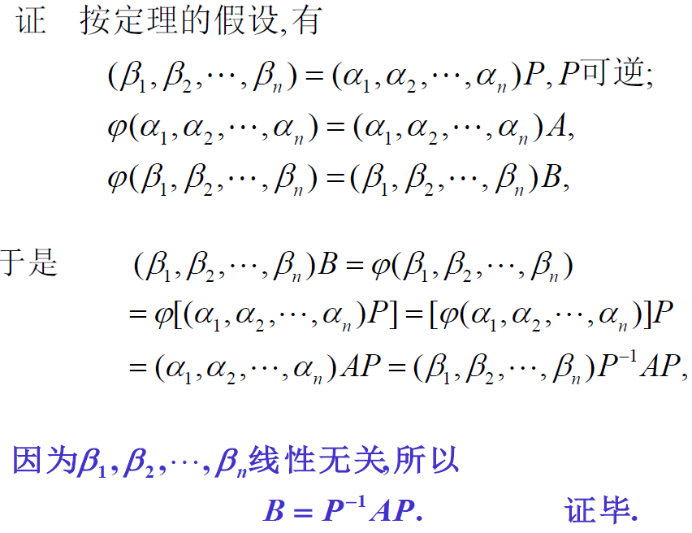

**eg**

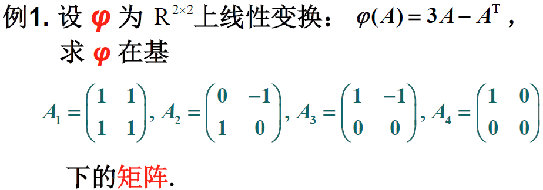

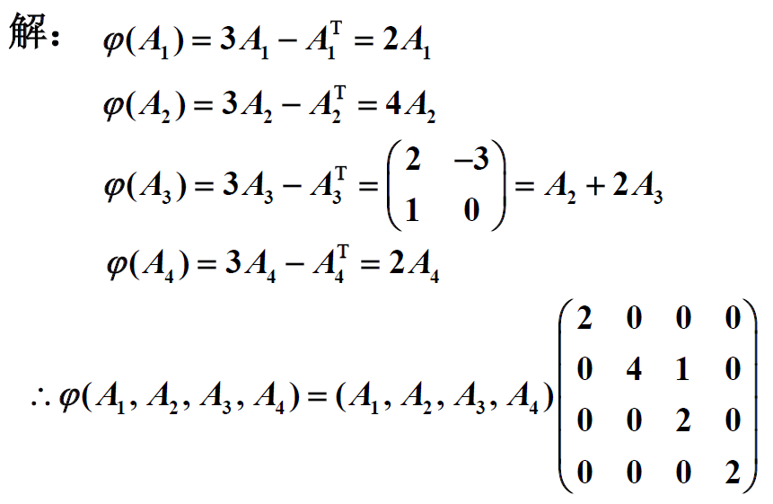

---

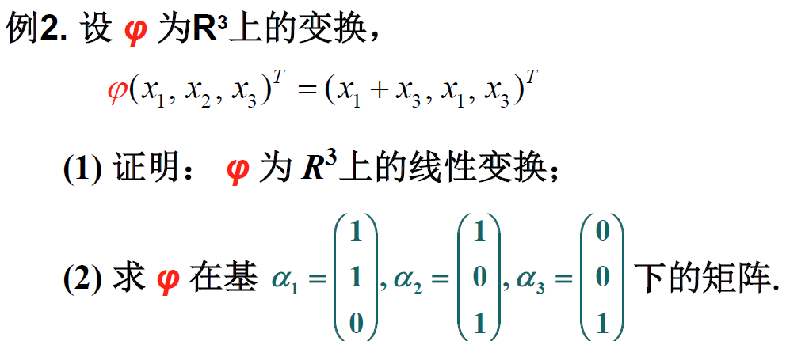

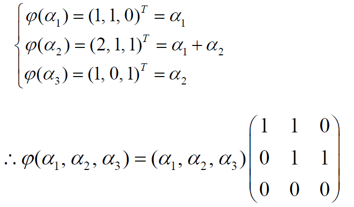
