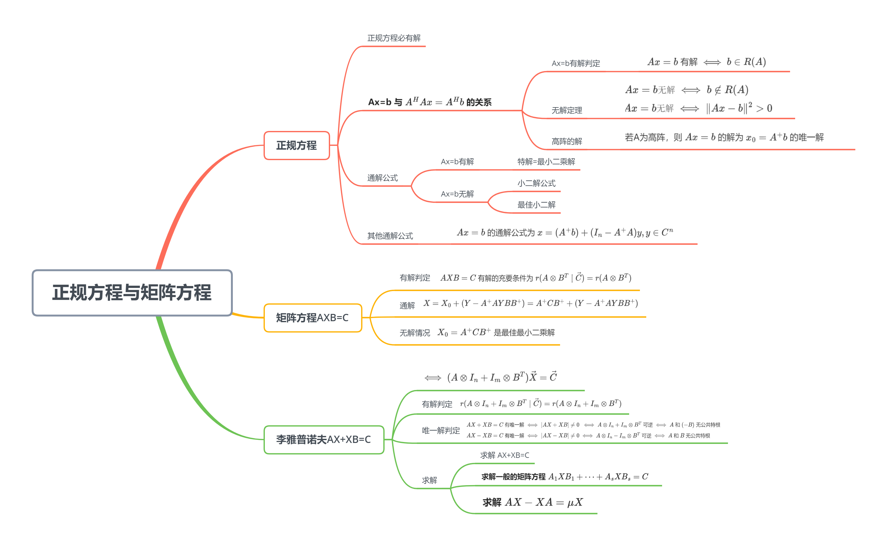

<!--more-->

## 6.1 正规方程

$$
\begin{aligned}
A^HAx=A^Hb为Ax=b的正规方程
\end{aligned}
$$

### 6.1.1 正规方程必有解

**正规方程 $A^HAx=A^Hb$ 必有解** ，且特解为 $x_0=A^+b$ ，使 $A^HAx_0=A^Hb$

**证明**
$$
\begin{aligned}
&由于A^HAA^+\xlongequal{(AA^+)^H=AA^+}A^H(AA^+)^H=(AA^+A)^H=A^H,\\
&令x_0=A^+b,则AA^Hx_0=A^HAA^+b=A^Hb
\end{aligned}
$$
**推论**

若矩阵方程 $AXD=B$ 有解，则有特解 $X_1=A^+BD^+$

### 6.1.2 Ax=b 与 $A^HAx=A^Hb$ 的关系

$$
1. 若Ax=b有解，则 A^HAx=A^Hb有解，且两个方程组同解（相容）\\
2. 若Ax=b无解，则 A^Hx=A^Hb仍然有解，且特解为A^+b（不相容）
$$

#### a. $Ax=b$ 有解判定

若 $Ax=b$ 有解(相容)，则可知 $b\in R(A)=\{y=Ax\vert x\in C^n\}$ ，即 $Ax=b$ 有解 $\iff$ $b\in R(A)$ 

#### b. 无解定理

$$
\begin{aligned}
&若Ax=b无解(不相容)，则对一切x\in C^n,Ax\neq b,即Ax=b无解\iff b\notin R(A)\\
&若Ax=b无解，则队一切x\in C^n，Ax\neq b必有\Vert Ax-b\Vert^2>0,即 Ax=b无解\iff \Vert Ax-b \Vert^2>0
\end{aligned}
$$

$$
若x_0=A^+b 使Ax_0\neq b,则 Ax=b 无解（不相容）
$$

#### c. 高阵的解

若 $A=A_{m\times n}$ 为列满秩阵，则有 $N(A)=\{\vec{0}\}$ ，即 $AX=0$ 只有零解 $X=\vec{0}$ 

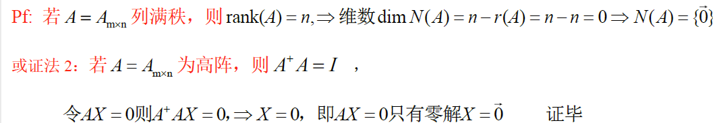

若A为高阵，则 $Ax=b$ 的解为 $x_0=A^+b$ 的唯一解

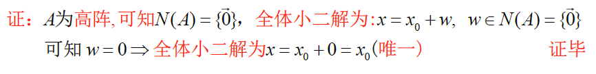

**eg**

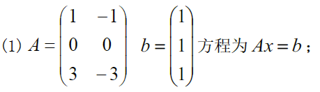

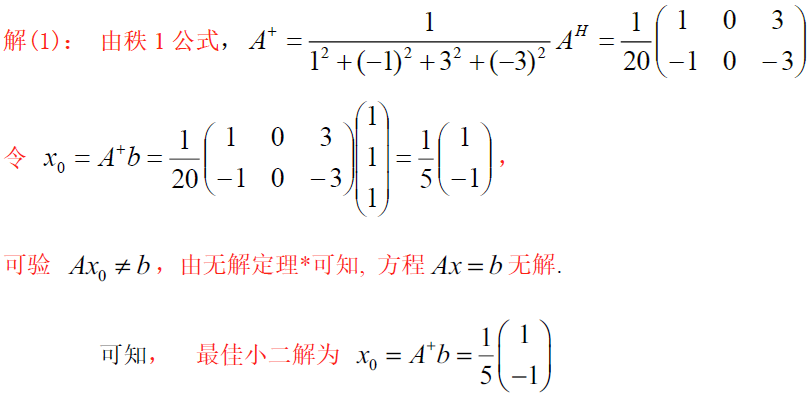

---

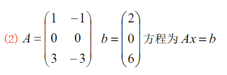

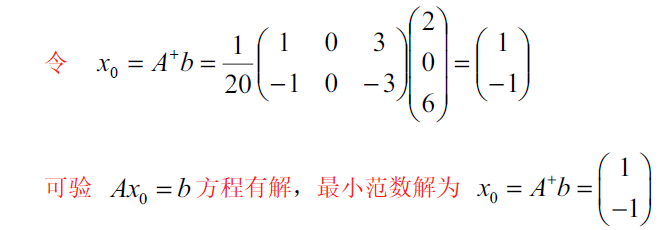

### 6.1.3 通解公式

#### a. $Ax=b$ 有解情形

设 $Ay=0$ 基本解为 $Y_1,Y_2,\cdots,Y_k$ ，则 $Ay=0$ 有通解，$y=t_1Y_1+t_2Y_2+\cdots+t_kY_k$ ,可写 $N(A)=\{y\vert Ay=0\}=\{全体y=t_1Y_1+t_2Y_2+\cdots+t_kY_k\}$

且 $Ay=b$ 通解公式为 $x=x_0+(t_1Y_1+t_2Y_2+\cdots+t_kY_k)\xlongequal{\Delta}x_0+y,\forall y\in N(A)$ ,**k=n-r(A)**

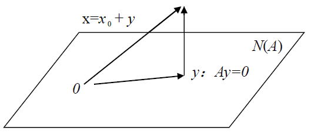

##### 最小二乘解

若 $Ax=b$ 有解，则哪个解x的长度平方 $\vert x\vert^2=x^Hx=\vert x_1\vert^2+\cdots+\vert x_k\vert^2 $ 最小：**$x_0=A^+b$** 

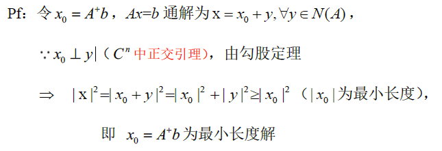

**eg**

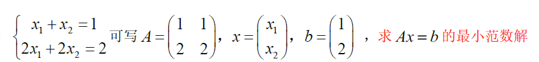
$$
\begin{aligned}
&r(A)=r(A\vert b)=1，故Ax=b有解\\
&x_0=A^+b=\left(
\begin{matrix}
1&1\\2&2
\end{matrix}
\right)^+b=\frac{1}{10}\left(
\begin{matrix}
1&2\\1&2
\end{matrix}
\right)\left(
\begin{matrix}
1\\2
\end{matrix}
\right)=\frac{1}{10}\left(
\begin{matrix}
5\\5
\end{matrix}
\right)=\left(
\begin{matrix}
\frac{1}{2}\\\frac{1}{2}
\end{matrix}
\right)\\
&Ax=0\Rightarrow\left(
\begin{matrix}
1&1\\2&2
\end{matrix}
\right)\left(
\begin{matrix}
x_1\\x_2
\end{matrix}
\right)=0\Rightarrow x_1+x_2=0\Rightarrow Ax=0通解x=\left(
\begin{matrix}
1\\-1
\end{matrix}
\right)\\
&Ax=b的通解公式为 X=\left(
\begin{matrix}
\frac{1}{2}\\\frac{1}{2}
\end{matrix}
\right)+t\left(
\begin{matrix}
1\\-1
\end{matrix}
\right)
\end{aligned}
$$

#### b. $A x=b$ 无解情形

> 若 $Ax=b$ 无解，则 $\vert Ax-b\vert^2>0$ ，对于 $x\in C^n$ ，如何使 $\vert Ax-b\vert$ 最小：**$x_0=A^+b$**

若 $\vert Ax_0-b\vert ^2$ 为 $\vert Ax-b\vert^2$ 的最小值，则 $x_0$ 为 $Ax-b$ 的一个极小二乘解，即 $\vert Ax_0-b\vert^2$ 为 $AX$ 与 $b$ 的最小平方距离

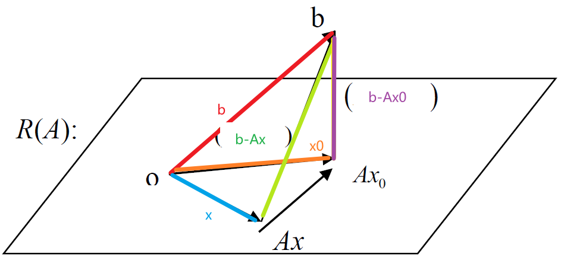

**证明**
$$
\begin{aligned}
&Ax-Ax_0=A(x-x_0)\in R(A),\therefore (b-Ax_0)\bot A(x-x_0)\\
&\vert Ax-b\vert^2\xlongequal{勾股定理}\vert A(x-x_0)+A(x_0-b)\vert^2 \ge \vert A(x-x_0)\vert^2 + \vert A(x_0-b)\vert^2\ge \vert A(x_0-b)\vert^2\\
&当且仅当A(x-x_0) =0时， \vert Ax_0-b\vert^2=\vert A(x_0-b)\vert ^2最小
\end{aligned}
$$

##### 小二解公式

令 $x_0=A^+b$ ，则 $Ax=b$ 的全体小二解为 $x=x_0+Y,Y\in N(A),AY=0$ 

 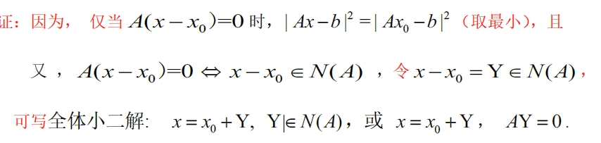

##### 最佳小二解

若 $Ax=b$ 无解，则 $x_0=A^+b$ 为最佳小二解

**eg**

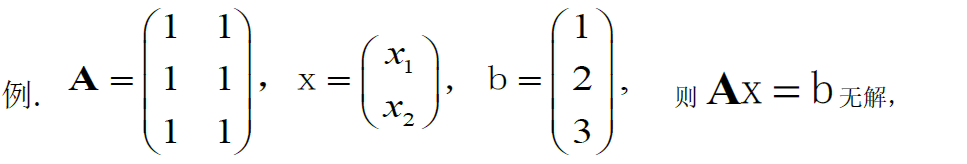
$$
\begin{aligned}
&r(A)=1,r(A\vert b)=3，故Ax=b无解\\
&最佳小二解x_0=A^+b=\frac{1}{6}\left(
\begin{matrix}
1&1&1\\1&1&1
\end{matrix}
\right)\left(
\begin{matrix}
1\\2\\3
\end{matrix}
\right)=\left(
\begin{matrix}
1\\1
\end{matrix}
\right),令Ay=0,\Rightarrow x_1+x_2=0,即Y=\left(
\begin{matrix}
1\\-1
\end{matrix}
\right)\\
&全体小二解为X=x_0+tY=\left(
\begin{matrix}
1\\1
\end{matrix}
\right)+t\left(
\begin{matrix}
1\\-1
\end{matrix}
\right)
\end{aligned}
$$

---

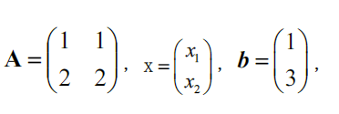
$$
\begin{aligned}
&r(A)=1\neq r(A\vert b)=2,\therefore Ax=b无解\\
&最佳小二解x_0=A^+b=\frac{1}{10}\left(
\begin{matrix}
1&2\\1&2
\end{matrix}
\right)\left(
\begin{matrix}
1\\3
\end{matrix}
\right)=\frac{1}{10}\left(
\begin{matrix}
7\\7
\end{matrix}
\right)\\
&设Ay=0\Rightarrow \left(
\begin{matrix}
1&1\\2&2
\end{matrix}
\right)\left(
\begin{matrix}
y_1\\y_2
\end{matrix}
\right)=y_1+y_2=0\Rightarrow 齐次方程Ay=0的通解为 y=\left(
\begin{matrix}
1\\-1
\end{matrix}
\right)\\
&\therefore Ax=b的通解为 x=x_0+ty=\frac{1}{10}\left(
\begin{matrix}
7\\7
\end{matrix}
\right)+t\left(
\begin{matrix}
1\\-1
\end{matrix}
\right)
\end{aligned}
$$

### 6.1.4 其他通解公式

#### a. $Ax=0$ 的通解公式

$$
Ax=0的通解为 \xi=(I_n-A^+A)y,y\in C^n\\
$$

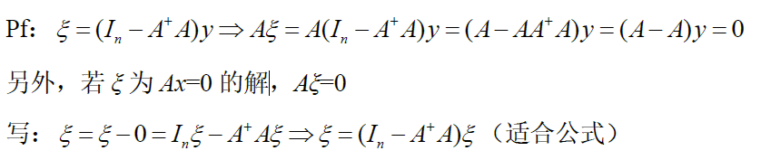

可写核空间公式 $N(A)=\{w=(I-A^+A)y\vert y\in C^n\}$ 

#### b. $Ax=b$ 的通解

$Ax=b$ 的通解公式为 $x=(A^+b)+(I_n-A^+A)y,y\in C^n$ 

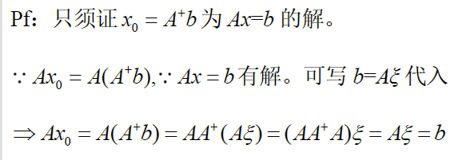

## 6.2 矩阵方程AXB=C求解

### 6.2.1 有解判定

#### a. 定理

拉直可求解线性矩阵方程 $AXB=C$ ，其中 $A=A_{m\times n},X=X_{n\times p},B=B_{p\times q}$

记 $X=(x_{ij})_{n\times p}$ ，即为 $np$ 个未知量 $x_{ij}$ 的线性方程组

根据拉直公式，则方程 $AXB=C$ 可被拉直为 $(A\otimes B^T)\vec{X}=\vec{C}$ 

推广：一般的线性矩阵方程 $A_1XB_1+A_2XB_2+\cdots+A_SXB_S=C$
$$
\begin{aligned}
\overrightarrow{A_1XB_1+A_2XB_2+\cdots+A_sXB_s}=\vec{C}\iff(A_1\otimes B_1^T+\cdots+A_s\otimes B_s^T)\vec{X}=\vec{C}
\end{aligned}
$$
**拉直前有解则拉直后也有解** 

- $AXB=C$ 有解的充要条件为 $r(A\otimes B^T\mid\vec{C})=r(A\otimes B^T)$
- 齐次方程 $AXB=0$ 的基础解系含有 $np-r(A\otimes B^T)=np-r(A)r(B)$ 个无关向量

#### b. 有解与唯一解条件

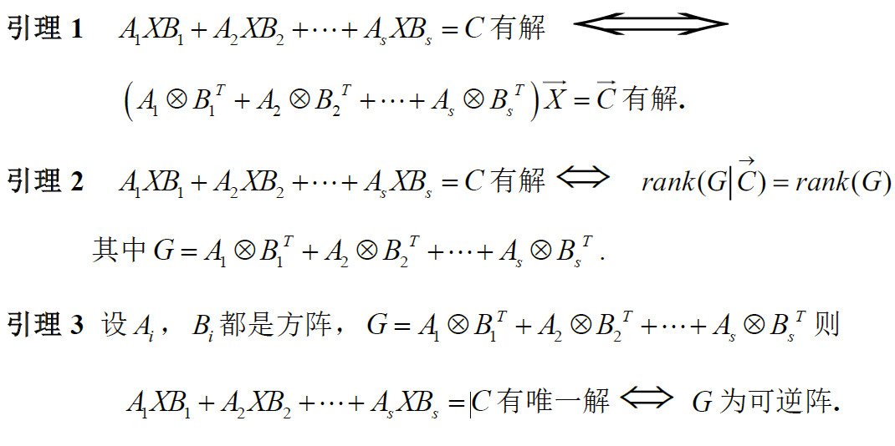

### 6.2.2 AXB=C求解

#### a. 有解情况

若矩阵方程 $AXB=C$ 有解相容，则有特解 $X_0=A^+CB^+$ 
$$
\begin{aligned}
证明：
&若方程 AXB=C 有解，可设X=W是一个解AWB=C\\
&令特解X_0=A^+CB^+,\\
&可证AX_0B=AA^+CB^+B\xlongequal{C=AWB}AA^+AWBB^+B=AWB=C
\end{aligned}
$$

- 无解定理：若 $X_0=A^+CB^+$ ，使 $AX_0B\neq C$ ，则矩阵方程无解

- 齐次方程 $AXB=0$ 的通解公式为：$X=Y-A^+AYBB^+$ Y为任一矩阵
- 矩阵方程 $AXB=C$ 的通解公式为：$X=X_0+(Y-A^+AYBB^+) = A^+CB^++(Y-A^+AYBB^+)$ 

**$AXA=A$必有解,特解为 $X_0=A^+AA^+=A^+$，通解为 $X=X_0+(Y-A^+AYAA^+)$**  

**eg** 

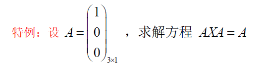
$$
\begin{aligned}
&A有特解 A_0=A^+=\left(1,0,0\right)_{1\times 3}，通解公式为 X=A^++(Y-A^+AYAA^+) \\
&Y与A^+同型即 Y=Y_{1\times 3}\\
&令Y=(a,b,c),其中a,b,c\in C\\
&X=A^++\left(a,b,c\right)-A^+A\left(a,b,c\right)AA^+=\left(1,0,0\right)+\left(a,b,c\right)-\left(a,0,0\right)=\left(1,b,c\right)
\end{aligned}
$$

---

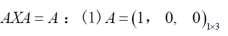

$$
解得：X=(1,b,c)^T=\left(\begin{matrix}1\\b\\c\end{matrix}\right) 即若 AXA=A 有解，则 A^TX^TA^T=A^T 有解
$$

#### b. 无解情况

若矩阵方程 $AXB=C$ 无解，矩阵 $X=(x_{ij})_{p\times q}$ 的欧式范数或模长记为 $\Vert X\Vert=\Vert X\Vert_F=\sqrt{\sum\vert x_{ij}\vert^2}=\sqrt{tr(X^HX)}$ 

**定理1**：若矩阵方程 $AXB=C$ 有解（相容），则 $X_0=A^+CB^+$ 是最小范数解，即 $AXB=C$ 的通解满足 $\Vert X\Vert^2\ge \Vert X_0\Vert^2(最小模长)$

**定理2** ：若矩阵方程 $AXB=C$ 无解（不相容），则 $X_0=A^+CB^+$ 是最佳最小二乘解，即任一 $X$ 满足 $\Vert AXB-C\Vert^2\ge \Vert AX_0B-C\Vert^2(最小误差)$ 

### 6.2.3 AX+XB=C（里亚普诺夫）

$AX+XB=C$ ,其中 $A\in C^{m\times m}.B\in C^{n\times n},X\in C^{m\times n}$

1. 使用拉直公式

   $AX+XB=C\iff  (AXI_n+I_mXB)=C\iff(\overrightarrow{AXI_n+I_mXB})=\vec{C}\\\iff(A\otimes I_n+I_m\otimes B^T)\vec{X}=\vec{C}$ 

2. 有解的充要条件为 $r(A\otimes I_n+I_m\otimes B^T\mid\vec{C})=r(A\otimes I_n+I_m\otimes B^T)$

3. 唯一解充要条件 ：$\vert A\otimes I_n+I_m\otimes B^T\vert\neq 0$ 

   根据特征值计算 $\vert A\otimes I_n+I_m\otimes B^T\vert$ 

**定理1**：	

- $AX+XB=C$ 有唯一解 $\iff \vert AX+XB\vert \neq 0$  $\iff A\otimes I_n+ I_m\otimes B^T$ 可逆 $\iff A$ 和 $(-B)$ 无公共特根
- $AX-XB=C$ 有唯一解 $\iff \vert AX-XB\vert \neq 0$ $\iff A\otimes I_n- I_m\otimes B^T$ 可逆 $\iff A$ 和 $B$ 无公共特根

若 $A=A_{m\times m}$ 的特根为 $\lambda_1,\lambda_2,\cdots,\lambda_m$ ； $B=B_{n\times n}$ 的特根为 $t_1,t_2,\cdots,t_n$  

则 $A\otimes I_n+I_m\otimes B^T$ 的 $mn$ 个特根为 $\{\lambda_k+t_j\}$ ；$A\otimes I_n-I_m\otimes B^T$ 的 $mn$ 个特征值 $\{\lambda_k-t_j\}$ $(k=1,2,\cdots,m,j=1,2,\cdots,n)$

因为 $B$ 与 $B^T$ 有相同的特征值

$\Rightarrow$ $\vert A\otimes I_n\pm I_m\otimes B^T\vert$ 的 $mn$ 个特征值为 $(\lambda_k\pm t_j)$ 

$\Rightarrow A\otimes I_n\pm I_m\otimes B$ 不可逆的条件为 **无零根** 即 $\{\lambda_k\pm t_j\neq 0\}$ 

$\iff A$ 与 $(\pm B)$ 没有公共特征值 

**定理2：** 若 A 和 B 的特根都有负实部，则 $AX+XB=C$ 有唯一解

- 若特根都在左半平面，则 $A$ 与 $-B$ 不会有公共特根

**定理3** ：若 $A$ 和 $B$ 分别为 $m$ 阶和 $n$ 阶方阵，若 $A$ 和 $B$ 没有公共特征值，则 $\left[\begin{matrix}A&C\\0&B\end{matrix}\right]$ 与 $\left[\begin{matrix}A&0\\0&B\end{matrix}\right]$ 相似

- 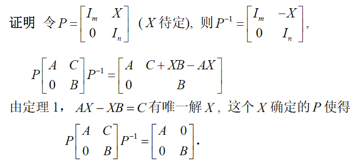

**定理4** ：若 $A \in C^{m\times m},B\in C^{n\times n},F\in C^{m\times n}$ ，若 $A$ 和 $B$ 没有公共特根，则 $\left[\begin{matrix}A&0\\F&B\end{matrix}\right]$ 与 $\left[\begin{matrix}A&0\\0&B\end{matrix}\right]$ 相似

- 证明：令 $P=\left(\begin{matrix}I&0\\X&I\end{matrix}\right),P^{-1}=\left(\begin{matrix}I&0\\-X&I\end{matrix}\right)$ ，则有许尔公式，$P\left(\begin{matrix}A&0\\F&B\end{matrix}\right)P^{-1}=\left(\begin{matrix}A&0\\XA-BX+F&B\end{matrix}\right)$ ，若为对角阵，则 $AX-BX=-F\Rightarrow AX-BX=F$

#### a. 求解矩阵方程

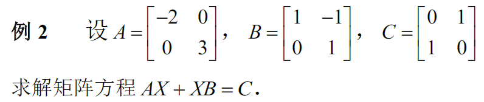

A的特征值为 -2,3；B的特征值为1,1。矩阵方程拉直为 $AX+XB=C\iff(A\otimes I_2+I_2\otimes B^T)\vec{X}=\vec{C}$  。而 $A$ 与 $-B$ 没有公共特征值，则拉直后方程具有唯一解。

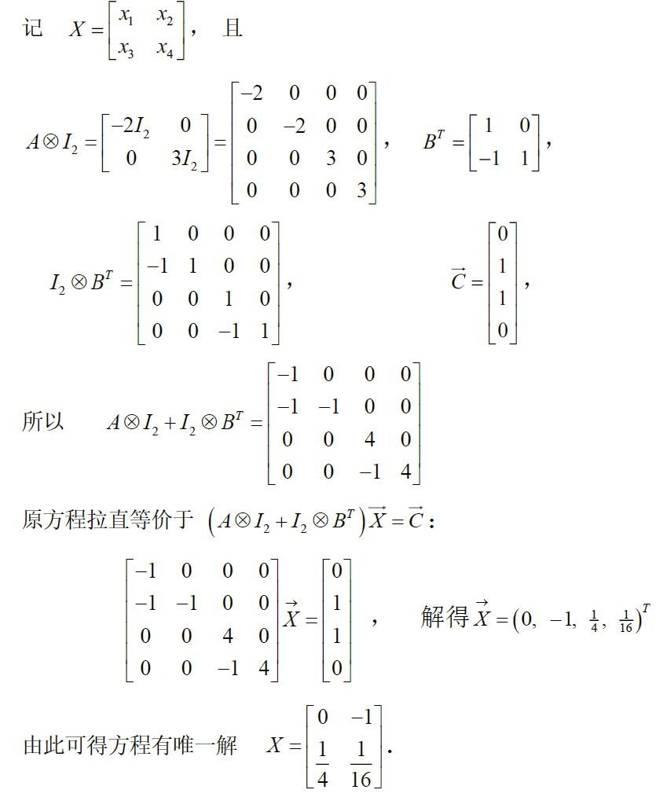

---

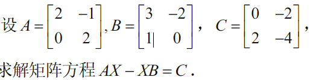

$\lambda(A)=\{2,2\},\lambda(B)=\{1,2\}$ ，故A和B有公共特征值，故解不唯一，

$AX-XB=C$ 可拉直为 $(A\otimes I_{2\times 2}-I_{2\times 2}\otimes B^T)\vec{X}=\vec{C}$ ，有 $X=\left[\begin{matrix}x_1&x_2\\x_3&x_4\end{matrix}\right],\vec{X}=\left(\begin{matrix}x_1\\x_2\\x_3\\x_4\end{matrix}\right)$ 

$(A\otimes I_{2\times 2}-I_{2\times 2}\otimes B^T)\vec{X}=\left(\begin{matrix}-1&-1&-1&0\\2&2&0&-1\\0&0&-1&-1\\0&0&2&2\end{matrix}\right)\left(\begin{matrix}x_1\\x_2\\x_3\\x_4\end{matrix}\right)=\left(\begin{matrix}0\\-2\\2\\-4\end{matrix}\right) \iff GX=b$ 由于 $r(G\vert b)=r(G)=3$ ，故方程有解，其解为 $(G\vert b)\rightarrow \left(\begin{array}{c:c} \begin{matrix} 1&1&0&0\\ 0&0&1&0\\0&0&0&1\\0&0&0&0 \end{matrix}& \begin{matrix} -4\\ 4\\-6\\0 \end{matrix} \end{array}\right)$

故 G 的解为 $X=\left(\begin{matrix}-4\\0\\4\\6\end{matrix}\right)+t\left(\begin{matrix}1\\-1\\0\\0\end{matrix}\right)$ 原矩阵方程的解为 $X=\left(\begin{matrix}-4&0\\4&6 \end{matrix}\right)+t\left(\begin{matrix}1&-1\\0&0\end{matrix}\right)$   

---

#### b. 求解一般的矩阵方程 $A_1XB_1+\cdots+A_sXB_s=C$

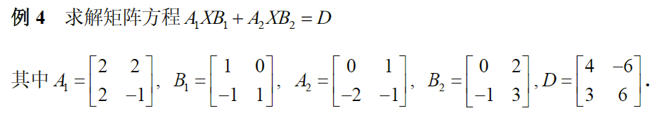

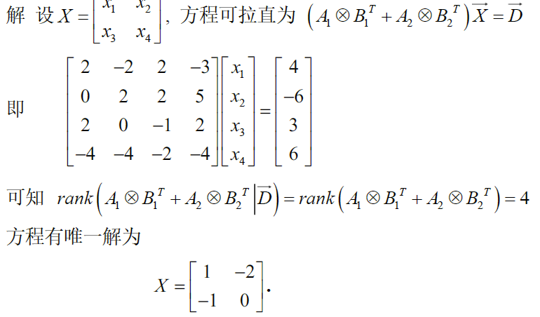

---

#### c. 求解 $AX-XA=\mu X$

1. 将方程拉直为 $(A\otimes I_n-I_n\otimes A^T)\vec{X}=\mu \vec{X}$ 

2. 记 $G=A\otimes I_n-I_n\otimes A^T$ 原方程化为 $G\vec{X}=\mu \vec{X}\Rightarrow (G-\mu I)\vec{X}=0$ 

   有非零解条件为 $\vert G-\mu I\vert=0$ ，即 $\mu$ 是 G的特征值，而 $\lambda(G)=\{\lambda_r-\lambda_s\}$ 

   故 有非零解条件为：$\exist r,s$ ，使 $\mu=\lambda_r-\lambda_s,1\le r,s\le n$ 

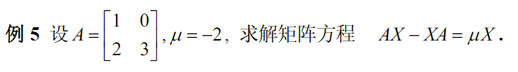

$\lambda(A)=\{1,3\}$，$G=A\otimes I_2-I_2\otimes A^T=\left(\begin{matrix}0&-2&0&0\\0&-2&0&0\\2&0&2&-2\\0&2&0&0\end{matrix}\right)$ $\lambda(G)=\{\lambda(A)_i-\lambda(A)_j\}=\{2,0,0,-2\}$ ,故 $\exist \lambda(G)=\mu=-2$ ，矩阵方程有非零解

$X=\left(\begin{matrix}x_1&x_2\\x_3&x_4\end{matrix}\right)$ ，$\vec{X}=\left(\begin{matrix}x_1\\x_2\\x_3\\x_4\end{matrix}\right)$ ，解 $G\vec{X}=0$ $\Rightarrow \vec{X}=t_1\left(\begin{matrix}-1\\0\end{matrix}\right)+t_2\left(\begin{matrix}1\\0\end{matrix}\right)=\left(\begin{matrix}-t_1&t_2\\0&0\end{matrix}\right)$ ，故原矩阵方程的解 $X=\left(\begin{matrix}-t_1\\t_2\\0\\0\end{matrix}\right)$

---

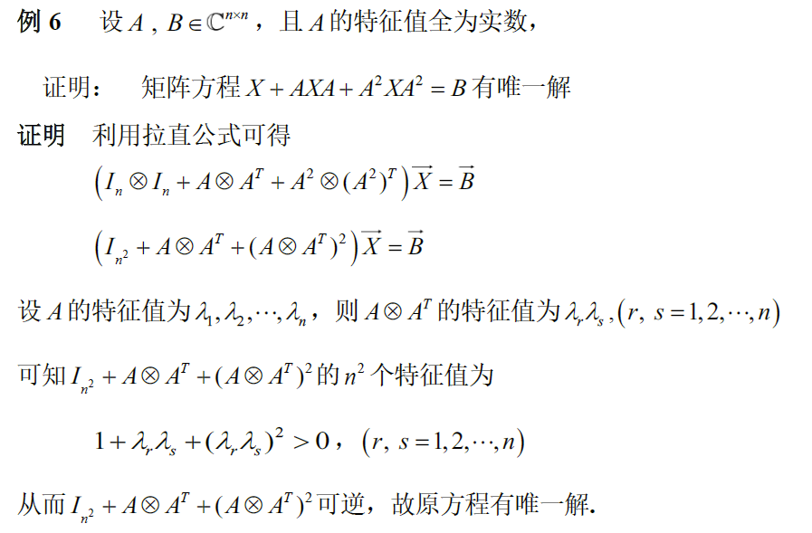

---

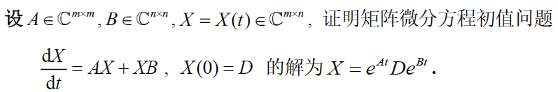

由拉直公式 $\frac{dX}{dt}=AX+XB=(A\otimes I_n+I_m\otimes B^T)\vec{X}=\vec{C}$ 
$$
\begin{aligned}
&\vec{X}=e^{t(A\otimes I_n+I_m\otimes B^T)}\vec{D}=e^{t(A\otimes I_n)}e^{t(I_m\otimes B^T)}\vec{D}==(e^{tA}\otimes I_n)(I_m\otimes e^{tB^T})\vec{D}\\
&=(e^{tA}I_m\otimes I_ne^{tB^T})\vec{D}=(e^{tA}\otimes e^{tB^T})\vec{D	}=\overrightarrow{e^{tA}D((e^{tB^T}))^T}=...
\end{aligned}
$$
