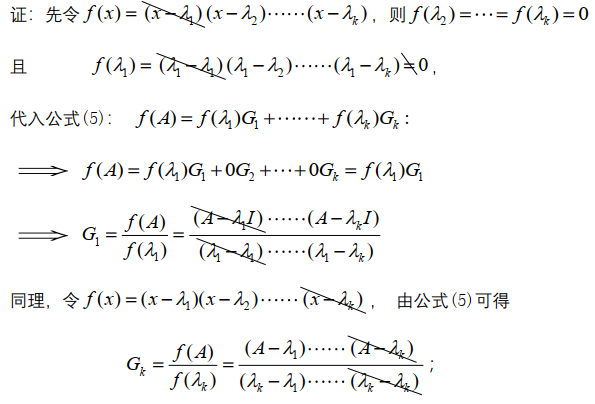
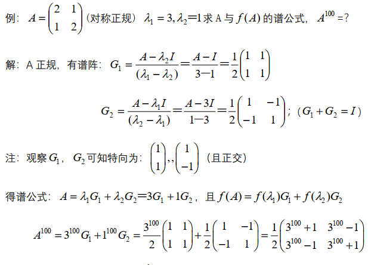
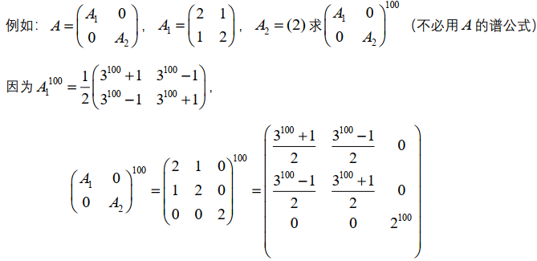

> 正规阵

<!--more-->                                                                                      

## 6.1 正规阵

### 6.1.1 正规阵定义

> 若方阵A满足 $A^HA=AA^H$ ，则A为正规阵
>
> 正规条件：$A^HA=AA^H$

### 6.1.2 正规阵特点

1. 正规阵必为方阵
2. $A正规\iff A^H正规$ ，$A不正规\iff A^H不正规$

### 6.1.3 常见正规阵

#### 1. 对角阵

对角阵 $A=\left(\begin{matrix}a_1&&\\&\ddots&\\&&a_n\end{matrix}\right)$ 必正规

##### 三角正规阵必对角

> 若三角阵 $B=\left(\begin{matrix}b_{1}&b_{12}&\cdots&b_{1n}\\&b_{2}&\cdots&b_{2n}\\&&\ddots&\\&&&b_n\end{matrix}\right)$ 正规，则 $B=\left(\begin{matrix}b_1&&&&\\&b_2&&\\&&\ddots&\\&&&b_n\end{matrix}\right)$ 为对角形

证明：**严格三角阵不是正规阵** 
$$
\begin{aligned}
&设B=\left(
\begin{matrix}
b_1&b_{12}&b_{13}\\
&b_2&b_{23}\\
&&b_{3}
\end{matrix}
\right)为正规阵，B^H=\left(
\begin{matrix}
\overline{b_1}&&\\
\overline{b_{12}}&\overline{b_2}&\\
\overline{b_{13}}&\overline{b_{23}}&\overline{b_3}
\end{matrix}
\right)\\
&BB^H=\left(
\begin{matrix}
b_1&b_{12}&b_{13}\\
&b_2&b_{23}\\
&&b_{3}
\end{matrix}
\right)\left(
\begin{matrix}
\overline{b_1}&&\\
\overline{b_{12}}&\overline{b_2}&\\
\overline{b_{13}}&\overline{b_{23}}&\overline{b_3}
\end{matrix}
\right)\\
&=\left(
\begin{matrix}
\vert b_1 \vert^2+\vert b_{12} \vert^2+\vert b_{13} \vert^2 &&\\
&\vert b_{23} \vert^2+\vert b_2 \vert^2&\\
&&\vert b_3 \vert^2
\end{matrix}
\right)\\
&B^HB=\left(
\begin{matrix}
\overline{b_1}&&\\
\overline{b_{12}}&\overline{b_2}&\\
\overline{b_{13}}&\overline{b_{23}}&\overline{b_3}
\end{matrix}
\right)\left(
\begin{matrix}
b_1&b_{12}&b_{13}\\
&b_2&b_{23}\\
&&b_{3}
\end{matrix}
\right)\\
&=\left(
\begin{matrix}
\vert b_1\vert^2 &&\\
&\vert b_{12}\vert^2+\vert b_2\vert^2&\\
&&\vert b_{13}\vert^2+\vert b_{23}\vert^2+\vert b_{3}\vert^2
\end{matrix}
\right),\\
&若B满足正规阵，则B^HB=BB^H,即\\
&\Rightarrow \left\{
\begin{aligned}
\vert b_1\vert^2 = \vert b_1 \vert^2+\vert b_{12} \vert^2+\vert b_{13} \vert^2\\
\vert b_{12}\vert^2+\vert b_2\vert^2=\vert b_{23} \vert^2+\vert b_2 \vert^2\\
\vert b_3 \vert^2=\vert b_{13}\vert^2+\vert b_{23}\vert^2+\vert b_{3}\vert^2
\end{aligned}
\right.\Rightarrow \left\{
\begin{aligned}
\vert b_{12} \vert^2=0\\
\vert b_{13} \vert^2=0\\
\vert b_{23} \vert^2=0
\end{aligned}
\right.\\
&\Rightarrow b_{12}=b_{13}=b_{23}=0，即B=\left(
\begin{matrix}
b_{1}&&\\
&b_{2}&\\
&&b_{3}
\end{matrix}
\right)为对角形
\end{aligned}
$$

若分块阵 $A=\left(\begin{matrix} B&C\\0&D \end{matrix}\right)$ 正规，则C=0，且B，D都正规，$A=\left(\begin{matrix} B&0\\0&D \end{matrix}\right)$ 
$$
\begin{aligned}
&A^HA=\left(
\begin{matrix}
B^H&0\\
C^H&D^H
\end{matrix}
\right)\left(
\begin{matrix}
B&C\\
0&D
\end{matrix}
\right)=\left(
\begin{matrix}
B^HB&B^HC\\
C^HB&C^HC+D^HD
\end{matrix}
\right)\\
&AA^H=\left(
\begin{matrix}
B&C\\
0&D
\end{matrix}
\right)\left(
\begin{matrix}
B^H&0\\
C^H&D^H
\end{matrix}
\right)=\left(
\begin{matrix}
BB^H+CC^H&CD^H\\
DC^H&C^HC+DD^H
\end{matrix}
\right)\\
&由于tr(A^HA)=tr(AA^H),\therefore tr(CC^H)=0,\\
&利用迹公式可写tr(CC^H)=\sum \vert c_{i,j} \vert^2=0，其中C=(c_{i,j})，C为零阵\\
&且BB^H=B^HB,DD^H=D^HD
\end{aligned}
$$
由证明过程可见，严格三角阵为非正规阵

#### 2. H阵与斜H阵

Hermite阵与斜Hermite阵必正规
$$
\begin{aligned}
若A是Hermite阵，则A^H=A，A^HA=AA=AA^H
\end{aligned}
$$
- 实对称阵与反对称阵都是正规阵

#### 3. U阵

U阵必正规（实正交阵）
$$
\begin{aligned}
A^HA=I=AA^H
\end{aligned}
$$

### 6.1.4 正规阵的构造方法

#### 倍数法则

> 若A正规，取倍数k，则kA为正规阵，

$$
\begin{aligned}
\left(
\begin{matrix}
0&i&i\\
i&0&i\\
i&i&i
\end{matrix}
\right)=i\left(
\begin{matrix}
0&1&1\\
1&0&1\\
1&1&1
\end{matrix}
\right),\left(
\begin{matrix}
i&i\\
i&2i
\end{matrix}
\right)=i\left(
\begin{matrix}
1&1\\1&2
\end{matrix}
\right)都是正规阵\\
A=\frac{1}{\sqrt{2}}\left(
\begin{matrix}
i&1\\
1&i
\end{matrix}
\right)为正规U阵，则\sqrt{2}A=\left(
\begin{matrix}
i&1\\
1&i
\end{matrix}
\right)
\end{aligned}
$$

#### 平移法则

> 若A正规，则 $A\pm cI$ 正规

$$
\begin{aligned}
若A是正规阵，则(A\pm cI)^H(A\pm cI)&=(A^H\pm cI)(A\pm cI)\\
&=A^HA\pm cA^H\pm cA+c^2I\\
&=AA^H\pm cA\pm cA^H+c^2I\\
&=(A\pm cI)(A^H\pm cI)
\end{aligned}
$$

#### U相似

> 若A正规，则 $Q^HAQ$ 也正规，其中Q为U阵($Q^H=Q^{-1}$)，即正规阵的U相似阵一定正规

证明：
$$
\begin{aligned}
&\because A^HA=AA^H，且存在U阵Q，使得Q^HAQ=B，即证B^HB=BB^H\\
&B^HB=(Q^HAQ)^H(Q^HAQ)=Q^HA^HQQ^HAQ=Q^HA^HAQ\\
&BB^H=(Q^HAQ)(QAQ^H)^H=Q^HAQQ^HA^HQ=Q^HAA^HQ\overset{AA^H=A^HA}{=}Q^HA^HAQ\\
&\therefore B^HB=BB^H,B为正规阵
\end{aligned}
$$

#### 多项式正规

> 若 A 正规，则 $f(A)=\lambda_0I+\lambda_1A+\lambda_2A^2+\cdots+\lambda_nA^K$ 正规

### 6.1.5 正规阵与其H阵的特征向量相同

> 若A正规，则 $A^H$ 与 A 有相同的向量

$$
\begin{aligned}
若A正规，且AX=\lambda X，则A^HX=\overline{\lambda}X
\end{aligned}
$$

**证明**
$$
\begin{aligned}
&只需证 (A^H-\overline{\lambda}I)X=0,即(A-\lambda I)^HX=0,由(A-\lambda I)X=0\\
&\vert A-\lambda I \vert^2=0\Rightarrow ((A-\lambda I)X)^H(A-\lambda I)X=0\Rightarrow X^H(A-\lambda I)^H(A-\lambda I)X=0\\
&由于A-\lambda I 正规，(A-\lambda I)^H(A-\lambda I)=(A-\lambda I)(A-\lambda I)^H\\
&即有 X^H((A-\lambda I)^H)^H(A-\lambda I)^HX=0\\
&\Rightarrow ((A-\lambda I)^HX)^H(A-\lambda I)^HX=\vert (A-\lambda I)^HX\vert^2=0\\
&\Rightarrow (A-\lambda I)^HX=0\Rightarrow (A^H-\overline{\lambda}I)X=0\Rightarrow A^HX=\overline{\lambda}X\\
&故结论得证，若A正规，则AX=\lambda X\iff A^HX=\overline{\lambda}X\\
&其中，若\lambda(A)=\{\lambda_1,\cdots,\lambda_n\},则\lambda(A^H)=\{\overline{\lambda_1},\cdots,\overline{\lambda_n}\}
\end{aligned}
$$

## 6.2 正规分解定理

> 若 $A=A_{n\times n}$ 正规，则存在U阵Q，使 $Q^HAQ=\Lambda=\left(\begin{matrix}\lambda_1&&\\&\ddots&\\&&\lambda_n\end{matrix}\right)$ 

**证明**
$$
\begin{aligned}
&设A=A_{n\times n} 正规，由U相似定理，Q^HAQ正规，由许尔公式，存在U阵Q，使\\
&Q^HAQ=D=\left(
\begin{matrix}
\lambda_1&&*\\
&\ddots&\\
&&\lambda_n
\end{matrix}
\right)为上三角阵\\
&D=Q^HAQ为正规三角阵，由 "正规三角定理" 可知D为对角阵\\
&即Q^{-1}AQ=D=\left(
\begin{matrix}
\lambda_1&&\\
&\ddots&\\
&&\lambda_n
\end{matrix}
\right)成立
\end{aligned}
$$

### 6.2.1 正规阵A恰有n个正交特向

$$
\begin{aligned}
&由Q^{-1} AQ=D=\left(
\begin{matrix}
\lambda_1&&\\
&\ddots&\\
&&\lambda_n
\end{matrix}
\right)\Rightarrow AQ=QD\\&\Rightarrow A\left(q_1,\cdots,q_n\right)=\left(q_1,\cdots,q_n\right)D\\
&\Rightarrow\left(Aq_1,\cdots,Aq_n\right)=\left(\lambda_1q_1,\cdots,\lambda_nq_n\right)\\
&U阵Q为A的特征向量组成的矩阵，且n个特征向量相互正交，q_1\bot \cdots \bot q_n
\end{aligned}
$$

### 6.2.2 正规分解方法

1. 先令特征根 $\lambda_1,\cdots,\lambda_n$ ，求正交特征向量 $X_1\bot \cdots \bot X_n$ 
2. 令U阵 $Q=\left(q_1,\cdots,q_n\right)=\left(\frac{X_1}{\vert X_1\vert},\cdots,\frac{X_n}{\vert X_n \vert}\right)$ 

则有U相似阵 $Q^HAQ=D=\left(\begin{matrix}\lambda_1&&\\&\ddots&\\&&\lambda_n\end{matrix}\right)$ 为对角阵

3. 可写正规分解 $A=QDQ^H$ 

#### 定义法

对矩阵 $A=\left(\begin{matrix} 1&-1\\1&0\end{matrix}\right)$ 正规分解
$$
\begin{aligned}
&A=\left(
\begin{matrix}
0&-1\\
1&0
\end{matrix}
\right)为正规U阵，计算可得\lambda_1=i,\lambda_2=-i，X_1=\left(
\begin{matrix}
i\\1
\end{matrix}
\right),X_2=\left(
\begin{matrix}
1\\i
\end{matrix}
\right),\\
&且X_1与X_2为不同特征值的特征向量，所以X_1\bot X_2\\
&令u阵Q=\left(
\begin{matrix}
\frac{X_1}{\vert X_1\vert},\frac{X_2}{\vert X_2\vert}
\end{matrix}
\right)=\frac{1}{\sqrt{2}}\left(
\begin{matrix}
i&1\\
1&i
\end{matrix}
\right),可得Q^HAQ=D=\left(
\begin{matrix}
i&\\
&-i
\end{matrix}
\right)\\
&则有正规分解 A=QDQ^H=\frac{1}{\sqrt{2}}\left(
\begin{matrix}
i&1\\
1&i
\end{matrix}
\right)\left(
\begin{matrix}
i&\\
&-i
\end{matrix}
\right)\frac{1}{\sqrt{2}}\left(
\begin{matrix}
-i&1\\
1&-i
\end{matrix}
\right)
\end{aligned}
$$

#### 平移法

$$
\begin{aligned}
&令B=\left(
\begin{matrix}
1&-1\\
1&1
\end{matrix}
\right)=I+A=\left(
\begin{matrix}
1&\\
&1
\end{matrix}
\right)+\left(
\begin{matrix}
0&-1\\
1&0
\end{matrix}
\right),其中A为正规U阵\\
&\lambda(B)=\{\lambda_1,\lambda_2\}=\{1+i,1-i\},X_1=\left(
\begin{matrix}
i\\1
\end{matrix}
\right),X_2=\left(
\begin{matrix}
1\\i
\end{matrix}
\right),\\
&得U阵Q=\left(\frac{X_1}{\vert X_1\vert},\frac{X_2}{\vert X_2\vert}\right)=\frac{1}{\sqrt{2}}\left(
\begin{matrix}
i&1\\
1&i
\end{matrix}
\right)，故有正规分解A=QDQ^H\\
&=\frac{1}{\sqrt{2}}\left(
\begin{matrix}
i&1\\
1&i
\end{matrix}
\right)\left(
\begin{matrix}
1+i&\\
&1-i
\end{matrix}
\right)\frac{1}{\sqrt{2}}\left(
\begin{matrix}
-i&1\\
1&-i
\end{matrix}
\right)
\end{aligned}
$$

## 6.3 正规谱分解

### 6.3.1 正规分解推导

$$
\begin{aligned}
&若A=A_{n\times n} 正规，互异根为 \lambda_1,\cdots,\lambda_k，则有Q^HAQ=D=\left(
\begin{matrix}
\lambda_1I_1&&\\
&\ddots&\\
&&\lambda_kI_k
\end{matrix}
\right)\\
&其中Q为U阵，Q^H=Q^{-1},I_1,\cdots,I_k为单位阵\\
&\left(如D=\left(
\begin{matrix}
2\left(
\begin{matrix}
1&\\
&1
\end{matrix}
\right)\\
&3\left(
\begin{matrix}
1&\\
&1
\end{matrix}
\right)
\end{matrix}
\right)=\left(
\begin{matrix}
2I_1&\\
&3I_2
\end{matrix}
\right)\right)\\
&可设 Q^{-1}AQ=D=\left(
\begin{matrix}
\lambda_1I_1&&0\\
&\ddots&\\
0&&\lambda_kI_k
\end{matrix}
\right)(Q为U阵，Q^H=Q^{-1})\\
&写为D=\lambda_1\left(
\begin{matrix}
I_1&&0\\
&\ddots&\\
0&&0
\end{matrix}
\right)+\lambda_2\left(
\begin{matrix}
0&&0\\
&I_2&\\
0&&\ddots
\end{matrix}
\right)+\cdots+\lambda_k\left(
\begin{matrix}
0&&0\\
&\ddots&\\
0&&I_k
\end{matrix}
\right)\\
&则令D_1=\left(
\begin{matrix}
I_1&&0\\
&\ddots&\\
0&&0
\end{matrix}
\right),D_2=\left(
\begin{matrix}
0&&0\\
&I_2&\\
0&&\ddots
\end{matrix}
\right),\cdots,D_k=\left(
\begin{matrix}
0&&0\\
&\ddots&\\
0&&I_k
\end{matrix}
\right)\\
&\Rightarrow Q^{-1}AQ=D=\lambda_1D_1+\lambda_2D_2+\cdots+\lambda_kD_k\\
\end{aligned}
$$

则可得出结论：
$$
\begin{aligned}
&①和为单位阵：D_1+D_2+\cdots+D_k=\left(
\begin{matrix}
I_1&&\\
&\ddots&\\
&&I_k
\end{matrix}
\right)=I(单位阵)，\\
&②正交：D_1D_2=0,\cdots,D_iD_j=0(i\neq j)\\
&③幂等：D_1^2=D_1,\cdots,D_k^2=D_k\\
\end{aligned}
$$
故可等价写为：
$$
\begin{aligned}
&Q^HAQ=D=\lambda_1D_1+\lambda_2D_2+\cdots+\lambda_kD_k\\
&\Rightarrow A=QDQ^H=\lambda_1QD_1Q^H+\lambda_2QD_2Q^H+\cdots+\lambda_kQD_kQ^H\\
&可令G_1=QD_1Q^H,\cdots,G_k=QD_kQ^H\\
&\Rightarrow A=\lambda_1G_1+\cdots+\lambda_kG_k
\end{aligned}
$$

有类似推论：
$$
\begin{aligned}
&①G_1+G_2+\cdots+G_k=I\\
&\quad \because G_1+G_2+\cdots+G_k=Q(D_1Q^{-1}+D_2+\cdots+D_k)Q^{-1}=QIQ^{-1}=I
\\
&②G_1G_2=0,\cdots,G_iG_j=0(i \neq j)\\
&\quad \because G_1G_2=(QD_1Q^{-1})(QD_2Q^{-1})=0\\
&③G_1^2=G_1,\cdots,G_k^2=G_k,且G_1^H=G_1,\cdots,G_k^H=G_k都是Hermite阵
\end{aligned}
$$

### 6.3.2 正规阵谱分解与谱阵性质

$$
\begin{aligned}
&若A=A_{n\times n} 正规，全体互异根为 \lambda_1,\cdots,\lambda_k，则有A=\lambda_1G_1+\lambda_2G_2+\cdots+\lambda_kG_k\\
&其中G_1,\cdots,G_k为A的谱阵
\end{aligned}
$$

#### 性质

$$
\begin{aligned}
&①和为I：G_1+G_2+\cdots+G_k=I\\
&②正交：G_1G_2=0,\cdots,G_iG_j=0(i\neq j)\\
&③幂等： G_1^{2}=G_1,\cdots,G_k^{2}=G_k(幂等),且G_1^H=G_1,\cdots ,G_k^H=G_k\\
&④正规阵幂次：A^p=\lambda_1^pG_1+\cdots+\lambda_kG_k,p=0,1,2.\cdots\\
&⑤正规阵函数：f(A)=f(\lambda_1)G_1+\cdots+f(\lambda_k)G_k,f(x)=c_0+c_1x_1+\cdots+c_px^p\\
& \quad \because f(A)=c_0I+c_1A+\cdots+c_kA^p\\
&   \quad \quad =c_0(G_1+\cdots+G_k)+c_1(\lambda_1G_1+\lambda_2G_2+\cdots+\lambda_kG_k)+\\
& \quad \quad \quad \cdots+c_p(\lambda_1^pG_1+\lambda_2^pG_2+\cdots+\lambda_p^kG_k)\\
& \quad \quad =(c_0+c_1\lambda_1+c_p\lambda_1^k)G_1+(c_0+c_1\lambda_2+\cdots+c_p\lambda_2^pk)G_2+\\
& \quad \quad \quad \cdots+(c_0+c_1\lambda_k+\cdots+c_p\lambda_k^p)G_k\\
& \quad \quad =f(\lambda_1)G_1+\cdots+f(\lambda_k)G_k\\
&⑥正规阵求法：设A正规，全体不同根为 \lambda_1,\lambda_2,\cdots,\lambda_k，则有谱阵公式G_1,G_2,\cdots,G_k\\
&\quad G_1=\frac{(A-\lambda_2I)\cdots(A-\lambda_kI)}{(\lambda_1-\lambda_2)\cdots(\lambda_1-\lambda_k)},G_1=\frac{(A-\lambda_1I)(A-\lambda_3I)\cdots(A-\lambda_kI)}{(\lambda_2-\lambda_1)(\lambda_2-\lambda_3)\cdots(\lambda_2-\lambda_k)}\\
&\quad\cdots\\
&\quad G_k=\frac{(A-\lambda_1I)(A-\lambda_2I)\cdots(A-\lambda_{k-1}I)}{(\lambda_k-\lambda_1)(\lambda_k-\lambda_2)\cdots(\lambda_k-\lambda_{k-1})}\\
&⑦谱阵中列是A的特征向量：AG_1=\lambda_1G_1,AG_2=\lambda_2G_2,\cdots,AG_k=\lambda_kG_k\\
&\quad \because AG_1=(\lambda_1G_1+\cdots+\lambda_kG_k)G_1=\lambda_1G_1
\end{aligned}
$$

#### 谱阵求法

由推论⑤可知，取k个不同的函数f(x)可求出谱阵 $G_1,G_2,\cdots.G_k$

**证明**：

##### A正规有2个不同根

$$
\begin{aligned}
G_1=\frac{A-\lambda_2I}{\lambda_1-\lambda_2},G_2=I-G_1=\frac{A-\lambda_1I}{\lambda_2-\lambda_1}
\end{aligned}
$$

##### A正规且有3个不同根

$$
\begin{aligned}
&G_1=\frac{(A-\lambda_2I)(A-\lambda_3I)}{(\lambda_1-\lambda_2)(\lambda_1-\lambda_3)},G_2=\frac{(A-\lambda_1I)(A-\lambda_3I)}{(\lambda_2-\lambda_1)(\lambda_2-\lambda_3)},\\
&G_3=I-G_1-G_2=\frac{(A-\lambda_1I)(A-\lambda_2I)}{(\lambda_3-\lambda_1)(\lambda_3-\lambda_2)}
\end{aligned}
$$

#### 正规分解性质的应用例

##### 1

$$
\begin{aligned}
A=\left(
\begin{matrix}
1&0&-2\\
0&0&0\\
-2&0&4
\end{matrix}
\right)(实对称正规阵)，求A与f(A)的谱分解，与A^{100}
\end{aligned}
$$

$$
\begin{aligned}
&可知A为秩1矩阵，r(A)=1,特征根为\lambda(A)={5,0,0},不同根为\lambda_1=5,\lambda_2=0\\
&G_1=\frac{A-\lambda_2I}{\lambda_1-\lambda_2}=\frac{1}{5}\left(
\begin{matrix}
1&0&-2\\
0&0&0\\
-2&0&4
\end{matrix}
\right),G_2=\frac{A-\lambda_1I}{\lambda_2-\lambda_1}=I-G_1=\frac{1}{5}\left(
\begin{matrix}
4&0&2\\
0&5&0\\
2&0&1
\end{matrix}
\right)\\
&得谱分解：A=\lambda_1G_1+\lambda_2G_2,且f(A)=f(\lambda_1)G_1+f(\lambda_2)G_2\\
&即f(A)=f(5)G_1+f(0)G_2\\
&令f(x)=x^{100}\Rightarrow A^{100}=f(5)G_1+f(0)G_2=5^{100}G_1=5^{100}\frac{1}{5}A=5^{99}A\\
&由于G中列向量都是A的特征向量，所以\lambda_1=5的特征向量\alpha_1=\left(
\begin{matrix}
1\\0\\-2
\end{matrix}
\right)\\
&\lambda_2=0的特征向量\alpha_2=\left(
\begin{matrix}
2\\0\\1
\end{matrix}
\right),\alpha_3=\left(
\begin{matrix}
0\\1\\0
\end{matrix}
\right)
\end{aligned}
$$

##### 2

##### 3.分块法

### 6.3.3 新平方根公式

$$
\begin{aligned}
&\sqrt{A}=\sqrt{\lambda_1}G_1+\sqrt{\lambda_2}G_2+\cdots+\sqrt{\lambda_n}G_n\\
&条件：A正规，且A=\lambda_1G_1+\cdots+\lambda_kG_k
\end{aligned}
$$

#### 证明：

