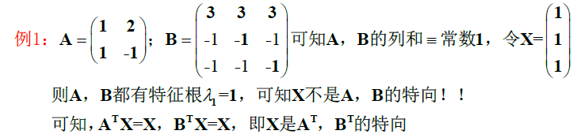
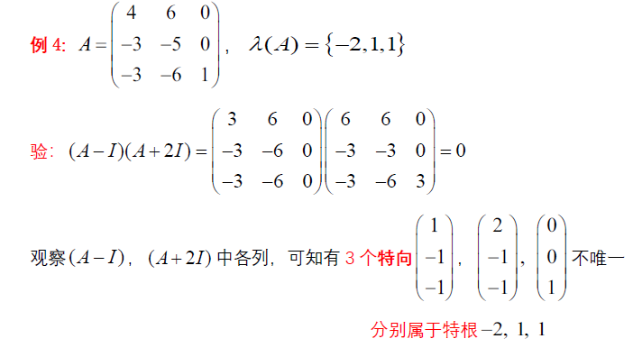
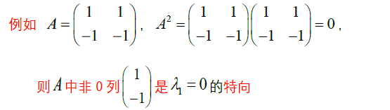

> 一些特征向量的直接观察方法

<!--more-->

## 7.1 特根

$$
若n阶方阵A=(a_{ij})中 "行和=常数k" ，则常数k为A的一个特征根，全1向量X=\left(
\begin{matrix}
1\\\vdots\\1
\end{matrix}
\right)为A的一个特向
$$

$$
若n阶方阵A=(a_{ij})中“列和=常数k”,则常数k为A^T的一个特根，全1向量=\left(
\begin{matrix}
1\\\vdots\\1
\end{matrix}
\right)为A的一个特向
$$

可知 $A^H$ 与 A 的特征值相等，但特征向量未必相等

**eg**

---

$$
\begin{aligned}
&已知二阶阵A=\left(
\begin{matrix}
3&1\\2&2
\end{matrix}
\right)(行和阵),特根为4,tr(A)-4=1,相应特向X=\left(
\begin{matrix}
1\\1
\end{matrix}
\right),Y=\left(
\begin{matrix}
1\\-2
\end{matrix}
\right)\\
&X，Y线性无关，所以P=\left(
X,Y
\right)=\left(
\begin{matrix}
1&1\\1&-2
\end{matrix}
\right)为可逆阵，故A可相似对角化为对角阵\\
&P^{-1}AP=D=\left(
\begin{matrix}
4&0\\
0&1
\end{matrix}
\right),故可知A为单阵
\end{aligned}
$$

**实对称阵特根为实数**

## 7.2 特征向量

$$
若(A-\lambda_1I)P=0,则P中的列都是\lambda_1的特征向量
$$

证明：
$$
\begin{aligned}
&(A-\lambda_1I)P=0\iff AP=\lambda_1 P,令P=(X_1,\cdots,X_n)，按列分块，则有\\
&A(X_1,\cdots,X_n)=\lambda_1(X_1,\cdots,X_n)\Rightarrow (AX_1,\cdots,AX_n)=(\lambda_1X_1,\cdots,\lambda_nX_n)\\
&则P中各列都是\lambda_1的特征向量
\end{aligned}
$$
### 7.2.1 两个互异特根的特向

$$
若 (A-\lambda_1I)(A-\lambda_2I)=0,则(A-\lambda_2I)的列都是\lambda_1的特向，(A-\lambda_1I)的列是\lambda_2的特向
$$
eg：
$$
\begin{aligned}
&A=\left(
\begin{matrix}
1&0&-2\\0&0&0\\-2&0&4
\end{matrix}
\right)(为正规H单阵)，全体特征根\lambda(A)=\{5,0,0\},不同特征根为5,0\\
&由于A是单阵，必有(A-\lambda_1I)(A-\lambda_2I)=(A-5I)(A-0I)=0\\
&其中，\lambda_1=5对应的特征向量为A中的一个列向量\left(
\begin{matrix}
1\\0\\-2
\end{matrix}
\right)，\\
&\lambda_2=0对应的特征向量为A-5I=\left(
\begin{matrix}
-4&0&-2\\0&-5&0\\-2&0&-1
\end{matrix}
\right)的列向量\\
&分别为 \left(
\begin{matrix}
0\\1\\0
\end{matrix}
\right)\left(
\begin{matrix}
2\\0\\1
\end{matrix}
\right)
\end{aligned}
$$

---

### 7.2.2 幂等阵的一个特向

$$
若A为幂等阵：A^2=A，则必有(A-I)A=0,则A中的列都是\lambda_1=1的特征向量
$$

如：
$$
A=\left(
\begin{matrix}
1&0\\-1&0
\end{matrix}
\right),A^2=A为幂等阵，则A中非0列\left(
\begin{matrix}
1\\-1
\end{matrix}
\right)是\lambda_1=1的特征向量
$$

### 7.2.3 三个互异特根的特向

$$
\begin{aligned}
若&(A-\lambda_1I)(A-\lambda_2I)(A-\lambda_3I)=0,则\\
&(A-\lambda_2I)(A-\lambda_3I)中非零列为\lambda_1的特向\\
&(A-\lambda_1I)(A-\lambda_3I)中非零列为\lambda_2的特向\\
&(A-\lambda_1I)(A-\lambda_2I)中非零列为\lambda_3的特向
\end{aligned}
$$

#### eg

$$
A=\left(
\begin{matrix}
-1&i&0\\-i&0&-i\\0&i&-i
\end{matrix}
\right)，求特征向量
$$

$$
\begin{aligned}
&由特征多项式计算得\lambda(A)=\{1,-1,2\}，3阶方阵有3个互异特征根，故A为单阵\\
&且有0化式(x-1)(x+1)(x-2)成立，即(A-I)(A+I)(A-2I)=0成立，\\
&可知\lambda_1=1,\lambda_2=-1,\lambda_3=2对应的特征向量\\
&分别为(A+I)(A-2I),(A-I)(A-2I),(A-I)(A+I)的列向量,即有X_1=\left(
\begin{matrix}
1\\-2i\\1
\end{matrix}
\right)\\
&X_2=\left(
\begin{matrix}
-1\\0\\1
\end{matrix}
\right),X_3=\left(
\begin{matrix}
1\\i\\1
\end{matrix}
\right),可令U阵Q=\left(
\frac{X_1}{\sqrt{6}},\frac{X_2}{\sqrt{2}},\frac{X_3}{\sqrt{3}}
\right),必有Q^{-1}AQ=D=\left(
\begin{matrix}
1&&\\
&-1&\\
&&-2
\end{matrix}
\right)
\end{aligned}
$$

### 7.2.4 重根的特向

$$
\begin{aligned}
&若(A-\lambda_I)^2=0,则(A-\lambda I)中非0列都是\lambda的特向\\
&SP:若A^2=0,则A中非0列都是\lambda 的特向
\end{aligned}
$$

#### eg

---

$$
A=\left(
\begin{matrix}
2&0&0\\1&1&1\\1&-1&3
\end{matrix}
\right)，其A的特向
$$

$$
\begin{aligned}
&\lambda(A)=\{2,2,2\},0化式为(x-2)^3，且 (A-2I)^2=\left(
\begin{matrix}
0&0&0\\1&-1&1\\1&-1&1
\end{matrix}
\right)\left(
\begin{matrix}
0&0&0\\1&-1&1\\1&-1&1
\end{matrix}
\right)=0\\
&可见其特向为 \left(
\begin{matrix}
0\\1\\1
\end{matrix}
\right),且三重根\lambda=2只有一个特向，所以A不是单阵
\end{aligned}
$$

## 7.3 交换定理与公共特征向量

$$
若方阵AB=BA(可交换)，任取A的特根的特向X，满足AX=\lambda X,BX=tX\\
即X是A和B的公共特征向量
$$

$$
若A，B为n阶实对称阵，且可交换AB=BA，则存在正交阵Q，使Q^{-1}AQ,Q^{-1}BQ为对角阵
$$
