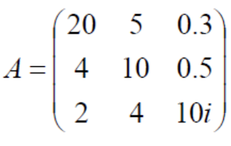

> 范数理论

<!--more-->

## 7.1 基本概念

### 7.1.1 向量范数

#### a. 模长（二范数）

$$
C^n中向量 X=\left(
\begin{matrix}
x_1\\x_2\\\vdots\\x_n
\end{matrix}
\right)的模长为 \vert X\vert=\sqrt{(X,X)}=\sqrt{tr(A^HA)} =\sqrt{\vert x_1\vert^2+\vert x_2\vert^2+\cdots+\vert x_n\vert^2 }
$$

- 正性：$\vert X\vert>0$ 

- 齐性：$\vert kX\vert=\vert k\vert \vert X\vert$ 

  $\vert -x\vert=\vert x\vert$ 

- 三角性：$\vert x+y\vert\le \vert x\vert +\vert y\vert$

  $\left| \vert x\vert-\vert y\vert \right|\le \vert x-y\vert$ 

##### 内积空间引入模长

任一内积空间W都可引入向量z长度(模长) $\vert \alpha\vert=\sqrt{(\alpha,\alpha)},\alpha\in W$

满足柯西-施瓦茨不等式 $\vert \alpha+\beta\vert\le \sqrt{(\alpha,\alpha)}\sqrt{(\beta,\beta)}=\vert \alpha\vert\vert \beta\vert$

- 三角性：$\vert \alpha+\beta\vert \le \vert \alpha\vert+\vert \beta\vert$
- 正性
- 齐性

##### 二维空间引入模长范数

令矩阵空间 $V=C^{m,n}$ ，$A=(a_{ij})，B=(b_{ij})\in C^{m,n}$ ，
$$
(A,B)=B^HA=tr(B^HA)=tr(A^HB)=\sum(\vert a_{ij}\vert\overline{\vert b_{ij}\vert})
$$
规定 $\Vert A\Vert=\sqrt{(A,A)}=\sqrt{tr(A^HA)}=\sqrt{tr(AA^H)}=\sqrt{\sum \vert a_{ij}\vert^2}$ 为A的F范数

#### b. 向量范数定义

设 $V$ 是数域 $F$ (实数域或复数域) 上的线性空间，若对于任一 $X\in V$ ，对应一个非负数，记为 $\Vert X \Vert$  满足以下三个条件，则称 $\Vert X\Vert$ 为空间  V 上的一个向量范数

- 正性：$\Vert X\Vert>0$
- 齐次性： $\Vert kX\Vert=\vert k\vert\Vert X\Vert$
- 三角不等式：$\Vert X+Y\Vert\le \Vert X\Vert+\Vert Y\Vert$

> 相当于规定在空间V上的一个非负函数 $\varphi(x)=\Vert x\Vert,x\in V$ ，满足正性，齐性，三角性 
>
> 可知 $C^n$ 上有很多(无穷) 个范数

范数定义2：若线性空间 $V$ 上有一个函数 $\varphi(x),x\in V$ 适合

- 正性：$\varphi(x)>0,x\neq \vec{0}$
- 齐性：$\varphi(kx)=\vert k\vert\varphi(x),x\in V$
- 三角形：$\varphi(x+y)\le \varphi(x)+\varphi(y)$

则称 $\varphi(x)$ 为 $V$ 上的一个范数，记为 $\varphi(x)=\Vert x\Vert$

**eg：** 

验证给定函数是否为范数

$$
\begin{aligned}
&\because A>0,则由平方根公式A=B^2=B^HB\Rightarrow X^HAX=X^HB^HBX=\vert BX\vert^2\\
&\Rightarrow \Vert x\Vert=\sqrt{\vert BX\vert^2}= \Vert BX\Vert_2>0,且满足齐性\\
&\Vert x+y\Vert=\Vert B(x+y)\Vert_2=\Vert Bx+By\Vert_2\le \Vert Bx\Vert_2+\Vert By\Vert_2=\Vert x\Vert+\Vert y\Vert ,满足三角性 
\end{aligned}
$$

---

#### c. 复向量空间中常用范数

1-范数：$\Vert x\Vert_1=\sum(\vert x_1\vert+\cdots+\vert x_n\vert)$

2-范数：$\Vert x\Vert_2=\sqrt{(x,x)}=\sqrt{\vert x_1\vert^2+\cdots+\vert x_n\vert^2}$

$\infty$-范数：$\Vert x\Vert_{\infty}=max\{\vert x_1\vert,\cdots,\vert x_n\vert\}$

p-范数：$\Vert x\Vert_p=\left(\sum_{i=1}\limits^{n}\vert x_i\vert^2\right)^{\frac{1}{2}} ,p\ge 1$ 

#### d. 向量范数性质

单位化公式：$X\neq 0$ ，则 $\frac{X}{\Vert X\Vert}$ 是范数为1的向量

$\Vert -X\Vert=\Vert X\Vert$

$\Vert X-Y\Vert\ge \vert\Vert X\Vert-\Vert Y\Vert \vert$

#### e. 有限维线性空间上范数等价性

对于 $C^n$ 上任两个范数 $\Vert X\Vert_a$ ，$\Vert X\Vert_b$ 存在正数：$k_1>0,k_2>0$ ，使 $k_1\Vert X\Vert_b<\Vert X\Vert_a < k_2\Vert X\vert_b$ 对一切x成立，即 $k_1\le \frac{\Vert X\Vert_a}{\Vert X\Vert_b}\le k_2$ ，对一切X成立

**证明** 

#### f. 范数收敛定理

##### 收敛定义

设 $C^n$ 中向量序列：$X^{(k)}=\left(X_1^{(k)},X_2^{(k)},\cdots,,X_n^{(k)}\right)$ ($k=1,2,\cdots$) ，$\alpha=\left(\alpha_1,\alpha_2,\cdots,\alpha_n\right)^T$ ，若 $X_1^{(k)}\rightarrow\alpha_1$ ，$X_2^{(k)}\rightarrow\alpha_2$ ,$\cdots$ ，$X_n^{(k)}\rightarrow\alpha_n$ （$k\rightarrow \infty$），则称 $X^{(k)}\rightarrow\alpha$ ，或 $\lim X^{(k)}=\alpha$ 
$$
X^{(k)}\rightarrow \alpha\iff \Vert X^{(k)}-\alpha\Vert\rightarrow 0
$$

##### 按范数收敛

设 $X_1,\cdots,X_m,\cdots$ 是线性空间V中的元素序列，若 $X_0\in V$ ，使 $\lim_{m\rightarrow\infty}\limits \Vert X_m-X_0\Vert_\alpha=0$ ，称序列 $\{X_m\}$ 按范数 $\Vert \bullet \Vert_\alpha$ 收敛于 $X_0$ ，记为 $\lim_{m\rightarrow\infty}\limits X_m\xlongequal{\alpha}X_0$ 

- 若序列 $\{X_m \}$ 按某一范数收敛于 $X_0$ ，则 $\{X_m\}$ 按任何范数都收敛于 $X_0$ ，即有限维空间按范数收敛是互相等价的

  

- 序列 $\{X_m\}$ 按范数收敛于 $X_0$ $\iff$ 按坐标收敛于 $X_0$ 
  $$
  \begin{aligned}
  &取一组基底e_1,e_2,\cdots,e_n，令X_m=\xi_1^{(m)}e_1+\cdots+\xi_n^{(m)}e_n,X_0=\xi_1^{(0)}e_1+\cdots+\xi_n^{(0)}e_n\\
  &由二范数定义,\forall x=\left(
  \begin{matrix}
  \xi_1\\\xi_2\\\vdots\\\xi_n
  \end{matrix}
  \right)\in C^n,\Vert X\Vert_2=(\sum_{i=1}\limits^n\vert \xi_i\vert^2)^{\frac{1}{2}}\\
  &按范数收敛是等价的，\therefore\lim_{m\rightarrow \infty}\Vert X_m-X_0\Vert=0\iff \lim_{m\rightarrow \infty}\Vert X_m-X_0\Vert_2=0\\
  &\iff \lim_{m\rightarrow \infty}(\sum_{i=1}\limits^n\vert \xi_i^{(m)}-\xi_i^{(0)}\vert^2 )\iff \lim_{m\rightarrow \infty}\xi_i^{(m)}=\xi_i^{(0)}
  \end{aligned}
  $$

### 7.1.2 矩阵范数

#### a. 矩阵范数定义

对于一个方阵 $A\in C^{n,n}$ ，矩阵范数 $\Vert A\Vert$ 表示某个法则与A对应的非负函数，且满足4个条件：

- 正性：$A\neq 0$ 时，$\Vert A\Vert>0$ ，当且仅当 $A=0$ 时， $\Vert A\Vert=0$
- 齐性：$\Vert kA\Vert=\vert k\vert\cdot \Vert A\Vert,\forall k\in C$
- 三角形：对于任两个矩阵 $A,B\in C^{n,n}$ ，有 $\Vert A+B\Vert\le \Vert A\Vert+\Vert B\Vert$
- 相容性（次乘性）：$\Vert AB\Vert\le \Vert A\Vert\cdot \Vert B\Vert,A,B\in C^{n,n}$ 

则 $\Vert A\Vert$ 为矩阵范数（相容范数）

---

矩阵范数定义2：设方阵空间 $C^{n\times n}$ 上非负函数 $\varphi(A),A\in C^{n\times n}$ ，有：

- 正性：$\varphi(A)>0(A\neq 0)$
- 齐性：$\varphi(kA)=\vert k\vert\varphi(A),k\in C$
- 三角形：$\varphi(A+B)\le \varphi(A)+\varphi(B),A,B\in C^{n\times n}$
- 相容性：$\varphi(AB)\le \varphi(A)\cdot \varphi(B)$ 

则称 $\varphi(A)$ 为空间 $C^{n\times n}$ 上的矩阵范数，记为 $\varphi(A)=\Vert A\Vert$

#### b. 常用范数

令方阵 $A=(a_{ij})_{n\times n} \in C^{n\times n}$

- 1-范数(最大列和)：$\Vert A\Vert_1=\max_j\limits \sum_{i=1}\limits^n\vert a_{ij}\vert ,j=1,\cdots,n$ 

  列是一个数据，对应的是向量范数的1-范数，能代表一个列向量

- $\infty$ 范数(最大行和)：$\Vert A\Vert_{\infty}=\max_i\limits\sum_{j=1}\limits^n\vert a_{ij} \vert(i=1,\cdots,n)$

  行是一个维度，对应的是向量范数的 $\infty$ -范数，能代表一个维度特征

- 2-范数(谱范数)：$\Vert A\Vert_2 =(\lambda_1(A^HA))^\frac{1}{2}$ ，$\lambda_1(A^HA)$ 表示 $A^HA$ 的最大特征值，即 $\Vert A\Vert_2$ 是 A 的最大特征值

- 总和范数：$\Vert A\Vert_M=\sum\vert a_{ij}\vert$

- F-范数：$\Vert A\Vert_F=(\sum \vert a_{ij}\vert^2)^\frac{1}{2}=\sqrt{tr(A^HA)}$ 

- G-范数：$\Vert A\Vert_G=n\cdot max\{\vert a_{ij}\vert\}$

**eg**

---

##### 几种范数关系

$$
\begin{aligned}
&\Vert A\Vert_{\infty}=\Vert A^H\Vert_1,\Vert A\Vert_1=\Vert A^H\Vert_\infty\\
&\Vert A\Vert_2=\Vert A^H\Vert_2,\Vert A\Vert_F=\Vert A^H\Vert_F=(tr(A^HA))^{\frac{1}{2}}\\
&U,V为U阵，则 \Vert UA\Vert_F=\Vert AV\Vert_F=\Vert UAV\Vert_F=\Vert A\Vert_F\\
&A\in C^{n\times n}，x\in C^n,则 \Vert Ax\Vert_2\le \Vert A\Vert_F\Vert x\Vert_2
\end{aligned}
$$

#### c. 矩阵范数性质

1. $\Vert A\pm B\Vert\le \Vert A\Vert+\Vert B\Vert$

    

2. $\Vert AB\Vert \le \Vert A\Vert\cdot \Vert B\Vert$ 

   

3. 幂公式：$\Vert A^k\Vert\le \Vert A\Vert^k$ 

   $\Vert I\Vert\ge 1$ 

   谱半径幂公式：$\rho(A^k)\le [\rho(A)]^k$ ，k=1,2,...
   $$
   \begin{aligned}
   &由谱半径定义 \rho(A)=max\{\vert \lambda_1\vert,\vert \lambda_2\vert,\cdots,\vert \lambda_n\vert\}，\\
   &其中方阵A=A_{n\times n} 特征值\lambda(A)=\{\lambda_1,\cdots,\lambda_n\}\\
   &可知 \lambda(A^k)=\{\lambda_1^k,\cdots,\lambda_n^k\}\Rightarrow \rho(A^k)=max\{\vert \lambda_1\vert^k,\cdots,\vert \lambda_n\vert^k \}=[\rho(A)]^k
   \end{aligned}
   $$

4. 公式：$\Vert kA\Vert=\vert k\vert\cdot\Vert A\Vert$ ，$\rho(kA)=\vert k\vert\rho(A)$ 

   SP：$\Vert -A\Vert=\Vert A\Vert$ ，$\rho(-A)=\rho(A)$

#### d. 矩阵范数定理

1. $A\in C^{m\times n}$ 的任一范数都是A的元素的连续函数
2. 任两个范数等价，即对2个范数 $\Vert A\Vert_\alpha.\Vert A\Vert_\beta$ ，存在正数 $k_1,k_2$ ，使得 $\forall A\in C^{m\times n}$ ，都有 $k_1\Vert A\Vert_\beta\le \Vert A\Vert_\alpha\le k_2\Vert A\Vert_\beta$ ，即$k_1\le \frac{\Vert A\Vert_\alpha}{\Vert A\Vert_\beta}\le k_2$
3. 矩阵序列 ${A_k}$ 按任一范数收敛于 $A_0\iff$ 按元素收敛 $\lim_{k\rightarrow \infty}\limits a_{ij}^k=a_{ij}^{0},\forall i,j$

**SP** ： 任一矩阵范数 $\Vert A\Vert$ 都和总和范数 $\Vert A\Vert_M=\sum\vert a_{i,j}\vert$ 等价，存在整数 $k_1$,$k_2$ ，使 $k_1\le \frac{\Vert A\Vert}{\Vert A\Vert_M}\le k_2$ 

$\frac{1}{n}\le \frac{\Vert A\Vert_1}{\Vert A\Vert_M}\le 1$ ，$\frac{1}{n}\le \frac{\Vert A\Vert_\infty}{\Vert A\Vert_M}\le 1$ ，$\frac{1}{n}\le \frac{\Vert A\Vert_F}{\Vert A\Vert_M}\le 1$

### 7.1.3 矩阵范数产生向量范数

$C^{n\times n}$ 上任一矩阵范数 $\Vert \bullet\Vert$ 都产生一个向量范数 $\varphi(X)=\Vert X\Vert_V$ 

- 矩阵范数与向量范数的相容性：$\varphi(Ax)\le \Vert A\Vert\varphi(x)$ ，即 $\Vert AX\Vert_V\le \Vert A\Vert\cdot\Vert X\Vert_V$ ,$\forall A\in C^{n,n},\forall X\in C^n$ 

**证明：** 
$$
\begin{aligned}
&设向量范数 \varphi(X)\overset{\Delta}{=}\Vert X\alpha^T\Vert,\forall X\in C^n,\alpha=\left(
\begin{matrix}
a_1\\\vdots\\a_n
\end{matrix}
\right)\neq \vec{0}为权向量,表示对每个列向量放缩形成矩阵\\
&则\varphi(X)\overset{\Delta}{=}\Vert X\alpha^T\Vert=\Vert a_1X,a_2X,\cdots,a_nX\Vert，右边为一个矩阵范数\\
&显然 ①正性：\varphi(X)=\Vert X\alpha^T \Vert\ge 0\\
& ②齐性：\varphi(kX)=\Vert (kX)\alpha^T\Vert=\Vert a_1kX,a_2kX,\cdots,a_nkX\Vert=\vert k\vert\Vert a_1X,a_2X,\cdots,a_nX_n\Vert=\vert k\vert\varphi(X)\\
&③三角性：令X，Y\in C^n,\\
&\quad \because \varphi(X+Y)=\Vert (X+Y)\alpha^T\Vert =\Vert X\alpha^T+Y\alpha^T \Vert\le \Vert X\alpha^T\Vert+\Vert Y\alpha^T\Vert =\varphi(X)+\varphi(Y)\\
&④相容性：\varphi(AX)=\Vert (AX)\alpha^T\Vert=\Vert A(X\alpha^T)\Vert\le \Vert A\Vert\cdot\Vert X\alpha^T\Vert=\Vert A\Vert\cdot\varphi(X)\\
&可证，\Vert AX\Vert_V\le \Vert A\Vert\cdot\Vert X\Vert_V,即矩阵范数与向量范数有相容性
\end{aligned}
$$
**eg** 

- F范数与向量2-范数相容： $\Vert Ax\Vert_2\le \Vert A\Vert_F\cdot\Vert x\Vert_2$
- 总和范数与1-范数，$\infty$-范数相容：$\Vert Ax\Vert_1\le \Vert A\Vert_M\cdot \Vert x \Vert_1$ ，$\Vert Ax\Vert_\infty\le \Vert A\Vert_M\cdot \Vert x\Vert_\infty$ 
- G范数与1-范数，$\infty$-范数相容，2-范数相容：$\Vert Ax\Vert_1\le \Vert A\Vert_G\cdot \Vert x \Vert_1$ ,$\Vert Ax\Vert_2\le \Vert A\Vert_G\cdot \Vert x \Vert_2$ ,$\Vert Ax\Vert_\infty\le \Vert A\Vert_G\cdot \Vert x \Vert_\infty$

#### a. 特别生成公式

令 $e_1=\left(\begin{matrix}1\\0\\\vdots\\0\end{matrix}\right)$ ，取 $e^T_1$ 作为向量 $X$ 的放缩量，将向量范数与矩阵范数建立联系

$\varphi(X)\overset{\Delta}{=}\Vert Xe_1^T\Vert_V=\Vert X(1,0,\cdots,0)\Vert=\left\Vert \left(\begin{matrix} x_1&0&\cdots&0\\x_2&0&\cdots&0\\\vdots&\vdots&\ddots&\vdots\\x_n&0&\cdots&0\end{matrix}\right)\right\Vert_*$ , $X =\left(\begin{matrix}x_1\\\vdots\\x_n\end{matrix}\right)\in C^n$ ，且 $\Vert X\Vert_V$ 满足相容性 $\Vert AX\Vert_V\le \Vert A\Vert_*\cdot\Vert X\Vert_{V}$ ， $A\in C^{n,n}$ ， $X\in C^n$ 

**eg** 

取 F 范数 $\Vert A\Vert=\Vert A\Vert_F$ ，验证F范数与向量2-范数的相容性
$$
\begin{aligned}
&由特别生成公式，\Vert X\Vert_V\overset{\Delta}{=}\Vert Xe_1^T\Vert=\left\Vert \left(\begin{matrix} x_1&0&\cdots&0\\x_2&0&\cdots&0\\\vdots&\vdots&\ddots&\vdots\\x_n&0&\cdots&0\end{matrix}\right)\right\Vert_F = \sqrt{\vert x_1\vert^2+\vert x_2\vert^2+\cdots+\vert x_n\vert^2}\\
&=\Vert X\Vert_2,即有F范数\Vert A\Vert_F可产生向量范数 \Vert X\Vert_2\\
&对相容性的验证：\\
&\forall A\in C^{n,n},\Vert AX\Vert_2=\Vert (AX)e_1^T\Vert=\Vert A(Xe_1^T)\Vert\le \Vert A\Vert_F\cdot \Vert X\Vert_2
\end{aligned}
$$

---

取总和范数 $\Vert A\Vert_M=\sum \vert a_{ij}\vert$ ，写出矩阵范数产生的向量范数，并写出相容性
$$
\begin{aligned}
&由特别生成公式,\Vert X\Vert_V\overset{\Delta}{=}\Vert Xe_1^T\Vert=\left\Vert \left(\begin{matrix} x_1&0&\cdots&0\\x_2&0&\cdots&0\\\vdots&\vdots&\ddots&\vdots\\x_n&0&\cdots&0\end{matrix}\right)\right\Vert_M=\sum \vert a_{ij}\vert =\Vert X\Vert_1\\
&即有相容性：\Vert AX\Vert_1=\Vert AXe_1^T\Vert\le \Vert A\Vert\cdot\Vert X\Vert_1=\Vert A\Vert_M\cdot \Vert X\Vert_1\\
&至于M范数与\infty-范数相容，则需要其他的生成公式证明
\end{aligned}
$$

---

取行范数 $\Vert A\Vert_\infty$ ，写出矩阵范数产生的向量范数，并写出相容性
$$
\begin{aligned}
&由特别生成公式，\Vert X\Vert_V\overset{\Delta}{=}\Vert Xe_1^T\Vert=\left\Vert \left(\begin{matrix} x_1&0&\cdots&0\\x_2&0&\cdots&0\\\vdots&\vdots&\ddots&\vdots\\x_n&0&\cdots&0\end{matrix}\right)\right\Vert_\infty=\max_{1\le i\le n}\{\vert x_i\vert\}=\Vert X\Vert_{\infty}\\
&\Vert AX\Vert_\infty\le\Vert A\Vert_\infty\Vert X\Vert_\infty
\end{aligned}
$$

---

取列范数 $\Vert A\Vert_1$ ，由特别生成公式 $\Vert X\Vert_V\overset{\Delta}{=}\Vert X \Vert_1$ , $\Vert AX\Vert_1 \le \Vert A\Vert_1 \cdot \Vert X \Vert_1$ 

### 7.1.4 谱范不等式

#### a. 谱半径

$$
\begin{aligned}
&\rho(A)=max\{\vert \lambda_1\vert,\vert \lambda_2\vert,\cdots,\vert \lambda_n\vert\}为方阵 A=A_{n\times n} 的谱半径，\\
&其中，方阵A的特征根为\lambda(A)=\{\lambda_1,\cdots,\lambda_n\}
\end{aligned}
$$

**eg**

$$
\begin{aligned}
&\because \lambda_1=\frac{1}{2},\lambda_2=\frac{1}{3},\therefore \rho(A)=\lambda_1=\frac{1}{2}
\end{aligned}
$$

---

$$
\begin{aligned}
&\lambda(A)=\{2i,1\},\rho(A)=2
\end{aligned}
$$

#### a. 谱半径性质

- 正性：任一方阵 $A_{n\times n}$ 必有 $\rho(A)\ge 0$

- 齐次公式：$\rho(kA)=\vert k\vert \rho(A)$ 

  可写齐次公式 $\rho(\frac{A}{k})=\frac{1}{\vert k\vert}\rho(A)$

  可取正数 $k=\rho(A)+\epsilon,\epsilon>0$ ，则有 $\rho(\frac{A}{k})=\rho(\frac{A}{\rho(A)+\epsilon})=\frac{1}{\rho(A)+\epsilon}\rho(A)<1$

- 幂公式：$\rho(A^k)=[\rho(A)]^k$ 

#### b. 谱范不等式

$\rho(A)\le \Vert A\Vert$ 对于一切矩阵范数 $\Vert A\Vert$ 成立

- SP：若 A 是正规阵，则 $\rho(A)=\Vert A\Vert_2$
- $\rho(A)=\lim_{k\rightarrow \infty}\limits\Vert A^k\Vert^{\frac{1}{k}}$ 

证明：
$$
\begin{aligned}
&\lambda(A)=\{\lambda_1,\lambda_2,\cdots,\lambda_n\} ，\lambda_1=max\{\vert\lambda_1\vert,\cdots,\vert \lambda_n\vert\} =\rho(A)\\
&取特根X\neq 0,使AX=\lambda_1X,令矩阵B=\left(X,X,\cdots,X\right)_{n\times n}\neq 0\\
&可知AB=(AX,\cdots,AX)=\lambda_1B,\vert \lambda_1\vert\Vert B\Vert=\Vert AB\Vert\le \Vert A\Vert\cdot\Vert B\Vert，且\Vert B\Vert>0\\
&\therefore \vert \lambda_1\vert<\Vert A\Vert,由谱半径定义得：\rho(A)=\Vert A\Vert
\end{aligned}
$$
证明2：
$$
\begin{aligned}
&任取矩阵范数 \Vert A\Vert,产生向量范数\Vert X\Vert,且 \Vert AX\Vert\le \vert A\Vert\cdot\Vert X\Vert\\
&任取A的特征值\lambda,有特向X\neq 0,使 AX=\lambda X\\
&则\vert \lambda\vert\Vert X\Vert=\Vert \lambda X\Vert=\Vert AX\Vert\le \Vert A\Vert\cdot \Vert X\Vert,且 \Vert X\Vert>0\\
&\therefore \vert \lambda\vert\le \Vert A\Vert\Rightarrow \rho(A)\le \Vert A\Vert
\end{aligned}
$$

#### c. 小范数定理

设 $A\in C^{n,n}$ 固定，任取很小正数 $\epsilon>0$ ，则有矩阵范数 $\Vert \bullet\Vert_\epsilon$ ，使 $\Vert A\Vert_\epsilon\le \rho(A)+\epsilon$ 

**证明小范数定理**

新范数公式：固定可逆阵 $P=P_{n\times n}$ ， $\Vert A\Vert$ 为矩阵范数 $A\in C^{n\times n}$ ，令 $\varphi(A)=\Vert P^{-1}AP\Vert$ ，则 $\varphi(A)$ 为矩阵范数，记新范数为 $\varphi(A)=\Vert A\Vert_P$ 或 $\varphi(A)=\Vert A\Vert_新 $

1.

2.

##### 推论

若 $\rho(A)<1$ ，则有某个范数 $\Vert A\Vert_\epsilon<1$
$$
\begin{aligned}
&\because \rho(A)<1，则1-\rho(A)>0,取\epsilon>0很小，任意\epsilon <\frac{1}{2}[1-\rho(A)]\\
&可知 \rho(A)+\epsilon<\rho(A)+\frac{1}{2}[1-\rho(A)] = \frac{1}{2}[1+\rho(A)]<1,\\
&由小范数定理，\exist\Vert A\Vert_\epsilon<\rho(A)+\epsilon<1
\end{aligned}
$$

##### 总结

给定方阵 $A_{n\times n}$ ，$\forall \epsilon >0$ ，有某个范数 $\Vert \bullet\Vert_\epsilon<\rho(A)+\epsilon$ 

SP：若 $\rho(A)<1$ ，则有某范数 $\Vert A\Vert_\epsilon<1$

若 $A=A_{n\times n}$ 为单阵（相似与对角阵） ，则存在矩阵范数 $\Vert X\Vert_P,X\in C^{n\times n}$ ，使得 $\Vert A\Vert_P=\rho(A) $ 

#### e. 谱范的应用——矩阵绝对收敛判定

若方阵A满足 $A^k\rightarrow 0(k\rightarrow \infty)$ ，即 $\lim_{k\rightarrow\infty}\limits A^k=0$ ，称A为收敛阵

**充要条件** 

1. $\lim_{k\rightarrow\infty}\limits A^k=0\iff \Vert A^k\Vert=0$ 

   证明：
   $$
   \begin{aligned}
   &\because \lim_{k\rightarrow \infty}A^k=0\iff A^k中每个元素 a_{ij}^{(k)}\rightarrow 0\iff \Vert A^k\Vert_M=\sum_{i,j}\vert a_{ij}^{(k)}\vert\xrightarrow{k\rightarrow \infty} 0\\
   &且 由矩阵范数等价性，有\lim_{k\rightarrow \infty}\limits A^k=0\iff \Vert A^k\Vert\xrightarrow{k\rightarrow \infty}0
   \end{aligned}
   $$

2. $\rho(A)<1\iff \Vert A^k\Vert\rightarrow 0 (k\rightarrow \infty)\Rightarrow A^k\rightarrow 0(k\rightarrow \infty)$

   - 充分性：

     若 $\rho(A)<1$,则 $\exist$ 某小范数 $\Vert A\Vert_\epsilon<1\Rightarrow \Vert A^k\Vert_\epsilon\le \Vert A\Vert^k_\epsilon\rightarrow 0\iff \Vert A^k\Vert_\epsilon\rightarrow 0$

     由于范数等价性，对于所有范数都有 $\Vert A^k\Vert\xrightarrow{k\rightarrow \infty}0$ 

   - 必要性：

     

**充分条件** 

- 某一范数 $\Vert A\Vert<1\Rightarrow \Vert A^k\Vert\rightarrow 0(k\rightarrow \infty)$ 

  若范数 $\Vert A\Vert<1\Rightarrow \Vert A^k\Vert\le \Vert A\Vert^k$  已知 $\Vert A\Vert<1\Rightarrow \Vert A\Vert^k\xrightarrow{k\rightarrow \infty} 0$  ,则 $\Rightarrow \Vert A^k\Vert\rightarrow 0\Rightarrow A^k\xrightarrow{k\rightarrow\infty} 0，A为收敛阵$  

##### 总结

$\rho(A)<1\iff A^k\rightarrow 0(k\rightarrow \infty)$ ，A为收敛阵

某一范数 $\Vert A\Vert<1\Rightarrow A^k\rightarrow 0(k\rightarrow \infty)$ ，A为收敛阵

##### 纽曼公式(矩阵级数收敛公式)

1. 若 $\rho(A)<1$ ，则 $I+A+A^2+\cdots+A^k=(I-A)^{-1}$ ；

   若 $\rho(A)\ge 1$ ，则 $I+A+A^2+\cdots+A^k$ 发散，无意义

   

2. 若某范数 $\Vert A\Vert<1$ ，则 $I+A+A^2+\cdots+A^k=(I-A)^{-1}$

**证明**
$$
\begin{aligned}
&(1)已知\rho(A)<1\Rightarrow A^k\rightarrow 0(k\rightarrow \infty) \\
&(I-A)(I+A+A^2+\cdots+A^k)=I-A^{k+1}\\
&当k\rightarrow \infty,\Rightarrow (I-A)(I+A+A^2+\cdots+A^k)=I\\
&故可得 (I-A)^{-1}=I+A+A^2+\cdots+A^k
\end{aligned}
$$

---

$$
\begin{aligned}
&(2)若 \Vert A\Vert<1,则\rho(A)\le \Vert A\Vert <1,由(1)结论，可知结论成立
\end{aligned}
$$

**eg**

$$
\begin{aligned}
&\Vert A\Vert_1=\frac{4}{3},\Vert A\Vert_\infty=\frac{3}{2},\lambda(A)=\{\frac{1}{2},\frac{1}{3}\} ，\rho(A)<1\\
&故\sum_{k=0}\limits^\infty A^k=(I-A)^{-1}=\left(
\begin{matrix}
\frac{1}{2}&-1\\0&\frac{2}{3}
\end{matrix}
\right)^{-1}=3\left(
\begin{matrix}
\frac{2}{3}&1\\0&\frac{1}{2}
\end{matrix}
\right)=\left(
\begin{matrix}
2&3\\0&\frac{3}{2}
\end{matrix}
\right)
\end{aligned}
$$

---

---

###### $\Vert (I-A)^{-1}\Vert$ 计算

设 $A\in C^{n\times n}$ ， $\Vert A\Vert$ 是矩阵范数，若 $\Vert A\Vert<1$ ，则 $I-A$ 为非奇异阵(可逆)，且 $\Vert (I-A)^{-1}\Vert\le \frac{\Vert I\Vert}{1-\Vert A\Vert}$

 

## 7.2 算子范数

### 7.2.1 定义

$C^n$ 上任一向量范数 $\Vert X\Vert_V$ 都产生一个矩阵范数 $\Vert A\Vert=\max_{x\neq 0}\limits \{\frac{\Vert AX\Vert_V}{\Vert X\Vert_V}\}$ ,$X\in C^n$ ，且有相容关系 $\Vert AX\Vert_V\le \Vert A\Vert\cdot \Vert X\Vert_V$ ，这种范数 $\Vert A\Vert$为算子范数

> 向量范数生成的矩阵范数
>
> - 若存在常数 M，使 $\forall X\in C^n$ ，有 $\Vert AX\Vert_V\le M\Vert X\Vert_V$ ，则 $\Vert A\Vert\le M$ ，即 $\Vert X\Vert_V$ 的算子范数是使上述不等式成立的最小范数

#### a. 证明算子范数是范数

矩阵范数与向量范数相容性：
$$
\begin{aligned}
&\Vert A\Vert=\max_{X\neq 0}\{\frac{\Vert AX\Vert_V}{\Vert X\Vert_V}\}\Rightarrow \frac{\Vert AX\Vert_V}{\Vert X\Vert_V}\le \max_{X\neq 0}\{\frac{\Vert AX\Vert_V}{\Vert X\Vert_V}\}=\Vert A\Vert\\
&\Rightarrow \Vert AX\Vert_V\le \Vert A\Vert\cdot \Vert X\Vert_V
\end{aligned}
$$

- 由于 $\Vert AX\Vert_V$ 是X各分量的连续函数，故在有界闭集 $\Vert X\Vert_V$ 上可取最大值，因此上述定义是有意义的，即存在 $X_0$ 使 $\max_{\Vert X\Vert_V=1}\limits \Vert AX\Vert_V=\Vert AX_0\Vert_V$ ，在 $X_0$ 处取最大值

### 7.2.2 常见算子范数

设 $A=\left(a_{ij}\right)\in C^{n.n}，X\in C^n$ ，则向量范数 $\Vert X\Vert_1,\Vert X\Vert_2,\Vert X\Vert_\infty$ 产生的算子范数为：

- $\Vert X\Vert_1$ 产生 $\Vert A\Vert_1=\max_{1\le j\le n}\limits \sum_{i=1}\limits^n\vert a_{ij}\vert$ （列范数），且 $\Vert AX\Vert_1\le \Vert A\Vert_1\cdot \Vert X\Vert_1$ 
- $\Vert X\Vert_2$ 产生 $\Vert A\Vert_2=\sqrt{\lambda_1} ,\lambda_1为A^HA$ 的最大特征值（谱范数），且 $\Vert AX\Vert_2 \le \Vert A\Vert_2\cdot \Vert X\Vert_2$ 
- $\Vert X\Vert_\infty$ 产生  $\Vert A\Vert_\infty =\max_{i=1}\limits\sum_{j=1}\limits^n\vert a_{ij}\vert$ （行范数），且 $\Vert AX\Vert_\infty\le \Vert A\Vert_\infty\cdot \Vert X\Vert_\infty$

#### a. 必要条件

任一矩阵范数 $\Vert I\Vert \ge 1$ 

- 任一算子范数必有 $\Vert I\Vert=1$ 

  由公式 $\Vert A\Vert=\max_{x\neq 0}\limits \{\frac{\Vert AX\Vert_V}{\Vert X\Vert_V}\}$ ，可知 $\Vert I\Vert=\max_{X\neq 0}\limits \{\frac{\Vert IX\vert_V}{\Vert X\Vert_V}\}=1$

- 若某个 $\Vert I\Vert_*>1$ ，则 $\Vert \bullet\Vert_*$ 不是算子范数

**eg**

可见 $\Vert A\Vert_F$ 与 $\Vert x\Vert_2$ 是相容的，而 $\Vert A\Vert_2$ 作为 $\Vert x\Vert_2$ 的算子范数是相容的，但与 $\Vert A\Vert_F$ 不同

- $\Vert A\Vert_2\le \Vert A\Vert_F$ ，即 **$\Vert X\Vert_V$ 的算子范数是使 $\Vert A\Vert\le \frac{\Vert AX\Vert_V}{\Vert X\Vert_V}$ 成立的最小范数**

### 7.2.3 算子范数判断矩阵级数收敛

#### a. 矩阵级数收敛定义

$$
\begin{aligned}
&\sum_{k=0}^{\infty}A_k=A_0+A_1+\cdots+A_k+\cdots收敛于A\iff \lim_{k\rightarrow \infty}(A_0+A_1+\cdots+A_k)=A\\
&其中A_k\in C^{n,n},记为 \sum_{k=0}^\infty A_k=A_0+A_1+\cdots+A_k=A
\end{aligned}
$$

**绝对收敛本身必收敛** ： 若 $\sum_{k=0}\limits^\infty \Vert A_k\Vert=\Vert A_0\Vert+\Vert A_1\Vert+\cdots+\Vert A_k\Vert+\cdots$ 收敛，则 $\sum_{k=0}\limits^\infty A_k$ 收敛

- **若某个范数 $\Vert A\Vert<1$ ，则 $\sum_{k=0}\limits^{\infty}A^k$ 绝对收敛**

  证明：
  $$
  \begin{aligned}
  &\Vert A\Vert<1\Rightarrow \Vert A^k\Vert\le \Vert A\Vert^k且 \sum_{k=0}^{\infty}\Vert A\Vert^k=\frac{\Vert I\Vert}{I-\Vert A\Vert}(绝对收敛)
  \end{aligned}
  $$

- **$\rho(A)<1\Rightarrow\sum_{k=0}\limits^{\infty}A^k$ 绝对收敛**
  $$
  \rho(A)<1\Rightarrow 某范数 \Vert A\Vert<1\Rightarrow \sum_{k=0}^{\infty}A^k绝对收敛
  $$

**若 $\rho(A)<1$ ，则 $\sum_{k=0}^{\infty}\limits A^k=(I-A)^{-1}$ **

证明：
$$
\begin{aligned}
&(I-A)(I+A+\cdots+A^k+\cdots)=I(I+A+\cdots+A^k+\cdots)-A(I+A+\cdots+A^k+\cdots)\\
&=(I+A+\cdots+A^k+\cdots)-(A+\cdots+A^k+\cdots)=I\\
&\therefore (I-A)^{-1}=\sum_{k=0}^\infty A^k=I+A+\cdots+A^k+\cdots
\end{aligned}
$$

- 若 $\Vert A\Vert<1$ ，则 $\sum_{k=0}^{\infty}\limits A^k=(I-A)^{-1}$

#### b. 幂级数收敛

设幂级数 $\sum_{k=0}^\infty\limits c_kx^k$ 的收敛半径为 $R$ ，则

- $\rho(A)<R\Rightarrow \sum_{k=0}^\infty\limits c_kA^k$ 绝对收敛
- 某一范数 $\Vert A\Vert<R\Rightarrow \sum_{k=0}^\infty\limits c_kA^k$ 绝对收敛
- 若 $\rho(A)>R$ ，则 $\sum_{k=0}^\infty\limits c_kA^k$ 发散
- $\rho(A)=R$ ，$\sum_{k=0}^\infty\limits c_kA^k$ 都有可能

**SP：** 

- $e^x=\sum_{k=0}^\infty\limits \frac{1}{k!}x^k$ ，

  $sinx=\sum_{k=0}^\infty\limits (-1)^k\frac{x^{2k+1}}{(2k+1)!}$ 

  $cosx=\sum_{k=0}^\infty\limits (-1)^k\frac{x^{2k}}{(2k)!}$ 的收敛半径都是 $R=+\infty$ ，故任意方阵都满足收敛条件 $\rho(A)<R$ 

$e^A=\sum_{k=0}^\infty\limits \frac{1}{k!}A^k$ ，$sinA=\sum_{k=0}^\infty\limits (-1)^k\frac{A^{2k+1}}{(2k+1)!}$ ，$cosA=\sum_{k=0}^\infty\limits (-1)^k\frac{A^{2k}}{(2k)!}$ 都绝对收敛

---

- $ln(1+x)=\sum_{k=1}^\infty\limits (-1)^{k-1}\frac{x^k}{k}$ 的收敛半径为 $r=1$ ，

  $(1-x)^{-1}=1+x+\cdots+x^k_\cdots$ 的收敛半径 $r=1$ 

  $(1-x)^{-2}=1+x+2x+3x^2+\cdots+kx^{k-1}+\cdots$ 的收敛半径 $r=1$

$ln(I+A)=\sum_{k=1}^\infty\limits (-1)^{k-1}\frac{A^k}{k}$ 的绝对收敛条件为 $\rho(A)<1$ 或 $\Vert A\Vert<1$ 

$(I-A)^{-1}=\sum_{k=0}^\infty\limits A^k$ 的绝对收敛条件为 $\rho(A)<1$ 或 $\Vert A\Vert<1$ 

$(I-A)^{-2}=\sum_{k=1}^\infty\limits kA^{k-1}$ 的绝对收敛条件是 $\rho(A)<1$ 或 $\Vert A\Vert<1$ 

## 7.3 许尔估计

任意方阵 $A=(a_{ij})_{n\times n}$ ，全体根 $\lambda(A)=\{\lambda_1,\cdots,\lambda_n\}$ ，满足 $\vert \lambda_1\vert^2+\cdots+\vert \lambda_n\vert^2\le \sum \vert a_{ij}\vert^2$ 

- 若 $\vert \lambda_1\vert^2+\cdots+\vert \lambda_n\vert^2= \sum \vert a_{ij}\vert^2$ ，则A为正规阵

**证明**
$$
\begin{aligned}
&用许尔公式，存在U阵Q，使Q^HAQ=D=\left(
\begin{matrix}
\lambda_1&\cdots&*\\
\vdots&\ddots&\vdots\\
0&\cdots&\lambda_n
\end{matrix}
\right) 为上三角\\
&\Rightarrow Q^HA^HQ=D^H,\quad \therefore Q^HA^HAQ=Q^HA^HQQ^HAQ=D^HD\\
&由于Q是U阵，则Q^{-1}=Q^H,则Q^{-1}A^HAQ=D^HD,即A^HA相似于D^HD\\
&故tr(A^HA)=tr(D^HD)\\
&而tr(A^HA)=\sum_{i=0,j=0}^n\vert a_{ij}\vert^2,D^HD=\left(
\begin{matrix}
\overline{\lambda_1}&\cdots&0\\
\vdots&\ddots&\vdots\\
\overline{*}&\cdots&\overline{\lambda_n}
\end{matrix}
\right)\left(
\begin{matrix}
\lambda_1&\cdots&*\\
\vdots&\ddots&\vdots\\
0&\cdots&\lambda_n
\end{matrix}
\right)\\
&故tr(D^HD)=\overline{\lambda_1}\lambda_1+\cdots+\overline{\lambda_n}\lambda_n+\overline{*}*=\sum_{k=0}^n\vert \lambda_k\vert^2+\sum\vert *\vert^2\\
&\Rightarrow \sum_{i=0,j=0}^n\vert a_{ij}\vert^2=\sum_{k=0}^n\vert \lambda_k\vert^2+\sum\vert *\vert^2\ge \sum_{k=0}^n\vert \lambda_k\vert^2\\
&----\\
&当 = 成立时，有 \sum \vert *\vert^2=0 ，故 Q^HAQ=D=\left(
\begin{matrix}
\lambda_1&\cdots&0\\
\vdots&\ddots&\vdots\\
0&\cdots&\lambda_n
\end{matrix}\right)为对角阵（正规阵），\\
&则A为正规阵
\end{aligned}
$$
**eg**

$$
\begin{aligned}
&\vert \lambda I-A\vert=\lambda^3-a_1a_2a_3=0\Rightarrow \lambda=\sqrt[3]{a_1a_2a_3},\sum\vert \lambda\vert^2=3(a_1a_2a_3)^{\frac{2}{3}}\\
&\sum\vert a_{ij}\vert=a_1^2+a_2^2+a_3^2,由许尔估计， \sum\vert a_{ij}\vert\ge \sum\vert \lambda\vert^2\\
&当且仅当 a_1=a_2=a_3时，有 \sum\vert a_{ij}\vert= \sum\vert \lambda\vert^2,即A为正规阵
\end{aligned}
$$

---

$$
\begin{aligned}
&\vert \lambda I-A\vert=\lambda^n-(-1)^{n}\prod_{i=1}^na_i=0,\lambda_i=-\sqrt[n]{\prod_{i=1}^na_i}，\\
&\therefore 有许尔估计\sum_{i=1}^n\vert \lambda_i\vert^2=n(\prod_{i=1}^na_i)^{\frac{2}{n}}\le \sum_{i=1}^na_i^2\\
&当且仅当a_1=\cdots=a_n时，满足A^HA=AA^H,A为正规阵
\end{aligned}
$$

## 7.4 谱(特征值)估计

### 7.4.1 盖尔圆定理1：A的全体特征根被 n个Ger圆盖住

#### a. Ger圆盘

n 阶方阵 $A=(a_{ij})_{n\times n}$ 的第i个Ger半径为 $R_i=\sum_{i=1,j\neq i}^{n}\limits \vert a_{ij}\vert = \vert a_{i1}\vert+\cdots+\vert a_{ii-1}\vert+\vert a_{ii+1}\vert+\cdots+\vert a_{in}\vert$ ,规定第i个Ger圆为 $G_i=\{Z\mid \vert Z-a_{ii}\vert\le R_i\},Z\in C,i=1,2,\cdots,n$ 

#### b. 圆盘定理

方阵 $A=(a_{ij})_{n\times n}$ 的全体特征根都在A的n个Ger圆盘并集内，即 $\lambda(A)=\{\lambda_1,\cdots,\lambda_n\}\subset G_1\cup G_2\cup\cdots\cup G_n=\bigcup_{i=1}^{n}\limits G_i \overset{\Delta}{=}G(A)$ 

即 Ger 圆盘并集 $G(A)$ 覆盖了全体特征根 $\lambda(A)\subset G(A)$ ，A的全体特征根被 n个Ger圆盖住

**eg**

Ger圆为 $\begin{aligned}&G_1:\vert Z-a_{11}\vert=\vert Z-1\vert\le R_1=0.2+0.5+0.3=1\\
&G_2:\vert Z-a_{22}\vert = \vert Z-(-2)\vert\le R_2=0.6+1+0.2=1.8\\
&G_3:\vert Z-a_{33}\vert = \vert Z-(3)\vert\le R_3=0.3+0.4+0.7=1.4\\
&G_4:\vert Z-a_{44}\vert = \vert Z-(-5)\vert\le R_4=0.2+0.3+0.3=0.8\\\end{aligned}$ 

$\lambda(A)\subset G_1\cup G_2 \cup G_3 \cup G_4$ 

### 7.4.2 圆盘定理2：连通分支

> 若A的k个 Ger 圆相连（相切），且与其他 $n-k$ 个圆分离，称此 $k$ 个圆的并集为一个连通分支，简称分支
>
> - 一个孤立圆盘是一个分支
>
> 设D是A的k个 Ger圆构成的分支，则D中恰有k个特征值（含重复）

如上述 $G_1$ 和 $G_3$ 为一个连通分支 ，$G_2$ 、$G_4$ 分别为一个分支，且A至少有2个实特征根

- **独立圆盘必定包含一个实根，虚根必然成对出现在同一连通分支**

**eg** 

$$
\begin{aligned}
&G_1:\vert Z-a_{11}\vert=\vert Z-9\vert\le R_1=1+2+1=4\\
&G_2:\vert Z-a_{22}\vert=\vert Z-8\vert\le R_2=1+1=2\\
&G_3:\vert Z-a_{33}\vert=\vert Z-4\vert\le R_3=1\\
&G_4:\vert Z-a_{44}\vert=\vert Z-1\vert\le R_4=1\\
\end{aligned}
$$

$G_4$ 为一个分支 $D_1$，$G_3、G_2、G_1$ 为一个分支 $D_2$。 由于虚根是成对出现的，且 $D_1$ 中只有一个特根，$D_2$ 中有3个特根，故 $D_1$ 中的特根一定是实根，$D_2$ 至少有一个实根

$$
\begin{aligned}
&G_1:\vert Z-a_{11}\vert=\vert Z-20\vert\le R_1=5.3\\
&G_2:\vert Z-a_{22}\vert=\vert Z-10\vert\le R_2=4.5\\
&G_3:\vert Z-a_{33}\vert=\vert Z-10i\vert\le R_3=6
\end{aligned}
$$

---

### 7.4.3 许尔圆盘推论

#### a. 原点不在圆盘内，则A可逆

对方阵 A，若原点 $0\notin G(A)$ ,即 $0$ 在n个Ger圆之外，则A为可逆阵

$$
\begin{aligned}
&反证：\\
&若0\notin G(A),且A不可逆，则 \vert A\vert =\prod_{i=0}^{n}\lambda_i=0,即0\in \lambda(A),故0\in \bigcup_{i=0}^nG_i ，矛盾\\
&故方阵A，若原点 0 \notin G(A)，则A可逆
\end{aligned}
$$

#### b. 对角占优阵一定可逆

若 $A=(a_{ij})_{n,n}$ 为行对角占优阵，则A可逆

若 $A=(a_{ij})_{n,n}$ 为列对角占优阵，则A可逆

#### c. k个分离Ger圆，则有k个不同根

若 $A\in C^{n\times n}$ 的n个Ger圆中有k个独立的Ger圆，则A至少有k个互异特征根

- 若A的n个Ger圆互相分离（都是孤立圆），则A是单阵（可对角化）

若实对称阵 $A\in C^{n\times n}$ 的n个Ger圆中有k个独立的Ger圆，则A至少有k个互异实特征根
$$
A的n个Ger圆圆心都在实轴上，故每个孤立Ger圆中只能有一个特征值\\
实对称阵A若有复根，必共轭出现，故Ger圆中的特征值必为实特征值
$$
**eg** 

$$
\begin{aligned}
&R_1=R_2=R_3=\frac{3}{4},，3个Ger圆为 \vert Z-3\vert\le \frac{3}{4},\vert Z-1\vert\le \frac{3}{4},\vert Z-5\vert\le \frac{3}{4}\\
\end{aligned}
$$

可见3个Ger圆中心在x轴上，都是独立的圆，故A有3个不同特根，A为单阵

且 $\lambda\ge 1-\frac{3}{4},\lambda_2\ge 3-\frac{3}{4},\lambda_3\ge 5-\frac{3}{4},\Rightarrow \vert A\vert\ge \frac{1}{4}\cdot\frac{9}{4}\cdot\frac{17}{4}=\frac{9\times 17}{64}$ 

#### d. $A$ 与 $A^T$ 的Ger圆

**由于A与 $A^T$ 有相同特征值，$\lambda(A)=\lambda(A^T)$，可用 A的Ger半径代替 $A^T的Ger半径$** 

**A的列圆盘定理**：A的列圆盘为 $G_p'=\{Z|\vert Z-a_{pp}\vert\le \widetilde{R_p}\},p=1,2,\cdots,n$ ，其中 $\widetilde{R_p}=\vert a_{1p}\vert+\cdots+\vert a_{p-1p}\vert+\vert a_{p+1p}\vert+\cdots+\vert a_{np}\vert$ 为列半径 

对于 $A^T$ 的Ger圆 $G_1',G_2',\cdots,G_n'$ 与 $A$ 的Ger圆 $G_1,G_2,\cdots,G_n$ 有相同的圆心，故特征值 $\lambda_i\in (\bigcup_{i=1}^{n}\limits G_i)\bigcap(\bigcup_{i=1}^{n}\limits G_i'),1\le i\le n$  

## 7.5 非负/正矩阵

### 7.5.1 定义

#### a. 非负/正矩阵定义

一个实矩阵 $A=(a_{ij})\in R^{m\times n}$ 

- 若对每一 $i$ 和 $j$ ，$a_{ij}\ge 0$ ，则称A是非负矩阵，$A\ge 0$

- 若对每一 $i$ 和 $j$ ，$a_{ij}>0$ ，则称A是正矩阵，$A>0$

#### b. 矩阵大小关系

设 $A,B\in C^{n\times n}$ 

- 如果 $A-B\ge 0$ ，则写 $A\ge B$ 
- 如果 $A-B>0$ ,则 $A>B$ 

#### c. 绝对矩阵

设 $A=(a_{ij})_{m\times n}$ ，规定其绝对矩阵为 $\vert A\vert\overset{\Delta}{=}(\vert a_{ij}\vert)$ 

### 7.5.2 性质

设 $A=(a_{ij})_{m\times n}，B=(b_{ij})_{m\times n}$ ，有

1.  $\vert A\vert=(\vert a_{ij}\vert)\ge 0$ ；$\vert A\vert=0$ 当且仅当 $A=0$

2. $\vert kA\vert=\vert k\vert\cdot \vert A\vert,k\in C$ 

3. $\vert A^k\vert\le \vert A\vert^k,k=1,2,\cdots$ 

4. 若 $A>0$ ，则 $A^k>0，k=1,2,\cdots$ 

5. $\vert A+B\vert\le \vert A\vert + \vert B\vert$ 

6. 如果 $A\ge 0，A\neq 0$ ，则 $A>0$ 不一定成立

   $\left(\begin{matrix}1&0\\0&1\end{matrix}\right)\ge 0$ ，但 $A$ 不是正矩阵

7. 若 $A\ge 0,B\ge 0,a\ge 0,b\ge 0$ ，则 $aA+bB\ge 0$

8. $A\ge B,C\ge D$，则 $A+C\ge B+D$

9. $A\ge B,B\ge C$ ，则 $A\ge C$ 

设 $A，B，C，D\in C^{n\times n}$ ，$x,y\in C^n$ 

1. $\vert Ax\vert \le \vert A\vert\cdot\vert x\vert$

2. 若 $0\le A\le B,0\le C\le D$ ，则 $0\le AC\le AD \le BD $  

3. 若 $0\le A\le B$ ，则 $0\le A^k\le B^k,k=1,2,\cdots$

4. 若 $\vert A\vert\le \vert B\vert$ ，则范数 $\Vert A\Vert_F\le \Vert B\Vert_F$ ，且 $\Vert A\Vert_1\le \Vert B\Vert_1$

5. $非负向量\times 正矩阵\Rightarrow 正向量$ ：若 $A>0$，且 $ x\ge 0$ ，则 $Ax>0$  

   $正向量\times 非负矩阵(不存在0行)\Rightarrow 正向量$ ：若 $A\ge 0,x>0$ ,且 $A的各行不是0$ ，则也有 $Ax>0$ 

   $正向量\times 非负矩阵=\vec{0}\Rightarrow A是0阵$ ：若 $A\ge 0,x>0$ 且 $Ax=0$ ，则 $A=0$  

   若 $A\ge B,x>0$ ，且 $Ax=Bx$ ，则 $A=B$ 

### 7.5.3 正矩阵与谱半径定理

#### a. 范数约束谱半径

设非负阵 $A=(a_{ij})_{n\times n}\ge 0$ ，

- 令 $h=A的最小行和$ ,$l=A的最小列和$  

  $h\le \rho(A)\le \Vert A\Vert_{\infty}$

  $l\le \rho(A)\le \Vert A\Vert_1$ 

- $A$ 的各行(或列)的和为正，则 $\rho(A)>0$ 
- A没有0行（或0列），则可知 $\rho(A)>0$ 

设正矩阵 $A=(a_{ij})_{n\times n}>0$  ，令 $h=A的最小行和$ ,$l=A的最小列和$ 

- $h<\rho(A)<\Vert A\Vert_\infty$
- $l<\rho(A)<\Vert A\Vert_1$ 
- $\rho(A)>0$ 

**eg** 

$$
\begin{aligned}
&B为正矩阵，h=\frac{4}{5},\Vert B\Vert_\infty=1,l=\frac{47}{60},\Vert B\Vert_1=\frac{62}{60}\\
&\frac{4}{5}<\rho(B)<1,\frac{47}{60}<\rho(B)<\frac{62}{60}
\end{aligned}
$$

---

#### b. 矩阵间谱半径关系

设 $A,B\in C^{n\times n}$ ，$\vert A\vert\le B$ ，则 $\rho(A)\le \rho(\vert A\vert)<\rho(B)$ 

$0\le A\le B$ ，则 $\rho(A)\le \rho(B)$

$A\ge 0$ ，D为A中任一主子阵，则 $\rho(A)\ge \rho(D)$ 

$A>0$ ，则 $\rho(A)>0$ 

$0\le A<B$ ，则 $\rho(A)<\rho(B)$ ，

设 $A\ge 0$ 

- 若 $A$ 的每个行和为常数 $a$ ，则 $\rho(A)=a=\Vert A\Vert_\infty$ 

- 若 $A$ 的每个列和为常数 $b$ ，则 $\rho(A)=b=\Vert A\Vert_1$

#### c. 谱半径与特向特根关系

引理：

> 设 $A=(a_{ij})_{n\times n}\ge 0$ ，任取正向量 $X=\left(\begin{matrix}x_1\\x_2\\\vdots\\x_n\end{matrix}\right)>0$ ，则
>
> - $\min_i\limits\left(\frac{1}{x_i}\sum_{j=1}^n\limits a_{ij}x_j\right)\le \rho(A)\le \max_i\limits\left(\frac{1}{x_i}\sum_{j=1}^n\limits a_{ij}x_j\right)$ 
>
>   $\rho(A)$ 的范围与乘积元素的最小值和最大值有关
>
>   $\left(\begin{matrix}a_{11}&a_{12}&\cdots&a_{1n}\\\vdots&\vdots&\ddots&\vdots\\a_{i1}&a_{i2}&\cdots&a_{in}\\\vdots&\vdots&\ddots&\vdots\\a_{n1}&a_{n2}&\cdots&a_{nn}\end{matrix}\right)\left(\begin{matrix}x_1\\\vdots\\x_i\\\vdots\\x_n\end{matrix}\right)=\left(\begin{matrix}\sum_{j=1}^n\limits (a_{1j}x_j)\\\vdots\\\sum_{j=1}^n\limits (a_{ij}x_j)\\\vdots\\\sum_{j=1}^n\limits (a_{nj}x_j)\end{matrix}\right)$

设 $A=(a_{ij})_{n\times n}\ge 0$ ，$AX=\lambda_1X$ ，$X=\left(\begin{matrix}x_1\\x_2\\\vdots\\x_n\end{matrix}\right)>0(正向量)$ 则有 $\rho(A)=\lambda_1$

证明：
$$
\begin{aligned}
&若AX=\lambda_1X,则\left(\begin{matrix}a_{11}&a_{12}&\cdots&a_{1n}\\\vdots&\vdots&\ddots&\vdots\\a_{i1}&a_{i2}&\cdots&a_{in}\\\vdots&\vdots&\ddots&\vdots\\a_{n1}&a_{n2}&\cdots&a_{nn}\end{matrix}\right)\left(\begin{matrix}x_1\\\vdots\\x_i\\\vdots\\x_n\end{matrix}\right)=\left(\begin{matrix}\sum_{j=1}^n\limits (a_{1j}x_j)\\\vdots\\\sum_{j=1}^n\limits (a_{ij}x_j)\\\vdots\\\sum_{j=1}^n\limits (a_{nj}x_j)\end{matrix}\right)\\
&\therefore \sum_{j=1}^n\limits (a_{ij}x_j)=\lambda_1x_i\Rightarrow \lambda_1=\frac{1}{x_i}\sum_{j=1}^n\limits (a_{ij}x_j)\\
&由引理，\lambda_1=\min_i\limits\left(\frac{1}{x_i}\sum_{j=1}^n\limits a_{ij}x_j\right)\le \rho(A)\le \max_i\limits\left(\frac{1}{x_i}\sum_{j=1}^n\limits a_{ij}x_j\right)=\lambda_1\\
&\therefore \lambda_1 恰为谱半径 \rho(A)
\end{aligned}
$$

##### 推论

设 $x=\left(\begin{matrix}x_1\\x_2\\\vdots\\x_n\end{matrix}\right)>0$ ，$A=(a_{ij})_{n\times n}\ge 0$ ， $a\ge 0,b\ge 0$ 

- 若 $aX\le Ax\le bX$ ，则 $a\le \rho(A)\le b$ 
- 若 $aX< Ax< bX$ ，则 $a< \rho(A)< b$ 

若 $X\ge 0$ ，$A>0$ 

- 若 $AX=\lambda X$ ，则 $A$ 有正特征向量 $X>0$ ，且 $\lambda = \rho(A)$ 

**配龙定理** 

设 $A=A_{n\times n}>0$ 

- $\rho(A)>0$ 且 $\rho(A)$ 恰是 $A$ 的正特根
- 存在正特根 $x>0$ ，使 $Ax=\rho(A)x$
- $\rho(A)$ 是 $A$ 的单特根
- 若特根 $\lambda\neq \rho(A)$ ，则 $\vert \lambda\vert<\rho(A)$ （$\rho(A)$为唯一极大模特征根）
