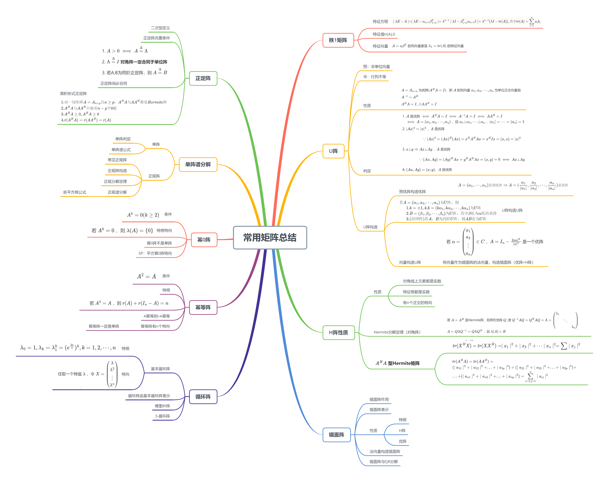

<!--more-->

## 8.1 秩1矩阵

$$
\begin{aligned}
A&=\left(
\begin{matrix}
a_1b_1\quad &a_1b_2\quad &\cdots\quad &a_1b_n\\
a_2b_1\quad &a_2b_2\quad &\cdots\quad &a_2b_n\\
\vdots\quad &\vdots\quad &\ddots\quad &\vdots\\
a_nb_1\quad &a_nb_2\quad &\cdots\quad &a_nb_n
\end{matrix}
\right)_{n\times n}=\left(
\begin{matrix}
a_1\\a_2\\\vdots \\a_n
\end{matrix}
\right)\left(
b_1\quad b_2\quad \cdots \quad b_n
\right)\overset{\Delta}{=}\alpha \beta^{T}\\\\
&其中 \alpha=\left(
\begin{matrix}
a_1\\a_2\\\vdots \\a_n
\end{matrix}
\right),\beta=\left(
\begin{matrix}
b_1\\b_2\\\vdots \\b_n
\end{matrix}
\right)
\end{aligned}
$$

### 8.1.1 秩1矩阵特征方程

$$
\begin{aligned}
&\mid \lambda I_n-A\mid = \mid \lambda I_n-\alpha_{n\times 1}\beta_{1\times n}^T\mid\xlongequal{换位公式:\vert\lambda_n-(AB)_n \vert=\lambda^{n-p}\vert \lambda I_p-(BA)_p\vert}\lambda^{n-1}\mid\lambda I_1-\beta_{1\times n}^T\alpha_{n\times 1}I_1\mid\\
&=\lambda^{n-1}(\lambda I-tr(A)),其中 tr(A)=\sum\limits_{i=1}\limits^{n}a_{ii}b_{ii}
\end{aligned}
$$

**eg** 

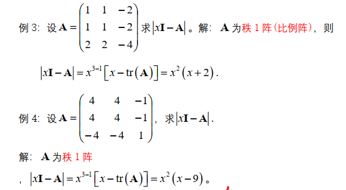

### 8.1.2 秩1矩阵的特征值

若 $A = A_{n\times n}$ ，$r(A)=1$ ，则全体特征值为 $\lambda(A)=\{tr(A),0,...,0\}$ ，其中 $tr(A)=a_1b_1+a_2b_2+...+a_nb_n=\beta^T\alpha$ 

**证明：**

由换位公式可知，$\alpha_{n\times 1}\beta_{1\times n}^T$ 与 $\beta_{1\times n}^T\alpha_{n\times 1}$ 相差 n-1 个零根，即有一个相等的非零特征根，而 $\beta_{1\times n}^T\alpha_{n\times 1}$ 为1阶矩阵，所以 $\lambda_1=\beta_{1\times n}^T\alpha_{n\times 1}=a_1b_1+a_2b_2+...+a_nb_n=tr(A)$

### 8.1.3 秩1矩阵特征向量

$A=\alpha \beta^T$ 的列向量都是 $\lambda_1=tr(A)$ 的特征向量

证明：
$$
\begin{aligned}
A\alpha = (\alpha \beta)\alpha=\lambda_1 \alpha
\end{aligned}
$$

#### eg

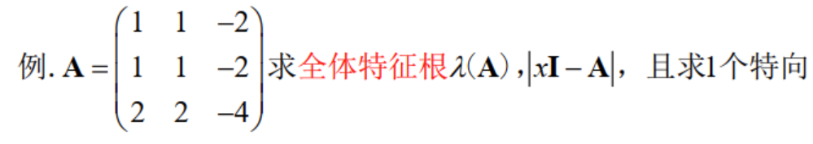
$$
\begin{aligned}
&A为秩1矩阵，\lambda(A)=\{tr(A),0,0\}=\{-2,0,0\}\\
&可知 \vert \lambda I-A\vert=x^2(x+2),其中\lambda_1=-2,可取\left(\begin{matrix}1\\1\\2\end{matrix}\right)为A的特向，A\left(\begin{matrix}1\\1\\2\end{matrix}\right)=-2\left(\begin{matrix}1\\1\\2\end{matrix}\right)
\end{aligned}
$$

---

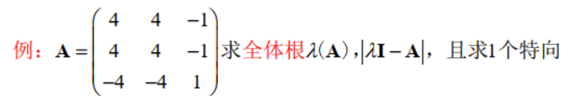
$$
\begin{aligned}
&A为秩1矩阵，全体特根\lambda(A)=\{tr(A),0,0\}=\{9,0,0\},可知 \vert \lambda I-A\vert=\lambda^2(\lambda-9)\\
&\lambda_1=9,可知A的列向量\left(\begin{matrix}1\\1\\-1\end{matrix}\right)为一个特向，A\left(\begin{matrix}1\\1\\-1\end{matrix}\right)=9\left(\begin{matrix}1\\1\\-1\end{matrix}\right)
\end{aligned}
$$

## 8.2 优阵(正交阵)

预：非单位列向量

半：$p$ 个 $n$ 维列向量 $(p<n)$

### 8.2.1 预-半优阵(预-半正交阵)

$\alpha_1,\alpha_2,\cdots,\alpha_p$ 是 $n$ 维列向量，且 $p\le n$ ，且 $\alpha_1\bot\alpha_2\bot \cdots\bot\alpha_p$ 
，则称 $A=(\alpha_1,\alpha_2,\cdots,\alpha_p)$ 为预半优阵

**判定** 

$A=(\alpha_1,\alpha_2,\cdots,\alpha_p)$ 是预半优阵 $\iff A^HA=\left(\begin{matrix}(\alpha_1,\alpha_1)&\cdots&0\\\vdots&\ddots&0\\0&\cdots&(\alpha_p,\alpha_p)\end{matrix}\right)$ 是对角阵，其中 $\alpha_1,\alpha_2,\cdots,\alpha_p$ 是 $n$ 维列向量

**区分**： $A^HA$ 是 $p \times p$ 阶满秩方阵，而 $AA^H$ 是 $n\times n$ 不满秩方阵

### 8.2.2 半优阵(半正交阵)

$A=(\alpha_1,\alpha_2,\cdots,\alpha_p)$ 是预半优阵，其中 $\alpha_i$ 是 $n$ 维列向量，若满足 $\vert \alpha_1 \vert=\vert \alpha_2 \vert=\cdots=\vert \alpha_p \vert = 1$ ，则A为半优阵

**判定**

$A=(\alpha_1,\cdots,\alpha_p)$ 是半优阵 $\iff \alpha_1\bot\cdots\bot\alpha_p$ ，且 $\vert \alpha_1 \vert=\cdots=\vert \alpha_p \vert=1$ $\iff A^HA=I_{p}$

**性质**

1. **保模长** A为半优阵，则 $\vert Ax \vert^2=\vert x \vert^2$

   $\vert Ax \vert^2=(Ax)^H(Ax)=x^HA^HAx=\vert X\vert^2$

2. **保正交** A为半优阵，$x\bot y$ ，则$Ax\bot Ay$

### 8.2.3 预优阵(预-单位正交阵)

$\alpha_1,\alpha_2,\cdots,\alpha_n$ 是 $n$ 维列向量，且 $\alpha_1\bot\alpha_2\bot\cdots\bot\alpha_n$ ，则 $A=(\alpha_1,\alpha_2,\cdots,\alpha_n)$ 是预优阵

**eg** 
$$
\begin{aligned}
&X_1=\left(
\begin{matrix}
1\\i\\i
\end{matrix}
\right),X_2=\left(
\begin{matrix}
2i\\1\\1
\end{matrix}
\right),X_3=\left(
\begin{matrix}
0\\1\\-1
\end{matrix}
\right)\\\\
&(X_1,X_2)=0,(X_2,X_3)=0,(X_1,X_3)=0,\\\\
&\therefore X_1\bot X_2\bot X_3,A=(X_1,X_2,X_3)是预-优阵
\end{aligned}
$$

**判定** 
$$
\begin{aligned}
A&=(\alpha_1,\alpha_2,\cdots,\alpha_n)\\
&\iff A^HA=\left(
\begin{matrix}
(\alpha_1,\alpha_1)&\cdots&0\\
\vdots&\ddots&0\\
0&\cdots&(\alpha_n,\alpha_n)
\end{matrix}
\right)是对角阵\\
&其中，\alpha_1,\alpha_2,\cdots,\alpha_p是n维列向量
\end{aligned}
$$

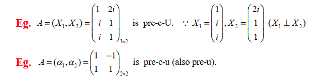

### 8.2.4 优阵(正交阵)

$\alpha_1,\alpha_2,\cdots,\alpha_n$ 是 $n$ 维列向量，$\alpha_1\bot\alpha_2\bot\cdots\bot\alpha_n$ 且 $\vert \alpha_1 \vert=\cdots=\vert \alpha_n \vert=1$ ，则 $A$ 是一个优阵(正交阵)

#### a. 判定

$$
\begin{aligned}
A&=(\alpha_1,\cdots,\alpha_n)\\
&\iff A^HA=\left(
\begin{matrix}
1&0&\cdots&0\\
0&1&\cdots&0\\
\vdots&\vdots&\ddots&\vdots\\
0&0&\cdots&1
\end{matrix}
\right)=I是单位阵
\end{aligned}
$$

- $A=A_{n\times n}$ 为优阵($A^HA=I$)，即 $A$ 的列向量 $\alpha_1,\alpha_2,\cdots,\alpha_n$ 为单位正交向量组
- $A^{-1}=A^H$
- $A^HA=I,且AA^H=I$ 

1. $A$ 是优阵 $\iff A^HA=I\iff A^{-1}A=I\iff AA^H=I$ $\iff A=(\alpha_1,\alpha_2,\cdots,\alpha_n)$ ，且 $\alpha_1\bot\alpha_2,\cdots\bot\alpha_n$ ，$\vert \alpha_1\vert=\cdots=\vert\alpha_n\vert=1$ 

2. $\vert Ax\vert^2=\vert x \vert^2$ ，$A$ 是优阵
   $$
   \because \vert Ax\vert^2 = (Ax)^H(Ax)=x^HA^HAx=x^HIx=(x,x)=\vert x \vert^2
   $$

3. $x\bot y \Rightarrow Ax\bot Ay$ ，$A$ 是优阵
   $$
   \because (Ax,Ay)=(Ay)^HAx=y^HA^HAx=(x,y)=0\iff Ax\bot Ay
   $$

4. $(Ax,Ay)=(x,y)$，$A$ 是优阵

#### b. 优阵构造

**预优阵到优阵**

$A=(\alpha_1,\cdots,\alpha_n)$ 是预优阵 $\Rightarrow A=(\frac{\alpha_1}{\vert \alpha_1\vert},\frac{\alpha_2}{\vert \alpha_2\vert},\cdots,\frac{\alpha_n}{\vert \alpha_n \vert})$ 是优阵

**优阵到优阵**

若 $A=(\alpha_1,\alpha_2,\cdots,\alpha_n)$ 为优阵，则

1. $k=\pm1,kA=(k\alpha_1,k\alpha_2,\cdots,k\alpha_n)$ 为优阵
2. $B=(\beta_1,\beta_2,\cdots,\beta_n)$ 为优阵，其中 $\beta$ 组为 $\alpha$ 组的重排
3. (封闭性)若 $A$、$B$ 为同阶优阵，则 $AB$ 也为优阵

**向量构造优阵** 

> 将向量作为镜面阵的法向量，构造镜面阵（优阵+H阵）

若 $\alpha=\left(\begin{matrix}a_1\\a_2\\\vdots \\ a_n\end{matrix}\right)\in C$ ，$A=I_n-\frac{2\alpha\alpha^H}{\vert \alpha \vert^2}$ 是一个优阵

1. $A^H=A$ 且 $A^2=I(A^{-1}=A)$ 

2. $A$ 为优阵 $(A^HA=I)$
   $$
   \begin{aligned}
   1.A^2&=(I_n-\frac{2\alpha\alpha^H}{\vert \alpha \vert^2})(I_n-\frac{2\alpha\alpha^H}{\vert \alpha \vert^2})\\
   &=I_n^2-\frac{4\alpha\alpha^H}{\vert \alpha \vert^2}+\frac{4(\alpha\alpha^H)(\alpha\alpha^H)}{\vert \alpha\vert^4}=I_n-\frac{4\alpha\alpha^H}{\vert \alpha \vert^2}+\frac{4\alpha(\alpha^H\alpha)\alpha^H}{\vert \alpha\vert^4} \\
   &=I_n-\frac{4\alpha\alpha^H}{\vert \alpha \vert^2}+\frac{4\alpha(\vert \alpha\vert^2)\alpha^H}{\vert \alpha\vert^4}=I_n-\frac{4\alpha\alpha^H}{\vert \alpha \vert^2}+\frac{4\alpha\alpha^H}{\vert \alpha \vert^2}=I_n\\
   2.A^HA&=(I_n-\frac{2\alpha\alpha^H}{\vert \alpha \vert^2})^H(I_n-\frac{2\alpha\alpha^H}{\vert \alpha \vert^2})\\
   &=(I_n-\frac{2\alpha\alpha^H}{\vert \alpha \vert^2})(I_n-\frac{2\alpha\alpha^H}{\vert \alpha \vert^2})=A^2=I\\
   &\therefore A是U阵
   \end{aligned}
   $$

**eg** ：
$$
\begin{aligned}
\alpha=\left(
\begin{matrix}
1\\1\\1
\end{matrix}
\right),其U阵为 I_3-\frac{2\alpha\alpha^H}{\vert \alpha\vert^2}&=\left(
\begin{matrix}
1&0&0\\0&1&0\\0&0&1\\
\end{matrix}
\right)-\frac{2}{3}\left(
\begin{matrix}
1&1&1\\1&1&1\\1&1&1\\
\end{matrix}
\right)\\
&=\left(
\begin{matrix}
\frac{1}{3}&-\frac{2}{3}&-\frac{2}{3}\\
-\frac{2}{3}&\frac{1}{3}&-\frac{2}{3}\\
-\frac{2}{3}&-\frac{2}{3}&\frac{1}{3}\\
\end{matrix}
\right)
\end{aligned}
$$

## 8.3 Hermite阵

> 定义：$A^H=A$ ，则矩阵为 $A$ 

### 8.3.1 性质

#### a. 对角线上元素都是实数

**证明：**

$A=\left(\begin{matrix}a_{11}&\quad&\quad &*\\\quad&a_{22}&\quad&\quad \\\quad &\quad&\ddots&\quad\\*&\quad&\quad&a_{nn}\end{matrix}\right)$ ，而 $A^H=\left(\begin{matrix}\overline{a_{11}}&\quad&\quad &*\\\quad&\overline{a_{22}}&\quad&\quad \\\quad &\quad&\ddots&\quad\\*&\quad&\quad&\overline{a_{nn}}\end{matrix}\right)$ ，由Hermite性质，$A^H=A$ ，则 $a_{11}=\overline{a_{11}},a_{22}=\overline{a_{22}},...,a_{nn}=\overline{a_{nn}}$ ，可见 Hermite阵对角线元素为实数

#### b. 特根

若 $A^H=A$ 是Hermite矩阵，则特征根都是实数，$\{\lambda_1,\cdots,\lambda_n\}\in R$ 
$$
\begin{aligned}
&由特商公式\lambda=\frac{X^HAX}{\vert X \vert^2}，其中X\neq 0，为\lambda的特征向量\\
&其中\vert X \vert\ge 0 ，为实数.\\
&\therefore 若证\lambda 为实数，即证 X^HAX为实数\\
&已知X^HAX为一维数字，则只需证明(X^HAX)^H=X^HAX即可,\\
&已知A=A^H为Hermite矩阵，(X^HAX)^H=X^HA^HX=X^HAX\in R
\end{aligned}
$$

#### c. 特向

若 $A=A^H\in C^{n\times n}$ ，则 $A$ 有 $n$ 个互相正交的特征向量，即 $X_1\bot X_2\bot...\bot X_n$ 
$$
\begin{aligned}
&若A为Hermite阵，则\exists U阵Q，使Q^{-1}AQ=Q^HAQ=\Lambda=\left(
\begin{matrix}
\lambda_1&&\\
&\ddots&\\
&&\lambda_n
\end{matrix}
\right)\\
&令Q=(X_1,X_2,\cdots,X_n)，且X_1\bot X_2\bot...\bot X_n,\\
&AQ=Q\Lambda\iff \left(
\begin{matrix}
AX_1&&\\
&AX_2&&\\
&&\ddots&\\
&&&AX_n
\end{matrix}
\right)=\left(
\begin{matrix}
\lambda_1X_1&&&\\
&\lambda_2X_2&&\\
&&\ddots&\\
&&&\lambda_nX_n
\end{matrix}
\right)\\
&即X_i为矩阵A的\lambda_i的特征向量
\end{aligned}
$$
**推论**

若 $A$ 为Hermite阵 $A^H=A$ ,且 $\lambda_1 \neq \lambda_2$ ，则相应的特征向量正交

**证明：** 
$$
\begin{aligned}
&由\lambda_1 \neq \lambda_2,且AX_1=\lambda_1 X_1,AX_2=\lambda_2X_2,有\\
&\lambda_1(X_1,X_2)=(\lambda_1X_1,X_2)=(AX_1,X_2)=X_2^HAX_1\\
&\lambda_2(X_1,X_2)=(X_1,\overline{\lambda_2}X_2)\xlongequal{H阵特征值\in R}(X_1,\lambda_2X_2)=(X_1,AX_2)=(AX_2)^HX_1=\\
&\quad\quad =X_2^HAX_1=\lambda_1(X_1,X_2)\\
&\therefore (\lambda_1-\lambda_2)(X_1,X_2)=0,而\lambda_1\neq \lambda_2，则(X_1,X_2)=0
\end{aligned}
$$

### 8.3.2 Hermite分解定理（对角阵）

若 $A=A^H$ 是Hermite阵，则存在优阵 $Q$ ,使 $Q^{-1}AQ=Q^HAQ=\Lambda=\left(\begin{matrix}\lambda_1&\quad&\quad\\\quad&\ddots&\quad\\\quad&\quad&\lambda_n\end{matrix}\right)$ $A=Q\Lambda Q^{-1} = Q\Lambda Q^H$ ，且 $\lambda(A)\in R$ 
$$
\begin{aligned}
&由许尔公式\Rightarrow 有U阵Q使Q^{-1}AQ=Q^HAQ=B\\
&=\left(
\begin{matrix}
\lambda_1&*&\cdots&*\\
0&\lambda_2&\cdots&*\\
\vdots&\vdots &\ddots&\vdots\\
0&0 &\cdots&\lambda_n\\
\end{matrix}
\right)\\
&由A是Hermite矩阵，则A^H=A,(Q^HAQ)^H=Q^HA^HQ=Q^HAQ\\
&=\left(
\begin{matrix}
\overline{\lambda_1}&0&\cdots&0\\
*&\overline{\lambda_2}&\cdots&0\\
\vdots&\vdots &\ddots&\vdots\\
*&* &\cdots&\overline{\lambda_n}\\
\end{matrix}
\right)\\
&由此可见，B为对角阵，且 \lambda_i 为实数
\end{aligned}
$$

### 8.3.3 $A^HA$ 型的 $Hermite$ 矩阵

任一矩阵 $A_{n\times p}$ ，$A^HA$ 与 $AA^H$ 都是 $Hermite$ 矩阵
$$
\begin{aligned}
&(A^HA)^H=A^HA,(AA^H)^H=A
\end{aligned}
$$

#### a. 向量 $XX^H$ 的迹

$$
\begin{aligned}
&X=\left(
\begin{matrix}
x_1\\
x_2\\\vdots \\x_n
\end{matrix}
\right),X^H=(\overline{x_1},\overline{x_2},\cdots,\overline{x_n})\\
&tr(XX^H)=tr(X^HX)=\mid x_1 \mid^2+\mid x_2 \mid^2+\cdots\mid x_n \mid^2=\sum \mid x_j \mid^2
\end{aligned}
$$

- $tr(XY^H)=tr(Y^HX)=x_1\overline{y_1}+\cdots+x_n\overline{y_n}  =\sum\limits_{i=1}\limits^{n}x_i\overline{y_i}$ ，$X$ 为列向量

  

#### b. 矩阵 $A^HA$ 的迹

$A_{n\times p}=\left(\begin{matrix}a_{11}&\cdots&a_{1p}\\\vdots&\ddots&\vdots\\a_{n1}&\cdots&a_{np}\end{matrix}\right)\in C^{n\times p}$ ，$A^H_{p\times n}=\left(\begin{matrix}\overline{a_{11}}&\cdots&\overline{a_{n1}}\\\vdots&\ddots&\vdots\\\overline{a_{1p}}&\cdots&\overline{a_{np}}\end{matrix}\right)\in C^{p\times n}$
$$
\begin{aligned}
&AA^H=\left(
\begin{matrix}
a_{11}&\cdots&a_{1p}\\
\vdots&\ddots&\vdots\\
a_{n1}&\cdots&a_{np}
\end{matrix}
\right)\left(
\begin{matrix}
\overline{a_{11}}&\cdots&\overline{a_{n1}}\\
\vdots&\ddots&\vdots\\
\overline{a_{1p}}&\cdots&\overline{a_{np}}
\end{matrix}
\right)\\
&=\left(
\begin{matrix}
a_{11}\overline{a_{11}}+a_{12}\overline{a_{12}}+\cdots+a_{1p}\overline{a_{1p}}&\quad &\quad&\ast\\
\quad&a_{21}\overline{a_{21}}+a_{22}\overline{a_{22}}+\cdots+a_{2p}\overline{a_{2p}}&\quad&\quad\\
\quad &\quad &\ddots&\quad\\
\ast &\quad&\quad&a_{n1}\overline{a_{n1}}+a_{n2}\overline{a_{n2}}+\cdots+a_{np}\overline{a_{np}}
\end{matrix}
\right)
\end{aligned}
$$

$$
\begin{aligned}
&tr(A^HA)=tr(AA^H)=\\
&(\mid a_{11} \mid^2+\mid a_{12} \mid^2+...+\mid a_{1p} \mid^2)+(\mid a_{21} \mid^2+\mid a_{22} \mid^2+...+\mid a_{2p} \mid^2)+\\
&...+(\mid a_{n1} \mid^2+\mid a_{n2} \mid^2+...+\mid a_{np} \mid^2)
=\sum\limits_{i=1,j=1}\limits^{n}\mid a_{ij} \mid^2
\end{aligned}
$$

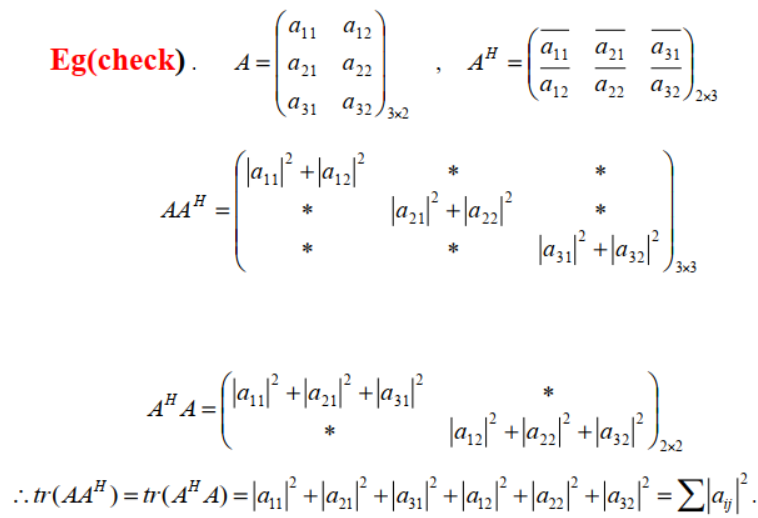

**推论** 

$tr(AB^H)=tr(B^HA)=\sum a_{ij}\overline{b_{ij}}$

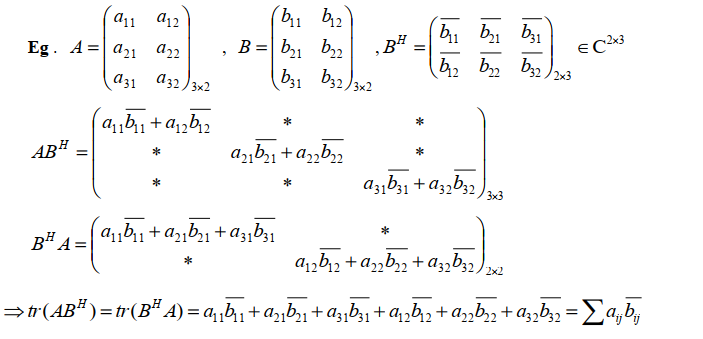

- 将 A、B 矩阵按列分块，可验证 $tr(B^HA)$
  $$
  \begin{aligned}
  &A=(\alpha_1,\alpha_2),B=(\beta_1,\beta_2),B^H=\left(
  \begin{matrix}
  \overline{\beta_1}^T\\
  \overline{\beta_2}^T\\
  \end{matrix}
  \right)\\
  &B^HA=\left(
  \begin{matrix}
  \overline{\beta_1}^T\\
  \overline{\beta_2}^T\\
  \end{matrix}
  \right)(\alpha_1,\alpha_2)=\left(
  \begin{matrix}
  &\overline{\beta_1}^T\alpha_1\quad &\overline{\beta_1}^T\alpha_2\\
  &\overline{\beta_2}^T\alpha_1\quad &\overline{\beta_2}^T\alpha_2
  \end{matrix}
  \right)\\
  &tr(B^HA)=\overline{\beta_1}^T\alpha_1+\overline{\beta_2}^T\alpha_2=\\
  &\quad (a_{11}\overline{b_{11}}+a_{21}\overline{b_{21}}+a_{31}\overline{b_{31}})+
  (a_{12}\overline{b_{12}}+a_{22}\overline{b_{22}}+a_{32}\overline{b_{32}})\\
  &=\sum a_{ij}\overline{b_{ij}}
  \end{aligned}
  $$

- 将 A、B 矩阵按行分块，可验证 $tr(AB^H)$
  $$
  \begin{aligned}
  &A=\left(
  \begin{matrix}
  \alpha_1\\
  \alpha_2\\
  \alpha_3
  \end{matrix}
  \right),
  B=\left(
  \begin{matrix}
  \beta_1\\
  \beta_2\\
  \beta_3
  \end{matrix}
  \right)，B^H=(\overline{\beta_1}^T,\overline{\beta_2}^T,\overline{\beta_3}^T)\\
  &AB^H=\left(
  \begin{matrix}
  \alpha_1\\
  \alpha_2\\
  \alpha_3
  \end{matrix}
  \right)(\overline{\beta_1}^T,\overline{\beta_2}^T,\overline{\beta_3}^T)=\left(
  \begin{matrix}
  \alpha_1\overline{\beta_1}^T\quad&\alpha_1\overline{\beta_2}^T\quad&\alpha_1\overline{\beta_3}^T\\
  \alpha_2\overline{\beta_1}^T\quad&\alpha_2\overline{\beta_2}^T\quad&\alpha_3\overline{\beta_3}^T\\
  \alpha_3\overline{\beta_1}^T\quad&\alpha_3\overline{\beta_2}^T\quad&\alpha_3\overline{\beta_3}^T
  \end{matrix}
  \right)\\
  &tr(AB^H)=(a_{11}\overline{b_{11}}+a_{12}\overline{b_{12}})+(a_{21}\overline{b_{21}}+a_{22}\overline{b_{22}})+(a_{31}\overline{b_{31}}+a_{32}\overline{b_{32}})\\
  &\quad\quad\quad\quad = \sum a_{ij}\overline{b_{ij}}
  \end{aligned}
  $$

## 8.4 镜面阵

法向量确定一个镜面

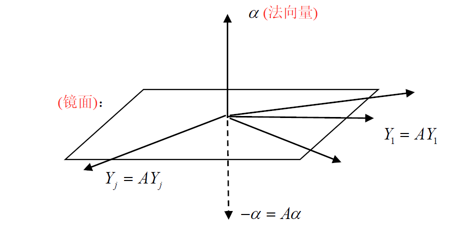

### 8.4.1 镜面阵的作用

对法向量

- $A\alpha=-\alpha$ 
- $A(A\alpha)=A^2\alpha=\alpha$ 

对镜面上向量

- $AY=Y$

### 8.4.2 镜面阵表示

$$
A=I_n-\frac{2\alpha\alpha^H}{\vert \alpha\vert^2},其中 \alpha=\left(\begin{matrix}x_1\\x_2\\\vdots\\x_n\end{matrix}\right)\in C^n,且\alpha\neq 0
$$

> 令 $\epsilon=\frac{\alpha}{\vert \alpha\vert}$ ，镜面阵 $A=I-2\epsilon\epsilon^H$ ，满足 $\epsilon^H\epsilon=\vert\epsilon\vert^2=1$

验证：
$$
\begin{aligned}
&对于法向量\alpha，A\alpha=(I_n-\frac{2\alpha\alpha^H}{\vert \alpha\vert^2})\alpha=\alpha-\frac{2\alpha\alpha^H\alpha}{\vert \alpha\vert^2}=\alpha-\frac{2\alpha\vert \alpha\vert^2}{\vert \alpha\vert^2}=-\alpha\\
&对于Y\in 镜面，有\alpha\bot Y,即内积(\alpha,Y)=(Y,\alpha)=0,且(Y,\alpha)=\alpha^HY=0\\
&\quad AY=(I_n-\frac{2\alpha\alpha^H}{\vert \alpha\vert^2})Y=Y-\frac{2\alpha\alpha^HY}{\vert \alpha\vert^2}=Y
\end{aligned}
$$

### 8.4.3 性质

#### a. 特根

镜面阵至少有两个特征向量 $\alpha$ 与 $Y$ 

- $A\alpha=-\alpha$ ，特根为 $-1$
- $AY=Y$ ，特根为 $1$

代数方法求特根
$$
\begin{aligned}
&平移法：\\
&A-I=-2\frac{\alpha\alpha^H}{\vert \alpha\vert^2}为秩1矩阵,\\
&特根\lambda(A-I)=\{\frac{-2}{\vert \alpha\vert^2}tr(\alpha\alpha^H),\underbrace{0,\cdots,0}_{n-1}\}=\xlongequal{tr(XX^H)=X^HX=\vert X\vert^2}\{-2,0,\cdots,0\}\\
&\Rightarrow \lambda(A)=\lambda\left(-2\frac{\alpha\alpha^H}{\vert \alpha\vert^2}\right)+1=\{-1,\underbrace{1,\cdots,1}_{n-1}\}
\end{aligned}
$$
特征多项式 $\vert \lambda I-A\vert=(\lambda+1)(\lambda-1)^{n-1}$

#### b. 特向

镜面上有 $n-1$ 个独立的(线性无关)向量，$Y_1,Y_2,\cdots,Y_{n-1}$ $(AY_1=Y_1,AY_2=Y_2,\cdots,AY_{n-1}=Y_{n-1})$ 都是 $1$ 的特向

- $Y_1,Y_2,\cdots,Y_{n-1}$ 为 $\alpha^HX=0$ 的 $n-1$ 个线性无关的解

  证明：
  $$
  \begin{aligned}
  &A-I=\frac{-2}{\vert \alpha\vert^2}\alpha\alpha^H 为秩1矩阵，故\alpha为A-I的特向，r(\alpha^H)=1,\alpha^HX=0\\
  &且n-r(\alpha^H)=n-1,故 \alpha^HX=0有n-1个线性无关解Y_1,\cdots,Y_{n-1}\\
  &(A-I)X=(\frac{-2}{\vert \alpha\vert^2}\alpha\alpha^H)X=(\frac{-2}{\vert \alpha\vert^2}\alpha)\alpha^HX=0\Rightarrow Y_1,\cdots,Y_{n-1}为(A-I)特根为0的根\\
  &由平移矩阵性质，A-I与A有相同的特根，\alpha,Y_1,\cdots,Y_{n-1}为A的特征向量\\
  &(A-I)\alpha=-2\alpha\Rightarrow A\alpha=-\alpha\\
  &(A-I)Y_1=0,\cdots,(A-I)Y_{n-1}=0\Rightarrow AY_1=Y_1,\cdots,AY_{n-1}=Y_{n-1}
  \end{aligned}
  $$

- 镜面阵内 $n-1$ 个特征向量有不同选法，可取 $Y_1\bot Y_2\bot\cdots\bot Y_{n-1}$ (互正交)，故可对镜面阵有 $n$ 个正交特向 $\{X\bot Y_1\bot Y_2\bot \cdots \bot Y_{n-1}\}$ 

  正规阵，Hermite阵有 $n$ 个相互正交的向量

$A$ 的全体特根为 $\lambda(A)=\{-1,\underbrace{1,\cdots,1}_{n-1个1}\}$

####  c. 镜面阵为 $Hermite$ 阵

$A=I_n-\frac{2(\alpha\alpha^H)}{\vert \alpha\vert^2}$ Hermite阵的差

#### d. $A^2=I$ 

$A^2\alpha=A(A\alpha)=A(-\alpha)=-(A\alpha)=-(-\alpha)=\alpha$ 

即证明： **$A^2=I$** 

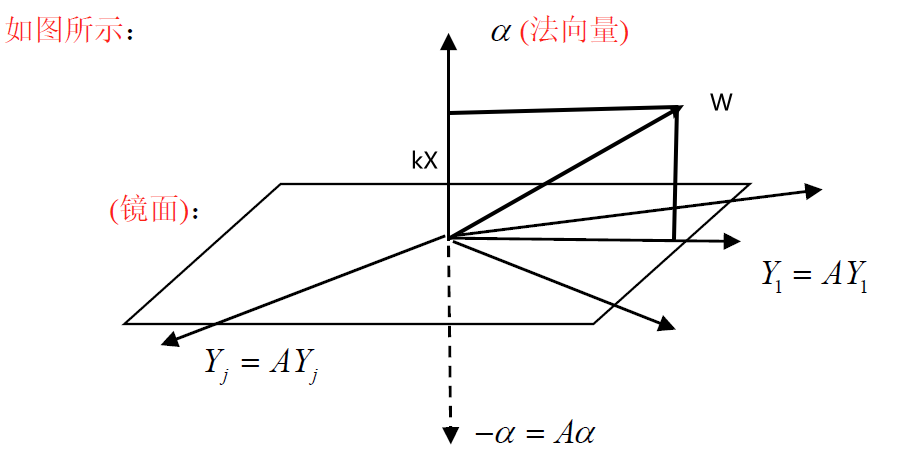
$$
\begin{aligned}
&任取C^n中向量W,可分解为 W=Y+k\alpha(直角分解)\\
&AW=A(Y+k\alpha)=AY+k(A\alpha)=Y+k(-\alpha)=Y-k\alpha=\widetilde{W}\\
&A^2W=A(AW)=A\widetilde{W}=A(Y-k\alpha)=AY-kA\alpha=Y+k\alpha=W\\
&\forall W\in C^n，有A^2W=W,故 A^2=I
\end{aligned}
$$

---

$$
\begin{aligned}
&A^2=\left(I-\frac{2\alpha\alpha^H}{\vert \alpha\vert^2}\right)^2=I^2-\frac{4\alpha\alpha^H}{\vert \alpha\vert^2}+\frac{4}{\vert \alpha\vert^4}\left(\alpha\alpha^H\right)^2\\
&其中 (\alpha\alpha^H)^2=(\alpha\alpha^H)(\alpha\alpha^H)=\alpha(\alpha^H\alpha)\alpha^H=\vert \alpha\vert^2\alpha\alpha^H\\
&\Rightarrow A^2=I^2-\frac{4\alpha\alpha^H}{\vert \alpha\vert^2}+\frac{4}{\vert \alpha\vert^4}\left(\alpha\alpha^H\right)^2=I^2-\frac{4\alpha\alpha^H}{\vert \alpha\vert^2}+\frac{4}{\vert \alpha\vert^4}\vert \alpha\vert^2\alpha\alpha^H=I
\end{aligned}
$$

#### d. $A^{-1}=A$ 

#### e. $A$ 为优阵

由于 $A^H=A$ ，且 $A^{-1}=A$ ，故 $A^HA=A^{-1}A=I$ ，$A$ 为优阵

特根 $\lambda(A)=\{-1,\underbrace{1,\cdots,1}_{n-1}\}$ ，特向 $\alpha\bot Y_1\bot\cdots\bot Y_{n-1}$ ，优阵 $Q=\left(\frac{\alpha}{\vert \alpha\vert},\frac{Y_1}{\vert Y_1\vert},\cdots,\frac{Y_{n-1}}{\vert Y_{n-1}\vert}\right)$ ，$Q^{-1}=Q^H$

$\Rightarrow Q^{-1}AQ=Q^HAQ=D=\left(\begin{matrix}-1&&&\\&1&&\\&&\ddots&\\&&&1\end{matrix}\right)$ 为对角阵

$D=\left(\begin{matrix}-1&&&\\&1&&\\&&\ddots&\\&&&1\end{matrix}\right)$ 为一个特殊镜面阵，法向量指向 $x$ 轴方向

### 8.4.3 向量构造镜面阵

设 $R^n$ 中2个 **实向量**，$\alpha=\left(\begin{matrix}a_1\\\vdots\\a_n\end{matrix}\right),\beta=\left(\begin{matrix}b_1\\\vdots\\b_n\end{matrix}\right)\in R^n$ ，且 $\left\{ \begin{aligned}&\vert\alpha\vert=\vert\beta\vert\\&\alpha\neq \beta\end{aligned}\right.$ ，则有镜面阵 $P=I-\frac{2(\alpha-\beta)(\alpha-\beta)^H}{\vert (\alpha-\beta)\vert^2}$ ，使得 $P\alpha=\beta,P\beta=\alpha$ 

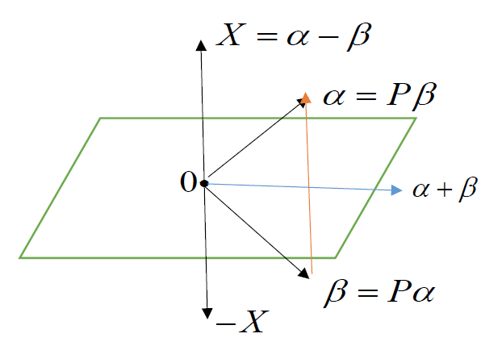

证明：
$$
\begin{aligned}
&令P=I-\frac{2(\alpha-\beta)(\alpha-\beta)^H}{\vert (\alpha-\beta)\vert^2}\\
&\Rightarrow PX=P(\alpha-\beta)=(\alpha-\beta)-2\frac{(\alpha-\beta)(\alpha-\beta)^H(\alpha-\beta)}{\vert (\alpha-\beta)\vert^2}=-(\alpha-\beta)=-X\\
&(\alpha+\beta,X)=(\alpha+\beta,\alpha-\beta)=(\alpha,\alpha)-(\alpha,\beta)+(\beta,\alpha)-(\beta,\beta)=\vert \alpha\vert^2-\vert \beta\vert^2=0\\
&\Rightarrow 法向量 (\alpha-\beta)\bot (\alpha+\beta),其中(\alpha+\beta)\in 镜面\\
&由于\left\{
\begin{aligned}
&P(\alpha-\beta)=-(\alpha-\beta)\\
&P(\alpha+\beta)=(\alpha+\beta)
\end{aligned}
\right.，两式相加得2P\alpha=2\beta\Rightarrow P\alpha=\beta,P^{-1}\beta=P\beta=\alpha
\end{aligned}
$$
**eg**

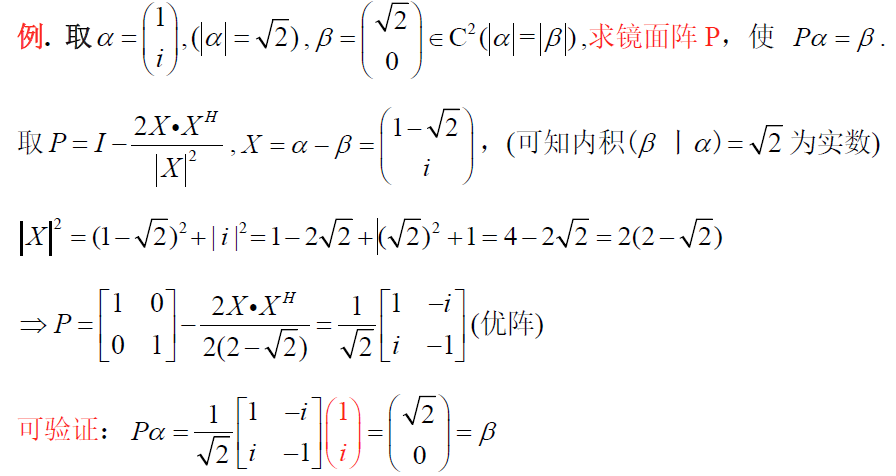

### 8.4.4 镜面阵与QR分解

$P_{i}$ 表示 $i$ 阶镜面阵 ，$A_{i}$ 表示 $i$ 阶方阵
$$
\begin{aligned}
P_nA_n&=P_n(\alpha_1,\alpha_2,\cdots,\alpha_n)\xlongequal{P_n\alpha_1=\left(\begin{matrix}\mu_1\\0\\\vdots\\0\end{matrix}\right)_n}\left(
\begin{matrix}
\mu_1&*\\
O&A_{n-1}
\end{matrix}
\right)\\\\
\left(
\begin{matrix}
1&0\\0&P_{n-1}
\end{matrix}
\right)P_nA_n&=\left(
\begin{matrix}
1&0\\0&P_{n-1}
\end{matrix}
\right)\left(
\begin{matrix}
\mu_1&*\\
0&A_{n-1}
\end{matrix}
\right)=
\left(
\begin{matrix}
\mu_1&*\\
0&P_{n-1}A_{n-1}
\end{matrix}
\right)=\left(
\begin{matrix}
\mu_1&*\\
0&P_{n-1}(\beta_1,\cdots,\beta_{n-1})_{n-1\times n-1 }
\end{matrix}
\right)\\
&\xlongequal{P_{n-1}\beta_1=\left(\begin{matrix}\mu_2\\0\\\vdots\\0\end{matrix}\right)_{n-1}}\left(
\begin{matrix}
\mu_1&*&*\\
0&\mu_2&*\\
0&0&A_{n-2}
\end{matrix}
\right)
\end{aligned}
$$

$$
\begin{aligned}
\left(
\begin{matrix}
1&0&0&\cdots&0\\
0&1&0&\cdots&0\\
0&0&1&\cdots&0\\
\vdots&\vdots&\vdots&\ddots&\vdots\\
0&0&0&\cdots&P_{2}
\end{matrix}
\right)\cdots\left(
\begin{matrix}
1&0\\
0&P_{n-1}
\end{matrix}
\right)P_nA&=\left(
\begin{matrix}
1&0&0&\cdots&0\\
0&1&0&\cdots&0\\
0&0&1&\cdots&0\\
\vdots&\vdots&\vdots&\ddots&\vdots\\
0&0&0&\cdots&P_{2}
\end{matrix}
\right)
\left(
\begin{matrix}
\mu_1&*&*&\cdots&*\\
0&\mu_2&*&\cdots&*\\
0&0&\mu_3&\cdots&*\\
\vdots&\vdots&\vdots&\ddots&*\\
0&0&0&\cdots&A_{2}
\end{matrix}
\right)=\left(
\begin{matrix}
\mu_1&*&*&\cdots&*\\
0&\mu_2&*&\cdots&*\\
0&0&\mu_3&\cdots&*\\
\vdots&\vdots&\vdots&\ddots&*\\
0&0&0&\cdots&P_{2}A_{2}
\end{matrix}
\right)\\
&=\left(
\begin{matrix}
\mu_1&*&*&\cdots&*\\
0&\mu_2&*&\cdots&*\\
0&0&\mu_3&\cdots&*\\
\vdots&\vdots&\vdots&\ddots&*\\
0&0&0&\cdots&P_{2}(\gamma_1,\gamma_2)_{2\times 2}
\end{matrix}
\right)
\xlongequal{P_2\gamma_1=\left(\begin{matrix}\mu_{n-1}\\0\end{matrix}\right)}\left(
\begin{matrix}
\mu_1&*&*&\cdots&*&*\\
0&\mu_2&*&\cdots&*&*\\
0&0&\mu_3&\cdots&*&*\\
\vdots&\vdots&\vdots&\ddots&\vdots&\vdots\\
0&0&0&\cdots&\mu_{n-1}&\vdots\\
0&0&0&\cdots&0&*
\end{matrix}
\right)=R\\
\end{aligned}
$$

故有镜面阵 $Q=P_n\left(\begin{matrix}1&0\\0&P_{n-1}\end{matrix}\right)\cdots\left(\begin{matrix}1&0&0&\cdots&0\\0&1&0&\cdots&0\\0&0&1&\cdots&0\\\vdots&\vdots&\vdots&\ddots&\vdots\\0&0&0&\cdots&P_{2}\end{matrix}\right)$ ，使 $QA=R$ ，由于镜面阵为优H阵 $Q^H=Q^{-1}=Q$ ，故有 $QR$ 分解 $A=QR$ 

#### 2阶例题

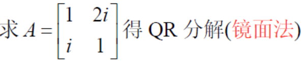
$$
\begin{aligned}
&令\alpha=\left(
\begin{matrix}
1\\i
\end{matrix}
\right),\vert\alpha\vert=\sqrt{2}，令 \beta=\left(
\begin{matrix}
\sqrt{2}\\0
\end{matrix}
\right),令镜面法向量X=\alpha-\beta=\left(
\begin{matrix}
1-\sqrt{2}\\i
\end{matrix}
\right)\\
&XX^H=\left(
\begin{matrix}
1-\sqrt{2}\\i
\end{matrix}
\right)\left(1-\sqrt{2}\quad -i\right)=\left(\begin{matrix}
(1-\sqrt{2})^2&-i(1-\sqrt{2})\\
i(1-\sqrt2)&1
\end{matrix}\right)=\left(
\begin{matrix}
3-\sqrt{2}&-i(1-\sqrt{2})\\
i(1-\sqrt{2})&1
\end{matrix}
\right)\\
&\vert X\vert^2=X^HX=\left(
\begin{matrix}
1-\sqrt{2}\quad -i
\end{matrix}
\right)\left(
\begin{matrix}
1-\sqrt{2}\\i
\end{matrix}
\right)=2(2-\sqrt{2})\\
&镜面阵Q=I_2-2\frac{XX^H}{\vert X\vert^2}=\left(
\begin{matrix}
1&0\\0&1
\end{matrix}
\right)-\frac{2}{2(2-\sqrt{2})}\left(
\begin{matrix}
3-2\sqrt{2}&-i(1-\sqrt{2})\\
i(1-\sqrt{2})&1
\end{matrix}
\right)=\frac{1}{\sqrt{2}}\left(
\begin{matrix}
1&-i\\i&-1
\end{matrix}
\right)\\
&使得 Q\left(
\begin{matrix}
1\\i
\end{matrix}
\right)=\left(
\begin{matrix}
\sqrt{2}\\0
\end{matrix}
\right)\Rightarrow QA=Q(\alpha_1,\alpha_2)=\left(Q\alpha_1,Q\alpha_2\right)=\left(
\begin{matrix}
\sqrt{2}&\frac{i}{\sqrt{2}}\\
0&-\frac{3}{\sqrt{2}}
\end{matrix}
\right)=R\\
&解出A的QR分解 A=QR,Q=\frac{1}{\sqrt{2}}\left(
\begin{matrix}
1&-i\\i&-1
\end{matrix}
\right)
\end{aligned}
$$

#### 3阶例题

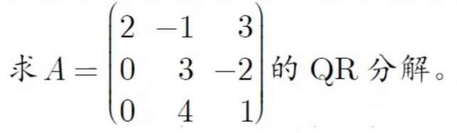
$$
\begin{aligned}
&令P_3=I,P_3\left(
\begin{matrix}
2\\0\\0
\end{matrix}
\right)=\left(
\begin{matrix}
2\\0\\0
\end{matrix}
\right),使得P_3A=\left(
\begin{matrix}
2&*\\
0&A_2
\end{matrix}
\right)\\
&令\alpha_2=\left(
\begin{matrix}
3\\4
\end{matrix}
\right),\beta_2=\left(
\begin{matrix}
\vert \alpha_2\vert\\0
\end{matrix}
\right)=\left(
\begin{matrix}
5\\0
\end{matrix}
\right),二维镜面法向量X_2=\alpha_2-\beta_2=\left(
\begin{matrix}
-2\\4
\end{matrix}
\right),\vert X_2\vert^2=20,XX^H=\left(
\begin{matrix}
5&-8\\-8&16
\end{matrix}
\right)\\
&\quad P_2=I_2-\frac{2}{\vert X_2\vert^2}XX^H=\left(
\begin{matrix}
\frac{3}{5}&\frac{4}{5}\\\frac{4}{5}&-\frac{3}{5}
\end{matrix}
\right),使得P_2A_2=\left(
\begin{matrix}
5&-\frac{2}{5}\\0&-\frac{11}{5}
\end{matrix}
\right)\\
&\Rightarrow\left(
\begin{matrix}
1&0\\0&P_2
\end{matrix}
\right)P_3A=\left(
\begin{matrix}
1&0&0\\
0&\frac{3}{5}&\frac{4}{5}\\
0&\frac{4}{5}&-\frac{3}{5}
\end{matrix}
\right)A=R=\left(
\begin{matrix}
2&-1&3\\
0&\frac{3}{5}&-\frac{2}{5}\\
0&0&-\frac{11}{5}
\end{matrix}
\right)\\
&故有Q=\left(
\begin{matrix}
1&0\\
0&P_2
\end{matrix}
\right)P_3=\left(
\begin{matrix}
1&0&0\\
0&\frac{3}{5}&\frac{4}{5}\\
0&\frac{4}{5}&-\frac{3}{5}
\end{matrix}
\right)，R=\left(
\begin{matrix}
2&-1&3\\
0&\frac{3}{5}&-\frac{2}{5}\\
0&0&-\frac{11}{5}
\end{matrix}
\right),使得A=QR
\end{aligned}
$$

## 8.5 正定阵

### 8.5.1 二次型

#### a. 二次型定义

令 $A$ 为 $Hermite$ 阵 $(A^H=A\in C^{n\times n})$， $X=\left(\begin{matrix}x_1\\x_2\\\vdots\\x_n\end{matrix}\right)$ ，称 $X^HAX=\left(\overline{x_1},\overline{x_2},\cdots,\overline{x_n}\right)A\left(\begin{matrix}x_1\\x_2\\\vdots\\x_n\end{matrix}\right)$  ，为矩阵 $A$ 产生的二次型，记为 $f(x)=X^HAX$ 

#### b. 正定二次型与正定阵定义

若 $A^H=A$ ,对一切 $X\neq 0$ ,有 $X^HAX>0$ ,则 $f(x)=X^HAX$ 为正定二次型，A为正定阵，记为 $A>0$
若 $A^H=A$ ,对一切  $X\neq 0$ ，有 $X^HAX\ge 0$ ,则 $f(x)=X^HAX$ 为半正定二次型，A为半正定阵，记为 $A\ge 0$

### 8.5.2 正定阵的定理

$A>0\iff$  $A$ 为Hermite阵，且 $\lambda_1,\lambda_2,\cdots,\lambda_n > 0$ 
$A\ge 0 \iff$  $A$ 为Hermite阵，且 $\lambda_1,\lambda_2,\cdots,\lambda_n \ge 0$ 

---

**证明** 

$\Rightarrow$ 

若 $A$ 为正定阵，则 $A$ 生成的二次型 $f(x)=X^HAX>0$ ，$\therefore \lambda_i=\frac{X^HAX}{\vert X\vert^2}>0$

$\Leftarrow$ 
$$
\begin{aligned}
&由Hermite分解定理，A为Hermite阵，则存在U阵Q，\\
&使得Q^HAQ=\Lambda=\left(
\begin{matrix}
\lambda_1&\quad&\quad\\
&\ddots&\quad\\
&\quad&\lambda_n\\
\end{matrix}
\right)\\
&\therefore A\overset{\Delta}{=}\Lambda,而\lambda_i>0，\Lambda 为正定阵，故A为正定阵
\end{aligned}
$$
**单位阵是正定阵** ：$\lambda_i= 1$ 显然大于0

### 8.5.3 正定阵间必合同

1. $A>0（正定阵） \iff A\overset{\Delta}{=}\Lambda$
2. $\Lambda\overset{\Delta}{=}I$ **对角阵一定合同于单位阵** 
3. 若A,B为同阶正定阵，则 $A\overset{\Delta}{=} B$ 

**证明1：**
$$
\begin{aligned}
&若A正定，则有A^H=A\\
&由Hermite分解定理，必\exists 优阵Q使得Q^HAQ=\Lambda,且\lambda_i>0\\
\end{aligned}
$$
**证明2：** 
$$
\begin{aligned}
若\Lambda&=\left(
\begin{matrix}
\lambda_1&\quad&\quad\\
&\ddots&\\
&&\lambda_n
\end{matrix}
\right),其中\lambda_i>0\\
&\Rightarrow f(x)=X^H\Lambda X=\lambda_1\vert x_1\vert^2+\lambda_2\vert x_2\vert^2+\cdots+\lambda_n\vert x_n\vert^2>0\\
&\Rightarrow 可分解为\Lambda=\left(
\begin{matrix}
\sqrt{\lambda_1}&\quad&\quad\\
\quad&\ddots&\quad\\
\quad&\quad&\sqrt{\lambda_n}\\
\end{matrix}
\right)I\left(
\begin{matrix}
\sqrt{\lambda_1}&&\\
&\ddots&\\
&&\sqrt{\lambda_n}\\
\end{matrix}
\right)\\
&\quad \quad\quad\quad\quad \quad \quad=PIP\\
&可知P可逆，且P^H=P,故P^HIP=\Lambda\\
&即对角正定阵合同于单位阵，记为\Lambda\overset{\Delta}{=}I
\end{aligned}
$$
**证明3：** 
$$
\begin{aligned}
&由A>0,B>0,则A\overset{\Delta}{=}I,B\overset{\Delta}{=}I\Rightarrow A\overset{\Delta}{=}B
\end{aligned}
$$

### 8.5.4 乘积形式的正定阵

1. 对一切矩阵 $A=A_{n\times p}$ 且 $n\ge p$ ，$A^HA$ 与 $AA^H$ 都是Hermite阵
2. $A^HA$ 与 $AA^H$ 只相差 $n-p$ 个0根
3. $A^HA\ge0$ ，$A^HA\ge 0$ 
4. $r(A^HA)=r(AA^H)=r(A)$ 

---

#### a. $A^HA$ 为Hermite阵

$$
\begin{aligned}
(A^HA)^H=A^HA，且(AA^H)^H=AA^H，则A^HA与AA^H为Hermite阵
\end{aligned}
$$

#### b. $A^HA与AA^H$ 相差n-p个0根

$$
\begin{aligned}
&A=A_{n\times p},B={p\times n},且n\ge p\\
&由换位公式 \vert \lambda I-AB\vert=\lambda^{n-p}\vert \lambda I-BA \vert,\\
&则 AB与BA必有相同的非零根，故A^HA与AA^H只相差n-p个零根
\end{aligned}
$$

#### c. $A^HA与AA^H$ 是半正定阵（不是方阵的正定阵）

$$
\begin{aligned}
&对任意非零向量X，有二次型f(x)=X^HA^HAX=(AX)^H(AX)=\vert AX \vert^2\ge 0,\\
&可知f(x)为半正定二次型，A^HA为半正定阵
\end{aligned}
$$

#### d. $r(AA^H)=r(A^HA)=r(A)$

$$
\begin{aligned}
&由A^HA为半正定阵，则A^HA与AA^H都只有非负根\\
&可写为\lambda(A^HA)=\{\lambda_1,\lambda_2,...\lambda_p\}\ge 0\\
&由换位公式，知\lambda{A^HA}与\lambda{AA^H}只相差n-p个零根\\
&\therefore \lambda(AA^H)=\{\lambda_1,\lambda_2,...,\lambda_p,0,0,...,0\}\ge 0\\
&r(A^HA)=r(AA^H)=p=r(A)=r(A^H)
\end{aligned}
$$

$$
\begin{aligned}
&齐次方程组AX=0,A^HAX=0，解集相同(同解)\\
&若(A^HA)X=0成立，则\vert AX \vert^2=(AX)^H(AX)=X^HA^HAX=(AX)^2=0\\
&\therefore AX=0,r(A^HA)=r(A)
\end{aligned}
$$

## 8.6 单阵

> 单阵 $A$（又叫单纯阵，可对角阵），即满足 $P^{-1}AP=D=\left(\begin{matrix}\lambda_1&&0\\&\ddots&\\0&&\lambda_n\end{matrix}\right)$ ， $P$ 可逆， $P$ 中列向量为 $A$ 的特征向量

### 8.6.1 单阵谱公式

> 若 $A$ 为单阵，全体不同特征根为 $\lambda_1,\lambda_2,\cdots,\lambda_k$ ，则有 $A=\lambda_1G_1+\cdots+\lambda_kG_k$ 为 $A$ 的谱分解

满足性质：

- 谱阵： $G_i=\frac{(A-\lambda_1)\cdots(A-\lambda_{i-1})(A-\lambda_{i+1})\cdots(A-\lambda_k)}{(\lambda_i-\lambda_1)\cdots(\lambda_i-\lambda_{i-1})(\lambda_i-\lambda_{i+1})\cdots(\lambda_i-\lambda_k)}$，谱阵 $G_1,\cdots,G_k$ 中各列都是A的特征向量
- 和为单位阵： $G_1+G_2+\cdots+G_k=I$ 
- 相互正交： $G_1G_2=0,\cdots,G_iG_j=0(i\neq j)$
- 幂等： $G_1^2=G_1,\cdots,G_k^2=G_k$ ，但 $G_1^H=G_1,\cdots,G_k^H=G_k$ 不一定成立

#### a. 单阵谱函数

$f(A)=f(\lambda_1)G_1+\cdots+f(\lambda_k)G_k$ 

**幂次**

$A^p=\lambda_1^pG_1+\cdots+\lambda_k^pG_p,p=0,1,...$ 
$$
A=\left(\begin{matrix}
3&1\\2&2
\end{matrix}\right),求A^{100}
$$

$$
\begin{aligned}
&由A是行和相等矩阵，所以行和4为特征值，\lambda(A)=\{4,tr(A)-4\}=\{4,1\}\\
&故二阶阵有2个不同特征值，所以必为单阵\\
&G_1=\frac{A-\lambda_2I}{\lambda_1-\lambda_2}=\frac{1}{3}\left(
\begin{matrix}
2&1\\2&1
\end{matrix}
\right),G_2=-\frac{1}{3}\left(
\begin{matrix}
1&-1\\-2&2
\end{matrix}
\right)\\
&可知A^{100}=4^{100}G_1+1^{100}G_2=\\
&本例中，特向\left(
\begin{matrix}
1\\1
\end{matrix}
\right),\left(
\begin{matrix}
1\\-2
\end{matrix}
\right)不正交，不是正规阵
\end{aligned}
$$

**单阵逆公式** 

$A^{-1}=\frac{1}{\lambda_1}G_1+\frac{1}{\lambda_2}G_2+\cdots+\frac{1}{\lambda_k}G_k$ ，其中 $A$ 为单阵

#### b. 单阵函数公式

若 $f_1(x),f_2(x),\cdots,f_k(x)$ 为 $x$ 的 $k-1$ 次多项式，且 $f_1(x)+f_2(x)+\cdots+f_k(x)=1$ ，则 $f_1(A)+f_2(A)+\cdots+f_k(A)=I$ ，$f_1(A),\cdots,f_k(A)$ 中非0列都是 $A$ 的特征向量

### 8.6.2 单阵判定

#### a. 充分条件

若存在可逆阵 $P$ ，使 $A$ 相似于对角阵，则 $A$ 为单阵
$$
P^{-1}AP=D=\left(\begin{matrix}\lambda_1&&\\&\ddots\\&&\lambda_k\end{matrix}\right)
$$

1. 单阵特例

   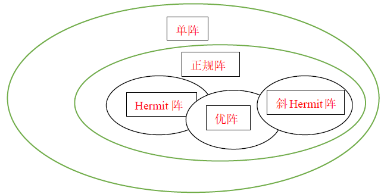

   $A$ 为正规阵，则 $A$ 必相似于对角阵

   证： $A$ 为正规阵，则存在U阵 $Q$ 使 $Q^HAQ= \Lambda$  ，使A阵U相似于对角阵，故正规阵一定是单阵

2. 设 $n$ 阶方阵 $A$ 恰有 $n$ 个不同根 $\lambda_1,\cdots,\lambda_n$ ，则 $A$ 为单阵（必相似于对角阵）
   $$
   \begin{aligned}
   证明：&\\
   &\lambda(A)=\{\lambda_1,\lambda_2,\cdots,\lambda_n\} ，则有AX_i=\lambda_i X_i ,令P=(X_1,X_2,\cdots,X_n),X_i为n维列向量\\
   &A(X_1,X_2,\cdots,X_n)=(\lambda_1X_1,\lambda_2X_2,\cdots,\lambda_nX_n)=(X_1,X_2,\cdots,X_n)\left(\begin{matrix}\lambda_1&&&\\&\lambda_2&&\\&&\ddots&\\&&&\lambda_n\end{matrix}\right)\\
   &\Rightarrow AP=PD\iff P^{-1}AP=D
   \end{aligned}
   $$

3. A有 $n$ 个无关的特征向量 $X_1,X_2,\cdots,X_n$ 

   令 $P=\left(X_1,X_2,\cdots,X_n\right) \Rightarrow P^{-1}AP=D$ 

4. 若每个 $k$ 重根 $\lambda$ ，恰有 $k$ 个特征向量，则 $A$ 为单阵

   - 方程 $(A-\lambda_1)X=0$ 有 $n-r(A-\lambda_1I)$ 个基本解 $\Rightarrow AX=\lambda_1X 有n-r(A-\lambda_1I)个基本解$ 

     常通过判断 $r(A-重根I)$ 判断A是否为单阵

     **$\Rightarrow r(A-\lambda_1I)=n-k$ ，$\lambda_1$ 有k个特征向量 ，则A可能是单阵**

     **$\Rightarrow r(A-\lambda_1I)\neq n-k$ ，则A必不是单阵**

   - **eg1** 
     $$
     A=\left(\begin{matrix}
     1&1&0\\0&2&0\\0&0&1
     \end{matrix}\right),\lambda(A)=\{2,1,1\} ，\lambda_1=1为2重根
     $$
     验证A是否为单阵：
     $$
     \begin{aligned}
     A-1I=\left(
     \begin{matrix}
     0&1&0\\0&1&0\\0&1&0
     \end{matrix}
     \right),r(A-I)=1=3-2\,\therefore A是单阵
     \end{aligned}
     $$

   - **eg2**
     $$
     A=\left(\begin{matrix}
     1&1&0\\0&1&0\\0&0&2
     \end{matrix}\right),\lambda(A)=\{2,1,1\} ，\lambda_1=1为2重根
     $$
     验证A是否为单阵：
     $$
     A-1I=\left(
     \begin{matrix}
     0&1&0\\0&0&0\\0&0&1
     \end{matrix}
     \right),r(A-I)=2 \neq 3-2=1,\therefore A不是单阵
     $$

5. 设 $\lambda_1,\lambda_2,\cdots,\lambda_k$ 为A的全体不同根

   > `Cayley定理：` 
   >
   > 若方阵 $A$ 的特征多项式 $T(x)=\vert A-x I\vert=c_0+c_1x+c_2x^2+\cdots+c_nx^n$ ，则 $T(A)=c_0I+c_1A+c_2A^2+\cdots+c_nA^n=0$ 
   >
   > - 方阵A的特征多项式可分解为 $T(x)=(x-\lambda_1)(x-\lambda_2)\cdots(x-\lambda_n)$ 满足 $T(A)=(A-\lambda_1I)(A-\lambda_2I)\cdots(A-\lambda_nI)=0$ 

   若 $(A-\lambda_1I)(A-\lambda_2I)\cdots(A-\lambda_kI)=0$ ，则 $A$ 为单阵( $A$ 相似于对角阵)
   若 $(A-\lambda_1I)(A-\lambda_2I)\cdots(A-\lambda_kI)\neq 0$ ，则 $A$ 不是单阵

   **eg**
   $$
   A=\left(\
   \begin{matrix}
   1&1&0\\0&2&0\\0&1&1
   \end{matrix}
   \right)是否为单阵，求A^{100}的谱公式
   $$

   $$
   \begin{aligned}
   &\vert A-\lambda I\vert=\left |  \begin{matrix} 1-\lambda &1&0\\ 0&2-\lambda &0\\0&1&1-\lambda\end{matrix}  \right |=(1-\lambda)^2(2-\lambda)=0,\therefore \lambda(A)=\{1,1,2\}\\
   &令\lambda_1=1,\lambda_2=2,(A-I)(A-2I)=\left(
   \begin{matrix}
   0&1&0\\0&1&0\\0&1&0
   \end{matrix}
   \right)\left(
   \begin{matrix}
   -1&1&0\\0&0&0\\0&1&-1
   \end{matrix}
   \right)=0\\
   &\therefore A为单阵\\
   &令G_1=\frac{A-\lambda_2}{\lambda_1-\lambda_2}=\left(
   \begin{matrix}
   1&-1&0\\0&0&0\\0&-1&1
   \end{matrix}
   \right),G_2=I-G_1=\left(
   \begin{matrix}
   0&1&0\\0&1&0\\0&1&0
   \end{matrix}
   \right)\\
   &得谱公式：A=1G_1+2G_2,且f(A)=f(1)G_1+f(2)G_2\\
   &A^{100}=G_1+2^{100}G_2
   \end{aligned}
   $$

   ---

   上述判定方法也适用于分块阵
   $$
   \begin{aligned}
   A=\left(
   \begin{matrix}
   2&1&0\\1&2&0\\0&0&2
   \end{matrix}
   \right)=\left(
   \begin{matrix}
   A_1&0\\0&A_2
   \end{matrix}
   \right),求A^{100}
   \end{aligned}
   $$

   $$
   \begin{aligned}
   &由A_1阵为行和阵，特征值\lambda(A_1)=\{3,tr(A_1)-3\}=\{3,1\}\\
   &(A_1-3I)(A_1-2I)=\left(
   \begin{matrix}
   -1&1\\1&-1
   \end{matrix}
   \right)\left(
   \begin{matrix}
   1&1\\1&1
   \end{matrix}
   \right)=0,\quad \therefore A_1为单阵\\
   &故有谱分解 A_1=3G_1+G_2=3\frac{A_1-\lambda_2}{\lambda_1-\lambda_2I}+\frac{A-\lambda_2I}{\lambda_2-\lambda_1}=3*\frac{1}{2}\left(\begin{matrix}1&1\\1&1\end{matrix}\right)+\frac{1}{2}\left(
   \begin{matrix}
   1&-1\\-1&1
   \end{matrix}
   \right)\\
   &A_1^{100}=3^{100}G_1+1G_2=\frac{3^{100}}{2}\left(
   \begin{matrix}
   1&1\\1&1
   \end{matrix}
   \right)+\frac{1}{2}\left(
   \begin{matrix}
   1&-1\\-1&1
   \end{matrix}
   \right)\\
   &A_2^{100}=(2^{100})\\
   &\therefore A^{100}=\left(
   \begin{matrix}
   A_1^{100}&\\
   &A_2^{100}
   \end{matrix}
   \right)=\left(
   \begin{matrix}
   \frac{3^{100}+1}{2}&\frac{3^{100}-1}{2}&0\\
   \frac{3^{100}-1}{2}&\frac{3^{100}+1}{2}&0\\
   0&0&2^{100}
   \end{matrix}
   \right)
   \end{aligned}
   $$

#### b. 单阵充要条件：0化式判别法(了解，判断用重根矩阵秩)

$$
A为单阵\iff 极小式m(x)无重根；若m(x)有重根，则A不是单阵
$$

**0化式与极小式定义**

若多项式 $f(x)$ 使 $f(A)=0$ ，则称 $f(x)$ 为 $A$ 的0化式

**极小式为次数最少的0化式** ： 若 $\lambda_1,\cdots,\lambda_k$ 为不同根，且 $(A-\lambda_1I)(A-\lambda_2I)\cdots(A-\lambda_kI)=0$ ，则 $A$ 必为单阵，此时称 $m(x)=(x-\lambda_1)(x-\lambda_2)\cdots(x-\lambda_k)$ 为 $A$ 的极小式

- eg1：
  $$
  \begin{aligned}
  &A=I=\left(\begin{matrix}1&0\\0&1\end{matrix}\right),满足A^2=I，可知f(x)=x^2-1=0,且f(A)=A^2-I=0\\
  &f(x)=x^2-1=(x-1)(x+1)为A的0化式\\
  &\because A-I=0,\therefore x-1也是A的0化式，且m(x)=x-1为极小式
  \end{aligned}
  $$

- eg2:
  $$
  \begin{aligned}
  &A=\left(
  \begin{matrix}
  -1&0\\0&1
  \end{matrix}
  \right)，A^2=I,即A^2-I=0,\\
  &f(x)=x^2-1=(x-1)(x+1)为A的0化式，但由于A-I\neq 0且A+I \neq 0\\
  &故A的极小式m(x)=x^2-1
  \end{aligned}
  $$

 **极小式求法** 

1. 对于 $\vert xI-A \vert=(x-a)^2(x-b)=0$ 

   - 若 $(A-aI)(A-bI)=0$ ，则极小式为 $m(x)=(x-a)(x-b)$

   - 若 $(A-aI)(A-bI)\neq 0$ ，则极小式为 $m(x)=(x-a)^2(x-b)$

2. 对于 $\vert xI-A \vert=(x-a)(x-b)(x-c)$ ，则极小式为 $m(x)=(x-a)(x-b)(x-c)$

**若f(x)=0无重根，且f(A)=0,则A必为单阵**

定理：

- 若 $f(A)=0$ ，则 $f(A)g(A)=0$ ,可知 $f(x)g(x)$ 也是0化式

- 特征多项式 $f(x) = \vert xI-A \vert=a_0+a_1x+a_2x^2+\cdots+a_nx^n$ 一定是0化式，即 $f(A)=a_0+a_1A+\cdots+a_nA^n=0$

- 极小式为特征多项式的因式，可表示为 $\vert xI-A \vert=m(x)g(x)$ 

- 极小式必为每个0化式 $f_i(x)$ 的因子，即若 $f_i(A)=0$ ，则 $f_i(x)=m(x)g_i(x)$

**应用** 

1. 列出特征方程，求出极小式，即证明A是单阵
2. 根据极小式，写出单阵谱分解
3. 计算f(A)

$$
A=\left(
\begin{matrix}
2&2&1\\1&3&1\\1&2&2
\end{matrix}
\right)，求A的谱分解p
$$

$$
\begin{aligned}
&\begin{matrix}
\vert A-\lambda I\vert=(x-5)(x-1)^2,且(A-5I)(A-I)=0\Rightarrow A为单阵
\end{matrix}\\
&\Rightarrow 单阵A有谱分解A=5G_1+G_2=
\end{aligned}
$$

---

$$
A=\left(
\begin{matrix}
1&1&0\\0&2&0\\0&0&3
\end{matrix}
\right),求谱分解\\
A为上三角阵，所以A有三个互异特征根1,2,3，极小式为 (x-1)(x-2)(x-2)=0\\
故A由谱分解A=G_1+2G_2+3G_3
$$

---

$$
A=\left(
\begin{matrix}
1&1&0\\0&2&0\\0&0&3
\end{matrix}
\right),求谱分解\\
A为上三角阵，所以A有三个互异特征根1,2,3，极小式为 (x-1)(x-2)(x-2)=0\\
故A由谱分解A=G_1+2G_2+3G_3
$$

### 8.6.3  正规阵

#### a. 定义

> 若方阵A满足 $A^HA=AA^H$ ，则A为正规阵
>
> 正规条件：$A^HA=AA^H$

#### b. 正规阵特点

1. 正规阵必为方阵 ($A^HA与AA^H$ 的阶数相等，即行列数相等)
2. $A正规\iff A^H正规$ ，$A不正规\iff A^H不正规$

#### c. 常见正规阵

##### 对角阵

对角阵 $A=\left(\begin{matrix}a_1&&\\&\ddots&\\&&a_n\end{matrix}\right)$ 必正规

###### 三角正规阵必对角

若三角阵 $B=\left(\begin{matrix}b_{1}&b_{12}&\cdots&b_{1n}\\&b_{2}&\cdots&b_{2n}\\&&\ddots&\\&&&b_n\end{matrix}\right)$ 正规，则 $B=\left(\begin{matrix}b_1&&&\\&b_2&&\\&&\ddots&\\&&&b_n\end{matrix}\right)$ 为对角形

证明：**严格三角阵不是正规阵** 
$$
\begin{aligned}
&设B=\left(
\begin{matrix}
b_1&b_{12}&b_{13}\\
&b_2&b_{23}\\
&&b_{3}
\end{matrix}
\right)为正规阵，B^H=\left(
\begin{matrix}
\overline{b_1}&&\\
\overline{b_{12}}&\overline{b_2}&\\
\overline{b_{13}}&\overline{b_{23}}&\overline{b_3}
\end{matrix}
\right)\\
&BB^H=\left(
\begin{matrix}
b_1&b_{12}&b_{13}\\
&b_2&b_{23}\\
&&b_{3}
\end{matrix}
\right)\left(
\begin{matrix}
\overline{b_1}&&\\
\overline{b_{12}}&\overline{b_2}&\\
\overline{b_{13}}&\overline{b_{23}}&\overline{b_3}
\end{matrix}
\right)\\
&=\left(
\begin{matrix}
\vert b_1 \vert^2+\vert b_{12} \vert^2+\vert b_{13} \vert^2 &&\\
&\vert b_{23} \vert^2+\vert b_2 \vert^2&\\
&&\vert b_3 \vert^2
\end{matrix}
\right)\\
&B^HB=\left(
\begin{matrix}
\overline{b_1}&&\\
\overline{b_{12}}&\overline{b_2}&\\
\overline{b_{13}}&\overline{b_{23}}&\overline{b_3}
\end{matrix}
\right)\left(
\begin{matrix}
b_1&b_{12}&b_{13}\\
&b_2&b_{23}\\
&&b_{3}
\end{matrix}
\right)\\
&=\left(
\begin{matrix}
\vert b_1\vert^2 &&\\
&\vert b_{12}\vert^2+\vert b_2\vert^2&\\
&&\vert b_{13}\vert^2+\vert b_{23}\vert^2+\vert b_{3}\vert^2
\end{matrix}
\right),\\
&若B满足正规阵，则B^HB=BB^H,即\\
&\Rightarrow \left\{
\begin{aligned}
\vert b_1\vert^2 = \vert b_1 \vert^2+\vert b_{12} \vert^2+\vert b_{13} \vert^2\\
\vert b_{12}\vert^2+\vert b_2\vert^2=\vert b_{23} \vert^2+\vert b_2 \vert^2\\
\vert b_3 \vert^2=\vert b_{13}\vert^2+\vert b_{23}\vert^2+\vert b_{3}\vert^2
\end{aligned}
\right.\Rightarrow \left\{
\begin{aligned}
\vert b_{12} \vert^2=0\\
\vert b_{13} \vert^2=0\\
\vert b_{23} \vert^2=0
\end{aligned}
\right.\\
&\Rightarrow b_{12}=b_{13}=b_{23}=0，即B=\left(
\begin{matrix}
b_{1}&&\\
&b_{2}&\\
&&b_{3}
\end{matrix}
\right)为对角形
\end{aligned}
$$

若分块阵 $A=\left(\begin{matrix} B&C\\0&D \end{matrix}\right)$ 正规，则 $C=0$ ，且 $B，D$ 都正规，即 $A=\left(\begin{matrix} B&0\\0&D \end{matrix}\right)$ 
$$
\begin{aligned}
&A^HA=\left(
\begin{matrix}
B^H&0\\
C^H&D^H
\end{matrix}
\right)\left(
\begin{matrix}
B&C\\
0&D
\end{matrix}
\right)=\left(
\begin{matrix}
B^HB&B^HC\\
C^HB&C^HC+D^HD
\end{matrix}
\right)\\
&AA^H=\left(
\begin{matrix}
B&C\\
0&D
\end{matrix}
\right)\left(
\begin{matrix}
B^H&0\\
C^H&D^H
\end{matrix}
\right)=\left(
\begin{matrix}
BB^H+CC^H&CD^H\\
DC^H&C^HC+DD^H
\end{matrix}
\right)\\
&由于tr(A^HA)=tr(AA^H),\therefore tr(CC^H)=0,\\
&利用迹公式可写tr(CC^H)=\sum \vert c_{i,j} \vert^2=0，其中C=(c_{i,j})，C为零阵\\
&且BB^H=B^HB,DD^H=D^HD
\end{aligned}
$$
由证明过程可见，严格三角阵为非正规阵

##### H阵与斜H阵

Hermite阵与斜Hermite阵必正规
$$
\begin{aligned}
若A是Hermite阵，则A^H=A，A^HA=AA=AA^H
\end{aligned}
$$

- 实对称阵与反对称阵都是正规阵

##### 优阵

优阵必正规（实正交阵）
$$
\begin{aligned}
A^HA=I=AA^H
\end{aligned}
$$

#### e. 正规阵的构造方法

##### 倍数法则

> 若 $A$ 正规，取倍数 $k$ ，则 $kA$ 为正规阵

$$
\begin{aligned}
\left(
\begin{matrix}
0&i&i\\
i&0&i\\
i&i&i
\end{matrix}
\right)=i\left(
\begin{matrix}
0&1&1\\
1&0&1\\
1&1&1
\end{matrix}
\right),\left(
\begin{matrix}
i&i\\
i&2i
\end{matrix}
\right)=i\left(
\begin{matrix}
1&1\\1&2
\end{matrix}
\right)都是正规阵\\
A=\frac{1}{\sqrt{2}}\left(
\begin{matrix}
i&1\\
1&i
\end{matrix}
\right)为正规U阵，则\sqrt{2}A=\left(
\begin{matrix}
i&1\\
1&i
\end{matrix}
\right)
\end{aligned}
$$

##### 平移法则

> 若 $A$ 正规，则 $A\pm cI$ 正规

$$
\begin{aligned}
若A是正规阵，则(A\pm cI)^H(A\pm cI)&=(A^H\pm cI)(A\pm cI)\\
&=A^HA\pm cA^H\pm cA+c^2I\\
&=AA^H\pm cA\pm cA^H+c^2I\\
&=(A\pm cI)(A^H\pm cI)
\end{aligned}
$$

##### 优相似

> 若 $A$ 正规，则 $Q^HAQ$ 也正规，其中 $Q$ 为优阵($Q^H=Q^{-1}$)，即正规阵的优相似阵一定正规

证明：
$$
\begin{aligned}
&\because A^HA=AA^H，且存在U阵Q，使得Q^HAQ=B，即证B^HB=BB^H\\
&B^HB=(Q^HAQ)^H(Q^HAQ)=Q^HA^HQQ^HAQ=Q^HA^HAQ\\
&BB^H=(Q^HAQ)(QAQ^H)^H=Q^HAQQ^HA^HQ=Q^HAA^HQ\overset{AA^H=A^HA}{=}Q^HA^HAQ\\
&\therefore B^HB=BB^H,B为正规阵
\end{aligned}
$$

##### 多项式正规

> 若 A 正规，则 $f(A)=\lambda_0I+\lambda_1A+\lambda_2A^2+\cdots+\lambda_nA^K$ 正规

#### f. 正规阵与其H阵的特征向量相同

> 若A正规，则 $A^H$ 与 A 有相同的向量

$$
\begin{aligned}
若A正规，且AX=\lambda X，则A^HX=\overline{\lambda}X
\end{aligned}
$$

**证明**
$$
\begin{aligned}
&只需证 (A^H-\overline{\lambda}I)X=0,即(A-\lambda I)^HX=0,由(A-\lambda I)X=0\\
&\vert A-\lambda I \vert^2=0\Rightarrow ((A-\lambda I)X)^H(A-\lambda I)X=0\Rightarrow X^H(A-\lambda I)^H(A-\lambda I)X=0\\
&由于A-\lambda I 正规，(A-\lambda I)^H(A-\lambda I)=(A-\lambda I)(A-\lambda I)^H\\
&即有 X^H((A-\lambda I)^H)^H(A-\lambda I)^HX=0\\
&\Rightarrow ((A-\lambda I)^HX)^H(A-\lambda I)^HX=\vert (A-\lambda I)^HX\vert^2=0\\
&\Rightarrow (A-\lambda I)^HX=0\Rightarrow (A^H-\overline{\lambda}I)X=0\Rightarrow A^HX=\overline{\lambda}X\\
&故结论得证，若A正规，则AX=\lambda X\iff A^HX=\overline{\lambda}X\\
&其中，若\lambda(A)=\{\lambda_1,\cdots,\lambda_n\},则\lambda(A^H)=\{\overline{\lambda_1},\cdots,\overline{\lambda_n}\}
\end{aligned}
$$

## 8.7 幂0阵

### 8.7.1 条件

$A^k=0(k\ge 2)$ ，且 $A\neq 0$ ，则为 $k$ 次幂0阵

- 若 $(A-bI)^k=0$ ，$A\neq bI$ ，则  $A$ 为平移幂0阵

### 8.7.2 特根特向

若 $A^k=0$ ，则 $\lambda(A)=\{0\}$ 

- 由 `Cayley` 定理，$\lambda^k=0\Rightarrow \lambda=0$ 
- 由特向(4.1)求法，$A\cdot A=0$ ，则 $A$ 中各列都是0根的特向

若 $(A-bI)^k=0\Rightarrow \lambda(A)=\{b,\cdots,b\}$

### 8.7.3 幂0阵不是单阵

$$
\begin{aligned}
&设A^k=0(A\neq 0) ，假设A为单阵，\Rightarrow P^{-1}AP\xlongequal{相似}D=\left(
\begin{matrix}
\lambda_1\\&\ddots\\&&\lambda_n
\end{matrix}
\right)=0\\
&与A\neq 0 矛盾，故A为幂0阵，则非单阵
\end{aligned}
$$

推论：$A$ 与 $A-bI$ 同为单阵或非单阵，则 **平移不改变单阵或非单阵**

- 若 $(A-bI)^k=0$ 且 $A-bI\neq 0$ 则A非单阵 ，且 $\lambda(A)=\{b,b,\cdots,b\}$ 

  则 $f(A)=f(b)I+\frac{f'(b)}{1!}(A-bI)+\frac{f''(b)}{2!}(A-bI)^2+\cdots \frac{f^{k-1}(b)}{(k-1)!}(A-bI)^{k-1}$  为 $f(x)$ 的解析式

### 8.7.4 记忆：平方幂0

若 $A^2=0(A\neq 0)$ ，则A中列都是0根特向

- A中列 $\left(\begin{matrix}1\\-1\end{matrix}\right),\left(\begin{matrix}1\\1\end{matrix}\right)$ 为 $\lambda=0$ 的特向

**eg** 
$$
A=\left(
\begin{matrix}
3&1\\-1&1
\end{matrix}
\right)
$$

$$
\begin{aligned}
&A-2I=\left(
\begin{matrix}
1&1\\-1&-1
\end{matrix}
\right),则0为A-2I的特根，其特向为\left(\begin{matrix}1\\1\end{matrix}\right),\left(\begin{matrix}1\\-1\end{matrix}\right) \\
&\Rightarrow A的特向为\{2,2\},其特向为 \left(\begin{matrix}1\\1\end{matrix}\right),\left(\begin{matrix}1\\-1\end{matrix}\right)
\end{aligned}
$$

## 8.8 幂等阵性质

幂等条件：$A^2=A$

特根：$\lambda(A)=1或0$ 
$$
\begin{aligned}
&由Cayley定理，\lambda^2=\lambda\Rightarrow \lambda=1或0,可写全体特根\lambda(A)=\{\underbrace{1,\cdots,1}_{(r)个1},\underbrace{0,\cdots,0}_{(n-r)个0}\}
\end{aligned}
$$

### 8.8.1 幂等阵一定为单阵(相似于对角阵)

$A\sim D=\left(\begin{matrix}1\\&\ddots\\&&1\\&&&0\\&&&&\ddots\\&&&&&0\end{matrix}\right)$ 

单阵引理：

- $f(x)$ 为A的0化式，若 $f(A)=0$ ,且f(x)无重根，则A为单阵
  $$
  \begin{aligned}
  &若A^2=A\Rightarrow A^2-A=0或A(A-I)=0,则A有0化式f(x)=x^2-x，无重根,故A为单阵
  \end{aligned}
  $$

### 8.8.2 r(A)与r(I-A)关系

若 $A^2=A$ ，则 $r(A)+r(I_n-A)=n$ 
$$
\begin{aligned}
&由于 A(A-I)=0\Rightarrow r(A)+r(A-I)\le n\iff r(A)+r(I_n-A)\le n\\
&又 I=A+(I-A)，n=r(I)=r(A+(I-A))\le r(A)+r(I-A)\le n\\
&\therefore r(A)+r(I_n-A)=r(A)+r(A-I_n)=n
\end{aligned}
$$

### 8.8.3 A幂等$\iff$ I-A幂等

$A^2=A\iff (I-A)^2=(I-A)$

- 则有 $tr(I-A)=tr(I)-tr(A)=n-r=r(I-A)$  

证明：
$$
\begin{aligned}
&A^2=A\Rightarrow (I-A)^2=I^2-2A+A^2=I-A\\
\end{aligned}
$$

### 8.8.4 幂等阵的特向

A是幂等阵，则 $A$ 有 $n$ 个无关特向
$$
\begin{aligned}
&设特根0的特向为X_0,AX_0=0,则齐次方程线性无关解的个数为n-r(A)\\
&设特根1的特向为X_1,AX_1=X_1\iff (A-I)X_1=0，则齐次方程线性无关解的个数为 n-r(I-A)=r(A)\\
&故特向有n个
\end{aligned}
$$

### 8.8.5 谱分解中谱阵为幂等阵

谱分解 $A=\lambda_1G_2+\cdots+\lambda_kG_k$ 中 $G_i$ 为幂等阵（$G_1^2=G_1,\cdots,G_k^2=G_k$

## 8.9 循环矩阵

$n$ 阶循环阵定义为：$C=[c_0,c_1,\cdots,c_{n-1}]\left(\begin{matrix}c_0&c_1&c_2&\cdots&c_{n-1}\\c_{n-1}&c_0&c_1&\cdots&c_{n-2}\\\vdots&\vdots&\vdots&\ddots&\vdots\\c_1&c_{2}&c_{3}&\cdots&c_{0}\end{matrix}\right)$ 

### 8.9.1基本循环阵

$A=[1,0\cdots,0]=\left(\begin{matrix}0&1&0&\cdots&0\\0&0&1&\cdots&0\\\vdots&\vdots&\vdots&\ddots&\vdots\\0&0&0&\cdots&1\\1&0&0&\cdots&0\end{matrix}\right)\xlongequal{按列}(e_n,e_1,e_2,\cdots,e_{n-1})\xlongequal{按行}\left(\begin{matrix}e_2^{H}\\e_3^{H}\\\vdots\\e_{n}^H\\e_{1}^H\end{matrix}\right)$ 

#### a. $A$ 特根

由 $A^n=I\Rightarrow\lambda(A^n)=\{\lambda_1^n,\lambda_2^n,\cdots,\lambda_n^n\}=\lambda(I)=\{1,1,\cdots,1\}$  ，有 $\lambda_1^n=1,\lambda_2^n=1,\cdots,\lambda_n^n=1$ 

$\lambda^n=1$ 的根恰是单位圆上的 $n$ 个分点，$\lambda_0=1$ ，$\lambda_1=e^{\frac{2\pi}{n}i}=\cos\frac{2\pi}{n}+isin\frac{2\pi}{n}$ ，$\lambda_2=e^{\frac{2\pi}{n}2i}$ ，$\cdots$ ，$\lambda_{n-1}=e^{\frac{2\pi}{n}(n-1)i}$ 

- $\lambda_0=1,\lambda_k=\lambda_1^k=(e^{\frac{2\pi}{n}})^k,k=1,2,\cdots,n$ 

- $\lambda_k^n=1$

#### b. $A$ 的特向

任取一个特值 $\lambda$ ，令 $X=\left(\begin{matrix}\lambda\\\lambda^2\\\vdots\\\lambda^n\end{matrix}\right)$ ，$\Rightarrow AX=\left(\begin{matrix}0&1&0&\cdots&0\\0&0&1&\cdots&0\\\vdots&\vdots&\vdots&\ddots&\vdots\\0&0&0&\cdots&1\\1&0&0&\cdots&0\end{matrix}\right)\left(\begin{matrix}\lambda\\\lambda^2\\\vdots\\\lambda^{n-1}\\\lambda^n\end{matrix}\right)=\left(\begin{matrix}\lambda^2\\\lambda^3\\\vdots\\\lambda^{n-1}\\\lambda\end{matrix}\right)=\left(\begin{matrix}\lambda^2\\\lambda^3\\\vdots\\\lambda^{n-1}\\\lambda^{n+1}\end{matrix}\right)=\lambda\left(\begin{matrix}\lambda\\\lambda^2\\\vdots\\\lambda^{n-1}\\\lambda^n\end{matrix}\right)=\lambda X$ 

故取 $\lambda_0=1$ ，$\lambda_1=e^{\frac{2\pi}{n}i}$ ，$\lambda_2=e^{\frac{2\pi}{n}2i}$ ，$\cdots$ ，$\lambda_{n-1}=e^{\frac{2\pi}{n}(n-1)i}$ 

令 $X_0=\left(\begin{matrix}\lambda_0\\\lambda_0^2\\\vdots\\\lambda_0^n\end{matrix}\right)=\left(\begin{matrix}1\\1\\\vdots\\1\end{matrix}\right)$ ，$X_1=\left(\begin{matrix}\lambda_1\\\lambda_1^2\\\vdots\\\lambda_1^n\end{matrix}\right)$ ，$\cdots$ ，$X_{n-1}=\left(\begin{matrix}\lambda_{n-1}\\\lambda_{n-1}^2\\\vdots\\\lambda_{n-1}^n\end{matrix}\right)$ 

- 或可写作： $X_0=\left(\begin{matrix}1\\1\\\vdots\\1\end{matrix}\right)$ ，$X_1=\left(\begin{matrix}1\\\lambda_1\\\vdots\\\lambda_1^{n-1}\end{matrix}\right)=\left(\begin{matrix}\lambda_1^n\\\lambda_1\\\vdots\\\lambda_1^{n-1}\end{matrix}\right)$ ，$\cdots$ ，$X_{n-1}=\left(\begin{matrix}1\\\lambda_{n-1}\\\vdots\\\lambda_{n-1}^{n-1}\end{matrix}\right)=\left(\begin{matrix}\lambda_{n-1}^n\\\lambda_{n-1}\\\vdots\\\lambda_{n-1}^{n-1}\end{matrix}\right)$

$\vert X_0\vert^2=\vert X_1\vert^2=\cdots=\vert X_{n-1}\vert^2=n$ ，且 $X_0\bot X_1\bot\cdots\bot X_{n-1}$ ，$\vert X_j\vert=\sqrt{n}$

### 8.9.2 循环阵可由基本循环阵表示

- $A^0=(e_1,e_2,e_3,\cdots,e_{n})=I$
- $A^1=(e_n,e_1,e_2,\cdots,e_{n-1})$ 
- $A^2=(e_{n-1},e_{n},e_1,\cdots,e_{n-2})$ 
- $A^{n-1}=(e_2,e_3,e_4,\cdots,e_1)$ 
- $A^n=(e_1,e_2,e_3,\cdots,e_n)$

令矩阵函数 $f(A)=c_0I+c_1A+c_2A_2+\cdots+c_{n-1}A^{n-1}=C$ 

- 可知基本循环阵 $A$ 正规 $\Rightarrow f(A)$ 正规，$C$ 正规
- $A$ 与 $f(A)$ 有相同特向，$\lambda(A)=\{\lambda_1,\lambda_2,\cdots,\lambda_n\}$ ，$\lambda(f(A))=\{f(\lambda_1),f(\lambda_2),\cdots,f(\lambda_n)\}$ 

### 8.9.3 傅里叶阵

令 $Q=\left(\frac{X_0}{\vert X_0\vert},\frac{X_1}{\vert X_1\vert},\cdots,\frac{X_{n-1}}{\vert X_{n-1}\vert}\right)=\frac{1}{\sqrt{n}}\left(X_0,X_1,\cdots,X_{n-1}\right)$  为优阵（傅里叶阵）

$\Rightarrow Q^{-1}AQ=Q^HAQ=D=\left(\begin{matrix}\lambda_0&&&\\&\lambda_1&&\\&&\ddots&\\&&&\lambda_{n-1}\end{matrix}\right)$ 

因为 $C=f(A)$ 与 $A$ 有相同的特向 ，有相同的优阵 $Q$

$\Rightarrow Q^{-1}CQ=Q^{-1}f(A)Q=Q^Hf(A)Q=D=\left(\begin{matrix}f(\lambda_0)&&&\\&f(\lambda_1)&&\\&&\ddots&\\&&&f(\lambda_{n-1})\end{matrix}\right)$

### 8.9.4 3-循环阵

> 求 `3-循环阵` $A=[a_0,a_1,a_2]=\left(\begin{matrix}a_0&a_1&a_2\\a_2&a_0&a_1\\a_1&a_2&a_0\end{matrix}\right)$ 的三个正交特征向量

令基本循环阵 $\Omega=(e_3,e_1,e_2)=\left(\begin{matrix}0&1&0\\0&0&1\\1&0&0\end{matrix}\right)$ ，有基本循环阵性质可知 $\Omega^3=I$ ，特根

$\lambda(\Omega)=\{\lambda_1,\lambda_2,\lambda_3\}$ 为平面上单位圆周的三等分点，满足 $\lambda_1^3=\lambda_2^3=\lambda_3^3=1$ 

$\lambda_j=e^{\frac{2\pi}{3}ji},j=1,2,3$  

令 $X_j=\left(\begin{matrix}\lambda_1\\\lambda_1^2\\\lambda_1^3\end{matrix}\right)$  ，可知 $\Omega X_j=\Omega \left(\begin{matrix}\lambda_j\\\lambda_j^2\\\lambda_j^3\end{matrix}\right)=\left(\begin{matrix}\lambda_j^2\\\lambda_j^3\\\lambda_j\end{matrix}\right)=\left(\begin{matrix}\lambda_j^2\\\lambda_j^3\\\lambda_j^4\end{matrix}\right)=\lambda_j\left(\begin{matrix}\lambda_j\\\lambda_j^2\\\lambda_j^3\end{matrix}\right)=\lambda_jX_j$ 

即 $X_j$ 是属于 $\lambda_j$ 的 $\Omega$ 的特向，故 $\Omega$ 恰有3个特向 $X_1,X_2,X_3$ 且 $X_1\bot X_2 \bot X_3$ ，$\vert X_1\vert=\vert X_2\vert=\vert X_3\vert=\sqrt{3}$ 

令优阵 $Q=(q_1,q_2,q_3)=\left(\frac{X_1}{\vert X_1\vert},\frac{X_2}{\vert X_2\vert},\frac{X_3}{\vert X_3\vert}\right)=\frac{1}{\sqrt{3}}\left(\begin{matrix}\lambda_1&\lambda_2&\lambda_3\\\lambda_1^2&\lambda_2^2&\lambda_3^2\\\lambda_1^3&\lambda_2^3&\lambda_3^3\end{matrix}\right)$ (为傅里叶优阵)

可得优分解 $Q^{-1}\Omega Q=D\left(\begin{matrix}\lambda_1&&\\&\lambda_2&\\&&\lambda_3\end{matrix}\right)$ ，其中 $\Omega=(e_3,e_1,e_2)=\left(\begin{matrix}0&1&0\\0&0&1\\1&0&0\end{matrix}\right)$ 

- 或者 $Q=\frac{1}{\sqrt{3}}\left(\begin{matrix}1&1&1\\\lambda_1&\lambda_2&\lambda_3\\\lambda_1^2&\lambda_2^2&\lambda_2^2\end{matrix}\right)$ ， $\Omega=\left(\begin{matrix}0&1&0\\0&0&1\\1&0&0\end{matrix}\right)$ 特向 $\left(\begin{matrix}1\\\lambda_1\\\lambda_1^2\end{matrix}\right),\left(\begin{matrix}1\\\lambda_2\\\lambda_2^2\end{matrix}\right),\left(\begin{matrix}1\\\lambda_3\\\lambda_3^2\end{matrix}\right)$ 

  优分解 $Q^{-1}\Omega Q=D=\left(\begin{matrix}\lambda_1&&\\&\lambda_2&\\&&\lambda_3\end{matrix}\right)$ 

可写 `3-循环阵` $A=[a_0,a_1,a_2]=\left(\begin{matrix}a_0&a_1&a_2\\a_2&a_0&a_1\\a_1&a_2&a_0\end{matrix}\right)=a_0I+a_1\Omega+a_2\Omega^2$ 
