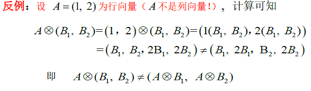
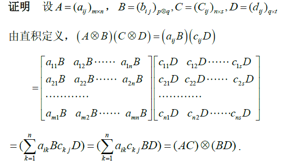
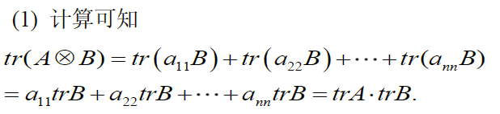
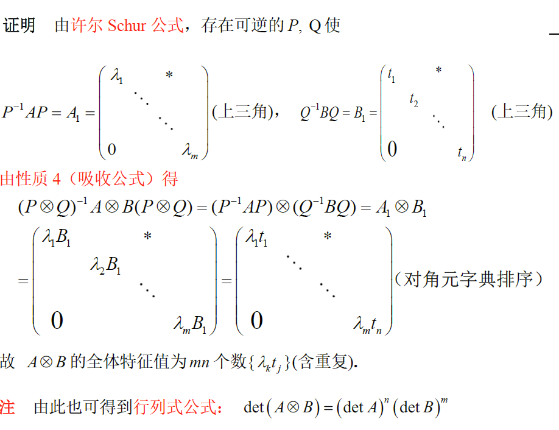
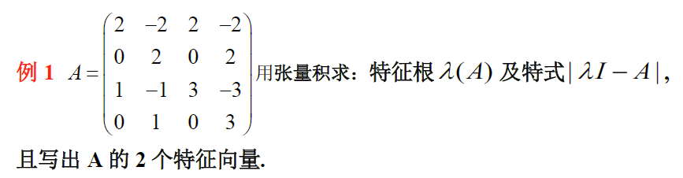
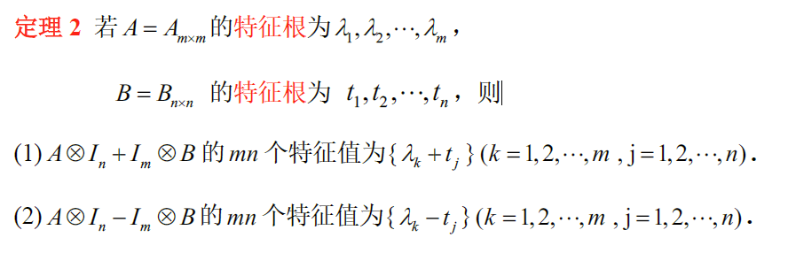

> 张量积

<!--more-->

## 9.1 张量积

### 9.1.1 定义

$$
\begin{aligned}
&设A=(a_{ij})_{m\times n},B=(b_{ij})_{p\times q},则称如下分块矩阵\left(
\begin{matrix}
a_{11}B&a_{12}B&\cdots&a_{1n}B\\
a_{21}B&a_{22}B&\cdots&a_{2n}B\\
\vdots&\vdots&\ddots&\vdots\\
a_{n1}B&a_{n2}&\cdots&a_{nn}
\end{matrix}
\right)为A与B的张量积\\
&记作A\otimes B=(a_{ij}B)_{mp\times nq}
\end{aligned}
$$

**eg**
$$
A=\left(
\begin{matrix}
a&b\\c&d
\end{matrix}
\right),B=\left(
\begin{matrix}
2\\3
\end{matrix}
\right)
$$

$$
\begin{aligned}
&A\otimes B=\left(
\begin{matrix}
aB&bB\\cB&dB
\end{matrix}
\right)=\left(
\begin{matrix}
2a&2b\\3a&3b\\2c&2d\\3c&3d
\end{matrix}
\right),B\otimes A=\left(
\begin{matrix}
2A\\3B
\end{matrix}
\right)=\left(
\begin{matrix}
2a&2b\\2c&2d\\3a&3b\\3c&3d
\end{matrix}
\right)
\end{aligned}
$$

- **张量积不满足交换律**

#### 定理

1. 两个上三角的张量积也是上三角
2. 两个对角阵的张量积是对角阵
3. $I_n\otimes I_m=I_{m}\otimes I_n=I_{m\times n}$

### 9.1.2 计算

#### a. 分块法

**右进右出**
$$
\left(
\begin{matrix}
A&B\\C&D
\end{matrix}
\right)\otimes F=\left(
\begin{matrix}
A\otimes F&B\otimes F\\C\otimes F&D\otimes F
\end{matrix}
\right),\left(
\begin{matrix}
A\\C
\end{matrix}
\right)\otimes F=\left(
\begin{matrix}
A\otimes F\\C\otimes F
\end{matrix}
\right)\\
(A\quad B)\otimes F=(A\otimes F\quad B\otimes F)
$$
一般情况下：$(A\quad B) \otimes F\neq (A\otimes F\quad B\otimes F)$

#### b. 向量与向量张量积

$$
列向量\alpha=\left(
\begin{matrix}
a_1\\a_2\\\vdots\\a_n
\end{matrix}
\right)\beta=\left(
\begin{matrix}
b_1\\b_2\\\vdots\\b_q
\end{matrix}
\right),则\alpha \otimes \beta=\left(
\begin{matrix}
a_1\otimes \beta\\a_2\otimes \beta\\\vdots\\a_n\otimes \beta
\end{matrix}
\right)_{nq\times 1}=\left(
\begin{matrix}
a_1b_1\\a_1b_2\\\vdots\\a_1b_q\\\vdots \\a_nb_1\\a_nb_2\\\vdots\\a_nb_q
\end{matrix}
\right)_{nq\times 1}
$$

#### 向量与矩阵张量积

$$
列向量\alpha=\left(
\begin{matrix}
a_1\\a_2\\\vdots\\a_m
\end{matrix}
\right),B=(\beta_1,\beta_2,\cdots,\beta_q)，\alpha\otimes B=\left(
\begin{matrix}
a_1B\\a_2B\\\vdots\\a_mB
\end{matrix}
\right)=\left(
\begin{matrix}
a_1(\beta_1,\beta_2,\cdots,\beta_q)\\
a_2(\beta_1,\beta_2,\cdots,\beta_q)\\
\vdots\\
a_m(\beta_1,\beta_2,\cdots,\beta_q)\\
\end{matrix}
\right)=\left(
\begin{matrix}
a_1b_{11}&a_1b_{12}&\cdots&a_1b_{1q}\\
a_1b_{21}&a_1b_{22}&\cdots&a_1b_{2q}\\
\vdots&\vdots&\ddots&\vdots\\
a_1b_{p1}&a_1b_{p2}&\cdots&a_1b_{pq}\\
a_2b_{11}&a_2b_{12}&\cdots&a_2b_{1q}\\
a_2b_{21}&a_2b_{22}&\cdots&a_2b_{2q}\\
\vdots&\vdots&\ddots&\vdots\\
a_2b_{p1}&a_2b_{p2}&\cdots&a_2b_{pq}\\
\vdots&\vdots&\vdots&\vdots\\
a_mb_{11}&a_mb_{12}&\cdots&a_mb_{1q}\\
a_mb_{21}&a_mb_{22}&\cdots&a_mb_{2q}\\
\vdots&\vdots&\ddots&\vdots\\
a_mb_{p1}&a_mb_{p2}&\cdots&a_mb_{pq}\\
\end{matrix}
\right)_{mp\times q}
$$

#### c. 性质

1. $k(A\otimes B)=(kA)\otimes B=A\otimes (kB)$

2. 分配律：$(A+B)\otimes C=A\otimes C+B\otimes C$ ，$C\otimes(A+B)=C\otimes A+C\otimes B$

3. 结合律：$(A\otimes B)\otimes C=A\otimes (B\otimes C)$

4. 吸收律：$(A\otimes B)(C\otimes D)=(AC)\otimes (BD)$

   

   推论：
   $$
   \begin{aligned}
   &若A=A_{m\times m}为m阶方阵,B=B_{n\times n}为n阶方阵，则\\
   &(A\otimes B)^k=A^k\otimes B^k\\
   &(A\otimes I_n)(I_m\otimes B)=A\otimes B
   \end{aligned}
   $$
   
   $$
   \begin{aligned}
   &(A_1\otimes B_1)(A_2\otimes B_2)\cdots(A_k\otimes B_k)=(A_1A_2\cdots A_k)\otimes (B_1\otimes B_2\cdots B_k)\\
   &(A_1\otimes A_2\otimes \cdots\otimes A_k)(B_1\otimes B_2\otimes \cdots\otimes B_k)=(A_1B_1)\otimes(A_2\otimes \cdots\otimes A_k)(B_2\otimes \cdots\otimes B_k)=(A_1B_1)\otimes (A_2B_2)\otimes \cdots \otimes (A_kB_k)
   \end{aligned}
   $$
   eg：
   $$
   A=A_{m\times m}，证明e^{A\otimes I_n}=e^A\otimes I_n
   $$

   $$
   \begin{aligned}
   &e^{A\otimes I_n}=\sum_{k=1}\limits^\infty\frac{1}{k!}(A\otimes I)^k=\sum_{k=1}\limits^\infty\frac{1}{k!}(A^k\otimes I^k)=(\sum_{k=1}\limits^\infty\frac{1}{k!}A^k)\otimes I^k=e^A\otimes I
   \end{aligned}
   $$

5. 转置公式：
   $$
   \begin{aligned}
   &(A\otimes B)^H=A^H\otimes B^H\\
   &(A\otimes B)^{-1}= A^{-1}\otimes B^{-1}
   \end{aligned}
   $$

6. 若A与B都是U阵，则 $A\otimes B$ U阵

7. 秩公式：$r(A\otimes B)=r(A)r(B)$

   推论：
   $$
   \begin{aligned}
   &若X_1、\cdots、X_p为C^m中p个线性无关的列向量，Y_1、\cdots、Y_q为C^n中q个线性无关列向量，则\\
   &则pq个列向量(X_i\otimes Y_j)线性无关
   \end{aligned}
   $$
   由于 $r(\{X\otimes Y\})=r(\{X\})r(\{Y\})$ ，张量积的秩等于两个向量组的秩的乘积，所以张量积线性无关

### 9.1.3 张量积行列式

设 $A=(a_{ij}) \in C^{m\times m} ，B=(b_{ij})\in C^{n\times n}$ ，则
$$
\begin{aligned}
&tr(A\otimes B)=tr(A)*tr(B)\\
&\vert A\otimes B \vert=\vert A \vert^n\vert B \vert^m
\end{aligned}
$$
证明：

$$
\begin{aligned}
&由许尔公式，存在可逆阵P使P^{-1}AP=\left(
\begin{matrix}
\lambda_1&&*\\
&\ddots&\\
0&&\lambda_m
\end{matrix}
\right)为上三角，且P\otimes I为可逆阵，构造一个新公式\\
&(P\otimes I)^{-1}A\otimes B(P\otimes I)=(P^{-1}AP)\otimes B=A_1\otimes B=\left(
\begin{matrix}
\lambda_1B&&&(*B)\\
&\lambda_2B&&\\
&&\ddots&\\
0&&&\lambda_mB
\end{matrix}
\right)\\
&故\vert A\otimes B \vert=\vert \lambda_1^nB\vert\vert \lambda_2^nB\vert\cdots\vert \lambda_m^nB\vert^m=\vert \lambda_1^n\lambda_2^n\cdots\lambda_m^n\vert\vert B \vert^m = \vert A \vert^n\vert B\vert ^m
\end{aligned}
$$

### 9.1.4 张量积特征值特征向量

#### 特征值

$$
\begin{aligned}
&若A=A_{m\times m} 的特征根为\lambda_1,\lambda_2,\cdots,\lambda_m，B=B_{n\times n} 的特征根为t_1,t_2,\cdots,t_n，则\\
&A\otimes B的全体特征根为mn个数\{\lambda_kt_j\}，(k=1,2,\cdots,m\quad j=1,2,\cdots,n)
\end{aligned}
$$

#### 特征向量

$$
\begin{aligned}
&设\{X_1,\cdots,X_p\}是A\in C^{m\times m}关于\lambda的线性无关的特征向量,\{Y_1,\cdots,Y_q\}是B\in C^{n\times n}关于t的线性\\
&无关的特征向量，则pq个向量 \{X_i\otimes Y_j\} 是A\otimes B关于\lambda t的特征向量
\end{aligned}
$$

**eg**

$$
\begin{aligned}
&A=\left(
\begin{matrix}
2&2\\1&3
\end{matrix}
\right)\otimes \left(
\begin{matrix}
1&-1\\0&1
\end{matrix}
\right)=B\otimes D,且B为行和等矩阵，B为对角阵，则\lambda(A)=\{4,tr(A)-4\}=\{4,1\},\lambda(B)=\{1,1\}\\
&\therefore A\otimes B=\prod\lambda_A\lambda_B=\{4,4,1,1\},特式\vert \lambda I-A\vert=(\lambda-4)^2(\lambda-1)^2\\
&可知，\left(
\begin{matrix}
1\\1
\end{matrix}
\right)\left(
\begin{matrix}
-2\\1
\end{matrix}
\right)是B的一个特征向量，\left(
\begin{matrix}
1\\0
\end{matrix}
\right)是D的特征值,故A\otimes B的特征向量为\left(
\begin{matrix}
1\\0\\1\\0
\end{matrix}
\right),\left(
\begin{matrix}
-2\\0\\1\\0
\end{matrix}
\right)
\end{aligned}
$$

#### $A\otimes I\pm I\otimes B$

