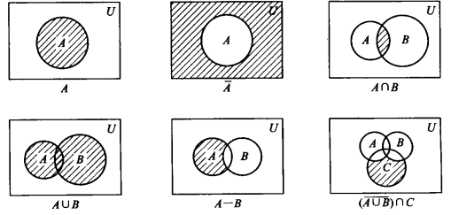

>   集合的基本概念

<!--more-->

# 2. 集合

## 2.1 基本概念

>   一个集合是能作为整体论述的事物的集体，用大写字母表示

### 2.1.1 集合的表示方法

1.  列举法：将集合中的元素枚举

    $$
    \begin{aligned}
    &例1：所有小于5的正整数\\
    &A=\{1,2,3,4,5\}\\\\
    &例2：1...50的整数集\\
    &A=\{1,2,...,50\}\\\\
    &例3：偶数集合\\
    &A=\{...,-4,-2,0,2,4,...\}
    \end{aligned}
    $$

2.    描述法：用谓词描述出集合元素的公共特征来表示这个集合
      形如：S={a|P(a)}，表示 $$a\in S$$当且仅当P(a)为真

      例：

      1.  所有小于5的正整数

          $$
          A=\{a\mid a\in I∧0<a∧a<5\}\}
          $$

      2.  1...50的整数集

          $$
          A=\{a\mid a\in I ∧1 \le a \le 50\}
          $$

      3.  偶数集合

          $$
          A=\{x\mid k\in I∧x=2k\}
          $$

3.  归纳定义法

    见 2.3节

### 2.1.2 元素与集合的关系——从属关系

>   元素(成员)：组成这个集合的元素或成员，用小写字母表示
>
>   -   集合也可作为另一个集合的元素

-   元素属于集合：$$a\in A$$

-   元素不属于集合：$$a\notin A$$

#### 1. 与元素相关的集合概念

单元素集合：仅含有一个元素的集合

有限集合：含有有限个元素的集合

-   无限集合（无穷集）：不是有限集合的集合

-   集合的基：有限集合的元素个数，即为 \|A\|

    $$
    A=\{a,b\},则\mid A\mid=2,又\mid \{A\}\mid=1
    $$

**记**：

1.  集合本身不能成为集合的元素，否则会导致罗素悖论
2.  n个元素的集合有 $$2^n$$ 个子集合

#### 2. 集合中元素的特点

1.  元素a是否在集合中出现是确定的，只有出现或者不出现两种情况
2.  集合中的元素互异(彼此不同)
3.  集合中的元素是无序的
4.  集合中的元素可以是一个集合

### 2.1.2 集合间的关系

#### 1. 相等

>   外延定理：两个集合A和B相等，即A=B，当且仅当他们有相同的成员(A中每个元素是B的一个元素而B中的每个元素也是A的有一个元素)

$$
\begin{aligned}
&A=B\iff \forall x(x \in A ↔x\in B)\\
&A=B\iff \forall x(x\in A \rightarrow x\in B)∧\forall x(x\in B \rightarrow x\in A)
\end{aligned}
$$

-   列举法中，元素的次序无关紧要
-   元素的重复出现无足轻重
-   集合的表示不是唯一的

#### 2. 集合间的包含关系

>   A⊆B：设A和B是集合，如果A中的每一元素是B的一个元素，则A是B的 **子集合** ，B是A的 **扩集**

逻辑符号表示为：

$$
A⊆B\iff \forall x\{x\in A\rightarrow x\in B\}
$$

>   真子集：如果A⊆ B且A $$\neq$$ B，则A是B的真子集，记为 A⊂B（A真包含于B）

逻辑符号表示为：

$$
\begin{aligned}
A⊂V&\iff (A⊆B)∧(A\neq B)\\
&\iff \forall x(x\in A\rightarrow x\in B)∧∃x(x\in B∧x\notin A)
\end{aligned}
$$

>   对任一集合A，有A⊆U，U表示全集合

-   对任何集合A，恒有A⊆A
    -   集合与其自身只有包含关系，没有从属关系，即{A}可作为A的子集合，但A任何条件下不能作为集合A的元素

-   设A和B是集合，A=B当且仅当A⊆B和B⊆A

-   传递性：设A，B，C是集合，若A⊆B且B⊆C，则A⊆C
-   对于任何非空集合，都有两个平凡子集，A集合本身和∅

>   空集：没有任何元素的集合，记为∅

-   空集是任何集合的子集合，∅⊆A
-   空集是唯一的

## 2.2 集合上的运算

>   用给定的集合（运算对象）去指定一新的集合（运算结果）

### 2.2.1 并、交、差

#### 1. 定义

设A和B是集合

>   A∪B：A和B的并

$$
A∪B=\{x|A\in A∨x\in B\}
$$

>A∩B：A和B的交

$$
A∩B=\{x|x\in A ∧x \in B\}
$$

>A-B：A和B的差

$$
\begin{aligned}
A-B &= A∩\overline{B}\\
&= \{x|x\in A∧x\notin B\}
\end{aligned}
$$

>   不相交：A∩B=∅，则A和B是不相交的。

-   C是集合族，若C中任意两个不同元素不相交，则C是 _不相交集合的族_

例：

$$
C=\{\{0\},\{1\},...\}=\{\{i\}\mid i\in N\}
$$

#### 2. 定理

设A、B、C是集合

>   集合的交、并是可交换和可结合的

1.  A∪B = B∪A
2.  A∩B = B∩A
3.  C∪(A∪B) = (A∪B)∪C
4.  A∩(B∩C) = (B∩C)∩A

>   分配律

1.  A∪(B∩C) = (A∪B)∩(A∪C)
2.  A∩(B∪C) = A∩B∪A∩C

>   其他运算性质

1.  A∪A = A
2.  A∩A = A
3.  A∪∅ = A
4.  A∩∅ = ∅
5.  A-∅ = A
6.  A-B ⊆ A
7.  A⊆A∪B
8.  A∩B⊆A
9.  如果A⊆B且C⊆D，则 (A∪C)⊆(B∪D)
10.  如果A⊆B且C⊆D，则 (A∩C)⊆(B∩D)
11.  如果A⊆B，则 A∪B = B
12.  如果A⊆B，则 A∩B = A

### 2.2.2 补运算

设U是论述域，A是U的子集

>   A的补$$\overline{A}$$ ：$$\overline{A} = U-A = \{x\mid x\in U∧ x\notin A\}$$

显然：

-   $$A∪\overline{A}=U$$
-   $$A∩\overline{A}=∅$$

>   补的唯一性：A和B是U的子集，则 $$B=\overline{A}$$ 当且仅当 A∩B=∅ 和 A∪B=U

-   $$\overline{∅} = U$$
-   $$\overline{U}=∅$$

>   A的补的补是A：$$\overline{\overline{A}}=A$$

>   德·摩根定律

-   $$\overline{A∪B}=\overline{A}∩\overline{B}$$
-   $$\overline{A∩B}=\overline{A}∪\overline{B}$$

>   包含关系的逆反定律：若 $$A⊆B$$ ，则 $$\overline{B}⊆\overline{A}$$

### 2.2.3 韦恩图

### 2.2.4 并和交运算的扩展

设C是某论述域的搜集

-   搜集：集合子集组成的族

>   C的成员的并，记为 $$U_{S\in C}S = \{x\mid ∃x(S\in C∧x\in S)\}$$

-   如果 $$x\in U_{S\in C}$$ ，那么x至少是一个子集S的元素

>   若 $$C\neq∅$$ ，C的成员的交，记为 $$∩_{S\in C}=\{x\mid \forall x(S\in C\rightarrow x\in S)\}$$

-   如果 $$x\in ∩_{S\in C}$$ ,那么x是每一个子集S的元素

>   加索引搜集：
>
>   设D是一集合， $$A_d$$ 为D的单元素子集，则d为 $$A_d$$ 的索引
>
>   $$C=\{A_d\mid d\in D\}$$ 为加索引搜集，D为搜集的索引集合

例：

1.  $$C=P\{A_0,A_1,A_2,...,A_n\}$$  , 则C的成员的并 $$U_{S\in C}$$ ，记为

    $$
    U_{i=0}^nA_i\quad或\quad U_{0\le i\le n}A_i\quad或\quad A_0UA_1U...UA_n
    $$

2.  设： $$[0,a)表示集合\{x\mid 0\le x < a\}$$

    如果 $$S_a=[0,a),a\in R_+,C=\{S_a\mid a\in R_+\}$$，那么

    $$
    U_{s\in C}S=[0,\infty),∩_{S\in C}s=\{0\}
    $$

    如果 $$S_a=[0,a),a\in I_+,C=\{S_a\mid a\in I_+\}$$ ,那么

    $$
    \begin{aligned}
    U_{i=1}^{\infty}S_i=[0,1)U[0,2)U...=[0,\infty)\\
    ∩_{i=1}^{\infty}S_i=[0,1)∩[0,2)∩...=[0,1)
    \end{aligned}
    $$

### 2.2.5 环和与环积

#### 1.环和(对称差)

>   环和(A⊕B)：

$$
\begin{aligned}
A⊕B&=(A-B)U(B-A)\\
&=\{x\mid x\in A∧x\notin B∨x\in B∧x\notin A\}
\end{aligned}
$$

1. 定理

$$
\begin{aligned}
A⊕B&=(A-B)U(B-A)\\
&=(A∩\overline{B})U(B∩\overline{A})\\
&=(AUB)∩(\overline{A}U\overline{B})\\
&=(AUB)∩(\overline{A∩B})\\\\
&=(AUB)-(A∩B)
\end{aligned}
$$

2.  推论：

    $$
    \begin{aligned}
    &\overline{A}⊕\overline{B}=A⊕B\\
    &A⊕B=B⊕A\\
    &A⊕A=∅\\
    &(A⊕B)⊕C=A⊕(B⊕C)\\
    &C∩(A⊕B)=C∩A⊕C∩B
    \end{aligned}
    $$

3.  交环和可分配，其余不可分配

#### 2. 环积

>   环积(A⊗B)：

$$
\begin{aligned}
A⊗B&=\overline{A⊕B}\\\\
&=\overline{(AUB)∩(\overline{A∩B})}\\
&= A∩BU\overline{A}∩\overline{B}\\
&=\{x|x\in A∧x\in B∨x\notin A∧x\notin B\}
\end{aligned}
$$

1.  定理：

    $$
    \begin{aligned}
    &\overline{A}⊗\overline{B}=A⊗B\\
    &A⊗B=B⊗A\\
    &A⊗A=U\\
    &(A⊗B)⊗C=A⊗(B⊗C)\\
    &CU(A⊗B)=(CUA)⊗(CUB)
    \end{aligned}
    $$

2.  并环积可分配，其余不可分配

#### 环积是环和的补

### 2.2.6 幂集合

>   集合A的 **幂集** $$\rho(A)$$ 是A的所有子集的集合

$$
\rho(A)=\{B|B\subseteq A\}
$$

如：
$$
设A=\{1,2\},\rho(A)=\{∅,\{1\},\{2\},\{1,2\}\}
$$

-   一个给定集合的幂集是唯一的
-   如果A是有限集，则 $\rho(A)$ 的元素个数也是有限的，如 $\mid A\mid = n$，则 $\mid \rho(A) \mid = 2^n$

### 2.2.7 有限集的计数

#### 容斥原理

设A、B是有限集合，其元素个数为 $\mid A \mid , \mid B \mid$ ，则 $\mid AUB \mid=\mid A\mid + \mid B \mid - \mid A∩B \mid$

**加奇减偶**

## 2.3 集合的笛卡尔积

### 2.3.1 序偶

>   两个元素 $a_1,a_2$ 组成的序列记作 $<a_1,a_2>$ ，称为二重组或者序偶
>
>   $a_1,a_2$ 分别称为第一和第二分量

$<a,b>$和 $<c,d>$ 相等，当且仅当a=c且b=d

-   二重组中元素的是有次序的

n重组，$<a_1,a_2,...,a_n>=<<a_1,a_2,...,a_{n-1}>,a_n>$

-   n重组中，第一个分量为n-1重组

### 2.3.2 集合的叉积

集合A和B的叉积记为 $A\times B$ ，表示两集合元素的所有序偶集合 ，即$\{ <a,b> \mid a\in A ∧b\in B\}$

集合 $A_1,A_2,...,A_n$ 的叉积记为 $A_1 \times A_2 \times...\times A_n$ 或 $\times_{i=1}^n A_i$，表示n个集合元素的n重组，即 $\{ <a_1,a_2,...,a_n> \mid a_i \in A_i ∧ 1\le i \le n\}$

例：
$$
\begin{aligned}
&设A=\{a,b\},B=\{ 1,2,3 \},C=\{ p,q \},D=\{ 0\},E=∅\\
&A\times B = \{ <a,1>,<a,2>,<a,3>,<b,1>,<b,2>,<b,3> \}\\
&A\times B\times C=\{<a,1,p>,<a,1,q>,<a,2,p>,<a,2,q>,<a,3,p>,<a,3,q>,<b,1,p>,<b,1,q>,<b,2,p>,<b,2,q>,<b,3,p>,<b,3,q>\}\\
&C\times D=\{ <p,0>,<q,0> \}\\
&D\times (C^2)=D\times \{<p,p>,<p,q>,<q,p>,<q,q> \}\\
&=\{ <0,<p,p>>,<0,<p,q>>,<0,<q,p>>,<0,<q,q>> \}\\
&A\times E = ∅
\end{aligned}
$$
当A和B表示连续的实数集合，那么$A\times B$ 能代表笛卡尔平面的点的集合

#### 笛卡尔积无交换律无结合律

#### 笛卡尔积的分配律

$$
\begin{aligned}
&1. A\times (B∪C)=(A\times B)∪(A\times C)\\
&2. A\times(B∩C)=(A\times B)∩(A\times C)\\
&3. (A∪B) \times C = (A\times B)∪(A\times C)\\
&4. (A∩B) \times C = (A\times B)∩(A\times C)
\end{aligned}
$$

#### 笛卡尔积的计数

$$
\begin{aligned}
\mid A_1\times A_2 \times ... \times A_n \mid = \mid A_1 \mid · \mid A_2 \mid ··· \mid A_n \mid
\end{aligned}
$$

