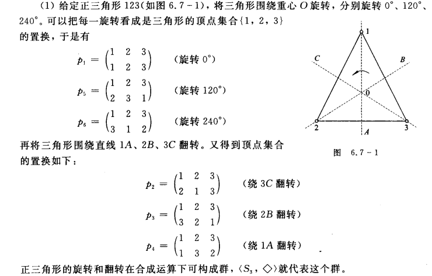

代数系统：把一些形式上很不相同的代数系统，用统一的方法描述、研究、推理，从而得到反映出他们共性的一些结论，在将结论运用到具体的代数系统中

>   系统：运算+研究对象
>
>   -   运算：具有的共同性质的不同演算抽取成一个运算，根据性质的不同取名群、环域等。
>   -   研究对象：可以运算的抽象对象
>
>   如：集合上的并满足结合律，实数上的加法也满足结合律，用一个符号代表具有结合律的运算，而研究对象变为代表实数或者集合等对象的抽象事物

所以代数系统定义为：非空集合和定义在集合上的封闭运算构成的系统

<!--more-->

# 5. 代数系统

## 5.0 代数学

代数学：研究数的部分

几何学：研究形的部分

分析学：沟通数与性且设计极限运算的部分

>   代数：用字母代替具体的数值

### 发展历程

1.  算数

2.  初等代数

3.  代数式的运算、方程

    从简单的一元一次方程开始

    讨论二元和三元的一次方程

    研究二元以上及可以转换为二元的方程组

4.  数与方程理论

    -   无理数与有理数的界定
    -   运算符号的创立与无理方程的解法
    -   虚数理论

5.  高等代数

    -   线性代数：讨论任意多个未知数的一元方程组（线性方程组）

        费马与笛卡尔引入笛卡尔坐标系，统一了代数与集合，线性代数才出现

        仅涉及线性运算(加法和数乘)的代数学分支，以矩阵为研究工具，以向量空间和线性映射为研究对象

    -   多项式代数：研究更高次的一元方程组

6.  (19世纪以后)抽象代数

>   系统：将不同演算共有的性质抽取形成系统，根据抽取的性质取名群、环域等。
>
>   如：集合上的并有结合律，实数上的加法也有结合律，用一个符号代表具有结合律的运算，而研究对象变为代表实数或者集合等对象的抽象事物

所以代数系统定义为：抽象的研究对象集合和满足某种性质的运算构成的系统

**具体应用**：

伽罗瓦用置换群的方法证明一般形式的一元五次方程没有通解，给出了可解性的判别原则

格与布尔代数：用于电子线路设计、电子计算机硬件设计和通信系统设计

半群：形式语言，自动机理论 

## 5.1 运算

### 5.1.1 运算的概念

>   二元运算：函数 $f:A\times A\rightarrow A$，则称f为A上的二元代数运算

如：

1.  加法与乘法是在 $Z^+$ 上的二元代数运算，运算结果也是 $Z^+$ ，所以是**封闭的**

    $f(<x,y>)=x+y,x\in Z^+,y\in Z^+,x+y\in Z^+$

2.  减法不是 $Z^+$ 上的二元运算，因为 $x-y\notin^{?} Z^+$ ，所以是不封闭的

3.  减法在Z上是二元运算，$x-y\in Z$ ，是封闭的

### 5.1.2 运算的性质

二元运算 $A\times A\rightarrow A$ 上的性质，以\*为运算符

#### 交换律

$$
\forall x,y\in A,有x*y=y*x，称 *满足交换律
$$

运算表关于主对角线对称

#### 结合律

$$
\begin{aligned}
\forall x,y,z\in A,有(x*y)*z=x*(y*z)，称*满足结合律
\end{aligned}
$$

#### 分配律

$$
\forall x,y,z\in A,有\begin{cases}
x*(y·z)=x*y·x*z\\
(y·z)*x=y*x·z*x
\end{cases}
，则称*满足分配律
$$

#### 幂等律

$$
\begin{aligned}
&\forall x\in A,有x*x=x，则称*满足幂等律\\
&若\exists a\in A,且a*a=a，则称a是*的幂等元
\end{aligned}
$$

主对角线元素排列与表头顺序一直

#### 吸收律

$$
\forall x,y \in A,有
\begin{cases}
x*(x·y)=x\\
x·(x*y)=x
\end{cases},
则称*和·满足吸收律
$$

#### 消去律

$$
若满足两个关系：
\begin{cases}
x*y=x*z(x\neq 0)，则y=z\\
y*x=z*x(x\neq 0)，则y=z
\end{cases}
，*满足消去律
$$

Z上的加法、乘法满足消去律

幂集 $\rho(A)$ 上的 U 不满足消去律

-   $A\cup B=A\cup C \nRightarrow B=C$

### 5.1.3 表示方法

1.  公式
2.  运算表

## 5.2 代数系统

### 5.2.1 基本概念

>   代数系统：非空**集合A**和A上的k个**封闭的运算** $f_1,f_2,...,f_k$ 组成的系统，称为一个代数系统，记作 $<A,f_1,f_2,...,f_k>$

如： $<R,+>,<R,*>,<\rho(A),\cup,\cap>$

>   子代数系统：设 $<A,*_1,*_2,...,*_k>$ 是代数系统，若 $B\subseteq A,B\neq ∅$ ，且运算 $*_1,*_2,...,*_k$ 对B是封闭的，则 $<B,*_1,*_2,...,*_k>$ 也是代数系统，称为 $<A,*_1,*_2,...,*_k>$ 的子代数系统

若 $B\subset A$，则称 $<B,*_1,*_2,...,*_k>$ 为真子代数系统

如：
$$
对<R,->：
\begin{aligned}
&<Z,->是<R,->的真子代数系统\\
&<N,->不是<R,->的真子代数系统
\end{aligned}
$$

### 5.2.2 特殊元

#### 幺元零元

**代数系统的幺元，零元** ，若存在必唯一

>   左幺元：设\*是S上的二元运算，$1_l$ 是S中的元素，如果对S中的每一元素x，有$1_l*x=x$，则称 $1_l$ 是对运算 \* 的左幺元
>
>   左零元：如果对于S中的每个元素x，有 $0_l*x=0_l$ ，则称 $0_l$ 对运算 \* 是左零元

设 \* 是S上的二元运算，1是S中的元素，对于S中的每个元素，满足 $1*x=x*1=x$ ，则1为对运算 \* 的幺元。

如果对于S中的每一元素x，有 $0*x=x*0=0$ ，则称0对运算 \* 是零元

-   在运算表中
    -   幺元：所在的行与列的元素排列都与表头一致
    -   零元：元素的行与列都有钙元素自身构成

#### 逆元

**某个元素的逆元**

>   设 \* 是S上的二元运算，1是对运算 \* 的幺元。如果 x\*y =1，那么关于运算 \* ，x是y的左逆元，y是x的右逆元
>
>   如果 x\*y=1和y\*x=1都成立，则关于运算 \*，x是y的逆元
>
>   x的逆元记作 $x^{-1}$ ，存在逆元的元素称为可逆的

## 5.3 含一个运算的代数系统

###  5.3.1 半群

>   设 $V=<S,*>$ 是代数系统，\* 为一个二元运算符
>
>   -   若 \* 是可结合的，则称V是半群

如：乘法，加法，关系的合成，$<\rho(A),\cup>,<\rho(A),\cap>$ 都是半群

幂等元：$\exists a\in S,使得 a^2=a$ 成立，则称a是幂等元素

-   定理：**有限半群必有幂等元**

    连续幂等后根据封闭性，结果仍在集合中，所以一定存在幂等元

#### 子半群

>   在**非空子集**上的运算是封闭的半群

#### 独异点(含幺半群)

**含幺半群=半群+幺元**

>   半群V中 \* 运算符含有幺元，则称V是含幺半群（独异点），记作 $<S,*,1>$

如：矩阵乘法

##### 证明独异点

在R中定义二元运算 \* ，$\forall a,b \in R,a*b=a+b+ab$ ，求证 $<R,*>$ 构成独异点
$$
\begin{aligned}
1.\quad &\forall a,b \in R,a*b=a+b+ab\in R,所以*是封闭的\\&即<R,*>是一个代数系统\\
2.\quad &(a*b)*c=(a*b)+c+(a*b)c=(a+b+ab)+c+(a+b+ab)c\\&=a+b+c+ab+ac+bc+abc\\
&c*(a*b)=c+(a*b)+c(a*b)=c+(a+b+ab)+c(a+b+ab)\\&=a+b+c+ab+ac+bc+abc\\
&所以 *是可结合的，故<R,*>是半群\\
3.\quad &对0\in R,\forall x\in R,有0*x=x=x*0=x,所以0为幺元\\
&综上，<R,*>是独异点
\end{aligned}
$$

**定理**

-   x,y都有逆元，则 x\*y 有逆元，且 $(x*y)^{-1}=x^{-1}*y^{-1}$

#### 可交换半群=半群+满足交换律

>   若半群 $V=<S,*>$ 的运算符 \* 是可交换的，V是可交换半群

**定理**

-   在可交换半群 $<S,*>$ 中，有 $(a*b)^n=a^n*b^n$ ，其中n是正整数, $a,b\in S$

独异点 $<S,*,1>$ 中的 \* 是可交换的，称V是可交换独异点

#### 循环半群=半群+生成元

### 5.3.2 群

**群=含幺半群+每个元素有逆元**

>   设 $V=<S,*>$ 是代数系统，\* 是二元运算
>
>   若 \* 是可结合的，存在幺元 $\exists 1 \in S$ ，且 $\forall x\in S,有x^{-1}\in S$ ，称V为群

如：
$$
\begin{aligned}
&<N,+>满足结合律，所以是半群。幺元是0，所以是含幺半群。但是\\
&<N,+>不是群，每个元素的逆不在N中
\end{aligned}
$$

##### 证明群的过程

设Z为整数集合，在Z上定义二元运算\*，$\forall x,y\in Z$，x\*y=x+y-2，为 $<Z,*>$ 是否为群
$$
\begin{aligned}
1.\quad &\forall x,y\in Z,x*y=x+y-2\in Z,所以*是封闭的，即<Z,*>是代数系统\\
2.\quad &\forall x,y,z\in Z \\
&(x*y)*z=(x+y-2)+z-2=x+y+z-4\\
&x*(y*z)=x+(y+z-2)-2=x+y+z-4\\
&即*是可结合的，所以<Z,*>是半群\\
3.\quad &设p是幺元，p*x=p=p+x-2=x\Rightarrow p=2\\
&故半群<R,*>是独异点，幺元为2\\
4.\quad &x*x^{-1}=2\iff x+x^{-1}=4\Rightarrow x^{-1}=4-x\in Z\\
&故<R,*>是群
\end{aligned}
$$

##### 有限群&无限群

设 $<G,*>$ 是一个群

-   如果G是有限集，则称 $<G,*>$ 是有限群，G中的元素个数称为**群的阶**，记为 $\mid G \mid$

-   G是无限集，则为无限群，群的阶为无限

##### 群的基本性质

二阶以上的群无零元

-   一阶群一定有零元，零元即幺元， $<{g},*>$ g\*g=g，所以g是零元

群中每个元素都存在**唯一逆元**

**群中除幺元外无幂等元**

群的运算表中，没有两行或两列是相同的

群满足消去律

满足消去律的有限半群是群

-   没有零元的有限半群是群

#### 子群

>   设 $<G,*>$ 为群，$H\subseteq G$，且 $<H,*>$ 为群，则称H为G的子群，记作 $H\le G$

##### 子群判定定理 

设 $<G,*>$ 为群，H是G的非空子集

$$
\begin{aligned}
<H,*>是<G,*>的非空子群
&\iff
\begin{cases}
封闭：\forall a,b\in H,有a*b\in H\\
逆元：\forall a\in H,有a^{-1}\in H
\end{cases}\\
&\iff \forall a,b\in H,有a*b^{-1}\in H\\
H是G的子集且H是有限集&\iff \forall a,b\in H,有a*b\in H
\end{aligned}
$$

##### 性质

子群的幺元是群的幺元，$\forall a\in H$ ，其逆元 $a_H^{-1}$ 就是a在G中的逆元 $a^{-1}$

二阶以上的群 $<G,*>$ 一定存在两个子群，称为G的平凡子群

-   由幺元组成的子群 $<{1},*>$ 称为G的幺子群，其中 1就是 $<G,*>$ 的幺元
-   $<G,*>$ 群本身

-   其余子群称为 非平凡子群/真子群

#### 交换群：满足交换律的群

>   若群 $V=<S,*>$ 中的 \* 满足交换律，则称V是可交换的群（阿贝尔群）

#### 循环群：有生成元的交换群

群中的每个元素都可用一个元素的方幂表示，则称这个群是循环群

>   群 $V=<G,*>$ 中，如果 $\exists g\in G$，对于每个元素 $a\in G$，都有一个相应的 $i\in I$ ，能把a表示成幂次 $g^i$ 的形式，则称 $<G,*>$ 是一个循环群。或循环群是由g生成的，g是 $<G,*>$ 的生成元

##### 循环群的判别

 证明：$<Z,+>$ 是循环群
$$
\begin{aligned}
&1. \quad \forall a,b\in Z,a+b\in Z，故+是封闭的\\
& \quad <G,+>是一个代数系统\\
&2.\quad \forall a,b,c \in Z,(a+b)+c=a+(b+c)=a+b+c\\
&\quad 所以<G,+>是半群\\
&3.\quad 设幺元为p,\forall x\in Z,p+x=x,则p=0\\
&\quad 幺元=0\\
&4. \quad \forall a\in Z,a+a^{-1}=0\Rightarrow a^{-1}=-a\in Z\\
&\quad 所以<G,+>是群\\
&5. \quad 设g=1，\forall n\in Z_+，n=1+1+...+1=1^{n}\\
&\quad \forall n\in Z_-,n=(-1)+(-1)+...+(-1)=(-1)^n=(1^{-1})^n\\
&故1是<G,*>的生成元，该群为循环群
\end{aligned}
$$

##### 循环群的性质

1.  生成元不唯一
	

2.  群的阶：设 $<G,*>$ 是一个由元素a生成的循环群，且是 **有限群**，如果G的阶是n，即 $\mid G \mid=n$ ,则 $a^n=1$ 且 $G=\{a,a^2,...,a^n=1\}$ ，n是元素 a 的阶(使得 $a^n=1$ 成立的最小正整数)

3.  任意的循环群都是交换群
	

#### 置换群

##### 变换与变换群

变换：在A上的映射/函数

>   对称群 $<S_A,◇>$：**非空集合A** 上的全体 **可逆变换(双射函数)的复合运算** 构成集合的A的群 
>
>   -   代数系统——封闭：集合A上的任意两个双射函数复合后仍在集合A中
>   -   半群——结合律：复合运算具有结合律
>   -   含幺半群——求幺元：恒等函数，自己到自己的变换
>   -   群——每个元素逆元都在群中：双射函数的逆元仍在集合中

对称群 $<S_A,◇>$ 的子群称为A的一个变换群

-   运算符号满足结合律，不满足交换律
-   **每个群都同构于一个变换群**

G是实数集R上 所有变换 $f_{a,b}:R\rightarrow R$ 构成的集合，$\forall x\in R,f_{a,b}(x)=ax+b$ ， $<G,◇>$ G是变换群

##### 置换

>   置换：在 **有限集合** 上的可逆变换（双射函数）

如：集合A={1,2,3,4,5}是有限集合，其上的一个可逆变换(可逆函数/双射函数)即为一个置换

>   若 $\mid A \mid=n$ ，则A上的置换有 n! 个。A上的所有置换的集合记为 $S_n$ 

##### 置换群

>   n元有限集合A上的置换所构成的群，称为n元置换群；A上**所有置换构成的群**称为n次对称群
>
>   -   置换群是在 **有限集合** 上的变换群
>   -   n次对称群是n元置换群的特殊情况

-   以符号◇表示右合成运算：$p_1◇p_2$ 表示先进行 $p_1$ 置换，在进行$p_2$ 置换

-   $<S_n,◇>$ 表示对称群，$<\{p_1,p_2,...\},◇>$ 表示置换群
-   任何一个有限群都同构于一个置换群

##### 置换群的几何意义

## 5.4 含两个运算的代数系统

### 5.4.1 环

**具有两个二元运算的代数系统**

>   设 $<R,+,*>$ 是代数系统，+,\*为二元运算，若满足
>
>   -   $<R,+>$ 是可交换群
>
>   -   $<R,*>$ 是半群
>
>   -   \*对+满足分配律
>
>        A\*(B+C)=A\*B+A\*C
>
>   称 $<G,+,*>$ 为环

#### 整环

>   若环 $<R,+,->$ 可交换，含幺元，无零元，称R为整环

对应可交换半群

#### 除环

>   若环 $<R,+,->$ 至少存在两个元素，含幺元，无零元，且(逆元也在环中) $\forall a\in R(a\neq 0)$ 有 $a^{-1}\in R$ ，称R为除环

对应群

### 5.4.2 域

>   若环 $<R,+,->$ 既是整环又是除环，则称R是域

对应可交换群——阿贝尔群

## 5.5 格

>   设 $<S,\le>$ 是偏序集(自反，反对称，传递)，如果 $\forall x,y \in S$ ，{x,y} 都有最小上界和最大下界，称S关于 $\le$ 构成一个格，记为：
>
>   $格<S,\le>,格<S,∧,∨>$ ，
>
>   其中 ∨表示最小上界，∧表示最大下界

每个全序集都是一个格

### 5.5.1 格的判断

**1. **

设 $<S_6,D>$ ，D表示整除，$S_n$ 表示整除n的因子集合

其中：

1∨2=2，,1∨3=3，1∨6=6，2∨3=6

 1∧2=1，,1∧3=1，1∧6=1，2∧3=1

 所以是格

**2. **

对于 b,d 有最小上界 b∨d=c,e

对于 c,e 有最大下界 c∧e =b,d 但是无最小上界，c与e大小无法判断

所以不是格

**3.** $$<\rho(B),\subseteq>$$ 
$$
\forall x,y\in \rho(B),x∨y=x\cup y,x∧y=x\cap y
$$
所以是格

### 5.5.2 格的界

>   全界：
>
>   若格 $<L,∧,∨>$ 中 $\exists a$，对 $\forall b\in L$ ，有 $a\le b(b\le a)$ ，则称a为格L的全下界(全上界) 

全下界a是L中的最小值，哈斯图的最底层一个元素。

全上界a是L中的最大值，哈斯图的最顶层一个元素

### 5.5.3 特殊的格

#### 有界格

记为：$<L,∧,∨,0,1>$ 。界的位置与运算符号位置对应

#### 有补格

每个元素都有补元，为有补格

##### 补元

>   有界格 $<L,∧,∨,0,1>$ ，$\forall a\in L$ ，若 $\exists b\in L$ ，使 a∧b=0,a∨b=1，则称**b是a的**补元

如：

$<S_8,D>$ ，其哈斯图为：

1是全下界，8是全上界，即表示为格 $<S_8,D,∧,∨,1,8>$ 。

由于1∧8=1，1∨8=8，所以1和8互为补元

由于1∧2=1，1∨2=2；2∨4=4；2∨8=8，2∧8=2，所以2无补元，同理4无补元

![3-代数系统/image-20220302091523377.png]

所给哈斯图是格，a为全上界，d为全下界。a与d互为补元，b,c,e无补元

a为全上界，e为全下界，所以a与e互为补元

对于b,c，b∧c=e，b∨c=a，所以b与c互为补元

同理，c与d，b与d互为补元

#### 有界有补分配格

>   格 $<L,∧,∨,0,1>$ 是有补分配格，称L为布尔代数

-   有界格

-   有补格

-   求界可分配

    ∧对∨可分配

    ∨对∧可分配
    
-   0：全下界

-   1：全上界

如：

$<B,∧,∨,',0,1>$ 是布尔代数

若a'是a的补元，则a∧a'=0,a∨a'=1

a∨0=a,a∧0=0,a∨1=a,a∧1=a

## 5.6 代数间的关系

>   用于研究两个代数系统间的联系

### 5.6.1 同构

>   两个代数系统 $A=<S,*,+,k>$ 和 $A'=<S',*',+',k'>$ ，其中\*是二元运算，+是一元运算。若存在一个双射函数h，使
>
>   h: $S\rightarrow S'$
>
>   h(a\*b)=h(a)\*'h(b)
>
>   h(+a)=+'h(a)
>
>   h(k)=k'
>
>   则将h为从A到A'的同构

### 5.6.2 同态
