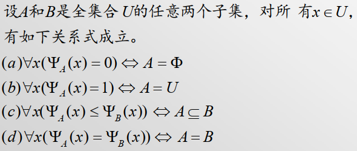

>   研究集合中，成员之间存在的关系
>
>   一个集合及其成员上的关系称为该集合所代表的的事物的结构
>

n元组的理解：有n个集合，从每个集合中抽取一个元素，组成一个n元组

笛卡尔积的理解：笛卡尔积是n个集合能构成的所有互不相等的n元组的集合

对于n元关系的理解：n元关系是n个集合的笛卡尔积的子集，这个子集是在笛卡尔积上加上约束条件构成的。就是在笛卡尔积中满足同一关系式R的n元组构成的集合

<!--more-->

# 3. 关系

## 3.1 基本概念

### 3.1.1 关系的基本概念

二元关系：$A\times B$ 的子集称为A到B的一个二元关系

-   $A^2=A\times A$ 的子集称为A上的二元关系

n元关系：$A_1 \times A_2 \times...\times A_n$ 的子集称为 $A_1 \times A_2 \times...\times A_n$ 上的一个n元关系

-   $A^n=A\times A\times...\times A$ 的子集称为A上的n元关系

关系：二元关系R中任一序偶 <x,y> 记作 $<x,y>\in R$ 或 $xRy$

### 3.1.2 关系的个数

对于 $A_1 \times A_2 \times...\times A_n$ ，若每个集合 $A_i$ 都是有限的，其基数记为 $\mid A_i \mid=r_i$ ，则笛卡尔积的基 $\mid A_1 \times A_2 \times...\times A_n \mid=r_1·r_2·...r_n$ ，他的不同子集个数为 $2^{r_1·r_2·...r_n}$ ，**所以 $A_1 \times A_2 \times...\times A_n$ 上的不同关系的个数为子集其子集个数 $2^{r_1·r_2·...r_n}$**

### 3.1.3 关系的相等

设 R1 是 $A_1\times A_2\times ...\times A_n$ 上的n元关系，R2是 $B_1\times B_2\times ...\times B_m$ 上的m元关系

R1=R2：

1.  n=m
2.  对于一切i，$A_i=B_i$
3.  R1和R2是相等的有序n重组集合

## 3.2 二元关系

### 3.2.1 基本概念

X叫做关系R的前域，Y叫做关系R的陪域

R表示集合X到Y的二元关系，有 $<x,y>\in R$ 的所有x组成的集合**D(R)称为R的定义域**

$$
D(R)=\{x\mid ∃y(<x,y>\in R) \}
$$

由 $<x,y>\in R$ 的所有y组成的集合**R(R)称为R的值域**，即

$$
R(R)=\{y\mid ∃x(<x,y>\in R) \}
$$

### 3.2.2 二元关系的运算

**相等**

Ix是X上的二元关系，且满足 $Ix=\{ <x,x> \mid x\in X \}$ ，则称Ix或Ex是X上的相等关系

**关系分类**

设R是 $A_1 \times A_2 \times...\times A_n$ 的子集，如果R=∅，则称R为空关系，若R=$A_1 \times A_2 \times...\times A_n$ ，则称R是全域关系

**关系的本质是集合，关系经过集合运算后仍是关系**

关系是序偶的集合，所以适用于集合的运算

-   若Z和S是集合X到集合Y的两个关系，则Z、S的并、交、补、差仍是X到Y的关系

### 3.2.3 关系的表示

给定两个有限集合，$X=\{x_1,x_2,...,x_m \},Y=\{ y_1,y_2,...,y_n \}$ ，R为从X到Y的一个二元关系 

#### 关系的矩阵表示

对应于关系R有一个关系矩阵 $M_R=[r_{ij}]_{m*n}$ ，其中

$$
r_{ij} = 
\begin{cases}
1,&<x_i,y_j>\in R\\
0,&<x_i,y_j>\notin R
\end{cases}
\quad i=1,2,...,m,j=1,2,...n
$$

如X={1,2,3,4}求 $X^2$ 上大于关系的关系矩阵

$$
\begin{bmatrix}
0,0,0,0\\
1,0,0,0\\
1,1,0,0\\
1,1,1,0
\end{bmatrix}
$$

#### 关系的图形表示

有向图

#### 约定

从X到Y的关系R是 $X\times Y$ 的子集，即 $R\subseteq X\times Y$ ，而 $ X\times Y \subseteq (X\cup Y)\times (X\cup Y)$。若令 $Z=X\cup Y$ ，则 $R\subseteq Z\times Z$ ，所以只需研究同一集合上的关系的性质

### 3.2.4 关系的性质

#### 自反性

##### 自反

设R是集合X上的二元关系，如果对于X中的每个x都有xRx，则称二元关系R是自反的

$$
R在X上自反 \iff (\forall x) (x\in X\rightarrow xRx)
$$

**表示方法上看**

-   关系图中，每个结点都有自回路
-   关系矩阵的主对角线上元素都是1,不同结点间关系随意

##### 反自反

设R是集合X上的二元关系，如果对于X中的每个x都有 $x\not R x$ ，则称二元关系R是反自反的

$$
R在X上反自反\iff (\forall x)(x\in X\rightarrow x\not R x)
$$

**表示方法上看**

-   关系图中的**每个**结点都没有自回路
-   关系矩阵的主对角线上的**每个**元素都是0

##### 既不是自反，也不是反自反

**表示方法上看**

-   关系图中的**部分**结点都没有自回路
-   关系矩阵的主对角线上的**部分**元素都是0

#### 对称性

##### 对称性

设R是集合X上的二元关系，如果对于X中的每个x,y，每当xRy就有yRx，则称二元关系R是对称的

$$
R在X上对称\iff (\forall x)(\forall y)(x\in X∧y\in X∧xRy\rightarrow yRx)
$$

**表示方法上看**

-   关系图中任意两个结点间，若有定向弧必然是成对出现的
-   关系矩阵关于主对角线对称

##### 反对称性

设R施集合X上的二元关系，如果对于X中的每个x,y，当且仅当xRy和yRx，必有x=y，则称二元关系R是反对称的

$$
R在X上反对称\iff (\forall x)(\forall y)(x\in X∧y\in Y∧xRy∧yRx\rightarrow x=y)\\
R在X上反对称\iff (\forall x)(\forall y)(x\in X∧y\in Y∧xRy∧x\neq y\rightarrow x\not Ry)
$$

即存在关系<x,y>，则一定不存在关系<y,x>

**表示方法上看**

-   关系图中任意两个结点间的定向弧不能成对出现
-   关系矩阵中关于主对角线对称的元素不能同时为1

##### 既不是对称，也不是反对称

##### 既是对称，也是反对称

关系矩阵中只有主对角线上有元素 

集合A={1,2,3}，R={<1,1>,<2,2>,<3,3>}

#### 传递性

设R是集合X上的二元关系，如果对于X中的每个x，y，z,每当xRy，yRz，就有xRz，则称二元关系R是传递的

$$
R在X上传递\iff (\forall x)(\forall y)(\forall z)(x\in X∧y\in X∧z\in X∧xRy∧yRz \rightarrow xRz)
$$

-   具有传递性的三个节点，任意两个节点间都必有直接路径(步长为1)

如集合A={1,2,3,4}，关系R={<4,1>,<4,2>,<4,3>,<3,2>,<2,1>}是传递的

**表示方法上看**

-   关系图，如果从a到b，b到c存在一条有向路径，则从a到c之间存在一条胡

#### 常见关系的性质

1.  整数集合I上，关系 $\le$ 是

    自反的，反对称的，传递的，但不是反自反的和对称的

2.  整数集合I上，关系 < 是

    反自反的，反对称的，传递的，但不是自反的和对称的

3.  任何集合上的相等关系是

    自反的，对称的，反对称的，传递的，但不是反自反的

4.  非空集合上的空关系是

    反自反的，对称的，反对称的，传递的，但不是自反的

5.  基数大于1的集合上的全域关系是

    自反的，对称的，传递的，但不是反自反的和反对称的

**从关系矩阵上看关系的性质**

上三角或者下三角是满的，则具有传递性

主对角线是满的，则具有自反性，反之，不具有自反性

关系矩阵是对称矩阵，则关系具有对称性

## 3.3 合成关系

### 3.3.1 概念

>   两个集合间的关系如果都能通过与第三个集合的集合传递，则这两个集合关于第三个集合的关系可以合并称为这两个集合的关系。

设R为X到Y的关系，S为Y到Z的关系，则RS称为X到Z的合成关系

$$
RS=\{<x,z> \mid x\in X∧z\in Z∧∃y(y\in Y∧<x,y>\in R∧<y,z>\in S) \}
$$

-   ·表示合成运算，合成关系RS也可记为R·S

如：

R1是关系"...是...兄弟"，R2是关系"...是...父亲"，R1R2是关系"...是...叔伯"

R2R2是关系"...是...祖父"

**合成关系具有次序性**

-   从定义上看，合成关系是有向的，所以参与合成运算的两个关系不能交换

### 3.3.1 性质

1.  不可交换

2.  可以结合：R1，R2，R3分别是从A到B，B到C，C到D的关系，那么(R1R2)R3 = R1(R2R3)

3.  设R是从X到Y 的二元关系，Ix和Iy分别是X和Y上的相等关系，则IxR=RIy=R

4.  设R1是从A到B的关系，R2和R3是从B到C的关系，R4是从C到D的关系，那么
    
    $$
    \begin{aligned}
    R1(R2\cup R3)=R1R2\cup R1R3\\
    (R2\cup R3)R4=R2R4\cup R3R4\\
R1(R2\cap R3)\subseteq R1R2\cap R1R3\\
    (R2\cap R3)R4\subseteq R2R4\cap R3R4 
    \end{aligned}
    $$
    
    -   交起来的范围小于分开交，并起来的范围大于分开并
    
5.  合成关系的幂
    $$
    R^0 = Ix\\
    R^mR^n=R^{m*n}\\
    (R^m)^n=R^{m*n}
    $$

6.   设 $\mid A \mid=n$ ,R是集合A上的一个关系，那么存在i和j使得 $R^i=R^j$ ，且 $0\le i < j \le 2^{n^2}$

### 3.3.2 合成关系的矩阵表示

合成运算在矩阵表示上是矩阵乘法

## 3.3 逆关系

### 3.3.1 基本概念

设R为X到Y的二元关系，如果将R中每个序偶的元素顺序互换，得到的集合称为R的逆关系，记作 $\widetilde{R}$

$$
\widetilde{R}=\{<y,x> \mid <x,y>\in R \}
$$

### 3.3.2 逆关系的表示方法

关系$\widetilde{R}$的图：关系R图形中将其弧的箭头方向反置

关系$\widetilde{R}$的矩阵：是关系R矩阵 $M_R$ 的转置矩阵 $M_R^T$

### 3.3.3 性质

-   $\widetilde{\widetilde{R}} = R$

-   合并差合成都可拆开

    $\widetilde{R_1\cup R_2}=\widetilde{R_1}\cup \widetilde{R_2}$

    $\widetilde{R_1\cap R_2}=\widetilde{R_1}\cap \widetilde{R_2}$

    $\widetilde{A-B} = \widetilde{A}-\widetilde{B}$

    $\widetilde{T·S}=\widetilde{S}·\widetilde{T}$

-   笛卡尔积的逆

    $\widetilde{A\times B}=B\times A$

    $A\times B$ 的全域关系的逆为 $B\times A$

-   补集的逆等于逆的补集

    $\widetilde{\overline{R}}=\overline{\widetilde{R}}$ ，其中 $\overline{\widetilde{R}}=A\times B-R$

-    $R1\subseteq R2\Rightarrow \widetilde{R1}\subseteq\widetilde{R2}$

-   对称关系的逆

    设关系R是X上的二元关系，则

    -   R是对称的，当且仅当 $R=\widetilde{R}$
    -   R是反对称的，当且仅当 $R\cap \widetilde{R}$ 是 Ix 的子集

## 3.4 关系的闭包

### 3.4.1 基本概念

若原先X上的关系R并不具有自反性(对称性，传递性)，若添加某些条件(增加元组)后形成新的关系 $R'$ 具有自反性(对称性，传递性)。则称$R'$ 是R的自反(对称，传递)闭包

>   设R是X上的二元关系，如果另一个关系R'，满足：
>
>   -   R'是自反的(对称的，可传递的)
>   -   $R\subseteq R'$ 
>   -   对于任何自反的(对称的，可传递的)关系R'，如果有 $R\subseteq R''$，则有$R'\subseteq R''$
>
>   则称R'是R的 自反(对称,可传递)闭包，记为 $r(R)(s(R),t(R))$

具有自反性(对称性，可传递性)的关系R，其自反(对称，可传递)闭包为其本身

-   R是自反的，当且仅当r(R)=R
-   R是对称的，当且仅当s(R)=R
-   R是可传递的，当且仅当t(R)=R

### 3.4.2 闭包的等价运算

设R是X上的二元关系，R的基为 $\mid R \mid = n$ 则

自反闭包 $r(R)=R\cup Ix$

对称闭包 $s(R)=R\cup \widetilde{R}$

传递闭包 $r(R)=\bigcup_{i=1}^n=R\cup R^2 \cup ...\cup R^n$

-   Floyd算法数学依据

    传递闭包的简便算法：Warshall

    1.  按列遍历，将第j列为1的行分别与第j行相或，用所得结果替换原始行

    2.  将第j次的运算结果作为第j+1次的初始矩阵，直至遍历完，所得结果即为传递闭包的矩阵表示

    

#### 整数集合上的闭包运算

|                         | 自反闭包 | 对称闭包 | 传递闭包 |
| ----------------------- | -------- | -------- | -------- |
| I上的小于关系<          | $\le$    | $\neq$   | <        |
| I上的小于等于关系 $\le$ | $\le$    | U        | $\le$    |
| 全域关系                | U        | U        | U        |
| I上的不等关系$\neq$     | U        | $\neq$   | U        |

### 3.4.3 闭包的闭包

如果R是自反的，那么s(R),t(R)是自反的

如果R是对称的，那么r(R),t(R)是对称的

如果R是传递的，那么t(R)是传递的

类似性质：有r的是相等，t开头的大

1.  rs(R)=sr(R)
2.  rt(R)=tr(R)
3.  $st(R)\subseteq ts(R)$

## 3.5 次序关系

### 3.5.1 偏序关系

>   A是一个集合，A上的一个关系，满足**自反性**、**反对称性**、传递性，则称R是A上的一个 偏序关系 ，记为 $\le$ 
>
>   序偶 $<A,\le>$ 称为偏序集

小于等于关系：是典型的偏序关系，矩阵上看是上三角

**偏序关系是存在盖住关系的，满足盖住关系一定是偏序关系**

>   盖住：如果 $x,y\in A,x \le y, x\neq y$ 且没有其他元素z使得 $x\le z,z\le y$ ，则称元素y盖住元素x

从关系图上理解，x,y之间只有直接路径

给定集合A={1,2,3,4,6,12}，设R是A上的整除关系，即R={<x,y>|x整除y}，验证R是A上的偏序关系，求COV A

$$
1,2,3,4,6,12\\
\begin{bmatrix}
1,1,1,1,1,1\\
0,1,0,1,1,1\\
0,0,1,0,1,1\\
0,0,0,1,0,1\\
0,0,0,0,1,1\\
0,0,0,0,0,1
\end{bmatrix}
$$

故关系R满足自反性，反对称性，传递性

COV A={<1,2>,<1,3>,<2,4>,<2,6>,<3,6>,<4,12>,<6,12>}

由于<1,6> = <1,3> + <3,6>故<1,6>不满足盖住关系，同理

<1,4> = <1,2>+<2,4> <1,12>=<1,2>+<2,6> <2,12>=<2,4>+<4,12>

<3,12>=<1,6>+<6,12> 

#### 哈斯图

用于研究偏序关系的特性

-   小圆圈代表关系
-   如果 $x\le y,且x\neq y$ ，则将代表y的小圆圈画在代表x的小圆圈上面
-   如果 $<x,y>\in COV A$ ，则在x与y之间用直线相连

如上述例,其哈斯图为

#### 极值

>   设偏序集 $<A,\le>$ ，且B是A的子集，对于B中任一元素b，如果B中没有任何元素x，满足 $b\neq x$ ，且
>
>   -   $b\le x$ 则称b为B的极大元素
>   -   $b\ge x$，则称b是B的极小元素

在哈斯图中，最上面一层为极大元素，最下面一层为极小元素

#### 最值

>   设偏序集 $<A,\le>$ ，且B是A的自己，若B中某一元素b，对于B中每一元素x,
>
>   -   满足 $x\le b$，则称b为 $<B,\le>$ 的最大元素
>   -   满足 $x\ge b$，则称b为 $<B,\le>$ 的最小元素

在哈斯图中，同一层的且没有直接路径的，无法判断偏序关系

#### 界

>   设偏序集 $<A,\le>$ ，且B是A的子集，若A中某一元素a,对于B中任一元素x，满足
>
>   -   $x\le a$，则称a是B的上界
>   -   $a\le x$，则称a是B的下界

>   设偏序集 $<A,\le>$ ，且B是A的子集
>
>   若a是B的任一上界，对于B的所有上界y，满足 $a\le y$ ，则称a为B的最小上界(上确界)，记为 LUB B
>
>   若b是B的任一下界，对于B的所有下界z，满足 $z\le b$，，则称b为B的最大下界(下确界)，记为GLB B

#### 极值与界的性质

-   B的最大(小)元素和极大(小)元素都必须是B的元素，而B的上(下)界和最小上界(最大下界)可以是B的元素，也可以是父集A中的元素

-   极大元素和上界可以存在，也可以不存在，且当他们存在时，可能不唯一

    **对非空有限偏序集，其极大元素和极小元素总是存在的**

-   设偏序集 $<A,\le>$ ，且B是A的子集

    如果b是B的最大元素，则b是B的极大元素和最小上界

    如果b是B的一个上界，且b在B中，则b是B的最大元素

### 3.5.4 拟序关系

>   如果集合A上的二元关系R是反对称性、**反自反**的和传递的，那么R叫A上的 拟序关系，记为 <

-   在集合A上，

    -   R是一拟序，那么 $r(R)=R\cup I_A$ 的偏序
    -   R是一偏序，$R-I_A$是一拟序

    即拟序集合与逆序集合唯一区别就是相等关系

### 3.5.5 链与反链

>   设偏序集 $<A,\le>$ ，在**A的子集**中，如果每两个元素都是有关系的，则称这个子集是链。

-   没有直接关系的通过传递性可建立简介关系

>   在A的一个子集中，如果每两个元素都是无关的，则称这个子集为反链

**单元素子集，既是链又是反链**

### 3.5.6 全序集合与全序关系

设偏序集 $<A,\le>$ ，如果**A集合本身**是一个链，则称 $<A,\le>$ 为全序集合或线序集合，此时二元关系 $\le$ 称为 全序关系或者线序关系

全序集合 $<A,\le>$ 就是对于A中任意两个元素x,y，或者有 $x\le y$ 或者有 $y\le x$ 成立

### 3.5.7 良序

>   任一偏序集合，如果他的任意非空子集都存在最小元素，称这种偏序集为良序

定义在自然数集合N上的 小于等于 关系就是良序的。定义在整数集合I上的 小于等于关系 就不是良序的

-   每一个良序集合一定是全序关系

-   每一个有限的全序集合，一定是良序集合

## 3.6 等价关系

### 3.6.1 覆盖与划分

>   覆盖：一个集合划分成若干个分块，若分块的全体构成集合A，则成为A的一个覆盖
>
>   划分：如果A中每个元素属于且仅属于一个分块，那么这些分块的全体构成的集合叫做A的一个划分

令A为给定非空集合，非空集合族 $\pi =\{A1,A2,...,An\}$ ，其中 $A_i\subseteq A ，Ai$  不为空集且 $A1\cup A2\cup...\cup An = A$ ，集合族 $\pi$ 则成为集合A的覆盖

若 $Ai\cap Aj = \phi$ ，则称 $\pi$ 为A的划分

**若是划分，则一定是覆盖；若是覆盖，则不一定是划分**

秩的概念：划分的元素Ai成为划分 $\pi$ 的块，如果划分是有限集合，则不同块的个数成为划分的秩；若划分的是无限集合，则它的秩是无限的，划分的秩就是划分的大小

####  细分

对划分的再次或多次划分

>   设 $\pi$ 和 $\pi'$ 是给定非空集合A的划分，如果 $\pi'$ 的每一块都包含在 $\pi$ 的每一块中，那么说 $\pi'$ 细分 $\pi$ 

-   如果 $\pi'$ 细分 $\pi$ ，且 $\pi'\neq \pi$ ，则称 $\pi'$ 是 $\pi$ 的真细分

### 3.6.2 等价关系

>设R为定义在集合A上的一个关系，若R**是自反、对称和传递的**，则称R为等价关系

-   区分偏序关系： **自反，反对称，传递**
-   次序关系：**反自反，反对称，传递**

如三角形集合上的三角形的相似关系，某以班级中同学关系

#### 诱导等价关系

>   设R是A上的二元关系，设R'=tsr(R)是R的自反对称传递闭包，那么
>
>   -   R'是A上的等价关系，称为R诱导的等价关系

-   如果R''是一等价关系，且 $R\subseteq R''$，那么 $R'\subseteq R''$ ，即 R' （R的自反对称传递闭包）是包含R的最小等价关系

#### 等价类

**集合A中与元素a满足等价关系的元素组成的集合**

>   设R为集合A上的等价关系，对任何 $a\in A$ ，集合 $[a]_R=\{x\mid x\in A,aRx \}$ 称为元素a形成的R等价类。简记为[a]，称a为等价类[a]的表示元素

##### 等价类的秩

如果等价类个数有限，则R的不同等价类的个数称为R的秩

则同余模3关系的秩为3

##### 等价类的相等

>   设给定集合A上的等价关系R，对于 $a,b\in A$，有aRb当且仅当 $[a]_R=[b]_R$

满足等价关系的等价类相互等价

#### 商集

>   设给定集合A上的等价关系R，其全部等价类集合 $\{[a]_R \mid a\in A\}$ 称作A的商集，记为A/R
>
>   

**集合A上的等价关系R，决定了A的一个划分，该划分就是商集A/R**

-   集合A的一个划分确定A的元素间的一个等价关系

-   设R1和R2为非空集合A上的等价关系，则R1=R2，当且仅当 A/R1 =A/R2（等价关系与划分一一对应）

# 4. 函数

>   函数的本质是二元关系

## 4.1 概念

### 4.1.1 函数概念

>   函数：X和Y是任意两个集合，f是X到Y的一个关系，如果对于每个 $x\in X$，有 **唯一的** $y\in Y$ ，使 $<x,y>\in f$ 

记为：
$$
f:X\rightarrow Y 或者 X\xrightarrow{f}Y
$$
f的前域为函数 y=f(x) 的定义域，记作D(f)=X，f的值域 $R(f)\subseteq Y$ ，集合Y称为f的陪域

**自变量与因变量**

如果有一元组 $<x,y>\in f$ ，则x称为自变元，y称为f作用下x的映像，记为
$$
f(X)=\{f(x)\mid x\in X \}
$$

### 4.1.2 函数个数

>   设X和Y都是有限集合，分别有m和n个不同元素，每个函数的定义域都为X，则这些函数恰好有 m 个序偶，对于X中任一元素x，Y中都有n个元素可以成为x的映像，故共有 $n^m$ 个不同函数

用符号 $Y^X$ 表示从X到Y的所有函数的集合

### 4.1.3 函数的相等

设函数 $f:A\rightarrow B,g:C\rightarrow D$ ，如果A=C，B=D，且对于所有的 $x\in A,x\in C$ 有f(x)=g(x)，则称函数f和g相等，记为f=g

## 4.2 合成函数 

>   设函数 $g:X\rightarrow Y,f:W\rightarrow Z$ ，若 $g(X)\subseteq W$ ，则
>   $$
>   f·g=\{<x,z>\mid x\in X\and z\in Z\and(∃y)(y\in Y\and y=g(x)\and z=f(y)) \}
>   $$
>   称f在函数g左边可复合

### 4.2.1 合成函数

当W=Y，f·g称为合成函数，或 f·g为f对g的左复合

>   设 $g:X\rightarrow Y,f:Y\rightarrow Z$ 是函数 ，合成函数f·g是从X到Z的函数，对一切 $x\in X,(f·g)(x)=f(g(x))$

合成函数的定义域

设 $g:\{0,1,2\}\rightarrow N$ 定义为 g(x)=x+1，$f:N\rightarrow N$ 定义为 f(x)=3x+2，

-   合成函数g·f是没有定义的，因为g的陪域不是N，无法作为f的前域N。
-   合成函数f·g时有定义的，f的陪域N，可以作为g的前域

#### 性质

参照合成关系的性质

对集合X，$f:X\rightarrow X$ ，函数f能同自身合成任意次，f的n次合成定义为：

-   $f^0(x)=x$
-   $f^{n+1}(x)=f(f^n(x)),n\in N$

## 4.3 特殊函数

### 4.3.1 满射单射双射概念

$映射f:X\rightarrow Y$，如果f(X)=Y，即Y的每一个元素都是X中一个或多个元素的映像，则称这个映像为满射
$$
映射f:X\rightarrow Y为满射 \iff (\forall y)(y\in Y\rightarrow (∃x)(x\in X\and f(x)=y))
$$
$映射f:X\rightarrow Y$ ，如果X中没有两个元素有相同的映像，则称这个映射为单射
$$
映射f:X\rightarrow Y 为单射\iff (\forall x1)(\forall x2)(x1\in X \and x2\in X \and x1\neq x2\rightarrow f(x1)\neq f(x2))\\\\
映射f:X\rightarrow Y 为单射\iff (\forall x1)(\forall x2)(x1\in X \and x2\in X \and f(x1)=f(x2)\rightarrow x1=x2)
$$
双射：从X到Y的一个映射，既是满射又是单射，则称这个映射是双射的

#### 合成函数射的性质

gf是一个合成函数

-   如果g和f是满射的，则gf是满射的
-   如果g和f是单射的，则gf是单射的
-   如果g和f是双射的，则gf是双射的

设gf是合成函数

-   若gf是满射的，则g是满射的
-   若gf是单射的，则f是单射的
-   若gf是双射的，则g是满射的，f是单射的

### 4.3.2 常函数

设函数 $f:X\rightarrow Y$ ，如果存在某个 $y0\in Y$ ，对于每个 $x\in X$，都有 f(x)=y0，即f(X)={y0}，则称这个函数为常函数

### 4.3.3 恒等函数

如果有函数为相等关系Ix（$Ix=\{<x,x>\mid x\in X \}$ ），则称函数 $Ix:X\rightarrow X$ 为恒等函数

### 4.3.4 双射函数

>    X上的双射函数称为X上的置换或排列

-   恒等函数是一个置换，称为 么置换 或 恒等置换

置换次数：

-   当X时无限集时，X上的置换是无限次的

- 当 $\mid X \mid=n$ ，则X上的置换为n次

### 4.3.5 集合的特征函数

若U表示全集，对于一个集合 $A\subseteq U$ 

则称其为集合A的特征函数

#### 性质

## 4.4 逆函数

>   关系的逆: $<x,y>\in R \iff <y,x>\in \widetilde{R}$

**函数的逆**

>   原关系 $f:X\rightarrow Y$ 是双射函数，那么f的逆关系 $\widetilde{f}:Y\rightarrow X$ 是双射函数。并称双射函数 $\widetilde{f}$ 是f的逆函数，记为 $f^{-1}$ ，称函数f是可逆的

### 4.4.1 性质

如果函数 $f:X\rightarrow Y$ 可逆

-   $f·f^{-1}=Iy且f·f^{-1}=Ix$
-   $(f^{-1})^{-1}=f$