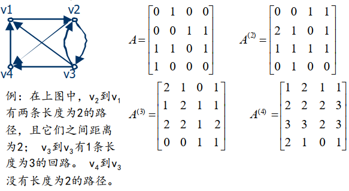
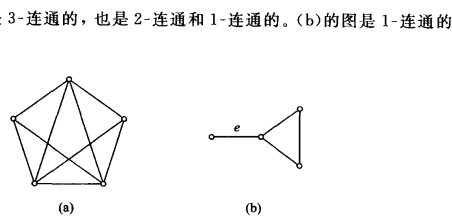

>   图：点+边+边与点的映射函数
>
>   连通性与判别
>
>   欧拉图与哈密尔顿图
>
>   二分图和平面图与欧拉公式
>
>   树及生成树
>
>   单源点最短路径：Dijkstra算法
>
>   对偶图

<!--more-->

# 4. 图论

## 4.1 图的基本概念

### 4.1.1 图

>   一个图G是一个三重组 $<V(G),E(G),\Phi_G>$ 
>
>   -   V(G)是一个非空的结点集合
>   -   E(G)是边的集合
>   -   关联函数$\Phi_G$ ：是从边集E与结点偶对间的映射函数

### 4.1.2 图的分类

#### 按边类型分类

有向图：每一条边都是有向边

-   有向边（弧）：边对应的偶对是有序的，用序偶对 $<a,b>$ 表示
    -   有向边的端点：弧的始点与终点

无向图：图中的每一条边都是无向的

-   无向边（棱）：偶对无序，用偶对 $(a,b)$ 表示

混合图：图中一些边是有向边，一些边是无向边

-   混合边：两结点间既有有向边，又有无向边，用 $[a,b]$ 表示

#### 结点间的边数

平行边

-   有向图：两结点间(包括结点自身间)，若同始点和终点的边多于一条，则这几条边称为平行边
-   无向图：两结点间（包括结点自身间），若多于一条边，则称这几条边为平行边

重数：两结点间互相平行的边的条数称为 [a,b] 的重数。注意有向图需要同始点同终点

多重图：含有平行边的图

线图：不含平行边的图

-   简单图：无自回路的线图
    -   平凡图仅有一个结点的简单图

#### 特殊的图

-   零图：全由孤立结点构成的图

    孤立结点：不与任何结点邻接的结点

-   含有自回路的图

    自回路：关联于同一结点的一条边

-   赋权图：边或结点上带有信息，用 三重组或者四重组 表示 $$<V,E,g>或<V,E,f,g>$$

    -   V：结点集合
    -   E：边的集合
    -   f：定义在边上的函数
    -   g：定义在结点上的函数

    如：

### 4.1.3 邻接关系

点的邻接：两结点间由边

边邻接：几条边关联于同一结点，则边邻接

### 4.1.4 有向图的底图

把有向图总的每条边都看做无向边，得到无向图，称为底图

### 4.1.5 结点的次数(度)

-   出度（引出次数）：有向图中，以结点v为始点的边的条数，记为 $deg^+(v)$

-   入度（引入次数）：有向图中，以结点v为终点的边的条数，记为 $deg^-(v)$ 

-   次数（度数）：结点v的引出次数和引入次数之和称为结点v的条数，记为 $deg(v)$
    -   孤立结点v的次数为零 

#### 定理

>   (n,m)图 ：n个结点m条边

**握手定理**：设G是一个(n,m)图，结点集合为 $\{v_1,v_2,...,v_n\}$ ，则

-   **度数之和是边数的二倍**：$\sum_{i=1}^n deg^+(v_i)+\sum_{i=1}^n deg^-(v_i)=2m$
-   在图中，次数为奇数的结点必为偶数个

>   正则图：各结点次数均相同的无向图，记为 **k-正则图**

如上图为3-正则图

### 4.1.6 图间的同构关系

>   图的同构：设 $G=<V,E>$ 和 $G'=<V',E'>$ 是两个图，若存在 V到V' 的双射函数 $\Phi$ ，使对 $\forall a,b\in V,[a,b]\in E$ 有 $[\Phi(a),\Phi(b)]\in E'$ ，并且 $[a,b]与[\Phi(a),\Phi(b)]$ 有相同的重数

**同构的必要条件：**

1.  结点数相等
2.  边数相等
3.  度数相同的结点数相等

但不能作为充分条件，如：

### 4.1.7 图的运算

设图 $G_1=<V_1,E_1>,G_2=<V_2,E_2>,G_2=<V_3,E_3>$ 

>   $G_1\cup G_2$ ： $V_3=V_1\cup V_2,E_3=E_1\cup E_2$ 
>
>   $G_1\cap G_2$：$V_3=V_1\cap V_2,E_3=E_1\cap E_2$ 
>
>   $G_1- G_2$：$E_3=E_1- E_2,V_3=(V_1- V_2)\cup \{E_3中边所关联的顶点\}$ 
>
>   $G_1\oplus G_2$：$G_3=(G_1\cup G_2)-(G_1\cap G_2)$ 
>
>   删去图中一个结点v：删去结点v与v关联的所有边

### 4.1.8 子图

#### 子图

设 $G=<V,E>,G'=<V',E'>$ 是两个图

>   子图： 如果 $V'\subseteq V且E'\subseteq E$ ，则称G'是G的子图
>
>   真子图：如果 $G'\neq G$ ，则称G'是G的真子图
>
>   生成子图：$V'=V且E'\subseteq E$ 
>
>   由边集E'导出的子图 $G[E']$：子图G'中没有孤立结点，G'由E'唯一确定
>
>   由结点集V'导出的子图 $G[V']$ ：子图G'中，对V'中的任意两结点u,v，当 $[u,v]\in E且[u,v]\in E'$ ，则G'由V'唯一确定

### 4.1.9 完全图与补图

完全图

-   在n个结点的有向图 $G=<V,E>$ 中，如果 $E=V\times V$ ，则G是有向完全图
-   在n各结点的无向图 $G=<V,E>$ 中，如果任何两个不同结点间都有一条边，则称G是无向完全图

补图

>   设线图 $G=<V,E>$ 有n个顶点，线图 $H=<V,E'>$ 也有同样的顶点，而E'是由n个顶点的完全图的边删去E所得，则图H称为G的补图

## 4.2 图的矩阵表示

设 $G=<V,E>$ 是一个有向线图。定义一个n阶方阵 $A(a_{ij})$ 为G的邻接矩阵，其中
$$
a_{ij}=\begin{cases}
1\quad <v_i,v_j>\in E\\
0\quad <v_i,v_j>\notin E\\
\end{cases}
$$
特殊图的邻接矩阵

零图：零矩阵，元素全为0

每个顶点都有自回路而无其他边：单位矩阵

G的逆图 $\widetilde{G}$：图G的矩阵A的转置矩阵 $A^T$

### 4.2.1 性质

若为有向简单图，则

-   A(G)不一定是对称的

-   对角线为0

-   第i行中值为1的元素数目等于 $v_i$ 的出度，第j列中值为1的元素数目等于 $v_j$ 的入度

    $\sum_{j=1}^na_{ij}=deg^+(v)\quad \sum_{i=1}^na_{ij}=deg^-(v)$

若G为无向简单图

-   A(G)是对称的

-   对角线为0

-   第i行中值为1的元素数目等于 $v_i$ 的度，第j列中值为1的元素数目等于 $v_j$ 的度

    $\sum_{j=1}^na_{ij}=deg^(v)\quad \sum_{i=1}^na_{ij}=deg^(v)$

### 4.2.2 矩阵运算的意义

#### $AA^T$

令 $B=[b_{ij}]=AA^T$

从结点 $v_i$ 和 $v_j$ 两者引出的边，如果能共同终止于一些结点，则这些终止结点的数目就是 $v_{ij}$ 的值

对角线上元素的值是各结点的出度

1.  i=2,j=3，$b_{23}=1$ 说明从 $v_2$ 和 $v_3$ 引出的边能共同终止与同一结点的只有一个
2.  i=2,j=2，$b_{22}=2$，说明 $v_2$ 的出度为2

#### $A^TA$

令 $B=[b_{ij}]=A^TA$ 

从一些结点引出的边，如果同时终于 $v_i$ 和 $v_j$ ，则这些结点的数目为 $b_{ij}$ 的值

对角线上元素的值就是结点的入度

1.  i=2,j=1，$b_{21}$ 说明以 $v_2$ 和 $v_1$ 为终点的边的共同始点只有一个
2.  i=2,j=2，$b_{22}$ 说明 $v_2$ 的入度为2

#### $A^{(n)}$

$A^{(n)}=a_{ij}^{(n)}$ 表示从 $v_i$ 到 $v_j$ 的长度为n的不同路径的数目

设矩阵 $Br=A+A^{(2)}+...+A^{(r)}$ ，$b_{ij}$ 表示从 $v_i$ 到 $v_j$ 的长度小于和等于r的不同路径总数

又由于简单有向图中，基本路径长度不超过 n-1，基本回路长度不超过n，则
$$
\begin{aligned}
&路径：B_{n-1}=A+A^{(2)}+...+A^{(n-1)}\\
&回路：B_{n}=A+A^{(2)}+...+A^{n}
\end{aligned}
$$
$b_{ij}$ 表明了结点间的可达性

### 4.3.3 可达矩阵

设 $G=<V,E>$ 是一个有向线图， $\mid V \mid = n$ ，n阶方阵 $P_{ij}=(p_{ij})$ ，其中
$$
\begin{aligned}
p_{ij}&=\begin{cases}
1\quad从v_i到v_j至少存在一条非零长度的路径\\
0\quad从v_i到v_j不存在一条非零长度的路径
\end{cases}\\\\
P&=A\vee A^{(2)}\vee ...\vee A^{(n)}
\end{aligned}
$$
则P为可达矩阵

#### 由可达矩阵求强分图

$p_{ij}=1$ 表示从 $v_i$ 到 $v_j$ 可达，$p_{ji}=p_{ij}^T=1$ 表示从 $v_j$ 到 $v_i$ 可达。仅当 $v_i$ 与 $v_j$ 互相可达时，才是连通。

当且仅当 $v_i$ 和 $v_j$ 相互可达时，$P^T\wedge P$ 的(i,j) 元素的值为1

## 4.3 路径与回路

**边不重，点不同；简单与基本**

>   从 $v_0到v_n$ 的路径：图的一个点边交替序列 $(v_0,e_1,v_1,...,e_n,v_n)$ ，
>
>   **简单**路径：同一条边不出现两次的路径
>
>   **基本**路径(链)：同一顶点不出现两次
>
>   回路：路径始点 $v_0$ 与 终点 $v_n$ 重合
>
>   **简单**回路：边不重复的回路
>
>   **基本**回路：通过各顶点的不超过一次的回路

如果是线图，路径P可以用顶点序列表示，称P穿程于顶点序列

路径的长度：路径P所含边的条数。

-   在有n个结点的简单图 $G=<V,E>$ 中，如果 $v_1$ 到 $v_2$ 有一条路径，则路径长度必不大于 n-1

-   在有n个结点的简单图 $G=<V,E>$ 中，如果经 $v_1$ 有一条简单回路，则经 $v_1$ 有一条长度不超n的基本回路

### 4.3.1 连通度与连通图

#### 无向图的连通

在无向图中，连通关系是等价关系，所以可以用连通关系划分无向图

##### 无向图可达

可达：设 $G=<V,E>$ 是无向图， $v_i,v_j\in V$ ，如果两点之间存在一条路径，则称 $v_j从v_i可达$

##### 无向图连通

连通：在无向图G中，如果任两个结点可达，则称G是连通的

-    连通分图：G的子图G'是连通的，且没有比G'更大的连通图，则G'是G的连通分图
    -   V上的 等价关系可达 导出的等价类构成的子图

##### 点割

>   一个无向简单图 $G=<V,E>,V'\subset V$ ，如果
>
>   (1) $\omega(G-V') > \omega(G)$ ；删去某些结点后，分图个数大于原图中的分图个数
>
>   (2) 不存在 V'的真子集 V''，使得 $\omega(G-V'')>\omega(G)$ ；生成分图的是最小删除结点数
>
>   ，则称V'是图G的**点割**。

当只删去一个点就形成分图，删除的点称为割点：当 V'={v}时，称 v 为割点

若有生成当前分图有更小的删去点集，则称为**泛点割**

-   泛点割中包含点割

###### 点连通度

>   $G=<V,E>$ 是无向简单连通图。G中含顶点数最小的点割的大小称为G的点连通度。

点连通度 $\kappa_0(G)$ ：使连通图变为不连通图或者平凡图必须删去的顶点数

k-点连通：$\kappa_0(G) \ge k$ ，G至少删去k个点才能变为不连通图 

-   完全图$\kappa_0(G)=n-1$，平凡图  $\kappa_0(G)=0$

##### 边割集

>   一个无向简单图 $G=<V,E>,E'\subseteq E$ ，如果
>
>   (1) $\omega(G-E') > \omega(E)$ ；删去某些边后，分图个数大于原图中的分图个数
>
>   (2) 不存在 E'的真子集 E''，使得 $\omega(G-E'')>\omega(E)$ ；生成分图的是最少删除边数
>
>   ，则称E'是图G的**割集**。

当只删去一条边就形成分图，删除的点称为割点：当 E'={e}时，称 e 为桥

若有生成当前分图有更小的删去边集，则称为**泛割集**

-   泛割集中包含割集

###### 连通度

>   $G=<V,E>$ 是无向简单连通图。G中含边数最小的割集的大小称为G的连通度。

连通度 $\kappa_1(G)$ ：使连通图变为不连通图或者平凡图必须删去的边数

k-连通：$\kappa_0(G) \ge k$ ，G至少删去k条边才能变为不连通图 

-   平凡图  $\kappa_1(G)=0$

#### 有向图的连通

##### 有向图的可达

可达：设 $G=<V,E>$ 是有向图， $v_i,v_j\in V$ ，如果两点之间存在一条路径，则称 $v_j从v_i可达$

##### 连通分类

强连通：任两个结点偶对中，两结点互相可达，则称G是强连通的

-   所有顶点都在一条回路上

单向连通：任两个结点偶对中，至少从一个结点到另一个结点是可达的

-   存在一条有向路径，穿程于图的全部结点

弱连通：一个有向图的底图是连通的，则G是弱连通的

##### 分图

强分图：在有向图 $G=<V,E>$ 中，G'是G的子图，G'是强连通的，没有比G'更大的强连通图

"在同一强分图中","在同一弱分图中"，是图的顶点集V上的等价关系，这个等价关系把V划分成若干个等价类，即分图

**强连通关系是等价关系**，所以可以通过强连通关系划分为强

##### 应用

死锁的检测

-   分配图：结点表示资源，边的始点表示占有，终点表示请求
-   用矩阵方法能够识别包含多于一个结点的强分图，从而检测出死锁状态

### 4.3.2 最短路径

结点间的距离 $d(v_i,v_j)$ ：在图 $$G=<V,E>$$ 中，从结点 $v_1$ 到 $v_j$ 最短路径的长度

-   有向图中， $d(v_i,v_j)$ 不一定等于 $d(v_j,v_i)$ ，但满足三角等式

    $d(v_i,v_j)\ge 0$

    $d(v_i,v_i)=0$

    $d(v_i,v_j)+d(v_j,v_k) \ge d(v_i,v_k)$

#### 带权图单源点最短路径

设 $$G=<V,E,W>$$ 是个带权图，W是从E到正实数集合的函数

路径P的长度定义为路径中边的长度之和，记为W(P)
$$
d(u,v)=
\begin{cases}
min\{W(P)|P为G中从u到v的路径\}\\
\infty 当从u到v不可达
\end{cases}
$$

##### Dijkstra算法(贪心)

单源点多汇点

(1)将V分成两个子集S，有源点a的集合S与没有源点a的集合T。各结点到源点a的距离向量D(x)是他们之间的直接距离W(a,x)

(2)根据D(x)从集合T中找出与源点距离最短的结点t，以t为中转更新T中剩余结点到a点的距离向量D(x)；

-   D(x)=min[D(x),D(t)+W(t,x)]；原先点a到点x的距离 与 到点t的距离+t与x之间的距离 的最小值

(3)将t并于S，T=T-{t}。若T=∅，则结束，反之执行(2)

##### Floyd(动态规划)

**适用场景**：无负权回路求 多源点多汇点间的最短路径

**原理**

1.  在一个图中，最短路径长度不会超过 n-1

2.  任意节点i与j的最短路径只有两种可能：

    (1) [i,j] 本身最短

    (2) 从i经过若干节点到j

    故其状态转移方程为 `path[i,j]=min{path[i,k]+path[k,j],path[i,j]}`

**步骤**

1.  初始状态：

    矩阵A：记录各结点间的直接距离

    矩阵P：A中不为无穷的点置1

    路径计数器k=-1,

    $A^{(k)}[i][j]$ 记录的是经过前k个顶点的最短路径

    $P^{(k)}[i][j]$ 记录经过前k个顶点的最短路径长度

2.  k++

    判断在已加入前k-1个结点基础上再加上 $v_{k-1}$ 中转是否使路径变短（除去第k行和第k列和主对角线上的元素，A矩阵中其余元素计算 $min\{A^{(k-1)}[i][j],A^{(k)}[i][j]\}$）。

    如果取 $A^{(k)}[i][j]$ ，则相应的令 $A^{(k)}[i][j]=A^{(k)}[i][j],P^{(k)}=P^{(k-1)}[i][j]+1$ ，

    否则令 $A^{(k)}[i][j]=A^{(k-1)}[i][j],P^{(k)}=P^{(k-1)}[i][j]$

3.  若k=n-1，停止；否则继续第二步

### 4.3.3 关键路径(动态规划)

单源点到单汇点的最长路径

>从源点到汇点，算最长路径有多长
>
>从汇点到源点，哪条路径是最长路径

1.  输入e 条弧 ，建立AOE-网存储结构

2.  拓扑排序，求得事件的最早开始时间，最后得到活动的最晚结束时间。从源点出发，源点的最早开始时间 `ve[0]=0` ，按拓扑有序求其余各顶点的最早开始时间 `ve[i]` 。如果得到的拓扑序列顶点数小于AOE网中的顶点数，则说明网中有环，无关键路径。
    
    -   拓扑排序：入度为0的点，若取出该点，删除以该点为始点的边
    -   最早开始时间 `ve[i]` 为源点到顶点i的最长距离
    
3.  逆拓扑排序，求得顶点的最晚开始时间。从汇点出发，令汇点的最晚开始时间等于最早开始时间 `vl[n-1]=ve[n-1]` ，依次求得各事件的最晚开始时间 `vl[i]`
    
    -   逆拓扑排序：出度为0的点，若取出该点，删除以该点为终点的边
    -   最晚开始时间 `vl[i]` 为顶点i的所有出边终点的最晚开始时间减去边的权值的最小值
    
4.  根据个顶点的 最早开始时间`ve[i]`和最晚开始时间`vl[i]`，求每个边的最早开始时间`e[i]`和最晚开始时间`l[i]` ，满足最早开始时间=最晚开始时间的边为关键路径

    活动的最早开始时间=活动始点事件的最早开始时间

    活动的最晚开始时间=活动终点事件的最晚开始时间-活动时间

### 4.3.4 欧拉路径与欧拉回路

欧**拉**：拉——边；**哈**密尔顿：口多——结点○

**无向连通图G**

>   欧拉路径：穿程于图G的每条 **边** 一次且仅一次的 **路径**
>
>   欧拉回路：穿程于图G的每条 **边** 一次且仅一次的 **回路**
>
>   欧拉图：具有欧拉回路的图

#### 充要条件

**无向连通图**

具有欧拉路径：当且仅当G中具有零个或两个奇数度的顶点

欧拉图：当且仅当该图的顶点次数都是偶数

**有向连通图**

具有欧拉路径：

-   每个顶点出度等于入度
-   路径起点：出度-入度=1，路径终点：入度-出度=1

具有欧拉回路：当且仅当每个顶点的出度等于入度

### 4.3.5 哈密尔顿图

>   哈密尔顿路径：在无向图 $G=<V,E>$ 中穿程与G的每个**结点**一次且仅一次的路径
>
>   哈密尔顿回路：穿程于G的每个结点一次且仅一次的回路
>
>   哈密尔顿图：含有哈密尔顿回路的图

#### 必要条件

删去的结点数大于等于删去结点后生成的分图数

设 $G=<V,E>$ 是哈密尔顿图，对V的每个非空真子集S，有 $\omega(G-S)\le \mid S \mid$ ，$\omega(G-S)$ 表示删去S后形成的连通分图个数

#### 充分条件

设 $G=<V,E>$ 是具有 $n\ge 3$ 个顶点的简单无向图，

-   若在G中**每一对**顶点的度数之和大于等于n-1

-   **每一个** 顶点的度数大于等于 $\frac{n}{2}$ 

则在G中存在一条哈密尔顿回路

## 4.4 二部图和平面图

### 4.4.1 二部图

若无向图 $G=<V,E>$ 的结点集合V可以划分为两个子集 X和Y ，使G中每一条边e，其一个端点在X中，另一个端点在Y中，则称 G是二部图或偶图

记为 $G=<X,E,Y>$ ,X和Y称为 互补结点子集。

-   二部图没有自回路

完全二部图：若**X的每一顶点都与Y的每一顶点邻接**，则称G为完全二部图

#### 充要条件

无向图G中的所有回路长度均为偶数

### 4.4.2 平面图

#### 相关概念

设 $$G=<V,E>$$ 是一个无向图，如果能把G的所有结点和边画在一个平面上，且使得**任何两条边除了端点外没有其他交点**，则G是一个平面图

面：设G施一个连通平面图，由图中的边所包围的区域，在**区域内既不包含图的结点，也不包含图的边**，这样的区域为图的一个面

边界：包围面的边构成的回路

面的次数：面的边界回路的长度，记为deg(r)

一个有限平面图，面的次数之和边数的两倍

#### 充要条件

欧拉公式：一个连通的平面图G，共有n个结点，m条边和k个面，则欧拉公式 n-m+k=2成立

顶点数-边数+面数=2

推论：

-   一个连通简单平面图，共n个结点，m条边，若 $n\ge 3$，则 $m\le 3n-6$

-   一个连通简单平面图，共n个结点，m条边，若每个平面至少四条边组成，则 $m\le 2n-4$
-   一个连通简单平面图，共n个结点，m条边，若每个平面至少s($s\ge 3$)条边组成，则 $m\le \frac{s(n-2)}{s-2}$

#### 库拉托夫斯基定理

在给定图G的边上，

插入一个新的度为2的结点，使一条边分成两条边

关联于一个度为2的结点的两条边，去掉这个结点，使两条边化为一条边

不会影响图的平面性

#### 对偶图

给定平面图 $G=<V,E>$ ，将其嵌入平面后：

-   在图G的每一个面 $D_i$ 内部作一个且仅做一个结点 $v_i^*$
-   经过每两个面 $D_i$ 与 $D_j$ 的每一边界 $e_k$ 做一条边 $e_k^*$ ，使 $e_k^*=(v_i^*,v_j^*)$ 与 $e_k$ 相交
-   当且仅当 $e_k$ 只是一个面 $D_i$ 的边界时，$v_i^*$ 恰好存在一个自回路 $e_k*$ 与 $e_k$ 相交

则称G*是G的一个对偶图

## 4.5 无向树

>   连通且无简单回路的无向图称为无向树
>
>   树中次数为1的结点称为树叶，次数大于1的结点称为分支点或内部结点
>
>   -   任何一棵树至少有两片树叶($n\ge 2$)
>
>   一个无向图的各连通分图大都是树时，该无向图称为森林

### 4.5.1 树的等价定义

-   无简单回路的连通图
-   无简单回路，且边数=结点数-1
-   连通且边数=结点数-1
-   无简单回路，但增加一条新边得到且仅得到一条基本回路
-   连通，但删去一条边后不连通
-   每一对结点之间有且仅有一条基本路径

### 4.5.2 生成树

#### 相关概念

>   在无向图G的一个生成子图T是一棵树，则T为G的生成树或支撑树

生成树T中的边称为树枝，图G中不在生成树中的边称为弦，所有的弦的集合称为生成树T的补

-   任何连通无向图至少有一棵生成树

-   无向连通图G有n个结点，m条边，G的生成树有 n-1条边。则要删除m-n+1条边。

    连通图G的秩：m-n+1

-   一个连通图可以生成许多树。确定一个回路后，可删除回路中不同的边，进而生成不同的树

-   一条简单回路和任何一棵生成树的补至少有一条公共边

    简单回路至少去掉一条边后才不构成回路

-   一个割集和任何生成树至少有一条公共边

#### 基本割集

生成树T中删去一条枝，将顶点集划分为两个子集（生成两个分图）。从G变为当前分图的边割集称为该枝对应的基本割集

### 4.5.3 最小生成树

设 $G=<V,E,W>$ 是连通简单无向带权图。

W(T)：T的生成树的树权

>   最小生成树：在G的所有生成树中，树权最小的生成树称为最小生成树

#### Kruskal(选边)

图中有n个结点

(1) 将边集划分为两个集合，T和E-T，边计数器 i=0

(2) 选择E-T中边权最小的边 $ e_k$ ，若加入 $e_k$ 后不会使T形成回路，则选择 $e_k$ 放入T，$E-T-\{e_k\}$ ，i++;

(3) 若 i < n-1，则执行(2)；T即为最小生成树

#### Prime(选点)

图中有n个结点

(1) 将结点集分为两个集合，T 和 V-T，并选定一个点加入S，点计数器i=1

(2) 在边集E中，找一条最小代价边，他的一个端点在T，另一个端在V-T中。

将该边不在T集的端点加入T集，V-T-{p}，i++

(3) 若i < n，执行第二步。

## 4.6 有向树

>   有向树定义：
>
>   有且仅有一个结点叫树根
>
>   除树根外，每一结点的入度都是1
>
>   树的每一个结点a,都有从树根到a的一条有向路径

### 4.6.1 相关概念

有序树：树中每一结点引出的边都规定次序的树，称为有序树

位置树：如果树中的每一结点的儿子不仅给出次序，还明确他们的位置，称为位置树。二叉树是位置树

有向森林：每个连通分图是有向树

有序森林：所有树都是有序树，且给树指定了次序

### 4.6.2 性质

-   设T是一棵有向树，根是r，并设a是T的任一结点，则从r到a有唯一的有向路径

-   有向树中的每一有向路径是基本路径

-   有向树没有非零长度的任何回路

-   有向树中，结点树=边数+1

-   有向树的子树是有向树

-   完全n元树，树叶与分支结点数的关系

    

### 4.6.3 带权二元树

>   给定一组权 $w_1,w_2,...,w_t$ ，设有一颗完全二元树有t片叶子，每个叶子上带有一个权值，则称该二元树为带权二元树、

带权路径长度：带权二元树中，带权为 $w_i$ 的树叶，其通路长度为 $L(w_i)$ ，将 $W(T)=\sum_{i=1}^{t} w_i·L(w_i)$ ，称为带权二元树的权。

在所有带权的二元树中，带权路径长度最小的那棵树称为**最优树**

#### 性质

设T为带权 $w_1≤ w_2≤ … ≤ w_t$ 的最优树， 则

-   带权 $w_1,w_2$ 的树叶 $v_{w_1},v_{w_2}$ 是兄弟；
-   以树叶 $v_{w_1},v_{w_2}$  为儿子的分枝点，是通路长度最长（ 层次最大） 的分枝点  

#### 哈夫曼编码

给定一个序列集合，若没有一个序列是另一个序列的前缀，则将该序列集合称为前缀码

任何一棵二元树的树叶可对应一个前缀码

任何一个前缀码都对应一棵二元树

