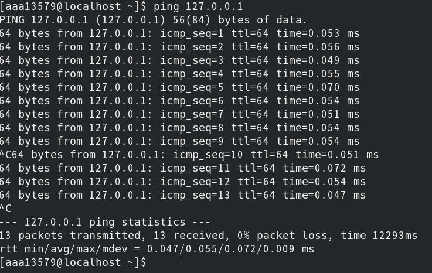

> Linux概念与操作

<!--more-->

## 分类

### 内核版(Kernel)

- 系统调用
- 终端命令

### 发行版(GNU)

> 包含桌面环境，办公套件，媒体播放器，数据库等软件

- Ubuntu
- Red Hat
- CentOS
- OpenSUSE
- Debian

## 文件和目录

### Linux目录结构

只有一个根目录，所有文件都在根目录下

| 根目录 | 子目录 |
| :----: | :----: |
|   /    |  /bin  |
|        |  /etc  |
|        | /home  |
|        |  /lib  |
|        | /user  |

多个用户在 `/home` 目录下建立各自专属的用户目录（用户名）

#### `/`

根目录

> 一个Linux下只有一个根目录
>

例如，在终端输入 `\home` ，表示从根目录开始，在进入 `home` 目录

```shell
cd / # 可进入根目录
```


#### /bin、/usr/bin

可执行二进制文件的目录，终端命令所在目录

> 常用命令 `ls、tar、mv、cat`


#### boot

放置linux启动时用到的一些文件

- linux内核文件 

  ```shell
  /boot/vmlinuz 
  ```

- 系统引导管理器

  ```shell
  /boot/grub
  ```


### /dev 

存放linux系统下的设备文件，访问该文件相当于访问某个设备

- 挂载光驱

``` python
mount /dev/cdrom/mnt

# 查看已挂载的光驱，若目录不存在，则需要先创建
mkdir -p /mnt/cdrom
```


### /etc

系统配置文件存放目录

- /etc/inittab
- /etc/fstab
- /etc/init.d
- /etc/X11
- /etc/sysconfig
- /etc/xinetd.d

### /home

系统默认的用户目录，新增用户时，都放于此目录下

`~` ：表示当前用户的家目录

`~edu` ：表示edu用户的家目录

### /lib、/user/lib、/user/local/lib

系统使用的函数库目录

### /opt

给主机额外安装软件所存放的目录

## 常用命令

### 命令格式

```sehll
command [-options],[parameter]
```

- command：命令名
- [-options] ：对命令进行控制
- [paramater]：命令行的可选参数

命令中，连续 `-` 可省略

### 常用命令

|       命令       |         全拼         | 作用                     |
| :--------------: | :------------------: | ------------------------ |
|        ls        |         list         | 查看当前文件加下内容     |
|       pwd        | print work directory | 查看当前                 |
|   cd [目录名]    |   change directory   | 切换文件夹               |
|  touch [文件名]  |        touch         | 如果文件不存在，新建文件 |
|  mkdir [目录名]  |    make directory    | 创建目录                 |
|   rm [文件名]    |        remove        | 删除指定的文件名         |
|      clear       |        clear         | 清屏                     |
| useradd [用户名] |       user add       | 新增用户                 |
| passwd [用户名]  |       password       | 为用户设置密码           |
|   su [用户名]    |     switch user      | 用户切换                 |

### 命令帮助参数

#### `--help`

```shell
command --help
```

- 显示当前指令 `command` 的帮助信息

#### `man`

```shell
man command
```

`man` ： 命令手册

- 使用 `man` 时常用操作键

  | 操作键 | 作用             |
  | :----: | :--------------- |
  | Space  | 下一屏           |
  | Enter  | 一次滚动手册一行 |
  |   b    | 回滚一屏         |
  |   f    | 下一屏           |
  |   q    | 退出             |
  | /word  | 搜索word字符串   |


### 自动补全

输入 `command` 的前几个字母，按 `Tab` 键

- 如果没有歧义则自动补全
- 存在其他命令，再按 `Tab` 会提示可能存在的命令

### 曾使用过的命令

按 `上/下` 键切换使用过的命令

退出执行，并且不执行当前选中的命令 `Ctrl+C`

### 文件(目录)命令

- Linux **文件** 或 **目录** 名称最长256字符
- 以 `.` 开头的文件为隐藏文件，需要 `-a` 参数才能显示
- `.` 代表当前目录
- `~` 表示上层目录

#### ls

> 列出目录下内容，相当于 `dir`

| 参数 |                  含义                  |
| :--: | :------------------------------------: |
|  -a  |       显示所有文件，包括隐藏文件       |
|  -l  |      以列表形式显示文件的详细信息      |
|  -h  | 配合 **-l** 以更人性化方式显示文件大小 |


##### ls通配符

| 通配符  | 含义                        |
| :-----: | :-------------------------- |
|   `*`   | 表示任意个数字符            |
|   `?`   | 代表任意一个字符，至少一个  |
|  `[]`   | 表示可以是字符组 的任意一个 |
| `[abc]` | 匹配a/b/c中的任意一个       |
| `[a-f]` | 匹配从a到f单位内的任意一个  |


#### `cd`

> 切换当前工作目录

| 命令  | 含义                   |
| :---: | :--------------------- |
|  cd   | 切换当前用户的主目录   |
| cd ~  | 切换当前用户的主目录   |
| cd .  | 当前目录               |
| cd .. | 上层目录               |
| cd -  | 在最近两次目录之间切换 |


##### 相对路径

> 在输入路径时，前面不是 `/` 或 `~` 则表示相对 **当前目录** 所在的目录位置

##### 绝对路径

> 从 **根目录/家目录** 开始的具体目录

#### 创建和删除

##### touch

> 创建文件或修改文件时间

- 如果文件不存在，创建空白文件
- 如果文件存在，则修改时间

##### mkdir

> 创建一个新的目录

`-p` ：递归创建目录

新建目录名称不能与当前目录中已有目录或文件同名


##### rm

> 删除文件或目录，不可重复

| 参数 | 含义                               |
| :--: | :--------------------------------- |
|  -f  | 强制删除，忽略不存在的文件，不提醒 |
|  -r  | 递归删除目录下的文件 **删除文件**  |

#### 拷贝和移动文件

|        命令        | 对应英文 | 作用                     |
| :----------------: | :------: | :----------------------- |
|   tree [目录名]    |   tree   | 以树状图列出文件目录结构 |
| cp 源文件 目标文件 |   copy   | 复制文件或目录           |
| mv 源文件 目标文件 |   move   | 移动文件/目录或重命名    |

##### tree

> 以树状图列出文件目录结构

| 选项 | 含义       | 作用       |
| :--: | :--------- | ---------- |
|  -d  | dictionary | 只显示目录 |

##### cp

> 将 源文件/目录 复制到 另一文件或目录

| 选项 | 含义                                                     |
| :--: | :------------------------------------------------------- |
|  -i  | 覆盖文件前提示                                           |
|  -r  | **给出源文件时目录**，递归复制该目录下的所有子目录和文件 |

```shell
cp -i 源文件 目标文件
cp -r 源目录 目标目录
```

##### mv

- 移动文件或目录
- 重命名文件或目录

| 选项 | 含义           |
| :--: | :------------- |
|  -i  | 覆盖文件前提醒 |

#### 修改文件内容

|        命令         |  对应英文   | 含义                                           |
| :-----------------: | :---------: | :--------------------------------------------- |
|     cat 文件名      | concatenate | 查看文件内容、创建文件、合并文件、追加文件内容 |
|     more 文件名     |    more     | 分屏显示文件内容                               |
| grep 搜索文本文件名 |    grep     | 搜索文本文件内容                               |

##### cat

- 一次显示所有内容，适合查看内容较少的文本文件

| 选项 | 含义               |
| :--: | :----------------- |
|  -b  | 跳过空白行编号     |
|  -n  | 对输出的所有行编号 |

```shell
nl 文件名 #与 cat -b 文件名 等价
```

##### more

适合查看文件内容较多的文件

基本操作：

| 操作            | 含义       |
| --------------- | ---------- |
| `回车、空格、p` | 查看下一屏 |
| `q`             | 退出查看   |
| `f`             | 回滚       |

##### grep

> 文本搜索工具

`grep [-option] [文件名]`

| 选项 | 含义                             |
| :--: | :------------------------------- |
|  -n  | 显示匹配行及行号                 |
|  -v  | 显示不含匹配文本的所有行(-n取反) |
|  -i  | 忽略大小写                       |

允许对文本文件进行正则查找

| 参数 | 含义                   |
| :--: | :--------------------- |
|  ^A  | 行首，搜索以a开头的行  |
| ke$  | 行尾，搜索以ke结尾的行 |

#### echo

> `echo` 会在终端显示参数指定的文字，通常和 **重定向** 联合使用

- 若重定向的文件不存在，则新建文件并写入内容

##### 重定向

Linux允许将命令执行结果重定向到一个文件，将本应在中断上输出的内容 **追加/输出** 到指定文件中

其中

- `>` ：表示输出，会覆盖文件原有内容
- `>>` ：表示追加，将内容追加到已有文件的末尾

```shell
echo Hello World > 123.txt #覆盖
cat 123.txt

echo Hello World >> 123.txt #追加
cat 123.txt
```


#### 管道

> 多个连续命令分隔符

`|` ：Linux允许将一个命令的输出作为另一个命令的输入，进行二次处理

**常用管道命令**

- `more` ：分配显示内容
- `grep` ：在执行结果基础上查询指定文本

```shell
ls -lha|more
ls -lha|grep -i vi
```

## 远程管理

### 关机/重启

`shutdown 选项 时间`

安全关闭或重启，默认一分钟后关闭主机

| 选项 | 含义     |
| :--: | :------- |
|  -r  | 重新启动 |
|  -c  | 取消关机 |

```shell
shutdown -r now
# 现在重启主机

shutdown now
# 现在关闭主机

shutdown 20:25
# 今天20:25关闭主机

shutdown +10
# 系统十分钟后关闭

shutdown -c
# 取消之前关闭计划
```

### 查看或配置网卡信息

|    命令     |           对应英文            | 作用                              |
| :---------: | :---------------------------: | :-------------------------------- |
|  ifconfig   | configure a network interface | 查看/配置计算机当前的网卡配置信息 |
| ping ip地址 |             ping              | 检测到目标ip地址的连接是否正常    |

#### ifconfig

> 查看/配置计算机当前的网卡配置信息

```shell
ifconfig

ifconfig|grep inet
```


#### ping

> 测试网卡是否可用

`ping 目标ip` ：检测目标ip主机

- 环回地址：127.0.0.1，指向本机的ip地址



- Ctrl + C 停止ping 

### SSH

> 通过 **SSH客户端** 可连接运行了 **SSH服务器** 的远程主机

#### 概念

> SSH：专为远程登录会话和其他网络服务提供安全性的协议

- 通过SSH协议防止远程管理过程中的信息泄露
- 对所有传输的数据进行加密，防止DNS欺骗和IP欺骗

SSH传输的数据可压缩，加快了传输速度

> 域名，端口号

```
ip:端口号
```

域名：用一串分号分隔，ip地址的别名，方便记忆

- 通过ip地址可以找到网络上的计算机

端口号：通过端口号可以找到计算机上运行的应用程序

|   服务    | 端口号 |
| :-------: | :----: |
| SSH服务器 |   22   |
| Web服务器 |   80   |
|   HTTPS   |  443   |
|    FTP    |   21   |

#### 操作

|            命令            |   对应英文   | 作用          |
| :------------------------: | :----------: | :------------ |
|       ssh 用户名@ip        | secure shell | 关机/重新启动 |
| scp 用户名@ip:文件名或录用 | secure copy  | 远程复制文件  |

##### ssh

```shell
ssh [-p port] user@remote Ip
# user:远程机器上的用户名，不指定的话默认当前用户
# remote：远程机器ip，可以是 ip/域名，或者别名
# port：SSH 服务器进程监听的端口，不指定，默认是22

ssh -p 22 Amos@172.16.140.133

exit #退出当前用户
```


在windows系统下，需要安装 `Putty` 或者 `XShell` 来建立远程连接

**PuTTY**: https://www.putty.org/
**XShell**：https://www.netsarang.com/zh/xshell/

##### scp

> Linux 下用来远程拷贝文件

- 地址格式与 `ssh` 基本相同
- 指定端口时， **`-P`** 是大写的

| 选项 | 含义                                                         |
| :--: | :----------------------------------------------------------- |
|  -r  | 给出的源文件是目录文件，将递归赋值该目下的所有子目录和文件，目标文件必须为一目录名 |
|  -P  | 若远程SSH服务器的端口不是22,需要用大写字母 P 来指定端口      |

```shell
# 将本地当前目录下的 01.py 复制到远程家目录下的 Desktop/01.py
scp -P port 01.py user@remote:Desktop/01.py

# 把远程家目录下的 Desktop/01.py 文件复制到本地当前目录下的 01.py
scp -P port user@remote:Desktop/01.py 01.py

# 加上-r 传输文件夹
scp -r demo user@remote:Desktop
```


##### FileZilla

> 文件传输软件

传输文件时，使用的是FTP服务，端口号设置为 `21`

##### 免密登录

在本地 `.ssh` 文件夹下登录远程服务器，保存SSH相关的配置信息

生成本地当前用户公钥

- 执行 `ssh-keygen` 即可生成SSH公钥，全部回车计科
- `id_rsa.pub` ：即本机公钥
- `id_rsa` ：即本机私钥

将公钥上传到服务器

- 执行 `ssh-copy-id-p port user@remote` ，让远程服务器记住公钥


**工作原理**

非对称加密算法

> 使用 **公钥** 加密的数据，需要私钥解密
> 使用 **私钥** 加密的数据，需要公钥解密

- 本地发送的数据，用私钥加密
- 服务器若保存有公钥，会对数据解密
- 数据处理完后用公钥加密，回传给本地

##### 配置别名

输入 `ssh username@ipaddress` 很繁琐
在 `~/.ssh/config` 里追加以下内容

```
Host newName
	HostName ip address
	User username
	Port port
```

保存之后，就可使用别名登录


## 用户管理

### 基本概念

> 用户管理包括 `用户管理` 与 `组管理`

#### 用户管理

- 可指定 **每一用户** 针对 **不同文件或目录** 的 **不同权限**

#### 权限

| 权限 |  英文  | 缩写 | 数字代号 |
| :--: | :----: | :--: | :------: |
|  读  |  read  |  r   |    4     |
|  写  | write  |  w   |    2     |
| 执行 | excute |  x   |    1     |

##### 权限查看


- **权限** 第一个字符如果是 d 表示目录

  

- **硬连接数** 多少种方式可访问当前目录/文件

- **拥有者** 家目录下 **文件/目录** 拥有者通常是当前用户

- **组**

- **大小**

- **时间**

- **名称** 

#### 组

> 对组设置权限，将 **不同用户添加到对应组中** ，同属一个组的用户有相同权限，不用逐个为用户单独设置权限

#### 超级用户

> `root` 账号通常用于 **系统维护和管理** ，对操作系统的所有资源具有访问权限

- 不推荐直接使用 `root` 账户登录系统
- 在Linux安装过程中，系统会自动创建一个标准用户账号

##### sudo

- **su** ：(substitute user) 缩写，表示切换用户

- `sudo` ：用来表示以其他身份执行命令，预设身份为 `root`
- 用户使用 `sudo` 时，必须先输入密码，之后五分钟的有效期，超过期限必须重新输入密码

未经授权的用户试图切换 `sudo` 会发出警告邮件

### 权限修改

- 文件拥有者默认有 **读/写** 权限
- linux中文本文件也可执行
- 目录有可执行文件才能执行

`chmod` 命令用于修改 **用户/组** 对 **文件/目录** 的权限

```shell
chmod +/-rwx 文件名/目录名

chmod -rw 01.py
chmod +rw 01.py

./01.py
```

### 组管理

> 创建 / 删除 组 需要通过 `sudo` 执行

|           命令            | 作用                      |
| :-----------------------: | :------------------------ |
|       groupadd 组名       | 添加组                    |
|       groupdel 组名       | 删除组                    |
|       cat/etc/group       | 确认组信息                |
| chgrp -R 组名 文件/目录名 | 递归修改 文件/目录 所属组 |

组信息保存在 `/etc/group` 文件中

`/etc` 目录用于保存系统配置信息的目录

```shell
mkdir Python学习
sudo groupadd study
sudo chgrp -R study Python学习
```

### 单用户

> 创建用户/删除用户/修改其他用户密码 都需要通过 `sudo` 执行

|             命令              | 作用         | 说明                                                         |
| :---------------------------: | :----------- | :----------------------------------------------------------- |
| useradd -m -g 组名 新建用户名 | 添加新用户   | -m 自动创建用户家目录 <br> -g 指定用户所在组，否则会创建一个同名的组 |
|         passwd 用户名         | 设置用户密码 | 普通用户，直接用passwd可以修改自己密码                       |
|       userdel -r 用户名       | 删除用户     | -r 自动删除家目录                                            |
|        cat /etc/passwd        | 确认用户信息 | 新建用户后，用户信息会保存在 `/etc/passwd` 文件中            |

创建用户时，如果忘记加 `-m` 指定家目录，最简单的方法就是删除用户重新创建


### 查看用户信息

|    命令     | 作用                       |
| :---------: | :------------------------- |
| id [用户名] | 查看用户UID和GID           |
|     who     | 查看当前所有登录的用户列表 |
|   whoami    | 查看当前登录用户的账户名   |


#### id

> `id` 不加参数，则返回当前用户信息


#### passwd文件

> 在 `/etc/passwd` 文件中存放用户的信息


1. 用户名
2. 密码（x，表示加密的密钥）
3. UID（用户标识）
4. GID（组标识）
5. 用户全名或本地账号
6. 家目录
7. 登录使用的Shell，就是登录之后，使用的终端命令

### usermod

> 设置用户所属的组 （主组/附加组）和 登录shell

主组：新建用户时指定

附加组：用于指定用户的附加权限

```shell
# 修改用户的主组(passwd 中的GID)
usermod -g 组 用户名

# 修改用户的附加组
usermod -G 组 用户名

# 修改用户的登录Shell
usermod -s /bin/bash
```

### which

`/etc/passwd` ：用于保存用户信息文件

`/user/bin/passwd` ：用于修改用户密码程序

`which` ：查看执行命令所在的位置

```shell
which ls
# 输出
# /bin/ls

which useradd
# 输出
# /user/sbin/useradd
```

#### /bin和/sbin

绝大多数可执行文件都保存在 `/bin` ，`/sbin` ，`/user/bin` ，`/user/sbin` 中

`/bin(binary)` 目录是二进制的可执行文件目录

`/sbin(system binary)` 是系统管理员专用的二进制代码存放目录，主要用于系统管理

`/user/bin(user commands for application)` 用于存放后期安装的软件

`/user/sbin(super user commands for application)` 超级用户的一些管理程序

### 用户身份切换

|    命令     |          作用           | 说明                 |
| :---------: | :---------------------: | :------------------- |
| su - 用户名 | -切换用户，并且切换命令 | 可以切换到用户家目录 |
|    exit     |    退出当前登录账户     |                      |

`su` 不接用户名，可以切换到 `root` 用户

### 修改文件权限

| 命令  | 作用       |
| :---: | :--------- |
| chown | 修改拥有者 |
| chgrp | 修改组     |
| chmod | 修改权限   |

```shell
# 修改文件|目录拥有者
chown 拥有者用户名 文件名|目录

# 递归修改文件|目录的组
chgrp -R 组名 文件|目录

# 递归修改文件权限
chmod -R 755 文件名|目录名
```

#### chmod

```shell
# 直接修改 文件|目录 的 读|写|可执行， 但是不能精确到 拥有者|组|其他
chomd +/-rwx 文件名|目录名
```

> 在设置权限时，可以简单使用三个数字分别对应 **拥有者/组** 和 **其他** 用户权限

|      |      | 拥有者 |      |      |  组  |      |      | 其他 |
| :--: | :--: | :----: | :--: | :--: | :--: | :--: | :--: | :--: |
|  r   |  w   |   x    |  r   |  w   |  x   |  r   |  w   |  x   |
|  4   |  2   |   1    |  4   |  2   |  1   |  4   |  2   |  1   |

|  4   |  2   |  1   |  7   | rwx  |
| :--: | :--: | :--: | :--: | :--: |
|  4   |  2   |  0   |  6   | rw-  |
|  4   |  0   |  1   |  5   | r-x  |
|  4   |  0   |  0   |  4   | r--  |
|  0   |  2   |  1   |  3   | -2x  |
|  0   |  2   |  0   |  2   | -w-  |
|  0   |  0   |  1   |  1   | --x  |
|  0   |  0   |  0   |  0   | ---  |

## 系统信息

> 查看服务器上当前 **系统日期和时间 / 磁盘空间 / 占用情况 / 程序执行情况**

- 时间和日期：date，cat
- 磁盘和目录空间：df，du
- 进程信息：ps，top，kill

###  时间和日期

| 命令 | 作用                                        |
| :--: | :------------------------------------------ |
| date | 查看系统时间                                |
| cal  | calendar 查看日历，-y选项可以查看一年的日历 |


### 磁盘信息

|     命令      | 作用                            |
| :-----------: | :------------------------------ |
|     df -h     | disk free 显示磁盘剩余空间      |
| du -h[目录名] | disk usage 显示目录下的文件大小 |

| 参数 | 含义                |
| :--: | :------------------ |
|  -h  | K为单位显示文件大小 |

### 进程

> 当前正在执行的程序

|        命令         | 作用                                                      |
| :-----------------: | :-------------------------------------------------------- |
|       ps aux        | process status 查看进程的详细状况 aux为选项  不需要加 `-` |
|         top         | 动态显示运行中的进程并排序                                |
| kill [-9] PID进程号 | 终止指定进程号的进程  [-9]表示强行终止                    |

- `ps` 只显示当前用户通过终端启动的应用程序


| 选项 | 含义                                     |
| :--: | :--------------------------------------- |
|  a   | 显示终端上的所有进程，包括其他用户的进程 |
|  u   | 显示进程的详细状态                       |
|  x   | 显示没有控制终端的进程                   |

- 退出 `top` ，直接输入 `q`
- 使用 `kill` 命令时，最好只终止由当前用户开启的进程，不要终止以 `root` 身份开启的进程，否则系统崩溃

## 其他命令

- 查找文件：find
- 文件链接：ln
- 打包和压缩：tar
- 软件安装：apt-get

### 查找文件

`find` ：通常用来在 **特定的目录下搜索** 符合条件的文件

|           命令           | 作用                                          |
| :----------------------: | :-------------------------------------------- |
| find [路径] -name "*.py" | 查找指定路径下扩展名为 .py 的文件，包括子目录 |

- 如果省略路径，表示在当前文件夹下查找


### 文件链接

#### 软链接

|           命令           | 作用                                                 |
| :----------------------: | :--------------------------------------------------- |
| `ln -s` srcfile destfile | 建立文件的软链接，类似于 `Windows` 下的 **快捷方式** |

1. 没有 `-s` 选项时，建立的是一个硬链接文件

   两个文件占用相同大小空间

2. srcfile 必须是绝对路径，不能使用相对路径，为了移动链接文件位置后，还能使用


#### 硬链接

在使用 `ln` 创建链接时，如果没有 `-s` ，创建的是硬链接

此时相当于创建了一个 **副本**


#### 软硬链接区别

软链接：链接的是文件名

硬链接：相当于文件副本名

### 打包压缩

- Windows 系统常用  `rar` 格式文件
- Mac 系统常用 `Zip` 格式文件
- Linux 系统常用 `tar.gz` 

#### 打包/解包

`tar` 把一系列文件打包到一个大文件中，也可以把一个打包的大文件恢复成一系列小文件

```shell
# 打包文件
tar -cvf 打包文件 .tar 被打包文件/路径

# 解包文件
tar -xvf 打包文件
```

| 选项 | 含义                                                    |
| :--: | :------------------------------------------------------ |
|  z   | 调用gzip,直接压缩                                       |
|  j   | 调用bz2,直接压缩                                        |
|  c   | 生成档案文件，创建打包文件                              |
|  x   | 解开档案文件                                            |
|  v   | 列出归档文件的详细过程,显示进度                         |
|  f   | 指定档案文件名称，f后跟的一定是 *.tat* 文件，必须在最后 |
|  C   | 指定路径                                                |

**步骤**

1. 将含有 `01` 的文件打包成一个 `.tar` 文件
2. 新建 `tar` 目录，并且将 `01.tar` 移动到 `tar` 目录下
3. 解包 `01.tar` 


#### 压缩/解压缩

`tar` 与 `gzip` 结合使用实现文件 **打包和压缩**

- `tar` 只负责打包文件，但不压缩
- 用 `gzip` 压缩 `tar` 打包后的文件，其扩展名为 `.tar.gz`

在 `tar` 命令中有一个选项 `-z` ，可以调用 `gzip` ，从而方便的实现压缩和解压缩功能

```shell
# 压缩文件
tar -zcvf 打包文件.tar.gz 被压缩文件/路径

# 解压缩文件
tar -zxvf 打包文件.tar.gz

# 解压缩到指定路径
tar -zxvf 打包文件.tar.gz -C 目标路径
```

| 选项 | 含义                                           |
| :--: | :--------------------------------------------- |
|  -C  | 解压缩到指定目录，注意：要解压缩的目录必须存在 |

```shell
# 压缩文件
tar -zcvf 打包文件.tar.gz 被压缩的文件/目录...

# 解压缩
tar -zxvf 打包文件.tar.gz

# 解压缩到指定路径
tar -zxvf 打包文件.tar.gz -C 目标路径
```

**步骤**

1. 压缩
2. 移动
3. 解压


#### bzip(two)

- `tar` 与 `bzip2` 命令结合可以使用实现文件 **打包和压缩**
  - `tar` 只负责打包文件，不压缩
  - 用 `bzip2` 压缩 `tar` 打包后的文件，其扩展名一般用 `xxx.tar.bz2`
- tar 中有 选项 `-j` 可以调用 `bzip2` ，从而方便实现压缩和解压缩

```shell
# 压缩文件
tar -jcvf 打包文件.tar.bz2 被压缩的文件/路径
# 解压缩文件
tar -jxvf 打包文件.tar.bz2
```

### 软件安装

- `apt` 是 **Advanced Packaging Tool** ,Unbuntu下安装包管理工具
- `yum` 是 **Advanced Packaging Tool** ,CentOS下安装包管理工具 
- 可以在终端中方便 **安装/卸载/更新安装包**

```shell
# 安装软件
sudo yum install 软件包

# 卸载软件
sudo yum remove 软件包

# 更新已安装的包
sudo yum upgrade
```

### 配置软件源

- 通过 **设置镜像源** ，选择一个访问更快的服务器，提供软件下载/安装服务
- 更换服务器之后，需要比较长的更新过程

> 所有服务器的内容是相同的（镜像），但根据所在位置不同，国内服务器速度通常快一些
