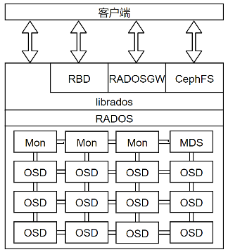

[TOC]

<!--more-->

Ceph集群由几个相互独立的不同软件守护进程组成，每个守护进程负责Ceph的一个独特功能并将值添加到相应的组件中。



## 1.1 Ceph RADOS

> RADOS(Reliable Automatic Distributed Object Store)是Ceph的核心，Ceph的底层存储服务是由多个主机组成的 **可靠的、自动的、分布式对象存储集群**  

- Ceph中的一切都以对象的形式存储，RADOS负责存储这些对象，不考虑数据类型

从 **层次结构** 上看，RADOS在最下部，完全处于Ceph集群的内部，没有提供给客户端直接接口，由librados提供面向所有客户端的接口

从 **功能** 上看，RADOS层确保数据的一致性和可靠性，分布式对象存储、高可用、高可靠性、没有单点故障、自我修复和自我管理以及Ceph数据访问方法（RBD、CephFS、RADOSRGW、librados）的所有操作都是在RADOS层之上构建的。

- 跨集群存储 ：当Ceph集群接收到客户端的写请求时，CRUSH算法首先计算出存储位置，然后这些信息传递给RADOS层进一步处理。基于CRUSH规则集，RADOS以小对象的形式将数据分发给集群中的所有节点，最后将这些对象存储在OSD中

- 可靠性：当配置副本数大于1时，RADOS负责数据的可靠性：复制对象、创建副本、并通过CRUSH算法将副本存储到不同的故障区域中。默认副本数为3

- 一致性：在对象不一致的情况下，RADOS会利用剩下的副本自动执行数据复制、故障检测和恢复，数据在集群节点间的迁移和再平衡。对用户而言是透明的。进而为Ceph提供了自我管理和自我修复的能力

```shell
rados lspools #查看RADOS池
rados -p metadata ls #查看池中的对象
rados df # 查看集群空间的使用情况
```

RADOS包含两个核心组件：OSD和monitor

### 1.1.1 OSD

> **OSD（Object Store Daemon）由一个已经存在Linux文件系统的物理磁盘驱动器和OSD服务(dameon)组成** ，

通常每个OSD由单个存储设备支持，可以是HDD或SSD，也可以是混合

- 用HDD存储数据
- 用SSD（或SSD分区）存放元数据

OSD数量与存储数据量、每个设备的大小、冗余级别和复制策略有关
$$
num_{OSD}=f(数据量,容量/设备,冗余级,复制策略)
$$

#### 功能

> 存储数据，处理数据复制、恢复、重新平衡，并通过检查其他 Ceph OSD守护进程的心跳来向Ceph监视器和管理器提供一些监控信息。

##### 存储用户数据

> OSD负责将实际的数据以对象的形式存储在每一个集群节点的物理磁盘驱动器中。

Ceph集群中大部分集群是由OSD守护进程完成的。存储用户数据是真正耗时的部分。

通常一个OSD守护进程与集群的一个物理磁盘绑定（OSD守护进程数=物理磁盘数）

- 也可以为每个主机、每个RAID卷、每个物理磁盘部署一个OSD守护进程

##### 响应客户端的读写请求

> OSD是Ceph集群中存储实际用户数据并响应客户端读写请求的唯一组件

**读写流程** ：客户端首先向monitor请求集群的map。然后，无需monitor的干预直接与OSD进行IO操作

- 数据事务处理速度快源于客户端能直接写入存储数据的OSD而没有额外的数据处理层

##### 跨节点复制

> Ceph通过跨集群节点复制每个对象多次来提供可靠性、高可用性、容错性和数据一致性

OSD上的每个对象都有一个主副本和几个辅副本，辅副本分散在其他OSD上

- 每一个OSD对于一些对象是主副本，对于其他对象而言是辅副本。
- 存放辅副本的OSD受主副本控制

当磁盘发生故障时，OSD的守护进程会自动与其他OSD通信，从而开始执行恢复操作：主副本存放在故障磁盘的对象，会将其辅OSD提升为主OSD，并生成新的副本分布

#### RAID不适合作为OSD

在默认情况下，Ceph为了保护数据，会在内部执行复制，而对副本数据再做RAID只会增加复杂性

对于故障恢复，RAID需要一个相同类型的空闲磁盘才能开始执行，在数据恢复过程中，必须等待整个磁盘中的数据全部写入新的磁盘，花费大量时间

而Ceph依赖复制，在恢复操作中，基于复制级别和归置组，几乎所有的集群节点都参与数据恢复，使得恢复操作更快

由于RAID5和RAID6的随机IO速度很慢，可能会有性能问题

当然，当每个主机都有相当多的物理磁盘，而且一般每个OSD对应一个守护进程，所以此时可以把几个磁盘组成一个RAID卷，然后在这个卷上创建OSD，将减少OSD数量

- 推荐为每个OSD分配2GB内存

#### OSD命令

```shell
service ceph status osd #检查单节点上OSD状态
service ceph -a status osd # 查看整个集群的OSD状态，ceph.conf文件必须包含所有OSD的主机信息
ceph osd ls #检查所有OSD的ID
ceph osd stat #检查OSD map和状态
ceph osd tree # 检查OSD树形图
```

### 1.1.2 Ceph monitor

Ceph Monitor 组件以守护进程的形式存在，通过一系列的map来维护集群成员状态、对等节点状态以及集群配置信息（OSD、Mon、PG、CRUSH）

- 所有集群节点向monitor报告状态，并分享每个状态变化的信息，基于paxos协议实现节点间的消息同步
- 负责管理守护进程和客户端之间的身份验证

monitor为每一个组件维护一个独立的map

客户端、集群其他节点定期与monitor确认自己是否持有最新的map

#### monitor进程

monitor是轻量级的守护进程，通常不需要大量的系统资源

- 需要足够的磁盘空间来存储集群的日志，包括OSD、MDS和monitor的日志

  健康状态的集群日志在几兆字节到几千兆字节之间

  - 小型集群：几GB
  - 大型集群：十GB到百GB
  
  开启调试模式，集群的日志存储需求会显著增加，可能需要几个T的磁盘空间存储日志

#### monitor集群

一个典型的Ceph集群通常包含多个monitor节点。

多monitor的Ceph架构使用了仲裁(quorum)，使用Paxos算法为集群提供了分布式决策机制。

自monitor开始仲裁操作，至少需要保证一半以上的monitor始终处于可用状态，防止其他系统看到脑裂问题

至少需要三个monitor节点提供高可用性

```shell
ceph dameon mon.[monname] mon_status
{
	"state":"leader" #表示当前节点为集群的leader节点
}
```

**最佳实践**

若monitor服务与OSD服务运行在同一节点上，需要更多CPU、内存和更大的系统磁盘来监控日志

在存储规划阶段，也应该考虑物理机架的布局。应该将monitor节点分散到不同的故障域中

#### monitor相关指令

```shell
service ceph status mon#检查monitor服务的状态
ceph mon stat
ceph mon_status
ceph mon dump
```

### 1.1.3 manager

> Ceph管理器（守护进程ceph-mgr）负责跟踪运行时指标和Ceph集群的当前状态，包括存储利用率、当前性能指标和系统负载。

Ceph管理器守护进程还托管基于Python的模块来管理和公开Ceph集群信息，包括基于Web的ceph仪表板和RESTful API。

基于raft协议实现节点间信息同步

- 高可用：2个以上

### 1.1.4 librados

librados是一个本地C语言库，提供了Ceph集群(RADOS)的一个本地接口，通过librados库可以简化访问RADOS的方法

1. librados是其他服务接口的基础，如Ceph块设备、Ceph文件系统和Ceph RADOS网关

   为CephFS提供POSIX接口

2. 应用程序可以扩展本地协议以便通过librados直接连接到RADOS

   在librados支持下与RADOS通信，提供了丰富的API支持(C++,Java,Python,Ruby,PHP)，允许应用程序直接、并行地访问集群，没有HTTP开销

3. librados 提供丰富的API子集，高效地在一个对象中存储键/值对，并通过对象实现客户端之间通信的支持

   通过同时更新数据、键和属性来支持atomic-single-object事务

