[TOC]

<!--more-->

## 6.1 存储系统的典型场景

### 6.1.1 性能与成本

对于存储系统而言，性能与成本就像天平的两个极端：追求极致的性能必然伴随着高昂的存储成本，而系统成本的节约必然伴随着性能指标的相形见绌。不同企业有着不同的存储工作负载，需要在性能、容量和总拥有成本（total cost of ownership，TCO）之间做出权衡。

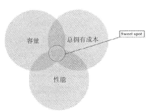

极低的成本、极致性能以及成本与性能较为均衡的缓存方案，这三种场景基本可以覆盖绝大多数用户业务应用的需求。

- 低成本冷存储，业界通常使用高比例纠删码、压缩、SMR叠瓦式磁盘以及大容量磁盘、大盘位服务器等技术方案，通常在对象存储领域使用较多。今年来，存储池休眠技术（磁盘休眠/唤醒功能）及基于蓝光存储等实现光/磁融合存储系统有了商用案例
- 高性能存储，通常使用NVMe SSD、Optane SSD等高性能存储介质，配合磁盘多分区域构建Ceph的OSD服务，提升磁盘的性能输出，以上技术方案通常在块存储领域使用较多
- 缓存方案是在高速的SSD存储介质与低速的HDD存储介质之间构建起连接，基于存储方案的存储系统，求成本与性能介于低成本冷存储方案与高性能存储方案之间

### 6.1.2 低成本冷存储

可按照I/O要求，分为不同的存储类别产品

- 3年内数据可实时调用
  - 热存Online对象存储：I/O在任何时间可直接使用，包括RAM、SSD或磁盘
- 3~5年内数据可查，数据被激活到可读的时间为数小时内
  - 冷存Nearline对象存储：并不直接可用，但可在无人工干预的情况下迅速从近线到在线，速度非常快，包括自动磁带库及MAID（massive array of idle disks）的降低转速技术
- 5年以上数据可查：JBOD整体下架保存
  - 离线盘Offline：不直接可用，从离线到在线需要人工干预，如USD、DVD或其他可卸载设备

不同存储类型产品的速度差异

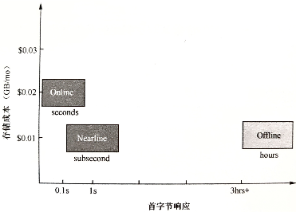

#### 冷存储需求和意义

智能互联网时代，数据正以几何级的数量爆炸增长，如何存储并管理这些海量数据，是很多企业面临的难题。若采用传统通用型服务器存储策略，就意味着要建设庞大的数据中心系统，导致存储成本极速攀升。为了进一步降低企业存储数据的成本，把不常访问的、较旧的冷数据迁移到专为存储冷数据而设计的低成本存储层中——即冷存储。冷存储，通常意味着数据不会经常被访问，也或许永远不会被访问，但用户还是希望保留。

对于冷存储，AWS有Glacier产品线，Google有Nearline Storage产品线。

在2019年之前，AWS有单独的冷存储（归档存储）产品线Glacier，现在Glacier已经合并到对象存储产品线中，全称是AWS S3 Glacier，与S3的多个存储类别实现整合。S3支持完整的数据生命周期管理功能，这个功能同样覆盖了Glacier：支持直接写入温存储或者冷存储。

Facebook的冷存储数据中心功耗只有正常数据中心的六分之一，通过分离频繁访问的内容可以节省更多的电力开销。Facebook冷存储支持将对象存储中的文件通过设定固定时间期限的方式，自动迁移到冷存储。整个冷存储系统是作为其他系统出现数据丢失时最后一个可以恢复的数据源而存在的。

#### 冷存储设计

##### 硬件

冷存储系统的目标就是提高经济效益，降低成本。

- 在设备首次采购成本方面，冷存储更加关注机柜与硬盘。

  在单位机柜中放更多的硬盘，正常的4U48盘位密度太低，需要引入JBOD（Just a Bunch Of Disks）设备，通常一个4U服务器满配下加带6个JBOD设备，每个JBOD最多可放置102块硬盘（如果机架可以支持8个高密度JBOD，则可以接近安装1000块磁盘）。

  在单位硬盘下提供更大的容量，采用PMR技术，单盘最大容量可达到12TB，引入SMR技术，单盘最大容量可以支持18TB甚至更高。

- 在运营成本方面，电力开销的主要来源是磁盘转动的功耗。

  为了尽可能地降低电费，在运营维护过程中应该关闭不必要的磁盘，只让最少数的磁盘维持转动，支持存储池级别的休眠，移除所有的冗余电源。

  冷数据的主要特征是访问频次很低，如果磁盘上的数据局部合理，大多数磁盘可以脱机。每个托盘(tray)同时只有一个设备上电，只有部分磁盘提供读/写服务。

AWS Glacier基于磁带库构建，利用旧设备，缓解设备采购成本

Google的Nearline Storage，基于磁盘的，通常是SATA，功耗低，主要是为了获取数据时速度更快，数据能更快地在不同的存储层级之间移动

##### 软件

软件设计的首要目标是保持系统持久性，避免单点故障。当系统出现异常后，仅需要调用少量资源就会可恢复数据

- SMR技术

  采用新型磁存储技术的高容量磁盘。SMR盘将盘片上的数据磁道部分重叠，大大提高磁盘存储密度。

  SMR不再支持随机写和原地更新写（新入的磁道会覆盖与之重叠的所有磁道），只能进行顺序追加写

  存储引擎需要开发单机存储引擎来专门支持SMR磁盘

- 存储池休眠/唤醒技术

  大规模空闲空闲磁盘阵列技术（MAID），降低功耗的最佳选择

- 纠删码技术

##### 纠删码

保障数据可靠性最流行的方法之一就是复制。复制方法通过将多份相同的数据存储在不同的物理位置保证数据的可靠性

就性能和可靠性而言，复制方法也被证明是一种很好的方法，但增加了系统的整体成本

- 采用复制的方法，需要两倍的存储空间来提供冗余

> 纠删码 ：将存储对象分割为数据块的片段，再对这些数据块进行扩展并编码生成校验块，最后将生成的校验块存储在Ceph集群的不同故障域中，实现数据保护

- 纠删码从Ceph的F版开始引入

###### 纠删码原理

Reed-Solomon(RS)码是存储系统中常见的一种纠删码
$$
RS(k,m)=n=k+m
$$

- k：将原始数据分割后的数据片段数目
- m：为了提供数据保护而在原始数据块中额外引入的编码，也就是校验块
- n：纠删码运行后生成的数据块总数

启用了纠删码的Ceph池中的每个对象都将存为 $k+m$ 个块，每个块都存储在acting集合的不同OSD中

**恢复** ：在Ceph恢复期间，需要n个块中的任意k个块来恢复数据

**可靠性级别** ：使用纠删码，可以容忍 m 个块的数据丢失

**编码率** ：$r=\frac{k}{n}$ 

**存储需求** ：通过 $\frac{1}{r}$ 计算

---

如：使用纠删码 (3,2) 规则创建5个OSD的Ceph池

则每个对象除了自己本身分割为三个数据块外，还需要额外添加两个校验块，这5个数据块分别存储在Ceph集群的纠删码池的5个OSD中。一旦发生故障，构建原始文件时，只需要3个块就可以恢复

此时 $编码率r=\frac{k}{n}=\frac{3}{5}<1$ ，$存储需求=\frac{1}{r}=\frac{5}{3}\approx 1.6倍原文件$

即允许两个以内的OSD出错，

若以副本形式保证部集群的可靠性。允许两个以内的OSD出错，则需要一个复制级别为3的池，最终需要3GB的存储空间来存储1GB的数据

###### 纠删码分析

**慢** ：基于纠删码机制存储数据的速度比复制方法慢

纠删码对于存储成本的节省是以性能损耗为代价的，因为纠删码工作过程中会把每个对象分为多个较小的数据块，并且一些新的校验块会与数据块混合在一起。这些块还需要分布在不同的故障域中。

整个过程需要消耗OSD大量的算力，且在恢复时，解码数据块也需要大量的计算

| 两种技术      | 磁盘利用率      | 计算开销 | 网络消耗 | 恢复效率 |
| ------------- | --------------- | -------- | -------- | -------- |
| 多副本(3副本) | $\frac{1}{3}$   | 几乎没有 | 较低     | 较高     |
| 纠删码(k+m)   | $\frac{m}{k+m}$ | 高       | 较高     | 较低     |

###### 纠删码插件

使用不同的插件可以创建不同的纠删码profile

**Jerasure**

通用和灵活，Ceph存储池默认的插件，封装了Jerasure库。

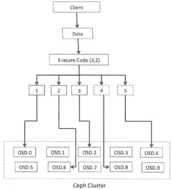

使用Jerasure插件，当一个OSD丢失的话，恢复数据需要从所有其他OSD上读取数据。举例来说，如果Jerasure配置为k=3，m=2，丢失一个OSD需要读取所有5个OSD才能修复，这对数据恢复过程而言并不高效。

**LRC**

本地可修复的纠删码插件，Locally repairable erasure code plugin

由于Jerasure不能有效地做数据恢复，LRC采用本地校验的方法改进，LRC为单个OSD故障做了优化

创建本地校验块，可以从更少的OSD上恢复数据

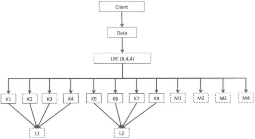

K=8，m=4，l=4

将原始数据分为8个块，生成4个校验块，每个本地校验块L通常用于4个数据块的校验

当数据丢失时，只需要l个数据恢复

- 假设K3丢失，用 K1 、K2、K4和L1中恢复数据

**SHEC**

瓦式纠删码，Shingled erasure code plugin

对于多个OSD故障，LRC存在开销

- 对于K3,K4同时丢失，需要从K1、K2、L1、M1中恢复

SHEC目的是有效处理多个磁盘故障，本地校验块校验彼此重叠部分


若K6和K9丢失，则使用M3，M4，K5，K7，K8，K10作为校验块

###### Ceph中创建纠删码池

通常情况下，适合低成本冷存储的数据会与复制池绑定在一起，数据先存储在速度更快的复制池中，等一定周期内无法访问，则被写回到低成本的纠删码池中

创建 erasure 类型的Ceph池实现纠删码池

基于纠删码配置文件创建，这个配置文件定义了纠删码的特征值

**创建纠删码配置文件**

```shell
指令格式：ceph osd erasure-code-profile set [纠删码配置文件名] ruleset-failure-domain=osd k=3 m=2

ceph osd erasure-code-profile set EC-profile ruleset-failure-domain=osd k=3 m=2

#列出纠删码配置文件
ceph osd erasure-code-profile ls

# 查看纠删码配置文件内容
ceph osd erasure-code-profile get EC-profile
```

**基于纠删码配置文件新建纠删码池**

```shell
ceph osd pool create [池名] 16 16 erasure [配置文件名]

ceph osd pool create EC-pool 16 16 erasure EC-profile

ceph osd dump | grep -i EC-pool
```

池的大小为 $5(k+m)$ ，即纠删码池 erasure 会被写入到5个不同的OSD中

**生成数据并放入**

```shell
echo "Hello Ceph" > file1.txt
rados put -p EC-pool object1 file1.txt

# 检查EC池中object1的OSD map
ceph osd map EC-pool object1
```

停止某个OSD，则该查看object1的map时，该OSD的位置被随机数代替，表示该OSD在这个池中不可用

```shell
ssh ceph-node2  service ceph stop osd.5
ceph osd map EC-pool object1
```

继续停止某个OSD，发现只剩的三个块，仍可以访问数据

```shell
rados -p EC-pool ls #查看池中的对象

rados get -p EC-pool object1 /tmp/file1
```

在恢复过程中，通过解码失效的块，纠删池在新的OSD上进行重建，恢复成功后，所有的块都处于可用状态

#### 冷存储发展方向

5G及物联网技术将继续以指数方式增加企业需要管理的数据量，来自世界各地的数百万设备和数据源将提供大量的数据。金融机构、企业公司和政府需要大规模、低成本的大数据冷存储库，冷存储的需求将会在未来持续增长。

- 蓝光存储，光盘比磁盘价格便宜一般，但能源效率是磁盘5倍。蓝光并不适合所有人，如大型视频文件和高性能计算(HPC)数据，这些文件很可能太大，无法存储在容量相对较低的蓝光磁盘上。
- 闪存通常用于热存储场景，但闪存的成本与它的可靠性和写入能力有关，理论上可以制造出非常便宜、质量很低、只能写入一两次的存储器。其优势在于它可以在毫秒内被点亮，因此从“冷数据”状态开始的访问时会很快。

在构建自己的冷存储体系结构时，需要了解要存储数据的类型、保留策略、存储成本，当然还要了解在恢复期间需要这些信息的速度有多快。

### 6.1.3 高性能存储

仅关注通过SSD(含SATA/SAS ssD、 NVMe sSD)存储介质构建的 Ceph 块存储集群，由于SSD存储介质价格受Nand闪存芯片颗粒市场的校多，后续讨论将围绕如何提高单TB存储容量可发挥的性能展开。

#### 硬件

Ceph中国社区推荐配置：

- 每个OSD进程占用2个CPU核
- 考虑到OSD进程的集群恢复场景，通常要求每TB存储空间配备约1GB的内存容量
- 在集群网络方面，生产环境下建议 public 网络和cluster网络物理隔离，通常10Gbit/s或25Gbit/s最佳

#### 软件

常见做法是对SSD存储介质做多分区策略，划分后每个分区分别承载一个OSD进程

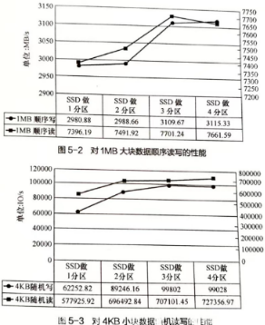

从单SSD做3分区划分到4分区划分，集群整体性能收益不再增加，而单SSD做4分区占用更多的CPU、内存资源，因此单SSD划分3分区对Ceph集群整体性能提升性价比更高。

多分区部署Ceph OSD守护进程

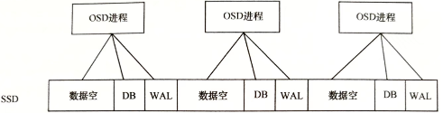

### 6.1.4 缓存方案

当前阶段，同样容量的SSD成本高于HDD，如何有效组织SSD与HDD实现存储系统中性能与成本的均衡，仍有重要意义。实现这一目标，需要依赖于智能的数据分层存储方案，即缓存方案。缓存方案对I/O写请求有削峰填谷的作用，也可以协调数据在吞吐能力相差较大的存储设备间进行平稳传输，也对I/O读请求有提升命中率的效果，可以组织频繁被访问的数据存储在高性能的存储介质中以得到快速响应。

#### 硬件

LSI的Mega RAID阵列卡的CacheCade功能。Intel公司的Smart Response Technology（SRT）都允许用户在使用HDD前利用SSD作为高速缓存

#### 软件

- ZFS
- LVM
- FlashCache
- Bcache
- DM-Cache
- Enhance IO
- Intel CAS

都是实现SSD对HDD的IO加速，Ceph自身的Cache Tier缓存池方案也能实现类似功能

##### Ceph Cache Tier

缓存分层特性也是在Ceph的F版发布的。

缓存分层是在更快的磁盘（SSD）上创建一个Ceph池，这个缓存池应放置在一个常规复制池或erasure池（HDD）的前端，这样所有的客户端IO经过缓存池处理之后，再将数据刷新（flush）到现有的数据池中


客户端能够享受缓存池的高性能，一段时间后，缓存层将所有数据写回备用的存储层，以便可以缓存来自客户端的新请求

在缓存层和存储层之间的数据迁移都是自动触发且对客户端透明的

###### 缓存分层模式

**writeback**

- 写

  当Ceph缓存分层配置为writeback模式时，Ceph客户端将数据写到缓存层类型池中，客户端能立即收到写入确认

  基于为缓存层指定的 flushing/evicting策略，数据从缓存层迁移到存储层，并最终由缓存分层代理将其从缓存层中删除

- 读

  由缓存分层代理将数据从存储层迁移到缓存层，然后将其提供给客户。直到数据不活跃或变为冷数据，否则会一直保留在缓存层中

  适用于可变数据：图片、视频编辑、交易性数据等理想模式

**read-only模式**

只处理来自客户端的读操作。客户端的写操作不涉及缓存分层。

缓存分层代理将请求的数据从存储层复制到缓存层。

基于为缓存层配置的策略，不活跃的对象将会从缓存层中删除

**Forward模式**

**Proxy模式**

**Read-forward模式**

**Read-Proxy模式**

###### 部署Ceph Cache Tier

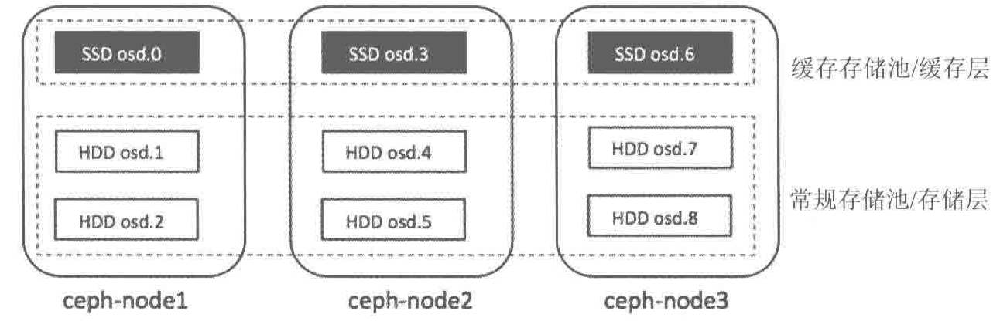

**1. 新建池**

```shell
# 1. 获取CRUSH map并反编译
ceph osd getcrushmap -o crushmapdump

crushtool -d crushmapdump -o crushmapdump-decompiled

# 2. 编辑反编译得到的CRUSH map
vim crushmapdump-decompiled

[buckets]
root cache{
	id -5
	alg straw
	hash 0
    item osd.0 weight 0.010
    item osd.3 weight 0.010
    item osd.6 weight 0.010
}
[ruleset]
rule cache-pool{
	ruleset 4
	type replicated
	min_size 1
	max_size 10
	step take cache
	step chooseleaf firstn 0 type osd
	step emit
}

# 3. 编译CRUSH map并将其导入Ceph集群中
crushtool -c crushmapdump-decompiled -o crushmapdump-compiled
ceph osd set crushmap -i crushmapdump-compiled
一旦Ceph集群应用新的CRUSH map，`ceph osd tree` 可以发现名为 cache 的新的 root bucket

#4. 在SSD磁盘上新建缓存池
ceph osd pool create cache-pool 32 32
ceph osd pool set cache-pool crush_ruleset 4

ceph osd dump | grep -i cache-pool

# 5. 检查cache池是否创建成功
#列出缓存池的所有对象
rados -p cache-pool ls

#向缓存池中添加一个临时对象，验证对象存储在正确的OSD上
rados -p cache-pool put object1 /etc/hosts
rados -p cache-pool ls

#检查缓存池和object1的OSD map
ceph osd map cache-pool object1

#删除这个对象
rados -p cache-pool rm object1
```

**2. 新建缓存层**

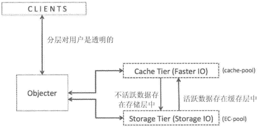

```shell
# 1. 为存储池设置缓存池
指令格式：ceph osd tier add [存储池] [缓存池]
ceph osd tier add EC-pool cache-pool

#2. 设置缓存模式为writeback或read-only
指令格式：ceph osd tier cache-mode [cache_pool] [writeback | read-only]
ceph osd tier cache-mode cache-pool writeback

#3. 转发客户端请求
指令格式：ceph osd tier set-overlay [存储池] [缓存池]
ceph osd tier set-overlay EC-pool cache-pool

# 4. 检查池的细节
ceph osd dump | egrep -i "EC-pool|cache-pool"

EC-pool的tier、read-tier、write-tier都被设置为16（缓存池的ID）
cache-pool的tier_of设置为15（EC-pool的ID）,cache_mode 为writeback
```

**3. 配置缓存层**

缓存层有几个配置选项，需要为缓存层配置一些参数以实现策略的设置

```shell
# 为缓存池启用 hit set 命中记录，生产级别的缓存层通常使用bloom过滤器
ceph osd pool set cache-pool hit_set_type bloom

# 修改缓存池中存储的hits set（命中集合）次数
ceph osd pool set cache-pool hits_set_count 1

# 修改hit set 在缓存池中的有效期，以s为单位
ceph osd pool set cache-pool hit_set_period 300

# 缓存分层代理开始从缓存池中将对象写回后端存储或删除前，允许存放的最大字节数
ceph osd pool set cache-pool target_max_types 10000

# 缓存分层代理开始从缓存池中将对象写回后端存储或删除前，允许存放的最大对象数
ceph osd pool set cache-pool target_max_objects 10000

# 缓存分层代理将数据从缓存层刷新到存储层中并删除这些数据的最小时间间隔,s为单位
ceph osd pool set cache-pool cache_min_flush_age 300 #刷新到存储层
ceph osd pool set cache-pool cache_max_evict_age 300 #删除缓存层数据

# 缓存分层代理开始将数据写回存储层前，允许缓存池中被修改数据总量占池总量的百分比
ceph osd pool set cache-pool cache_target_dirty_ratio .01

# 缓存分层代理开始将新的数据写回存储层前，允许缓存池存放未经修改的数据总量占池总量的百分比
ceph osd pool set cache-pool cache_target_full_ratio .02
```

**4. 测试缓存层**

在客户端进行写操作，数据会先写在缓存池上，客户端可以获得更快的IO

基于缓存层策略，数据会透明地从缓存池迁移到一个存储池

```shell
# 向EC-pool中写入
rados -p EC-pool put object1 /tmp/tmpfile

#EC-pool已经与一个缓存池绑定，所以不会里面刷入EC-pool
# 使用date跟踪时间
rados -p EC-pool ls
rados -p cache-pool ls
	发现cache-pool已经写入object1，EC-pool还没有
date

#由于配置了cache_min_evict_age为300s，缓存分层代理将从缓存池中迁移object1到EC-pool中
date
rados -p EC-pool ls
rados -p cache-pool ls
```

## 6.2 Ceph性能

[ceph cookbook]

同一时间段内大量客户端向应用程序发起请求时，需要一个性能更好的后端存储系统

当数据请求到达Ceph时，Ceph会将请求其分散到多个节点和OSD，实际提供的性能是多个节点的叠加

当为Ceph添加新的OSD节点时，整个存储集群的性能会线性增加，因为有了更多能够分担负载的OSD

### 6.2.1 性能指标

性能数据分为：

- 集群级
- 存储池级
- 存储节点级

#### 集群性能指标

集群读IOPS、集群写IOPS

集群读带宽(byte/s)、写带宽(byte/s)

集群读I/O时延(ms)、集群写I/O时延(ms)

#### 存储池性能指标

存储池读IOPS、存储池写IOPS

集群读带宽(byte/s)、写带宽(byte/s)

存储池读I/O时延(ms)、存储池写I/O时延(ms)

#### 存储节点性能指标

**磁盘性能**

读IOPS，写IOPS，读带宽(byte/s)，写带宽(byte/s)

**网卡性能**

每秒收包数，每秒发包数，收带宽(byte/s)，发带宽(byte/s)

**CPU性能**

IDLE，SYS，USER，IOWAIT，IRQ，SOFTIRQ，NICE所占百分比

**内存性能**

TOTAL、FREE、BUFFERS、CACHE、SWAPCACHED、SWAPREE大小(bytes)

### 6.2.3 性能调优方向

Ceph能在同一集群中，针对不同工作负载，提供不同类型的存储池

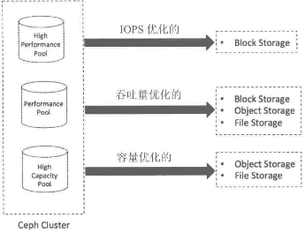

#### IOPS优化

随着闪存使用的增加，企业越来越多地将IOPS敏感型工作负载依托在Ceph集群，以便提高私有云存储解决方案的性能。在此场景下，可以把MySQL、MariaDB或PostgreSQL托管在Ceph集群，以支持结构化数据

这种配型在每次IO低总体拥有成本（Total Cost of Ownership，TCO）下拥有高的IOPS。

通常使用更快的SSD硬盘，PCIe SSD、NVMe等数据存储的高性能结点

通常用于块存储，也可用于其他场景

#### 吞吐量优化

Ceph集群通常可以存储半结构化数据，一般是顺序读写比较大的文件，需要提供很大的带宽。存储服务器上的磁盘可以使用SSD做日志加快HDD

这种配型在每吞吐量的低总体拥有成本（Total Cost of Ownership，TCO）下拥有高的吞吐量。

使用SSD和PCIe SSD做OSD日志盘，以及一个高带宽、物理隔离的双重网络

通常用于块存储，高性能的对象存储和文件存储

#### 容量优化

低成本和高容量的解决方案用于处理存储容量较大、存储时间较长的数据，且按块顺序读写。数据可以是结构化或半结构化。存储内容包括媒体文件、大数据分析文件和磁盘镜像备份等。为了获得更高的效益，OSD与日志通常都托管在HDD。

每TB存储的低成本，单元机架物理空间的低成本

使用机械硬盘的密集服务器（36-72），每个服务器有4-6T物理硬件空间

用于低功耗、大容量的对象存储和文件存储——纠删码技术

## 6.3 性能调优

Ceph具备优良的可扩展性以及分布式的体系结构，Ceph系统中的所有工作负载都会均匀地分布、分配到整个集群的各个存储节点上，每个存储节点包含数个OSD。因此，Ceph 的性能是集群节点内所有OSD性能的叠加，即当向Ceph集群添加满配OSD的新节点时，存储集群拥有了更多能够分担负载的OSD，以及在每个新节点上配置的CPU、内存和网络能力，整个存储集群的性能会线性增加。

由冯·诺依曼架构可以看出，Ceph产品性能调优方向主要有：CPU/内存，磁盘I/O，网络，应用软件四个方面

### 6.3.1 硬件

#### 网络

##### 带宽

**性能角度**

当系统处于recovery状态，需要 10Gbit/s 或更多双端口网络

##### 多网卡聚合负载均衡

提升Ceph性能的主要手段是将多网卡聚合进行负载均衡，达到带宽叠加的效果

配置多网卡聚合可以使用Bonding和Teaming技术

#### 磁盘

磁盘的选择需要综合考虑工作负载和性能需求，决定了集群的整体性能和总成本。副本数也需要在可靠性、性能和TCO间做出平衡

##### 转速

选择7200RPM以上的SAT或SAS

##### non-RAID

##### OSD日志

Ceph OSD包括两部分：日志部分与数据部分，即OSD的性能受日志和数据分区共同影响

Ceph在数据提交到备用存储之前，首先将数据写入日志（journal）的独立存储区域，日志可以使用相同的机械磁盘或不同的SSD磁盘或分区上的一小块缓冲区大小的分区，甚至可以用一个文件。

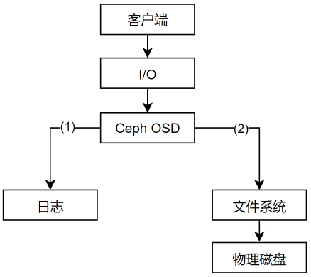

Ceph使用日志来保障速度和一致性。默认情况下，每隔5s日志会向备用存储中刷新数据

##### 日志分区

日志允许OSD处理小文件写，随机写，为文件系统提供了充足时间将写操作合并到磁盘，能够很好地处理工作负载的峰值，减少访问时间和读取延迟实现吞吐量的提升

日志读写速度的提升显然会让系统整体的读写速度提升，将日志创建在SSD上，所有客户端的写操作都是写入SSD型日志中，然后再写入机械硬盘

**最佳实践**：

常见的日志大小为10GB，分区越大越好

应该为每一个OSD配置独立的日志盘

采用SSD 盘的分区存储日志，机械盘存储数据兼顾成本与性能，每个SSD盘上可作为2～4个OSD日志盘

- 在物理SSD磁盘上创建的每个逻辑分区都可以作为日志分区映射到OSD数据分区

  每个SSD磁盘最多给4-5个OSD做日志，否则会称为集群的性能瓶颈。

  - SATA/SAS SSD，则4个OSD数据硬盘共享一个SSD
  - PCIe/NVMe，则12-18个数据硬盘共享一个SSD

**缺点** ：若将多个采用ext4或者XFS文件系统的日志挂载在同一磁盘上，会存在单点故障的风险，与这个SSD相关的OSD都会出错

- Btrfs是一个写时复制文件系统（将对象写入日志时，可以同时将该对象写入数据分区），支持回滚。若一个块的内容发生了变化，而针对这个块的写时独立进行的，因此能够保留旧的块

- 可以为日志增加RAID 1，但增加了存储成本

##### 数据分区

**硬盘故障率**

数百个旋转式HDD近距离安装时，其叠加的旋转振动会增加桌面级HDD的硬盘故障率

企业级HDD对震动做了特别处理，其平均无故障时间（MTBF）远少于桌面级HDD

**数据盘接口**

NL-SAS HDD有双重12GB/s端口，比单个端口的6GB/s的SATA性能更高，双重SAS端口提供了冗余，允许并行读写

SAS比SATA的不可恢复的读错误（URE）更低，URE越低，清理过程中发现的错误以及PG修复操作越少

**OSD节点密度**

OSD节点密度影响集群性能、容量和TCO

大量小容量节点比少量大容量节点好，

尽量使单个节点容量小于集群总容量的10%

##### 文件系统

Ceph OSD守护进程运行在文件系统的上层，文件系统的稳定性和性能很大程度上依赖于底层文件系统的稳定性和性能。

此外，文件系统也提供了OSD使用的 **扩展属性**（XATTR）来扩展其内部状态和元数据的形式，使用 `xattr_name` 和 `xattr_value` 来存储对象的额外信息（内部对象的状态、快照、元数据和ACL等信息）

btrfs有更大的xattr元数据，以文件形式存储

xfs具有相对大的上限64KB

ext4上限太小，不能被使用

- 若使用ext4文件系统，需要在ceph.conf的[OSD]段添加 `filestore xattr use omap = true`

**XFS**

推荐在生产环境Ceph集群中使用

- XFS是一种日志文件系统：客户端每次写入数据时，首先需要写入日志空间，再写入XFS文件系统，相当于两次写入操作，写入性能上不如Btrfs
- XFS在元数据扩展性上存在性能问题

**Btrfs**

使用Btrfs文件系统的OSD能提供最佳性能

- 并行地写日志和OSD数据
- 支持写时复制和可写快照：对于虚拟机的部署和克隆十分有用
- 支持透明的压缩、普遍的校验和多设备的统一管理
- 支持对小文件的合并
- 集成卷管理
- 支持在线fsck的特性

不具备用于生产系统的条件

**ext4**

ext4也是一种日志文件系统

ext4限制了XTTRA的存储容量使其不具备提供足够的XATTR信息的能力，而Btrfs和XFS在 XTTRA存储容量上的限额就比较大

### 6.3.2 软件

**任何系统的性能都是依赖负载和性能测试来量化的**。性能调优就是要解决在性能测试过程中发现瓶颈的过程

**合理的调优流程** ：从最小组件逐步向客户端调查

将性能调优参数写入一个Ceph集群的配置文件便于让Ceph守护进程每次启动时都能读取到

针对具体环境中的Ceph集群进行调优可能不会在其他环境中起作用

#### 通用调优参数

##### CPU/内存——内核参数

**kernel pid max**

Linux内核参数，控制线程和进程ID的最大数据

大多数Linux内核对于 `kernel pid max` 预设的值会很小。在拥有多个OSD的Ceph结点上需要为该参数设置更高的值

- 若 $OSD > 20$ ，在恢复和再平衡过程中会生成很多进程和线程用于快速的数据恢复和再平衡

```shell
echo xxxx > /proc/sys/kernel/pid_max
```

##### 内存调优

**为系统保留的内存空间最小值，KB**

如果预留太大会导致空闲使用内存不足，迫使内核频繁进行内存回收，严重影响性能。

- 在超48GB RAM 系统上我们可将min_free_kbytes 参数设置为4194303(4GB)或者以上

配置整个系统保留内存为1%到3%

```
echo 4194303 > /proc/sys/vm/min_free_kbytes
```

**虚拟内存**

```
echo "vm.swappiness=0" >> /etc/sysctl1.conf
```

vm.swappiness 决定了应用内存来自页交换分区还是直接从页缓存中回收内存的程度。vm.swappiness 取值范围为0到100，

- 1，系统将尽可能少地将内存页交换到交换分区，而是优先从页缓存中回收内存页。

  虚存以IO为中心，内存交换的使用会导致整个服务器性能降低。为高IO工作负载配置低swappiness值

- 一般将wappiness设置为100。与从页缓存中回收内存相比，系统更喜欢交换页面到磁盘，以空出更多内存。

在Ceph节点上，最重要的是Ceph进程不会被交换出去，通常设置为10

```
vm.dirty_ratio/vm.dirty_bytes
```

这两个参数可以实现对内存回写磁盘的控制。当脏页数量达到一定比例(系统总内存占比)或者具体的阈值时，触发 Linux 内核强制回写磁盘数据。这时，进程的所有 I/O操作将被阻塞，这也是造成磁盘I/O 性能瓶颈的重要因素。我们可以尝试将这个比例或者阈值设置得大一些。比例和阙值只需要设置其中一个即可。

```
vmdirty_backgroud ratio/vmdirty_backgroud_bytes
```

当系统的脏页数量达到一定比例(系统总内存占比)或者具体的值时，将激活pdflush/flush/kdmflush 后台进程清理脏数据，异步执行回写磁盘数据操作。我们可以尝试将此比例设置得较小一些，比如 5%，这样可以保证系统数据平滑地回写到磁盘。

##### 网络调优

**TCP/IP连接缓冲区**

Linux为每个TCP/IP连接级冲区，但是默认值可能不适用于所有连接x

- net.ipv4.tcp_wmem：设置操作系统的接收级冲区值
- net.ipv4.tcp_rmem：设置操作系统的发送缓冲区值
- net.ipv4.tcp_ mem：定义与内存使用有关的TCP堆栈行为
- net.core_wmem_max：操作系统接收的所有类型的连接的最大接收缓冲区大小
- net.core_ rmem max:操作系统接收的所有类型的连接的最大发送缓冲区大小。

配置net.ipv4.tcp_wmem和net.ipv4.tcp_rmem参数时，需要按照固定格式进行。

- 第一个值表示内核单个TCP套接字的最小缓冲区空间
- 第二个值表示内核单个TCP套接字的默认缓冲区空间
- 第三个值表示内核单个TCP套接字的最大缓冲区空间。

对于net.ipv4.tcp_ mem参数

- 第一个值表示内核较低的阈值
- 第二个值表示内核何时开始增加内存使用量
- 第三个值表示内核最大内存页数

```shell
[root@mon1] vim /etc/sysctl.d/99-ceph.conf
net.ipv4.tcp_rmem 4096 87380 16777216
net.ipv4.tcp_wmem 4096 16384 16777216 
net.core.rmem_max 16777216
net.core.wmem_max 16777216
```

**jumbo frames**

MTU的以太网帧载荷超过1500字节的称为jumbo贴（巨帧）。

在Ceph集群节点的网络接口上使用jumbo贴可以提供更好的网络吞吐量

jumbo贴在操作系统级配置，且网络接口即后端网络交换机必须支持jumbo贴才行

首先应该配置交换机这一端的接口，然后再在操作系统层面上配置

```shell
# 从操作系统层面，要在eth0接口上启用jumbo贴
ifconf eth0 mtu 9000

#为了永久改变，也应该更新网络接口配置文件 /etc/sysconfig/network-script/ifcfg-eth0为MTU=9000
```

##### 磁盘相关参数

**disk read_ahead**

通过预读取数据并将其加载到RAM中加快磁盘的读操作

通过在使用RBD的Ceph客户端上给 `read_ahead` 设置一个相对较高的值有利于客户端执行顺序读操作

```
cat /sys/block/vda/queue/read_ahead_kb #查看当前read_ahead值
echo "8192" > /sys/block/vda/queue/read_ahead_kb # 修改
```

**IO调度器**

Linux 内核支持多种I/O调度算法，包括 CFQ、Noop、Deadline等。根据不同的磁盘应用场景选择不同的 I/O调度算法可提升 I/O 性能。

I/O 调度算法的选择取决于硬件特性，也取决于应用场景。

- 对于传统的 SAS 盘，CFQ、Deadline、Noop 算法都是不错的选择。
- 对于专属的数据库服务器，Deadline 算法在吞吐量和响应时间方面都表现自好。
- 然而在新兴的固态硬盘比如 SSD 上，最简单的 Noop 算法反而可能是最好的，因为其他两种算法的优化是基于缩短寻道时间，而固态硬盘没有所谓的寻道时间且 I/O 响应时间非常短。上面 3 种调度算法适用的场景如下

```shell
#检查磁盘默认使用的调度器
cat /sys/block/sda/queue/scheduler 

# 修改磁盘sda默认的I/O调度器为 deadline
echo deadline > /sys/block/sda/queue/scheduler
```

**deadline** ：

好处是每个调度器使用单独的 IO 队列，因此与写相比，更利于读。这个调度器适用于大多数使用场景，尤其是读操作多于写操作的情况。

已经在队列中的I/O请求被分类到读和写批次，然后以 LBA 升序被调度执行

默认情况下，读批次的优先级高于写批次，因为应用程序更容易阻塞在读I/O上

适用场景：

- 最大化吞吐量，良好的响应时间

| 参数名         | 含义                 |
| -------------- | -------------------- |
| fifo_batch     | 一次批处理的大小     |
| front_merges   | 是否进行前向合并     |
| read_expire    | 读请求超时时间       |
| write_expire   | 写请求超时时间       |
| writes_starved | 写请求被“饿死”的次数 |

**CFQ(completely fair queuing)**

完全公平队列调度器。只适用于SATA磁盘。CFQ调度器将进程划分为三大类

- real time：实时的
- bets effort：尽力而为的。进程默认类型
- idle：闲时调用的

适用：

- 不适合SSD，对于SAS或SATA且I/O请求较多，需要均衡调度时使用

**Noop**

FIFO调度器，通过 last-hit（最后命中）缓存，请求在通用块层中被合并。

对于使用快速存储的计算密集型系统来说，最好的调度器

- 对于SSD ，NOOP I/O调度器可以减少延迟，增加吞吐量，消除CPU花费在重新排序IO请求上的时间

**IO调度队列**

IO Scheduler queue（调度队列）缺省的IO调度队列大小为128

调度队列对IO进行排序，并通过对顺序IO进行优化减少寻道到时间

修改调度队列深度，可以增加磁盘执行顺序IO的比例，提高整体吞吐量

```shell
# 检查设备的调度器深度
cat /sys/block/sda/queue/nr——requests

# 修改设备调度器深度
echo1024 > /sys/block/sda/queue/nr_requests
```

#### 集群配置文件

```shell
ceph config show-with-defaults mon.mon01 | awk '{print $1,"=", $2}' > Octopus_conf.txt # 获取全部参数
```

大部分作用域整个集群范围的配置都是在Ceph集群配置文件/etc/ceph/ceph.conf中定义的。

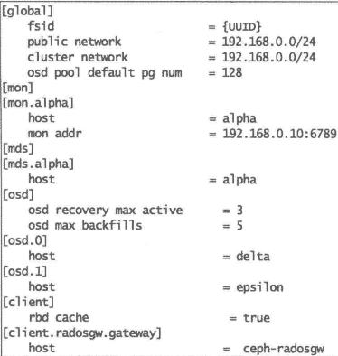

**全局段**

定义在 `[global]` 后的段，在这个段设置会影响Ceph集群的所有守护进程，如客户端网络：

```shell
 public network = 192.168.0.0/24
```

**mon段**

在 `[mon]` 段设置的参数只会影响Ceph集群内所有的mon守护进程，且会覆盖掉 `[global]` 段相同的参数

同时，也可使用 `[mon.MON_ID]` 来为每个mon指定配置

```shell
mon initial members = ceph-mon1
```

**OSD段**

在 `[OSD]` 段设置的参数只会影响Ceph集群内所有的OSD守护进程，且会覆盖掉 `[global]` 段相同的参数

同时，也可使用 `[osd.OSD_ID]` 来为单个OSD指定配置

```shell
osd mkfs type = xfs
```

**MDS段**

在 `[MDS]` 段设置的参数只会影响Ceph集群内所有的OSD守护进程，且会覆盖掉 `[global]` 段相同的参数

同时，也可使用 `[mds.MDS_ID]` 来为单个MDS指定配置

```shell
mds cache size = 250000
```

**client段**

在 `[client]` 段设置的参数只会影响Ceph集群内所有的OSD守护进程，且会覆盖掉 `[global]` 段相同的参数

同时，也可使用 `[client.client_name]` 来为单个client指定配置

```shell
rbd cache = true
```

#### 全局调优参数

**网络**

```
public network = {public network / netmask} #公共网络/客户端网络

cluster network = {cluster network / netmask} #集群网络/内部网络
```

**最大文件打开数**

在操作系统层面设置最大文件打开描述符，避免OSD进程出现文件描述符不足的情况

默认为0，最多设置64位的整数

```shell
max open files = 1111
# 默认0，推荐：131072
```

**pg、pgp数确定**

```
osd pool default pg num = 128
osd pool default pgp num = 128
```

**处于degraded状态的副本数**

Ceph向客户端发送确认写操作前，存储池中object的最小副本数（必须<pg-num、pgp-num）。即使集群处于degraded状态。

若副本数小于参数值，则不会确认写操作给客户端

```
osd pool default min size=1
```

**默认rule ID**

创建存储池时，缺省则使用CRUSH ruleset

```
osd pool default crush rule = 0
```

**disbale in-Memory logs**

每个Ceph子系统都有自己的输出日志级，并记录在内存中

通过debug logging设置一个log文件等级和内存等级（1-20，轻量级-重量级）

格式：`debug<subsystem> = <log-level>/<memory>`

若内存级别日志影响了性能和内存消耗。可以尝试关闭该功能，要禁用 `in-memory logging` 添加参数

```
debug lockdep=0/0
debug context = 0/0
debug crush=0/0
debug buffer=0/0
debug timer=0/0
debug_filer=0/0
debug objecter=0/0
debug_rados=0/0
debug rbd=0/0
debug_journaler=0/0
debug_objectcatcher =0/0
debug_client=0/0
debug osd=0/0
debug_optracker= 0/0
debug_objclass=0/0
debug_filestore= 0/0
debug_journal=0/0
debug ms=0/0
debug_monc=0/0
debug_tp=0/0
debug auth=0/0
debug_finisher=0/0
debug heartbeatmap = 0/0
debug_perfcounter = 0/0
debug_asok=0/0
debug throttle=0/0
debug mon=0/0
debug_paxos=0/0
debug_rgw=0/0
```

#### mon调优

**指定OSD进程多少秒未响应后标记为down或out状态**

当OSD节点崩溃、自行重启或者短时间的网络故障时，会用到此参数

即不想让集群在问题出现时就立刻启动数据平衡操作，尝试等待

```
mon_osd_down_out_interval=
默认300，推荐600
```

**避免Ceph存储池以外删除**

```
mon_allow_pool_delete = false
```

**mon间的clock drift**

```
mon clock drift allowed = 
默认0.05
推荐1
```

**OSD down上报次数**

如果Ceph OSD守护进程监控的OSD down了，它就会向 MON 报告

缺省值为 1，表示仅报告一次。

```
mon_osd_min_down_reporters = 3 
```

#### OSD调优参数

##### 常用设置

**OSDping mon的时间间隔**

```
osd_mon_heartbeat_interval=
默认30
建议40
```

**OSD map的缓存大小，MB**

```
osd_map_cache_size = <numeric>
默认500
推荐1024
```

**内存中允许的OSD map缓存大小，以MB为单位**

```
osd_map_cache_bl_size = <numeric>
默认50
推荐128
```

**创建xfs文件系统**

创建OSD的时候，Ceph 将使用这些 xfs 选项来创建OSD的文件系统

```
osd_mkfs_options_xfs ="-f -i size=2048"
```

**挂载xfs文件系统**

设置挂载文件系统到OSD的选项。

```
osd_mount_options_xfs = "rw,noatime,inode64,logbufs=8logbsize=256k,delaylog,allocsize=4M"
```

**OSD单次写大小，MB**

```
osd_max_write_size = 256
```

**内存允许的最大客户端数据大小，B**

```
osd_client_message_size_cap=1073741824
```

**删除OSD map中的重复项**

```
osd_map_dedup = true
```

**设置服务于OSD进程操作的线程数**

默认0

越大，处理速率越快

```
osd_op_threads=16
默认2
建议16
```

**执行清理、快照等磁盘密集型操作的磁盘线程数**

```
osd_disk_threads = 1
默认1
建议4
```

**修改磁盘线程的IO调度类型，只工作在Linux内核CFQ调度器上**

```
osd_disk_thread_ioprio_class=idle
```

- idle：（闲时调用）磁盘线程的优先级比OSD的其他线程低。加快处理客户端请求，放缓OSD上的清理(scrubbing)
- be：（尽力，best effort）磁盘线程与OSD其他线程有相同优先级
- rt：（实时,real time）磁盘线程的优先级比OSD其他线程高。加快 OSD上的清理(scrubbing)，放缓处理客户端请求

**修改磁盘线程的IO调度优先级（0-7，最高-最低）**

与 `osd_disk_thread_ioprio_class`  配合使用

若主机的所有OSD都处于idle，都在竞争IO，这个参数可以用来将一个OSD的磁盘线程优先级降为7，让另一个优先级为0的OSD更快清理

```
osd_disk_thread_ioprio_priority=0
```

##### 日志设置

**日志大小**

设置日志分区大小，至少是预期磁盘速度和filestore最大同步时间间隔的两倍。

若用了SSD日志，最好创建大于10GB的日志，并调大filestore的最小、最大同步时间间隔

- `filestore_min_sync_interval`

```
osd_journal_size=20480
```

**单次写日志的最大比特数/条目数**

```
#单次写日志的最大比特数
journal_max_write_byte = <numeric>

#单次写日志的最大条目数
journal_max_write_entries = <numeric>
```

**日志队列允许的最大op数**

```
journal_queue_max_ops = <numeric>
```

**日志队列允许的最大btyes**

```
journal_queue_max_bytes = <numeric>
```

**启用direct i/o到日志**

```
journal_dio = true
```

**启用libaio异步写日志**

```
journal_aio=true
```

**日志块写操作对齐**

```
# 需要配置dio和aio
journal_block_align = true
```

##### filestore设置

**libaio异步写日志**

```
filestore_merge_threshold = 40
```

**子目录在分裂成二级目录前的最大文件数**

```
filestore_split_multiple = <numeric>
```

**并行执行的文件系统操作线程个数**

```
filestore_op_threads = 32
```

**etx4文件系统使用的XATTRS**

```
filestore_xattr_use_omap= true
```

**设置日志同步数据的提交点**

从日志中同步数据到数据盘，然后清理日志。filestore需要停止写操作来执行 syncfs() 。

更加频繁地同步操作，可以减少存储在日志中的数据量

配置一个越小的同步值，越有利于文件系统合并小量的写，提升性能

```
filestore_min_sync_interval=10
filestore_max_sync_interval=15
```

**filestore队列能接收的最大op数**

超过filestore设置的最大op数，会阻塞新的op加入filestore队列

```
filestore_queue_max_ops =2500
```

**filestore一个op的最大比特数**

```
filestore_queue_max_bytes=10485760
```

**filestore能提交的op的最大个数**

```
filestore_queue_committing_max_ops = 5000
```

**filestore能提交的op的最大比特数**

```
filestore_queue_committing_max_bytes=10485760000
```

##### BlueStore

使用 BlueStore 相比使用Filestore 会带来更高的性能提升。针对 BlueStore，我们有很多可以进行优化的参数

**rocksdb和 wal**

- 具体数值根据实际情况而定，不能一概而论。这需要在系统部署时候规划好，

```
bluestore_block_db_size
bluestore_block_wal_size
```

**Allocation Size**

在混合工作负载条件下，调整 alloc_size 会略微提高小型对象的写入性能。

将 alloc_size 减小到 4KB 有助于减少对小型对象的写入放大

但此更改需要在 OSD 部署之前完成。如果部署之后更改，必须重新部署 OSD，以使其生效。建议机械盘设置为64KB，SSD/NVMe设置为4KB。

```
min_alloc_size_ssd = 4096
min_alloc_size_hdd = 6
```

##### recovery设置

若Ceph集群健康状态不正常，OSD处于数据恢复状态则性能会降低。

若在recovery期间，仍期望得到更好的性能，可以降低数据恢复的优先级，使数据恢复占用OSD的资源更少

**每个OSD上同时进行恢复操作的最大PG数**

```
osd_recovery_max_active=3
默认15
推荐10
```

**OSD在某个时刻启动恢复操作的PG数**

与 `osd_recovery_max_active` 共同使用

```
osd_recovery_max_single_start= 1
```

OSD 在某个时刻会为一个PG启动一个恢复操作，而且最多可以有三个恢复操作同时处于活动状态

**OSD恢复操作的优先级**

配置恢复操作的优先级。值越小，恢复优先级越高

```
osd_recovery_op_priority = 50
默认10
推荐2
```

**数据恢复块的最大值,B**

```
osd_recovery_max_chunk = 1048576
```

**恢复数据所需的线程数**

```
recovery_threads =1
```

##### backfilling设置

允许设置backfill操作的优先级比请求读写更低

**允许进/出单个OSD的最大backfill数**

```
osd_max_backfills = 2
默认10
推荐4
```

**每个backfill扫描的最小object数**

```
osd_backfill_scan_min=8
```

**每个backfill扫描的最大object 数**

```
osd_backfi11_osd_backfill_scan_max=64
```

##### scrubbing设置

OSD scrubbing对维护数据完整性非常重要，但会降低OSD性能

**单个OSD进程最大的并行scrub数**

```
osd_max_scrubs = 1
```

**两个连续scrub之间的睡眠时间，s**

```
osd_scrub_sleep = 1
```

**单个OSD执行scrub的最小/最大数据块数**

```
osd_scrub_chunk_min = 1
osd_scrub_chunk_max = 5
```

**深层scrub时读大小，B**

```
osd_deep_scrub_stride = 1048576
默认524288
建议：1311072
```

**scrub的最早/最晚开始时间**

用于定义执行scrub的时间窗口

```
osd_scrub_begin_hour = 19
osd_scrub_end_hour = 7
```

#### RGW参数


#### FS参数


#### 客户端调优参数

用户空间实现的块设备不能很好利用Linux页面缓存，因此Ceph引入了新的内存缓存机制，称为RBD缓存

默认情况下，Ceph没有启用RBD缓存

若要启用RBD缓存，在ceph.conf中的 `[client]` 段添加内容

**启用RBD缓存**

```
rbd_cache = true
```

**一开始使用写直达模式(write-through)，第一次flush请求被接收后切换到写回式(write-back)**

```
rbd_cache_writethrough_until_flush = true
```

**rbd缓存大小，B**

```
rbd_cache_size = 67108864
```

**缓存开始写数据到后端存储前，脏数据大小的目标值，B**

```
rbd_cache_target_dirty = 33554432 #32M
```

**缓存触发writeback的字节上限数,B**

```
rbd_cache_max_dirty = <numeric>
```

- 若设置为0，则Ceph使用的缓存模式是写直达
- 若不设置该属性，则默认写回模式

**writeback开始前， 脏数据在缓存中存在的秒数**

```
rbd_cache_max_dirty_age = <numeric>
```

**rbd的默认创建类型**

```
rbd_default_format = 2
```

**在rbd上执行的并发管理操作数**

```
rbd_concurrent_management_ops=10
```


