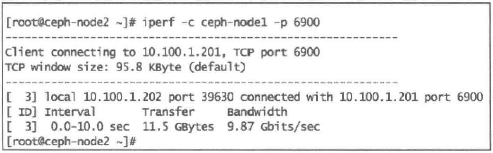

[TOC]

<!--more-->

## 7.1 RADOS bench对Ceph进行基准测试

基准测试会展示集群关于读、写、延迟和其他负载的大致结果

在真正的基准测试前，最好通过对各结点硬件的性能测试，如磁盘、网络建立期待的最高性能基准

### 7.1.1硬件性能基准

为了获得真实的结果，对Ceph集群的物理硬件做基准测试

#### 硬盘性能基准

##### 单个磁盘写性能

为了获得磁盘写性能，使用 `dd` 并将 `oflag` 设置为 `direct` ，目的是为了绕过磁盘缓存，从而获得真实的结果

```shell
#1. 清理缓存
echo 3 > /proc/sys/vm/drop_caches

#2. 使用dd命令向位于OSD挂载目录 /var/lib/ceph/osd/ceph-0/中写入10GB数据
dd if=/dev/zero of=/var/lib/ceph/osd/ceph-0/deleteme bs=10G count=l oflag=direct

#3. 多次重复，计算写操作平均值
```


上图中，写操作平均值是 $\frac{(322+303+333)MB/s}{3}=319MB/s$

##### 多磁盘写性能

在ceph-node1节点的所有Ceph OSD磁盘上运行 `dd` 获得单个节点总的写性能

```shell
#1. 获得OSD使用的磁盘总数
mount | grep -i osd | wc -l

#2. 清楚缓存
echo 3 > /proc/sys/vm/drop_caches

#3. 用dd命令在所有Ceph OSD磁盘上执行
for i in `mount | grep osd | awk '{print $3}'`; do (dd if=/dev/zero of=$i/deleteme bs=10G count=1 oflag=direct &) ; done

取所有写速度的平均值
```

##### 单个磁盘读性能

```shell
#1. 清除缓存
echo 3 > /proc/sys/vm/drop_caches

#2. 用 dd 命令读前面在写测试例子中创建的文件 deleteme。我们将其内容到/dev/null，并把iflaq 参数设置为 direct:
dd if=/var/lib/ceph/osd/ceph-0/deleteme of=/dev/null bs=10G count=1 iflag=direct
```

理想情况下，应该多重复步骤1和步骤2，取平均值


##### 多磁盘读性能

```shell
#1. 获得Ceph OSD使用的磁盘总数
mount | grep -i osd | wc -l

#2. 清理缓存
echo 3 > /proc/sys/vm/drop_caches

#3. dd在OSD磁盘上执行读操作
for i in `mount | grep osd | awk '{print $3}'`; do (dd of=/dev/zero if=$i/deleteme bs=10G count=1 oflag=direct &) ; done
```

#### 网络性能基准

使用iperf进行一系列的网络测试，确定两台节点间的网络性能基准

- 用于测量C/S模式服务器中点到点网络带宽的工具

启动网络性能基准测试，在第一个Ceph节点上执行iperf服务选项，第二个Ceph节点上执行客户端选项

```shell
#1. Ceph-node1 带参数-s运行iperf 来启动服务器端， -p指定监听端口
```


```shell
#2. Ceph-node2 带参数-c运行iperf客户端
```



### 7.1.2 对Ceph集群池的基准测试

#### RADOS bench

Ceph提供了一个内置的基准测试程序，称为RADOS bench，用于写、连续读和随机读等基准测试，也支持清理临时数据保持数据的有效性

```shell
指令格式：rados bench -p [池名] [时长/s] [write | seq | rand]

-p -pool : 池名称
[时长/s] : 测试运行的总时长
[write | seq | rand] : 测试类型
-t : 并发操作数
--no-cleanup : RADOS bench写入到池的临时数据不会被删除，这些数据可以用于读操作。默认会被删除
```

IOPS

带宽

延迟


#### RADOS load-gen工具

Ceph提供的工具，用于生成Ceph集群负载，也可用于高负载场景下的模拟

**语法**

`rados -p <pool-name> load-gen`

- --num-objects：对象总数
- --min-object-size：对象最小字节数
- --max-object-size：对象最大字节数
- --min-ops：操作最小数
- --max-ops：操作最大数
- --min-op-len：操作最小长度
- --max-op-len：操作最大长度。
- --max-backlog：最大累积队列(单位MB)
- --percent：读操作百分比
- --target-throughput：目标吞吐量(单位MB)
- --run-length：以秒为单位的总运行时间

```shell
# 该命令会通过将50个对象写到rbd存储池来生成负载。每个对象大小为4MB，读比例为5%，总运行时间为60 秒。
rados -p rbd load-gen \
	--num-objects 50 \
	--min-object-size 4M \
	--max-object-size 4M \
	--max-ops 16 \
	--min-op-len 4M \
	--max-op-len 4M \
	--percent 5 \
	--target-throughput 2000 \ 
	--run-length 60
```

一旦load-gen完成，将清理所有在测试过程中被创建的对象，并显示运行结果

### 7.1.3 Ceph块设备基准测试

- 可以直接从 Ceph集群测试RBD，

- 也可以通过Linux内核驱动程序将RBD映射到客户端，然后使用fio对通过客户端映射的设备进行I/O性能测试

  最接近客户端，也可以利用操作系统中安装的基准测试工具，表征的数据也最为准确，缺点是易受非Ceph模块的影响

#### 测试指标项

|         测试指标项          |
| :-------------------------: |
| Ceph RBD随机写4KB文件的IOPS |
| Ceph RBD顺序写4KB文件的IOPS |
| Ceph RBD随机读4KB文件的IOPS |
| Ceph RBD顺序读4KB文件的IOPS |
| Ceph RBD写4MB文件的极限带宽 |
| Ceph RBD顺序写4KB文件的延迟 |
| Ceph RBD顺序读4KB文件的延迟 |
| Ceph RBD随机读4KB文件的延迟 |
| Ceph RBD随机写4KB文件的延迟 |

#### rbd bench-write

用 rbd bench-write 工具进行Ceph块设备基准测试

rdb bench-write语法格式如下

`rbd bench-write <RBD imagename>` 

- --io-size：写入字节，默认为4MB
- --io-threads：线程数，默认为16
- --io-total：总写入字节，默认为1024MB
- --io-pattern [seq | rand]：写模式，默认为顺序写。

```shell
#1. 创建Ceph块设备，命名为block-device1，1GB，并映射
rbd create block-device1 --size 10240 
rbd info --image block-device1
rbd map block-device1
rbd showmapped
```


```shell
#2. 在块设备上创建文件系统并挂载
mkfs.xfs /dev/rbd0
mkdir -p /mnt/ceph-block-device1
mount /dev/rbd0 /mnt/ceph-block-device1
df -h /mnt/ceph-block-device1
```


```shell
#3. 对ceph-block-device1进行5GB数据写基准测试
rbd bench-write block-device1 --io-total 5368709200
```


#### 通过FIO对CephRBD做基准测试

FIO表示 Flexible I/O，是目前流行的IO负载生成和基准测试工具之一。通过其广泛的配置选项，基于不同的测试引擎产生多种类型的测试压力，并获得详细的性能数据

它拥有适用于本地块设备和RBD的插件

对操作系统中块设备进行测试可以使用libaio引擎，该引擎调用了LInux内核的异步读/写接口，可以在较小的开销下对内核块设备产生很高的并行读/写压力

```shell
#1. 在映射了Ceph RBD镜像的节点上安装FIO软件包
yum install -y fio

#2. 因为FIO支持RBD IO引擎，不需要将RBD镜像挂载为文件系统，只需提供RBD镜像名、存储池和用于连接Ceph集群的用户名即可
创建一个FIO配置文件
root ceph-client1 ~$ vim write.fio
[global]	#定义了全局配置
thread = 1
exec_prerun=echo 3 > /proc/sys/vm/drop_caches #初始化时清空内核
invalidate=1
direct=1	#采用直接模式读/写
ioengine=libaio
filename=/dev/vda #测试设备
[write-4M]
description="write test with block sizeof 4M"
ioengine=rbd
clientname=admin
pool=rbd
rbdname=block-device1
iodepth=32
runtime=120
rw=write
bs=4M

#3. 做FIO基准测试，运行FIO命令，将创建的配置文件作为参数
fio write.fio --section=write-4M
- 数据总量，带宽，IOPS，各类延迟，实际队列深度和实际运行时间
```


```shell
#随机写4KB文件的IOPS
fio --name=4krandwrite_iops --filename=/dev/rbd0 --numjobs=8 --bs=4k --ioengine=libaio --direct=1 --randrepeat=0 --norandommap --rw=randwrite --group_reporting --iodepth=512 --iodepth_batch=128 --iodepth_batch_complete=128 --gtod_reduce=1 --runtime=10

#顺序写4KB文件的IOPS
fio --name=4kwrite_iops --filename=/dev/rbd0 --numjobs=8 --bs=4k --ioengine=libaio --direct=1 --randrepeat=0 --norandommap --rw=write --group_reporting --iodepth=512 --iodepth_batch=128 --iodepth_batch_complete=128 --gtod_reduce=1 --runtime=10

#顺序读4KB文件的IOPS
fio --name=4kread_iops --filename=/dev/rbd0 --numjobs=8 --bs=4k --ioengine=libaio --direct=1 --randrepeat=0 --norandommap --rw=read --group_reporting --iodepth=512 --iodepth_batch=128 --iodepth_batch_complete=128 --gtod_reduce=1 --runtime=10

#随机读4KB文件的IOPS
fio --name=4krandread_iops --filename=/dev/rbd0 --numjobs=8 --bs=4k --ioengine=libaio --direct=1 --randrepeat=0 --norandommap --rw=randread --group_reporting --iodepth=512 --iodepth_batch=128 --iodepth_batch_complete=128 --gtod_reduce=1 --runtime=10

#写4m文件的极限带宽
fio --name=4mrandread_iops --filename=/dev/rbd0 --numjobs=8 --bs=4m --ioengine=libaio --direct=1 --randrepeat=0 --norandommap --rw=write --group_reporting --iodepth=512 --iodepth_batch=128 --iodepth_batch_complete=128 --gtod_reduce=1 --runtime=10

#顺序写4k的延迟
fio --name=4kwrite_lat --filename=/dev/rbd0 --numjobs=8 --bs=4k --ioengine=sync --direct=1 --randrepeat=0 --norandommap --rw=write --group_reporting  --runtime=10

#顺序读4k的延迟
fio --name=4kread_lat --filename=/dev/rbd0 --numjobs=8 --bs=4k --ioengine=sync --direct=1 --randrepeat=0 --norandommap --rw=read --group_reporting  --runtime=10

#随机读4k的延迟
fio --name=4krandread_lat --filename=/dev/rbd0 --numjobs=8 --bs=4k --ioengine=sync --direct=1 --randrepeat=0 --norandommap --rw=randread --group_reporting  --runtime=10

#顺序写4k的延迟
fio --name=4krandwrite_lat --filename=/dev/rbd0 --numjobs=8 --bs=4k --ioengine=sync --direct=1 --randrepeat=0 --norandommap --rw=randwrite --group_reporting  --runtime=10
```

### 7.1.4 文件存储性能测试

启动Ceph文件存储服务后，通过内核驱动或用户空间文件系统FUSE挂载到系统目录，即可使用标准化的文件系统测试工具进行性能测试，如Blogbench，Bonnie++，Dbench


### 7.1.5 对象存储测试

Ceph对象存储分别兼容S3和Swift两套API，所以对象存储测试可以使用swift-bench，S3bench，也可以使用更加通用的COSbench

swift-bench

```shell
#1. 部署好Ceph集群，启动Ceph对象存储服务
#2. 初始化测试用户和密钥
radosgw-admin user create -uid= "benchmark " -display-name= "benchmark"
radosgw-admin subuser create -uid="benchmark" -subuser=benchmark:swift-access=full
#3. 通过pip安装swift和swift-bench
pip install swift swift-bench
#4. 创建swift-bench 配置文件 sf.conf，设置连接Ceph集群的方式
[bench]
auth =http://127.0.0.1:8000/auth/v1.0
user = benchmark:swift
key = guessme
auth_version = 1.0
#5. 执行测试(64线程，对象大小4KB，数量 1000个)
swift-bench -c 64 -s 4096 -n 1000 -g 100 ./sf.conf
```

S3 bench提供了针对兼容S3接口的基本吞吐量测试功能。它执行一系列put 操作，然后执行一系列 get操作，并显示相应的统计信息。该工具使用Aws Go SDK。

```shell
[root@mon1 s3bench-masterl]./s3bench -accessKey=LS8C2E8YBHVOL705WNOE-accessSecret=Awvh5hEICyXi169VYvBDgSVAgsX7mLchxNyXZopy -bucket=tb1 -endpoint=http://monl.cephl,example,com:8080,http://mon2.cephl.example.com:8080,http://mon3.cephl.example.com:8080 -numClients=3 -numSamples=10 -obiectsize=838860800
```

### 7.1.6 运行时修改配置项

#### Ceph admin socket

Ceph组件包括守护进程和UNIX套接字(socket)

Ceph允许我们使用套接字来查询守护进程。

Ceph admin socket 可以在Ceph运行时进行在线**临时**修改。

**访问 admin socket**

使用Ceph 守护进程的名字

```shell
sudo ceph daemon [daemon-name] [optionl
```

使用套接字文件绝对路径

```shell
/var/run/ceph:
sudo ceph daemon {absolute path to socket file} {option}
```

**admin socket访问Ceph服务**

```shell
# 1.列出所有可用于OSD的admin socket 命令
ceph daemon osd.0 help
#2.类似地，列出所有可用于MON的admin socket 命令
ceph daemon mon.ceph-mon01 help

# 3，检查osd.0的OSD配置的设置:
ceph daemon osd.0 config show
# 4.检查mon.ceph-nodel的MON配置的设置:
ceph daemon mon.ceph-mon01 config show

# 获取osd当前配置值，对osd0守护进程获取recover_max_chunk参数
ceph daemon osd.0 config get_osd_recovery # 修改osd.0的osd_recovery_max_chunk值
ceph daemon osd.0 config set osd recovery_max_chunk 1000000
```

#### Ceph tell命令

在Ceph运行时改变配置，且不需要登录目标节点

该命令可以访问MON 节点，因此可以从任何一个节点上运行它

```shell
#1.修改osd.0的osd_recovery_threads的配置
ceph tell osd.0 injectargs '--osd_recovery_threads=2'

#2.改变集群所有 OSD 的这个配置项的值修改
ceph tell osd.* injectargs '--osd_recovery_threads=2'

#3.你也可以一次性修改多个配置项的值:
ceph tell osd.*injectargs '--osd_recovery_max_active=1 --osd_recovery_max_single_start=l --osd_recovery_op_priority=50'
```

两种方式比较的话，我们发现，ceph tell方式更适合进行大批量的修改，而deamon更适合小巧的单个物理节点的修改。而这两种方式都依赖这ceph的ceph.conf这个配置文件来进行，就是说，虽然这里可以通过在线修改集群的ceph配置，但是如果不对ceph.conf修改的话，新节点或者重新启动的节点也还是会依照以前的方式进行启动，需要注意。

### 7.1.7 Ceph内存分析

```shell
#1. 启动特定守护进程的内存分析器
ceph tell osd.0 heap start profiler
要在OSD守护进程启动时启动内存分析器，需要将环境变量设置为
CEPH_HEAP_PROFILER_INIT=true

#2. 最好让分析器运行几个小时，尽可能收集更多的内存占用信息，也可以生成一些负载

#3. 打印分析器收集到的堆内存占用统计数据
ceph tell osd.0 heap stats
```


```shell
# 4.为了方便日后使用，你也可以将堆统计数据导出到一个文件中，默认的导出文件为/var/log/ceph/osd.0.profile.0001.heap:
ceph tell osd.0 heap dump
```


```shell
# 5.读取该导出文件，可以使用google-perftools:
yum install -y google-perftools

# 6.查看内存分析器日志:
pprof --text {path-to-daemon} {log-path/filename}
pprof --text /usr/bin/ceph-osd /var/log/ceph/osd.0.profile.0001.heap

# 7.如果要进行仔细对比，可以产生多个来自同一个守护进程的导出文件，使用Google内存分析工具来比较:
pprof --text --base /var/log/ceph/osd.0.profile.0001.heap /usr/bin/ceph-osd /var/log/ceph/osd.0.profile.0002.heap

# 8.释放已经被TCMALLOC占用但是没有被Ceph占用的内存:
ceph tell osd.0 heap release

# 9.一旦完成，停止分析器
ceph tell osd.0 heap stop profiler
```

Ceph 守护进程已经非常成熟了，或许也不需要用内存分析器来分析内存，除非遇到有bug导致内存泄漏的情形。

## 7.2 集群性能数据

若基准测试中发现一些明显不达标或不稳定的指标，为定位及解决这些问题，往往需要深入集群内部获取更详细的性能数据进行分析。主要数据来源有

- Ceph内部组件的性能情况
- Ceph组件自身占用系统资源的情况
- 集群级别的性能数据

### 7.2.1 Ceph组件性能数据

Ceph设计了一套框架来标准化内部性能度量的定义和获取，所有组件都支持 `perf counters` 

```
ceph dameon [admin-socket] perf schema
```

可以获得 socket 对应的Ceph组件内的所有 Perf Counters 的定义


- AsyncMessenger 为 osd.0 组件的子系统名，其下显示了两个性能度量。
  - type 定义了度量类型(metric_type)，分为总量(Gauge)、平均和计数度量
  - 还定义了数据类型(value type)，目前只有浮点和整数两种类型
  - units定义了度量的具体单位。

```shell
ceph dameon [admin-socket] perf dump
```

获得组件内所有性能的度量值


```
ceph dameon [admin-socket] perf reset [name]
```

清除已有度量值

### 7.2.2 系统资源占用


### 7.2.3 集群性能数据监控

Ceph为分布式存储系统，若以个组件为单位手动写脚本收集汇总性能数据非常低效。

从K版开始，Ceph推出了manager组件用于集群的监控和管理，从L版开始成为了核心组件。

Ceph manager组件与 Promethus 和 Zabbix 等监控工具集成。Ceph Perf Counters中的数据定义和度量可以从各OSD、MON等组件上传到manager，再由Pormethus等插件上传至监控系统。通过Zabbix插件，向Zabbix上报集群服务状态，集群IO状态和存储空间占用情况，也可集中监控集群的CPU、IO和网络等硬件资源的使用情况。


https://blog.csdn.net/wxb880114/article/details/130553830

## 7.3 综合测试分析工具

需要对各类测试工具与性能数据获取工具的学习、使用与集成，要在每轮测试完成后从各集群节点中汇总数据、分析和可视化结果，还需要还原集群状态，以便进行多轮测试，或者比较不同集群在各种部署方式、配置、硬件下的表现。

如果没有一个综合工具去协助 Ceph 集群的测试和管理人们往往需要花费非常高的学习和开发成本。

- Ceph官方的CBT(Ceph Benchmark Tool)
- 英特尔的CeTune

### 7.3.1 CBT

CBT是纯命令行工具，主要集成了radosbench、fio-librbd、fio-kvmrbd、fio-krbd、COSBench、collectl等测试工具，能够对Ceph集群的配置、部署、还原进行管理，还负责对测试数据结果的收集和归档

由于集群测试配置和 ceph.conf 文件分离，单组测试场景可以批量应用于不同的Ceph 配置，加上集群能够在测试流程中自动重建和CBT 纯命令行接口的设计，CBT非常容易与其他集成测试工具结合使用来达到更高的自动化和规模化程度。还能模拟OSD节点失效的情况，为集群健壮性测试提供可能

#### CBT配置文件

> 描述集群部署情况和测试用例


配置文件描述了集群各组件的分布情况、连接各节点的操作系统用户、用于测试的存储池、具体的测试场景(benchmarks)

- 当需要CBT来托管集群的创建时，可以配置 `use_existing=False` 

- 当需要遍历不同写方式、写大小和写深度进行测试时，可以在librbdfio模块对应的 `mode` 、`op_size` 、`iodepth` 列表中增加测试项

#### 执行测试

```
./cbt.py --archive=../archive ./mytest.yaml
```

- 可以增加参数 `-c ceph.conf` ，可以在测试时向集群注入不同的Ceph配置

测试过程包括：

- 准备集群
- 检查集群健康状态
- 测试
- 数据收集

若配置了多个客户端，也可以进行多客户端同步测试来最大化集群压力

#### 测试数据归档

测试完成后，所有的性能数据都被保存在 `--archive` 配置的归档目录下

在归档目录fio可以看到各客户端的输出结果，以及各个节点的闲时基础性能数据和测试时性能数据，具体使用 `collect` 回放

```shell
collectl -p collectl.cephmul0/cephmul0-20180607-201149.raw.gz -sm -oT
```


### 7.3.2 CeTune

图形化操作界面


集成了COSBench、vdbench、fio等测试工具，对Ceph块存储、对象存储和文件存储三大接口及基于QEMU/KVM等多种客户端进行性能测试


测试完成后，CeTune能收集非常详细地性能数据（各节点CPU、内存网络等硬件资源信息），以及 Ceph Perf Counters 内的数据

可直观地将数据展示为折线图、柱形图

