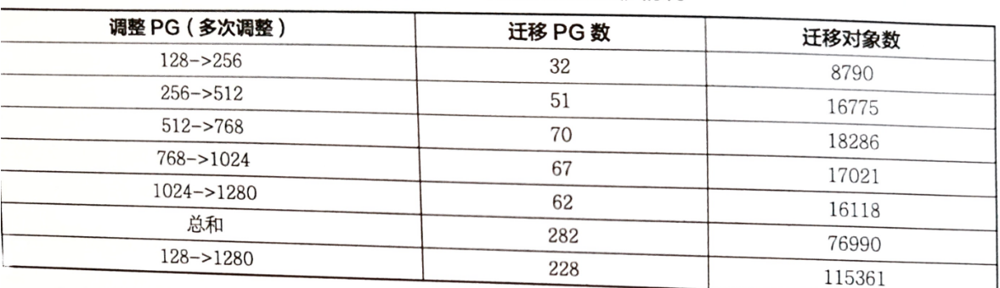
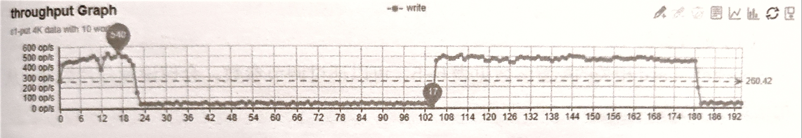
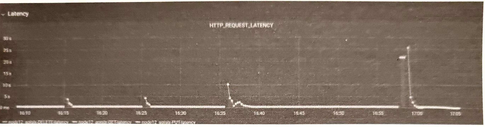
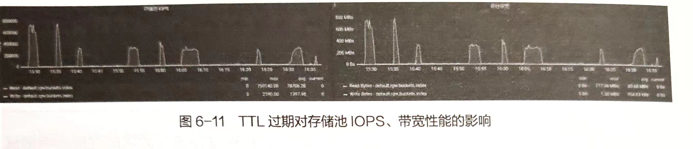
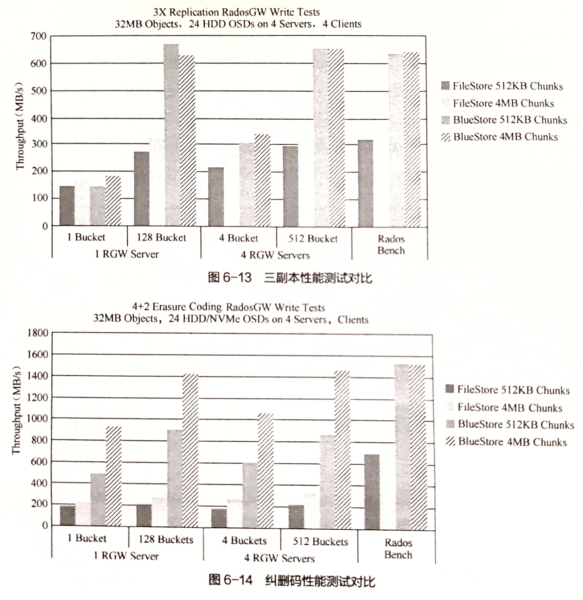

[TOC]

<!--more-->

[企业级]#13故障定位方法$

## 大规模集群参数配置问题

### PG分裂问题

Ceph是分布式对象存储系统，PG是一组对象的逻辑集合。在Ceph中，一条数据首先被分解为一系列对象，然后根据对象名称、池副本数和PG数 `PG_num` 执行散列操作，生成 `pgid` ，进而复制到不同的磁盘上，提高系统的可靠性。即PG是策略组，决定数据的分布，而PGP是以规划策略组为目的的策略组，PGP负责PG的分布。 `pg_num` 和 `pgp_num` 直接影响集群的数据分布情况，对于一个池而言 `pgp_num=pg_num` 。

通过PG，可以减少系统管理大量对象带来的资源占用，`pg_num` 需要根据集群规模调整
$$
pg\_num= 2^{\big\lceil\log_2(OSD总数\times 100/池副本数)\big\rceil}
$$

理论上，PG数越多，数据分布越均匀，每个对象存储节点（OSD）上的负载也越低。当新增OSD节点时，要让新增的节点参与分担集群负载，则需要根据扩容后的集群规模重新计算 `pg_num` 的大小，将集群中的部分数据迁移到新增的设备完成数据的重新平衡。Ceph中PG的数目在创建存储池时指定，之后不会随着集群规模的增加而自动增加。所以需要手动调大集群中存储池中的PG数量，当PG数目增加时，PG会更加均匀地分布在所有的OSD上。

某些对象的 `pg_id` 会由于`pg_num` 的增加相应发生变化，因此会有一部分对象从老的PG迁移到新的PG的现象，称为PG分裂。但PG分裂并不会触发数据迁移操作，调整 `pgp_num` 才会直接导致集群发生数据迁移。

1. Monitor检测到Pool中的PG数发生修改，发起并完成信息同步，随后将包含了变更信息的OSD map推送至相关OSD
2. OSD接收到新的OSD map，与原OSDmap对比。执行PG分裂
3. 通常PG数为2的整数次幂，且PGP数目与PG数同步修改，PG分裂通常伴随数据迁移

其中，`pgp_num` 的大小根据实际环境设定为：8、16、64、128等。对于这两个参数的调整，有两种策略：一次调整到最终值及多次小步的方式进行。为此，做了个小测试，采用vbstart环境模拟5个节点，30个OSD，创建存储池，副本数设为3，向其中写入13.2万个对象。当PG数量从128增加到1280时，相关迁移的PG数如表所示



在多次调整的策略下，PG迁移量比一次性调整多了54个(19%)，对象迁移量多了7665个(10%)。

但对于大规模集群应用，多次调整策略，可以灵活安排集群变更时间，且每次数据迁移量较小，对业务影响时间相对可控

### 对象存储元数据集群shard分片问题

#### 索引分片机制

Ceph对象网关，也即RADOS网关（radosgw, RGW），通过RESTful API和HTTP/s对外提供可访问且稳定的多租户对象存储。

Ceph RGW为每个存储桶（bucket）维护一个索引（bucket index），用于保存bucket中所有对象的元数据，但在Ceph H版之前，单个bucket的所有索引默认存放在一个索引对象中，随着单个bucket内的对象数量的增加，索引对象的也在相应增大。单个索引对象会产生可靠性和性能问题，因而一个存储桶中能够存储的对象数目十分有限。

- 可靠性：读取对象导致OSD超时
- 性能：写入和修改对象时对索引对象添加额外操作

为解决bucket索引对象过大带来的问题，在H版中，Ceph引入了bucket索引分片功能。将数据存储区索引分为多个部分，每个存储桶索引可以使用多个索引对象保存，每个索引对象为一个shard分片（以增加并行度）。基于shard分片的bucket极大扩展了bucket索引元数据条目的上限，并可有效提升存储系统的性能和可靠性，但一旦创建，就无法修改。

图

- 索引分片对象的部分属性（OMAP keys）在OSD中以单击数据库的形式保存，J版之前为Leveldb，之后Rocksdb代替。都是基于LSM-Tree的思想设计，理论基础：传统磁盘顺序读写比随机读写快的多，通过将随机读写转换成顺序读写可以提高系统的读写性能。

  Rocksdb支持多线程并发Compact功能，Leveldb只能单线程

在K版中，Ceph引入了重新分片（Bucket resharding）功能，允许用户修改存储桶bucket 索引分片的数量，但执行reshard的过程比较耗时，且会对业务造成较大的性能波动。

L版中引入了动态分片（Dynamic Bucket Resharding），对应控制参数为 `rgd_dynamic_resharding` ，默认开启该功能(true)。能够自动基于单个bucket中对象数量实现索引自动重新分片功能。但在实际测试应用过程中，执行动态分片仍会出现reshard时间过长导致集群写降级甚至出现I/O阻塞情况。因而在生产环境中，还是建议关闭。

#### 大规模场景下索引分片问题

虽然bucket中存储大量数据其索引可以通过分片的方式解决，但每个bucket索引的分片是有上限的，在大规模应用场景中，如果超过此阈值，则系统可能会出现以下问题：

**桶索引对象数上限引发性能下降**

每个bucket索引分片最多容纳102400个对象，当对象数远大于这个数，性能会剧烈下降。通过查看bucket的状态，发现bucket `fill_stats` 已经 `OVER 100%`

**自动分片影响bucket的可用性**

从L版开始，官方提供一个参数，默认在单个bucket的 `fill_stats` 在 `over 100%` 时自动对索引对象分片。但这个参数有致命缺陷。由于元数据对象在重新分散索引时为了保证数据一致性，会暂停bucket的读写功能，并且在存储大量数时需要消耗更多时间。

下图是开启bukcet index reshard后，对对象存储写请求性能影响测试



集群开启动态reshard功能，默认分片大小为1。从图中可以看出，在时间轴21处，集群I/O出现断崖式下滑，在180时再次断崖式下滑。通过RGW日志比对，此时间点为触发bucket reshard的时间点，足以验证 bucket 索引reshard对业务的影响。

**分片数量上限阈值**

当前Ceph支持的存储索引分片数量上限值为65521。但设置了该值后，如果不对RGW中的 `rgw_enable_quota_threads` 及 `rgw_bucket_quota_ttl` 参数进行优化配置。当TTL过期后，所有RGW实例接收到请求后会同时访问 `rgw_bucket_quota_ttl` 获取 quota信息，从而引起存储池性能骤降。





#### 索引分片问题规避方式

**配置参数**

可以通过调节参数，合理设置分片数量，从而达到性能最优

| 配置项                               | 说明                                                         |
| ------------------------------------ | ------------------------------------------------------------ |
| rgw_dynamic_resharding               | 是否开启自动分片，默认开启                                   |
| rgw_reshard num_logs                 | 分片并发数，默认为 16                                        |
| rgw_bucket_index_max_aio             | 一次下发的OP数                                               |
| rgw_reshard_thread_interval          | 执行reshard 间隔，默认为10min                                |
| rgw_max_objs_per_shard               | 每个 bucket 的索引的最大对象数，默认为 10万                  |
| rgw_override_bucket_index_max_shards | 桶索引对象的分片数量，若小于1，则以zone 配置项 bucket_index_max_shards 为准 |

**配置指令**

建议关闭自动重分片功能，使用下面的 radosgw-admin 命令配置来查看和手动控制重分片任务。

```
# 为桶新增一个重分片任务 
radosgw-admin reshard add --bucket=<bucket name> --num-shards=<new num of shards>
# 查看桶分片任务列表
radosgw-admin reshard list
# 手动执行重分片任务
radosgw-admin reshard process
# 取消桶重分片任务
radosgw-admin reshard cancel --bucket=<bucket name>
# 查看桶的分片状态
radosgw-admin reshard status --bucket=<bucket name>
```

**配置建议**

建议关闭 `rgw_dynamic_resharding` ，根据业务使用场景，合理预估出单个bucket需要存放的对象数量。按照每个shard承载10万对象数据的上限，控制好单个bucket_index_shard的平均体量。这样配置的好处是，后期不需要再进行重新分片，避免了重新分片过程带来的性能波动，甚至引发的I/O阻塞。

分片的数量不一定是越多越好，也需要结合业务提前进行规划。分片过多会导致某些操作(如列表储桶)消耗大量底层存储I/O，从而导致某些请求花费太长时间。

不建议把rgw_override_bucket_index_max_shards参数设置得太大(例如1000)，因为这会增加罗列桶对象列表时的成本。应该在客户端或全局部分中设置此变量，以便将其自动应用于radosgw-admin命令。

只对集群中少量的RGW实例开启quota_threads, 以降低RGW缓存过期时RGW实例并发访问default.rgw.buckets.index存储池时引起的性能抖动。

### BlueStore rocksdb slow disk space

在旧版本的Ceph中，默认使用的单机存储引擎是FileStore，会带来写放大的问题。它需要经过操作系统的通用文件系统（ext4或xfs）来管理数据，因此整体性能不佳。

BlueStore单机存储引擎最大的特点就是能够建立在裸盘上，并且对一些新型存储设备进行优化。即BlueStore的主要目的是通过对单机存储引擎性能进行优化，以提升Ceph集群整体的性能。官方给出的测试性能测试如下。



BlueStore最大优点是直接管理裸磁盘设备，并且将对象存储在该设备中。对象有很多Key-Value属性信息。这些信息之前都是存储在文件的扩展属性或Leveldb中。而在BlueStore中，全部存储在Rodksdb中。Rocksdb本身是需要运行在文件系统之上的，因此为了使用Rocksdb存储这些元数据，开发了简单的文件系统BlueFS。

- BlueFS是简单的用户态日志型文件系统，完整实现了Rocksdb所定义的全部API。这些API主要应用于固化Rocksdb运行过程中产生的.sst(SSTable)和.log(WAL)文件

  WAL对Rocksdb性能影响最为关键，在BlueFS设计上支持将.sst和.log分开存储，便于将.log文件单独保存在速度更快的固态存储介质上（NVMe SSD或NVRAM）

在引入BlueFS之后，BlueStore将所有存储空间从逻辑上划分为3个层次。

慢速（slow）空间：用于存储对象数据，可由大容量机械硬盘提供，BlueStore管理

高速（DB）空间：用于BlueStore内部产生的元数据，由普通SSD提供。由BlueFS直接管理

- BlueStore元数据都交给Rocksdb管理，而Rocksdb最终通过BlueFS保存，所以直接由BlueFS直接管理

超高速（VAL）空间：用于存储Rocksdb产生的.log文件，由 NVMe SSD或NVRAM提供。BlueFS直接管理

