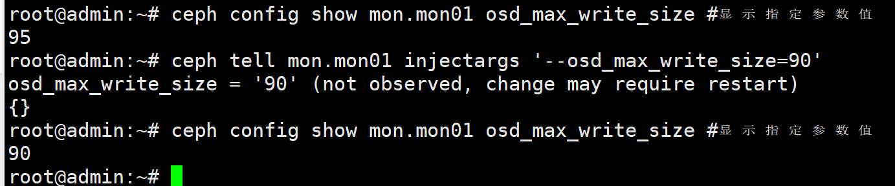
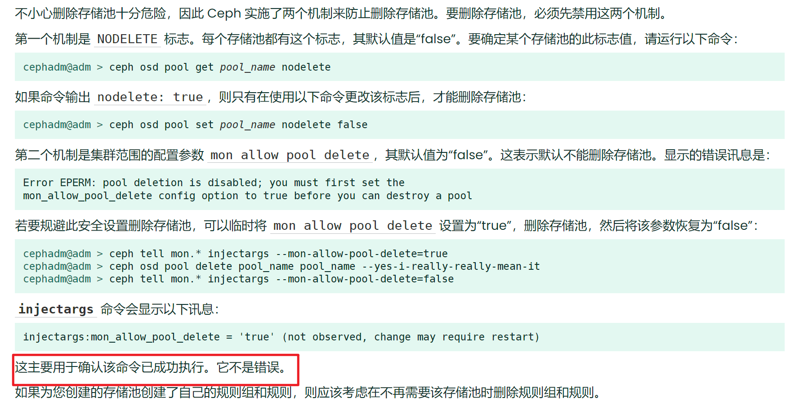

> 提取Ceph O版的所有参数分析

<!--more-->

## 相关指令

### 提取所有参数

```shell
touch O_conf.txt # 创建保存参数的文件

# 获取所有的参数名
ceph config ls > ceph_config.txt

# 获取各进程中参数的默认值
ceph config show-with-defaults mon.node1 | awk '{print $1,"=", $2}' > knobs_with_default.txt 
#分别在 mon,mgr,osd节点上，通过运行中的进程默认knobs值
ceph daemon mon.node1 config show > mon_default_knobs_value.txt
ceph daemon mgr.node2 config show > mgr_default_knobs_value.txt
ceph daemon osd.0 config show > osd_default_knobs_value.txt
三个角色的节点导出配置相同，导出为json格式，上一种导出为'NAME=VALUE'格式
```

#### 查看指定参数的值

```shell
# 获取参数默认值
ceph config get mgr.node2 <>
ceph config show mon.node1 osd_max_write_size #显示指定参数值
```

#### 在线修改配置

https://blog.csdn.net/qq_67736058/article/details/137922219

```shell
# 修改参数配置值，且重启后生效
ceph config set mon.node1 mgr/zabbix/log_to_file false
```

```shell
ceph tell mon.mon01 injectargs '--osd_max_write_size=95'
ceph tell osd.* injectargs '--osd_recovery_max_active=1 --osd_recovery_max_single_start=l --osd_recovery_op_priority=50'
```

ceph config set命令中指定进程不能使用.*来指代全部，而ceph tell 是可以的






## OSD相关参数

```shell
OSD单次写的最大大小，单位是MB
osd_max_write_size = 90 # 可通过tell修改

内存中允许的最大客户端数据消息大小，单位是字节
osd_client_message_size_cap = 524288000

mon_initial_members = mon01,

当Ceph总使用量达到阈值，则集群停止IO
创建集群时指定，创建集群后，可临时调大
https://access.redhat.com/documentation/zh-cn/red_hat_ceph_storage/3/html/troubleshooting_guide/deleting-data-from-a-full-cluster
mon_osd_full_ratio = 0.950000

mon_osd_nearfull_ratio = 0.850000
```

涉及集群稳定性和安全的关键参数需要在停机状态下进行修改


存在大小关系的参数

```
bluefs_max_log_runway = 4194304
bluefs_min_log_runway = 1048576

bluestore_bluefs_min_free = 1073741824
bluestore_bluefs_max_free = 10737418240

bluestore_bluefs_max_ratio = 0.900000
bluestore_bluefs_min_ratio = 0.900000

bluestore_compression_max_blob_size = 0
bluestore_compression_min_blob_size = 0
bluestore_compression_max_blob_size_hdd = 524288
bluestore_compression_min_blob_size_hdd = 131072
bluestore_compression_max_blob_size_ssd = 65536
bluestore_compression_min_blob_size_ssd = 8192

bluestore_extent_map_shard_max_size = 1200
bluestore_extent_map_shard_min_size = 150

bluestore_max_alloc_size = 0
bluestore_min_alloc_size = 0

filestore_min_sync_interval = 0.010000
filestore_max_sync_interval

mon_osd_cache_size = 500
mon_osd_cache_size_min = 134217728

mon_pg_warn_max_object_skew = 10.000000
mon_pg_warn_min_objects = 10000

ms_bind_port_max = 7300
ms_bind_port_min = 6800

osd_backfill_scan_max = 512
osd_backfill_scan_min = 64

osd_hit_set_max_size = 100000
osd_hit_set_min_size = 1000

osd_pg_log_trim_max = 10000
osd_pg_log_trim_min = 100

filestore_queue_max_bytes = 104857600
filestore_queue_max_ops = 50

mds_max_caps_per_client = 1048576
mds_min_caps_per_client

mon_client_hunt_interval_max_multiple = 10.000000
mon_client_hunt_interval_min_multiple = 1.000000

osd_scrub_chunk_max = 25
osd_scrub_chunk_min = 5

paxos_service_trim_max = 500
paxos_service_trim_min = 250

paxos_trim_max = 500
paxos_trim_min = 250

rgw_put_obj_max_window_size = 67108864
rgw_put_obj_min_window_size = 16777216
```


1. 参数含义
2. 确定是否存在不能在线修改的参数
3. 这些不能在线修改的参数是否对性能产生影响


创建池时使用单副本

```shell
ceph osd pool get [poolname] size
ceph osd pool set [poolname] size 1
```


