[TOC]

<!--more-->

## 系统设置

### 查看版本信息

```shell
cat /etc/issue
```

### 用户名、密码

- **一定要设置root密码** 
- nodexx 主机名，用户密码，

用户名

```shell
hostname #查看系统主机名称
node01@ hostnamectl set-hostname node01
node02@ hostnamectl set-hostname node02

hostnamectl set-hostname xx #修改主机名称	
	#执行命令之后，会自动修改 /etc/hostname 文件
	#执行命令之后，会立即生效，且重启系统也会生效
cat /etc/hostname	#查看 /etc/hostname 文件内容，里面配置的就是系统主机名称
```

```shell
sudo su
sudo gedit /etc/passwd # 找到原先的用户名，将其改为自己的用户名（一行全部都改）
sudo  gedit /etc/shadow #找到原先用户名（所有的名字都要改），改为自己的用户名
sudo gedit /etc/group #你应该发现你的用户名在很多个组中，全部修改！
mv /home/原用户名/ /home/新用户名

mv /home/ceph_admin/ /home/
```

密码（登录用户需要修改）

1. 进入Ubuntu，打开一个终端，输入 sudo su转为root用户。 注意，必须先转为root用户！！！
2. sudo passwd user(user 是对应的用户名)
3. 输入新密码，确认密码。
4. 修改密码成功，重启，输入新密码进入Ubuntu。

### 规划

```
ens33：NAT网络 VMnet8 公网ip设定为192.168.192.0/24 网段
ens37：仅主机 VMnet1 私有ip设定为10.168.192.0/24 网段，提供ceph集群内网络
```

| 主机名 | role               | 公有网络        | 私有网络       | 磁盘                |
| ------ | ------------------ | --------------- | -------------- | ------------------- |
| node1  | admin/mon/mgr/osd1 | 192.168.192.156 | 10.168.192.156 | sda50GB,sdb/sdc20GB |
| node2  | mon/mgr/osd3/osd4  | 192.168.192.157 | 10.168.192.157 | sda50GB,sdb/sdc20GB |

#### 主机名ip映射

在所有主机下配置以下内容

```shell
cat >> /etc/hosts <<EOF
# public network
192.168.192.156 node01
192.168.192.157 node02

# cluster network
10.168.192.156 node01-cl
10.168.192.157 node02-cl

# manage network
EOF

cat /etc/hosts
```

#### 静态ip

```shell
apt upgrade -y
sudo apt install -y net-tools   
ifconfig #查看网卡名称
ip a

cd /etc/netplan
sudo gedit 01-network-manager-all.yaml

network: 
 version: 2
 renderer: NetworkManager
 ethernets:
  ens33:
   dhcp4: false
   addresses: [192.168.192.156/24]
   gateway4: 192.168.192.2
   nameservers:
    addresses: [192.168.192.2]
  ens34:
  	dhcp4: false
  	addresses: [10.168.192.156/24]
  	nameservers:
     addresses: [10.168.192.2]

network: 
 version: 2
 renderer: NetworkManager
 ethernets:
  ens33:
   dhcp4: false
   addresses: [192.168.192.157/24]
   gateway4: 192.168.192.2
   nameservers:
    addresses: [192.168.192.2]
  ens34:
  	dhcp4: false
  	addresses: [10.168.192.157/24]
  	nameservers:
     addresses: [10.168.192.2]
    
sudo netplan apply 
```

### 时间同步

```shell
timedatectl set-timezone Asia/Shanghai
```

在所有虚拟机上安装并配置ntp（时间同步服务）

```shell
sudo apt install -y ntp
sudo apt install -y vim

sudo vim /etc/ntp.conf
将下面这行注释掉：
#pool 0.ubuntu.pool.ntp.org iburst
在文件末尾添加以下内容：
server ntp.ubuntu.com

重启ntp
sudo systemctl start ntp
检查 NTP 服务状态
sudo systemctl status ntp
客户端安装ntpdate
sudo apt install -y ntpdate
同步时间
sudo ntpdate 192.168.192.156

ntpdate pool.ntp.org
```

### 防火墙与SELinux

确保为monitor的6789端口添加防火墙策略，

确保为monitor的6789端口添加防火墙策略，

```shell
sudo systemctl stop ufw.service
sudo systemctl disable ufw.service
sudo ufw status

sudo apt -y install firewalld
firewall-cmd --zone=public --add-port=6789/tcp --permanent
firewall-cmd --zone=public --add-port=6800-7100/tcp --permanent
firewall-cmd --reload
firewall-cmd --zone=public --list-all
```

若只是测试环境，可以关闭防火墙

```shell
# 关闭防火墙
ufw stop
ufw disable
防火墙在系统启动时自动禁用
```

所有虚拟主机上禁用SELINUX

```shell
apt install -y selinux-utils

sudo apt install -y selinux-basics
sudo selinux-activate --disable

#临时禁用
setenforce 0

#永久禁用
vim /etc/selinux/config
# cat /etc/selinux/config
SELINUX=disabled
SELINUXTYPE=targeted
SETLOCALDEFS=0

node02@node02:~$ sestatus
SELinux status:                 disabled
```

## 节点间ssh免密登录

### 实现基于ssh key的验证

#### 实现root用户的ssh免密登录

```shell
sudo apt install openssh-server -y

ssh

vim /etc/ssh/sshd_config
# Allow Root Login
PermitRootLogin yes

service sshd restart
```

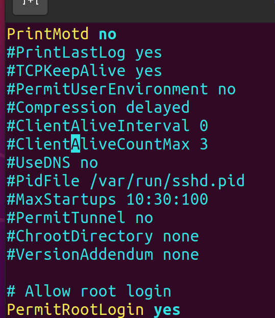

#### 通过sshpass为每个主机生成sshkey并推送给hosts中已知主机

```shell
sudo apt -y install sshpass
vim ssh_key_push.sh
```

在每个主机root用户下执行以下脚本

```shell
#!/bin/bash
#
#********************************************************************
#Author:            wangxiaochun
#QQ:                29308620
#Date:              2021-05-08
#FileName:          ssh_key_push.sh
#URL:               http://www.wangxiaochun.com
#Description:       多主机基于ssh key 互相验证
#Copyright (C):     2021 All rights reserved
#********************************************************************

#当前用户密码
PASS=admin
#设置网段最小和最大的地址的尾数
BEGIN=156
END=157

IP=`ip a s ens33 | awk -F'[ /]+' 'NR==4{print $3}'`
NET=${IP%.*}.

scan_host() {
    [ -e ./SCANIP.log ] && rm -f SCANIP.log
    for((i=$BEGIN;i<="$END";i++));do
        ping -c 1 -w 1  ${NET}$i &> /dev/null  && echo "${NET}$i" >> SCANIP.log &
    done
    wait
}

push_ssh_key() {
   	#生成ssh key 
    [ -e ~/.ssh/id_rsa ] || ssh-keygen -P "" -f ~/.ssh/id_rsa
    sshpass -p $PASS ssh-copy-id -o StrictHostKeyChecking=no root@$IP  &>/dev/null

    ip_list=(`sort -t . -k 4 -n  SCANIP.log`)
    for ip in ${ip_list[*]};do
        sshpass -p $PASS scp -o StrictHostKeyChecking=no -r ~/.ssh root@${ip}: &>/dev/null
    done

    #把.ssh/known_hosts拷贝到所有主机，使它们第一次互相访问时不需要输入yes回车
    for ip in ${ip_list[*]};do
        scp ~/.ssh/known_hosts @${ip}:.ssh/   &>/dev/null
    done
}

scan_host
push_ssh_key
```

```shell
bash ssh_key_push.sh
```

### 所有主机通过cephadm实现免密登录

#### 创建cephadm用户

```shell
#用脚本实现批量创建用户
cat > create_cephadm.sh <<EOF
# !/bin/bash
# 设定普通用户
useradd -m -s /bin/bash cephadm
echo cephadm:admin | chpasswd
echo "cephadm ALL=(ALL) NOPASSWD:ALL" > /etc/sudoers.d/cephadm
chmod 0440 /etc/sudoers.d/cephadm
EOF

echo "cephadm ALL=(ALL) NOPASSWD: ALL" >> /etc/sudoers

#批量执行
for i in {150..152}; do ssh root@192.168.192.$i bash < create_cephadm.sh ; done
```

检测是否创建用户

```shell
ll /etc/passwd
cat /etc/passwd
```

#### 跨主机免密登录

每台主机依次执行

```shell
su - cephadm
ssh-keygen -t rsa -P "" -f ~/.ssh/id_rsa

PASS=admin
for i in {150..152};do
	sshpass -p $PASS ssh-copy-id -o StrictHostKeyChecking=no cephadm@192.168.192.$i
done

for i in {153..155};do
	sshpass -p $PASS ssh-copy-id -o StrictHostKeyChecking=no cephadm@192.168.192.$i
done

root@node1:~# PASS=admin
root@node1:~# for i in {150..152};do
> sshpass -p $PASS ssh-copy-id -o StrictHostKeyChecking=no root@192.168.192.$i
> done
```

## ceph-deploy

### admin节点安装ceph-deploy工具

切到cephadm用户

```shell
#安装
cephadm@admin:~$sudo apt-cache madison ceph-deploy # 查看版本
cephadm@admin:~$sudo apt -y install ceph-deploy

#验证成功和查看版本
cephadm@admin:~$ceph-deploy --version
2.0.1

#查看帮助手册
cephadm@admin:~$ceph-deploy --help
# new：开始部署一个新的ceph 存储集群，并生成CLUSTER.conf 集群配置文件和keyring 认证文件。
#install: 在远程主机上安装ceph 相关的软件包, 可以通过--release 指定安装的版本。
# rgw：管理RGW 守护程序(RADOSGW,对象存储网关)。
# mgr：管理MGR 守护程序(ceph-mgr,Ceph Manager DaemonCeph 管理器守护程序)。
# mds：管理MDS 守护程序(Ceph Metadata Server，ceph 源数据服务器)。
# mon：管理MON 守护程序(ceph-mon,ceph 监视器)。
#gatherkeys：从指定的获取提供新节点验证keys，这些keys 会在添加新的MON/OSD/MD 加入的时候使用。
# disk：管理远程主机磁盘。
# osd：在远程主机准备数据磁盘，即将指定远程主机的指定磁盘添加到ceph 集群作为osd 使用。
# repo： 远程主机仓库管理。
# admin：推送ceph集群配置文件和client.admin 认证文件到远程主机。
# config：将ceph.conf 配置文件推送到远程主机或从远程主机拷贝。
# uninstall：从远端主机删除安装包。
# urgedata：从/var/lib/ceph 删除ceph 数据,会删除/etc/ceph 下的内容。
# purge: 删除远端主机的安装包和所有数据。
# forgetkeys：从本地主机删除所有的验证keyring, 包括client.admin, monitor, bootstrap 等认证文件。
# pkg： 管理远端主机的安装包。
# calamari：安装并配置一个calamari web 节点，calamari 是一个web 监控平台。
```

### ceph-deploy对集群初始化

生成集群配置，并未做实际安装

初始化第一个mon节点的命令格式为 `ceph-deploy new {initial-monitor-node(s)}` 

- ceph-mon 即为第一个monitor节点名称，其名称必须与节点当前实际使用的主机名称( `uname -n` ) 保持一致，即可以是短名称，也可以是长名称

  但短名称会导致错误： ceph-deploy new: error: hostname: xxx is not resolvable

- 推荐使用完整写法：`hostname:fqdn` 如：`ceph-mon:ceph-mon.wang.org`

```shell
#首先在管理节点上以cephadm用户创建集群相关的配置文件目录
cephadm@node1:~$ mkdir ceph-cluster && cd ceph-cluster
# 查看主机名
cephadm@node1:~$ mkdir ceph-cluster && cd ceph-cluster
node1

#运行如下命令即可生成初始配置：
cephadm@node1:~/ceph-cluster$ ceph-deploy new --public-network 192.168.192.0/24 --cluster-network 192.168.252.0/24 node1:node1.wang.org

cephadm@admin:~/ceph-cluster$ ceph-deploy new --public-network 192.168.192.0/24 --cluster-network 192.168.252.0/24 node1:node1.wang.org
# ceph.conf #自动生成的配置文件
# ceph-deploy-ceph.log #初始化日志
# ceph.mon.keyring #用于ceph mon 节点内部通讯认证的秘钥环文件
```

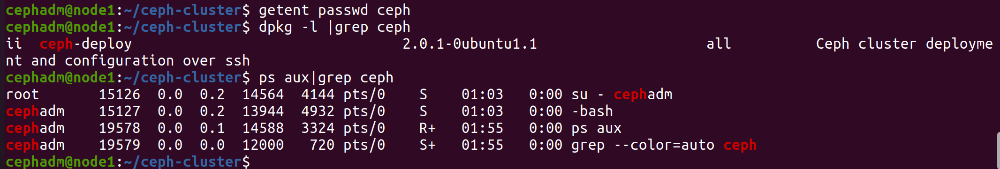

```shell
cephadm@node1:~/ceph-cluster$ cat ceph.conf
[global]
fsid = 96a78567-2c73-4b65-adf1-fb8a3c18766a
public_network = 192.168.192.0/24
cluster_network = 192.168.252.0/24
mon_initial_members = node1
mon_host = 192.168.192.150
auth_cluster_required = cephx
auth_service_required = cephx
auth_client_required = cephx

#注意：如果部署过程出现问题，需要清空
ceph-deploy forgetkeys
ceph-deploy purge node1 node1 node1
ceph-deploy purgedata node1 node1 node1
rm ceph.*

#如果想要一下子将所有的mon节点都部署出来，我们可以执行下面的命令
ceph-deploy new --public-network 192.168.192.130/24 --cluster-network 192.168.252.0/24 mon01:mon01.wang.org mon02:mon02.wang.org mon03:mon03.wang.org

cephadm@admin:~/ceph-cluster$ cat ceph.conf
[global]
fsid = a168efb2-3012-48b3-aac7-31a11c232235
public_network = 192.168.192.130/24
cluster_network = 192.168.252.0/24
mon_initial_members = mon01, mon02, mon03
mon_host = 192.168.192.131,192.168.192.132,192.168.192.133
auth_cluster_required = cephx
auth_service_required = cephx
auth_client_required = cephx
```

### ceph包的安装——不推荐用ceph-deploy install

#### 为所有节点配置ceph包安装源

```shell
#在管理节点准备脚本,注意以root身份执行
root@node1:cat > ceph_repo.sh <<EOF
#!/bin/bash
# 更新ceph的软件源信息
echo "deb https://mirror.tuna.tsinghua.edu.cn/ceph/debian-quincy/ $(lsb_release -sc) main" > /etc/apt/sources.list.d/ceph.list 
wget -q -O- 'https://download.ceph.com/keys/release.asc' | apt-key add - 
apt update
EOF

#因为所有节点都会依赖于这些apt源信息，需要进行同步
[root@admin ~]for i in {150..152};do ssh -o StrictHostKeyChecking=no 192.168.192.$i bash < ceph_repo.sh;done

# 去其他结点查看
cat /etc/apt/sources.list.d/ceph.list
```

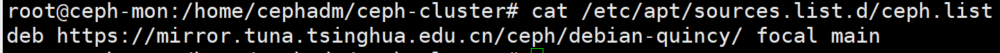

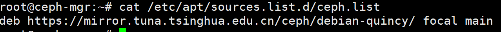

#### ceph-deploy install指令介绍

初始化节点相当于在存储节点安装了ceph 及ceph-rodsgw

- 默认情况下，ceph-deploy会安装最新版本的ceph，若需要指定ceph版本，添加参数 `--release {ceph-release-name}`

```shell
#命令格式：
ceph-deploy install --{role} {node} [{node} ...]
#注意：这里主要是ceph的工作角色的的节点
#方法1:使用ceph-deploy命令能够以远程的方式连入Ceph集群各节点完成程序包安装等操作
# 一般情况下，不推荐使用这种直接的方法来进行安装，效率太低，实际上也是在各节点上执行方法2
ceph-deploy install --mon mon01 mon02 mon03

#方法2:上述指令等价在每个ceph-node节点安装 ceph-{role}
apt install -y ceph ceph-osd ceph-mds ceph-mon radosgw
```

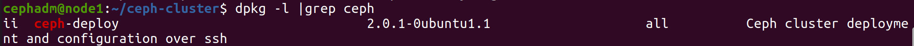

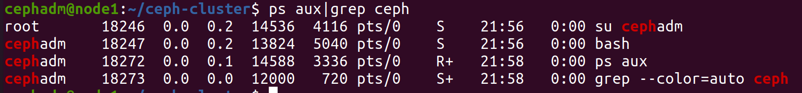

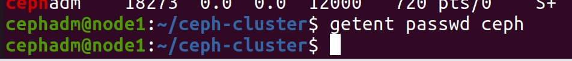

### mon节点

#### 安装mon节点依赖

```shell
#在admin主机上，向mon节点安装mon组件
cephadm@admin:~/ceph-cluster$ ceph-deploy install --no-adjust-repos --nogpgcheck --mon mon01 mon02 mon03

#或者直接在mon节点安装软件
[root@ceph-mon ~] apt -y install ceph-mon
```

安装完成后，发现自动创建了ceph用户

```shell
cephadm@node1:~/ceph-cluster$ getent passwd ceph
ceph:x:64045:64045:Ceph storage service:/var/lib/ceph:/usr/sbin/nologin
```

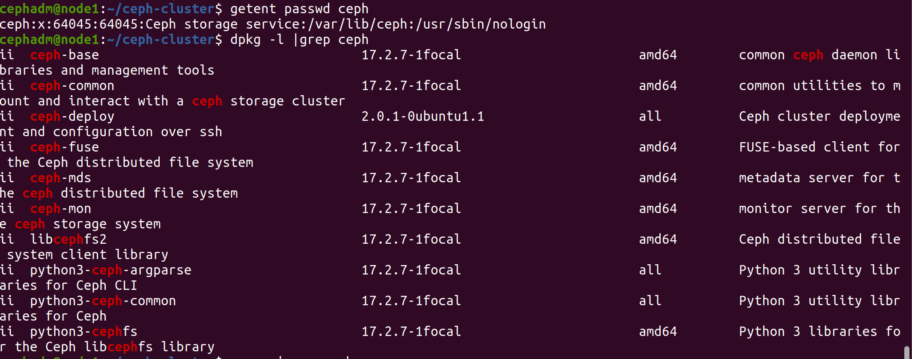

验证在mon 节点已经自动安装并启动了ceph-mon 服务

```shell
cephadm@node1:~/ceph-cluster$ dpkg -l |grep ceph
cephadm@node1:~/ceph-cluster$ ps aux|grep ceph
```

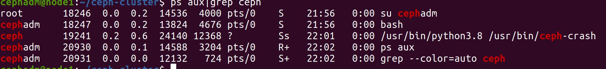

#### 初始化mon节点生成配置信息

确定集群配置信息，根据集群规划修改

```shell
vim ceph.conf

若是3mon节点
[global]
fsid = a168efb2-3012-48b3-aac7-31a11c232235
public_network = 192.168.192.130/24
cluster_network = 192.168.252.0/24
mon_initial_members = mon01, mon02, mon03
mon_host = 192.168.192.131,192.168.192.132,192.168.192.133
auth_cluster_required = cephx
auth_service_required = cephx
auth_client_required = cephx

单mon节点
[global]
fsid = 7d8af3fe-089e-40ee-85d0-2854ff3c1631
public_network = 192.168.192.0/24
cluster_network = 192.168.252.0/24
mon_initial_members = ceph-mon
mon_host = 192.168.192.120
auth_cluster_required = cephx
auth_service_required = cephx
auth_client_required = cephx
```

初始化集群mon节点

```shell
cephadm@node1:~/ceph-cluster$ ceph-deploy --overwrite-conf mon create-initial
```

查看生成的配置文件

- 节点初始化会生成一些ceph.bootstrap -mds/mgr/osd/rgw 等服务的keyring 认证文件，这些初始化文件拥有对ceph 集群的最高权限，所以一定要保存好。

```shell
cephadm@node1:~/ceph-cluster$ ll

ceph.bootstrap-mds.keyring 引导启动 mds的密钥文件
ceph.bootstrap-mgr.keyring 引导启动 mgr的密钥文件
ceph.bootstrap-osd.keyring 引导启动 osd的密钥文件
ceph.bootstrap-rgw.keyring 引导启动 rgw的密钥文件
ceph.client.admin.keyring ceph客户端和管理端通信的认证密钥，是最重要的
ceph.conf
ceph-deploy-ceph.log
ceph.mon.keyring
#结果显示：这里生成了一系列的与ceph集群相关的 认证文件
#注意：ceph.client.admin.keyring 拥有ceph集群的所有权限，一定不能有误。
```

- 此时在mon节点启动了一些进程

```shell
#到mon的节点上查看mon的自动开启相应的守护进程
[root@mon01 ~]ps aux|grep ceph
```

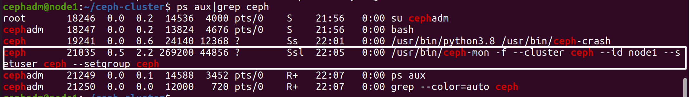

```shell
cephadm@node1:~/ceph-cluster$ ls /etc/ceph/
ceph.conf  rbdmap  tmp_knw2l2z
```

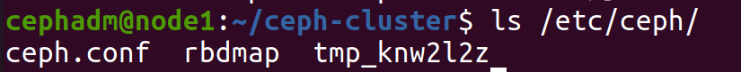

#### 向admin节点推送admin密钥

在admin角色的主机上，把配置文件和admin密钥拷贝到Ceph集群各监控角色节点mon

- 注意：原则上要求：所有mon节点上的 ceph.conf 内容必须一致，如果不一致的话，可以通过下面命令同步

  ```shell
  ceph-deploy --overwrite-conf config push mon01 mon02 mon03
  
  #集群admin节点的认证文件分发到admin节点
  ceph-deploy admin {admin-node}
  
  ceph-deploy admin --help
  #usage: ceph-deploy admin [-h] HOST [HOST ...]
  #Push configuration and client.admin key to a remote host.
  #positional arguments:
  #	HOST 	host to configure for Ceph administration
  #optional arguments:
  #	-h, --help show this help message and exit
  ```

在mon节点实现集群管理

```shell
#分发admin认证前，
cephadm@node1:~/ceph-cluster$ ls /etc/ceph/
ceph.conf  rbdmap  tmpaagml4w1

cephadm@node1:~/ceph-cluster$ ceph-deploy admin node1
cephadm@node1:~/ceph-cluster$ ls /etc/ceph/
ceph.client.admin.keyring  ceph.conf  rbdmap  tmpaagml4w1

结果显示：这里多了一个 ceph的客户端与服务端进行认证的密钥文件了
# ceph.client.admin.keyring 主要用于ceph节点与管理端的一个通信认证。
```

问题：虽然我们把认证文件传递给对应的admin主机了，但是admin节点是通过普通用户cephadm来进行交流的。而默认情况下，传递过去的认证文件，cephadm普通用户是无法正常访问的

```shell
#cephadm用户执行命令因文件权限会出错
[root@node1 ~] su - cephadm
cephadm@node1:~/ceph-cluster$ ceph -s
```

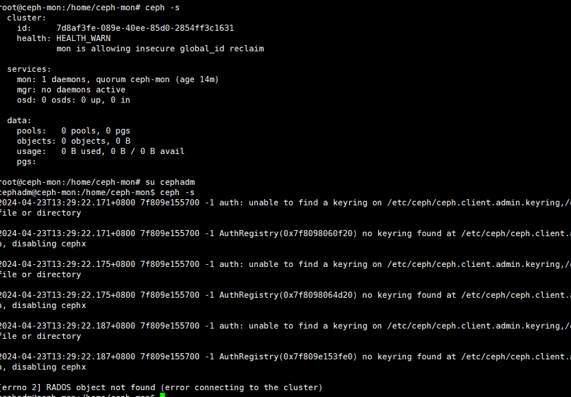

在集群中需要运行ceph指令的节点上，为cephadm用户设置/etc/ceph/ceph.client.admin.keyring文件权限

````shell
cephadm@node1:~/ceph-cluster$ sudo apt install acl
cephadm@node1:~/ceph-cluster$ sudo setfacl -m u:cephadm:r /etc/ceph/ceph.client.admin.keyring
````

此时cephadm用户有了集群的管理权限

```shell
#消除 mon is allowing insecure global_id reclaim的报警信息
cephadm@node1:~/ceph-cluster$ ceph config set mon auth_allow_insecure_global_id_reclaim false

#再次查看没有告警信息
cephadm@node1:~/ceph-cluster$ ceph -s
```

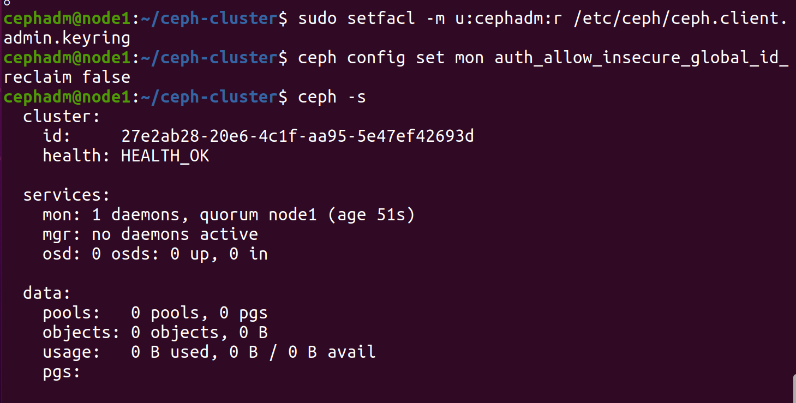

### mgr节点

Ceph-MGR工作的模式是事件驱动型的，简单来说，就是等待事件，事件来了则处理事件返回结果，又继续等待。

对于测试环境其实一个就能够正常使用了

#### 安装mgr节点依赖

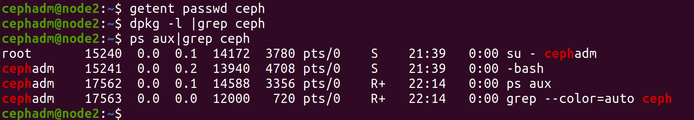

```shell
ceph-deploy install --mgr node2
cephadm@node2:~$ getent passwd ceph

dpkg -l |grep ceph# 之前是没有的，安装之后，多了
```

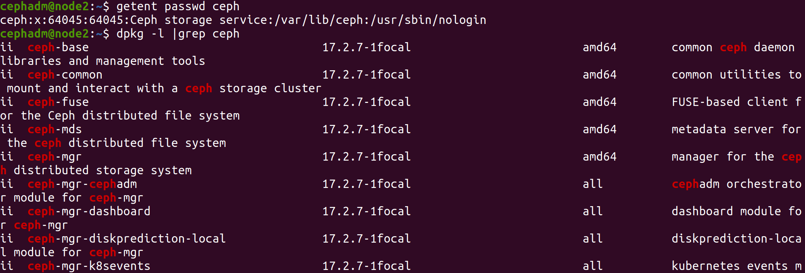

且进程启动

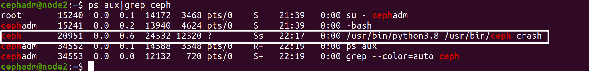

#### 将mgr节点加入集群

在 admin 节点的 /ceph-cluster 目录下执行

```shell
cephadm@ceph-mon:~/ceph-cluster$ ceph-deploy mgr create node2

#自动在mgr01节点生成配置文件和用户
```

https://www.cnblogs.com/zyxnhr/p/10539740.html

防火墙没关

```shell
systemctl status firewalld
systemctl stop firewalld
systemctl disabled  firewalld
systemctl disable  firewalld
```

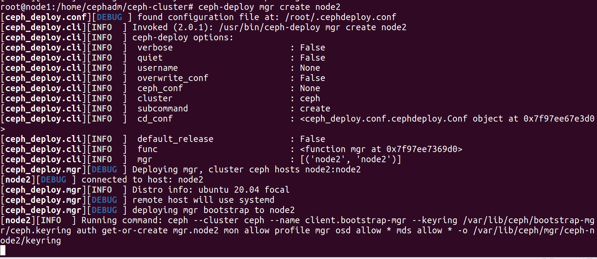

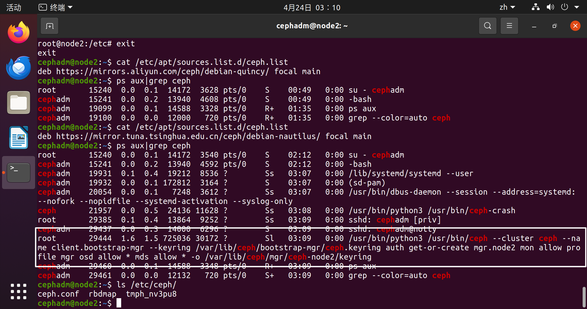

### osd节点

要设置OSD环境，一般执行下面步骤：

- 要知道对应的主机上有哪些磁盘可以提供给主机来进行正常的使用。
- 格式化磁盘(非必须)
- ceph擦除磁盘上的数据
- 添加osd

```shell
#所有的存储节点主机都准备了两块额外的磁盘，
[root@store01 ~] lsblk
NAME   MAJ:MIN RM   SIZE RO TYPE MOUNTPOINT
loop0    7:0    0  63.3M  1 loop /snap/core20/1828
loop1    7:1    0     4K  1 loop /snap/bare/5
loop2    7:2    0  63.5M  1 loop /snap/core20/2015
loop3    7:3    0 346.3M  1 loop /snap/gnome-3-38-2004/119
loop4    7:4    0 349.7M  1 loop /snap/gnome-3-38-2004/143
loop5    7:5    0  91.7M  1 loop /snap/gtk-common-themes/1535
loop6    7:6    0    46M  1 loop /snap/snap-store/638
loop7    7:7    0  49.9M  1 loop /snap/snapd/18357
loop8    7:8    0  40.9M  1 loop /snap/snapd/20290
sda      8:0    0    20G  0 disk 
├─sda1   8:1    0   512M  0 part /boot/efi
├─sda2   8:2    0     1K  0 part 
└─sda5   8:5    0  19.5G  0 part /
sdb      8:16   0    20G  0 disk 
sdc      8:32   0    20G  0 disk 
sr0     11:0    1   4.1G  0 rom  /media/store01/Ubuntu 20.04.6 LTS amd64

#如果不想查看大量无效设备的话，可以执行下面清理操作
sudo apt autoremove --purge snapd -y

DISK="/dev/sdX"

DISK="/dev/sdd"

## Zap the disk to a fresh, usable state (zap-all is important, b/c MBR has to be clean)
sgdisk --zap-all $DISK

## Wipe a large portion of the beginning of the disk to remove more LVM metadata that may be present
dd if=/dev/zero of="$DISK" bs=1M count=100 oflag=direct,dsync

## SSDs may be better cleaned with blkdiscard instead of dd
blkdiscard $DISK

## Inform the OS of partition table changes
partprobe $DISK
```

#### 安装osd依赖

```shell
#1. 确认仓库配置
[root@store01 ~] cat /etc/apt/sources.list.d/ceph.listdeb https://mirror.tuna.tsinghua.edu.cn/ceph/debian-pacific/ focal main wget -q -O- https://download.ceph.com/keys/release.asc

#2. 安装OSD相关软件
#方法1: 在管理节点远程安装
cephadm@admin:~/ceph-cluster$ ceph-deploy install --release pacific --osd store01 
#方法2: 在OSD主机手动安装
[root@store01 ~] apt -y install ceph-osd

#3. 确认安装结果
#自动生成用户ceph
[root@store01 ~] tail -n1 /etc/passwd
[root@store01 ~] dpkg -l |grep ceph

ls /etc/ceph/
ps aux|grep ceph
```

#### 查看所有可用的osd磁盘

```shell
#检查并列出OSD节点上所有可用的磁盘的相关信息
cephadm@admin:~/ceph-cluster$ ceph-deploy disk list node3
```

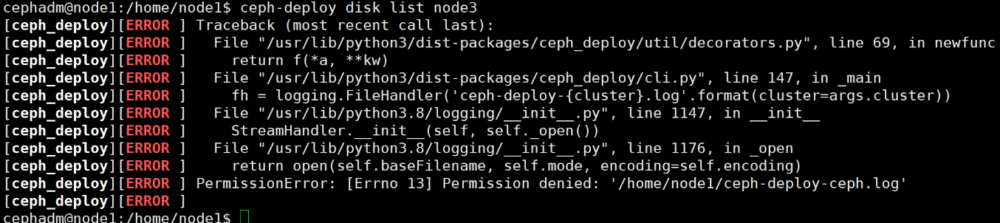

报错原因是 python 版本问题

```shell
# 修改375行,将 if line.startswith('Disk /'): 更改为 if line.startswith(b'Disk /')
#只在'Disk前加一个字母 b 即可
cephadm@admin:~$sudo vim +375 /usr/lib/python3/dist-packages/ceph_deploy/osd.py
```

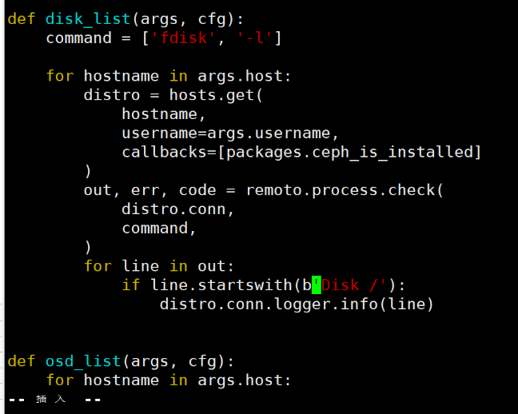

```shell
cephadm@node1:~/ceph-cluster$ ceph-deploy disk list node3
很奇怪，权限问题
setfacl -m u:cephadm:rw /home/cephadm/ceph-cluster/*
```

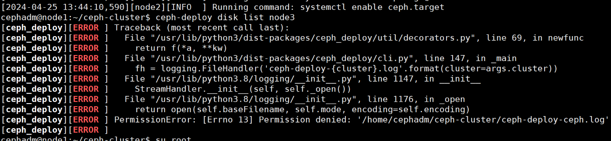

修改权限后可看

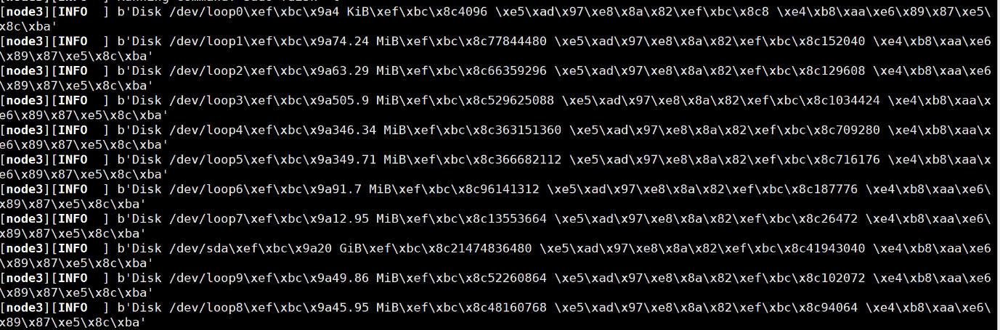

##### 清除OSD磁盘

在管理节点上使用ceph-deploy命令擦除计划专用于OSD磁盘上的所有分区表和数据以便用于OSD

注意: 如果硬盘是无数据的新硬盘此步骤可以不做

```shell
ceph-deploy disk zap [-h] [--debug] [HOST] DISK [DISK ...]
#说明此操操作本质上就是执行dd if=/dev/zero of=disk bs=1M count=10

for i in {0..2};do ceph-deploy disk zap 192.168.192.15$i /dev/sdb;done
```

#### 集群添加osd节点

对于OSD的相关操作，可以通过 `ceph-deploy osd` 命令来进行，帮助信息如下

```shell
#查看帮助
cephadm@admin:~/ceph-cluster$ ceph-deploy osd --help

#帮助显示：这里提示了两类的存储机制：
#默认情况下用的就是 bluestore类型
#对于bluestore来说，它主要包括三类数据：
--data /path/to/data #ceph 保存的对象数据
--block-db /path/to/db-device #数据库,即为元数据
--block-wal /path/to/wal-device #数据库的 wal 日志
#生产建议data和wal日志分别存放

#对于filestore来说，它主要包括两类数据
--data /path/to/data #ceph的文件数据
--journal /path/to/journal #文件系统日志数据

#对于 osd来说，它主要有两个动作：
list 列出osd相关的信息
create 创建osd设备
```

```shell
ceph-deploy --overwrite-conf osd create node1 --data /dev/sdb
ceph-deploy --overwrite-conf osd create node2 --data /dev/sdb
ceph-deploy --overwrite-conf osd create node3 --data /dev/sdb
```

### 高可用扩展

#### mgr扩展

当前只有一个Mgr节点主机,存在SPOF,添加新的Mgr节点实现高可用

Ceph Manager守护进程以Active/Standby模式运行，部署其它ceph-mgr守护程序可确保在Active节点或其上的ceph-mgr守护进程故障时，其中的一个Standby实例可以在不中断服务的情况下接管其任务。

```shell
#1. 在新mgr结点上安装mgr软件
#方法1:在管理节点远程在mgr02节点上安装Mgr软件
cephadm@admin:~/ceph-cluster$ ceph-deploy install --mgr mgr02
#方法2:在mgr02节点手动安装软件
[root@mgr02 ~]#apt -y install ceph-mgr

#2. 添加第二个 Mgr节点
cephadm@admin:~/ceph-cluster$ ceph-deploy mgr create mgr02

#3. 查看
cephadm@admin:~/ceph-cluster$ ceph -s
#结果显示：mgr01节点就是主角色节点，mgr02是从角色节点。
#关闭mgr01节点,mgr02节点自动成为active节点
[root@mgr01 ~]#reboot
[root@admin ~]#ceph -s
```

#### mon扩展

当前只有一个mon结点主机，存在SPOF，添加新的mon结点实现高可用

如果 $n$ 个结点，至少需要保证 $\frac{n}{2}$ 个以上的健康mon结点，ceph集群才能正常使用

```shell
#先在新mon节点安装mon软件
ceph-deploy install --mon mon节点名称
#添加后续的mon节点命令
ceph-deploy mon add mon节点名称
#注意：如果add换成destroy，则变成移除mon节点
```

如：

```shell
#1. 在新的mon结点安装mon软件
#方法1:在mon02节点上安装mon软件
cephadm@admin:~/ceph-cluster$ ceph-deploy install --mon mon02
#方法2:在mon02节点手动安装mon软件也可以
[root@mon02 ~] apt -y install ceph-mon

#2. 添加在mon02节点
cephadm@admin:~/ceph-cluster$ ceph-deploy mon add mon02

#3. 添加mon03节点
cephadm@admin:~/ceph-cluster$ ceph-deploy install --mon mon03
cephadm@admin:~/ceph-cluster$ ceph-deploy mon add mon03

#4. 修改ceph配置添加后续的Mon节点信息
cephadm@admin:~/ceph-cluster$vim ceph.conf
mon_host = 192.168.192.131,192.168.192.132,192.168.192.133
#同步ceph配置文件到所有ceph节点主机
cephadm@admin:~/ceph-cluster$ ceph-deploy --overwrite-conf config push admin mon0{1,2,3} mgr0{1,2} store0{1,2,3}

#5. 重新生成初始化配置信息
ceph-deploy --overwrite-conf mon create-initial
#注意：为了避免因为认证方面导致的通信失败，推荐使用 --overwrite-conf 参数
#如果是在一个现有的环境上部署业务，可以先推送基准配置文件
ceph-deploy --overwrite-conf config push mon01 mon02 mon03

#6. 查看
cephadm@admin:~/ceph-cluster$ ceph -s
```

## cephadm

https://blog.csdn.net/gengduc/article/details/134900065

https://blog.csdn.net/rookie23rook/article/details/128510437

### docker

#### 下载containerd和docker

在每台主机上操作

[下载页](https://github.com/containerd/containerd/releases) 

直接下载：cri-containerd-1.7.2-linux-amd64.tar.gz，该包里面包含了containerd、 ctr、crictl、containerd-shim等二进制文件，还有启动命令等，只要在/下解压即可。

```shell
tar xf cri-containerd-1.7.2-linux-amd64.tar.gz -C /
cat > /etc/crictl.yaml << EOF

runtime-endpoint: unix:///var/run/containerd/containerd.sock
image-endpoint: unix:///var/run/containerd/containerd.sock
timeout: 10
debug: false
EOF
```

##### 生成containerd配置文件

```shell
mkdir /etc/containerd
containerd config default > /etc/containerd/config.toml
```

修改 /etc/containerd/config.toml，

```shell
vi /etc/containerd/config.toml

## 用于从安全上下文中提取设备所有权信息，kubevirt cdi依赖该参数，不设置该参数可能出现无权限
device_ownership_from_security_context = true
## 调整日志
max_container_log_line_size = 163840
SystemdCgroup = true
```

修改/etc/systemd/system/containerd.service，

```shell
vim /etc/systemd/system/containerd.service
将`LimitNOFILE=infinity`改为`LimitNOFILE=655360` 
```

```shell
systemctl enable containerd && systemctl restart containerd

使用 crictl info 查看配置是否生效
```

##### 其他节点只需将相关文件拷贝过去启动即可

在node01上操作

```shell
for i in {1..3};do scp -rp /usr/local/bin node0$i:/usr/local/;scp -rp /usr/local/sbin node0$i:/usr/local/;scp /etc/containerd node0$i:/etc/; scp /etc/systemd/system/containerd.service node0$i:/etc/systemd/system/;done

for i in {2..2};do scp -rp /usr/local/bin node0$i:/usr/local/;scp -rp /usr/local/sbin node0$i:/usr/local/;scp /etc/containerd node0$i:/etc/; scp /etc/systemd/system/containerd.service node0$i:/etc/systemd/system/;done

for i in {2..2};do cmd=$(systemctl daemon-reload && systemctl enable containerd && systemctl restart containerd);ssh node0$i "$cmd";done
```

#### docker

下载docker安装包 ：https://download.docker.com/linux/static/stable/x86_64/docker-20.10.23.tgz

解压 

```shell
tar xf docker-20.10.23.tgz
```

需要用到的二进制文件包括：docker 和 dockerd，拷贝到 /usr/bin/目录下即可。

```shell
mv docker/docker* /usr/bin/
```

创建 docker 用户

```shell
useradd -s /sbin/nologin docker
# 如果docker组存在，则使用 
useradd -s /sbin/nologin docker -g docker
```

启动的配置文件 docker.serivce 和 docker.socket 拷贝到 /usr/lib/systemd/system/，daemon.json文件放到/etc/docker目录

```shell
cat > /usr/lib/systemd/system/docker.service  <<EOF

[Unit]
Description=Docker Application Container Engine
Documentation=https://docs.docker.com
After=network-online.target docker.socket firewalld.service containerd.service
Wants=network-online.target
Requires=docker.socket

[Service]
Type=notify
# the default is not to use systemd for cgroups because the delegate issues still
# exists and systemd currently does not support the cgroup feature set required
# for containers run by docker
# ExecStart=/usr/bin/dockerd --graph=/data/docker -H fd:// --containerd=/run/containerd/containerd.sock --cri-containerd --debug
ExecStart=/usr/bin/dockerd -H fd:// --containerd=/run/containerd/containerd.sock --cri-containerd --debug
ExecReload=/bin/kill -s HUP \$MAINPID
TimeoutSec=0
RestartSec=2
Restart=always

# Note that StartLimit* options were moved from "Service" to "Unit" in systemd 229.
# Both the old, and new location are accepted by systemd 229 and up, so using the old location
# to make them work for either version of systemd.
StartLimitBurst=3

# Note that StartLimitInterval was renamed to StartLimitIntervalSec in systemd 230.
# Both the old, and new name are accepted by systemd 230 and up, so using the old name to make
# this option work for either version of systemd.
StartLimitInterval=60s

# Having non-zero Limit*s causes performance problems due to accounting overhead
# in the kernel. We recommend using cgroups to do container-local accounting.
# 可能会出现错误："Failed at step LIMITS spawning /usr/bin/dockerd: Operation not permitted"，则需要将LimitNOFILE=infinity 改成：LimitNOFILE=65530
LimitNOFILE=infinity
LimitNPROC=infinity
LimitCORE=infinity

# Comment TasksMax if your systemd version does not support it.
# Only systemd 226 and above support this option.
TasksMax=infinity

# set delegate yes so that systemd does not reset the cgroups of docker containers
Delegate=yes

# kill only the docker process, not all processes in the cgroup
KillMode=process

[Install]
WantedBy=multi-user.target
EOF
```

```shell
cat > /usr/lib/systemd/system/docker.socket <<EOF
[Unit]
Description=Docker Socket for the API
PartOf=docker.service

[Socket]
ListenStream=/var/run/docker.sock
SocketMode=0660
SocketUser=root
SocketGroup=docker

[Install]
WantedBy=sockets.target
EOF
```

启动docker

```shell
systemctl daemon-reload && systemctl enable docker --now
```

配置镜像加速和私有仓库

```shell
cat > /etc/docker/daemon.json <<EOF
{
  "registry-mirrors": ["https://vty0b0ux.mirror.aliyuncs.com"],
  "exec-opts": ["native.cgroupdriver=systemd"],
  "log-driver": "json-file",
  "log-opts": {
    "max-size": "500m"
  },
  "storage-driver": "overlay2",
  "insecure-registries": ["registry.demo.com","192.168.59.249:5000"]
}
EOF
```

重启docker

```shell
systemctl restart docker
```

将node01上的docker配置文件复制到其他节点

```shell
for i in {2..5};do scp /usr/bin/docker* ceph0$i:/usr/bin/;scp -rp /etc/docker ceph0$i:/etc/;scp /usr/lib/systemd/system/docker.service ceph0$i:/usr/lib/systemd/system/;scp /usr/lib/systemd/system/docker.socket ceph0$i:/usr/lib/systemd/system/;done

for i in {2..2};do scp /usr/bin/docker* node0$i:/usr/bin/;scp -rp /etc/docker node0$i:/etc/;scp /usr/lib/systemd/system/docker.service node0$i:/usr/lib/systemd/system/;scp /usr/lib/systemd/system/docker.socket node0$i:/usr/lib/systemd/system/;done
```

在ceph02-05上操作

```shell
useradd -s /sbin/nologin docker 
systemctl daemon-reload && systemctl enable docker --now
```

### cephadm

#### 修改ceph源

```shell
#在管理节点准备脚本,注意以root身份执行
root@node1:cat > ceph_repo.sh <<EOF
#!/bin/bash
# 更新ceph的软件源信息
echo "deb https://mirror.tuna.tsinghua.edu.cn/ceph/debian-quincy/ $(lsb_release -sc) main" > /etc/apt/sources.list.d/ceph.list 
wget -q -O- 'https://download.ceph.com/keys/release.asc' | apt-key add - 
apt update
EOF

bash ceph_repo.sh

#因为所有节点都会依赖于这些apt源信息，需要进行同步
[root@admin ~]for i in {156..157};do ssh -o StrictHostKeyChecking=no 192.168.192.$i bash < ceph_repo.sh;done

# 去其他结点查看
root@node02:/# cat /etc/apt/sources.list.d/ceph.list
deb https://mirror.tuna.tsinghua.edu.cn/ceph/debian-quincy/ focal main
```

#### 管理节点安装cephadm

```shell
apt install -y cephadm

whereis cephadm # 检查安装情况

# 输出如下内容
root@node01:/# whereis cephadm
cephadm: /usr/sbin/cephadm /usr/share/man/man8/cephadm.8.gz
```

#### 检查

检查ceph各节点是否满足安装ceph集群，该命令需要在当前节点执行，比如要判断ceph02是否支持安装ceph集群，则在ceph02上执行

```shell
cephadm check-host --expect-hostname node01

docker (/usr/bin/docker) is present
systemctl is present
lvcreate is present
Unit chronyd.service is enabled and running
Hostname "ceph02" matches what is expected.
Host looks OK

## 也可以使用以下命令检查
cephadm check-host --expect-hostname `hostname`
```

### 初始化集群

cephadm bootstrap 过程是在单一节点上创建一个小型的ceph集群，包括一个ceph monitor和一个ceph mgr，监控组件包括prometheus、node-exporter等。

然后向集群中添加主机以扩展集群，进而部署其他服务

```shell
cephadm bootstrap --mon-ip 192.168.192.156 --cluster-network 10.168.192.0/24 --initial-dashboard-user admin --initial-dashboard-password admin

cephadm bootstrap --mon-ip 192.168.192.156 --cluster-network 10.168.192.0/24 --allow-overwrite --skip-dashboard

# 会卡很久
# 查看日志
tail -f /var/log/ceph/cephadm.log
```

初始化时，指定了mon-ip、集群网段、dashboard初始用户名和密码

```shell
--mon-ip 192.168.59.241 \
--cluster-network 10.168.192.0/24 \
指定dashboard用户名和密码  
--initial-dashboard-user admin \
--initial-dashboard-password admin \
##  指定私钥和公钥
--ssh-private-key /root/.ssh/id_rsa \
--ssh-public-key /root/.ssh/id_rsa.pub \

## 启动前不拉取默认镜像
--skip-pull
## 指定私有镜像仓库
--registry-url registry.demo.com \
--registry-username admin \
--registry-password Harbor12345 
```

```shell
## 需要指定监控组件镜像
ceph config set mgr mgr/cephadm/container_image_prometheus registry.demo.com/prometheus/prometheus:v2.33.4
ceph config set mgr mgr/cephadm/container_image_grafana registry.demo.com/ceph/ceph-grafana:8.3.5
ceph config set mgr mgr/cephadm/container_image_alertmanager registry.demo.com/prometheus/alertmanager:v0.23.0
ceph config set mgr mgr/cephadm/container_image_node_exporter registry.demo.com/prometheus/node-exporter:v1.3.1
```

进入容器 执行

```shell
sudo /usr/sbin/cephadm shell --fsid 2e1228b0-0781-11ee-aa8a-000c2921faf1 -c /etc/ceph/ceph.conf -k /etc/ceph/ceph.client.admin.keyring

Or, if you are only running a single cluster on this host:

        sudo /usr/sbin/cephadm shell

退出容器执行
cephadm shell ceph -s

安装ceph-common工具，使bash支持原生命令
cephadm install ceph-common

ceph -s
ceph version
```

查看集群配置文件

```shell
ls /etc/ceph/

ceph.client.admin.keyring  是具有ceph管理员的秘钥
ceph.conf  是最小化配置文件
ceph.pub  是一个公钥，拷贝到其他节点后，可以免密登录。
```

#### 查看组件运行状态

```shell
ceph orch ps

ceph orch ls

ceph orch ls mgr
```

#### 删除不必要组件

```shell
ceph orch rm prometheus
ceph orch rm grafana
ceph orch rm alertmanager
ceph orch rm node-exporter
```

#### ceph镜像导出

```shell
docker images  |grep -v "REPOSITORY" |awk '{print $1":"$2}' |xargs docker save -o ceph-images.tar

for i in {2..2};do scp ceph-images.tar node0$i:/root/;done
```

其他节点导入镜像

```shell
docker load -i ceph-images.tar
```

将ceph.pub公钥拷贝到其他ceph节点

```shell
ssh-copy-id -f -i /etc/ceph/ceph.pub node02

for i in {2..5};do ssh-copy-id -f -i /etc/ceph/ceph.pub ceph0$i;done
```

### 添加主机

使用cephadm将主机添加到存储集群中,执行添加节点命令后，会在目标节点拉到ceph/node-exporter镜像，需要一定时间，所以可提前在节点上将镜像导入。

```shell
cephadm shell ceph orch host add node02 192.168.192.157 --labels=mon,mgr,osd
```

```
Error EINVAL: check-host failed:
docker (/usr/bin/docker) is present
systemctl is present
Unit ntp.service is enabled and running
Hostname "node02" matches what is expected.
ERROR: lvcreate binary does not appear to be installed
```

在其他节点安装依赖

```shell
sudo apt-get install lvm2
```

查看加入集群的其他节点

```shell
root@node01:/# ceph orch host ls
HOST    ADDR             LABELS       STATUS  
node01  192.168.192.156  _admin               
node02  192.168.192.157  mon,mgr,osd          
2 hosts in cluster
```

#### 节点打标签

给节点打上指标标签后，后续可以按标签进行编排。

给节点打 `_admin` 标签，默认情况下，`_admin` 标签应用于存储集群中的 bootstrapped 主机， client.admin密钥被分发到该主机(ceph orch client-keyring {ls|set|rm})。
将这个标签添加到其他主机后，其他主机的/etc/ceph下也将有client.admin密钥。

```shell
## 给 ceph02、ceph03加上 _admin 标签  
ceph orch host label add ceph02 _admin
ceph orch host label add ceph03 _admin

## 给 ceph01-ceph04加上 mon 标签 
ceph orch host label add ceph01 mon
ceph orch host label add ceph02 mon
ceph orch host label add ceph03 mon
ceph orch host label add ceph04 mon
```

```shell
ceph orch host label add node01 mon,mgr,osd

ceph orch host ls

root@node01:/# ceph orch host ls
HOST    ADDR             LABELS              STATUS  
node01  192.168.192.156  _admin,mon,mgr,osd          
node02  192.168.192.157  mon,mgr,osd                 
2 hosts in cluster
```

##### 删除标签

删除节点上的_admin标签，并不会删除该节点上已有的`ceph.client.admin.keyring`密钥文件

```shell
ceph orch host label rm ceph03 label=_admin
```

#### 删除节点

```shell
ceph orch host rm <host> # 从集群中删除主机
```

### 添加osd

- 设备必须没有分区。
- 设备不得具有任何 LVM 状态。
- 不得安装设备。
- 设备不能包含文件系统。
- 设备不得包含 Ceph BlueStore OSD。
- 设备必须大于 5 GB。

#### 初始化磁盘

添加OSD时，建议将磁盘先格式化为无分区的原始磁盘

https://rook.github.io/docs/rook/v1.10/Getting-Started/ceph-teardown/?h=sgdisk#zapping-devices

```shell
DISK="/dev/sdX"

DISK="/dev/sdd"

## Zap the disk to a fresh, usable state (zap-all is important, b/c MBR has to be clean)
sgdisk --zap-all $DISK

## Wipe a large portion of the beginning of the disk to remove more LVM metadata that may be present
dd if=/dev/zero of="$DISK" bs=1M count=100 oflag=direct,dsync

## SSDs may be better cleaned with blkdiscard instead of dd
blkdiscard $DISK

## Inform the OS of partition table changes
partprobe $DISK
```

若 `AVAILABLE` 为 no，使用zap清除数据

```shell
查看各ceph节点有哪些磁盘是可用的，关注`AVAILABLE`列
# 查看设备列表，显示可用作OSD的设备
ceph orch device ls [--hostname=...] [--wide] [--refresh]

ceph orch device ls
```

```shell
ceph orch device zap <hostname> <path> # 擦除设备（清除设备）
ceph orch device zap --force node01 /dev/sdd
```

#### 添加OSD

```shell
# 创建新的OSD
ceph orch daemon add osd <host>:<device-path> [--verbose]

ceph orch daemon add osd node01:/dev/sdb

# 批量创建OSD
ceph orch apply osd --all-available-devices
```

### 删除服务

```shell
# 自动删除
ceph orch rm <service-name>

# 手动删除
ceph orch daemon rm <daemon name>... [--force]


```


tail -f /var


### 删除集群

```shell
cat /etc/ceph/ceph.conf

cephadm rm-cluster --fsid [] --force

# 发现相关依赖被删除
docker ps -a 

# 清理cephadm日志
rm -rf cephadm.log
```


remapped应该是不允许数据放在同一hosts上

https://lihaijing.gitbooks.io/ceph-handbook/content/Troubleshooting/troubleshooting_pg.html

```
osd crush chooseleaf type

Description
The bucket type to use for chooseleaf in a CRUSH rule. Uses ordinal rank rather than name.

Type
32-bit Integer

Default
1. Typically a host containing one or more Ceph OSD Daemons.
```


### 池副本数

```shell
# 查看ceph 池副本数
ceph osd dump | grep size

# 修改池副本数
ceph osd pool setsize
```


ceph.conf 文件不再用作存储集群配置的中心位置，取而代之的是配置数据库

https://blog.csdn.net/qq_67736058/article/details/137922219


[分布式存储Ceph之PG状态详解](https://www.jianshu.com/p/36c2d5682d87)

[Ceph的管理监控和故障排查](https://blog.csdn.net/aa18855953229/article/details/127399801)


