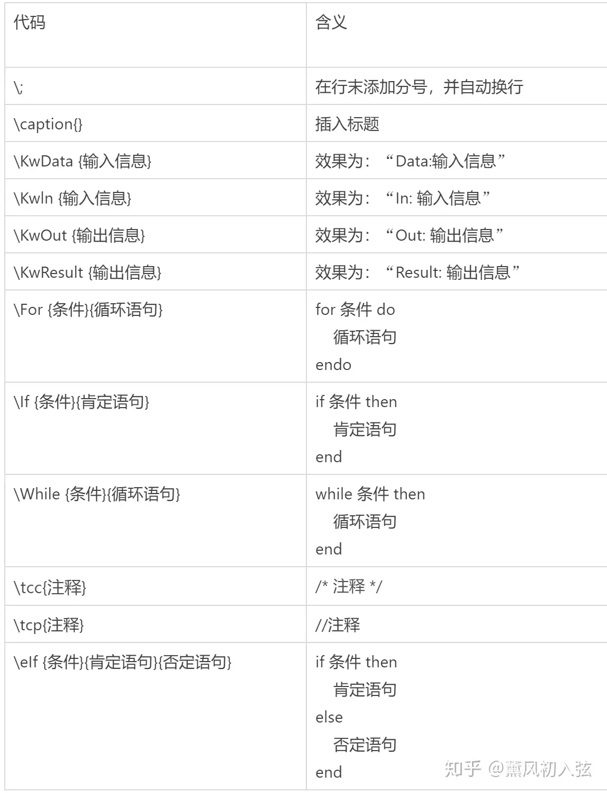

[TOC]

<!--more-->

## Aurora安装与algorithm2e导入

### 先安装TeX环境

**CTEX不需要更新包，miktex还得更新包，懒得折腾就直接装文件夹里的ctex**

#### 安装miktex

https://miktex.org/download

可修改安装位置

打开MiKTeX Console 在管理员模式下，可以下载包。

点击设置，在自动（即时）安装缺失的宏包这里，点击“总是”，这一步非常重要！！！！！

点击更新，依次点击检查更新，立即更新。至此，miktex就配置完成了！

### 安装Aurora

Micro MiKTeX不要勾选

### Aurora properties配置

https://blog.csdn.net/TycoonL/article/details/115586651

打开word——>插入——>对象——>Aurora Equation，就在word里插入了Aurora

配置Properties。Paths不要勾选Use default values！然后将之前安装的MiKTeX里的latex.exe、dvipng.exe、pdflatex.exe添加到路径。

#### 中文不显示

https://blog.csdn.net/jucksu/article/details/116307244

```
\documentclass{article}
 
\usepackage{amsmath}
\usepackage{amssymb}
\usepackage{ctex}
\usepackage{CJK}
\usepackage{xcolor}
\usepackage{chemarrow}
\usepackage{fancybox}
\usepackage{euler}
 
\usepackage{multirow}
\usepackage{algorithm}
\usepackage{algpseudocode}
\usepackage{amsmath}
\usepackage{geometry}
\usepackage{algorithmicx}
 
\renewcommand{\algorithmicrequire}{\textbf{Input:}} 
\renewcommand{\algorithmicensure}{\textbf{Output:}} 
```

#### 配置algorithm2e

https://zhuanlan.zhihu.com/p/367884765

1. ruled：让标题显示在上面，默认会显示到最下面；
2. vlined：默认启用垂直连接线；
3. linesnumbered：让算法显示行号，不包括 input 和 output 部分；
4. noend：程序块结束不打印 end。
5. 还可以添加 `boxed`， 让算法排版时插入在一个盒子里。

```
\makeatletter
\newif\if@restonecol
\makeatother
\let\algorithm\relax
\let\endalgorithm\relax
\usepackage[linesnumbered,ruled]{algorithm2e}%[ruled,vlined]{
\usepackage{algpseudocode}
\usepackage{amsmath}
\renewcommand{\algorithmicrequire}{\textbf{Input:}}  % Use Input in the format of Algorithm
\renewcommand{\algorithmicensure}{\textbf{Output:}} % Use Output in the format of Algorithm 
```

#### 合并自用版

```
\documentclass{article}
 
\usepackage{amsmath}
\usepackage{amssymb}
\usepackage{ctex}
\usepackage{CJK}
\usepackage{xcolor}
\usepackage{chemarrow}
\usepackage{fancybox}
\usepackage{euler}
 
\usepackage{multirow}
\usepackage[linesnumbered,ruled]{algorithm2e}
\usepackage{algpseudocode}
\usepackage{amsmath}
\usepackage{geometry}
\usepackage{algorithmicx}
 
\renewcommand{\algorithmicrequire}{\textbf{Input:}} 
\renewcommand{\algorithmicensure}{\textbf{Output:}} 
```

#### 模版

```latex
\begin{CJK}{GBK}{song}

\begin{algorithm}[H]
\renewcommand{\algorithmcfname}{算法名}
\renewcommand{\thealgocf}{4-1}	//设置行号
\KwIn{current period $t$, initial inventory $I_{t-1}$, initial capital $B_{t-1}$, demand samples}
\KwOut{Optimal order quantity $Q^{\ast}_{t}$}
initialization\;
\While{not at end of this document}{
    read current \text{中文}\;
    \eIf{understand}{
        go to next section\;
        current section becomes this one\;
    }{
        go back to the beginning of current section\;
    } 
}
$r\leftarrow t$\;
$\Delta B^{\ast}\leftarrow -\infty$\;
\While{$\Delta B\leq \Delta B^{\ast}$ and $r\leq T$}{$Q\leftarrow\arg\max_{Q\geq 0}\Delta B^{Q}_{t,r}(I_{t-1},B_{t-1})$\;
$\Delta B\leftarrow \Delta B^{Q}_{t,r}(I_{t-1},B_{t-1})/(r-t+1)$\;
\If{$\Delta B\geq \Delta B^{\ast}$}{$Q^{\ast}\leftarrow Q$\;
$\Delta B^{\ast}\leftarrow \Delta B$\;}
$r\leftarrow r+1$\;}
\caption{Simulation-optimization heuristic}\label{algorithm}
\end{algorithm}
\end{CJK}
```


## algorithm2e教程

https://flywh.github.io/2021/pseudocode-specification/

当算法过长，超过一页时，由于algorithm2e 没有提供相应的拆分机制，需要自己进行处理，文档描述如下

自行拆分的方法是，在需要拆开的部分提前加入算法结束符，然后新建算法，示例如下，例子中省略了非必要的代码，但已足够说明如何使用，即只需要新开一个算法块，然后设定行号即可。


https://blog.csdn.net/Xminyang/article/details/127178113（）


https://www.zhihu.com/tardis/zm/art/166418214



如果你不想让你的伪代码叫做 'Algorithm 编号'， 可以使用 `\renewcommand{\algorithmcfname}{算法名}` 命令来修改。

Algorithm2e本身不支持Do-While结构（支持的是While-Do），需要自行定义。不过自行定义并不难，因为宏包中内置了

```
\SetKwRepeat{Do}{do}{while}

\Do{}{}
```

