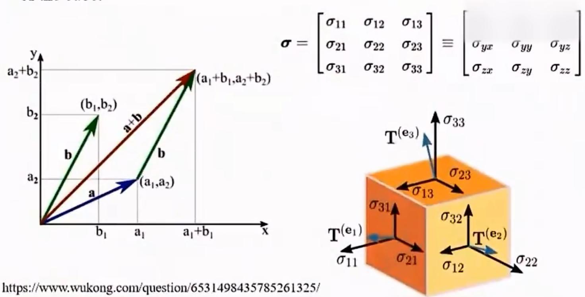

> https://www.bilibili.com/video/BV1mM411r7ko?p=1&vd_source=260d5bbbf395fd4a9b3e978c7abde437

## 函数

### 函数定义

> 一组输入输出的关系：一组输入唯一对应一组输出

### 函数分类

输入是否与时间有关：

- 是：动态函数
- 否：静态函数

输入是否为标量：

- 是：一元函数
- 否：多元函数

### 常见函数

### 函数复合

向量到张量

 	 