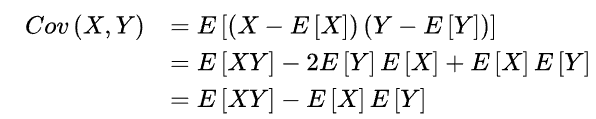
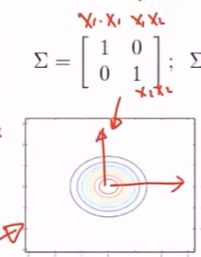
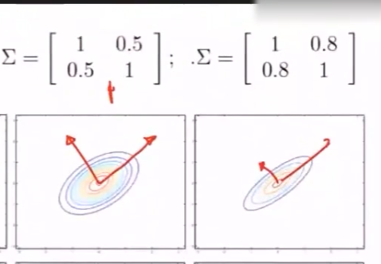
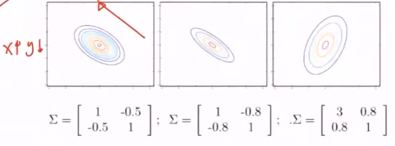
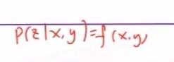
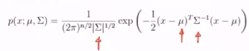
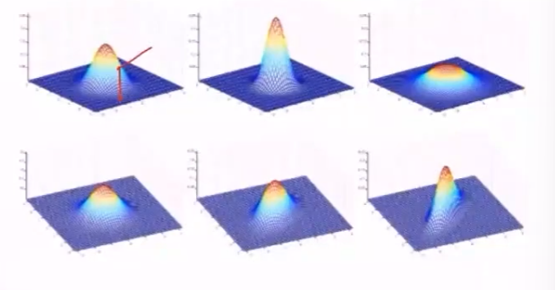
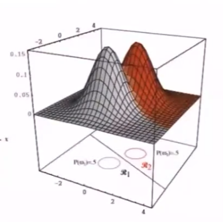
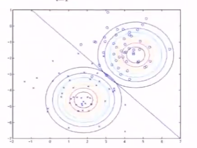

生成模型：对于给定数据，假设是由某种概率分布生成的，目标是求出这些数据的极大似然分布，需要对这些参数值进行极大似然估计，进而可以通过模型解释这些数据的生成过程。故可以对数据进行预测和分析

高维高斯分布

独立事件组合的结果，趋近于正态分布

参数：均值，协方差矩阵

如果协方差大于零，说明两个随机变量是正相关

如果协方差小于零，说明两个随机变量是负相关

斜对角线上数字表示两个随机变量的关联程度，数值越大表示联系越紧密

斜对角线上数字正负，表示正负相关

- Y随X的增大而增大，则正相关，椭圆向上斜

- Y随X的增大而减小，则负相关，椭圆向下斜

二维高斯表示

高维高斯混合模型

若两个高维高斯模型的协方差矩阵相同，则在二维平面上投影为两个相等的圆，分界线上的点在两个高斯模型中都是相等的

