## 聚类K-Means

### 步骤

#### 1. 指定聚类

指定k，表示聚类数量

随机指定K个中心点

对每个数据计算到中心点的距离，归为距离近的类

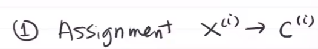

#### 2. 更新中心点

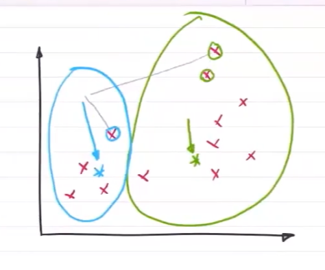

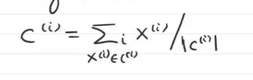

#### 3. 根据新中心点，形成新的聚类，直至稳定

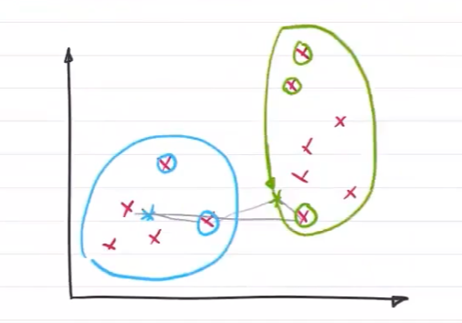

使得 

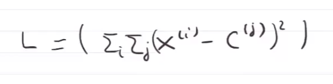 最小

### 问题

欧氏距离，对于一些数据不能很好分类

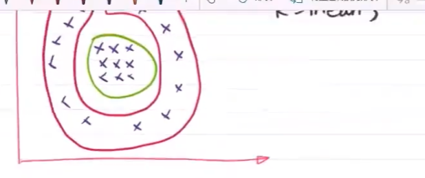

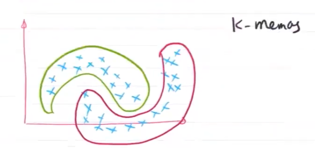

## 降维

### 降维原因

- 维度诅咒，维度越高，同样密度的数据集，需要的数据量越多，对数据查找的精度与效率会降低
- 有效维度实际上可以减小
- 将高维的数据映射低维空间
- 数据压缩，便于存储
- 移除噪音

### 降维理解

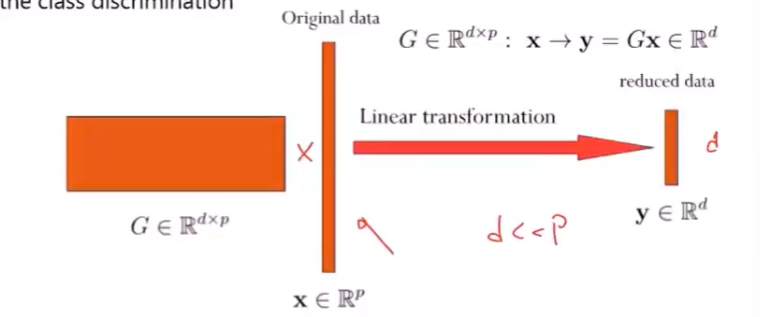

选择合适的子空间，将数据映射到子空间上，将有噪声、不重要的维度减小，减少方式为将该维度的权重系数减小，/在调整数据时，将数据向着重要特征的维度方向旋转 

### 冗余维度选择

若两个维度之间有很强的线性相关性，即一个维度的信息可以通过另一维度的信息线性表示，则冗余度较高

### 主成分分析PCA Principal Component Analysis

映射到同一维度，数据重叠越少越好

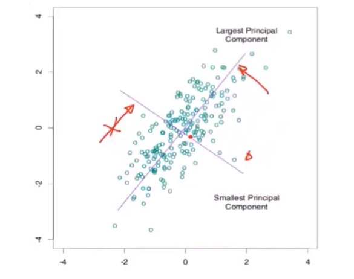

长轴压缩效果比较好

1. 找到数据均值，（归一化）计算每个点与均值的间距，计算协方差矩阵

   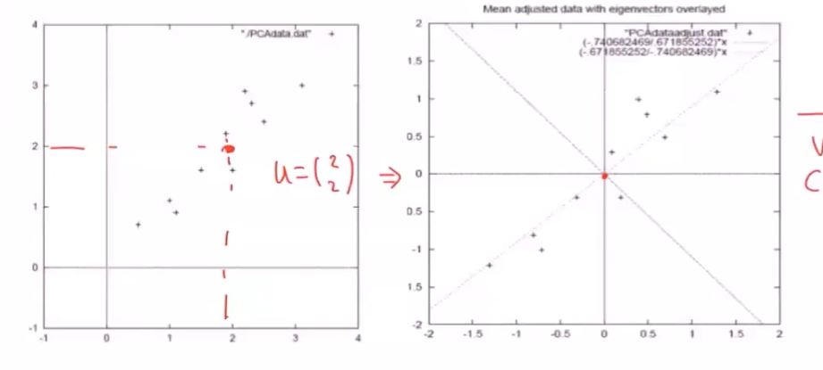

   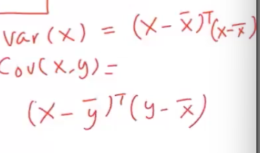

   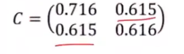

   方差：每个值与均值差距的平方的平均数

   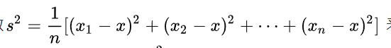

2. 计算协方差阵的特征向量与特征值

   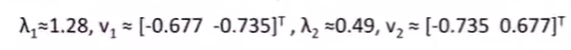

   - 特向正交

3. 根据选定的维度数d，确定转移矩阵V

   特征向量代表协方差矩阵的不同维度，特征值大的特征向量为长轴方向，舍弃特征值小的特征向量代表的维度

   d个特征向量组成转移矩阵V 特向的转置拼成 $V_{d\times n}$

   对每个数据进行映射 $V_{d\times n}X_{n\times 1}=Y_{d\times 1}$

## SVD

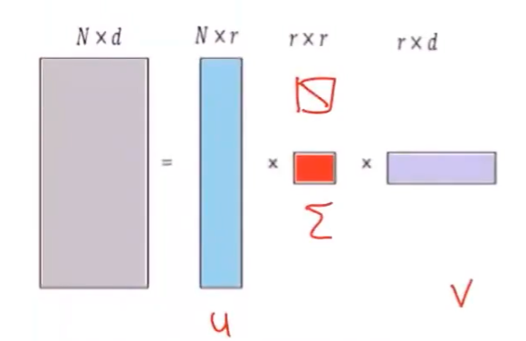

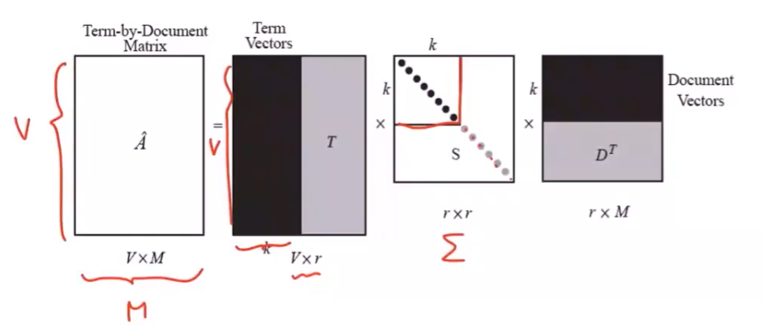