> 线性代数，概率论，数理统计，最优化方法，信息论，形式逻辑
>
> 唐宇迪 数学基础

<!--more-->

# 2. 数学基础

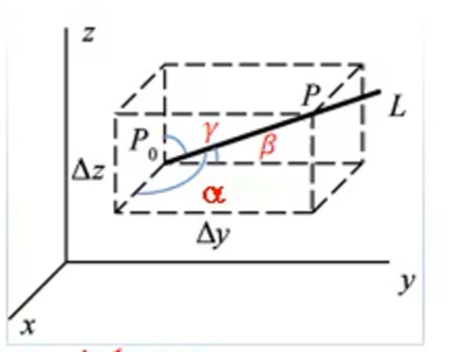

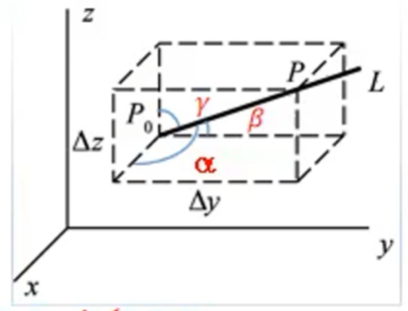

微分

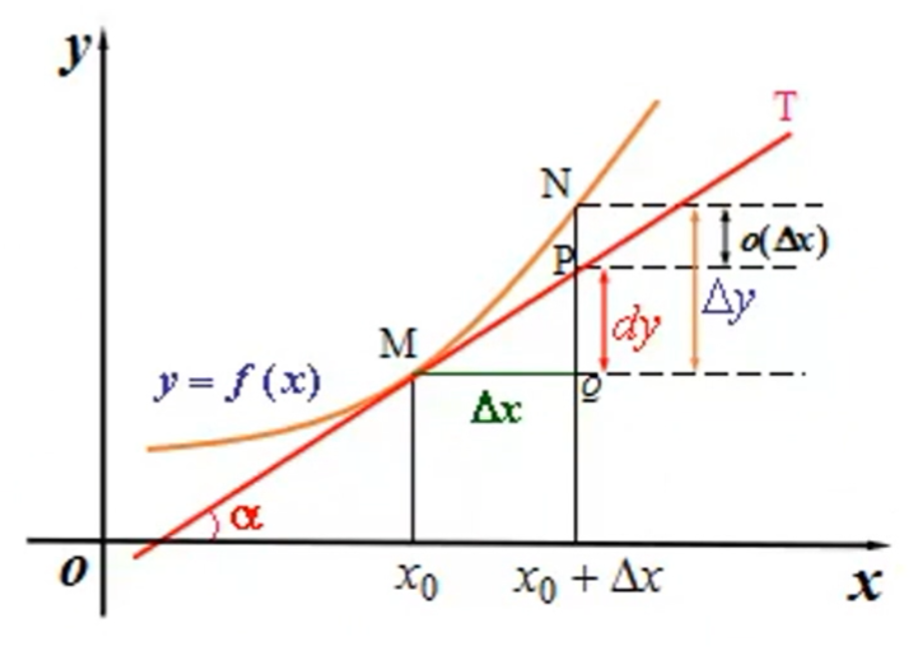

偏导

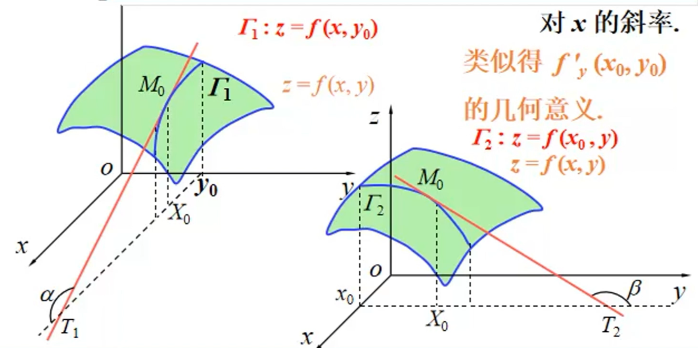

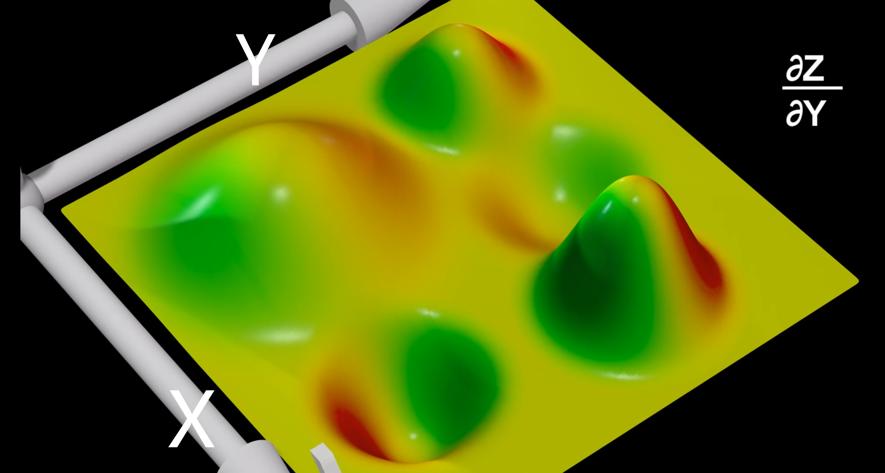

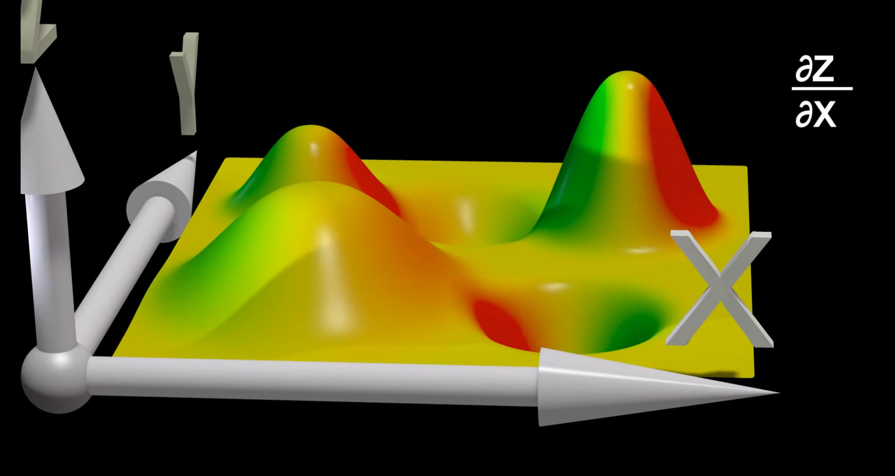

方向导数

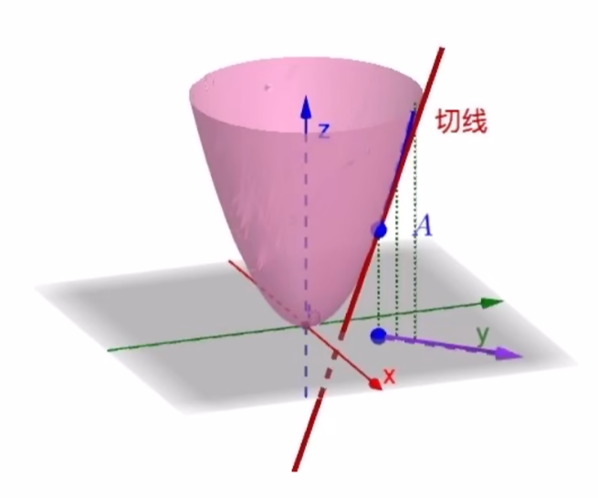

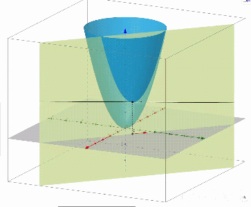

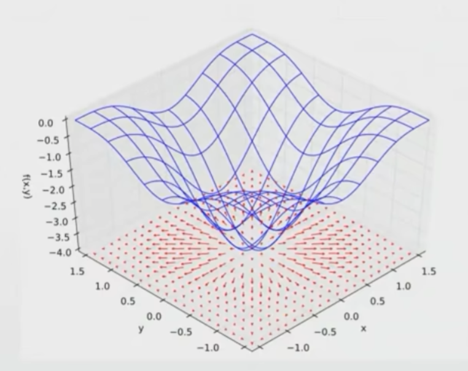

梯度

梯度与等值线垂直

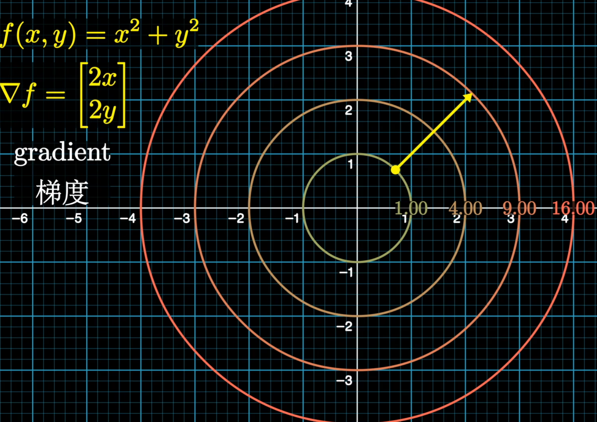

梯度下降法

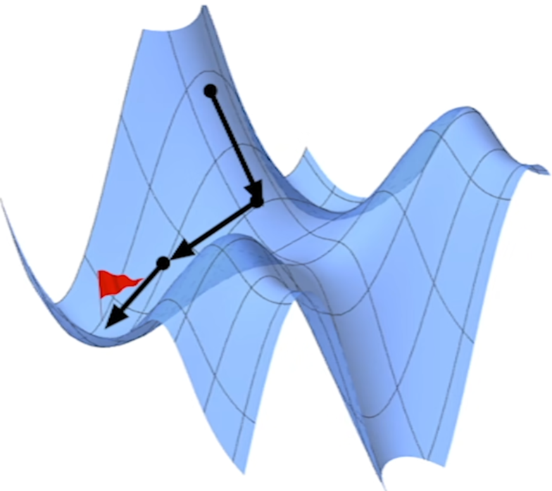

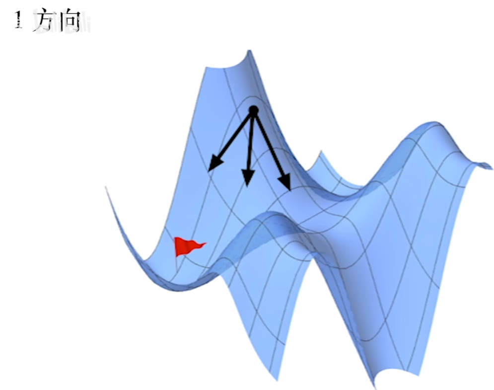

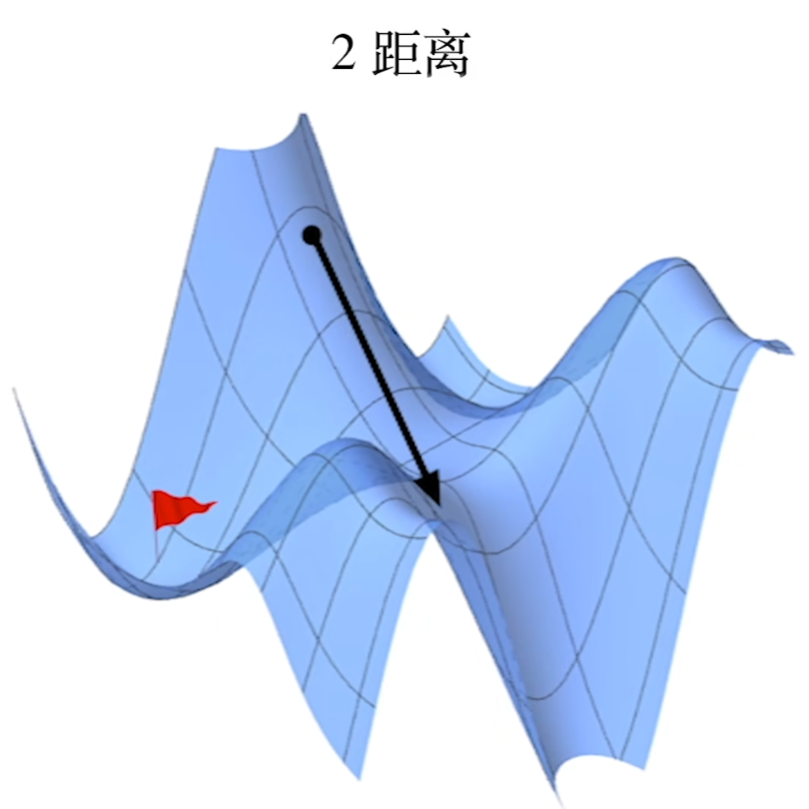

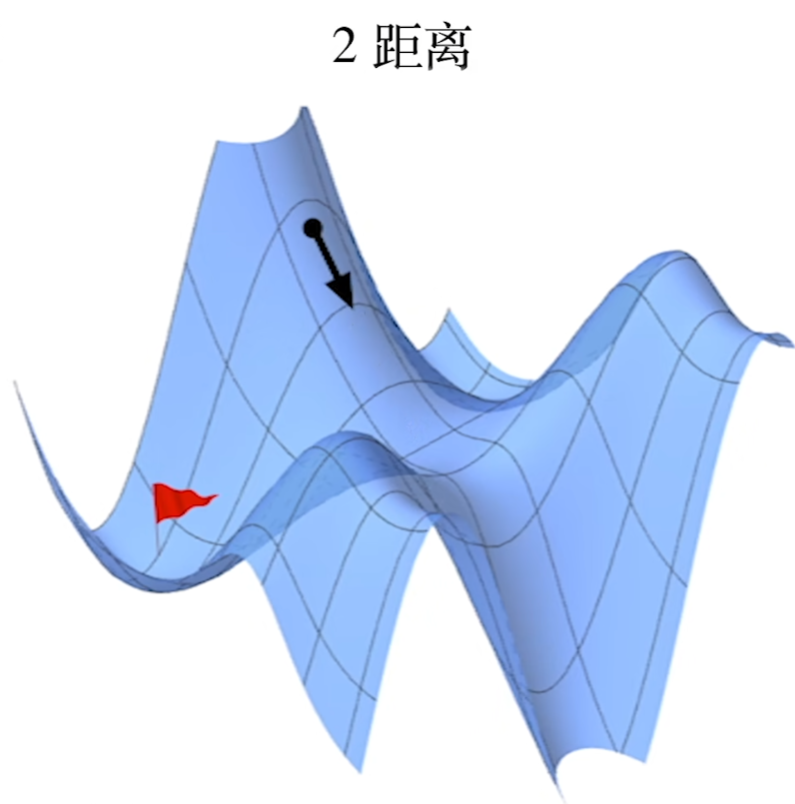

终止条件

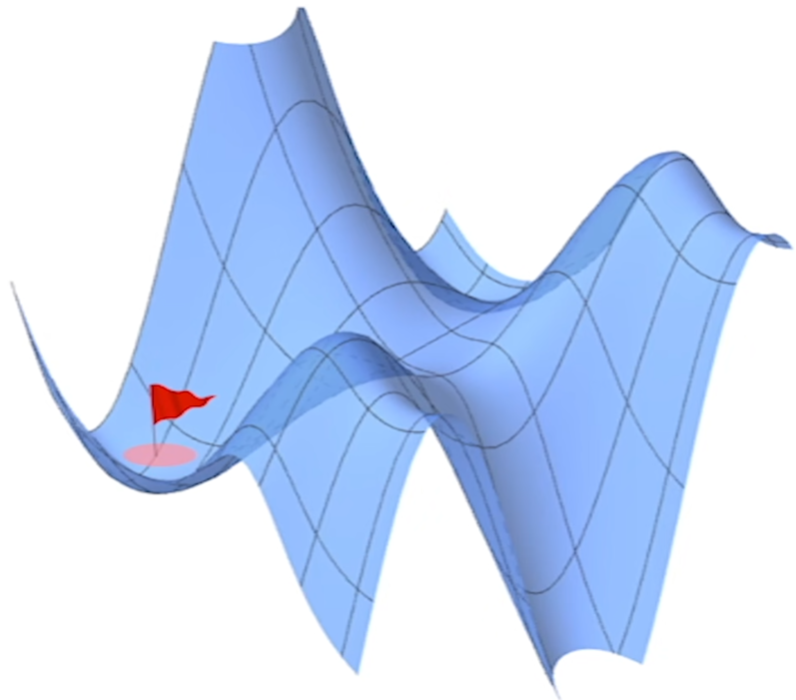

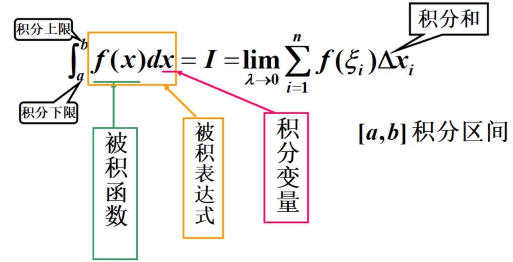

条件极值

https://zhuanlan.zhihu.com/p/437983115

## 2.1 liner algebra

> 线性代数的意义在于提供了一种看待世界的抽象角度
>
> 万物都可被抽象为某些特征的组合，并在预置规则定义的框架之下以静态或动态的方式加以观察

### 2.1.1 集合

> 线性代数中最基本的概念是 **set**

集合的定义是由某些具有某些共性的对象汇总成的集体。

将这些对象用数字或符号表示(对象映射到数域)，这样集合中的元素就变为了多个数字或符号以某种方式排列成的组合

### 2.1.2 对象的表示

在线代中，由单独的数a构成的元素被称为 `标量` (scalar)：一个标量可以是整数、实数或复数

- $a,b,c$

多个标量 $a_1,a_2,\cdots,a_n$ 按一定顺序组成一个序列，这样的元素称为 `向量`  (vector)

- 向量代表了维度的增加，向量中每个元素需要使用一个索引确定
- $\alpha=(a_1,a_2,\cdots,a_n)$

`矩阵` (matrix) 由维度相同的向量组成

- 矩阵代表了维度的增加，矩阵中每个元素需要使用两个索引确定
- $A=\left(\begin{matrix}a_{11}&a_{12}&a_{13}\\a_{21}&a_{22}&a_{23}\\a_{31}&a_{32}&a_{33}\end{matrix}\right)$

`张量` (tensor) 矩阵中的每个元素都是向量，则形成张量

- $A=\left(\begin{matrix}1&1&2&2\\0&1&0&2\\3&3&2&2\\0&3&0&2\end{matrix}\right)=\left(\begin{matrix}1&2\\3&2\end{matrix}\right)\otimes\left(\begin{matrix}1&1\\0&1\end{matrix}\right)$

---

计算机处理离散取值的二进制信息，因此模拟世界的信号必须在定义域和值域上同时进行数字化，才能被计算机存储和处理。

线性代数是用模拟数字世界表示真实物理世界的工具

在计算机存储中：

- `标量` 占据零维度数组
- `向量` 占据一维数组：如语音信号
- `矩阵` 占据二维数组：如灰度图像
- `张量` 占据三维乃至更高维度数组：如RGB图像和视频

### 2.1.3 向量的描述

#### 范数(norm)

> 对单个向量大小的度量，描述向量自身的性质

**将向量映射为一个非负的数值**
$$
L^p范数：\vert X\vert_p=\left(\sum_i\limits\vert x_i\vert^p\right)^{\frac{1}{p}}
$$

##### 常用范数

1-范数：所有元素绝对值的和

2-范数：模长

$\infty$-范数：最大元素的绝对值

#### 内积(inner product)

> 向量之间的关系

$$
(X,Y)=\sum x_i\cdot y_i
$$

内积描述的是 `夹角` 能表示两个向量之间的相对位置

- $正交，X,Y相互垂直\iff (X,Y)=0$ 

  表明两向量相互独立，互不影响

#### 应用

在实际问题中，向量是某些对象或某些行为的特征。范数和内积能处理这些表示特征的数学模型，进而提取出原始对象或原始行为中的隐含关系。

### 2.1.4 向量空间

如果有一个集合，它的元素都是具有相同维数的向量

- 定义了加法和数乘等结构化运算，将这个空间称为 `线性空间` 

- 定义了内积运算的线性空间，将这个空间称为 `内积空间`

**在线性空间中，任一一个向量代表的是n维空间中的一个点；线性空间中的任一点也都可以唯一地用一个向量表示**

#### 线性空间参考系

`正交基` ：一组两两正交的向量构成了这个空间的正交基

`标准正交基` ：正交基中基向量的 $L^2$ 范数的单位长度为1，则这组正交基就是标准正交基

- 正交基的作用就是给内积空间定义基准，用于空间中的所有向量（点）

#### 线性空间上的变化

> 当作为参考系的标准正交基确定后，空间中的点就可以用向量表示，当这个点移动到另一个位置，描述这个点的向量也会发生改变。

`线性变换(linear transformation)` ：如上所述，点的变化对应着向量的线性变换，描述对象变化或向量变换的数学语言是矩阵

##### 变化的实现

点本身变化

- 代表变化的矩阵乘以代表对象的向量

作为参考系的坐标系的变化

- 向量不变，将代表变化的矩阵乘以正交基
- 此时，矩阵的作用相当于对正交基进行变换。

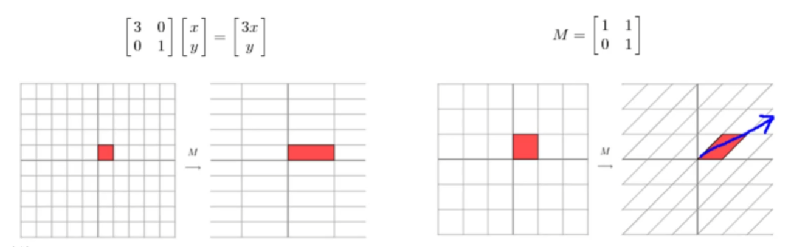

---

如
$$
\begin{aligned}
AX=Y
\end{aligned}
$$

- 向量X经过A描述的变换，变成了同一坐标系下的向量Y
- 一个点在坐标系A下为向量X，在标准坐标系 $\Lambda=\left(\begin{matrix}1&&\\&\ddots&\\&&1\end{matrix}\right)$ 下表示为向量Y

### 2.1.5 矩阵

> 矩阵代表了向量的变化，其效果通常是对原始向量同时施加方向变化和尺度变化

#### 特征值与特征向量的理解

对于一些向量，在变换（矩阵）下，只有伸缩(尺度变化)而没有旋转(方向变化)

这些特殊的向量称为 `特征向量` ，伸缩尺度称为 `特征值`
$$
AX=\lambda X
$$
矩阵特征值和特征向量的意义在于表示了变化的速度和方向

- 特征值表示了变化速度
- 特征向量表示了变化方向

不同特征值和特征向量的叠加是矩阵的效果

#### 特征值分解

> 求解特征值和特征向量的过程称为特征值分解，但矩阵必须是n维方阵

将特征值分解推广到所有矩阵之上，就是更通用的奇异值分解

## 2.2 probablity theory

> 对随机事件发生的可能性进行规范的数学描述是概率论的公理化过程

### 2.2.1 概率与频率

> 频率学派：随着重复试验次数的增加，特定事件出现的频率值就会呈现出稳定性，逐渐趋近于某个常数

`概率` ：一个可独立重复的随机试验中**单个**结果出现频率的极限

#### 依据：古典概率模型

> 试验结果只包含有限个基本事件，且每个基本事件发生的可能性相同。

所有基本事件数目为n，待观察的随机事件A中包含的基本时间数目为k，则古典概率模型下事件概率的计算式为：
$$
P(A)=\frac{k}{n}
$$
**只针对单个随机事件**

### 2.2.2 条件概率

> 用于刻画两个随机事件之间的关系（类比内积，通过运算将关系映射为数值），根据已有信息对样本空间进行调整后得到的新的概率分布

$$
P(A\mid B)=\frac{P(AB)}{P(B)},表示事件A在事件B已经发生的条件下发生的概率
$$

A和B两个事件共同发生的频率称为 `联合概率` ，记为 $P(AB)$

- 如果两个事件发生互不影响相互独立，则其联合概率 $P(AB)=P(A)P(B)$
- 对于相互独立的事件，条件概率就是自身概率 $P(A\mid B)=P(A)$

## 2.3 回归分析

#### 2.3.1 回归分析研究内容

相关性分析：分析变量之间是否具有相关性

回归分析：寻找存在相关关系的变量间的数学表达式

### 2.3.2 回归分析分类

- 根据自变量数目，可以分类一元回归(一个特征决定结果)，多元回归（多个特征决定结果）
- 根据自变量与因变量之间的表现形式，分为线性与非线性

具体分为四个方向：`一元线性回归` 、`多元线性回归` 、`一元非线性回归` 、`多元线性回归`

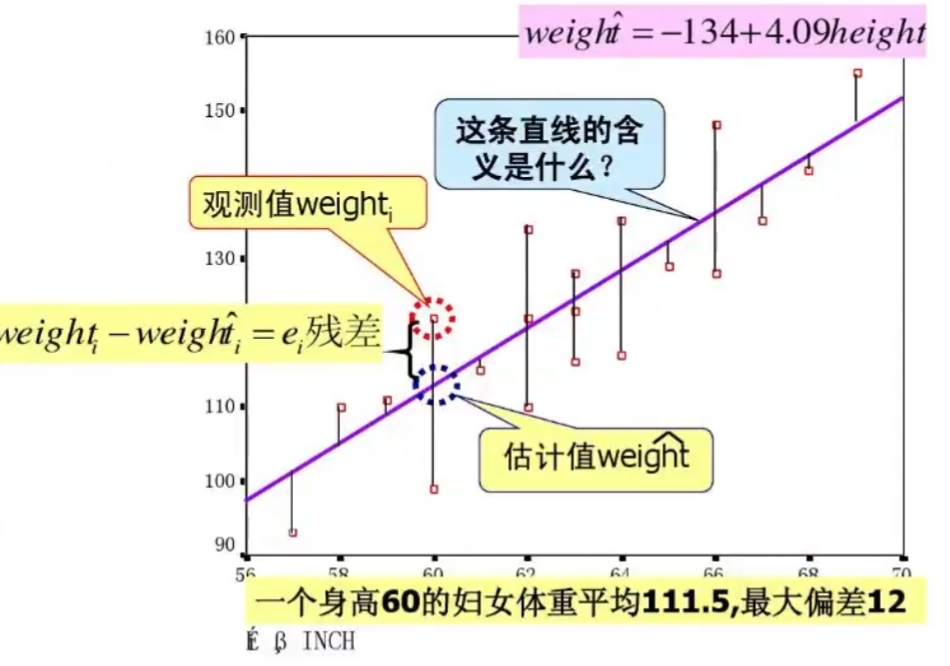

### 2.3.3 回归分析步骤

1. 确定回归方程中的自变量和因变量
2. 确定回归模型（建立方程）
3. 对回归方程进行检验
4. 利用回归方程进行预测

### 2.3.4 回归方程

因变量：被预测或被预测的变量 $Y_i$ **第i个样本的标签数据**

自变量：预测或解释因变量的一个或多个变量 $X_i$ **第i个样本的特征数据**

描述因变量 $Y$ 如何依赖自变量 $X$ 和误差项 $\epsilon$ 的关系 

一元线性回归模型：$Y_i=\beta_0+\beta_1 x_{i1}+\epsilon$ 

- $\epsilon$ 反映除 $X$ 和 $Y$ 之间的线性关系之外的随机因素对 $X$ 和 $Y$ 的影响

- 适用于：

  人均收入是否影响人均食品消费支出

  贷款余额是否影响不良贷款

  航班正点率对顾客投诉率影响

多元线性回归模型：$y=h_{\beta}(X)=\beta_0+\beta_1x_{1}+\beta_2x_{2}+\cdots+\beta_px_{p}=\sum_{i=0}\limits^{p}\beta_p x_{i}=\beta^TX$  

- 用样本统计量代替回归方程中的未知参数，可以确定回归方程的形式 

### 2.3.5 误差分析

对于每个样本 $y_i=\beta^TX_i+\epsilon_i$ 

误差 $\epsilon$ 独立同分布，且服从均值为 $0$，方差为 $\beta^2$ 的高斯分布

- 独立：样本点之间不会相互影响
- 同分布：不同样本点的 标签数据和特征数据的关系服从同一模型

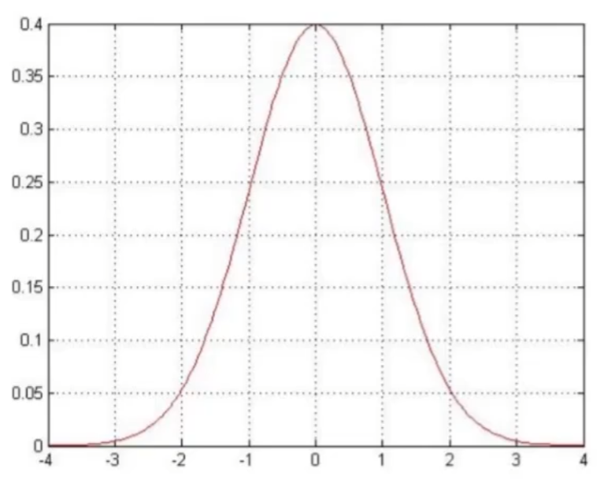

故有 $p(\epsilon_i)=\frac{1}{\sqrt{2\pi}}exp[{-\frac{(\epsilon_i)^2}{2\sigma^2}}]$ ，即 $P(y_i\vert X_i;\beta)=\frac{1}{\sqrt{2\pi}\sigma}exp\left(-\frac{(y_i-\beta^TX_i)^2}{2\sigma^2}\right)$ ，若真实值与预测值误差越小，预测效果越好，又由于误差服从 $\mu=0$ 的高斯分布，故 $P(y_i\vert X_i;\beta)$ 的概率越大越好

由极大似然估计：

$L(\beta)=\prod_{i=1}\limits^nP(y_i\vert X_i;\beta)=\prod_{i=1}\limits^n\frac{1}{\sqrt{2\pi}\sigma}exp\left(-\frac{(y_i-\beta^TX_i)^2}{2\sigma^2}\right)=\left(\frac{1}{\sqrt{2\pi}\sigma}\right)^nexp\left(-\frac{1}{2\sigma^2}\sum_{i=1}\limits^n(y_i-\beta^TX_i)^2\right)$ 

$\Rightarrow lnL(\beta\vert X)=ln\left(\frac{1}{\sqrt{2\pi}\sigma}\right)^nexp\left(-\frac{1}{2\sigma^2}\sum_{i=1}\limits^n(y_i-\beta^TX_i)^2\right)=-nln(\sqrt{2\pi}\sigma)-\frac{1}{2\sigma^2}\sum_{i=1}\limits^n(y_i-\beta^TX_i)^2$  

接上述分析 $P(y_i\vert X_i;\beta)$ 越大越好 $\Rightarrow lnL(\beta)$ 越大越好 $\Rightarrow$ $J(\beta)=\frac{1}{2}\sum(y_i-\beta^TX_i)^2$ 越小越好（最小二乘法）

### 2.3.6 最小二乘法求参

对于回归直线，常用最小二乘法求解参数
$$
Q=\sum(y-\hat{y})^2=\sum(y-\hat{\beta_0}-\hat{\beta_1}x)^2
$$

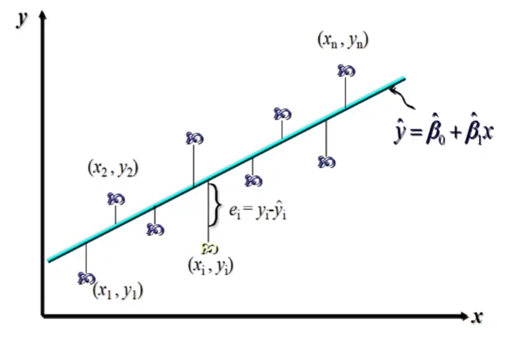

对于一元线性回归，展开得

$Q=\sum y^2+n\hat{\beta_0}^2+\hat{\beta_1}^2\sum x^2+2\hat{\beta_0}\hat{\beta_1}\sum x-2\hat{\beta_0}\sum y-2\hat{\beta_1}\sum xy$ 

令
$$
\left\{
\begin{aligned}
\frac{\partial Q}{\partial \beta_0}=0\\
\frac{\partial Q}{\partial \beta_1}=0\\
\end{aligned}
\right.\Rightarrow \left\{
\begin{aligned}
&\sum y=n\hat{\beta_0}+\hat{\beta_1}\sum x\\
&\sum xy=2\hat{\beta_0}\sum x+\hat{\beta_1}\sum x^2
\end{aligned}
\right.
$$
求解得：
$$
\begin{aligned}
&\hat{\beta_1}=\frac{n\sum xy-\sum x\sum y}{n\sum x^2-(\sum x)^2}\\
&\hat{\beta_0}=\overline{y}-\hat{\beta_1}\overline{x}，其中\overline{x}=\frac{\sum x}{n},\overline{y}=\frac{\sum y}{n}
\end{aligned}
$$

### 2.3.7 回归方程的衡量标准(模型选择指标)

#### 回归方程的拟合优度

回归直线与各观测点的近似程度称为回归直线对数据的拟合优度

总平方和 `SST` ：反映因变量的 $n$ 个观察值与均值的总偏差
$$
\sum(y-\overline{y})^2
$$
回归平方和 `SSR` ：由于 $x$ 与 $y$ 的线性关系引起的 $y$ 的变化部分（回归直线可解释部分造成的误差）
$$
\sum(\hat{y}-\overline{y})^2
$$
残差平方和 `SSE` ：由于 $x$ 与 $y$ 的线性关系外的关系引起的 $y$ 的变化部分（回归直线不可解释部分造成的误差）
$$
\sum(y-\hat{y})^2
$$
总平方和可以分解为回归平方和、残差平方和 $SST=SSR+SSE$
$$
\sum_{i=1}\limits^n(y_i-\overline y)^2=\sum_{i=1}^n(\hat{y}-\overline{y})^2+\sum_{i=1}^n(y-\hat{y})^2
$$

#### 判定系数

$$
R^2=\frac{SSR}{SST}=\frac{回归平方}{总平方和}=\frac{\sum(\hat{y}-\overline{y})^2}{\sum(y-\overline{y})^2}=1-\frac{\sum(y-\hat{y})^2}{\sum(y-\overline{y})^2}
$$

理想情况 $R^2=1$ ，残差平方和为 $0$（即整体误差完全由线性误差引起）回归方程完全可解释 $x$ 与 $y$ 的关系

- $R^2$ 越大，回归方程可解释能力越强
- $R^2$ 越小，回归方程可解释能力越弱

### 2.3.8 显著性检验

由于回归方程是根据样本数据得到的，是否真实反映了变量 $X$ 和 $Y$ 之间的关系，需要通过检验后才可以确定

显著性检验包括两方面：

- 线性关系检验
- 回归系数检验

#### 线性关系检验

> 检验 $x$ 和 $y$ 的线性关系是否显著，是否可用线性模型表示

将均方回归( `MSR` )和均方残差( `MSE` )进行比较，应用 $F$ 检验来分析二者之间的差别是否显著

- 均方回归：回归平方和 `SSR` 除以相应的自由度（自变量的个数 K）
- 均方残差：残差平方和 `SSE` 除以自由度（$n-K-1$）

$\frac{线性误差}{非线性误差}$ 

若 $\beta=0$ ，即所有回归系数与0无显著差异，则 $y$ 与全体 $x$ 的线性关系不显著

计算检验统计量 $F=\frac{SSR/K}{SSE/n-K-1}=\frac{\sum(\hat{y}-\overline{y})^2/K}{\sum(y-\hat{y})^2/n-K-1}=\frac{MSR}{MSE}\sim F(K,n-K-1)$ 

#### 回归系数检验

检验每个回归系数 $\beta$ 与 $0$ 是否有显著性差异，来判断 $Y$ 与 $X$ 之间是否有显著的线性关系

- 若 $\beta \approx0$ 则总体回归方程中不含 $X$ 项，因此，变量 $Y$ 与 $X$ 之间不存在线性关系

- 若 $\beta \neq 0$ ，则变量 $Y$ 与 $X$ 有显著的线性关系

如：

$\hat{\beta_1}$ 是根据最小二乘法求出的样本统计量，服从正态分布，有 $E(\hat{\beta_1})=\beta_1$ ，标准差 $\sigma_{\beta_1}=\frac{\sigma}{\sqrt{\sum x_i^2-\frac{1}{n}(\sum x_i)^2}}$  

由于 $\sigma$ 未知，需要用其估计量 标准差$S_e$ 来代替得到 $\hat{\beta_1}$ 的估计标准差，$S_\hat{\beta_1}=\frac{S_e}{\sqrt{\sum x_i^2-\frac{1}{n}(\sum x_i)^2}}$ ，$S_e=\sqrt\frac{\sum(y_i-\hat{y_i})^2}{n-K-1}=\sqrt{MSE}$ 

计算检验的统计量：$t=\frac{\hat{\beta_1}-\beta_1}{S_{\hat{\beta_1}}}\sim t(n-2)$  

#### 线性关系检验与回归系数检验区别：

线性关系检验的是自变量与因变量是否可以用线性关系表示；回归系数的检验是判断通过样本计算得出的回归系数是否为0

- 在一元线性回归中，自变量只有一个，线性关系检验与回归系数检验是等价的

  线性关系检验 $F=\frac{SSR/1}{SSE/n-1-1}=\frac{MSR}{MSE}\sim F(1,n-2)=t(n-2)$  

  回归系数检验 $t=\frac{\hat{\beta_1}-\beta_1}{S_{\hat{\beta_1}}}\sim t(n-2)$  

- 多元回归分析中，线性关系检验只能用来检验总体回归关系的显著性。回归系数检验可以对各个回归系数分别进行检验

### 2.3.9 利用回归直线进行估计和预测

点估计：利用估计的回归方程，对 $X$ 的一个特定值，求解 $\hat{Y_i}$ 的一个估计值

区间估计：利用估计的回归方程，对于 $X$ 的一个特定量，求出 $Y$ 的一个估计量的区间

#### 预测结果的置信度

##### 标准差

度量观测值围绕着回归直线的变化程度(点估计)
$$
S_e=\sqrt\frac{\sum(Y-\hat{Y})^2}{n-2}
$$

- 自由度为 $n-2$ 
- 标准差越大，则分散程度越大，回归方程的可靠性越小

#### 置信区间估计

> 预测结果具有可靠性的范围

$\hat{y_0}\pm t_{\frac{\alpha}{2}}s_e\sqrt{\frac{1}{n}+\frac{(X_{i+1}-\overline{X})^2}{\sum(X-\overline{X})^2}}$ ，在 $1-\alpha$ 置信水平下预测区间为 $\hat{y_0}\pm t_{\frac{\alpha}{2}}s_e\sqrt{1+\frac{1}{n}+\frac{(X_{i+1}-\overline{X})^2}{\sum(X-\overline{X})^2}}$ 

**eg** 

广告费与销售额的关系如图，若2003年广告费120万元，用一元线性回归求 2003年产品销售额的置信区间与预测区间（$\alpha=0.05$）

$$
\begin{aligned}
&\hat{\beta_1}=\frac{n\sum XY-\sum X\sum Y}{n\sum X^2-(\sum X)^2}=\frac{9\sum_{i=1}\limits^9x_iy_i-\sum_{i=1}\limits^9x_i\sum_{i=1}\limits^9y_i}{9\sum_{i=1}\limits^9x_i^2-(\sum_{i=1}\limits^9x_i)^2}=0.57\\
&\hat{\beta_0}=\overline{Y}-\hat{\beta_1}\overline{X}=-3.65\\
&故有一元线性回归方程 \hat{y}=\hat{\beta_0}+\hat{\beta_1}x=-3.65+0.57x\\
&\hat{y_{10}}=-3.65+0.57\times 120=64.75\\
&t_\frac{\alpha}{2}(n-2)=t_{0.025}(7)=2.365,S_e=\sqrt\frac{\sum_{i=1}\limits^9(y_i-\hat{y_i})^2}{n-2}=2.43\\
&\hat{y_0}\pm t_{\frac{\alpha}{2}}s_e\sqrt{\frac{1}{n}+\frac{(X_{10}-\overline{X})^2}{\sum_{i=1}\limits^{9}(X-\overline{X})^2}}=64.75\pm2.365\times 2.43\times 0.743=64.75\pm4.2699\\
&\hat{y_0}\pm t_{1+\frac{\alpha}{2}}s_e\sqrt{\frac{1}{n}+\frac{(X_{10}-\overline{X})^2}{\sum_{i=1}\limits^{9}(X-\overline{X})^2}}=64.75\pm2.365\times 2.43\times 1.2459=64.75\pm4.3516
\end{aligned}
$$
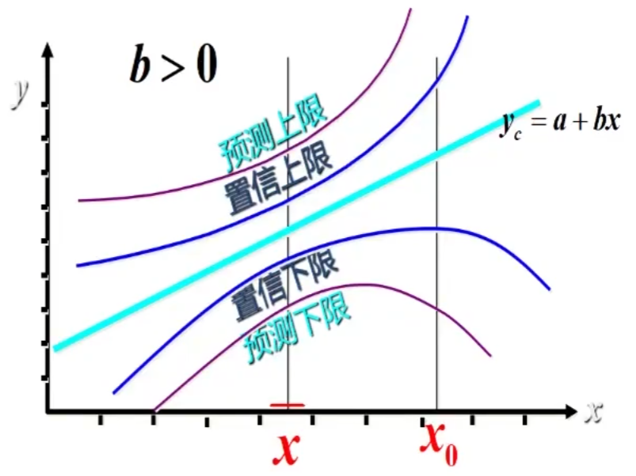

影响置信区间宽度的因素

- 区间宽度随置信水平 $1-\alpha$ 的增大而增大
- 区间宽度随离散程度 $S_e$ 的增大而增大
- 区间宽度随样本容量的增大而减小
- 预测值与均值的差异越大，区间宽度越大

### 2.3.10 多元线性回归

一个因变量与多个自变量具有依存关系时，用多元线性回归分析

多元线性回归：$y=\beta_0+\beta_1x_1+\beta_2x_2+\cdots+\beta_kx_k+\epsilon$ 

调整的多重判定系数：$R^2=1-(1-R^2)\times\frac{n-1}{n-K-1}$ ，$n$ 为样本容量

- 表示消除自变量数量增加的影响

曲线回归分析基本过程：

1. 根据散点图确定曲线类型
2. 先将 $x$ 或 $y$ 进行变量转换
3. 对新变量进行直线回归分析，建立直线回归方程并进行显著性检验和置信区间估计
4. 将新变量还原为原变量，由新变量的直线回归方程和置信区间得出原变量的曲线回归方程和置信区间

如：

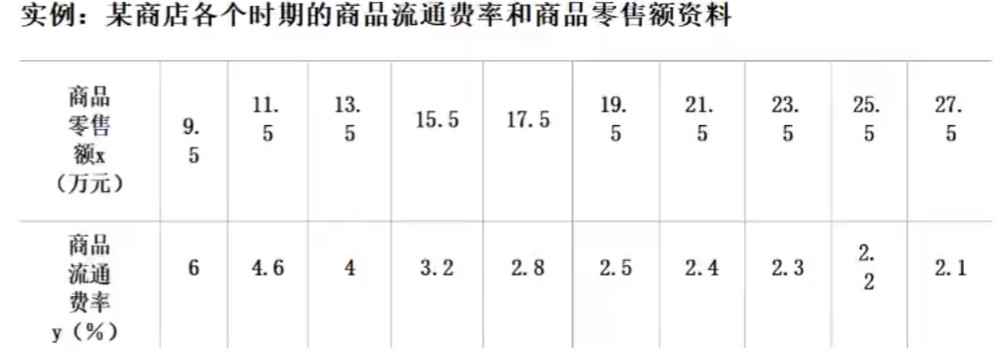

散点图：

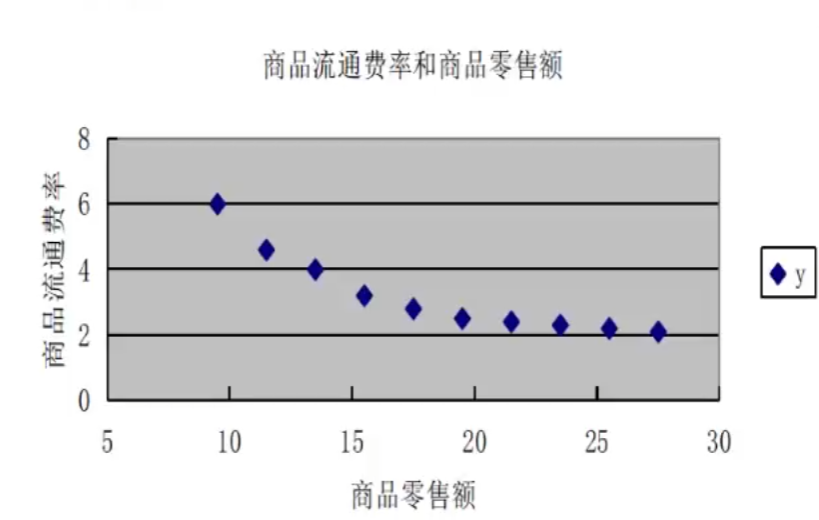

故可设 $\hat{y}=a+b\frac{1}{x}$ ，令 $\frac{1}{x}=x'\Rightarrow \hat{y}=a+bx'$

标准方程为 $\left\{\begin{aligned}&\sum y = na+b\sum x'\\&\sum x'y=a\sum x'+b\sum(x')^2\end{aligned}\right.$

将数据代入的 $\left\{\begin{aligned}&a=-0.4377\\&b=60.4\end{aligned}\right.$

有 $\hat{y}=-0.4377+60.4x'=-0.4377+60.4\frac{1}{x}$

#### 多重共线性

> 回归模型中两个或多个自变量彼此相关

引起的问题：

- 回归系数估计值不稳定性增强
- 回归系数假设检验的结果不显著

多重共线性检验方法：

- 容忍度
- 方差膨胀因子

**容忍度**
$$
Tol_i=1-R_i^2
$$

- $R_i$ 解释变量 $x_i$ 与方程中其他解释变量间的复相关系数
- 容忍度在 $0\sim 1$ 之间，越接近0，表示多重共线性越强 

**方差膨胀因子**
$$
VIF_i=\frac{1}{1-R_i^2}=\frac{1}{Tol_i}
$$

- $VIF_i$ 越大，解释变量 $x_i$ 与方程中其他解释变量之间有严重的共线性

 

## 一、假设检验步骤

假设检验是用统计数据判断命题真伪的方式。在统计学里，命题不能被证明是正确的，只能证明其否命题是错误的。

### 1.1 提出原假设与备择假设

在假设检验中，我们首先对总体参数做一个尝试性的假设，该假设被称为原假设，记作，然后，定义另一个与原假设内容完全相反的假设，称之为备择假设，记作,

假设检验的过程就是根据样本数据来对这两个对立的假设进行检验的过程。一般来说，我们将想要推翻的假设作为原假设，而将想要检验证实的问题作为备择假设。

### 1.2 构建检验统计量

对均值检验

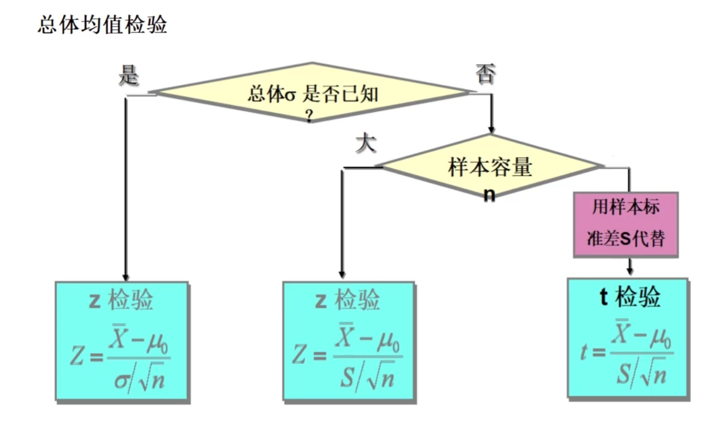

对方差检验

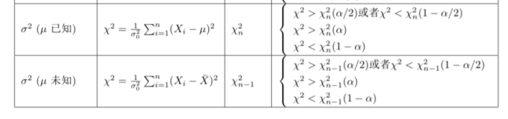

### 1.3 根据事先给定的显著性水平α确定拒绝域临界值

#### 显著性水平

基本思想是“小概率事件”原理，也就是小概率事件在一次试验中基本上不会发生。在一次实验中小概率事件一旦发生，就有理由拒绝原假设

假定原假设不发生为小概率事件的，其概率为 $\alpha$ （(0<α<1)） ，称为检验的显著性水平

- “小概率事件”的概率越小，否定原假设H0就越有说服力

- 它代表了：当原假设为真时，检验统计量落在拒绝域，从而拒绝原假设的概率，也叫做第一类错误（弃真）
  - 原假设为真，拒绝原假设的概率
  - 估计总体参数在某一区间，可能犯错的概率

#### 拒绝域

$\alpha$ 表示拒绝域，拒绝域的面积为小概率事件发生的概率；

临界值是拒绝原假设检验统计量的边界，

P(H0)=1- 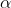就是接收域的面积。由此也可以看出，置信区间对应的是接收域

在检验统计量的抽样分布中，检验统计量的临界值即为下侧面积α（显著性水平）相对应的值。

当p-值越小，就越不可能正确。

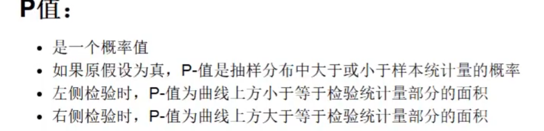

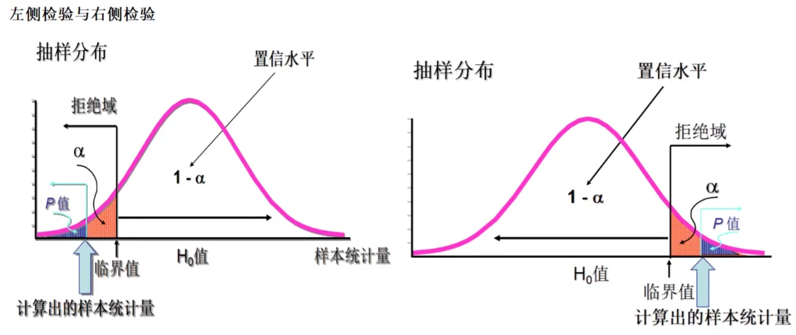

### 1.4 根据临界值法决定是否拒绝原假设

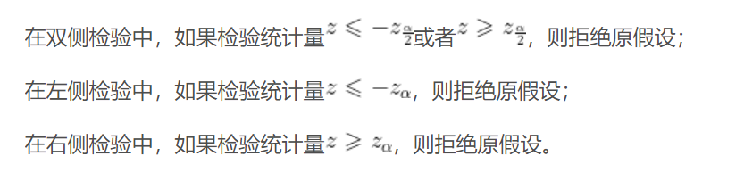

### Z检验

计算公式

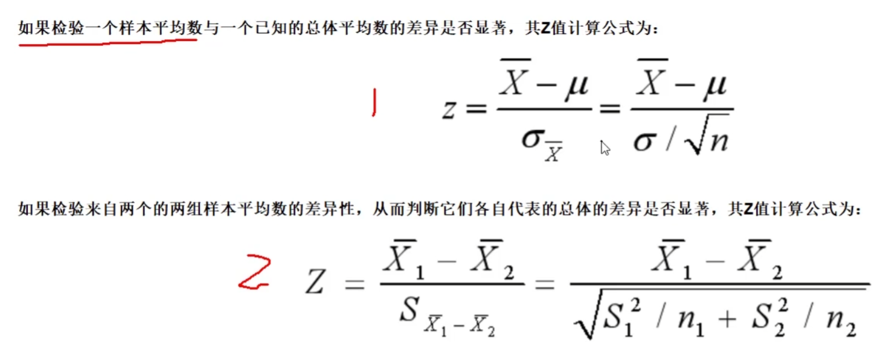

检验原理

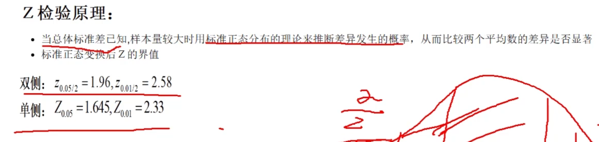

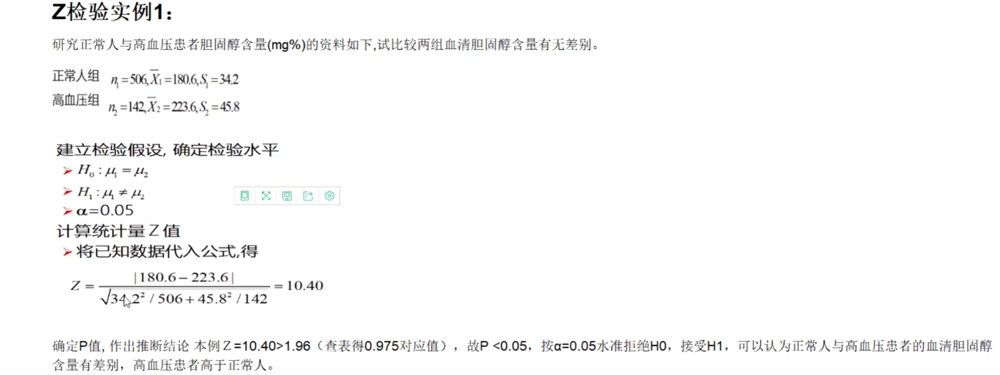

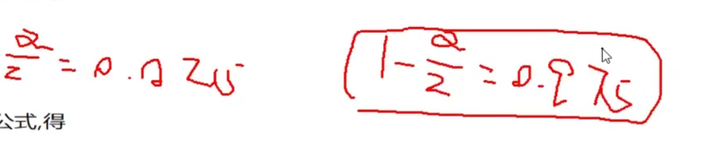

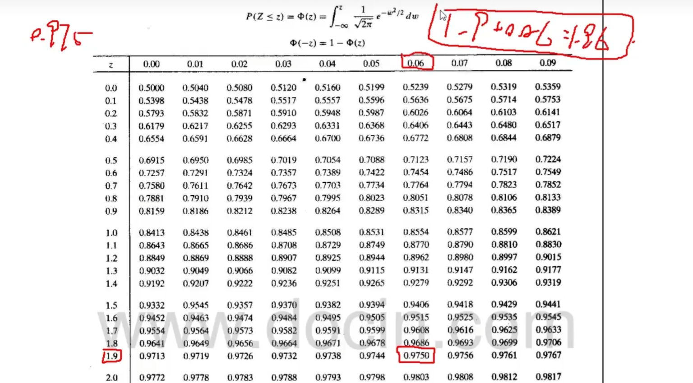

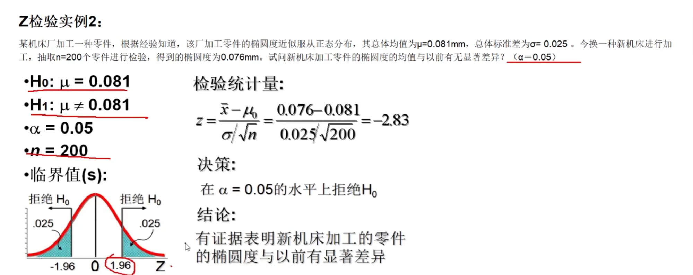

### T检验

T检验的三种形式

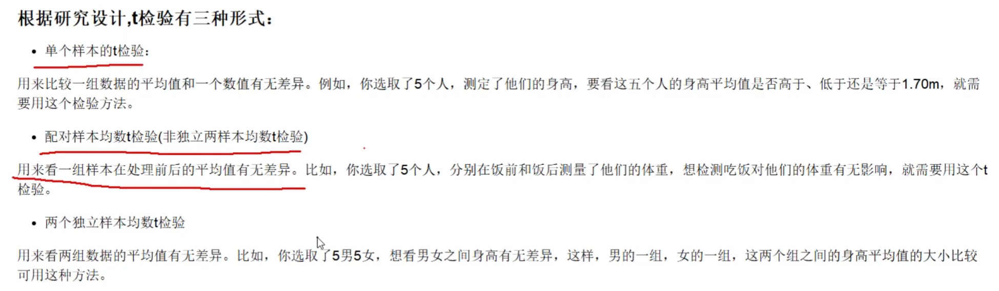

单样本t检验

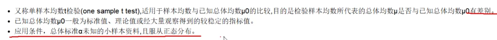

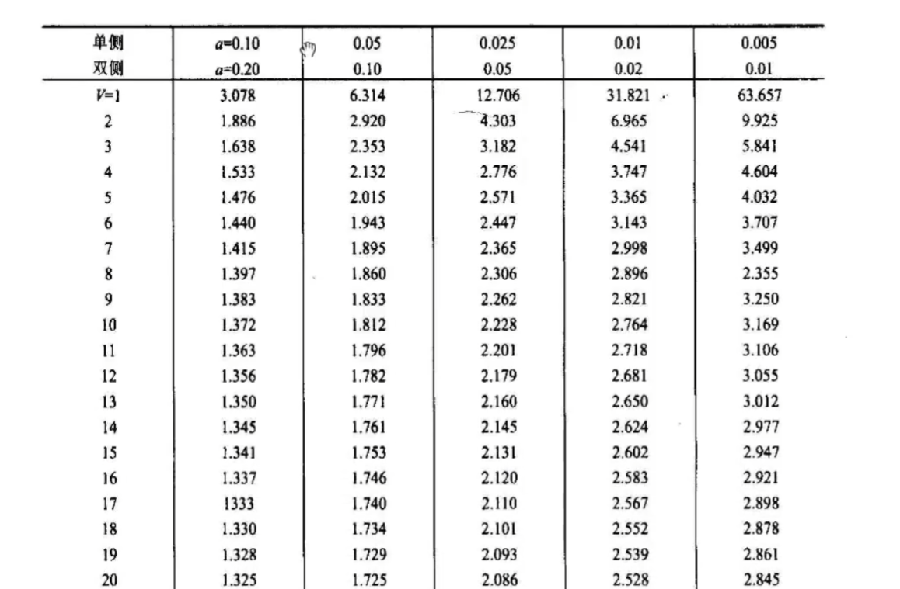

配对样本t检验 

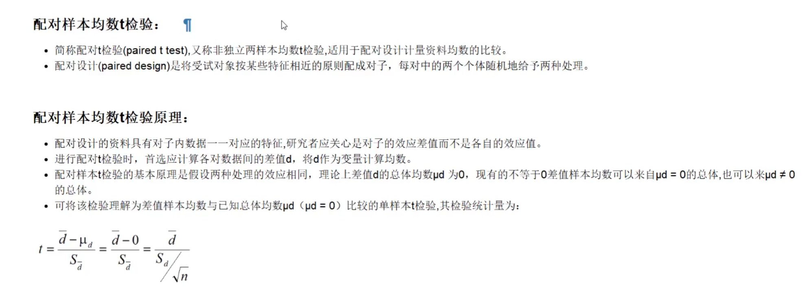

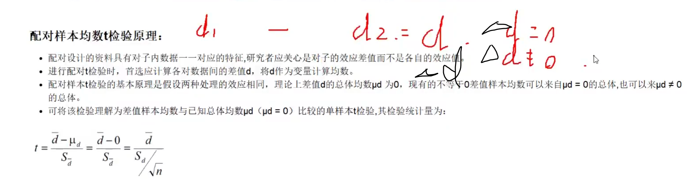

eg

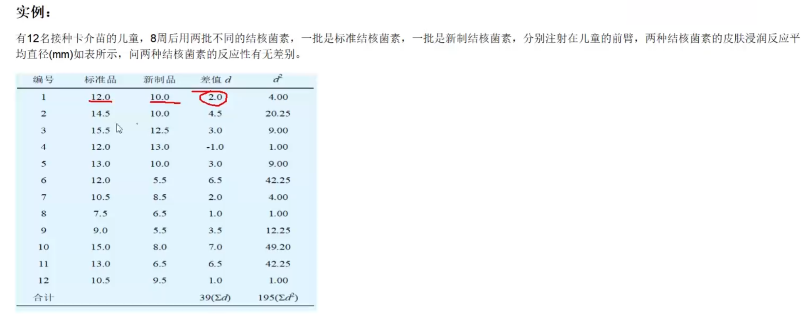

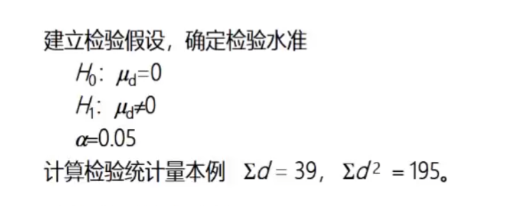

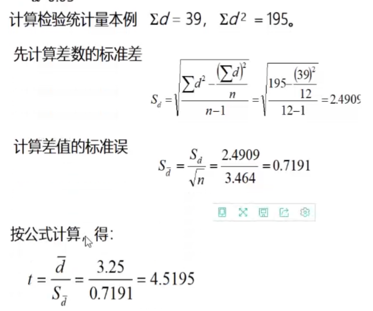

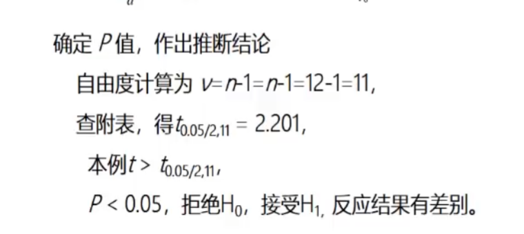

两独立样本t检验

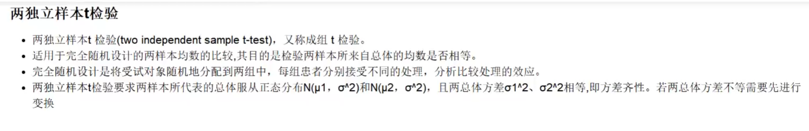

eg

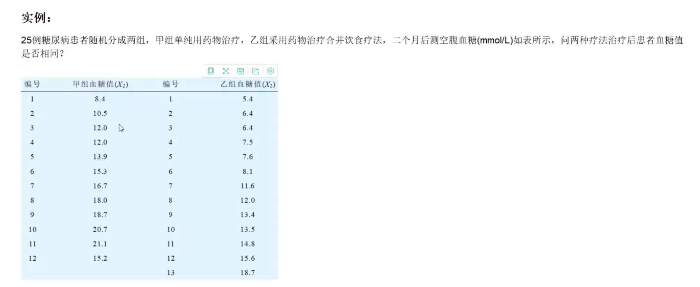

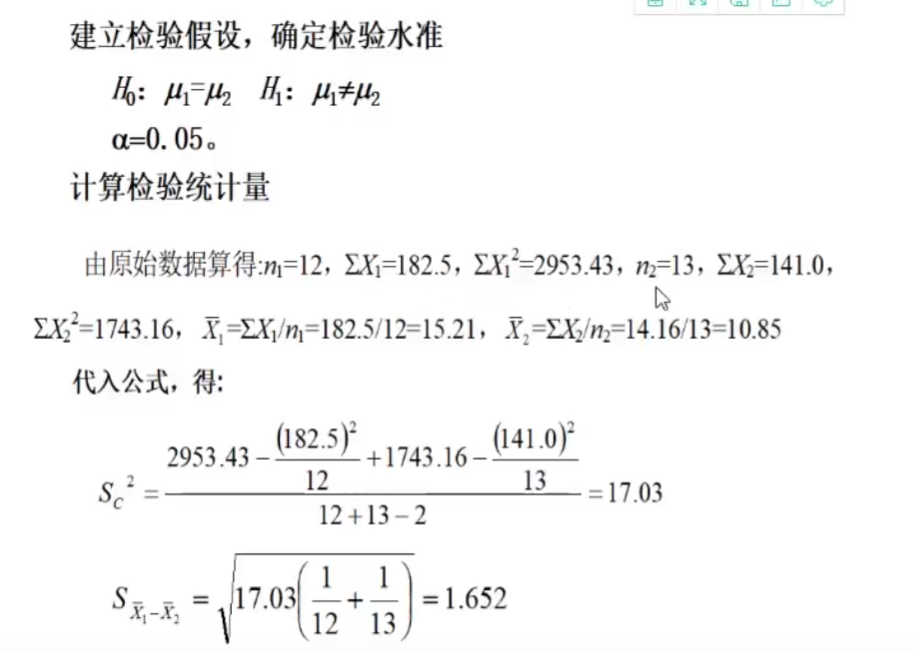

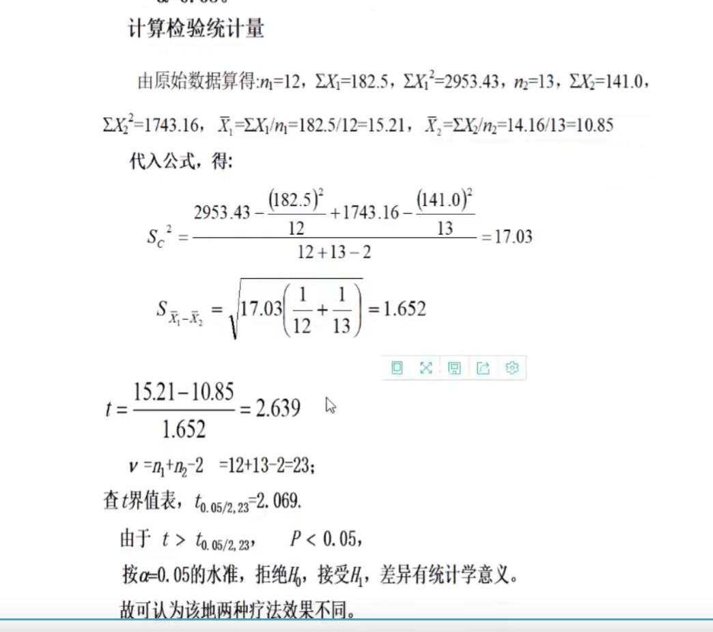

#### t检验应用条件

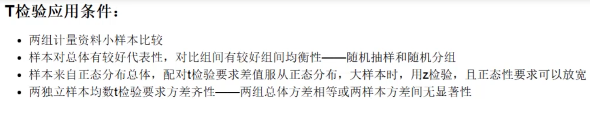

正态检验和两总体方差的齐性检验

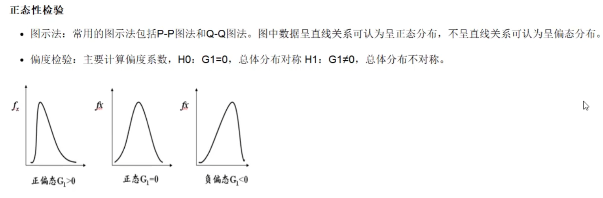


方差齐性检验


 eg


### 卡方检验


eg


卡方自由度 (行数-1)*(列数-1)


理论耐药率 44.08


## 概率模型中的元素


随机变量与概率：事件映射到实数域


全概率公式


## 随机变量的分布

二项分布


协方差


正相关，协方差大于0

负相关，协方差小于0


$X,Y相互独立\Rightarrow Cov(X,Y)\approx 0$ 

二元条件概率


多项式分布


伽马函数：阶乘延伸


Beta分布


指数分布

泊松分布特殊形式

 


贝叶斯


医生说得了罕见的病，得这种病概率比医生判断错概率还小

100个硬币 99个正常 HT  1个异常HH，投出一个正面，是异常硬币的概率


芝麻开门


先决条件：不管什么情况，A的概率都是1/3，BC共占2/3。在条件B为空的情况下，C的概率为2/3

