> All models are wrong, but some are useful.

## 机器学习目标

学习数学模型：找输入和输出的关系

假设空间 Hypothesis Space

在假设空间中找最好的假设去解释数据，假设表现为函数或者数学模型

### 输入输出

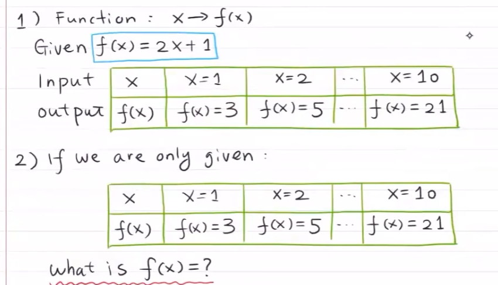

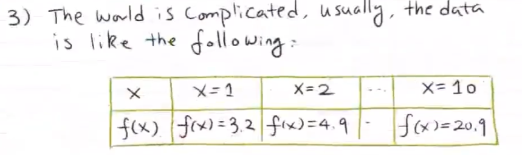

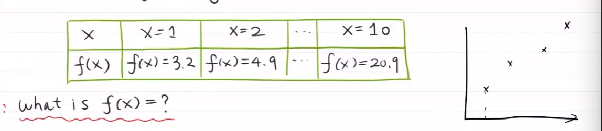

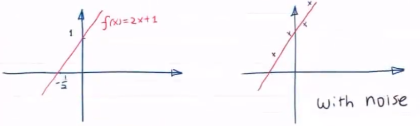

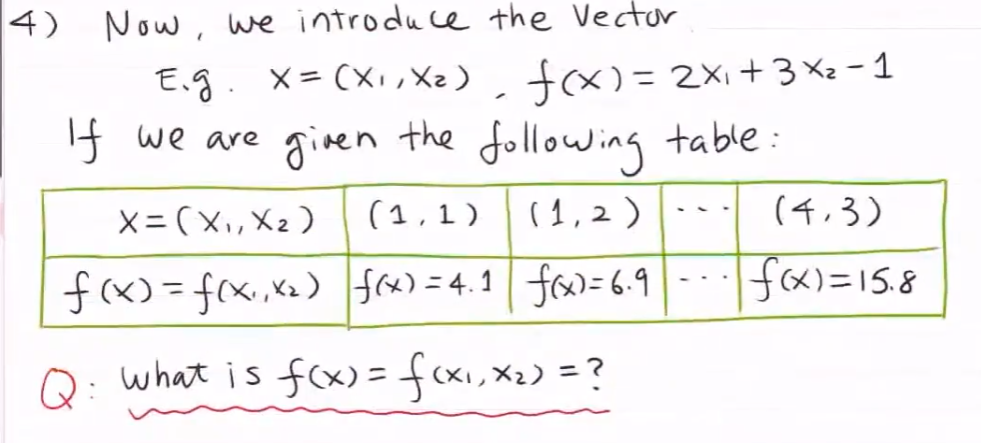

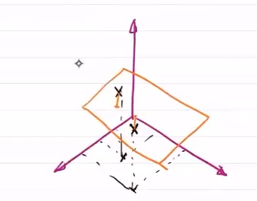

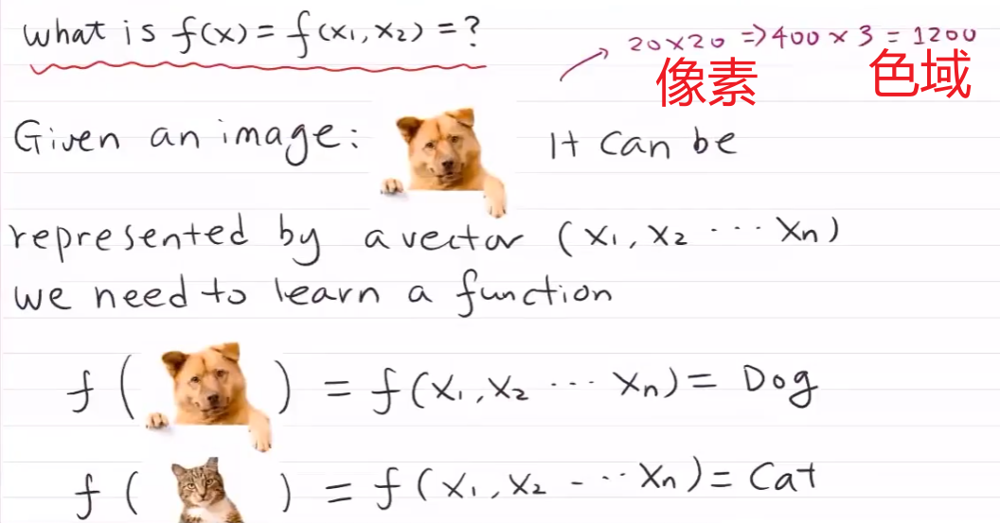

分类问题：输出为离散值

预测问题：输出为连续值

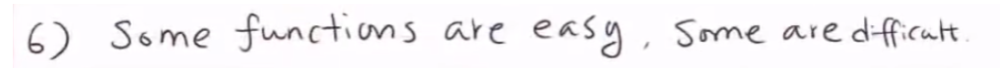

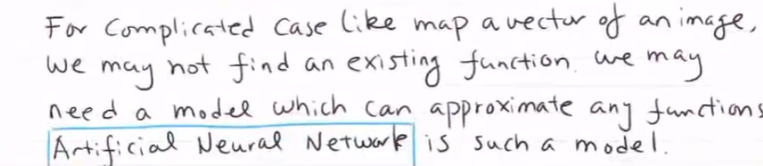

神经网络拟合非线性函数

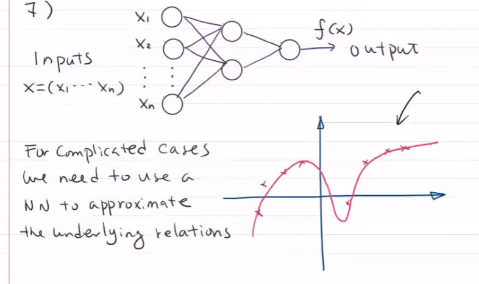

概率拟合（适用于分类问题）

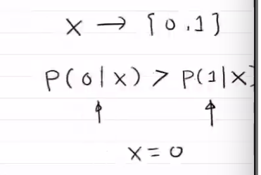

## 研究领域

人工智能：

- 传统人工智能——如何用工程方法制造智能系统（机器）

- 怎么模拟人脑——计算神经学

模式识别

- 文字识别
- 图像识别
- 语音识别
- 生物特征识别
- 基因密码

机器学习：学习数学模型，关注算法的有效性

- 统计学习：统计推理，贝叶斯推理

- 深度学习：通过神经网络拟合复杂的关系

- 分支：

  信息检索

  计算机视觉

  自然语言处理

数据挖掘：数据库——海量数据存储，ML——分析海量数据

## 过拟合问题

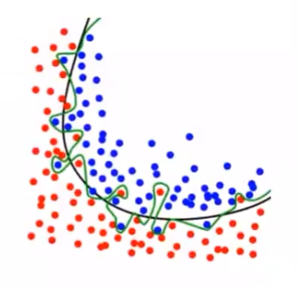

将噪音拟合入模型

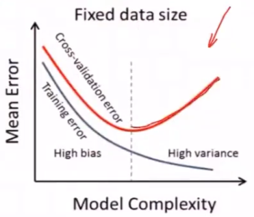

拟合程度越高，模型会越复杂，失去泛化能力

- 对训练数据完美拟合，对测试数据会出错

多项式复杂度代表模型复杂度与自由度，自由度过高会出现过拟合问题

### 如何避免过拟合

1. 更多数据

2. 集成学习，训练很多模型，求模型的均值

3. 约束：对模型复杂度施加惩罚

   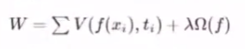

4. 交叉验证

   将训练数据分为训练块与测试块进行多轮验证，每个块都要作为测试块进行验证

   计算模型在不同分块下准确率的均值方差，比较不同模型准确率，找出最优模型

   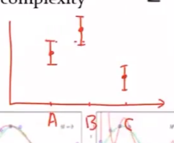

   A与B有重复部分，是可比较的。在统计意义上，不能判断哪个性能较好

   AC有重复部分，是可比较的。在统计意义上，不能判断哪个性能较好

   BC无重复部分，可以在统计意义上判断性能好坏

## 维数诅咒

在高维空间中，同样数据集数据会变很稀疏

在高维空间，达到与低维空间相同的数据密度需要更大的数据量

## 机器学习分类

### 监督学习

已知输入与输出的关系

- 分类
- 预测

### 无监督学习

通过点与点之间的特征聚集在一起

- 聚类
- 降维

### 强化学习

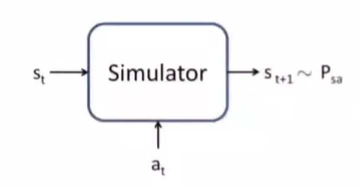