有参数模型：假设在有限集中的参数 $\theta$ ，预测自变量，数据集都相互独立

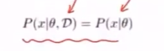

# 非参数模型

## K-近邻算法(KNN)——k-nearest neighbor

无参数有监督模型，用于分类和预测

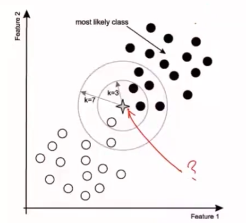

K表示距离给定点最近的k个点

- K为偶数时，根据距离判断

  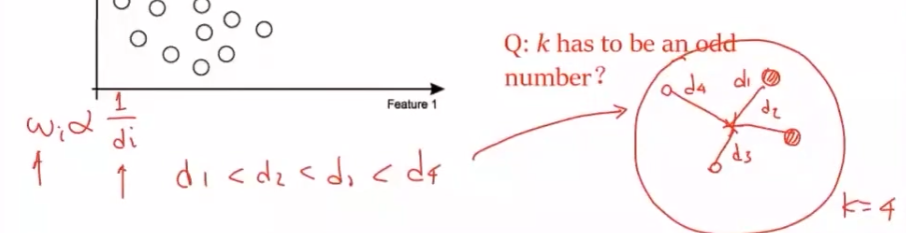

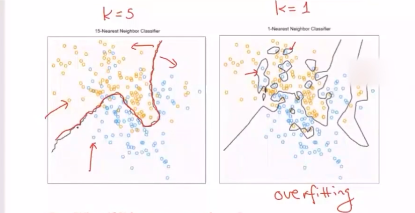

- K过于小，可能出现过拟合
- K过于大，则无法分类效果不好

### K-NN分类

> 划分空间

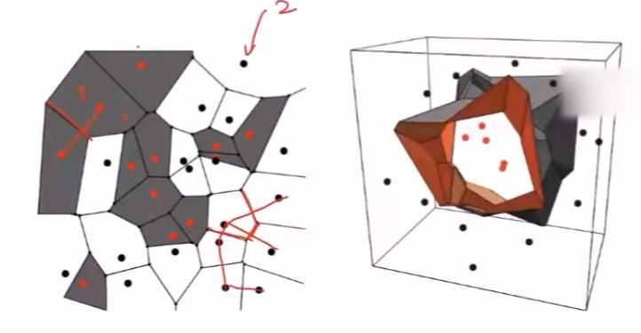

做连接两个点的直线，过中点做分界线(面)，将空间划分为多个区域，若某一个点 $(x_1^{(i)},x_2^{(i)})$ 落在某个区域时，分为该区域所属的类

### K-NN用于预测

分类问题， $y$ 为离散值。找目标点 $x'$ 最近的 $k$ 个点，取平均值 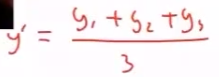 

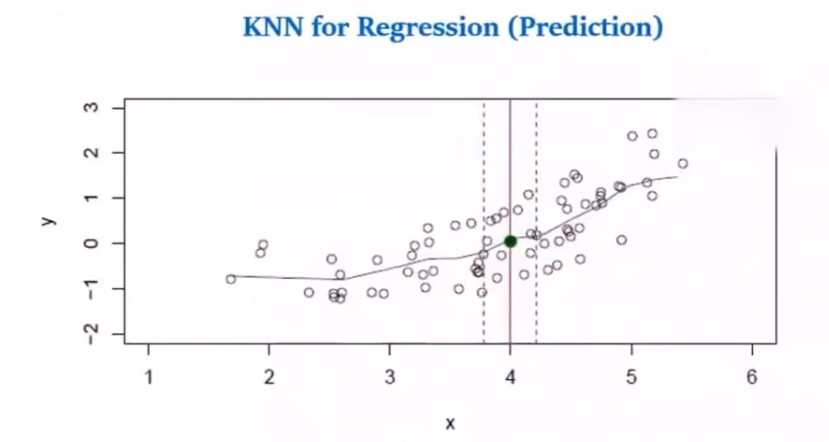

计算算术均值，前提是假设各点对决策的贡献相等

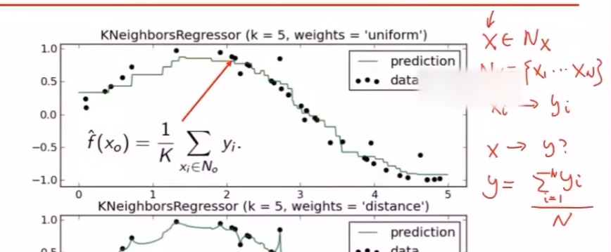

计算加权平均，将各点权重(各个点到目标点的距离不同)考虑进决策

### 距离定义

> 特征的数学距离与人的认知距离不同，ML面向人的认知距离

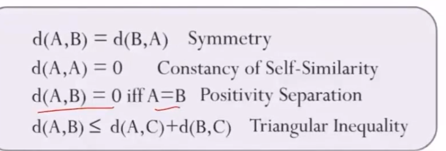

- 对称性：
- 自相似性
- 正性分离
- 三角不等式

#### 常用距离定义

欧氏距离：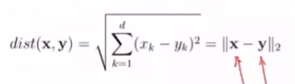

曼哈顿距离：

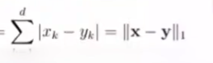

闵可夫斯基距离：

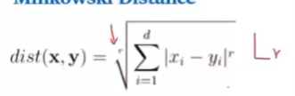

#### 汉明距离

度量二进制数据的距离

按位异或，1的个数为汉明距离，表示两个二进制数有多少位不同

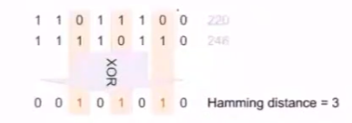

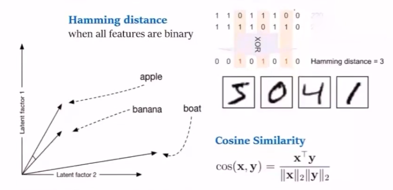

#### 自定义距离

自定义多条特征，关注每个数据在不同特征上的异同

## 朴素贝叶斯

朴素贝叶斯：假设给定的多个特征相互独立

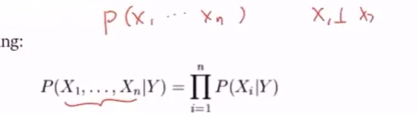

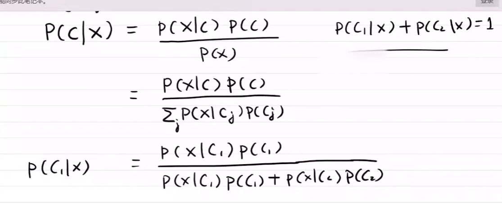

 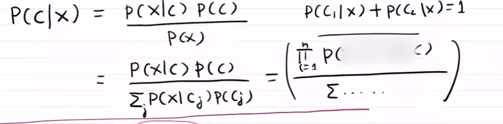

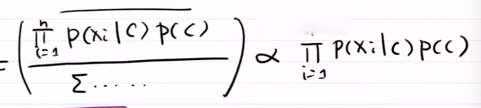

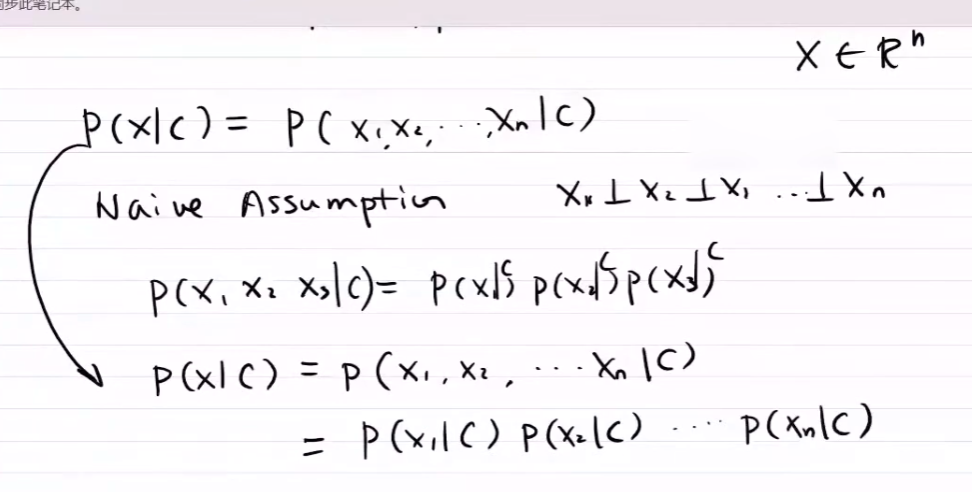

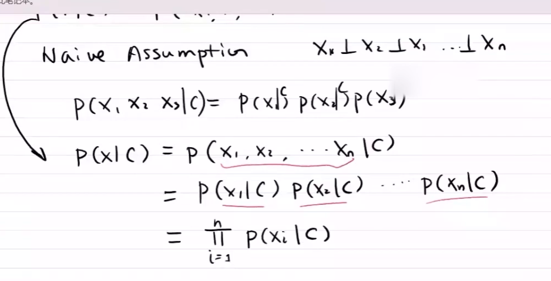

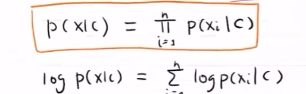

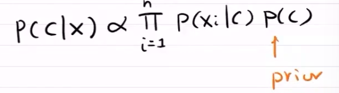

---

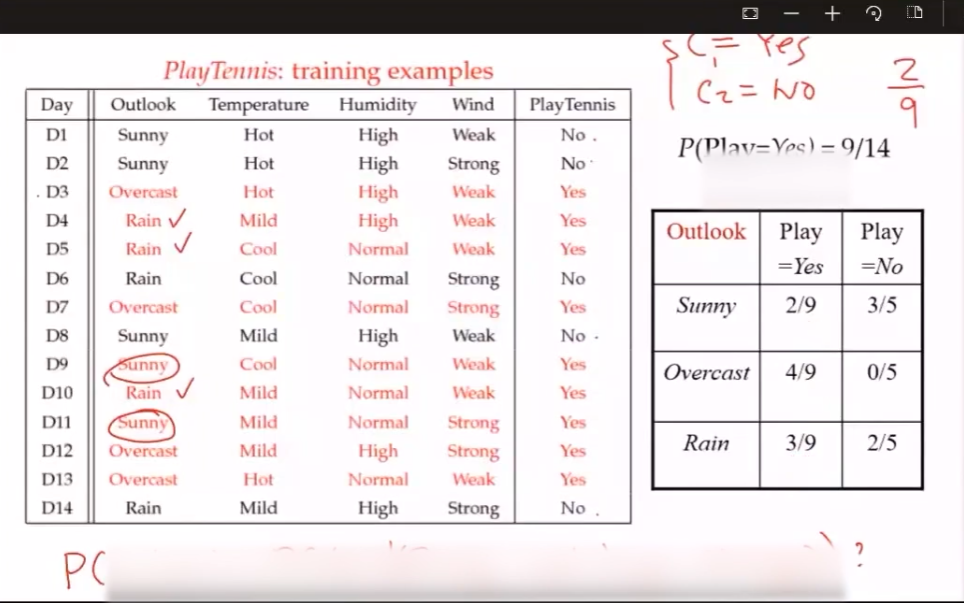

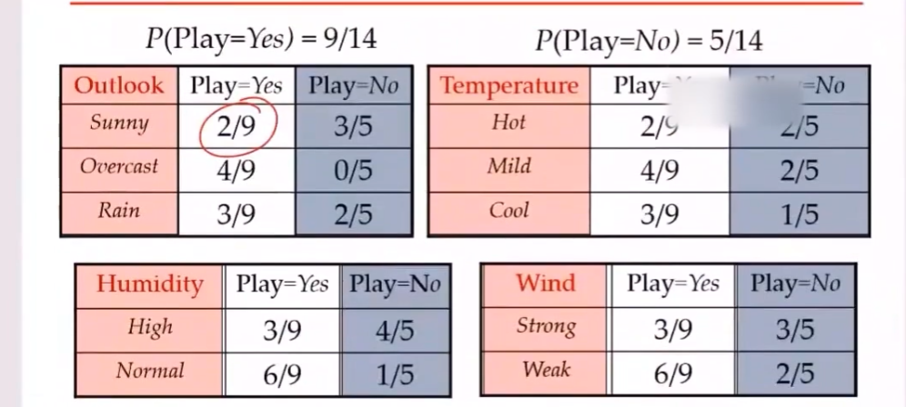

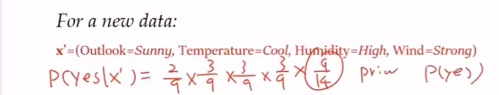

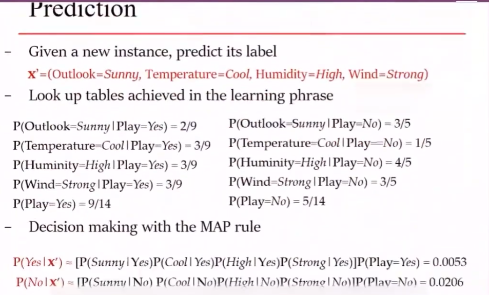

---

垃圾过滤

分类：$y\in \{0,1\}$ 表示是否为垃圾邮件；1表示垃圾邮件，0表示正常邮件

用词汇表向量 $x\in \{0,1\}^{50000}$ 表示词汇表中的50000个词是否出现在邮件中

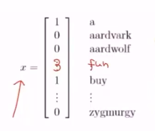

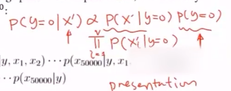

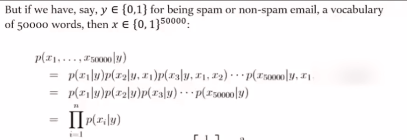

给定一个词，在垃圾邮件中出现的概率

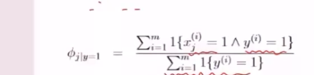

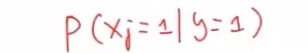

给定一个词，在正常邮件中出现的概率

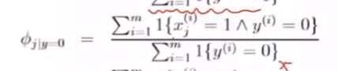

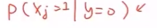

所有邮件中垃圾邮件占比

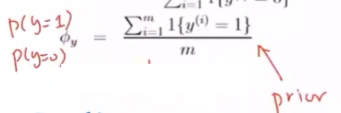

对于从未出现在单词表中的词汇，处理方法

- 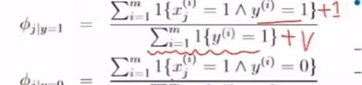

  v为词汇表中词汇数量

- 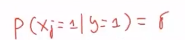

  \sigma 很小
