# EM

## 频率派与贝叶斯派

频率派：从统计意义上，表示事件发生的可能性

贝叶斯派：概率为通过经验对事件的不确定性进行度量，表示对事件的信任程度

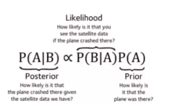

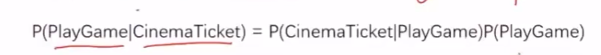

即使一件事先验概率很大，若似然概率很小，则后验概率也很小

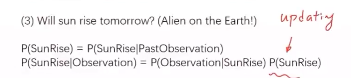

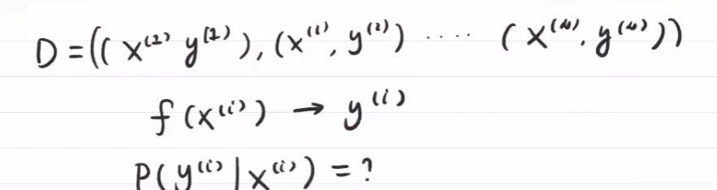

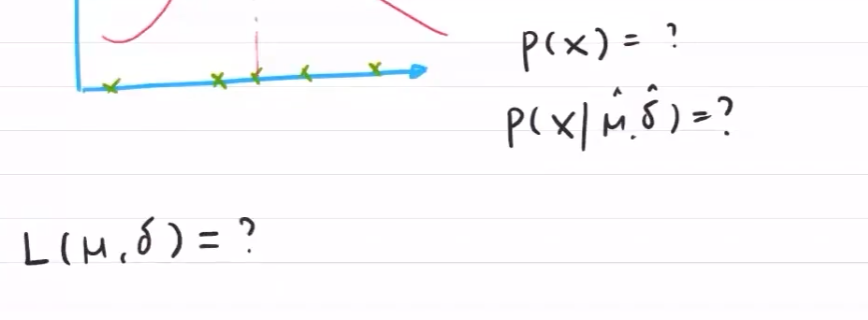

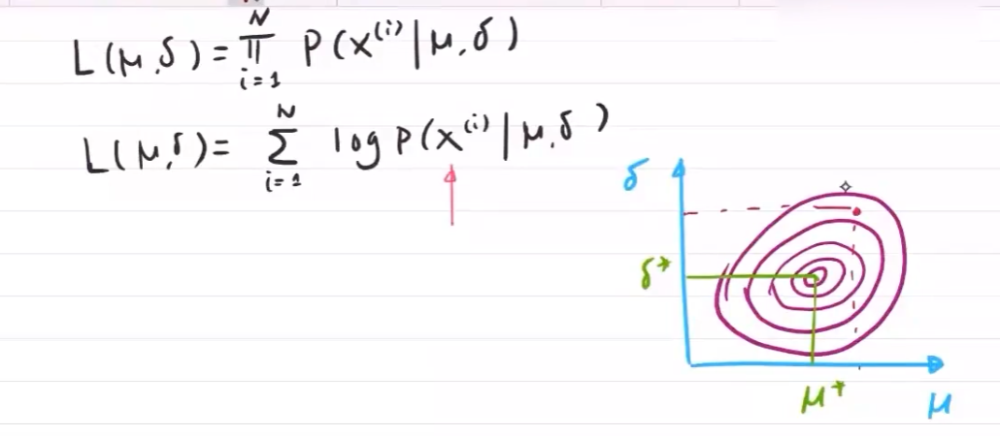

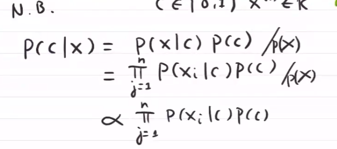

## 基本思想

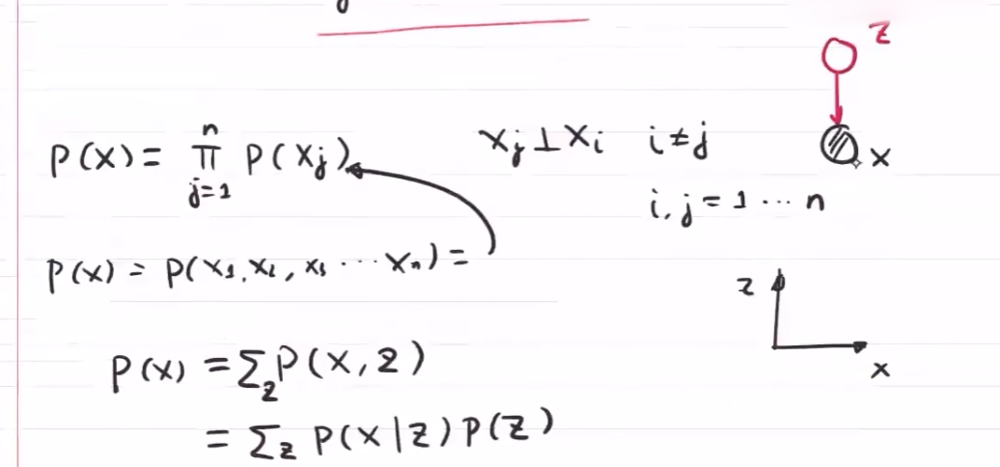

全概率公式

假设事件的发生受某一隐含变量影响，可通过贝叶斯推断建立模型，

- 若推测x与z之间存在隐含关系，则存在似然概率P(x|z)
- 假设z服从某种先验分布，则可以通过观测数据和初始参数推出P(z)

## 通过贝叶斯推断隐含变量与概率分布关系

### 投硬币

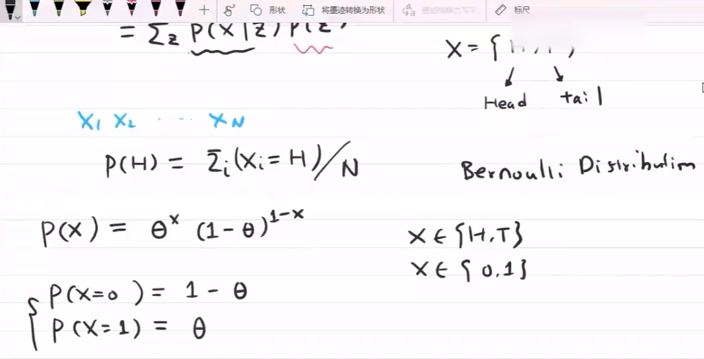

$\theta$ 表示正面为1的概率大小

多次投硬币为N重伯努利实验，

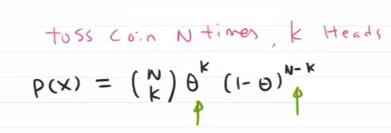

---

N重伯努利实验结果

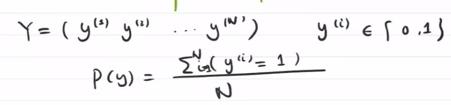

### 混合伯努利模型

假设结果与某一隐含变量有关

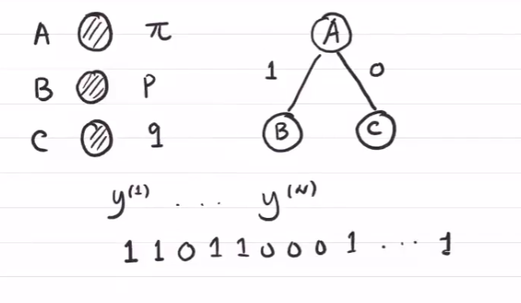

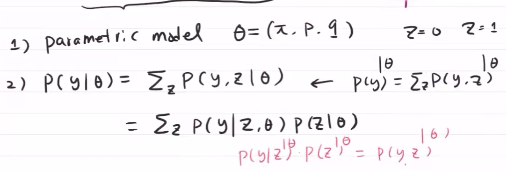

Z为控制y发生的隐含变量

- 

- 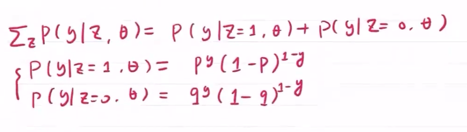

  服从伯努利分布

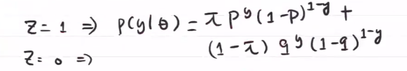

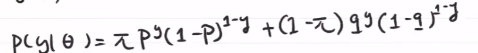

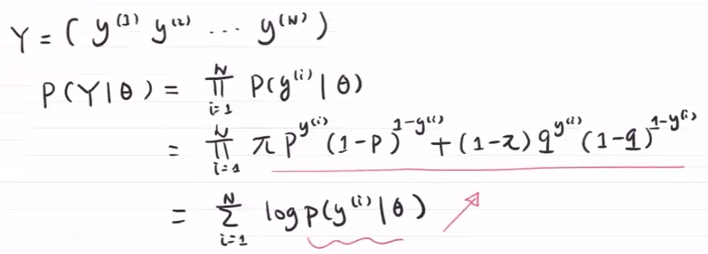

上述模型为二模态混合模型，由权重 $\pi$ 选择概密

- 多模态混合模型

  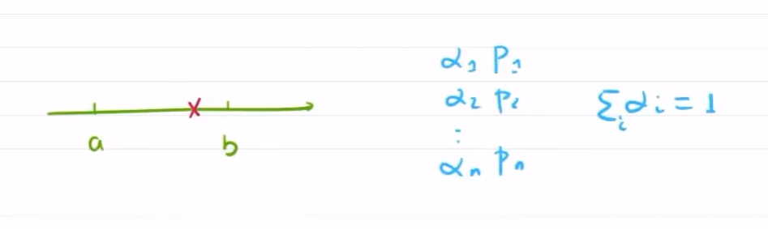

对于每一次的结果，需要了解由哪部分概密得出，才可以对三个参数进行估计

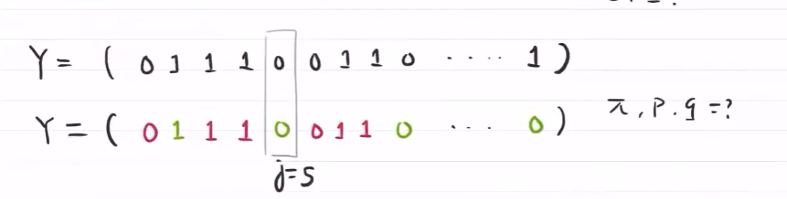

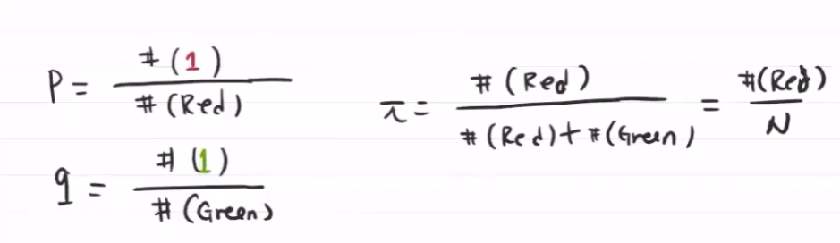

---

**E Step** 对每一个隐含状态的估计，估计每种结果来源概密的权重

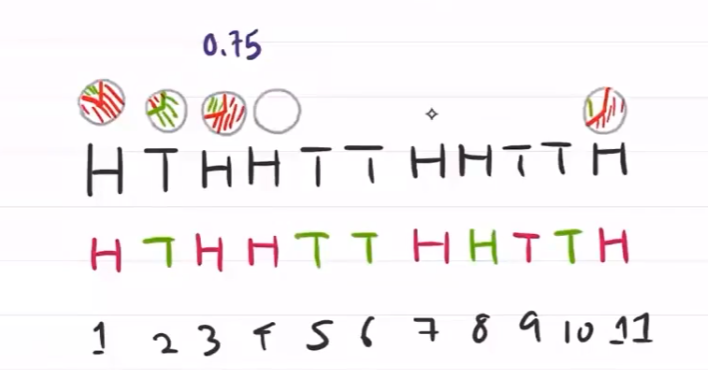

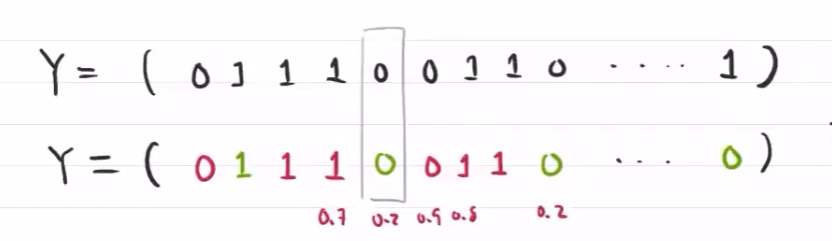

用参数 $\mu$ 估计每个数据的来源概密 $Q(z^{(i)})=P(z^{(i)}\vert x^{(i)},\theta)$ 

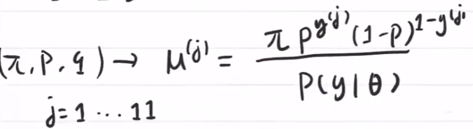

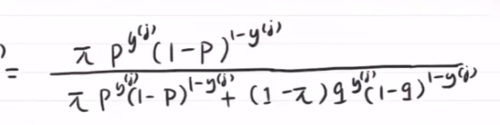

表示第j个数据，多大概率由 $Q(z^{(i)})$ 概密得出

**M Step** 在给定权重的条件下，求参数的极大似然值

对参数 \pi 估计 

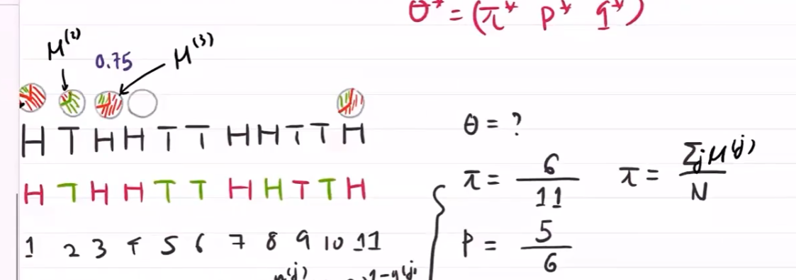

随机给定初始值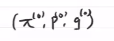  ，再根据初始值计算 $\mu_j$ ，根据来源概密估计 p,q

p：P概密中1的结果份数/p概密得出的所有结果份数

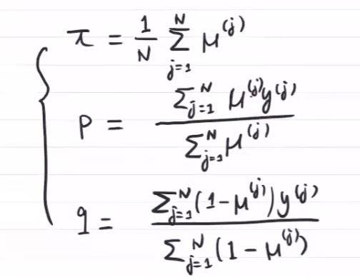

#### 二模态伯努利混合模型

1. 给参数赋随机值 

   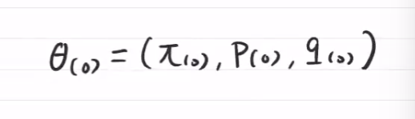

2.  E step：求在给定隐含变量值前提下的，事件发生的期望，根据初始值估计来源概密

   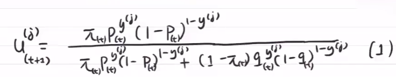

3. M step：求参数最大化，估计参数

   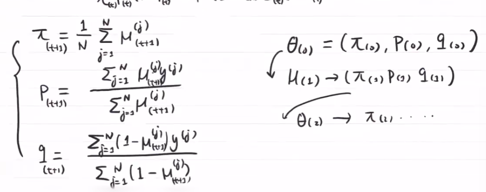

4. 迭代，直至参数稳定

EM 算法 期望最大化算法

`Expection Maximzation` 

## Jensen不等式

函数的期望与期望的函数大小关系

对于凸函数，函数值小于均值，故期望的函数值比较小 ，即函数的期望大于期望的函数

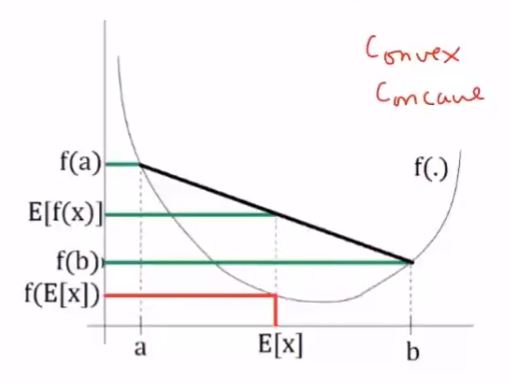

线性函数为期望函数，凸函数为f(x)

- 对于凹函数

  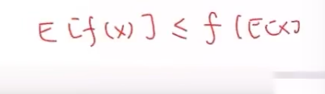

## EM算法

假设x与z相关，则将 $P(x;\theta)$ 分解为z的全概率公式

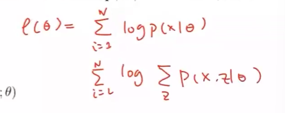

**假设隐含变量值前提下，求不完全数据发生的期望**

$L(\theta)=\sum_ilog\sum_z P(x,z\vert \theta)=\sum_ilog\sum_z P(x\vert z,\theta)P(z\vert\theta)$ 

进一步泛化，假设每个数据来源概密的权重 $z^{(i)}$ 服从 $Q(z^{(i)})$ 分布 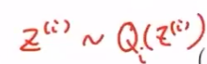 $Q(z^{(i)})$ 表示 $z^{(i)}$ 服从的概率分布

$\sum_{z^{(i)}}\limits Q(z^{(i)})f(z^{(i)})=E_z(f(z^{(i)}))$ 

$f(z^{(i)})=\frac{p(z^{(i)},z^{(i)};\theta)}{Q_i(z^{(i)})}$ 表示关于变量 $z^i$ 的函数

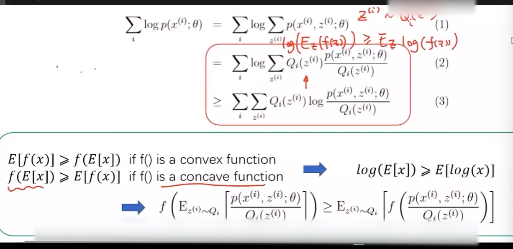

将下界不断增大，则逐渐收敛

数据均匀时，期望最大

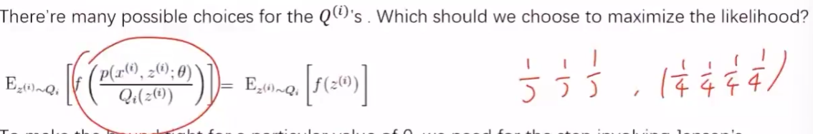

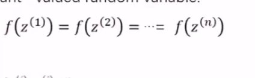

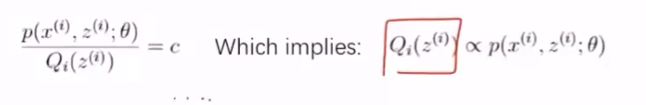

- 分子分母是常数，则分子与分母成正比

在前提 下，则可假设 $z$ 的分布 

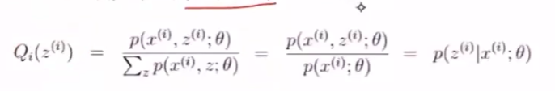

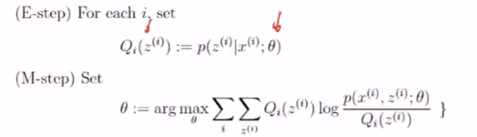

给定Z时，每个部分的最优值

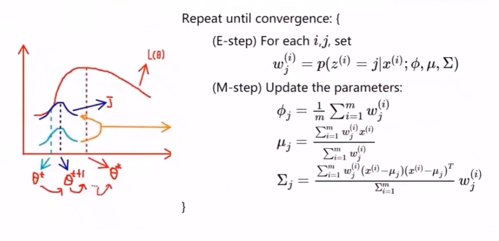

先随机指定一个\theta_t,得到隐含变量Z服从的分布Q_1，在Q_1分布之下，找到参数值的极大似然值。进一步估计期望，

##  高斯混合模型

### 二模态高斯混合模型

两个高斯分布，双峰

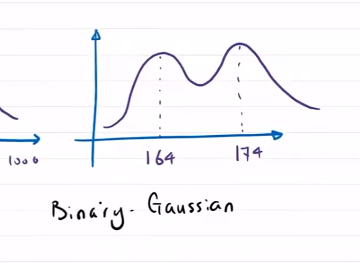

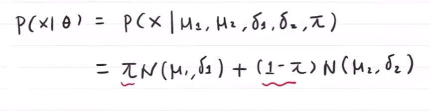

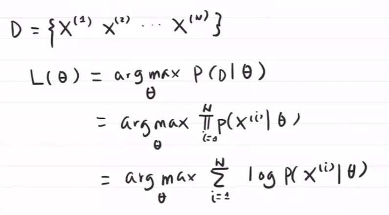

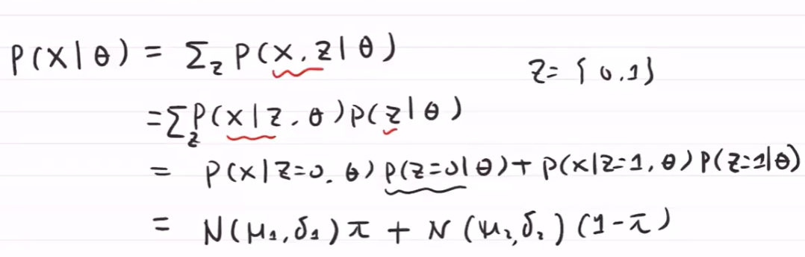

- 采样过程：选哪一个模型，由先验概率 \pi 决定，数据落在高斯模型的哪个位置，由模型控制

- 生成模型：给定数据，但是不知道怎么得出，根据数据估计参数似然值，构造高斯模型

### E Step 

求在Z控制下 不完全数据发生的期望

 $Q(z^{(i)})=P(z^{(i)}\vert x^{(i)},\theta)=\frac{P(z^{(i)},x^{(i)}\vert \theta)}{P(x^{(i)}\vert \theta)}=\frac{一种模型得到同一结果的概率}{两个模型得到同一结果的概率}$  

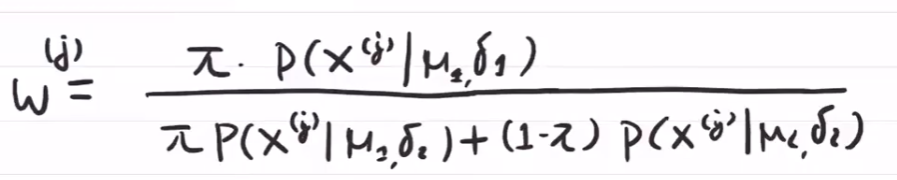

### M Step

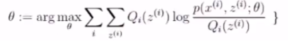

**权重的估计**

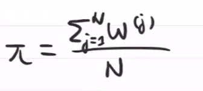

**第一个模型参数估计**

均值估计：第一个高斯所有数据的均值

 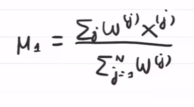  

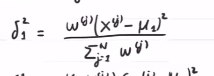

**第二个模型参数估计**

第二个高斯所有数据的均值


## EM收敛性


t表示迭代


- z服从什么分布时，E最大

不断调整 \theta ，使似然概率最大


后俩项，在参数给定时是一个常数，$Q(\theta,\theta^{(t)})$ ，\theta可以根据上一时刻的值进行调整，使Q()变大，使L(\theta)上升和提高


使Q的极大似然值最大时的 $\theta$ 为下一时刻的 $\theta$


EM算法用来解决观测数据不完全时，对模型的参数估计问题。

目标是在给定参数 $\theta^{old}$ 和观测数据 $X$ 给定下，使非完全数据的对数似然函数 $lnP(X\vert \theta^{old})$ 取最大值

$Q(q,\theta^{old})= E_{Z\vert X,\theta^{old}}[lnP(X,Z\vert \theta^{old})]$ 即完全数据的对数似然函数，关于“隐变量Z的条件概率分布 $P(Z\vert \theta^{old},X)$” 的期望。由 $KL(q||p)\ge 0\Rightarrow lnP(X\vert \theta)\ge Q(q,\theta)$，可用 $Q(q,\theta^{old})$ 作为非完全数据对数似然函数 $lnP(X\vert \theta^{old})$ 的下界

**E step** 

在固定参数 $\theta^{old}$ 和已知观测数据 $X$ 条件下，找出使完全数据对数似然函数的期望 $Q(q,\theta^{old})$ 的最大的隐变量 $Z$ 的条件概率分布 $q(Z)=\mathop{max}\limits_{z}\{P(Z\vert X,\theta^{old})\}$ ，此时 $KL(q||p)=0$ 

**M step**

在固定 $q(Z)$ 时，调节参数 $\theta$ ，最大化 $Q(q,\theta^{new})$ ，即完全数据的似然函数，关于 “给定参数 $\theta^{old}$ 和观测数据 $X$ 的条件下，隐变量Z的条件概率分布 $P(Z\vert \theta^{old},X)$ ”的期望最大化。由于参数的更新，$q(Z)$ 与 $P(Z\vert X,\theta^{new})$ 不在相等，即 $KL(q||p)>0$ ，导致了非完全数据对数似然函数 $P(X\vert \theta^{new})$ 增大
