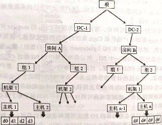

[TOC]

<!--more-->

## 3.1 Ceph中的数据表示

### 3.1.1 Ceph对象

> Ceph对象是数据及其元数据的组合，由一个全局唯一的标识符标识

**基于对象存储的优势**

- 基于文件的存储中，文件大小是有限制的，而对象则是可以随着大小可变的元数据变得很大
- 在一个对象中，数据存储为元数据 （数据上下文和数据内容），允许用户管理和访问非结构化数据


**对象的存储**

所有对象存放在物理上隔离的线性地址空间

这些对象以副本或纠删码的方式存储在基于对象的存储设备（OSD）中

当Ceph集群接收到来自客户端的数据写请求时，将收到的数据另存为对象，然后OSD守护进程将数据写入OSD文件系统的一个文件中

### 3.1.2 Ceph对象定位

#### Ceph池

Ceph所有的数据都以对象的形式存储在一个池中，池是存储对象的逻辑分区，每个池包含一定数量的PG，交叉分布在集群所有的节点上的。

Ceph集群部署完成后，会创建一些默认的存储池（rbd）

- 若集群中配置了MDS，则会创建data、metadata池

```shell
$ ceph -s#查看集群信息
# 输出中，“pgmap” 属性包含池数量和一些对象信息

$ rados lspools # 查看池列表
data
rbd
metadata

$ rados -p metada metadata ls #查看指定池中的对信息
```

池根据ceph.conf中配置的副本数创建指定数量的副本池，保障数据的高可用性，比如：复制或纠删码技术（二选一）

- 纠删码：将数据分解成块编码，然后以分布式的方式存储

当数据写入池时，Ceph池会映射到一个CRUSH规则集，CRUSH规则集为Ceph池提供了新的功能

- 缓冲池：创建一个使用SSD的faster池或SSD、SAS和SATA硬盘组成的混合池
- 支持快照：`ceph osd pool mksnap`
- 为对象设置所有者和访问权限：给池分配一个用户ID标识该池的所有者

##### 池操作

```shell
$ ceph osd pool create [池名] [PG数] [PGP数] #创建池并制定PG和PGP数量

# 获取池列表
$ ceph osd lspools 
$ rados lspools
# 获取池的ID、副本数、CRUSH规则集、PG数、PGP数
$ ceph osd dump | grep -i pool

# 检查池的副本数
$ ceph osd dump | grep size # rep size为池副本数
# 设置池的副本数
$ ceph osd pool set [池名] size [int]

#重命名池
$ ceph osd pool rename [池名] [新池名]

#将指定文件转换为对象，并放入指定池中
$ rados -p [池名] put [对象名] [文件路径]
#从池中移除对象
$ rados -p [池名] rm [对象名]
#查看池中对象
$ rados -p [池名] ls

# 创建快照
$ rados mksnap [快照名] -p [池名]

# 查看快照
$ rados lssnap-p [快照名]
# 查看指定池的快照中指定对象
$ rados -p [池名] listsnaps [对象名]

# 快照回滚
$ rados rollback -p [池名] [对象名] [快照名]
```

删除池时会删除所有该池的所有快照。

- 如果为池手动增加了CRUSH规则集，在删除池后，需要手动删除该CRUSH规则集
- 如果为池的某个用户创建了一个权限，也需要删除该用户

```shell
$ ceph osd pool delete [池名] [池名] --yes-i-really-really-meant-it
```

#### PG

CRUSH首先将一条数据分解为一系列对象，然后根据对象名称、复制级别和系统中总的PG数 `PG_num` 执行散列操作，生成PG ID

PG是一组对象的逻辑集合（可能不属于同一条对象），根据Ceph池的副本数，PG会被复制到不同的OSD上可以提高系统的可靠性


通过PG，可以减少系统管理大量对象带来的资源占用，一般来说，增加集群的PG数能降低每个OSD上的负载，所以PG数需要根据集群规模调整

- 建议每个OSD上放置50-100个PG

##### PG数计算

平衡每个池中的PG数和每个OSD中的PG数对于降低OSD差异，避免恢复过程缓慢有很大意义
$$
PG数= 2^{\big\lceil\log_2(OSD总数\times 100/最大副本数)\big\rceil}\\
每个池平均PG数=2^{\log_2\big\lceil PG总数/池数\big\rceil}=2^{\big\lceil\log_2(OSD总数\times 100/最大副本数/池数)\big\rceil}
$$

##### 修改PG和PGP

PGP是为定位设置的PG，对于一个池而言 `pgp_num=pg_num` 

对于再平衡操作：当某个池的 `PG_num` 增加，这个池的每个PG会被一分为二，但先不进行再平衡。等到 `pgp_num` 被增加时，PG才开始从源OSD迁移到其他OSD，正式开始再平衡

**配置指令**

```shell
$ ceph osd pool get [池名] 属性名
$ ceph osd pool set [池名] [属性名] [属性值]

# 获取现有PG 和 PGP
$ ceph osd pool get data pg_num
$ ceph osd pool get data pgp_num

# 修改PG和PGP
$ ceph osd pool set data pg_num 256
$ ceph osd pool set data pgp_num 256
```

##### PG peering 和up、acting集合

acting集合负责PG的一组OSD，acting 集合中的第一个OSD为主OSD，其余为第二、第三...OSD

- 对于某些PG而言，某个OSD为主OSD，但同时对于其他PG来说，该OSD可能为非主OSD

- 主OSD的守护进程负责该PG与第二第三OSD间的 **peering操作** 

  该PG的所有对象及其元数据状态

  存放该PG的所有OSD间的确认操作


处于up状态的主OSD会保持在up与acting集合中

- 正常状态acting集合和up集合一样
- up[]：是一个特定CRUSH规则集下的一个特定OSD map版本的所有相关OSD的有序列表
- acting[]：特定OSDmap版本的OSD有序集合

一旦变为down，首先会将其从up集合中移除，第二OSD会被晋升为主OSD。Ceph会将出错OSD上的PG恢复为新的OSD，并将该OSD添加到up集合和acting集合中

## 3.2 Ceph数据管理

### 3.2.1 数据写入过程

1. 客户端-首先与monitor通信，获取集群的map副本，从而 **获取Ceph集群状态和配置信息**
2. 客户端-使用对象和池名/ID **将数据转换为对象**
3. 客户端-将对象和归置组数(Placemnent group,PG)经过 **散列** 生成其在Ceph池中最终存放的PG ID
4. 客户端-将计算好的PG经过 **CRUSH查找** 确定存储或获取数据所需的主OSD ID
5. 客户端直接相向主OSD **存储** 数据
6. 主OSD-在写入数据后，执行CRUSH查找，计算辅助归置组和辅助OSD位置来 **复制数据副本** ，并等待它们确认写入完成，接收其他OSD返回的写入完成应答信号。
7. 最后主OSD向客户端返回写入完成应答信号

### 3.2.2 相关指令

```shell
# 生成文件，创建池
echo "Hello ceph" > /tmp/helloceph
ceph osd pool create HPC_pool 128 128
ceph osd pool set HPC_pool size 3

# 将数据以对象形式存入池
rados -p HPC_pool put object1 /tmp/helloceph
ceph osd map HPC_pool object1
- osdmap e566：OSD map的版本号，表示版本566
- pool 'HPC_pool'(10)：池名(ID)
- object 'object1'：对象名
- pg 10.bac5debc(10..3c)：PG编号，表示对象object1属于PG 10.3c
- up[0,6,3]：OSD的up集合，osd.0，osd.6，osd.3 。表明存放PG 10.3c的三个OSD状态都是up
- acting[0,6,3] ：osd.0，osd.6，osd.3都在acting集合中，其中osd.0是主OSD
```

正常情况下，osd是彼此物理隔离的
ceph osd tree


登录到任意一个节点检查OSD上实际存放数据的地方，可以从文件角度看到对象


对象object1被存放在ceph-node2上的PG10.3c中，该PG所在的osd为osd.3，对应的系统分区为/dev/sdb1

## 3.3 CRUSH计算寻址

### 3.3.1 元数据机制

每一次有新数据添加到存储系统中时，元数据最先更新（数据存放的物理位置 ），之后才是实际的数据存储

- 元数据是描述数据的数据，包含与数据存储有关的信息（存储节点、磁盘阵列位的位置）

**缺点**

- 造成存储系统的单点故障

  改进：

  - 在单个节点上保存多个副本

  - 复制整个数据和元数据保证更高的容错度

  不管如何改进，复杂的元数据管理机制是存储系统在高伸缩性、高可用性和性能上的瓶颈

### 3.3.2 CRUSH算法

> Ceph使用可扩散散列下的受控复制（Controlled Replication Under Scalable Hashing，CRUSH）算法按需计算元数据，而不存储元数据，元数据的计算过程也被称为 **CRUSH查找**

对Ceph集群的读写操作：客户端使用自己的系统资源来执行CRUSH查找


#### CRUSH map

CRUSH map包含一系列可用的 bucket（共同标识设备的具体物理位置）、Ceph池复制数据的规则

**CRUSH bucket**

CRUSH设备列表通常包括磁盘、节点、机架(rack)、行(row)、开关、电源电路、房间、数据中心，这些组件的故障域称为 **CRUSH bucket** 



**数据复制规则**：CRUSH跨故障域传播数据及其副本

CRUSH均匀地在整个集群磁盘上读写数据，确保磁盘中的所有磁盘被同等地利用

OSD权重：每个OSD都有相应的权重，OSD权重越高，表示物理存储容量越大，CRUSH可以将更多地数据写入这个OSD

##### CRUSH map编辑命令

在 ceph-deploy 部署完Ceph后，会生成一个默认的 CRUSH map，生产环境中需要定制 CRUSH map

```shell
$ ceph osd getcrushmap -o crushmap.txt #获取现有CRUSH map , -o 表示编译输出到指定文件
$ crushtool -d crushmap.txt -o crushmap-decompile #-d 指定需要反编译的CRUSH map
$ vim crushmap-decompile # 编辑CRUSH map
$ crushtool -c crushmap-decompile -o crushmap-compiled #重新编译新的CRUSH map
$ ceph osd setcrushmap -i crushmap-compiled #将新的CRUSH map应用到Ceph集群中
```

从软件角度表示集群的物理布局

```shell
$ ceph osd tree # 获取当前集群布局

$ ceph osd crush [操作] [被操作组件] [目标组件]

# 在集群中添加新机架
$ ceph osd crush add-bucket rack01 rack 
$ ceph osd crush add-bucket rack02 rack 
$ ceph osd crush add-bucket rack03 rack 

# 移动主机到指定机架下
$ ceph osd crush move ceph-node1 rack=rack01
$ ceph osd crush move ceph-node1 rack=rack02
$ ceph osd crush move ceph-node1 rack=rack03

# 移动机架到默认根下
$ ceph osd crush move rack01 root=default
$ ceph osd crush move rack02 root=default
$ ceph osd crush move rack03 root=default
```

#### 恢复与再平衡

**恢复等待时间**

在故障域中的组件发生故障后，Ceph会进入默认等待时间，等待时间耗尽后，会将该OSD标记为 down out 并初始化恢复

- 通过Ceph集群配置文件中的 `mon osd down out interval` 配置项，可以修改等待时间

**再平衡操作**

在恢复操作期间，Ceph会进行再平衡操作：重新组织发生故障的结点上受影响的数据，保证集群中所有磁盘能均匀使用

原则：尽量减少数据的移动来构建新的集群布局

对于利用率高的集群，建议先将新添加的OSD权重设置为0，再依据磁盘容量逐渐提高权重，减少Ceph集群再平衡的负载并避免性能下降


