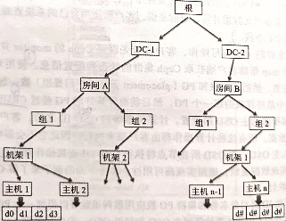
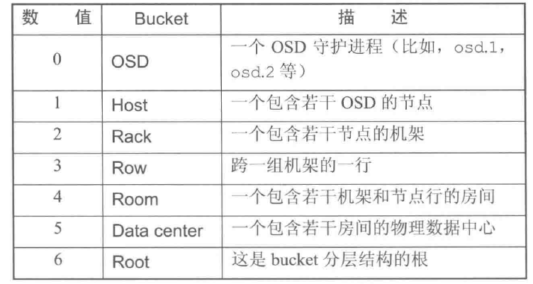
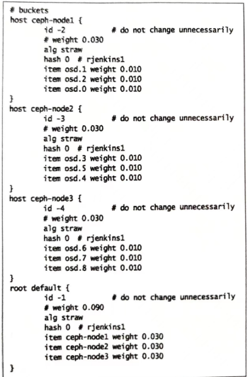
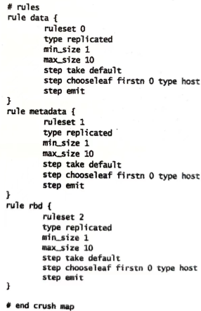
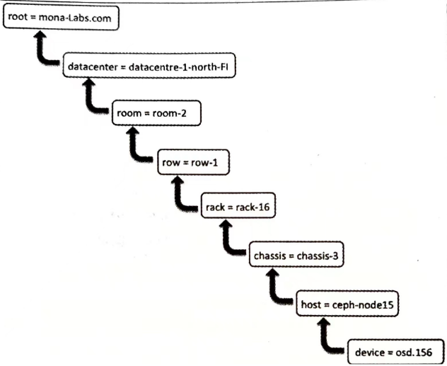
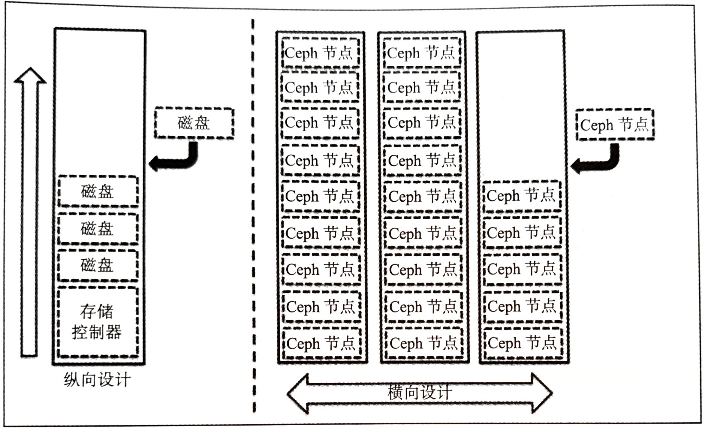
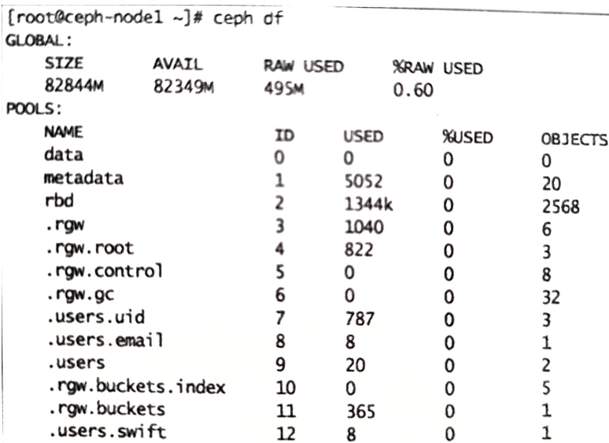
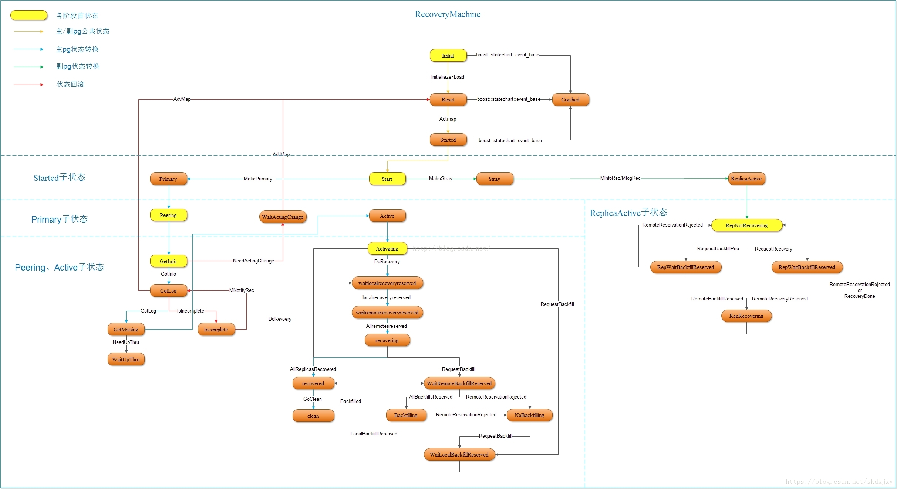
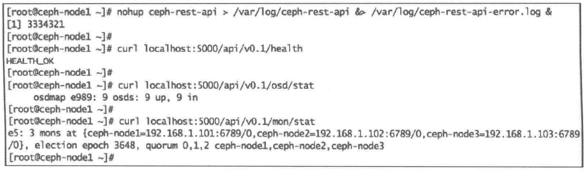

[TOC]

<!--more-->

## 4.1 Ceph服务管理

### 4.1.1 使用sysinit运行Ceph

在 RedHat 以及一些旧版的Debian/Ubuntu发行版中，sysinit是一个传统的但被推荐用于管理Ceph守护进程的方法

```shell
/etc/init.d/ceph [options] [command] [dameons]
```

[options]

```shell
--verbose(-v)	: 用于记录详细日志
--allhosts(-a)	: 在Ceph.conf提及的所有节点上执行命令，否则只在本节点上运行
--conf(-c)		: 使用可选的配置文件
```

[command]

```shell
status	: 显示守护进程状态
start	: 启动守护进程
stop	: 停止守护进程
restart	: 重启守护进程
forcestop	: 强制进程关闭 类似与kill -9
```

[dameons]

```shell
mon
mgr
osd
mds
ceph-radosgw
```

#### 根据类型启动守护进程

若要在本机启动monitor进程

```shell
/etc/init.d/ceph start mon
```

若在本地及远程主机上启动所有的monitor进程，添加 `-a` 选项

```shell
/etc/init.d/ceph -a start mon
```

其他类型的进程同理

```shell
/etc/init.d/ceph -a start osd
/etc/init.d/ceph -a start mgr
/etc/init.d/ceph -a start mds
/etc/init.d/ceph -a start radosgw
```

#### 根据类型停止守护进程

```shell
/etc/init.d/ceph -a stop mon
/etc/init.d/ceph -a stop osd
/etc/init.d/ceph -a stop mgr
/etc/init.d/ceph -a stop mds
/etc/init.d/ceph -a stop radosgw
```

#### 启动及停止所有守护进程

```shell
/etc/init.d/ceph -a start
/etc/init.d/ceph -a stop
```

#### 启动停止指定进程

```shell
/etc/init.d/ceph -a start osd.0

/etc/init.d/ceph -a status osd.0

/etc/init.d/ceph -a stop osd.0
```

### 4.1.2 把Ceph作为服务运行

```shell
service ceph [options] [command] [dameons]
```

[options]

```shell
--verbose(-v)	: 用于记录详细日志
--allhosts(-a)	: 在Ceph.conf提及的所有节点上执行命令，否则只在本年级上运行
--conf(-c)		: 使用可选的配置文件
```

[command]

```shell
status	: 显示守护进程状态
start	: 启动守护进程
stop	: 停止守护进程
restart	: 重启守护进程
forcestop	: 强制进程关闭 类似与kill -9
```

[dameons]

```shell
mon
mgr
osd
mds
ceph-radosgw
```

## 4.2 管理CRUSH map

### 4.2.1 CRUSH map编译/反编译

在 ceph-deploy 部署完Ceph后，会生成一个默认的 CRUSH map，生产环境中需要定制 CRUSH map

若要获取CRUSH map的信息，需要进行反编译，修改后，编译注入会Ceph集群中，在系统运行时CRUSH map会马上生效

```shell
# 在任一个monitor节点上提取CRUSH map
$ ceph osd getcrushmap -o crushmap.txt #获取现有CRUSH map , -o 表示编译输出到指定文件
$ crushtool -d crushmap.txt -o crushmap-decompile #-d 指定需要反编译的CRUSH map

$ vim crushmap-decompile # 编辑CRUSH map

$ crushtool -c crushmap-decompile -o crushmap-compiled #重新编译新的CRUSH map
$ ceph osd setcrushmap -i crushmap-compiled #将新的CRUSH map应用到Ceph集群中
```

### 4.2.2 CRUSH map内部信息

> CRUSH map：从软件角度表示集群的物理布局
>
> 包含一系列可用的 bucket（共同标识设备的具体物理位置）、Ceph池复制数据的规则

#### 设备列表(device)

包含所有的OSD列表信息，由Ceph自行管理

- 在一个Ceph集群中，无论何时新增或移除一个新的OSD，CRUSH map设备列表都会自动更新。

若自行修改，则需要为OSD标注唯一的设备号

```shell
# devices
device 0 osd.0
device 1 osd.1
device 2 osd.2
......
```

#### bucket类型(Bucket types)

定义了CURSH map中会用到的bucket类型，表示OSD在CRUSH分层结构中的位置

- 节点bucket(nodes)表示物理位置，叶子bucket(leaves)表示ceph-osd守护进程和底层物理设备



Bucket由物理位置（磁盘、节点、机架(rack)、行(row)、开关、电源电路、房间、数据中心）的分层聚合以及它们被分配的权重（weights）组成。



CRUSH map包含很多默认的bucket类型，可以自行添加或删除bucket类型

- 添加bucket：输入ID与bucket名称

```shell
# types
type 0 osd
type 1 host #主机
type 2 chassis #机箱
type 3 rack #机架
type 4 row #行
type 5 room #房间
type 6 datacenter # 数据中心
type 7 root #Ceph集群名
```

#### bucket实例(Bucket instances)

> CRUSH map文件的buckets段定义了CRUSH层次结构中的bucket实例。

```shell
[bucket-type] [bucket-name] { 
# bucket-type必须在types段定义
# bucket name为唯一的名称字符串
	id [一个唯一的负整数]
	weight [相对权重=与当前bucket总设备容量相关的权重和]
	alg [bucket算法类型：uniform | list | tree | straw]
	hash [默认为0,表示使用CURSH默认算法rjenkins1]
	item [设备名] weight [权重]
}
```

如：



**weight** ：所有的磁盘无论其容量大小都要被加入到集群，Ceph需要在集群的所有磁盘上均匀读写数据。CRUSH为每个OSD分配一个权重，OSD权重越大，则物理存储容量越大。权重表示物理设备间的相对差异

**alg** ：

- uniform：所有存储设备权重都同一。当权重不统一时不能使用。在这种类型的bucket中添加或删除设备时数据都会被重新平衡(reshuffling of data)

- List：链表类型的bucket将内容聚合成链表，新设备以头插法的方式插入。数据迁移最少，但移动存储设备会产生很多的数据移动。

  **适合很少或从不添加设备的场景，适合小集群，不适合大集群**

- tree：bucket被组织为带权二叉树，每个根节点都知道左右子树的总权重。提供优异的性能和重组效率

  适合大项目，比链表式bucket高效

- straw：在列表和树型bucket中选择一个设备时，需要计算一定数量的Hash和相对权重。采用分治法，给一些特定设备赋予更高优先级（列表开头的项目）。这会改善副本放置过程的性能，但在bucket被添加、删除或调整权重时产生重组

  straw允许副本公平的放置在所有设备上。

  适和：有设备删除但重组性能也很重要的场景

- straw2：改进的straw算法。在设备A和B的权重都没改变时，避免数据移动。当新增设备C或删除设备C后，只会移动C上的数据到其他地方，而不会在bucket内其他设备间移动

  减少了集群发生改变后的数据移动量

#### 规则集(rules)

定义了如何从池中选择合适的bucket用于数据存放

要为每个池创建对应的CURSH规则集

```shell
rule <rulename>{
	ruleset <ruleset id> #整数值
		type [replicated | erasure]
		#启用规则的池副本数下限，低则不会使用
		min_size <min-size>
		#启用规则的池副本数上限，高则不会使用
		max_size <max-size>
		step take <bucket-type> #map的遍历起点，一般为root类型的bucket
		step [choose | chooseleaf] [firstn | indep] <N> <bucket-type>
		step emit
}
```



**step choose firstn {num} type {bucket-type}** 

在指定类型的bucket类型(一般为osd)中选取指定数量的桶，这个数字通常是存储池的副本数

**step chooseleaf firstn {num} type {bucket-type}** 

选择 {bucket-type} 类型的一组bucket，并从各bucket的子树里选择一个叶子节点。这个数字通常是存储池的副本数

- N为池副本数

  - num==0，选择N个bucket

  - 0<num<N,选择num个bucket

  - 若num<0，则选择 N-num个bucket

num=1，N=3，`step choose firstn 1 type row` 表示选择一个row类型的bucket

num=0，N=3，`step chooseleaf firstn 0 type row` 表示选择3个row类型的bucket，从各row的子树中各选一个叶子节点(osd)

### 4.2.3 CRUSH定位

CRUSH定位就是确定一个OSD在CRUSH map中的位置



### 4.2.4 Ceph中的各种map

Ceph monitor 负责监控整个集群的健康状态，以及维护集群成员关系状态 (cluster membership state)、对等节点(peer nodes)的状态，和集群的配置信息等。

Ceph monitor通过维护 cluster map 的主复制来实现这些功能。cluster map 是多个 map 的组合，包括monitor map、OSD map、PG map、CRUSH map 以及MDS map 等。这些map统称为 cluster map。

#### monitor map

- 集群ID
- monitor 节点名称(hostname)、IP地址和端口号等
- monitor map 被创建以来的最新版本号(epoch:每种 map 都维护着其历史版本，每个版本被称为一个epoch，epoch是一个单调递增的序列)，以及最后修改时间等。

```
ceph mon dump
```

#### OSD map

- 集群ID
- 关于OSD的信息：数目、状态、权重、最近处于clean状态的间隔(last clean interval)及OSD主机等信息
- OSD map创建版本和最后一次修改信息
- 与池相关的信息：池名、池ID、类型、副本级别(replication level)和PG

```shell
ceph osd dump
```

#### PG map

- 最新的OSD map版本
- PG的版本、时间戳、容量充满比例（禁止客户端读写）以及容量接近充满（集群发出告警）的比例
- 跟踪每个PG ID（poolname.pgID）、对象数、状态时间戳、OSD的up集（所有副本所在OSD的有序列表，第一个为主OSD）、acting集（所有副本所在OSD的列表）

```shell
ceph pg dump
```

#### CRUSH map

- 集群的存储设备信息、故障域层次结构
- 在故障域中定义如何存储数据的规则

```shell
ceph osd crush dump
```

#### MDS map

- 集群中MDS的数目以及MDS状态
- 当前MDS map的版本，创建时间和修改时间
- 数据和元数据池的ID

```shell
ceph mds dump
```

## 4.3 横向扩展/缩容OSD集群

存储系统纵向扩展的设计方法：

- 向已有设备中添加磁盘，但到达一定程度后，会成为性能、容量以及可管理性方面的瓶颈

存储系统横向扩展的设计方法：

- 向现有的集群添加节点，包括：磁盘、CPU、内存



Ceph是一个无缝可扩展的存储系统，允许在线添加monitor和OSD节点到现有集群中，同时不造成服务下线

### 4.3.1 向Ceph中添加OSD节点

```shell
#查看当前集群osd的详细情况
ceph osd tree

# 在客户端client上制造ceph集群上的工作负载，模拟在线扩容
dd if=/dev/zero of=/mnt/ceph-voll/file1 bs=1M count=10240

# 支持在Ceph集群写入时，对集群osd扩展
ceph-deploy disk zap ceph-node4:sdb ceph-node4:sdc ceph-node4:sdd
ceph-deploy osd create ceph-node4:sdb ceph-node4:sdc ceph-node4:sdd

# 此时可以发现容量在扩充
watch ceph status

ceph osd tree
- osd的up/down状态
- osd的IN/OUT状态，用1,0表示
```

### 4.3.2 从Ceph集群中移除并关闭一个OSD

#### 移除OSD

在移除OSD前，需要确保集群有足够的空余空间存放所移除节点上的数据

```shell
#查看当前集群osd的详细情况
ceph osd tree

# 在客户端client上制造ceph集群上的工作负载，模拟在线缩容
dd if=/dev/zero of=/mnt/ceph-voll/file1 bs=1M count=10240

ceph osd out osd.9
```

当把集群中的某个OSD标记为out时，属于它的所有PG中的数据都会被迁移至集群，直至集群再次平衡

在再平衡过程中，集群会有一段时间处于不健康状态（性能会下降），但对于客户端的数据访问服务都是正常的

```shell
ceph -s #可以看到集群处于恢复模式，同时开放数服务
ceph -w #可以查看集群的恢复操作
```

#### 关闭OSD进程

```shell
service ceph stop osd.9
ceph osd tree
```

一旦osd进程关闭，则OSD的状态是down和out

#### 从CRUSH map中移除OSD

```shell
ceph osd crush remove osd.9
```

从CRUSH map中移除OSD后，Ceph集群的状态变为健康状态

```shell
ceph -s
```

这时看到的是osd总数是不变的，但IN和UP状态的OSD是正常的，即OSD数量>IN数量，UP数量

#### 从OSD map中移除OSD密钥

```shell
# 移除osd的验证密钥
ceph auth del osd.9
```

此时，OSD总数与IN，UP状态的OSD数相等

#### 从CRUSH map移除OSD所在节点信息

为保持集群清洁，执行一些清理操作

```shell
ceph osd crush remove ceph-node4
```

### 4.3.3 替换出故障的磁盘设备

首先检查集群状态`ceph -s` ，若集群中没有出现故障磁盘，则状态是 `HEALTH_OK`

一旦OSD下线，则Ceph会将该OSD标记为 down，默认等待时间为300s

```shell
ceph osd out osd.0 # 手动模拟磁盘故障

磁盘出现故障后，集群状态会变为非健康状态，会执行恢复与再平衡操作
ceph osd crush rm osd.0 #将故障OSD从CRUSH map中移除
ceph osd del osd.0 # 移除OSD的验证密钥
ceph osd rm osd.0 #从集群中移除OSD
```

用新磁盘替换Ceph节点中出现故障的磁盘

一旦磁盘加入，标识磁盘在操作系统中的设备号

```shell
# 罗列所有磁盘
ceph-deploy disk list ceph-node1

# 一般而言，新磁盘无分区，也可以执行分区清理工作
ceph-deploy disk zap ceph-node1:sdb

# 基于磁盘创建OSD，Ceph会将其添加为osd.0
ceph-deploy --overwrite-conf osd create ceph-node1:sdb
```

## 4.4 将池放置于不同OSD

实际生产中，需要在多种类型的存储设备上创建存储集群

- 基于SSD磁盘可以提供快速存储池
- 对于不需要更好的I/O性能的数据，可以在较慢的磁盘驱动器创建存储池

假设：

ceph-node1有三个SSD，ceph-node2和ceph-node3分别有三个SATA磁盘

现要创建一个ssd池和一个sata池，ssd池的主副本都在ceph-node1上，sata池的主副本交叉存放于ceph-node2和ceph-node3上

### 4.4.1 获取CURSH map

从任一个monitor节点上提取CRUSH map并反编译

```shell
$ ceph osd getcrushmap -o crushmap-extract
$ crushtool -d crushmap-extract -o crushmap-decompiled
```

### 4.4.2 编辑CRUSH map

```shell
$ vim crushmap-decompiled
```

**buckets定义**

```shell
# buckets
host ceph-node1 {
	id  -2
	weight 0.030
	alg straw
	hash 0#rienkins1
	item osd.0 weight 0.010
	item osd.1 weight 0.010
	item osd.2 weight 0.010
}
host ceph-node2 {
	id -3
	weight 0.030
	alg straw
	hash 0#rjenkins1
	item osd.3 weight 0.010
	item osd.4 weight 0.010
	item osd.5 weight 0.010
}
host ceph-node3 {
	id -4
	weight 0.030
	alg straw
	hash 0#rjenkins1
	item osd.6 weight 0.010
	item osd.7 weight 0.010
	item osd.8 weight 0.010
}
root ssd{
	id -1
	alg straw
	hash 0
	item ceph-node1 weight 0.03
}
root sata{
	id -5
	alg straw
	hash 0
	item ceph-node2 weight 0.03
	item ceph-node3 weight 0.03
}
# end buckets
```

**ruleset**

```shell
## rules
rule data {
	ruleset 0
	type replicated
	min_size 1
	maxsize 10
	step take sata #修改，用sata 代替default
	step chooseleaf firstn 0 type host
	step emit
}
rule metadata {
	ruleset 1
	type replicated
	min_size 1
	maxsize 10
	step take sata
	step chooseleaf firstn 0 type host
	step emit
}
rule rbd {
	ruleset 2
	type replicated
	minsize 1
	max_size 10
	step take sata
	step chooseleaf firstn 0 type host
	step emit
}
```

**为ssd池和sata池新增规则**

```shell
rule sata{
	ruleset 3
	type replicated
	minsize 1
	max_size 10
	step take sata #
	step chooseleaf firstn 0 type host
	step emit	
}
rule ssd{
	ruleset 4
	type replicated
	minsize 1
	max_size 10
	step take ssd #
	step chooseleaf firstn 0 type host
	step emit	
}
```

### 4.4.3 应用CRUSH map的修改

```shell
crushtool -c crushmap-decompiled -o crushmap-compiled
ceph osd setcrushmap -i crushmap-compiled
```

一旦将新的CRUSH map注入到Ceph集群，集群将会发生数据调整和数据恢复，并且很快进入 `HEALTH_OK` 状态

### 4.4.4 创建池

一旦集群处于健康状态，创建ssd池和sata池

```shell
ceph osd pool create sata 64 64
ceph osd pool create ssd 64 64 
```

为池指定规则

```shell
ceph osd pool set sata crush_ruleset 3
ceph osd pool set ssd crush_ruleset 4
ceph osd dump | egrep -i "ssd|sata"
```

### 4.4.5 向指定池写入数据

```shell
# 创建数据文件
dd if=/dev/zero of=sata_data bs=1M count=32 conv=fsync
dd if=/dev/zero of=ssd_data bs=1M count=32 conv=fsync

#将文件放入Ceph集群上指定的池中
rados -p ssd put ssd_data_object ssd_data
rados -p ssd put sata_data_objec sata_data

# 在OSD map中检查池中对象的信息
ceph osd map ssd ssd_data_object
ceph osd map sata sata_data_object
```

## 4.6 身份验证和授权


## 4.6 监控集群

### 4.6.1 CLI

#### 监控集群

##### 集群健康状态

```shell
$ ceph -health # 检查集群健康状况
HEALTH WARN 64 pgs degraded; 1408 pgs stuck unclean; recovery 1/5744 objects degraded (0.017%)
- 集群健康状况：
	HEALTH_OK 健康状态
	HEALTH_WARN 告警状态
- PG数量和PG状态
	clean
	unclean
- 集群对象情况
	表示集群处于 recovery 状态。目前正在处理5744个对象中的一个，整个集群中有0.017%的对象处于degraded状态

$ ceph health detail #可以得到健康状态的细节
返回状态不是active和clea的PG，即unclean ，unconsistent，degrated状态的PG都会输出状态细节
```

##### 集群事件

```shell
$ ceph -w [optionss] #显示集群状态，包括Info(信息)、WRN(警告)、ERR(错误)
实时指令，CTRL+C退出

[options]
--watch-debug：只查看调试事件
--watch-info：只查看信息事件
--watch-sec：只查看安全事件
--watch-warn：只查看警告事件
--watch-error：只查看错误事件
```

##### 集群利用率

```shell
$ ceph df #输出集群的空间利用率统计信息
集群总容量、可用容量、已用容量和百分比
```



##### 集群组件状态

```shell
$ ceph status
$ ceph -s

cluster：表示Ceph唯一的集群ID
health：集群的健康状态
monmap：monitor map的版本、信息、选举信息和mon法定人数
mdsmap：MDS map版本和状态
osdmap：OSD map版本和状态
pgmap：PG map版本，总的PG数，池数和总对象数
		同时展示集群利用率信息(集群总容量、可用容量、已用容量和百分比)
```

##### 检查集群密钥

Ceph工作在一个基于密钥的验证系统上，所有组件之间的交互都经过基于密钥的验证系统

```shell
$ ceph auth list# 获取所有密钥的列表
```

#### 监控mon

monitor只有达到选举的法定人数才能保证集群功能正常

##### mon状态

```shell
$ ceph mon stat #获取mon集群的状态
$ ceph mon dump #获取mon集群的map
```

##### mon法定人数状态

Ceph集群中应该有超过 $\frac{1}{2}$ 的可用mon

```shell
$ ceph quorum_status --format json-pretty

election_epoch 选举版本号
quorum_leader_name leader主机名 
monmap{	集群的monmap
	epoch #版本号
	fsid #集群ID
	集群创建、修改时间
	mons:[
		{
			rank: #为集群中的mon分配的等级
			name:
			addr:
		}
	]
}

$ ceph mon dump #导出Ceph monitor信息
```

#### 监控OSD

集群越大，OSD越多，磁盘故障可能性很高

##### OSD树视图

OSD的树视图用于查看OSD的in、up、out或down等状态时

OSD树视图展示了每个节点的所有OSD以及所在CRUSH map中的位置

```shell
$ ceph osd tree
```

展示了Ceph OSD的信息

- 权重
- up/down状态
- in/out状态

输出格式会根据CRUSH map进行规则的格式化

##### OSD统计

```shell
$ ceph osd dump #获取Ceph集群和OSD的详细信息
```

输出：

OSD map版本

- OSD ID
- 状态
- 权重
- 每个OSD的健康状态，版本区间等信息

池的细节

- 池ID
- 池名
- 池类型（复制、擦除）
- CRUSH 规则集和PG

```shell
$ ceph osd blacklist ls #查看添加到黑名单的客户端
```

##### CRUSH map

使用CRUSH map命令行工具比手动查看和修改CRUSH map节省时间

```shell 
$ ceph osd tree # 获取当前集群布局

$ ceph osd crush [操作] [被操作组件] [目标组件]

# 在集群中添加新机架
$ ceph osd crush add-bucket rack01 rack 
$ ceph osd crush add-bucket rack02 rack 
$ ceph osd crush add-bucket rack03 rack 

# 移动主机到指定机架下
$ ceph osd crush move ceph-node1 rack=rack01
$ ceph osd crush move ceph-node1 rack=rack02
$ ceph osd crush move ceph-node1 rack=rack03

# 移动机架到默认根下
$ ceph osd crush move rack01 root=default
$ ceph osd crush move rack02 root=default
$ ceph osd crush move rack03 root=default

$ ceph osd crush rule list # 查看CRUSH map规则集

$ ceph osd crush rule dump <crush_rule_name> # 查看CRUSH map规则集的详细信息
```

##### OSD 定位指令

当OSD数量多、CRUSH map层级多时，手动的 OSD 定位会很困难，需要借助CRUSH CLI

```shell
ceph osd find <OSD_ID>
```

#### 监控PG

OSD 存储PG，PG包含对象

集群整体的健康状态主要取决于PG。只有PG的状态是 active+clean 状态，集群才会保持为 HELATH_OK 状态

##### PG的状态

> 无故障操作

**creating** ：通常当存储池正在被创建或增加一个存储池的PG数量时会出现这种状态

**active** ：处于active状态的PG，则主PG及其副本中的数据都处于可被客户端正常IO的状态

**peering（对齐）** ：PG的OSD都处在acting集合中。peer操作：由主OSD发起的，存储PG副本的所有OSD，就PG的所有对象和元数据状态一致。完成后，存储PG的所有OSD都彼此确认当前状态，客户端可以读写

**splitting（分割中）** ：PG正在被分割为多个PG。

在一个存储池的PG数增加后呈现

**scrubbing（清理中）** ：PG正在做不一致性校验

---

> PG出错

**down（失效）** ：包含PG必需数据的一个副本失效了，因此PG失效

**degraded** ：PG中部分对象未达到规定副本数，处于degraded状态的PG仍可被客户端IO

- OSD处于down状态，Ceph将分配到该OSD上的所有PG状态变为degraded状态

  在OSD重新up之后，执行peer操作，使得所有处于degraded状态的PG变为clean

- 如果OSD持续处于down状态超过300s后，OSD状态变为out

  Ceph将会从副本中恢复所有处于degraded状态的PG保持复制级

- Ceph认为对象应该存在于某个PG中，但该对象并不可用，此时将该PG状态置为degraded并从其副本中恢复PG

**remapped** ：当PG的acting集合变化时，会触发数据迁移。数据从老的acting集合OSD向新的acting集合OSD转移

- 在迁移过程中，仍然使用老acting集合中的OSD为客户端提供读写请求
- 迁移完成，才会启用新acting 集合中的OSD为客户端提供读写请求

**inconsistent（不一致）** ：PG的副本出现了不一致。如：对象大小不正确，recovery后某副本出现了对象丢失

**incomplete(不完整)** ：PG日志缺失一个时间段的数据。当包含PG所需信息的某OSD失效或不可用，会出现这种情况

**stable** ：如果PG acting集合中的主副本OSD未向monitor报告统计结果 或 其他OSD报告主副本OSD状态变为down，则monitor将这些PG处于stable状态。

通常Peering结束前PG处于该状态

**repair（修复中）** ：PG正在被检查，被发现的任何不一致都被尽可能地修复

---

> OSD异常处理

**backfilling** ：新的OSD加入集群时，Ceph通过移动其他OSD上的一些PG到新OSD上保持负载均衡。

- 在后台平滑地执行backfill，确保集群不会超载
- backfill完成，OSD可以参与到客户端的IO操作

**backfill-wait** ：PG正在等待回填操作

**recovering** ：当一个OSD处于 down 状态，其PG中的内容会落后与放置在其他OSD上的PG副本。一旦该OSD处于up状态，Ceph会针对这些PG启动恢复操作，使得该PG中的数据与其他PG副本保持一致

**relay（重做）** ：OSD崩后PG正在等待客户端重新发起请求

**clean** ：主OSD和顺位OSD已经彼此确认；所有PG都在正确位置上，未发生偏移；所有都按副本级复制完成



##### 监控PG

```shell
$ ceph pg stat #获取PG状态

vNNNN: X pgs: Y active+clean; R bytes data, u MB used , F GB/T GB aval
```

- vNNNN：PG map版本号
- X：总PG数
- Y：当前状态度的PG树
- R：当前集群处处的裸数据容量
- U：当前集群已经存储的包含副本的真是数据容量
- F：剩余容量
- T：总容量

```shell
$ ceph pg dump # 获取PG列表
PG map 版本
PG ID
PG 状态
acting集合
负责该PG的acting集合的主OSD
```

```shell
$ ceph pg <PG_ID> query #查询一个PG的详细信息

$ ceph pg 2.7d query
```

```shell
$ ceph pg dump_stuck <PG状态> # 获取处于stuck 状态的PG列表
```

#### 监控MDS

```shell
$ ceph mds stat
ACTIVE、INACTIVE、UP、DOWN

$ ceph msd dump
```

### 4.6.2 REST API

Ceph自带REST API，允许用户通过编程的方式对集群进行管理，使其可以运行为一个WSGI应用或独立的服务器，默认监听5000端口

提供了一个类似Ceph命令的通过HTTP访问的接口，以HTTP GET和PUT请求的方式提交，结果以 json、XML、txt的格式返回

```shell
#1.在Ceph集群中，创建一个用户client.restapi，授予它适当的 mon、osd 和mds权限:
ceph auth get-or-create client.restapi mds 'allow' osd 'allow *' mon'allow*' > /etc/ceph/ceph.client.restapi.keyring

#2. 修改ceph.conf文件
[client.restapi]
log file=/var/log/ceph/ceph.restapi.log
keyring=/etc/ceph/ceph.client.restapi.keyring

#3. 执行以下命令来启动ceph-rest-api,并将它作为一个在后台独立的 Web 服务器来运行
nohup ceph-rest-api > /var/log/ceph-rest-api &> /var/log/cephrest-api-error.log&
```

- 也可以不用 nohup来运行 ceph-rest-api，但会抑制后台运行

```shell
#4. ceph-rest-api将会在 0.0.0.0:5000上监听，也可以用curl访问ceph-rest-api来查询集群的健康状态:
curl localhost:5000/api/v0.1/health
#5. 类似地，通过rest-api检查osd和mon的状态
curl localhost:5000/api/v0.1/osd/stat
curl localhost:5000/api/v0.1/mon/stat
```



ceph-rest-api 支持大多数 Ceph CLI。

```shell
# 查看ceph-rest-api的可用命令
curl localhost:5000/api/v0.1
```

以HTML形式返回，用Web浏览器访问访问更易读

要将它运行在生产环境中，最好部署多个它的实例，每个实例都是一个封装在 Web 服务器中的 WSGI应用，前端再使用一个负载均衡器。

### 4.6.3 开源管理控制平台

#### Kraken

Python，用来统计信息和监控Cepgh集群

- 集群数据量
- mon状态
- OSD状态
- PG状态
- 支持多个mon
- 变更OSD操作
- 动态CRUSH map配置
- Ceph身份验证
- 池操作
- 块设备管理
- CPU、内存等系统指标

```shell
#1. 安装karen依赖，如python-pip、screen和Firefox
yum install python-pip screen firefox

#2. 安装开发库
yum install gcc python-deve1 libxm12-devel.x86_64 libxslt-devel.x86_64

#3. 为karen新建目录
mkdir /karen

#4. 从github复制karen存储不哭
git clone /karendash/karendash

#5. 使用Python包管理器安装karen所需的包，如Django、python-cephclient、djangorestframework、markdown、humanize
cd /karendash
pip install -r requirements.txt

#6. 执行api.sh和djanfo.sh，分别调用ceph-rest-api和django python仪表盘
#这些脚本会在独立的screen环境中执行
#CTRL+D分离当前screen会话并将其转移到后台
cp ../krakendash/contrib/*.sh
./api.sh
./django.sh

#7. 检查screen会话
ps -ef | grep -i screen

#8. 浏览器打开 localhost:8000
```

#### Ceph-dash工具

用尽可能简单的方法通过RESTful JSON API及Web GUI来提供监控Ceph集群

python wsgi的应用程序，通过librados直接与集群通信

- 整体集群状态及详细的问题描述
- 支持多个mon、支持每个mon的状态
- OSD状态包含处于in、out和不健康的OSD数
- 可视化存储容量图
- 实时吞吐量，包括读写速度和每秒操作数
- 可视化PG状态图
- 集群恢复状态

在拥有wsgi的Web服务器(Apache、nginx)上部署这个应用程序

Ceph-dash访问Ceph集群是只读的，不需要任何写权限，通过Python的RADOS类来使用cepgh status命令，通过REST API或WebGUI导出输出结果

##### 部署

```shell
# Ceph必须安装在有Ceph访问权限的节点上
# 1. 新建目录，从github上复制存储库
mkdir /ceph-dash
git clone /Crapworks/ceph-dash.git

#2. 安装python-pip
yum install python-pip

#3. 安装jinja2
easy_install Jinja2

#4. 启动Ceph-dash GUI
./ceph-dash.py

#5. 访问/localhost:5000
```

#### Calamari


