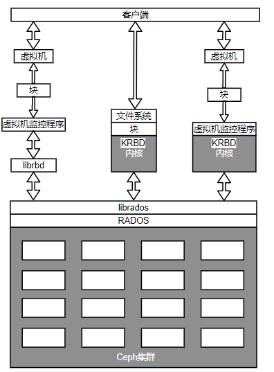
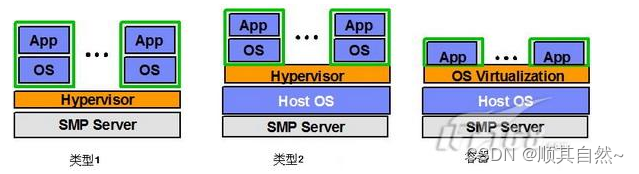
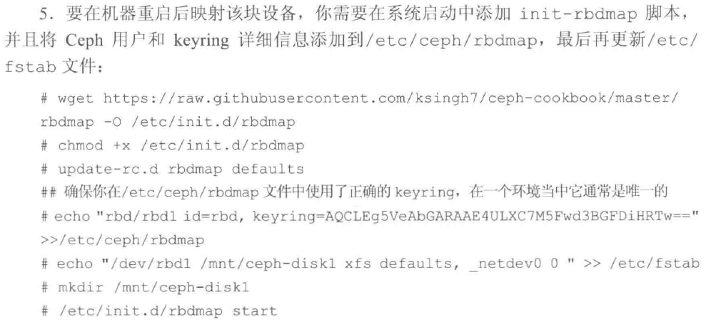
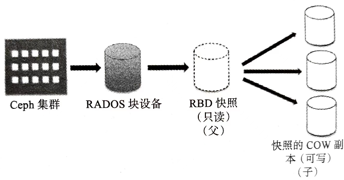
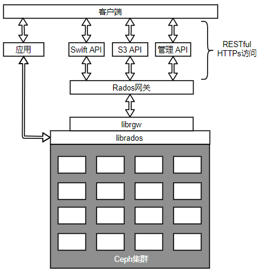
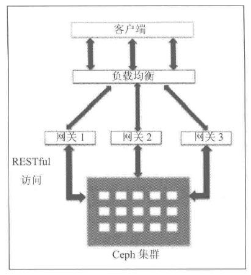
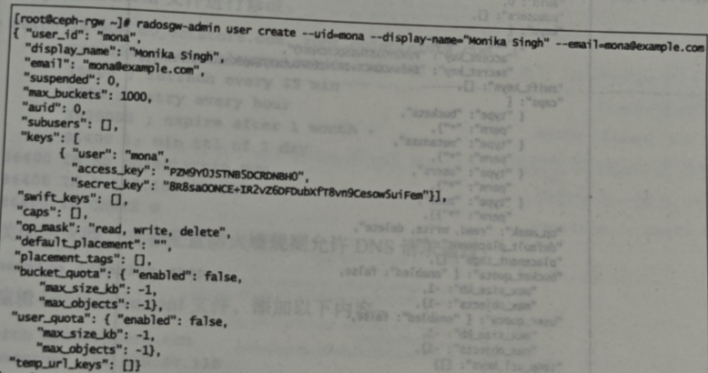
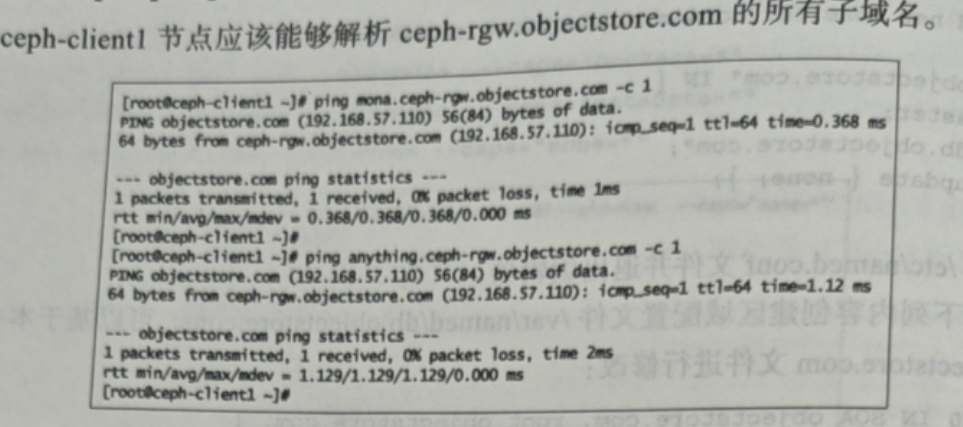

[TOC]

<!--more-->

> 存储配置：将存储分空间或者容量以块、文件或对象的形式分配给物理或虚拟服务器的过程


## 5.1 Ceph块设备

### 5.1.1 介绍

> Ceph块设备也称为RADOS块设备(RBD)，对外提供块存储



- 可以被映射、格式化并可以挂载到服务器
- 也可以当作裸分区或标记为文件系统，然后进行挂载
- 也可以为物理层的虚拟机监控程序以及虚拟机提供块存储解决方案

**读写流程**

当客户端向RBD写数据时，librbd库将数据映射到对象而存储在Ceph集群中，删除这些数据对象并跨集群复制这些对象，从而提供更好的性能和可靠性。

Ceph RBD驱动程序已经被集成到Linux内核中（**内核RBD，KRBD**）

- 完整和增量快照：能够实现基于时间点的还原
- 自动精简配置：只有发生变化的对象才需要存储，节省OpenStack大量的存储空间
- 写时复制和即时克隆
- 动态调整大小
- 内存式缓存

#### 虚拟机监控器完全支持RBD

业内领先的开源hypervisor(虚拟机监控器)，如：KVM、Xen、VMware、HyperV完全支持RBD，并利用它为各自的客户虚拟机提供RBD特性。

hypervisor是一种运行在基础物理服务器和操作系统之间的中间软件层，允许多个操作系统和应用共享硬件



- I型（裸机型）：直接运行在系统硬件上，不需要底层OS

- II型（托管型，宿主型）：运行在传统操作系统上，构建出一整套虚拟硬件平台(CPU、内存、外存、适配器)，底层和上层的操作系统可以完全无关化

  VM中的应用程序调用硬件资源需要经过：VM内核->Hypervisor->主机内核，性能是三种虚拟化技术中最差的

- III型（操作系统虚拟化）：虚拟机运行在传统操作系统上，创建一个独立的虚拟化实例（容器），指向底层操作系统。所有虚拟机共享内核空间，性能最好，耗费资源最少。但是缺点是底层和上层必须使用同一种操作系统

#### Ceph RBD完全支持云平台

Ceph提供的块设备后端能存储OpenStack虚拟机的卷(Cinder)和操作系统镜像(glance)

- Ceph RBD支持的最大镜像为16EB，这些镜像可以作为磁盘映射到物理裸机、虚拟机或其他主机使用

Ceph写时复制和即时克隆能帮助OpenStack在很短时间内部署数百个虚拟机实例

所有机器都可以访问Ceph集群存储从而更好地实现虚拟机迁移

- 虚拟化容器(Xen，KVM)都可以配置从存储在Ceph的卷来启动虚拟机

### 5.1.2 RBD存储配置

#### 创建并配置客户端

##### 系统环境准备

0. 创建虚拟机，启动并安装OS

2. 当成功安装OS后，修改网络配置

   ```shell
   # 修改eth0配置
   vim /etc/sysconfig/network-scripts/ifcfg-eth0
   ONBOOT=yes
   BOOTPROTO=dhcp
   
   # 修改eth1配置
   vim /etc/sysconfig/network-scripts/ifcfg-eth1
   ONBOOT=yes
   BOOTPROTO=dhcp
   IPADDR=
   NETMASK=
   
   # 修改主机配置
   vim /etc/hosts
   192.168.xxx.xxx ceph-nodex
   ...
   本机ip 本机名ceph-client1
   ```

2. 查看Linux内核版本并检查是否支持RBD

   Linux内核从2.5.32版本开始支持Ceph，若要支持本地化访问Ceph块设备和文件系统，使用2.5.34版本以上的Linux内核

   ```shell
   lsb_release -a # 检查OS
   uname -r #内核版本
   modprobe rbd #查看Linux内核版本是否支持RBD
   ```

4. 升级内核版本

   1. 安装ELRepo rpm包

      ```shell
      rpm -Uvh http://www.elrepo.org/elrepo-release-6.el6.elrepo.noarch.rpm
      ```

   2. 安装新内核

      ```shell
      yum --enablerepo=elrepo-kernel install kernel-ml
      ```

   3. 编辑/etc/grub.conf文件，更新 `default=0` ，重启机器

   4. 再次检查是否支持RBD

##### 复制集群配置文件

**将ceph-node1的root公钥复制到客户端ceph-client1**

```shell
root@ceph-node1 $ ssh-copy-id root@ceph-client1
```

**在ceph-node1使用ceph-deploy程序为客户端安装Ceph程序**

```shell
cd /etc/ceph
ceph-deploy --user-name root install client-node1
```

**将Ceph配置文件复制到ceph-client1**

```shell
ceph-node1 $ ceph-deploy --username root config push ceph-client1
```

##### 授权客户端访问集群权限

客户端需要Ceph密钥访问Ceph集群，Ceph集群搭建时，已经创建了一个默认用户 client.admin，它拥有足够的权限去访问Ceph集群。但不应该将client.admin用户共享到Ceph节点和管理主机外的机器上

应该创建有限权限集的用户，并用其密钥环来访问RBD

**创建Ceph用户client.rbd，使其拥有访问rbd存储池的权限**

```shell
root@ceph-node1$ ceph auth get-or-create client.rbd mon 'allow r' osd 'allow class-read object_prefix rbd_children，allow rwx pool=rbd'
```

**为ceph-client1上的client.rbd用户添加密钥**

```shell
root@ceph-node1$ ceph auth get-or-create client.rbd | ssh root@ceph-client1 sudo tee /etc/ceph/ceph.client.rbd.keyring
```

**提供用户名和密钥在ceph-client1上检查Ceph集群状态**

```shell
ssh ceph-client1
sudo su -
cat /etc/ceph/ceph.client.rbdkeyring >> /etc/ceph/keyring
### 由于我们没有用默认用户client.admin，必须提供用户名来连接Ceph集群
ceph -s --name client.rbd
```

#### 创建/删除块设备

登录Ceph集群的任一个monitor节点或具有Ceph集群管理员权限的管理主机或者客户端

创建名为 ceph-client1-rbd1、大小为10240MB的RBD

```shell
集群内节点$ rbd create ceph-client1-rbd1 --size 10240
root@ceph-client1$ rbd create ceph-client1-rbd1 --size 10240 --name client.rbd
```

列出rbd镜像

```shell
集群内节点$ rbd ls
root@ceph-client1$ rbd ls --name client.rbd
root@ceph-client1$ rbd list --name client.rbd

# 默认情况下，rbd镜像保存在Ceph集群的rbd存储池中，参数 `-p` 可指定其他池
## 若不在默认池中，查看rbd时也需要指定池名
root@ceph-client1$ rbd ls -p rbd --name client.rbd
```

检查rbd镜像的具体情况

```shell
集群内节点$ rbd --image ceph-client1-rbd1 info
root@ceph-client1$ rbd --image ceph-client1-rbd1 info --name client.rbd
```

删除rbd镜像

```shell
集群内节点$ rbd rm ceph-client1-rbd1 -p rbd
root@ceph-client1$ rbd rm ceph-client1-rbd1 -p rbd --name client.rbd
```

#### 映射RADOS块设备

在客户端执行

```shell
rbd map --image ceph-client1-rbd1 --name client.rbd #将块设备映射到客户端
rbd map rbd/ceph-client1-rbd1 --name client.rbd #将指定池中的块设备映射到客户端

# 查看本次映射对应的操作系统设备名
rbd map client.rbd
rbd showmapped --name client.rbd
被客户端识别为 /dev/rbdxxxx
```

在客户端映射完成后，就可以当做本地磁盘或块设备使用

```shell
fdisk -l /dev/rbd0
mkfs.xfs /dev/rbd0
mkdir /mnt/ceph-voll # 创建挂载目录
mount /dev/sdb0 /mnt/ceph-voll # 将块设备挂载到指定目录下
df -h /mnt/ceph-voll# 查看占用情况
dd if=/dev/urandom of=/mnt/ceph-voll/test1 bs=1M count=1 status=progress oflag=direct # 向rbd写入测试数据
```



#### 调整RBD大小

Ceph支持自动精简配置的块设备：只有当把数据存入这个块设备，才会真正地使用物理存储空间

**自动精简配置** ：预先配置给应用一个空间额度，根据实际所需要的容量系统自动多次分量地分配给该应用

- 简化操作，提高运维效率
- 按需供给，提高存储空间的整体利用率
- 分期采购，降低TCO成本

```shell
root@ceph-client1$ rbd resize 池名/rbd名 --size 调整后容量/MB

root@ceph-client1$ rbd resize rbd/ceph-client1-rbd1 --size 20480 --name client.rbd

root@ceph-client1$ rbd --image ceph-client1-rbd1 info --name client.rbd

# 检查Ceph RBD镜像新的容量是否被内核接收
root@ceph-client1$ dmesg | grep -i capacity
root@ceph-client1$ xfs_growfs -d /mnt/ceph-voll

root@ceph-client1$ df -h 
```

在客户端机器上，还需要扩展文件系统的容量，以便能够使用新增的存储空间

- XFS支持在线调整容量

#### RBD快照

创建基于时间点的、只读的RBD镜像副本。可以通过创建快照并恢复其原始数据，保存RBD的状态

```shell
#1. 新建测试文件
echo "Hello ceph.Snapshot test" > /mnt/ceph-voll/snaptest-file
ls -l
ll

#2. 创建快照
指令格式：rbd snap create 池名/块名@快照名 --name [Ceph的RBD用户名]
rbd snap create rbd/ceph-client1-rbd1@snap1 --name client.rbd

#3. 列出块设备的快照
rbd snap ls rbd/ceph-client1-rbd1 --name client.rbd

#4. 从文件系统中删除文件
cd /mnt/ceph-voll
rm -f snaptest-file
umount /mnt/ceph-voll #解除挂载，让数据操作落盘

#5. 快照回滚
指令格式：rbd snap rollback 池名/块设备名@快照名
rbd snap rollback rbd/ceph-client1-rbd1@snap1 --name client.rbd
mount /dev/rbd0 /mnt/ceph-voll

#6. 删除快照
指令格式：rbd snap rm 池名/块设备镜像名@快照名 --name [Ceph的RBD用户名]
rbd snap rm rbd/ceph-client1-rbd1@snap1 --name client.rbd
#批量删除快照
指令格式：rbd snap purge 池名/块设备镜像名@快照名 --name [Ceph的RBD用户名]
rbd snap purge rbd/ceph-client1-rbd1@snap1 --name client.rbd
```

#### RBD可写副本（克隆）

##### Ceph快照分层特性

Ceph定义了两种RBD镜像：format-1和format-2

> **只有 format-2 类型的RBD支持快照分层** Ceph集群可以为format-2的RBD镜像创建 写时复制(COW) 副本，允许客户端创建RBD的多个即时副本

- COW可写
- 可以调整容量
- 可以创建新的快照
- 可以创建新的COW

**应用** ：对于云平台(OpenStack,CloudStacl)和虚拟化平台(Qemu,KVM)很有用

这些平台通常以快照的形式保护含有OS/VM镜像的CephRBD镜像，通过不断复制这个快照的COW副本来创建新的虚拟机/实例



每一个复制的镜像都包含父快照的引用，用于读取镜像数据。

当有数据写入COW时，COW会为自己生成新的数据引用

##### 指令

```shell
#1. 创建format-2类型的RBD镜像
rbd create ceph-client1-rbd2 --size 10240 --image-format 2 --name client.rbd

#2. 创建该RBD镜像的快照
rbd snap create rbd/ceph-client1-rbd2@snapshot_for_clone --name client.rbd

#3.将快照置保护(只读)状态
rbd snap protect rbd/ceph-client1-rbd2@snapshot_for_clone --name client.rbd

#4. 复制快照需要的父存储池，RBD镜像、快照名
指令格式：rbd clone 池名/父rbd镜像名@快照名 池名/子rbd镜像名 --name [集群的rbd用户名]
rbd clone rbd/ceph-client1-rbd2@snapshot_for_clone rbd/ceph-client1-rbd3 --name client.rbd

#5. 创建完成后，查看新的镜像信息
rbd --pool rbd --image ceph-client1-rbd3 info --name client.rbd
"parent":rbd/ceph-client1-rbd2@snapshot_for_clone
```

##### 扁平化镜像(解除关系)

扁平化(flatten)镜像可以让RBD镜像不依赖于父镜像

- 父镜像会将数据复制到子镜像中，复制过程与数据量有关

```shell
#1. 子rbd镜像上启动扁平化
rbd flatten rbd/ceph-client1-rbd3 --name client.rbd

rbd --pool rbd --image ceph-client1-rbd3 info --name client.rbd
发现 "parent"属性删除
```

##### 删除保护快照

```shell
#1. 解除快照的保护状态
rbd snap unprotect rbd/ceph-client1-rbd2@snapshot_for_clone --name client.rbd

#2. 删除快照
rbd snap rm rbd/ceph-client1-rbd2@snapshot_for_clone --name client.rbd
```

## 5.2 Ceph文件系统

### 5.2.0 Ceph文件系统

CephFS在RADOS层上提供了一个任意大小且兼容POSIX的文件系统

#### MDS

> Ceph元数据服务器（MDS），使用Ceph MDS作为守护进程，跟踪文件层次结构并存储只供CephFS使用的元数据，并将它和其他数据分开，降低复杂性并提高可靠性

- 只有Ceph文件系统(CephFS)才需要
- MDS只管理元数据，不向客户端提供任何数据，数据通过OSD服务提供，避免系统中的一个单点故障

MDS提供一个带智能缓存层的共享型连续文件系统，大大减少读写操作

一部分MDS只负责一部分元数据，且不存储本地数据

- 如果一个MDS守护进程发生故障，可以在任何可以访问集群的节点上启动他

MDS本质上是动态的，守护进程可以加入、离开，并且快速接管出错的节点

- 一个MDS可配置为主动和被动状态

  主MDS节点为活跃状态，其他的为备用状态

  主MDS故障，则第二个MDS节点负责接管。也可以指定备用节点跟随主MDS节点

##### MDS配置命令

```shell
ceph-deploy mds create [mdsnodeName]#mdsnodeName为运行MDS进程的节点名
# 在当前node1上运行
ceph-deploy mds create node2 #在node2上创建并运行node1的元数据服务器
```

#### 与客户端交互方法


基于libcephfs库实现多种客户端交互

- libcephfs拥有本地Linux内核驱动程序支持，因此客户可以使用mount命令实现本机文件系统的挂载
- 同时也支持CIFS，SMB，NFS
- 客户端可以使用使用Ceph社区提供的ceph-fuse(用户空间文件系统)驱动CephFS
- 允许直接与应用程序交互。使用libcephfs库直接访问RADOS集群
- CephFS可以代替HDFS：Ceph为Hadoop和Hadoop插件提供了必要的CephFS Java接口

CephFS可以实现多个MDS的active-active状态，使他具备高可扩展性、高性能且没有单点故障


### 5.2.1 通过内核驱动程序 挂载CephFS

Linux2.5.34及以上版本本地化支持Ceph

在客户端执行以下命令

```shell
#1. 检查客户端Linux版本
uname -r

#2. 创建挂载点目录
mkdir /mnt/kernal_cephfs

#3. 获取管理员密钥
cat /etc/ceph/ceph.client.admin.keyring
cat /etc/ceph/ceph.client.admin.keyring > /etc/ceph/adminkey

#4. 挂载
指令格式：
mount -t ceph [mon_ip]:[mon_port]:/ 挂载点 -o name=admin,secret=[密钥]
mount -t ceph [mon_ip]:[mon_port]:/ 挂载点 -o name=admin,secretfile=[密钥路径]

mount -t ceph 192.1168.57.101:6789:/ /mnt/kernal_cephfs -o name=admin,secret=
mount -t ceph 192.1168.57.101:6789:/ /mnt/kernal_cephfs -o name=admin,secretfile=/etc/ceph/adminkey

df -h /mnt/kernal_cephfs # 查看文件系统状态

在文件系统表中挂载，以便让机器启动时自动挂载CephFS
#6. 若要在文件系统表中挂载CephFS，需要在客户端的/etc/fstab中添加信息
格式：
mon_ip:monport:/ fsname[name=user,secret=secretkey|secretfile=/pathtosecretfile],{[mount/options]}

vim /etc/fstab
192.1168.57.101:6789:/ /mnt/kernal_cephfs ceph name=admin,secretfile=/etc/ceph/adminkey,noatime 0 2

cat /etc/fstab | grep -i cephfs

#7. 卸载并再次挂载
umount /mnt/kernal_cephfs
mount /mnt/kernal_cephfs
```

### 5.2.2 通过 FUSE 挂载CephFS

若Linux主机内核低于2.5.34版本，可以通过Ceph的 FUSE(用户空间文件系统) 来挂载CephFS

```shell
#1. 安装ceph-fuse
yum install ceph-fuse

需要保证客户端已有集群的配置文件及密钥环
#2. 创建挂载点
mkdir /mnt/cephfs

#3. 挂载
ceph-fuse -m 192.168.57.101:6789 /mnt/cephfs

df -h /mnt/cephfs

#4. 在文件系统中远在CephFS
#Ceph ID	#mountpoint	#Type	#Options
id=admin	/mnt/cephfs	fuse.ceph	default 1 1

#5. 卸载并再次挂载
umount /mnt/cephfs
mount /mnt/cephfs
```

## 5.3 Ceph对象存储

### 5.3.0 Ceph对象网关

对象存储不能被OS当做本地或者远程文件系统访问，只能在应用程序通过API访问

#### RGW特性

> Ceph 对象网关，也即RADOS网关(radosgw)，将HTTP请求转换为RADOS请求，同时也可以把RADOS请求转换为HTTP请求

Ceph对象存储使用Ceph对象网关守护进程(radosgw)和librgw、librados交互，通过RESTful API和HTTP/s对外提供可访问且稳定的多租户对象存储

- RESTful：假设互联网上的资源有固定的url，可以通过不同的动作(GET、PUT、POST、PATCH、DEL)获取或修改资源，服务器响应分为HTTP状态码和数据两部分



RADOS网关利用librgw（RADOS网关库）和librados允许应用程序与Ceph对象存储建立连接。

- 兼容S3(Amazon)接口

- 兼容Swift(OpenStack)接口：提供兼容OpenStack Swift API的接口来访问Ceph存储集群，在OpenStack集群中Ceph对象网关能够代替Swift

  兼容OpenStack的身份Keystone身份验证服务

- Admin API：管理API或者原生API，通过基于HTTP的RESTful接口来管理Ceph集群

- 应用程序可以绕过RADOS网关，librados软件库允许用户的应用程序通过C、C++、Java、Python和PHP直接访问Ceph对象存储

Ceph对象网关拥有自己的用户管理体系：

- S3和Swift API共享Ceph集群内同一个命名空间：可以通过一个API写入数据而通过另一个API获取数据
- 可以使用多个网关，并将它们放在一个负载均衡器下控制对象存储的负载

快速处理策略：

- 支持使用内存缓存元数据
- 支持将大文件分为多个小的RADOS对象的方法提高性能

#### 最佳实践

 在生产环境中，若对象存储上有大量的工作负载，则应该用专用的物理服务器来配置RADOS网关；也可以考虑将所有的mon节点配置为RADOS网关

建议在负载均衡器后运行多个RGW实例



### 5.3.1 基于RADOS网关的对象存储

#### 安装RADOS网关

Ceph对象存储需要Apache和FastCGI，推进安装Ceph社区提供的Apache和FastCGI的100个连续的优化版本

在RADOS网关节点ceph-rgw上执行

**1.修改Apache安装源**

```shell
vim /etc/yum.repos.d/ceph-apache.repo

## replace (distro) with os distribution type, ex centos6 ,rhel6 etc. you can grab this code at publishers website.

[apache2-ceph-noarch]
name=Apache noarch packages for Ceph
baseurl=http://gitbuilder.ceph.com/apache2-rpm-{distro}-x86 64-basic/ref/master

[apache2-ceph-source]
name=Apache source packages for Ceph
baseurl=http://gitbuilder.ceph.com/apache2-rpm-{distro}-x86 64-basic/ref/master
enabled=0
priority=2
gpgcheck=1
type=rpm-md
gpgkey=https://ceph.com/git/p=ceph.git;a=blob plain;f=keys/autobuild.asc
```

**2. 修改fastcgi源**

在/etc/yum.repos.d下新建ceph-fastcgi.repo文件

```shell
vim /etc/yum.repos.d/ceph-fastcgi.repo

## replace (distro) with OS distribution type ,ex centos6 , rhel6etc. you can grab this code at publishers website.

[fastcgi-ceph-basearch]
name=FastCGI basearch packages for Ceph
baseurl=http://gitbuilder.ceph.com/mod_fastcgi-rpm-(distro)-x86_64-basic/ref/master
enabled=1
priority=2
gpgkey=httpe://ceph.com/git/?p=ceph.git;a=blob plain; f=keys/autobuild.asc
gpgcheck=1
type=rpm-md

[fastcgi-ceph-noarch]
name=FastCGI noarch packages for Ceph
baseurl=http://gitbuilder.ceph.com/mod_fastcgi-rpm-{distro)-x86_64-basic/ref/master
enabled=1
type=rpm-md
gpgkey=https://ceph.com/git/?p=ceph.git;a=blob_plain;f=keys/autobuild.asc
priority=2
gpgcheck=1

[fastcgi-ceph-source]
name=FastcGI source packages for Ceph
baseurl=http://gitbuilder.ceph,com/mod fastcgi-rpm-(distro.x86 64-basic/ref/master
enabled=0
priority=2
gpgcheck=1type=rpm-mdgpgkey=https://ceph,com/git/?p=ceph.git;a=blob_plain;f=keys/autobu1ld.asc
```

**3.修改Ceph安装源**

```shell
vim /etc/yum.repos.d/ceph.repo

## you can grab this code at publishers website.
[Ceph]
name=Ceph packages for $basearch
baseurl=http://ceph,com/rpm-firefly/e16/$basearch
enabled=1
gpgcheck=1
type=rpm-md
gpgkey=https://ceph.com/git/?p=ceph.git;a=blob plain;f=keys/release.asc

[Ceph-noarch]
name=Ceph noarch packages
baseurl=http://ceph.com/rpm-firefly/el6/noarch
enabled=1
gpgcheck=1
type=rpm-md
gpgkey=https://ceph.com/git/?p=ceph.git;a=blob_plain;f=keys/release.asc

[ceph-source]
name=Ceph source packages
baseurl=http://ceph.com/rpm-firefly/e16/SRPMS
enabled=1
gpgcheck=1
type=rpm-md
gpgkey=https://ceph.com/git/?p=ceph,git;a=blob_plain;f=keys/release.asc
```

**4. 安装yum-plugin-priorities**

```shell
yum install yum-plugin-priorities
```

**5. 安装apache(httpd)、fastcgi(mod_fastcgi)、ceph-radosgw和ceph包**

```shell
yum install httpd mod_fastcgi ceph-radosgw ceph
```

**6. 为ceph-rgw设置FQDN**

- 编辑/etc/hosts ，按照 rgw_ip_addr FQDN hostname 格式添加

  ```shell
  192.168.57.110 ceph-rgw.objstore.com ceph-rgw
  ```

- 编辑/etc/sysconfig/network ，将HOSTNAME设置为FQDN

  ```shell
  HOSTNAME=ceph-rgw.objstore.com
  ```

- 检查主机名和FQDN

  ```shell
  hostname # rgw-node1
  hostname -f
  ```

#### 配置RADOS网关

- Apache的配置
- FastCGI的配置
- Ceph密钥的生成

**1.Apache的配置**

编辑 /etc/httpd/conf/httpd.conf 文件以配置 Apache:

- 设置 ServerName <FQDN>。

- 确保下面这行存在并且是非注释状态

  ```shell
  $ cat /etc/httpd/conf/httpd.conf | egrep "rgw|rewrite"
  LoadModule rewrite_module modules/mod_rewrite.so
  ServerName ceph-rgw.objstore.com
  ```

**2.配置 FastCGI**

编辑 /etc/httpd/conf.d/fastcgi.conf 文件以配置 FastCGI:

- 确保 FastCGI模块开启

  ```shell
  $ cat /etc/httpd/conf.d/fastcgi.conf | egrep -i "FastCgiWrapperlfastcgi_module"
  LoadModule fastcgi_module_modules/mod fastcgi.so
  FastCgiwrapper off
  ```

  关闭 FastCgiWrapper

**3. 创建Ceph对象网关脚本，修改脚本文件所有权，并增加可执行权限**

```shell
vim /var/www/html/s3gw.fcgi
#!/bin/sh
exec /usr/bin/radosgw -c /etc/ceph/ceph.conf -n client.radosgw.gateway

chmod +x /var/www/html/s3gw.fcgi
chown apache:apache /var/www/html/s3gw.fcgi
```

**4. 配置网关**

在 /etc/httpd/conf.d 目录下创建网关配置文件 rgw.conf，其中包含下列内容。创建文件时使用服务器的 fqdn (hostname -f) 替换 {fqdn}，使用服务器管理员的e-mail 地址替:{email.address}	

```shell
FastCgiExternalServer /var/www/html/s3gw.fcgi -socket /var/run/ceph/ceph.radosgw.gateway.fastcgi.sock
<VirtualHost *:80>
	ServerName {fqdn)
	<!--Remove the comment. Add a server alias with*.{fqdn] for s3 subdomains-->
	<!--ServerAlias *.{fqdn}-->
	ServerAdmin {email.address}
	DocumentRoot /var/www/html
	RewriteEngine On
	RewriteRule ^/(.*) /s3gw.fcgi?%{QUERY STRING}{E=HTTP AUTHORIZATION:%{HTTP:Authorization},L}
	<IfModule mod fastcgi.c>
        <Directory /var/www/html>
            Options +ExecCGI
            AllowOverride All
            SetHandler fastcgi-script
            Order allow,deny
            Allow from allAuthBasicAuthoritative Off
        </Directory>
	</IfModule>
	AllowEncodedslashes On
	ErrorLog /var/log/httpd/error.log
	CustomLog /var/log/httpd/access.log combined
	Serversignature off
</virtualHost># vim /etc/httpd/conf.d/rgw.conf
```

**4. 为Ceph创建RADOS网关用户及密钥环**

在任意一台 Ceph monitor 节点上执行

```shell
#1. 创建密钥环
ceph-authtool --create-keyring /etc/ceph/ceph.client.radosgw.keyring

chmod +r /etc/ceph/ceph.client.radosgw.keyring

#2. 为网关实例生成网关用户及密钥，实例名：gateway
ceph-authtool /etc/ceph/ceph.client.radosgw.keyring -n client.radosgw.gateway --gen-key

#3. 为密钥增加功能:
ceph-authtool -n client.radosgw.gateway --cap osd 'allow rwx' --cap mon 'allow rw' /etc/ceph/ceph.client.radosgw.keyring

#4. 将密钥添加到 Ceph 集中:
ceph -k /etc/ceph/ceph.client.admin.keyring auth add client.radosgw.gateway -i /etc/ceph/ceph.client.radosgw.keyring

#5. 分发密钥到Ceph RADOS网关节点上
scp /etc/ceph/ceph.client.radosgw.keyring ceph-rgw:/etc/ceph/ceph.client.radosgw.keyring

#6. 为RADOS网关创建池
ceph osd pool create .rgw 128 128

#7. 创建RADOS网关数据目录
mkdir -p /var/lib/ceph/radosgw/ceph-radosgw.gateway

#8. 给Ceph集群添加网关配置，添加下列配置到monitor节点的 ceph.conf文件中
[client.radosgw.gateway]
host = ceph-rgw
keyring = /etc/ceph/ceph.client.radosgw.keyring
rgw socket path = /var/run/ceph/ceph.radosgw.gateway.fastcgi.sock
log file = /var/log/ceph/client.radosgw.gateway.log
rgw dns name = ceph-rgw.objstore.com ## This would be usedfor S3 API
rgw print continue = false

#9. 将该文件移到 RADOS 网关节点。确保主机名是 RADOS 网关的主机名，而非 FQDN:
scp /etc/ceph/ceph.conf ceph-rgw:/etc/ceph/ceph.conf
```

**5. 调整 RADOS 网关节点上 /var/log/httpd、var/run/ceph 和 /var/log/ceph 这三个文件的所有权和权限，并设置 SELinux为 Permissive:**

```shell
chown apache:apache /var/log/httpd
chown apache:apache /var/run/ceph
chown apache:apache /var/log/ceph
setenforce 0
```

**6. 启动 Apache 和 Ceph RADOS 网关服务**

```shell
service httpd start
service ceph-radosgw start
```

**7. 检查配置**

使用 curl 对 radosgw的FQDN 执行 Http Get请求

```shell
curl http://ceph-rgw.objstore.com
```

看到以下输出，则说明配置正确

```xml
<?xml version="1.0w encoding="UTF-8"?>
<ListAllMyBucketsResult xmIns="http://s3.amazonaws.com/doc/2006-03-01/7>
<Owner>
    <ID>anonymous</ID>
    <DisplayName></DisplayName>
</0wner>
<Buckets></Buckets>
</ListAllMyBucketsResult>
```

访问 radosgw FQDN `ceph-rgw.objtore.com` 也可以看到同样的配置

#### 创建radosgw用户

若要访问Ceph对象存储，需要为RADOS网关创建用户，这些用户的账户将由访问权限及密钥标识

**1. 确保RADOS网关节点可以访问Ceph集群**

```shell
# 从monitor节点复制Ceph密钥环到RADOS网关节点上
scp ceph.client.admin.keyring ceph-rgw:/etc/ceph

# 执行ceph集群命令确认集群可达
ceph -s
```

**2. 创建RADOS网关用户**

产生该用户的access_key和secret_key，用于访问Ceph对象存储

```shell
radosgw-admin user create --uid=mona --display-name="MonikaSingh" --email=mona@example.com
```



### 5.3.2 S3兼容的对象存储

Amazon的简单存储服务S3通过Web接口(RESTful API)为用户提供存储服务

S3客户端可以通过access和密钥来访问Ceph 对象存储

#### 为RADOS网关添加处理S3请求能力

```shell
radosgw-admin caps add --uid=mona --caps="users=*"
radosgw-admin caps add --uid=mona --caps="bucketg=*"
radosgw-admin caps add --uid=mona --caps="metadata=*"
radosgw-admin caps add --uid=mona --caps="zone=*"
```

#### 为RGW网关添加DNS服务

约定形式：`<bucket name>.<RGW_FQDN>`

- 如：bucket 名为 jupiter ，访问方式为 `HTTP URL http://jupiter.ceph-rgw.objstore.com `

**1. 在ceph-rgw节点安装bind包**

```shell
yum install bind* -y
```

**2. 修改 /etc/named.conf中的IP、IP范围、区域(zone)**

```
listen-on port 53 {127,0.0.1;192.168.57.110;}; ###
Add
DNS IP ###
allow-query {localhost;192.168.57.0/24;}; ###

Add
IP Range ###
### Add new zone for domain objectstore.com before EOF
###
zone "objstore.com"IN{
	type master;
	file "db.objstore.com";
	allow-update{ none;};
}
```

保存 /etc/named.conf文件并退出编辑器

**3. 创建区域配置文件 /var/named/db.objstore.com**

```
@ 86400 IN SOA objstore.com. root.objstore.com. (
	20091028 ;serial yyyy-mm-dd
	10800 ;refresh every 15 min
	3600 ;retry every hour
	3600000 ;expire after 1 month +
	86400 );min ttl of l day
@ 86400 IN NS objstore.com.
@ 86400 IN A 192.168.57.110
* 86400 IN CNAME @
```

**4. 关闭防火墙，或允许DNS通过**

```shell
service iptables stop
```

**5. 编辑 /etc/resolve.conf文件，添加以下内容:**

 ```shell
 search objstore.com
 nameserver 192.168.57.110
 ```

**6. 启动named服务**

```shell
service named start
```

**7. 测试 DNS 配置文件的语法是否有问题**

```shell
named-checkconf /etc/named.conf
named-checkzone objstore.com /var/named/db.objstore.com
```

**8. 测试DNS服务器**

```shell
dig ceph-rgw.objstore.com
nslookup ceph-rgw.objectstore.com
```

#### 配置S3客户端

**1. 给 ceph-client1 增加相同的 DNS 设置，它将是这里的 S3 客户端机器。**

编辑 cephclient1 节点上的 /etc/resolve.conf文件，添加以下内容:

```shell
search objstore.com
nameserver 192.168.57.110
```

测试 ceph-client1 上的 DNS 设置:

```shell
dig ceph-rgw.objstore.com
nslookup ceph-rgw.objectstore.com
```



**2. 配置S3客户端**

安装s3cmd

```shell
yum install s3cmd
```

配置 s3cmd将需要用户的 access key 和 secret key()

```shell
s3cmd --configure
```

s3cmd 配置命令将会在 /root 目录下创建s3cfg 文件。在该文件中配置 RADOS 网关的详细信息。

将 host_base 和 host_bucket  改为如下代码片段所示的值。确保这两行尾部没带空格：

```
host_base = ceph-rgw.objstore.com
host_bucket = %(bucket)s.ceph-rgw.objstore.com
```

**3. 创建S3 bucket并向其中存放对象**

```shell
s3cmd ls
s3cmd mb s3://first-bucket
s3cmd put /etc/hosts s3://first-bucket
```

### 5.3.3 Swift API兼容的对象存储

#### 在RADOS 网关上创建Swift用户

登录 ceph-rgw 并创建一个子用户用于 Swift 访问。该子用户会拥有自己的密钥:

```shell
radosgw-admin subuser create --uid=mona --subuser=mona:swift --access=full --secret=secretkey --key-type=swift
```

#### 在客户端节点安装Swift客户端

```shell
yum install python-setuptools
easy_install pip
pip install --upgrade setuptools
pip install python-swiftclient
```

#### 使用Swift客户端创建并查看bucket

```shell
swift -V 1.0 -A http://ceph-rgw.objectstore.com/auth -U mona:swift -K secretkey post example-bucket

swift -V 1.0 -A http://ceph-rgw.objectstore.com/auth -U mona:swift -K secretkey list
```

