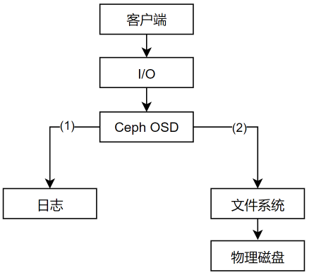
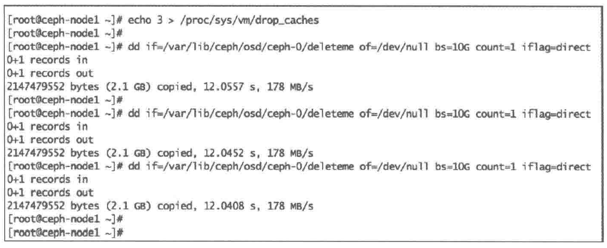
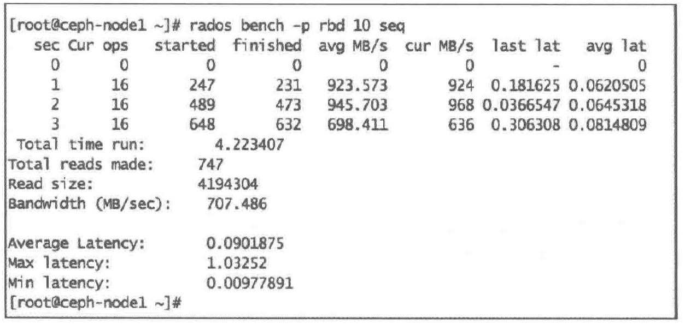

[TOC]

<!--more-->

## 6.1 Ceph性能

同一时间段内大量客户端向应用程序发起请求时，需要一个性能更好的后端存储系统

当数据请求到达Ceph时，Ceph会将请求其分散到多个节点和OSD，实际提供的性能是多个节点的叠加

当为Ceph添加新的OSD节点时，整个存储集群的性能会线性增加，因为有了更多能够分担负载的OSD

## 6.2 性能调优

软硬件选型

Ceph组件的性能调优

操作系统调优

- 客户端调优

### 6.2.0 性能指标


不同企业有着不同的存储工作负载，需要在性能、容量和TCO（total cost of ownership）还能在同一集群中，针对不同工作负载，提供不同类型的存储池


#### IOPS优化

这种配型在于每个IO的低总体拥有成本（Total Cost of Ownership，TCO）下拥有高的IOPS。

通常使用更快的SSD硬盘，PCIe SSD、NVMe等数据存储的高性能结点

通常用于块存储，也可用于其他场景

SSD低成本？？？

#### 吞吐量优化

高吞吐量和每吞吐量的低成本。

使用SSD和PCIe SSD做OSD日志盘，以及一个高带宽、物理隔离的双重网络

通常用于块存储，高性能的对象存储和文件存储

#### 容量优化

每TB存储的低成本，单元机架物理空间的低成本

使用机械硬盘的密集服务器（36-72），每个服务器有4-6T物理硬件空间

用于低功耗、大容量的对象存储和文件存储——纠删码技术

### 6.2.1 选型

当涉及硬件时，底层硬件决定系统的上限。

Ceph的优点之一是支持异构硬件，Ceph集群可以运行在来自多个厂商的硬件上，不存在因为硬件问题被厂商锁定的情况。在创建Ceph的底层基础设施时，客户可以根据预算及性能需求自行使用任何硬件，对于硬件的选用拥有完全的自主权和决策权。

#### CPU

Ceph的一些组件不是CPU依赖型

**monitor守护进程** 对CPU是轻量依赖的，只负责保持集群的状态而不给用户提供任何数据

- 不参与数据存储，不频繁利用内存，占用资源较少
- 单核CPU就可以完成，需要确保monitor有足够的内存、网络与磁盘空间
- 对于小集群，monitor可以与其他组件放在一起

**OSD进程** 需要大量的CPU资源（直接提供数据给客户端），需要进行一些数据处理

- 建议双核CPU。若以纠删码的方式使用OSD，则需要四核处理器（纠删码需要大量计算）

- 当集群处于recovery状态时，OSD守护进程对处理器的占用很大
  $$
  \frac{CPU线程数\times CPU每线程占核数\times CPU时钟频率(GHz)}{OSD数}\ge 1
  $$

**MDS守护进程** 是CPU密集型。需要动态地分配负载

- 建议四核CPU

#### 内存

> 当集群处于recovery状态时，内存消耗会明显增加

monitor和元数据守护进程需要快速对外响应，必须有足够的内存处理

- 从性能角度，为每个monitor和元数据守护进程必须大于2GB

OSD不是内存密集型

- 一般的工作负载情况下，每个OSD守护进程分配1GB内存就足够了

- 从性能角度，若OSD进程使用一整块磁盘，分配2GB。

  若OSD使用多个磁盘，内存需求需要同步增加

#### 网络

**规模角度**

对于百TB级别的中等规模集群而言，1Gbit/s的网络也能正常工作

当集群规模较大，需要为多个客户端提供服务，则应有10G以上的带宽

**性能角度**

当系统处于recovery状态，需要 10Gbit/s 或更多双端口网络

集群网络和客户端网络应该接在物理上隔离的交换机上

- 公共网络（客户端网络）允许客户端与Ceph集群通信并访问集群中存储的数据
- 内部网络（集群网络）负责集群内诸如复制、恢复、再平衡和心跳检查等需要高带宽的操作


**网络选型**

以太网、InfiniBand网络、10G网络或更高带宽的网络

#### 磁盘

磁盘的选择需要综合考虑工作负载和性能需求，决定了集群的整体性能和总成本。副本数也需要在可靠性、性能和TCO间做出平衡

##### OSD日志

Ceph OSD包括两部分：日志部分与数据部分，即OSD的性能受日志和数据分区共同影响

Ceph在数据提交到备用存储之前，首先将数据写入日志（journal）的独立存储区域，日志可以使用相同的机械磁盘或不同的SSD磁盘或分区上的一小块缓冲区大小的分区，甚至可以用一个文件。



Ceph使用日志来保障速度和一致性。默认情况下，每隔5s日志会向备用存储中刷新数据

##### 日志分区

日志允许OSD处理小文件写，随机写，为文件系统提供了充足时间将写操作合并到磁盘，能够很好地处理工作负载的峰值，减少访问时间和读取延迟实现吞吐量的提升

日志读写速度的提升显然会让系统整体的读写速度提升，将日志创建在SSD上，所有客户端的写操作都是写入SSD型日志中，然后再写入机械硬盘

**最佳实践**：

常见的日志大小为10GB，分区越大越好

在物理SSD磁盘上创建的每个逻辑分区都可以作为日志分区映射到OSD数据分区

- 每个SSD磁盘最多给4-5个OSD做日志，否则会称为集群的性能瓶颈。

  SATA/SAS SSD，则4个OSD数据硬盘共享一个SSD

  PCIe/NVMe，则12-18个数据硬盘共享一个SSD

**缺点** ：若将多个采用ext4或者XFS文件系统的日志挂载在同一磁盘上，会存在单点故障的风险，与这个SSD相关的OSD都会出错

- Btrfs是一个写时复制文件系统（将对象写入日志时，可以同时将该对象写入数据分区），支持回滚。若一个块的内容发生了变化，而针对这个块的写时独立进行的，因此能够保留旧的块

- 可以为日志增加RAID 1，但增加了存储成本

##### 数据分区

**硬盘故障率**

数百个旋转式HD近距离安装时，其叠加的旋转振动会增加桌面级HDD的硬盘故障率

企业级HDD对震动做了特别处理，其平均无故障时间（MTBF）远少于桌面级HDD

**数据盘接口**

NL-SAS HDD有双重12GB/s端口，比单个端口的6GB/s的SATA性能更高，双重SAS端口提供了冗余，允许并行读写

SAS比SATA的不可恢复的读错误（URE）更低，URE越低，清理过程中发现的错误以及PG修复操作越少

**OSD节点密度**

OSD节点密度影响集群性能、容量和TCO

大量小容量节点比少量大容量节点好，

尽量使单个节点容量小于集群总容量的10%

#### OSD文件系统

Ceph OSD守护进程运行在文件系统的上层，文件系统的稳定性和性能很大程度上依赖于底层文件系统的稳定性和性能。

此外，文件系统也提供了OSD使用的 **扩展属性**（XATTR）来扩展其内部状态和元数据的形式，使用 `xattr_name` 和 `xattr_value` 来存储对象的额外信息（内部对象的状态、快照、元数据和ACL等信息）

btrfs有更大的xattr元数据，以文件形式存储

xfs具有相对大的上限64KB

ext4上限太小，不能被使用

- 若使用ext4文件系统，需要在ceph.conf的[OSD]段添加 `filestore xattr use omap = true`

##### XFS

推荐在生产环境Ceph集群中使用

- XFS是一种日志文件系统：客户端每次写入数据时，首先需要写入日志空间，再写入XFS文件系统，相当于两次写入操作，写入性能上不如Btrfs
- XFS在元数据扩展性上存在性能问题

##### Btrfs

使用Btrfs文件系统的OSD能提供最佳性能

- 并行地写日志和OSD数据
- 支持写时复制和可写快照：对于虚拟机的部署和克隆十分有用
- 支持透明的压缩、普遍的校验和多设备的统一管理
- 支持对小文件的合并
- 集成卷管理
- 支持在线fsck的特性

不具备用于生产系统的条件

##### ext4

ext4也是一种日志文件系统

ext4限制了XTTRA的存储容量使其不具备提供足够的XATTR信息的能力，而Btrfs和XFS在 XTTRA存储容量上的限额就比较大

### 6.2.2 软件

**任何系统的性能都是依赖负载和性能测试来量化的**。性能调优就是要解决在性能测试过程中发现瓶颈的过程

**合理的调优流程** ：从最小组件逐步向客户端调查

将性能调优参数写入一个Ceph集群的配置文件便于让Ceph守护进程每次启动时都能读取到

针对具体环境中的Ceph集群进行调优可能不会在其他环境中起作用

#### 集群配置文件

大部分作用域整个集群范围的配置都是在Ceph集群配置文件/etc/ceph/ceph.conf中定义的。


**全局段**

定义在 `[global]` 后的段，在这个段设置会影响Ceph集群的所有守护进程，如客户端网络：

```shell
 public network = 192.168.0.0/24
```

**mon段**

在 `[mon]` 段设置的参数只会影响Ceph集群内所有的mon守护进程，且会覆盖掉 `[global]` 段相同的参数

同时，也可使用 `[mon.MON_ID]` 来为每个mon指定配置

```shell
mon initial members = ceph-mon1
```

**OSD段**

在 `[OSD]` 段设置的参数只会影响Ceph集群内所有的OSD守护进程，且会覆盖掉 `[global]` 段相同的参数

同时，也可使用 `[osd.OSD_ID]` 来为单个OSD指定配置

```shell
osd mkfs type = xfs
```

**MDS段**

在 `[MDS]` 段设置的参数只会影响Ceph集群内所有的OSD守护进程，且会覆盖掉 `[global]` 段相同的参数

同时，也可使用 `[mds.MDS_ID]` 来为单个MDS指定配置

```shell
mds cache size = 250000
```

**client段**

在 `[client]` 段设置的参数只会影响Ceph集群内所有的OSD守护进程，且会覆盖掉 `[global]` 段相同的参数

同时，也可使用 `[client.client_name]` 来为单个client指定配置

```shell
rbd cache = true
```

#### 全局调优参数

**网络**

```
public network = {public network / netmask} #公共网络/客户端网络

cluster network = {cluster network / netmask} #集群网络/内部网络
```

**最大文件打开数**

在操作系统层面设置最大文件打开描述符，避免OSD进程出现文件描述符不足的情况

默认为0，最多设置64位的整数

```shell
max open files = 1111
```

**pg、pgp数确定**

```
osd pool default pg num = 128
osd pool default pgp num = 128
```

**处于degraded状态的副本数**

Ceph向客户端发送确认写操作前，存储池中object的最小副本数（必须<pg-num、pgp-num）。即使集群处于degraded状态。

若副本数小于参数值，则不会确认写操作给客户端

```
osd pool default min size=1
```

**默认rule ID**

创建存储池时，缺省则使用CRUSH ruleset

```
osd pool default crush rule = 0
```

**disbale in-Memory logs**

每个Ceph子系统都有自己的输出日志级，并记录在内存中

通过debug logging设置一个log文件等级和内存等级（1-20，轻量级-重量级）

格式：`debug<subsystem> = <log-level>/<memory>`

若内存级别日志影响了性能和内存消耗。可以尝试关闭该功能，要禁用 `in-memory logging` 添加参数

```
debug lockdep=0/0
debug context = 0/0
debug crush=0/0
debug buffer=0/0
debug timer=0/0
debug_filer=0/0
debug objecter=0/0
debug_rados=0/0
debug rbd=0/0
debug_journaler=0/0
debug_objectcatcher =0/0
debug_client=0/0
debug osd=0/0
debug_optracker= 0/0
debug_objclass=0/0
debug_filestore= 0/0
debug_journal=0/0
debug ms=0/0
debug_monc=0/0
debug_tp=0/0
debug auth=0/0
debug_finisher=0/0
debug heartbeatmap = 0/0
debug_perfcounter = 0/0
debug_asok=0/0
debug throttle=0/0
debug mon=0/0
debug_paxos=0/0
debug_rgw=0/0
```

#### mon调优

**指定OSD进程多少秒未响应后标记为down或out状态**

当OSD节点崩溃、自行重启或者短时间的网络故障时，会用到此参数

即不想让集群在问题出现时就立刻启动数据平衡操作，尝试等待

```
mon_osd_down_out_interval
```

**避免Ceph存储池以外删除**

```
mon_allow_pool_delete = false
```

**OSD down上报次数**

如果Ceph OSD守护进程监控的OSD down了，它就会向 MON 报告

缺省值为 1，表示仅报告一次。

```
mon_osd_min_down_reporters = 3 
```

#### OSD调优参数

##### 常用设置

**OSD map的缓存大小，MB**

```
osd_map_cache_size = <numeric>
```

**内存中允许的OSD map缓存大小，以MB为单位**

```
osd_map_cache_bl_size = <numeric>
```

**创建xfs文件系统**

创建OSD的时候，Ceph 将使用这些 xfs 选项来创建OSD的文件系统

```
osd_mkfs_options_xfs ="-f -i size=2048"
```

**挂载xfs文件系统**

设置挂载文件系统到OSD的选项。

```
osd_mount_options_xfs = "rw,noatime,inode64,logbufs=8logbsize=256k,delaylog,allocsize=4M"
```

**OSD单次写大小，MB**

```
osd_max_write_size = 256
```

**内存允许的最大客户端数据大小，B**

```
osd_client_message_size_cap=1073741824
```

**删除OSD map中的重复项**

```
osd_map_dedup = true
```

**设置服务于OSD进程操作的线程数**

默认0

越大，处理速率越快

```
osd_op_threads=16
```

**执行清理、快照等磁盘密集型操作的磁盘线程数**

```
osd_disk_threads = 1
```

**修改磁盘线程的IO调度类型，只工作在Linux内核CFQ调度器上**

```
osd_disk_thread_ioprio_class=idle
```

- idle：（闲时调用）磁盘线程的优先级比OSD的其他线程低。加快处理客户端请求，放缓OSD上的清理(scrubbing)
- be：（尽力，best effort）磁盘线程与OSD其他线程有相同优先级
- rt：（实时,real time）磁盘线程的优先级比OSD其他线程高。加快 OSD上的清理(scrubbing)，放缓处理客户端请求

**修改磁盘线程的IO调度优先级（0-7，最高-最低）**

与 `osd_disk_thread_ioprio_class`  配合使用

若主机的所有OSD都处于idle，都在竞争IO，这个参数可以用来将一个OSD的磁盘线程优先级降为7，让另一个优先级为0的OSD更快清理

```
osd_disk_thread_ioprio_priority=0
```

##### 日志设置

**日志大小**

设置日志分区大小，至少是预期磁盘速度和filestore最大同步时间间隔的两倍。

若用了SSD日志，最好创建大于10GB的日志，并调大filestore的最小、最大同步时间间隔

- `filestore_min_sync_interval`

```
osd_journal_size=20480
```

**单次写日志的最大比特数/条目数**

```
#单次写日志的最大比特数
journal_max_write_byte = <numeric>

#单次写日志的最大条目数
journal_max_write_entries = <numeric>
```

**日志队列允许的最大op数**

```
journal_queue_max_ops = <numeric>
```

**日志队列允许的最大btyes**

```
journal_queue_max_bytes = <numeric>
```

**启用direct i/o到日志**

```
journal_dio = true
```

**启用libaio异步写日志**

```
journal_aio=true
```

**日志块写操作对齐**

```
# 需要配置dio和aio
journal_block_align = true
```

##### filestore设置

**libaio异步写日志**

```
filestore_merge_threshold = 40
```

**子目录在分裂成二级目录前的最大文件数**

```
filestore_split_multiple = <numeric>
```

**并行执行的文件系统操作线程个数**

```
filestore_op_threads = 32
```

**etx4文件系统使用的XATTRS**

```
filestore_xattr_use_omap= true
```

**设置日志同步数据的提交点**

从日志中同步数据到数据盘，然后清理日志。filestore需要停止写操作来执行 syncfs() 。

更加频繁地同步操作，可以减少存储在日志中的数据量

配置一个越小的同步值，越有利于文件系统合并小量的写，提升性能

```
filestore_min_sync_interval=10
filestore_max_sync_interval=15
```

**filestore队列能接收的最大op数**

超过filestore设置的最大op数，会阻塞新的op加入filestore队列

```
filestore_queue_max_ops =2500
```

**filestore一个op的最大比特数**

```
filestore_queue_max_bytes=10485760
```

**filestore能提交的op的最大个数**

```
filestore_queue_committing_max_ops = 5000
```

**filestore能提交的op的最大比特数**

```
filestore_queue_committing_max_bytes=10485760000
```

##### recovery设置

若Ceph集群健康状态不正常，OSD处于数据恢复状态则性能会降低。

若在recovery期间，仍期望得到更好的性能，可以降低数据恢复的优先级，使数据恢复占用OSD的资源更少

**每个OSD上同时进行恢复操作的最大PG数**

```
osd_recovery_max_active=3
```

**OSD在某个时刻启动恢复操作的PG数**

与 `osd_recovery_max_active` 共同使用

```
osd_recovery_max_single_start= 1
```

OSD 在某个时刻会为一个PG启动一个恢复操作，而且最多可以有三个恢复操作同时处于活动状态

**OSD恢复操作的优先级**

配置恢复操作的优先级。值越小，恢复优先级越高

```
osd_recovery_op_priority = 50
```

**数据恢复块的最大值,B**

```
osd_recovery_max_chunk = 1048576
```

**恢复数据所需的线程数**

```
recovery_threads =1
```

##### backfilling设置

允许设置backfill操作的优先级比请求读写更低

**允许进/出单个OSD的最大backfill数**

```
osd_max_backfills = 2
```

**每个backfill扫描的最小object数**

```
osd_backfill_scan_min=8
```

**每个backfill扫描的最大object 数**

```
osd_backfi11_osd_backfill_scan_max=64
```

##### scrubbing设置

OSD scrubbing对维护数据完整性非常重要，但会降低OSD性能

**单个OSD进程最大的并行scrub数**

```
osd_max_scrubs = 1
```

**两个连续scrub之间的睡眠时间，s**

```
osd_scrub_sleep = 1
```

**单个OSD执行scrub的最小/最大数据块数**

```
osd_scrub_chunk_min = 1
osd_scrub_chunk_max = 5
```

**深层scrub时读大小，B**

```
osd_deep_scrub_stride = 1048576
```

**scrub的最早/最晚开始时间**

用于定义执行scrub的时间窗口

```
osd_scrub_begin_hour = 19
osd_scrub_end_hour = 7
```

#### 客户端调优参数

用户空间实现的块设备不能很好利用Linux页面缓存，因此Ceph引入了新的内存缓存机制，称为RBD缓存

默认情况下，Ceph没有启用RBD缓存

若要启用RBD缓存，在ceph.conf中的 `[client]` 段添加内容

**启用RBD缓存**

```
rbd_cache = true
```

**一开始使用写直达模式(write-through)，第一次flush请求被接收后切换到写回式(write-back)**

```
rbd_cache_writethrough_until_flush = true
```

**rbd缓存大小，B**

```
rbd_cache_size = 67108864
```

**缓存开始写数据到后端存储前，脏数据大小的目标值，B**

```
rbd_cache_target_dirty = 33554432 #32M
```

**缓存触发writeback的字节上限数,B**

```
rbd_cache_max_dirty = <numeric>
```

- 若设置为0，则Ceph使用的缓存模式是写直达
- 若不设置该属性，则默认写回模式

**writeback开始前， 脏数据在缓存中存在的秒数**

```
rbd_cache_max_dirty_age = <numeric>
```

**rbd的默认创建类型**

```
rbd_default_format = 2
```

**在rbd上执行的并发管理操作数**

```
rbd_concurrent_management_ops=10
```

#### 通用调优参数

##### kernel pid max

Linux内核参数，控制线程和进程ID的最大数据

大多数Linux内核对于 `kernel pid max` 预设的值会很小。在拥有多个OSD的Ceph结点上需要为该参数设置更高的值

- 若 $OSD > 20$ ，在恢复和再平衡过程中会生成很多进程和线程用于快速的数据恢复和再平衡

```shell
echo xxxx > /proc/sys/kernel/pid_max
```

##### jumbo frames

MTU的以太网帧载荷超过1500字节的称为jumbo贴（巨帧）。

在Ceph集群节点的网络接口上使用jumbo贴可以提供更好的网络吞吐量

jumbo贴在操作系统级配置，且网络接口即后端网络交换机必须支持jumbo贴才行

首先应该配置交换机这一端的接口，然后再在操作系统层面上配置

```shell
# 从操作系统层面，要在eth0接口上启用jumbo贴
ifconf eth0 mtu 9000

#为了永久改变，也应该更新网络接口配置文件 /etc/sysconfig/network-script/ifcfg-eth0为MTU=9000
```

##### disk read_ahead

通过预读取数据并将其加载到RAM中加快磁盘的读操作

通过在使用RBD的Ceph客户端上给 `read_ahead` 设置一个相对较高的值有利于客户端执行顺序读操作

```shell
cat /sys/block/vda/queue/read_ahead_kb #查看当前read_ahead值
echo "8192" > /sys/block/vda/queue/read_ahead_kb # 修改
```

##### virtual memory（虚拟内存）

虚存以IO为中心，内存交换的使用会导致整个服务器性能降低。为高IO工作负载配置低swappiness值

```
echo "vm.swappiness=0" >> /etc/sysctl1.conf
```

##### 为系统保留的内存空间最小值，KB

配置整个系统保留内存未1%到3%

```
echo262144 > /proc/sys/vm/min free kbytes
```

##### IO调度器

```shell
#检查磁盘默认使用的调度器
cat /sys/block/sda/queue/scheduler 

# 修改磁盘sda默认的I/O调度器为 deadline
echo deadline > /sys/block/sda/queue/scheduler
```

**deadline** ：

好处是每个调度器使用单独的 IO 队列，因此与写相比，更利于读。这个调度器适用于大多数使用场景，尤其是读操作多于写操作的情况。

已经在队列中的I/O请求被分类到读和写批次，然后以 LBA 升序被调度执行

默认情况下，读批次的优先级高于写批次，因为应用程序更容易阻塞在读I/O上

对于有时限要求的Ceph OSD负载来说，这种IO调度器看起来更加可信

**CFQ(completely fair queuing)**

完全公平队列调度器。只适用于SATA磁盘。CFQ调度器将进程划分为三大类

- real time：实时的
- bets effort：尽力而为的。进程默认类型
- idle：闲时调用的

**Noop**

FIFO调度器，通过 last-hit（最后命中）缓存，请求在通用块层中被合并。

对于使用快速存储的计算密集型系统来说，最好的调度器

- 对于SSD ，NOOP I/O调度器可以减少延迟，增加吞吐量，消除CPU花费在重新排序IO请求上的时间

##### IO调度队列

IO Scheduler queue（调度队列）缺省的IO调度队列大小为128

调度队列对IO进行排序，并通过对顺序IO进行优化减少寻道到时间

修改调度队列深度，可以增加磁盘执行顺序IO的比例，提高整体吞吐量

```shell
# 检查设备的调度器深度
cat /sys/block/sda/queue/nr——requests

# 修改设备调度器深度
echo1024 > /sys/block/sda/queue/nr_requests
```

## 6.3 纠删码

保障数据可靠性最流行的方法之一就是复制。复制方法通过将多份相同的数据存储在不同的物理位置保证数据的可靠性

就性能和可靠性而言，复制方法也被证明是一种很好的方法，但增加了系统的整体成本

- 采用复制的方法，需要两倍的存储空间来提供冗余

**纠删码** ：将存储对象分割为数据块的片段，再对这些数据块进行扩展并编码生成校验块，最后将生成的校验块存储在Ceph集群的不同故障域中，实现数据保护

纠删码从Ceph的F版开始引入

### 6.3.1 纠删码原理

$$
n=k+m
$$

- k：将原始数据分割后的数据片段数目
- m：为了提供数据保护而在原始数据块中额外引入的编码，也就是校验块
- n：纠删码运行后生成的数据块总数

启用了纠删码的Ceph池中的每个对象都将存为 $k+m$ 个块，每个块都存储在acting集合的不同OSD中

**恢复** ：在Ceph恢复期间，需要n个块中的任意k个块来恢复数据

**可靠性级别** ：使用纠删码，可以容忍 m 个块的数据丢失

**编码率** ：$r=\frac{k}{n}$ 

**存储需求** ：通过 $\frac{1}{r}$ 计算

---

如：使用纠删码 (3,2) 规则创建5个OSD的Ceph池

则每个对象除了自己本身分割为三个数据块外，还需要额外添加两个校验块，这5个数据块分别存储在Ceph集群的纠删码池的5个OSD中。一旦发生故障，构建原始文件时，只需要3个块就可以恢复

此时 $编码率r=\frac{k}{n}=\frac{3}{5}<1$ ，$存储需求=\frac{1}{r}=\frac{5}{3}\approx 1.6倍原文件$

即允许两个以内的OSD出错，

若以副本形式保证部集群的可靠性。允许两个以内的OSD出错，则需要一个复制级别为3的池，最终需要3GB的存储空间来存储1GB的数据

---

#### 纠删码分析

**慢** ：基于纠删码机制存储数据的速度比复制方法慢

纠删码对于存储成本的节省是以性能损耗为代价的，因为纠删码工作过程中会把每个对象分为多个较小的数据块，并且一些新的校验块会与数据块混合在一起。这些块还需要分布在不同的故障域中。

整个过程需要消耗OSD大量的算力，且在恢复时，解码数据块也需要大量的计算

### 6.3.2 低成本冷存储

纠删码的好处就是冷存储，适合对于读写操作不频繁的数据

通常情况下，适合低成本冷存储的数据会与复制池绑定在一起，数据先存储在速度更快的复制池中，等一定周期内无法访问，则被写回到低成本的纠删码池中

### 6.3.3 纠删码插件

使用不同的插件可以创建不同的纠删码profile

**Jerasure**

通用和灵活，Ceph存储池默认的插件，封装了Jerasure库。


使用Jerasure插件，当一个OSD丢失的话，恢复数据需要从所有其他OSD上读取数据。举例来说，如果Jerasure配置为k=3，m=2，丢失一个OSD需要读取所有5个OSD才能修复，这对数据恢复过程而言并不高效。

**LRC**

本地可修复的纠删码插件，Locally repairable erasure code plugin

由于Jerasure不能有效地做数据恢复，LRC采用本地校验的方法改进，LRC为单个OSD故障做了优化

创建本地校验块，可以从更少的OSD上恢复数据


K=8，m=4，l=4

将原始数据分为8个块，生成4个校验块，每个本地校验块L通常用于4个数据块的校验

当数据丢失时，只需要l个数据恢复

- 假设K3丢失，用 K1 、K2、K4和L1中恢复数据

**SHEC**

瓦式纠删码，Shingled erasure code plugin

对于多个OSD故障，LRC存在开销

- 对于K3,K4同时丢失，需要从K1、K2、L1、M1中恢复

SHEC目的是有效处理多个磁盘故障，本地校验块校验彼此重叠部分


若K6和K9丢失，则使用M3，M4，K5，K7，K8，K10作为校验块

### 6.3.4 创建纠删码池

创建 erasure 类型的Ceph池实现纠删码池

基于纠删码配置文件创建，这个配置文件定义了纠删码的特征值

#### 创建纠删码配置文件

```shell
指令格式：ceph osd erasure-code-profile set [纠删码配置文件名] ruleset-failure-domain=osd k=3 m=2

ceph osd erasure-code-profile set EC-profile ruleset-failure-domain=osd k=3 m=2

#列出纠删码配置文件
ceph osd erasure-code-profile ls

# 查看纠删码配置文件内容
ceph osd erasure-code-profile get EC-profile
```

#### 基于纠删码配置文件新建纠删码池

```shell
ceph osd pool create [池名] 16 16 erasure [配置文件名]

ceph osd pool create EC-pool 16 16 erasure EC-profile

ceph osd dump | grep -i EC-pool
```

池的大小为 $5(k+m)$ ，即纠删码池 erasure 会被写入到5个不同的OSD中

#### 生成数据并放入

```shell
echo "Hello Ceph" > file1.txt
rados put -p EC-pool object1 file1.txt

# 检查EC池中object1的OSD map
ceph osd map EC-pool object1
```

停止某个OSD，则该查看object1的map时，该OSD的位置被随机数代替，表示该OSD在这个池中不可用

```shell
ssh ceph-node2  service ceph stop osd.5
ceph osd map EC-pool object1
```

继续停止某个OSD，发现只剩的三个块，仍可以访问数据

```shell
rados -p EC-pool ls #查看池中的对象

rados get -p EC-pool object1 /tmp/file1
```

在恢复过程中，通过解码失效的块，纠删池在新的OSD上进行重建，恢复成功后，所有的块都处于可用状态

## 6.4 缓存分层

缓存分层特性也是在Ceph的F版发布的。

缓存分层是在更快的磁盘（SSD）上创建一个Ceph池，这个缓存池应放置在一个常规复制池或erasure池（HDD）的前端，这样所有的客户端IO经过缓存池处理之后，再将数据刷新（flush）到现有的数据池中


客户端能够享受缓存池的高性能，一段时间后，缓存层将所有数据写回备用的存储层，以便可以缓存来自客户端的新请求

在缓存层和存储层之间的数据迁移都是自动触发且对客户端透明的

### 6.4.1 缓存分层模式

#### 写回模式

**写**

当Ceph缓存分层配置为writeback模式时，Ceph客户端将数据写到缓存层类型池中，客户端能立即收到写入确认

基于为缓存层指定的 flushing/evicting策略，数据从缓存层迁移到存储层，并最终由缓存分层代理将其从缓存层中删除

**读**

由缓存分层代理将数据从存储层迁移到缓存层，然后将其提供给客户。直到数据不活跃或变为冷数据，否则会一直保留在缓存层中

**适用于可变数据**

图片、视频编辑、交易性数据等理想模式

#### read-only模式

只处理来自客户端的读操作。客户端的写操作不涉及缓存分层。

缓存分层代理将请求的数据从存储层复制到缓存层。

基于为缓存层配置的策略，不活跃的对象将会从缓存层中删除

### 6.4.2 部署缓存分层


#### 新建池

**1. 获取CRUSH map并反编译**

```shell
ceph osd getcrushmap -o crushmapdump

crushtool -d crushmapdump -o crushmapdump-decompiled
```

**2. 编辑反编译得到的CRUSH map**

```shell
vim crushmapdump-decompiled

[buckets]
root cache{
	id -5
	alg straw
	hash 0
    item osd.0 weight 0.010
    item osd.3 weight 0.010
    item osd.6 weight 0.010
}
[ruleset]
rule cache-pool{
	ruleset 4
	type replicated
	min_size 1
	max_size 10
	step take cache
	step chooseleaf firstn 0 type osd
	step emit
}
```

**3. 编译CRUSH map并将其导入Ceph集群中**

```shell
crushtool -c crushmapdump-decompiled -o crushmapdump-compiled
ceph osd set crushmap -i crushmapdump-compiled
```

一旦Ceph集群应用新的CRUSH map，`ceph osd tree` 可以发现名为 cache 的新的 root bucket

**4. 在SSD磁盘上新建缓存池**

```shell
ceph osd pool create cache-pool 32 32
ceph osd pool set cache-pool crush_ruleset 4

ceph osd dump | grep -i cache-pool
```

**5. 	检查cache池是否创建成功**

```shell
#列出缓存池的所有对象
rados -p cache-pool ls

#向缓存池中添加一个临时对象，验证对象存储在正确的OSD上
rados -p cache-pool put object1 /etc/hosts
rados -p cache-pool ls

#检查缓存池和object1的OSD map
ceph osd map cache-pool object1

#删除这个对象
rados -p cache-pool rm object1
```

#### 新建缓存层


**1. 为存储池设置缓存池**

```shell
指令格式：ceph osd tier add [存储池] [缓存池]
ceph osd tier add EC-pool cache-pool
```

**2. 设置缓存模式为writeback或read-only**

```shell
指令格式：ceph osd tier cache-mode [cache_pool] [writeback | read-only]
ceph osd tier cache-mode cache-pool writeback
```

**3. 转发客户端请求**

```shell
指令格式：ceph osd tier set-overlay [存储池] [缓存池]
ceph osd tier set-overlay EC-pool cache-pool
```

**4. 检查池的细节**

```shell
ceph osd dump | egrep -i "EC-pool|cache-pool"

EC-pool的tier、read-tier、write-tier都被设置为16（缓存池的ID）
cache-pool的tier_of设置为15（EC-pool的ID）,cache_mode 为writeback
```

#### 配置缓存层

缓存层有几个配置选项，需要为缓存层配置一些参数以实现策略的设置

```shell
# 为缓存池启用 hit set 命中记录，生产级别的缓存层通常使用bloom过滤器
ceph osd pool set cache-pool hit_set_type bloom

# 修改缓存池中存储的hits set（命中集合）次数
ceph osd pool set cache-pool hits_set_count 1

# 修改hit set 在缓存池中的有效期，以s为单位
ceph osd pool set cache-pool hit_set_period 300

# 缓存分层代理开始从缓存池中将对象写回后端存储或删除前，允许存放的最大字节数
ceph osd pool set cache-pool target_max_types 10000

# 缓存分层代理开始从缓存池中将对象写回后端存储或删除前，允许存放的最大对象数
ceph osd pool set cache-pool target_max_objects 10000

# 缓存分层代理将数据从缓存层刷新到存储层中并删除这些数据的最小时间间隔,s为单位
ceph osd pool set cache-pool cache_min_flush_age 300 #刷新到存储层
ceph osd pool set cache-pool cache_max_evict_age 300 #删除缓存层数据

# 缓存分层代理开始将数据写回存储层前，允许缓存池中被修改数据总量占池总量的百分比
ceph osd pool set cache-pool cache_target_dirty_ratio .01

# 缓存分层代理开始将新的数据写回存储层前，允许缓存池存放未经修改的数据总量占池总量的百分比
ceph osd pool set cache-pool cache_target_full_ratio .02
```

#### 测试缓存层

在客户端进行写操作，数据会先写在缓存池上，客户端可以获得更快的IO

基于缓存层策略，数据会透明地从缓存池迁移到一个存储池

```shell
# 向EC-pool中写入
rados -p EC-pool put object1 /tmp/tmpfile

#EC-pool已经与一个缓存池绑定，所以不会里面刷入EC-pool
# 使用date跟踪时间
rados -p EC-pool ls
rados -p cache-pool ls
	发现cache-pool已经写入object1，EC-pool还没有
date

#由于配置了cache_min_evict_age为300s，缓存分层代理将从缓存池中迁移object1到EC-pool中
date
rados -p EC-pool ls
rados -p cache-pool ls
```

## 6.5 RADOS bench对Ceph进行基准测试

基准测试会展示集群关于读、写、延迟和其他负载的大致结果

在真正的基准测试前，最好通过对各结点硬件的性能测试，如磁盘、网络建立期待的最高性能基准

### 6.5.1 磁盘性能基准

为了获得真实的结果，把基准测试的Ceph集群部署在物理硬件上

#### 单个磁盘写性能

为了获得磁盘写性能，使用 `dd` 并将 `oflag` 设置为 `direct` ，目的是为了绕过磁盘缓存，从而获得真实的结果

```shell
#1. 清理缓存
echo 3 > /proc/sys/vm/drop_caches

#2. 使用dd命令向位于OSD挂载目录 /var/lib/ceph/osd/ceph-0/中写入10GB数据
dd if=/dev/zero of=/var/lib/ceph/osd/ceph-0/deleteme bs=10G count=l oflag=direct

#3. 多次重复，计算写操作平均值
```


上图中，写操作平均值是 $\frac{(322+303+333)MB/s}{3}=319MB/s$

#### 多磁盘写性能

在ceph-node1节点的所有Ceph OSD磁盘上运行 `dd` 获得单个节点总的写性能

```shell
#1. 获得OSD使用的磁盘总数
mount | grep -i osd | wc -l

#2. 清楚缓存
echo 3 > /proc/sys/vm/drop_caches

#3. 用dd命令在所有Ceph OSD磁盘上执行
for i in `mount | grep osd | awk '{print $3}'`; do (dd if=/dev/zero of=$i/deleteme bs=10G count=1 oflag=direct &) ; done

取所有写速度的平均值
```

#### 单个磁盘读性能

```shell
#1. 清除缓存
echo 3 > /proc/sys/vm/drop_caches

#2. 用 dd 命令读前面在写测试例子中创建的文件 deleteme。我们将其内容到/dev/null，并把iflaq 参数设置为 direct:
dd if=/var/lib/ceph/osd/ceph-0/deleteme of=/dev/null bs=10G count=1 iflag=direct
```

理想情况下，应该多重复步骤1和步骤2，取平均值



#### 多磁盘读性能

```shell
#1. 获得Ceph OSD使用的磁盘总数
mount | grep -i osd | wc -l

#2. 清理缓存
echo 3 > /proc/sys/vm/drop_caches

#3. dd在OSD磁盘上执行读操作
for i in `mount | grep osd | awk '{print $3}'`; do (dd of=/dev/zero if=$i/deleteme bs=10G count=1 oflag=direct &) ; done
```

### 6.5.2 网络性能基准

测定Ceph OSD节点间的网络性能基准，使用iperf工具

- 用于测量C/S模式服务器中点到点网络带宽的工具

启动网络性能基准测试，在第一个Ceph节点上执行iperf服务选项，第二个Ceph节点上执行客户端选项

```shell
#1. Ceph-node1 带参数-s运行iperf 来启动服务器端， -p指定监听端口
```


```shell
#2. Ceph-node2 带参数-c运行iperf客户端
```


### 6.5.3 对Ceph集群池的基准测试

#### RADOS bench

Ceph提供了一个内置的基准测试程序，称为RADOS bench，用于写、连续读和随机读等基准测试，也支持清理临时数据保持数据的有效性

```shell
指令格式：rados bench -p [池名] [时长/s] [write | seq | rand]

-p -pool : 池名称
[时长/s] : 测试运行的总时长
[write | seq | rand] : 测试类型
-t : 并发操作数
--no-cleanup : RADOS bench写入到池的临时数据不会被删除，这些数据可以用于读操作。默认会被删除
```

IOPS

带宽

延迟




#### RADOS load-gen工具

Ceph提供的工具，用于生成Ceph集群负载，也可用于高负载场景下的模拟

**语法**

`rados -p <pool-name> load-gen`

- --num-objects：对象总数
- --min-object-size：对象最小字节数
- --max-object-size：对象最大字节数
- --min-ops：操作最小数
- --max-ops：操作最大数
- --min-op-len：操作最小长度
- --max-op-len：操作最大长度。
- --max-backlog：最大累积队列(单位MB)
- --percent：读操作百分比
- --target-throughput：目标吞吐量(单位MB)
- --run-length：以秒为单位的总运行时间

```shell
# 该命令会通过将50个对象写到rbd存储池来生成负载。每个对象大小为4MB，读比例为5%，总运行时间为60 秒。
rados -p rbd load-gen \
	--num-objects 50 \
	--min-object-size 4M \
	--max-object-size 4M \
	--max-ops 16 \
	--min-op-len 4M \
	--max-op-len 4M \
	--percent 5 \
	--target-throughput 2000 \ 
	--run-length 60
```

一旦load-gen完成，将清理所有在测试过程中被创建的对象，并显示运行结果

### 6.5.4 Ceph块设备基准测试

#### rbd bench-write

用 rbd bench-write 工具进行Ceph块设备基准测试

rdb bench-write语法格式如下

`rbd bench-write <RBD imagename>` 

- --io-size：写入字节，默认为4MB
- --io-threads：线程数，默认为16
- --io-total：总写入字节，默认为1024MB
- --io-pattern [seq | rand]：写模式，默认为顺序写。

```shell
#1. 创建Ceph块设备，命名为block-device1，1GB，并映射
rbd create block-device1 --size 10240 
rbd info --image block-device1
rbd map block-device1
rbd showmapped
```


```shell
#2. 在块设备上创建文件系统并挂载
mkfs.xfs /dev/rbd0
mkdir -p /mnt/ceph-block-device1
mount /dev/rbd0 /mnt/ceph-block-device1
df -h /mnt/ceph-block-device1
```


```shell
#3. 对ceph-block-device1进行5GB数据写基准测试
rbd bench-write block-device1 --io-total 5368709200
```


#### 通过FIO对CephRBD做基准测试

FIO表示 Flexible I/O，是目前流行的IO负载生成和基准测试工具之一。FIO增加了原生支持RBD功能

```shell
#1. 在映射了Ceph RBD镜像的节点上安装FIO软件包
yum install -y fio

#2. 因为FIO支持RBD IO引擎，不需要将RBD镜像挂载为文件系统，只需提供RBD镜像名、存储池和用于连接Ceph集群的用户名即可
创建一个FIO配置文件
root ceph-client1 ~$ vim write.fio
[write-4M]
description="write test with block sizeof 4M"
ioengine=rbd
clientname=admin
pool=rbd
rbdname=block-device1
iodepth=32
runtime=120
rw=write
bs=4M

#3. 做FIO基准测试，运行FIO命令，将创建的配置文件作为参数
fio write.fio
```


### 6.5.5 运行时修改配置项

#### Ceph admin socket

Ceph组件包括守护进程和UNIX套接字(socket)

Ceph允许我们使用套接字来查询守护进程。

Ceph admin socket 可以在Ceph运行时进行在线**临时**修改。

**访问 admin socket**

使用Ceph 守护进程的名字

```shell
sudo ceph daemon [daemon-name] [optionl
```

使用 套接字文件绝对路径

```shell
/var/run/ceph:
sudo ceph daemon {absolute path to socket file} {option}
```

**admin socket访问Ceph服务**

```shell
# 1.列出所有可用于OSD的admin socket 命令
ceph daemon osd.0 help
#2.类似地，列出所有可用于MON的admin socket 命令
ceph daemon mon.ceph-nodel help

# 3，检查osd.0的OSD配置的设置:
ceph daemon osd.0 config show
# 4.检查mon.ceph-nodel的MON配置的设置:
ceph daemon mon.ceph-nodel config show

# 获取osd当前配置值，对osd0守护进程获取recover_max_chunk参数
ceph daemon osd.0 config get_osd_recovery # 修改osd.0的osd_recovery_max_chunk值
ceph daemon osd.0 config set osd recovery_max_chunk 1000000
```

#### Ceph tell命令

在Ceph运行时改变配置，且不需要登录目标节点

该命令可以访问MON 节点，因此可以从任何一个节点上运行它

```shell
#1.修改osd.0的osd_recovery_threads的配置
ceph tell osd.0 injectargs '--osd_recovery_threads=2'

#2.改变集群所有 OSD 的这个配置项的值修改
ceph tell osd.* injectargs '--osd_recovery_threads=2'

#3.你也可以一次性修改多个配置项的值:
ceph tell osd.*injectargs '--osd_recovery_max_active=1 --osd_recovery_max_single_start=l --osd_recovery_op_priority=50'
```

### 6.5.6 Ceph内存分析

```shell
#1. 启动特定守护进程的内存分析器
ceph tell osd.0 heap start profiler
要在OSD守护进程启动时启动内存分析器，需要将环境变量设置为
CEPH_HEAP_PROFILER_INIT=true

#2. 最好让分析器运行几个小时，尽可能收集更多的内存占用信息，也可以生成一些负载

#3. 打印分析器收集到的堆内存占用统计数据
ceph tell osd.0 heap stats
```


```shell
# 4.为了方便日后使用，你也可以将堆统计数据导出到一个文件中，默认的导出文件为/var/log/ceph/osd.0.profile.0001.heap:
ceph tell osd.0 heap dump
```


```shell
# 5.读取该导出文件，可以使用google-perftools:
yum install -y google-perftools

# 6.查看内存分析器日志:
pprof --text {path-to-daemon} {log-path/filename}
pprof --text /usr/bin/ceph-osd /var/log/ceph/osd.0.profile.0001.heap

# 7.如果要进行仔细对比，可以产生多个来自同一个守护进程的导出文件，使用Google内存分析工具来比较:
pprof --text --base /var/log/ceph/osd.0.profile.0001.heap /usr/bin/ceph-osd /var/log/ceph/osd.0.profile.0002.heap

# 8.释放已经被TCMALLOC占用但是没有被Ceph占用的内存:
ceph tell osd.0 heap release

# 9.一旦完成，停止分析器
ceph tell osd.0 heap stop profiler
```

Ceph 守护进程已经非常成熟了，或许也不需要用内存分析器来分析内存，除非遇到有bug导致内存泄漏的情形。
