[TOC]

<!--more-->

## 0.1 存储系统架构演进

存储系统从最原始的基于主机的架构逐步向网络化、虚拟化的方向发展，更加关注性能、效率、灵活性、安全性的提升

### 0.1.1 从离散化到集中化(DAS到SAN/NAS)

互联网发展初期，存储需求相对简单、数据规模较小，存储系统架构以存储介质直连服务器（Direct-Attached Storage,DAS）为主，存储介质直接挂载到服务器的总线上来提供数据访问服务。

- 服务器之间的存储系统形成“孤岛”，限制数据的共享访问

  单主机存储数据量存在SPOF问题

- 存储处理能力不足：随着CPU处理能力逐步增强，SCSI连接通道会成为IO的瓶颈，制约性能发挥

  传统的IDE的IOPS是100，SATA固态硬盘IOPS=500，NVMe固态硬盘IOPS=2000-4000，即使磁盘的IO能力再大十倍，也无法实现访问高峰期数十万计的访问量，同时还要受到主机网络IO能力的限制

- 随着数据量增长，存储的安全性（备份/恢复需求）、扩展性问题日益凸显

- 单机存储空间能力不够

  单块磁盘的容量再大，也无法满足用户的正常访问所需的数据容量限制单点问题

DAS存储直连设备：SAS、SATA、IDE、USB

无论哪种接口，都是存储设备驱动下的磁盘设备，而磁盘设备本质上是直接接入到主板总线上去的

- 传输距离近，不支持远程
- 主机与存储一体，存储设备的工作状态受主机影响

> **SAN（Storage Area Network,SAN）** 存储区域网络是专为存储建立的专用网络，连接服务器和磁盘阵列设备，提供高速的数据传输，存储设备在服务器侧以块存储设备形式展现。

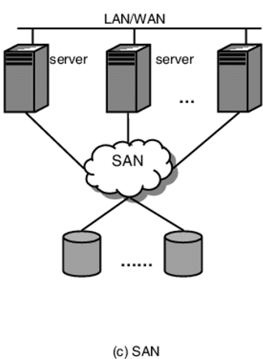

SCSI的结构类似于TCP/IP协议（分层结构）。但是SCSI协议主要用来进行存储数据操作，有部分层是可以替换的。

- IP-SAN：通过TCP协议转发SCSI（Small Computer System Interface,小型计算机系统接口）协议

- FC-SAN(Fibre Channel，光纤通道)：通过光纤通道转发SCSI协议（采用光纤接口，提供更高的带宽）

SAN结构允许任何服务器连接到任何存储阵列，不管数据放置在哪里，服务器都可以直接存取需要的数据，便于系统的同一管理以及集中控制。

- SAN给主机分配的存储空间是独占的，不被其他主机共享
- 成本与复杂性是SAN存储架构明显的缺陷

若基于以太网方式来传递数据，就形成了iSCSI模式

> **NAS（Network Attached Storage,NAS）** 网络存储器是连接在网络上具备数据存储功能的装置，可提供跨平台文件共享功能

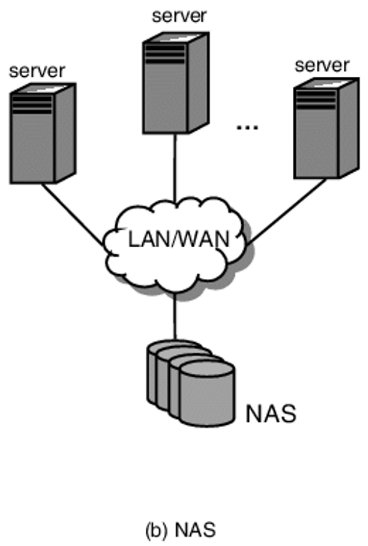

NAS以数据为中心，将存储设备与服务器彻底分离，集中管理数据，存储设备在服务器侧以文件系统形式展现。

- NAS本身支持多种协议（NFS、CIFS、FTP、HTTP）
- 支持各种操作系统

NAS数据存储适用于通过网络将文件数据传送到多个客户机上进行访问的用户

- 主机与存储分离，存储设备不受主机影响
- 提供高效的文件共享服务
- 扩展性受设备大小的限制
- 几乎所有的网络存储设备都是以文件系统样式进行使用，无法进一步格式化操作
- 只能提供文件级访问无法满足block级应用的使用需求

- 只能使用远程存储设备上的文件，不能管理空间，不能对文件系统进行管理，通讯基于文件方式实现

#### 集中式存储系统

> 传统的存储系统采用集中的存储服务器存放所有数据，存储服务器成为系统性能的瓶颈，也是可靠性和安全性的焦点，不能满足大规模存储应用的需求

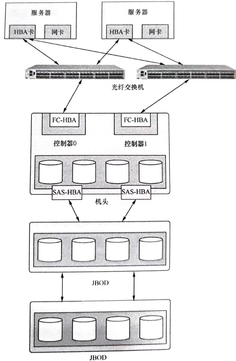

集中式存储不一定只是一台单独的设备，也可以是集中在一套系统中的多个设备

- 如SAN存储方案就是用了几个机柜来存放数据

集中式存储系统中包含很多组件，如机头（控制器）、磁盘阵列（JBOD）、交换机和管理设备

通常机头包含两个控制器，互为主备，机头中的控制器实现了集中式存储系统中绝大多数高级功能

- 对磁盘的管理，将磁盘抽象化为存储资源池、划分逻辑单元（Logical Unit Numvber,LUN）给客户端使用等

机头包含前端接口和后端接口

- 前端接口对外连接，提供存储服务
- 后端接口为机头连接更多的存储设备，以及形成更大的存储池，扩充存储系统的容量

机头作为集中式存储系统的统一入口，其处理能力及扩展能力决定了系统整体的定位

- 通常只能提供有限的存储系统纵向（加性能）扩展能力很难满足存储系统横向（加容量）扩展的需求

### 0.1.2 从集中化到虚拟化（SAN/NAS到分布式存储系统）

数据中心建设过程不可避免地会出现采购规范多元化、设备型号多样化的情况，存储设备的兼容性问题。异构硬件的统一性问题会给企业的数据运维带来棘手的挑战

> **存储虚拟化技术** 的核心思想是将资源的逻辑映像和物理存储分开，屏蔽不同物理设备的异构属性，实现数据服务与物理硬件的独立管理

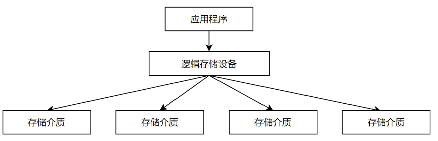

#### 分布式存储

分布式存储系统是存储虚拟化技术的常见展现形式，分布式存储系统将数据分散到多台独立的设备上

- 分布式存储系统具有高度的可伸缩性以及可扩展性，具有强大的数据访问性能，且对标准化硬件支持更好，允许大规模存储系统通过相对低廉的成本进行建设与运维

目的：通过廉价的商用服务器来提供海量、弹性可扩展的数据存储系统。将数据分散地存储到多台存储服务器上，并将这些分散的存储资源构成虚拟的存储设备。

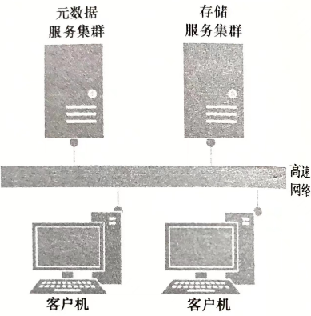

分布式存储系统通常由3个部件组成：客户端、元数据服务器以及数据服务器

- 客户端：发送读写请求、缓存文件元数据和文件数据
- 元数据服务器：负责管理文件元数据和处理客户端请求
- 数据服务器：存放文件数据，保证数据的可用性和完整性

优势：

- 系统扩展能力更强：分布式系统的Scale out特性，允许存储系统纳管更多的服务器，且随着服务器数量的增加，存储系统的容量及性能可获得近似线性的提升，为存储系统的容量扩展以及性能扩展提供可靠的技术保障

- 系统计算处理能力更优：具体到某个固定时间点，单颗处理器的计算能力终究会有上限。分布式存储系统架构允许数据分散存储在多态独立的服务器上，统一对外提供服务，可以最大化利用系统所有资源，最优化均衡系统所有负载

- 系统有更好的成本优势

- 系统稳定性更可靠

  传统集中式存储可能出现同一镜像的数据分布在同一磁盘托架中，若控制器出现故障，存储对外服务性能将出现降级，且部分磁盘会承受很大的负载压力，重建耗时长

  分布式存储修通无单点故障，单盘损坏，全部磁盘参与数据重建，分摊系统压力，对存储系统整体性能输出影响较小

#### 不同场景下的分布式方案

- 分布式块存储：将裸盘直接映射给主机使用，主机的操作系统识别后，可对磁盘进行分区、格式化文件系统或者直接进行裸设备读写。使用线性地址空间，不关心数据的组织方式以及结构，读写速度快，但共享性差

- 分布式文件存储：将文件系统挂载给主机使用，主机层面操作系统可对挂载后的文件系统直接进行读写，遵循POSIX语义，类似操作本地文件系统，文件存储采用树状结构以及路径访问方式，共享性号，但读写性能差

  Gluster：GlusterFS是一个横向扩展的网络附加文件系统，必须指定使用哪种安置策略来将数据副本存储到不同地域的机架上

- 分布式对象存储：以restful api或客户端sdk形式供用户使用，更适合非结构化数据的存取。对象存储使用统一的底层存储系统，管理文件以及底层介质的组织结构，为每个文件分配唯一的标识，用户需要访问某个文件，直接提供文件标识即可

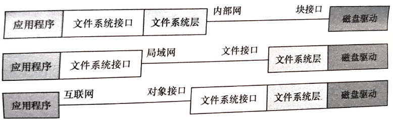

#### 不同架构的分布式方案

**有中心架构**：分布式存储集群实现统一的元数据服务，元数据统一存储并管理。客户端发起读写请求前，先向元数据服务器发起读写请求

- HDFS
- Lustre：管理一个用于映射物理位置和文件名的索引文件，适用于存储少量大文件

**无中心架构**：分布式存储系统无单独的元数据服务，元数据与数据一样，被切片打散后存储在多台存储服务器上，客户端通过特定的算法进行计算，确定元数据及数据的存储位置，并直接向存储节点相关进程发起读写请求。

- 计算模式：Ceph
- 一致性Hash模式：Swift

##### HDFS

> Hadoop Distribution File System是中心分布式存储系统

一部分结点Name Node用于存放管理数据（元数据），另一部分结点Data Node用于存放业务数据（数据文件）

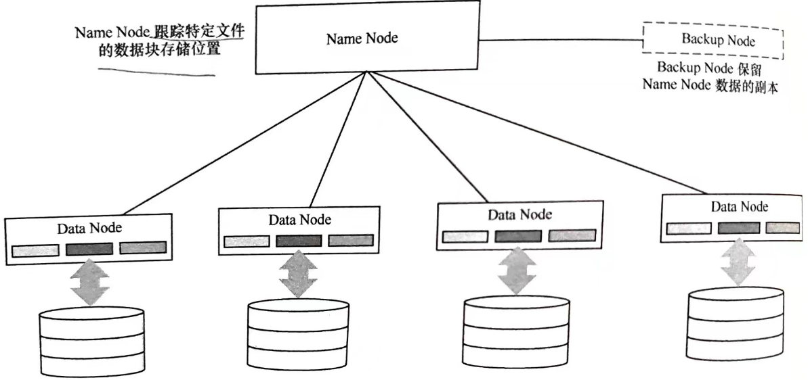

**读写流程**

数据先从 Name Node 获取该文件的位置信息（具体在哪个Name Node）上，然后从该DataNode上获取具体的数据。

- Name Node 通常是主备部署，由于元数据的访问频度和访问量相对数据小很多，因此Name Node不会称为性能瓶颈。
- DataNode 是由大量服务器结点构成一个存储集群，DataNode集群中通常将数据以副本形式存放，该策略下既可以保证数据的高可用性，又可以分散客户端的请求

可以横向扩展DataNode的数量来增加存储系统的承载能力

**应用**

HDFS目前主要用于大数据的存储场景，HDFS也是Hadoop大数据架构中的存储组件

- 对大文件存储性能要求比较高的业务场景

  元数据保存在Name Node的内存中，文件数据的增加会大量占用NameNode的内存。当HDFS存储海量小文件时，会引起整个分布式存储系统性能下降

- 读多写少的场景

  HDFS的数据传输吞吐量比较高，但数据写入时延比较差。HDFS不适合频繁的数据写入场景

##### Ceph

客户端(Client)  通过设备映射关系以及预先定义的算法，可直接本地计算出写入数据的存储位置，这样客户端可以直接与存储结点进行交互，避免了元数据结点称为存储系统的性能瓶颈

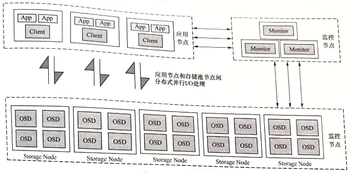

**特点**

- 高性能：采用CRUSH算法，使元数据分布更加均衡

- 高可用性：考虑容灾域隔离，可以实现多种数据放置策略（数据副本跨机房、机架感知冗余等）；数据副本数灵活可控，坚持数据强一致性原则，没有单点故障，存储集群可修复自愈

- 高可扩展性：集群无中心结点，扩展灵活，系统的容量和IO能力可以获得线性增长

- 接口及特性丰富，通过librados可实现接口自定义，支持多种语言进行驱动开发

  对象存储：支持Swift、R3

  块存储：除私有协议挂载外，支持iSCSI方案，RBD支持精简配置、快照、克隆等特性

  文件系统存储：支持POSIX接口，支持快照

##### Swift

Swift用于为云计算提供高可扩展性的对象存储集群。使用一致性Hash方式获取数据存储位置。

一致性Hash将设备在逻辑上构建成一个环，然后根据数据名计算出的Hash值映射到Hash环中的某个位置，从而实现数据的定位

对于一个文件，通过Hash(md5)找到对应的虚节点（一对一映射关系） ，虚节点再通过映射关系找到对应的位置（多对多映射关系）

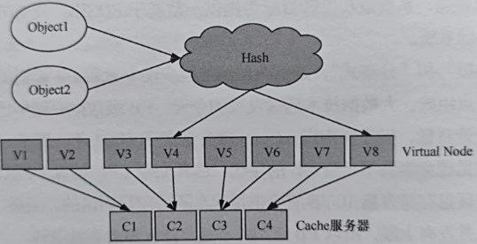

**应用**

主要面向对象存储应用场景，主要解决非结构化数据的存储问题

Swift与Ceph区别

-  Swift仅提供对象存储服务，Ceph支持对象存储，文件存储，块存储

- Swift提供数据最终一致性，在处理海量数据的效率上占优势，主要面向对数据一致性于鏊求不高，但对数据存储效率要求比较高的对象存储业务；Ceph存储系统强调数据的强一致性，更适用于对数据存储安全性要求高的场景

- Swift集群支持跨地域部署，允许数据现在本地写入（本地写成功则返回成功），在一段时间后复制到远程地域。

  Ceph需要Master-Slave两套集群，从主到从进行数据异步复制，在多于两个地域时，基础架构上的负载分布会很不均衡

## 0.2 Ceph介绍

```
官方地址：https://ceph.com/en/
官方文档：https://docs.ceph.com/en/latest/
github地址：https://github.com/ceph/ceph
```

### 0.2.1 背景

存储系统是云计算基础设施层（Infrastructure  as a Service ,IaaS）中最为关键的组成部件之一，在云计算、大数据、AI等技术的发展浪潮推动下，数据量开始激增， 企业数据中心的数据存储形式既要兼顾传统业务的数据安全，同时企业存储选型还要兼顾性能、成本、可用性、扩展性等因素，也需要考虑满足数字化转型的要求，适配多种云平台后端存储使用场景，因此分布式存储开始受到重视。Ceph作为分布式存储方案，已经获得全球众多企业的认可，在开源社区项目中的影响力巨大。基于Ceph的存储系统可以搭建在商用服务器硬件上，从而打破昂贵的厂商定制化方案，为用户提供了性价比更高的存储系统，越来越多的企业开始基于Ceph开发自己的分布式产品或者直接基于Ceph开源项目构建企业级数据存储系统。Ceph已经成为OpenStack、CloudStack这样的云平台首选的开源企业级软件定义存储系统。

随着非结构数据类型的增多，存储的形态从传统存储向分布式存储转变。

### 0.2.2 Ceph设计初衷

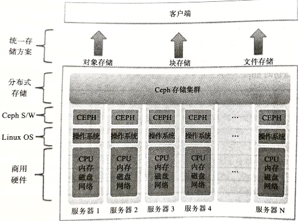

提供运行在通用商用硬件上的、软件定义的、统一的分布式存储的解决方案

所有组件都可扩展

所有组件必须尽可能自我管理，不存在单点故障

在同一个底层架构上提供了块存储、对象存储以及文件存储的使用需求。

#### Ceph云存储解决方案

在云基础设施开发中问题最多的就是存储领域。云环境要求其存储能以低成本纵向和横向扩展，而且容易与云框架中的其他组件集成。这样的存储系统需求是决定整个云项目总体成本的一个重要方面。

传统的存储系统虽然能够支持与其他框架的集成，但他们并不是一个好的统一的云存储解决方案。同时传统存储系统部署和长期运行的成本太高，且不支持纵向扩展与横向扩展。

Ceph通过与OpenStack、CloudStack和OpenNebula 等每一个主流开源云平台的结合，快速演变以缩小与真正云存储后端的差距。从F版开始，Ceph就已经完全与OpenStack集成。

- OpenStack项目是一个端到端的云解决方案，大力推动了公有云和私有云的发展。其核心组件Swift提供基于对象的存储（仅提供）和Nova-Volumn(Cinder)，Cinder为VM提供块存储

  Ceph包含块存储、文件存储和对象存储，因此可以通过单一集群为OpenStack提供多种存储类型。OpenStack通过它的CInder和glance组件使用使用Ceph最为苛刻的特性RADOS块设备（RBD）

云平台使用Ceph作为存储后端，在服务提供商建立SaaS和IaaS解决方案的过程中提供很多必要的便利性，这是传统的企业级存储解决方案所不能提供的，因为其不是为了满足云需求设计的。

- Ceph RBD通过提供精简配置的快照复制卷帮助OpenStack快速配置数百个VM实例
- Dell、SUSE、Canonical（Linux内核版本）为它们的OpenStack云解决方案提供并支持Ceph部署和配置管理工具，其他配置管理工具（Puppet、Chef、Ansible）都有自己成熟的Ceph部署模块。Ceph与这些工具完全兼容，允许用户瞬间部署和扩展Ceph集群

#### 存储形态的转型

存储未来的发展方向是 **软件定义存储(SDS,Software Define Storage)** 。其关键价值在于，Ceph可以为在传统存储上有大投入但并没有获得必要灵活性和扩展性的用户提供一个很好的解决方案。不需要重构数据中心的基础架构，只需在现有条件下做很小的调整，即可将软件定义存储解决方案落地。

如果部署专有存储，无论是硬件还是软件都将被供应商锁定，这就是开源软件能解决供应商锁定的原因

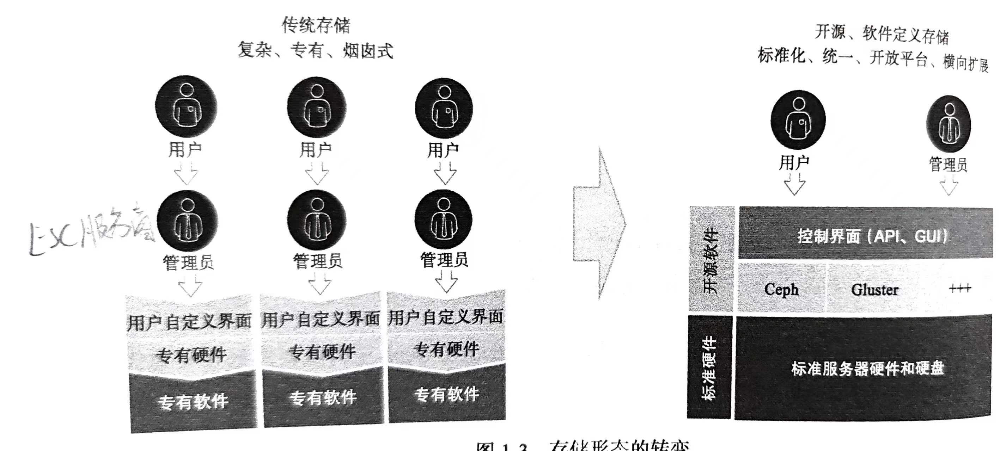

对于 **传统存储的组织形式** ，存储服务依赖底层专有软硬件，即用户需要的时候提出申请，管理员负责创建并提供必要的存储资源。

**软件定义存储** 将存储软件与硬件解耦的存储体系结构，是物理存储设备和数据请求之间的软件层，提供了存储访问服务、网络服务和存储单元连接服务

**优势**

- 介质多样：由于底层不需要依赖专有硬件设备，采用通用的x86架构服务器即可完成存储软件的安装与运行，使用网络协议构建存储集群，给用户在存储方面带来极大的灵活性

  可将多种不同容量的存储介质，SAS盘、SATA盘、SATA SSD、NVME SSD、虚拟磁盘重新规划构成同一的存储资源池

- 扩展性：在不影响性能情况下，存储节点可以动态添加，不必添加专有硬件，近似无限扩展存储容量

- 透明性：软件自身能监控和管理存储空间使用情况，同时让用户知道那些资源可用、新数据如何放置、数据完整性如何保证

- 自动化：安装、扩容、运维等全面自动化

  当存储节点或磁盘发生故障时，集群会自动调整数据副本数量，保障数据安全，并在数据发生变化时，保证数据在各节点上均匀分布

- 写入类型化多样：支持应用程序通过块、文件和对象接口写入数据

- 标准接口：用于管理、维护员存储设备和服务的应用程序编程接口

  提供了丰富的使用接口，允许用户在需要时升级或降级硬件；

- 避免技术锁定：采用商用的x86服务器来构建基于软件定义存储的存储集群，避免软件或硬件厂商的技术锁定

**工作机制** ：软件定义存储会将 **存储操作的请求抽象化** 

**适用于**

- 最终用户
- 创业公司

2016年，存储形态有了根本转变，专有硬件变为标准硬件

#### 统一存储解决方案

从存储厂商和的角度看，**统一存储** 的定义就是在单一平台上提供基于文件和基于块的访问。企业存储环境在单一平台上提供NAS和SAN，就可以认为是一个统一存储解决方案了。

Ceph是一个真正的统一存储解决方案，从单一统一软件层提供对象、块、文件存储。

Ceph是一个面向未来的存储，其设计初衷就是考虑能够处理大量的数据。对象存储比块存储和文件存储更能满足现在以及将来对于非结构化数据存储的需求，对象是Ceph的基础（基本存储单元）。

Ceph底层中并不存在块和文件管理，任何格式的数据都是以对象形式保存在Ceph集群的归置组（Placement Group，PG）中，并且在对象之上支持基于块和文件的存储。

在传统的基于文件的存储系统中，文件是通过文件目录进行寻址的；Ceph中的对象通过唯一的标识符进行寻址，并存储在一个扁平的寻址空间

- 剔除元数据操作后，在Ceph中的对象没有与物理存储路径绑定，使得可以为每个对象创建跨集群副本，提供了无限的线性规模扩展和性能提升

#### 面向未来的架构

> 传统的存储系统并不具备更加智能地管理元数据（关于数据的信息，决定了数据往哪里存、从哪里读取）的方法

传统的存储系统通过维护一张集中的查找表来跟踪它们的元数据。

- 客户端每次发出读写请求时，存储系统首先要查找这个巨大的元数据表，得到数据结果后才执行客户端的请求操作

> Ceph引入了CRUSH（Controlled Replication Under Scalable Hashing）算法

CRUSH算法在后台计算数据存储和读取位置，通过动态计算元数据，Ceph不需要管理一个集中式的元数据表。

- 现代计算机的计算速度也能够极快地完成CRUSH查找。
- 利用分布式存储的功能可以将一个小的计算负载分布到集群中的多个结点

CRUSH算法使我们能够设计一个 **没有单点故障** 的高度 **可靠** 的存储基础设施

- CRUSH具有独特的基础设施感知能力。能了解基础设施中不同组件中的关系（从系统磁盘、池、节点、机架、电源插板、交换机到数据中心即数据中心房间等），这些都是任何基础设施中的故障区域。Ceph管理员可以在自己的环境中高效地管理数据，可以在CRUSH map中自由地为基础设施定义故障区域。

  CRUSH会以多副本的方式保存数据，以保证在故障区域中组件故障的情况下数据依旧可用

- 当故障区域中的组件故障，CRUSH能感知到并确定对集群的影响，无需管理员干预，进行自我管理和自我疗愈。CRUSH根据集群中的其他副本来生成丢失的数据

#### 从可靠性对比RAID和Ceph

磁盘制造技术这些年越来越成熟，制造商已经能以更低的价格生产更大容量的企业级硬盘，而且硬盘容量每年持续增长。

可以用众多TB级硬盘组成基于RAID的企业级存储系统，

为保证可靠性，RAID需要很多整块昂贵的磁盘充当备用盘，且RAID机制要求同一个RAID组中的硬盘必须完全相同，这也增加了系统总成本。RAID的纵向或横向扩展是有上限的。

对于硬盘故障，RAID需要花费几小时甚至几天的时间来修复单个故障的硬盘，使用RAID技术修复多个大硬盘是一个很繁琐的过程。

RAID系统只能防止磁盘故障，不能为网络、服务器硬件、OS、交换设备的故障或者区域灾害提供保护措施。

- RAID最多能提供防止两个磁盘故障的措施

RAID数据恢复过程中，客户端无法执行任何IO操作

---

对于数据 **可靠性** ，Ceph采用数据副本方式。不需要特殊硬件，数据副本级别也可通过命令高度定制化。

- Ceph存储管理员能够根据自身需要和底层基础设施特点来管理副本策略

所有数据的初始副本和复制副本不会在同一磁盘上，并且必须驻留在CRUSH map中定义的不同故障区域中。

当磁盘故障时，该磁盘上的所有数据马上开始从对等磁盘上进行恢复，由于所有的磁盘都参与数据恢复，所以不存在性能瓶颈

- 恢复操作不需要任何热备磁盘，只是将数据简单地复制到Ceph集群中其他的磁盘上。

Ceph采用加权机制选择磁盘，因此不同容量的磁盘不会造成问题。Ceph根据磁盘权重存储数据，这个权重分配可以由Ceph自行管理，也可以通过自定义的CRUSH map管理

Ceph还支持其他用于保证数据可靠性的方法，如纠删技术，在提供同样级别可靠性的情况下，纠删码方式比副本方式更加节省存储空间。

- 在纠删码方式下，损毁的数据借助纠删码计算恢复或再次生成

### 0.2.3 Ceph发展历程

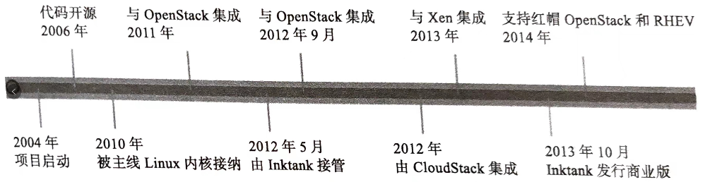

#### 研究阶段

Ceph最初设计目标是围绕文件系统使用场景构建一个可水平扩展的基于对象的文件系统，用于数据中心高性能计算

设计初衷：存储集群英爱是一个只能的存储结点集群，而不是大量哑磁盘的集群，采用以下技术

- EBOFS（针对对象工作负载的文件系统）
- CRUSH算法
- RADOS

这几项技术的监控部分在集群内部实现，并于2006年开源

#### 孵化阶段

早期的客户端是基于用户空间文件系统开发的，运行速度慢，需要有一个可以与系统通信的本地高性能Linux客户端

2010年Ceph的Linux本地客户端被Linux内核接受。

Ceph真正迈入商业化在DreamHost决定使用Ceph构建与S3兼容的对象存储服务

#### 商业化阶段

Ceph实现了快速部署，且无法追踪它的部署过程

Ceph的下一个主要转折点是与OpenStack的集成，为了支持OpenStack等平台的对象和块存储的使用，Inktank将所有开发资源投入到Ceph的对象存储和块存储中

每季度组织一次在线会议，有意愿为Ceph贡献的社区成员都被要求填写一份目标书，经过社区讨论后，可以使团队为此目标的确定负责人

#### 成熟阶段

2014年被RedHat收购


 

### Ceph适用场景


随着业界对Ceph系统的不断深入使用，Ceph存储方案也暴露出一些问题

- 是否能达到理论上的近似无限扩展
- 存储系统性能是否可以满足各类应用的真是需求
- 鲁棒性和是否可以应对各类服务器、交换机硬件层面的异常或故障不影响用户业务正常运行

