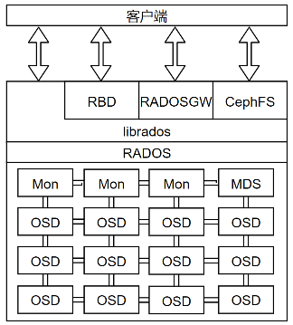
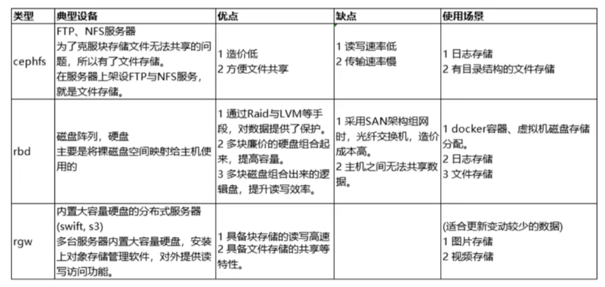
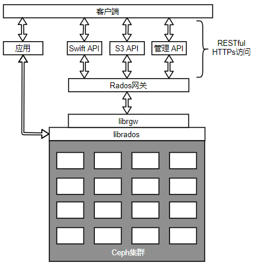
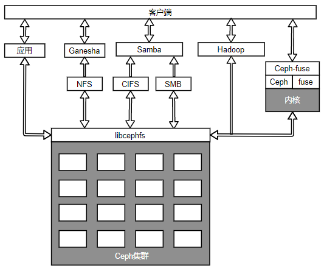

[TOC]

<!--more-->

Ceph集群由几个相互独立的不同软件守护进程组成，每个守护进程负责Ceph的一个独特功能并将值添加到相应的组件中。



## 2.1 Ceph RADOS

> RADOS(Reliable Automatic Distributed Object Store)是Ceph的核心，Ceph的底层存储服务是由多个主机组成的 **可靠的、自动的、分布式对象存储集群**  

- Ceph中的一切都以对象的形式存储，RADOS负责存储这些对象，不考虑数据类型

从 **层次结构** 上看，RADOS在最下部，完全处于Ceph集群的内部，没有提供给客户端直接接口，由librados提供面向所有客户端的接口

从 **功能** 上看，RADOS层确保数据的一致性和可靠性，分布式对象存储、高可用、高可靠性、没有单点故障、自我修复和自我管理以及Ceph数据访问方法（RBD、CephFS、RADOSRGW、librados）的所有操作都是在RADOS层之上构建的。

- 跨集群存储 ：当Ceph集群接收到客户端的写请求时，CRUSH算法首先计算出存储位置，然后这些信息传递给RADOS层进一步处理。基于CRUSH规则集，RADOS以小对象的形式将数据分发给集群中的所有节点，最后将这些对象存储在OSD中

- 可靠性：当配置副本数大于1时，RADOS负责数据的可靠性：复制对象、创建副本、并通过CRUSH算法将副本存储到不同的故障区域中。默认副本数为3

- 一致性：在对象不一致的情况下，RADOS会利用剩下的副本自动执行数据复制、故障检测和恢复，数据在集群节点间的迁移和再平衡。对用户而言是透明的。进而为Ceph提供了自我管理和自我修复的能力

```shell
rados lspools #查看RADOS池
rados -p metadata ls #查看池中的对象
rados df # 查看集群空间的使用情况
```

RADOS包含两个核心组件：OSD和monitor

### 2.1.1 OSD

> **OSD（Object Store Daemon）由一个已经存在Linux文件系统的物理磁盘驱动器和OSD服务(dameon)组成** ，存储数据，处理数据复制、恢复、重新平衡，并通过检查其他 Ceph OSD守护进程的心跳来向Ceph监视器和管理器提供一些监控信息。

#### 功能

##### 存储用户数据

> OSD负责将实际的数据以对象的形式存储在每一个集群节点的物理磁盘驱动器中。

Ceph集群中大部分集群是由OSD守护进程完成的。存储用户数据是真正耗时的部分。

通常一个OSD守护进程与集群的一个物理磁盘绑定（OSD守护进程数=物理磁盘数）

- 也可以为每个主机、每个RAID卷、每个物理磁盘部署一个OSD守护进程

##### 响应客户端的读写请求

> OSD是Ceph集群中存储实际用户数据并响应客户端读写请求的唯一组件

**读写流程** ：客户端首先向monitor请求集群的map。然后，无需monitor的干预直接与OSD进行IO操作

- 数据事务处理速度快源于客户端能直接写入存储数据的OSD而没有额外的数据处理层

##### 跨节点复制

> Ceph通过跨集群节点复制每个对象多次来提供可靠性、高可用性、容错性和数据一致性

OSD上的每个对象都有一个主副本和几个辅副本，辅副本分散在其他OSD上

- 每一个OSD对于一些对象是主副本，对于其他对象而言是辅副本。
- 存放辅副本的OSD受主副本控制

当磁盘发生故障时，OSD的守护进程会自动与其他OSD通信，从而开始执行恢复操作：主副本存放在故障磁盘的对象，会将其辅OSD提升为主OSD，并生成新的副本分布

#### OSD文件系统

Linux文件系统决定了支持哪些扩展属性（XATTR）

Ceph OSD充分利用文件系统的扩展属性来扩展其内部状态和元数据的形式，使用 `xattr_name` 和 `xattr_value` 来存储对象的额外信息（内部对象的状态、快照、元数据和ACL等信息）

##### Btrfs

使用Btrfs文件系统的OSD能提供最佳性能

- 支持写时复制和可写快照：对于虚拟机的部署和克隆十分有用
- 支持透明的压缩、普遍的校验和多设备的统一管理
- 支持对小文件的合并
- 集成卷管理
- 支持在线fsck的特性

不具备用于生产系统的条件

##### XFS

推荐在生产环境Ceph集群中使用

XFS是一种日志文件系统：客户端每次写入数据时，首先需要写入日志空间，再写入XFS文件系统，相当于两次写入操作

XFS在元数据扩展性上存在性能问题

##### ext4

ext4也是一种日志文件系统

ext4限制了XTTRA的存储容量使其不具备提供足够的XATTR信息的能力，而Btrfs和XFS在 XTTRA存储容量上的限额就比较大

#### OSD日志

Ceph在数据提交到备用存储之前，首先将数据写入日志（journal）的独立存储区域，日志可以使用相同的机械磁盘或不同的SSD磁盘或分区上的一小块缓冲区大小的分区，甚至可以用一个文件。


Ceph使用日志来保障速度和一致性。默认情况下，每隔5s日志会向备用存储中刷新数据

常见的日志大小为10GB，分区越大越好

日志允许OSD处理小文件写，随机写，为文件系统提供了充足时间将写操作合并到磁盘

日志读写速度的提升显然会让系统整体的读写速度提升

- 将日志创建在SSD上，所有客户端的写操作都是写入SSD型日志中，然后再写入机械硬盘，能够很好地处理工作负载的峰值
- 最佳实践：每个SSD磁盘最多给4-5个OSD做日志，否则会称为集群的性能瓶颈。

**缺点** ：若将多个采用ext4或者XFS文件系统的日志挂载在同一磁盘上，会存在单点故障的风险

- Btrfs是一个写时复制文件系统，支持回滚。若一个块的内容发生了变化，而针对这个块的写时独立进行的，因此能够保留旧的块

#### RAID不适合作为OSD

在默认情况下，Ceph为了保护数据，会在内部执行复制，而对副本数据再做RAID只会增加复杂性

对于故障恢复，RAID需要一个相同类型的空闲磁盘才能开始执行，在数据恢复过程中，必须等待整个磁盘中的数据全部写入新的磁盘，花费大量时间

而Ceph依赖复制，在恢复操作中，基于复制级别和归置组，几乎所有的集群节点都参与数据恢复，使得恢复操作更快

由于RAID5和RAID6的随机IO速度很慢，可能会有性能问题

当然，当每个主机都有相当多的物理磁盘，而且一般每个OSD对应一个守护进程，所以此时可以把几个磁盘组成一个RAID卷，然后在这个卷上创建OSD，将减少OSD数量

- 推荐为每个OSD分配2GB内存

#### OSD命令

```shell
service ceph status osd #检查单节点上OSD状态
service ceph -a status osd # 查看整个集群的OSD状态，ceph.conf文件必须包含所有OSD的信息
ceph osd ls #检查所有OSD的ID
ceph osd stat #检查OSD map和状态
ceph osd tree # 检查OSD树形图
```

### 2.1.2 Ceph monitor

Ceph Monitor 组件以守护进程的形式存在，通过一系列的map来维护集群成员状态、对等节点状态以及集群配置信息（OSD、Mon、PG、CRUSH）

- monitor为每一个组件维护一个独立的map

所有集群节点向monitor报告状态，并分享每个状态变化的信息，基于paxos协议实现节点间的消息同步

负责管理守护进程和客户端之间的身份验证

#### 集群map

monitor map：维护monitor节点间端到端的信息

- Ceph集群ID
- monitor主机名、IP、端口号
- 当前map的创建版本和最后一次修改信息

```shell
ceph mon dump
```

OSD map

- 集群ID
- 关于OSD的信息：数目、状态、权重、最近处于clean状态的间隔及OSD主机等信息
- OSD map创建版本和最后一次修改信息
- 与池相关的信息：池名字、池ID、类型、副本数和归置组

```shell
ceph osd dump
```

PG map

- 最新的OSD map版本
- 存放归置组的版本、时间戳、容量充满比例以及容量接近充满的比例
- 跟踪每个归置组ID、对象数、状态时间戳、OSD的up集合、OSD的acting集合

```shell
ceph pg dump
```

CRUSH map

- 集群的存储设备信息、故障域层次结构
- 在故障域中定义如何存储数据的规则

```shell
ceph osd crush dump
```

MDS map

- 集群中MDS的数目以及MDS状态
- 当前MDS map的版本，创建时间和修改时间
- 数据和元数据池的ID

```shell
ceph mds dump
```

#### monitor进程

客户与其他集群节点定期与monitor确认自己是否持有最新的map

monitor是轻量级的守护进程，通常不需要大量的系统资源

- monitor需要足够的磁盘空间来存储集群的日志，包括OSD、MDS和monitor的日志

  健康状态的集群日志在几兆字节到几千兆字节之间

  开启调试模式，集群的日志存储需求会显著增加，可能需要几个T的磁盘空间存储日志

#### monitor集群

一个典型的Ceph集群通常包含多个monitor节点。

多monitor的Ceph架构使用了仲裁(quorum)，使用Paxos算法为集群提供了分布式决策机制。

自monitor开始仲裁操作，至少需要保证一半以上的monitor始终处于可用状态，防止其他系统看到脑裂问题

至少需要三个monitor节点提供高可用性

```shell
ceph dameon mon.[monname] mon_status
{
	"state":"leader" #表示当前节点为集群的leader节点
}
```

**最佳实践**

若monitor服务与OSD服务运行在同一节点上，需要更多CPU、内存和更大的系统磁盘来监控日志

在存储规划阶段，也应该考虑物理机架的布局。应该将monitor节点分散到不同的故障域中

#### monitor相关指令

```shell
service ceph status mon#检查monitor服务的状态
ceph mon stat
ceph mon_status
ceph mon dump
```

### 2.1.3 librados

librados是一个本地C语言库，提供了Ceph集群(RADOS)的一个本地接口，通过librados库可以简化访问RADOS的方法

1. librados是其他服务接口的基础，如Ceph块设备、Ceph文件系统和Ceph RADOS网关

   为CephFS提供POSIX接口

2. 应用程序可以扩展本地协议以便通过librados直接连接到RADOS

   在librados支持下与RADOS通信，提供了丰富的API支持(C++,Java,Python,Ruby,PHP)，允许应用程序直接、并行地访问集群，没有HTTP开销

3. librados 提供丰富的API子集，高效地在一个对象中存储键/值对，并通过对象实现客户端之间通信的支持

   通过同时更新数据、键和属性来支持atomic-single-object事务

### 2.1.4 Managers

> Ceph管理器（守护进程ceph-mgr）负责跟踪运行时指标和Ceph集群的当前状态，包括存储利用率、当前性能指标和系统负载。

Ceph管理器守护进程还托管基于Python的模块来管理和公开Ceph集群信息，包括基于Web的ceph仪表板和RESTful API。

基于raft协议实现节点间信息同步

- 高可用：2个以上

## 2.2 Ceph 数据访问方法



### 2.2.1 Ceph块设备

> Ceph块设备也称为RADOS块设备(RBD)，对外提供块存储


- 可以被映射、格式化并可以挂载到服务器
- 也可以当作裸分区或标记为文件系统，然后进行挂载
- 也可以为物理层的虚拟机监控程序以及虚拟机提供块存储解决方案

**读写流程**

当客户端向RBD写数据时，librbd库将数据映射到对象而存储在Ceph集群中，删除这些数据对象并跨集群复制这些对象，从而提供更好的性能和可靠性。

Ceph RBD驱动程序已经被集成到Linux内核中（**内核RBD，KRBD**）

- 完整和增量式快照：能够实现基于时间点的还原
- 精简的配置：只有发生变化的对象才需要存储，节省OpenStack大量的存储空间
- 写时复制和即时克隆
- 内存式缓存

#### 虚拟机监控器完全支持RBD

业内领先的开源hypervisor(虚拟机监控器)，如：KVM、Xen、VMware、HyperV完全支持RBD，并利用它为各自的客户虚拟机提供RBD特性。

hypervisor是一种运行在基础物理服务器和操作系统之间的中间软件层，允许多个操作系统和应用共享硬件


- I型（裸机型）：直接运行在系统硬件上，不需要底层OS

- II型（托管型，宿主型）：运行在传统操作系统上，构建出一整套虚拟硬件平台(CPU、内存、外存、适配器)，底层和上层的操作系统可以完全无关化

  VM中的应用程序调用硬件资源需要经过：VM内核->Hypervisor->主机内核，性能是三种虚拟化技术中最差的

- III型（操作系统虚拟化）：虚拟机运行在传统操作系统上，创建一个独立的虚拟化实例（容器），指向底层操作系统。所有虚拟机共享内核空间，性能最好，耗费资源最少。但是缺点是底层和上层必须使用同一种操作系统

#### Ceph RBD完全支持云平台

Ceph提供的块设备后端能存储OpenStack虚拟机的卷(Cinder)和操作系统镜像(glance)

- Ceph RBD支持的最大镜像为16EB，这些镜像可以作为磁盘映射到物理裸机、虚拟机或其他主机使用

Ceph写时复制和即时克隆能帮助OpenStack在很短时间内部署数百个虚拟机实例

所有机器都可以访问Ceph集群存储从而更好地实现虚拟机迁移

- 虚拟化容器(Xen，KVM)都可以配置从存储在Ceph的卷来启动虚拟机

### 2.2.2 Ceph对象网关

> Ceph 对象网关，也即RADOS网关(radosgw)，将HTTP请求转换为RADOS请求，同时也可以把RADOS请求转换为HTTP请求

Ceph对象存储使用Ceph对象网关守护进程(radosgw)和librgw、librados交互，通过RESTful API和HTTP/s对外提供可访问且稳定的多租户对象存储

- RESTful：假设互联网上的资源有固定的url，可以通过不同的动作(GET、PUT、POST、PATCH、DEL)获取或修改资源，服务器响应分为HTTP状态码和数据两部分



RADOS网关利用librgw（RADOS网关库）和librados允许应用程序与Ceph对象存储建立连接。

- 兼容S3(Amazon)接口

- 兼容Swift(OpenStack)接口：提供兼容OpenStack Swift API的接口来访问Ceph存储集群，在OpenStack集群中Ceph对象网关能够代替Swift

  兼容OpenStack的身份Keystone身份验证服务

- Admin API：管理API或者原生API，通过基于HTTP的RESTful接口来管理Ceph集群

- 应用程序可以绕过RADOS网关，librados软件库允许用户的应用程序通过C、C++、Java、Python和PHP直接访问Ceph对象存储

Ceph对象网关拥有自己的用户管理体系：

- S3和Swift API共享Ceph集群内同一个命名空间：可以通过一个API写入数据而通过另一个API获取数据
- 可以使用多个网关，并将它们放在一个负载均衡器下控制对象存储的负载

快速处理策略：

- 支持使用内存缓存元数据
- 支持将大文件分为多个小的RADOS对象的方法提高性能

### 2.2.3 Ceph文件系统

CephFS在RADOS层上提供了一个任意大小且兼容POSIX的文件系统

#### MDS

> Ceph元数据服务器（MDS），使用Ceph MDS作为守护进程，跟踪文件层次结构并存储只供CephFS使用的元数据，并将它和其他数据分开，降低复杂性并提高可靠性

- 只有Ceph文件系统(CephFS)才需要
- MDS只管理元数据，不向客户端提供任何数据，数据通过OSD服务提供，避免系统中的一个单点故障

MDS提供一个带智能缓存层的共享型连续文件系统，大大减少读写操作

一部分MDS只负责一部分元数据，且不存储本地数据

- 如果一个MDS守护进程发生故障，可以在任何可以访问集群的节点上启动他

MDS本质上是动态的，守护进程可以加入、离开，并且快速接管出错的节点

- 一个MDS可配置为主动和被动状态

  主MDS节点为活跃状态，其他的为备用状态

  主MDS故障，则第二个MDS节点负责接管。也可以指定备用节点跟随主MDS节点

##### MDS配置命令

```shell
ceph-deploy mds create [mdsnodeName]#mdsnodeName为运行MDS进程的节点名
# 在当前node1上运行
ceph-deploy mds create node2 #在node2上创建并运行node1的元数据服务器
```

#### 与客户端交互方法



基于libcephfs库实现多种客户端交互

- libcephfs拥有本地Linux内核驱动程序支持，因此客户可以使用mount命令实现本机文件系统的挂载
- 同时也支持CIFS，SMB，NFS
- 客户端可以使用使用Ceph社区提供的ceph-fuse(用户空间文件系统)驱动CephFS
- 允许直接与应用程序交互。使用libcephfs库直接访问RADOS集群
- CephFS可以代替HDFS：Ceph为Hadoop和Hadoop插件提供了必要的CephFS Java接口

CephFS可以实现多个MDS的active-active状态，使他具备高可扩展性、高性能且没有单点故障
