> 学习视频：https://www.bilibili.com/video/BV16a411j78Q/?spm_id_from=333.337.search-card.all.click&vd_source=260d5bbbf395fd4a9b3e978c7abde437

[TOC]

<!--more-->

## 2.0 ceph

### 2.0.1 存储机制

将待管理的数据流切分为一到多个固定大小的对象数据，并以其为原子单元完成数据存储

ceph通过内部的Crush机制，实时计算出一个文件应该存储到哪个存储对象中，从而实现快速查找对象的方式

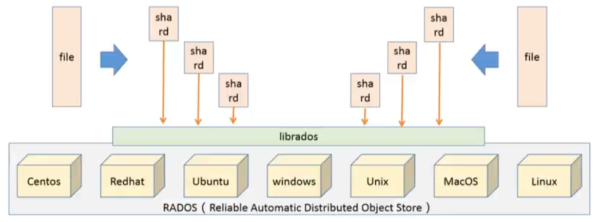

### 2.0.2 组件

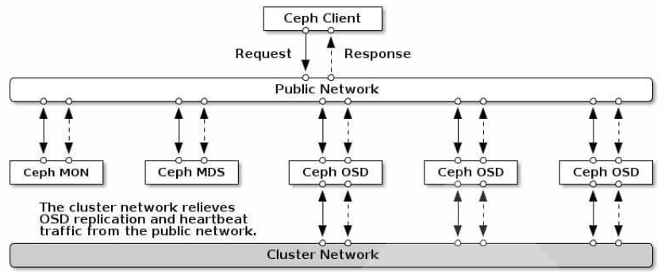

无论想向云平台提供Ceph对象存储和Ceph块设备服务、部署文件系统，或者将Ceph用于其他目的，所有的ceph集群部署都从设置每个Ceph节点网络开始

一个Ceph存储集群至少一个Ceph Monitor、Ceph Manager 和 Ceph OSD，如果有运行文件系统的客户端，还需要配置MDSs

### 2.0.3 网络模型

Ceph生产环境分为两个网段

- 共有网络：用于用户的数据通信
- 集群网络：用于集群内部的管理通信

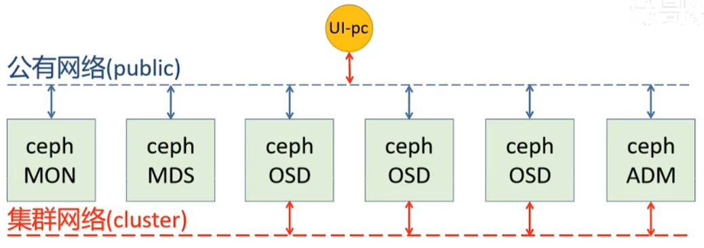

### 2.0.4 Ceph版本

每个Ceph版本都有一个英文名称和一个数字形式的版本编号

x.0.z - 开发版

x.1.z - 候选版

x.2.z - 稳定、修正版

https://docs.ceph.com/en/latest/releases/

### 2.0.5 Ceph安装

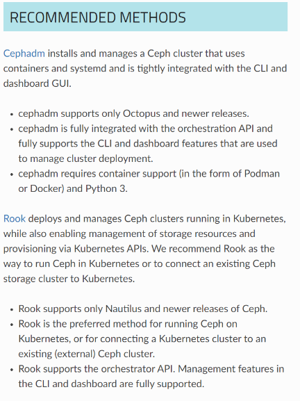

- admin方法基于docker安装
- Rook

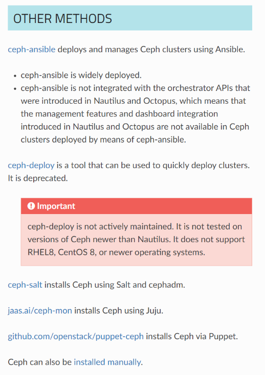

### 2.0.6 规划

**网络配置**

- 公有网络public： 192.168.192.0/24
- 私有网络cluster：192.168.252.0/24

**主机规划**

| 主机名  | 公有网络        | 私有网络        | 磁盘          |
| ------- | --------------- | --------------- | ------------- |
| admin   | 192.168.192.130 | \               | sda           |
| mon01   | 192.168.192.131 | 192.168.252.128 | sda           |
| mon02   | 192.168.192.132 | 192.168.252.129 | sda           |
| mon03   | 192.168.192.133 | 192.168.252.130 | sda           |
| mgr01   | 192.168.192.134 | 192.168.252.131 | sda           |
| mgr02   | 192.168.192.135 | 192.168.252.132 | sda           |
| store01 | 192.168.192.136 | 192.168.252.133 | sda、sdb、sdc |
| store02 | 192.168.192.137 | 192.168.252.134 | sda、sdb、sdc |
| store03 | 192.168.192.138 | 192.168.252.135 | sda、sdb、sdc |

ceph集群角色很多，生产中资源少时，可以让一台主机结点运行多个角色，如：store01-0.3这三台主机可同时兼任mon/mgr角色

## 2.1 基于ceph-deploy搭建ceph集群

部署方式

ceph-ansible：https://github.com/ceph/ceph-ansible #python

ceph-salt：https://github.com/ceph/ceph-salt #python

ceph-container：https://github.com/ceph/ceph-container #shell

ceph-chef：https://github.com/ceph/ceph-chef #Ruby

cephadm: https://docs.ceph.com/en/latest/cephadm/ #ceph 官方在ceph 15 版本加入的ceph部署工具

ceph-deploy：https://github.com/ceph/ceph-deploy #python

是一个ceph 官方维护的基于ceph-deploy 命令行部署ceph 集群的工具，基于ssh 执行可以sudo 权限的shell 命令以及一些python 脚本实现ceph 集群的部署和管理维护。

Ceph-deploy 只用于部署和管理ceph 集群，客户端需要访问ceph，需要部署客户端工具。

### 2.1.1 环境准备

http://docs.ceph.org.cn/start/hardware-recommendations/ #硬件推荐

#### 硬件配置

所有结点2C2G

存储结点3块硬盘

```shell
# 硬盘
sda 20GB

sdb、sdc 20GB
```

#### 网络配置

```shell
ens33: NAT网络 VMnet8 设定为192.168.192.0/24 网段
ens37: 仅主机 VMnet1 设定为192.168.252.0/24 网段，提供ceph集群网络
```

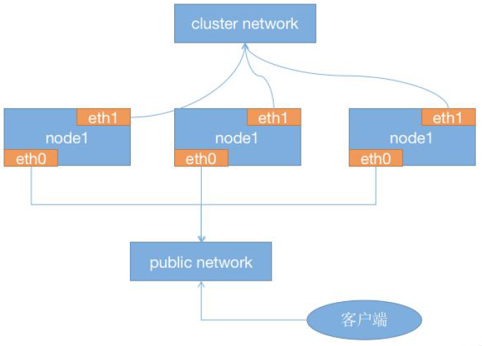

#### 时间同步

对任何集群来说，时间同步非常重要

ceph要求默认各结点的时间误差不超过50ms

```shell
timedatectl set-timezone Asia/Shanghai
```

#### 防火墙与SELinux管理

```shell
# 关闭防火墙
ufw stop
ufw disable
防火墙在系统启动时自动禁用
```

#### 主机名和解析

在所有主机下配置一下内容

```shell
cat >> /etc/hosts <<EOF
192.168.192.130 admin.wang.org admin
192.168.192.131 mon01.wang.org mon01
192.168.192.132 mon02.wang.org mon02
192.168.192.133 mon03.wang.org mon03
192.168.192.134 mgr01.wang.org mgr01
192.168.192.135 mgr02.wang.org mgr02
192.168.192.136 store01.wang.org store01
192.168.192.137 store02.wang.org store02
192.168.192.138 store03.wang.org store03
EOF
```

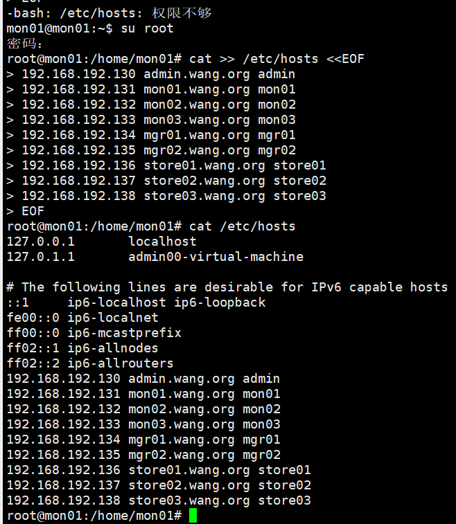

随着生产中主机节点越来越多，通过手工定制主机名的方式不适合主机管理。在企业中，主机名相关信息，倾向于通过内网dns来进行管理

radosgw，需要通过泛域名解析的机制来实现更加强大的面向客户端的主机名解析管理体系

#### 实现基于ssh key的验证(必须)

```shell
# 允许root用户远程登录
vim /etc/ssh/sshd_config
```

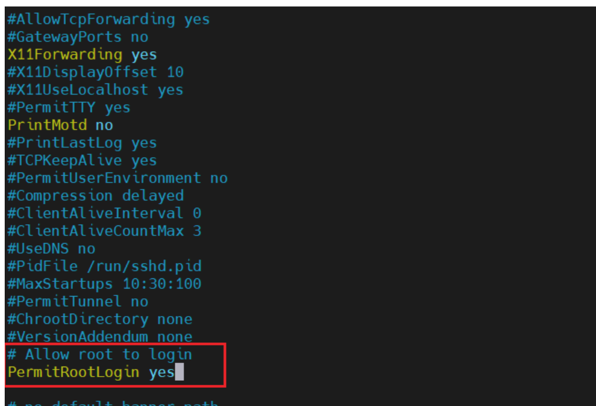

```shell
# 重启ssh服务进程
service sshd restart
```

创建脚本

```shell
#!/bin/bash
#
#********************************************************************
#Author:            wangxiaochun
#QQ:                29308620
#Date:              2021-05-08
#FileName:          ssh_key_push.sh
#URL:               http://www.wangxiaochun.com
#Description:       多主机基于ssh key 互相验证
#Copyright (C):     2021 All rights reserved
#********************************************************************

#当前用户密码
PASS=admin
#设置网段最小和最大的地址的尾数
BEGIN=130
END=138

IP=`ip a s ens33 | awk -F'[ /]+' 'NR==4{print $3}'`
NET=${IP%.*}.

. /etc/os-release

color () {
    RES_COL=60
    MOVE_TO_COL="echo -en \\033[${RES_COL}G"
    SETCOLOR_SUCCESS="echo -en \\033[1;32m"
    SETCOLOR_FAILURE="echo -en \\033[1;31m"
    SETCOLOR_WARNING="echo -en \\033[1;33m"
    SETCOLOR_NORMAL="echo -en \E[0m"
    echo -n "$1" && $MOVE_TO_COL
    echo -n "["
    if [ $2 = "success" -o $2 = "0" ] ;then
        ${SETCOLOR_SUCCESS}
        echo -n $"  OK  "    
    elif [ $2 = "failure" -o $2 = "1"  ] ;then 
        ${SETCOLOR_FAILURE}
        echo -n $"FAILED"
    else
        ${SETCOLOR_WARNING}
        echo -n $"WARNING"
    fi
    ${SETCOLOR_NORMAL}
    echo -n "]"
    echo 
}

#安装sshpass
install_sshpass() {
    if [[ $ID =~ centos|rocky|rhel ]];then
        rpm -q sshpass &> /dev/null || yum -y install sshpass
    else
        dpkg -l sshpass &> /dev/null || { sudo apt update;sudo apt -y install sshpass; }
    fi
	if [ $? -ne 0 ];then 
	    color '安装 sshpass 失败!' 1
		exit 1
    fi
}

scan_host() {
    [ -e ./SCANIP.log ] && rm -f SCANIP.log
    for((i=$BEGIN;i<="$END";i++));do
        ping -c 1 -w 1  ${NET}$i &> /dev/null  && echo "${NET}$i" >> SCANIP.log &
    done
    wait
}

push_ssh_key() {
   	#生成ssh key 
    [ -e ~/.ssh/id_rsa ] || ssh-keygen -P "" -f ~/.ssh/id_rsa
    sshpass -p $PASS ssh-copy-id -o StrictHostKeyChecking=no root@$IP  &>/dev/null

    ip_list=(`sort -t . -k 4 -n  SCANIP.log`)
    for ip in ${ip_list[*]};do
        sshpass -p $PASS scp -o StrictHostKeyChecking=no -r ~/.ssh root@${ip}: &>/dev/null
    done

    #把.ssh/known_hosts拷贝到所有主机，使它们第一次互相访问时不需要输入yes回车
    for ip in ${ip_list[*]};do
        scp ~/.ssh/known_hosts @${ip}:.ssh/   &>/dev/null
		color "$ip" 0
    done
}

install_sshpass
scan_host
push_ssh_key
```

导入脚本

```shell
root@admin:/home/admin# sudo apt install lrzsz

rz
```

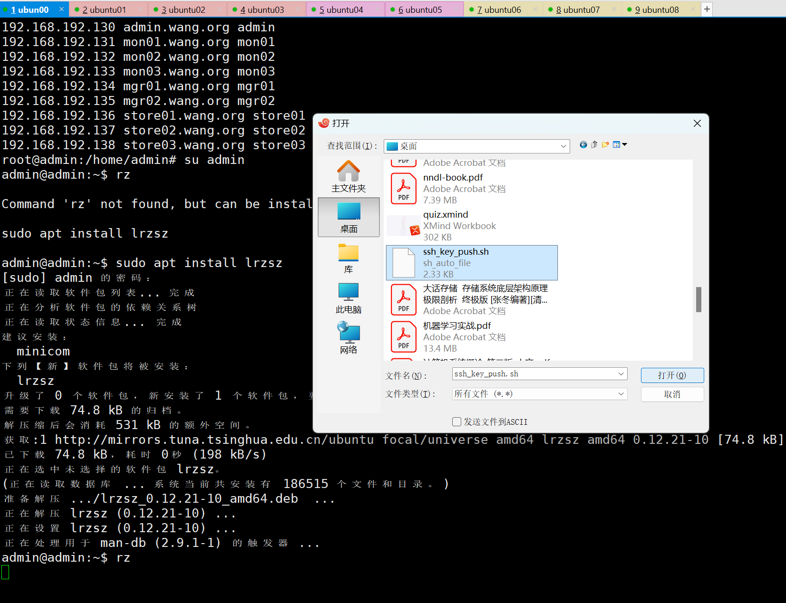

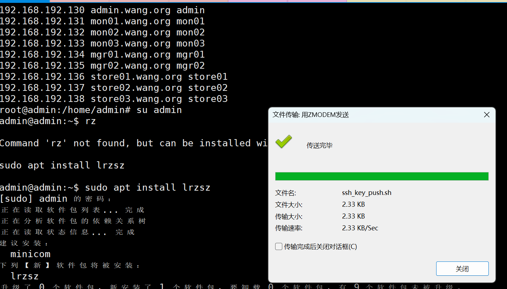

脚本执行

```shell
bash ssh_key_push.sh
```

### 2.1.2 创建ceph集群的管理员账号

接下来操作，基本都在 admin 这个管理节点的主机上运行，基于安全考虑不用root用户管理，倾向与用一个普通用户来操作

由于后续安装软件，涉及root用户权限，所以这个普通用户最好具备 sudo 的权限

此管理用户名称不能使用ceph名称，ceph后续会自动创建此用户

**方法1** 

```shell
# 在所有主机上创建普通用户
useradd -m -s /bin/bash cephadm
echo cephadm:123456 / chpasswd

# 为用户配置root权限
echo "cephadm ALL = (root) NOPASSWD:ALL" > /etc/sudoers.d/cephadm
chmod 0440 /etc/sudoers.d/cephadm
```

**方法2**

脚本实现批量创建用户

```shell
#用脚本实现批量创建用户
cat > create_cephadm.sh <<EOF
# !/bin/bash
# 设定普通用户
useradd -m -s /bin/bash cephadm
echo cephadm:123456 | chpasswd
echo "cephadm ALL=(ALL) NOPASSWD:ALL" > /etc/sudoers.d/cephadm
chmod 0440 /etc/sudoers.d/cephadm
EOF
#批量执行
for i in {130..138}; do ssh root@192.168.192.$i bash < create_cephadm.sh ; done
```

检测是否创建用户

```shell
ll /etc/passwd
cat /etc/sudoers.d/
```

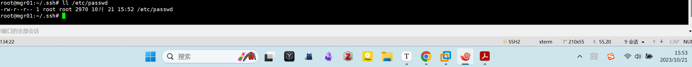

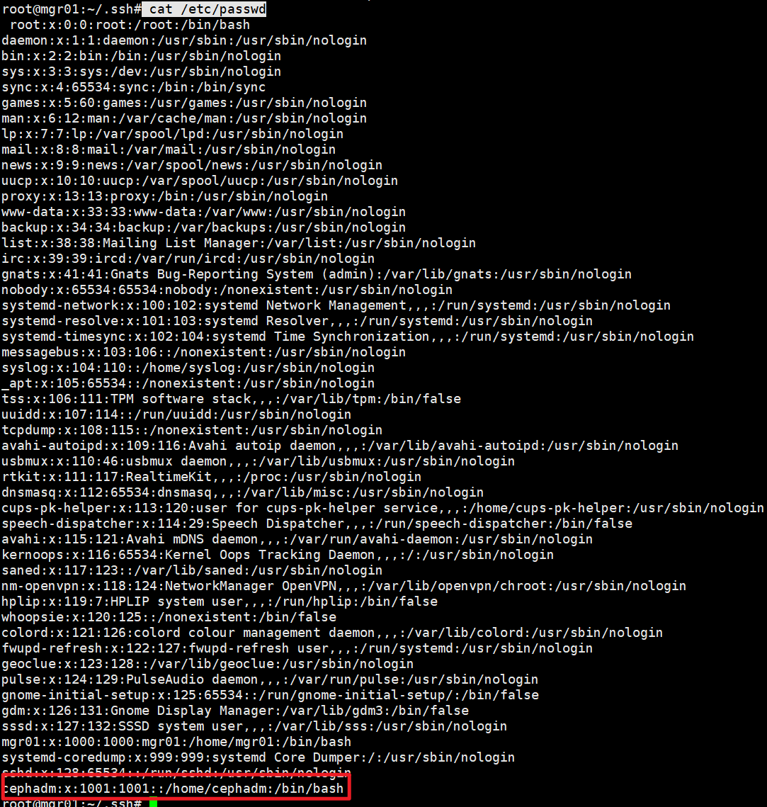

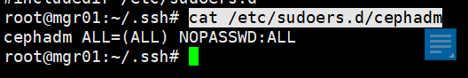

#### 所有主机通过cephadm用户实现免密登录

```shell
su - cephadm
ssh-keygen -t rsa -P "" -f ~/.ssh/id_rsa

#跨主机密码认证
PASS=123456
for i in {130..138};do
	sshpass -p $PASS ssh-copy-id -o StrictHostKeyChecking=no cephadm@192.168.192.$i
done

vim .bashrc
```

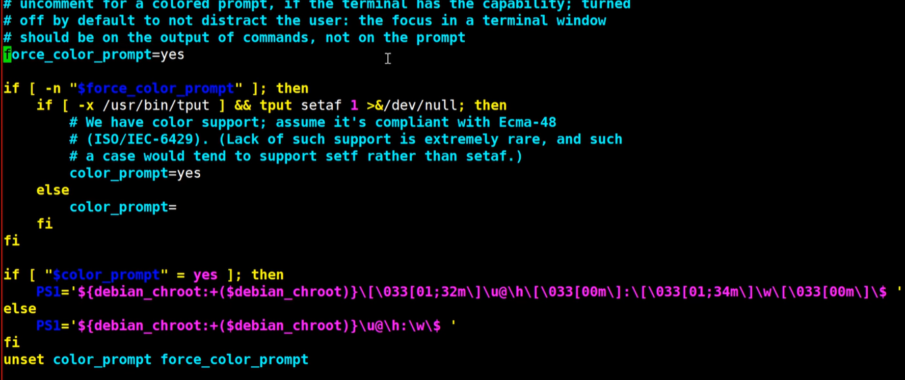

### 2.1.3 管理主机节点部署ceph的安装环境

#### 在所有节点配置安装源

```shell
#在管理节点准备脚本,注意以root身份执行
[root@admin ~]cat > ceph_repo.sh <<EOF
#!/bin/bash
# 更新ceph的软件源信息
echo "deb https://mirror.tuna.tsinghua.edu.cn/ceph/debian-pacific/ $(lsb_release -sc) main" > /etc/apt/sources.list.d/ceph.list 
wget -q -O- 'https://download.ceph.com/keys/release.asc' | apt-key add - 
apt update
EOF

#因为所有节点都会依赖于这些apt源信息，需要进行同步
[root@admin ~]for i in {130..138};do ssh -o StrictHostKeyChecking=no 192.168.192.$i bash < ceph_repo.sh;done

# 去其他结点查看
cat /etc/apt/sources.list.d/ceph.list
```

#### admin节点主机安装ceph-deploy工具

```shell
#安装
cephadm@admin:~$sudo apt-cache madison ceph-deploy # 查看版本
cephadm@admin:~$sudo apt -y install ceph-deploy

#验证成功和查看版本
cephadm@admin:~$ceph-deploy --version
2.0.1

#查看帮助手册
cephadm@admin:~$ceph-deploy --help
# new：开始部署一个新的ceph 存储集群，并生成CLUSTER.conf 集群配置文件和keyring 认证文件。
#install: 在远程主机上安装ceph 相关的软件包, 可以通过--release 指定安装的版本。
# rgw：管理RGW 守护程序(RADOSGW,对象存储网关)。
# mgr：管理MGR 守护程序(ceph-mgr,Ceph Manager DaemonCeph 管理器守护程序)。
# mds：管理MDS 守护程序(Ceph Metadata Server，ceph 源数据服务器)。
# mon：管理MON 守护程序(ceph-mon,ceph 监视器)。
#gatherkeys：从指定的获取提供新节点验证keys，这些keys 会在添加新的MON/OSD/MD 加入的时候使用。
# disk：管理远程主机磁盘。
# osd：在远程主机准备数据磁盘，即将指定远程主机的指定磁盘添加到ceph 集群作为osd 使用。
# repo： 远程主机仓库管理。
# admin：推送ceph集群配置文件和client.admin 认证文件到远程主机。
# config：将ceph.conf 配置文件推送到远程主机或从远程主机拷贝。
# uninstall：从远端主机删除安装包。
# urgedata：从/var/lib/ceph 删除ceph 数据,会删除/etc/ceph 下的内容。
# purge: 删除远端主机的安装包和所有数据。
# forgetkeys：从本地主机删除所有的验证keyring, 包括client.admin, monitor, bootstrap 等认证文件。
# pkg： 管理远端主机的安装包。
# calamari：安装并配置一个calamari web 节点，calamari 是一个web 监控平台。
```

#### 集群初始化

初始化第一个mon节点，准备创建集群

> 只是生成一些配置，并未做实际安装

初始化第一个mon节点的命令格式为 `ceph-deploy new {initial-monitor-node(s)}`

- mon01 即为第一个mon结点名称，其名称必须与节点当前实际使用的主机名称(uname -n) 保持一致，即可以是短名称，也可以是长名称
- 但短名称会导致错误： ceph-deploy new: error: hostname: xxx is not resolvable
- 推荐使用完整写法：`hostname:fqdn` 如：`mon01:mon01.wang.org`

```shell
#首先在管理节点上以cephadm用户创建集群相关的配置文件目录
cephadm@admin:~$mkdir ceph-cluster && cd ceph-cluster
#运行如下命令即可生成初始配置：
cephadm@admin:~/ceph-cluster$ ceph-deploy new --public-network 192.168.192.0/24 --cluster-network 192.168.252.0/24 mon01:mon01.wang.org
# ceph.conf #自动生成的配置文件
# ceph-deploy-ceph.log #初始化日志
# ceph.mon.keyring #用于ceph mon 节点内部通讯认证的秘钥环文件

cat ceph.conf
[global]
fsid = e9664a14-197f-4bfe-bc2e-e585ba02fa4c
public_network = 192.168.192.0/24
cluster_network = 192.168.252.0/24
#可以用逗号做分割添加多个mon 节点
mon_initial_members = mon01
mon_host = 192.168.192.131
auth_cluster_required = cephx
auth_service_required = cephx
auth_client_required = cephx

#注意：如果部署过程出现问题，需要清空
ceph-deploy forgetkeys
ceph-deploy purge mon0{1,2,3} mgr0{1,2} store0{1,2,3}
ceph-deploy purgedata mon0{1,2,3} mgr0{1,2} store0{1,2,3}
rm ceph.*

#如果想要一下子将所有的mon节点都部署出来，我们可以执行下面的命令
ceph-deploy new --public-network 192.168.192.130/24 --cluster-network 192.168.252.0/24 mon01:mon01.wang.org mon02:mon02.wang.org mon03:mon03.wang.org

cephadm@admin:~/ceph-cluster$ cat ceph.conf
[global]
fsid = a168efb2-3012-48b3-aac7-31a11c232235
public_network = 192.168.192.130/24
cluster_network = 192.168.252.0/24
mon_initial_members = mon01, mon02, mon03
mon_host = 192.168.192.131,192.168.192.132,192.168.192.133
auth_cluster_required = cephx
auth_service_required = cephx
auth_client_required = cephx
```

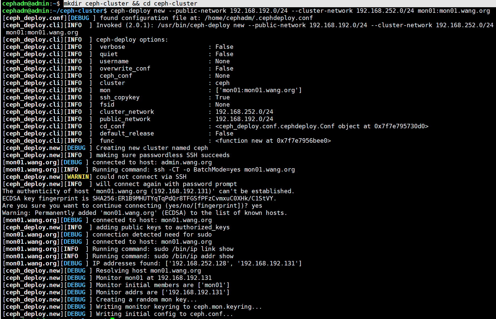

没出这个问题

- 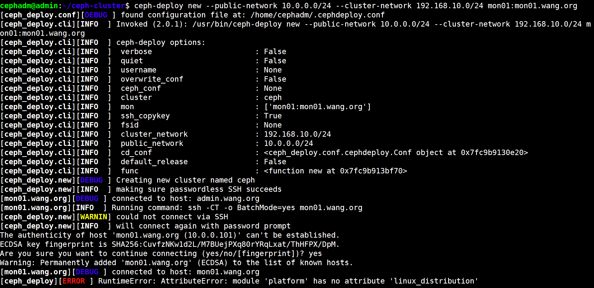

  ```shell
  #原因分析：因为 python3.8 已经没有这个方法了
  cephadm@admin:~/ceph-cluster$ dpkg -l python3
  期望状态=未知(u)/安装(i)/删除(r)/清除(p)/保持(h)
  | 状态=未安装(n)/已安装(i)/仅存配置(c)/仅解压缩(U)/配置失败(F)/不完全安装(H)/触发器等待
  (W)/触发器未决(T)
  |/ 错误?=(无)/须重装(R) (状态，错误：大写=故障)
  ||/ 名称 版本 体系结构 描述
  +++-==============-==============-============-
  =========================================================================
  ii python3 3.8.2-0ubuntu2 amd64 interactive high-level objectoriented
  language (default python3 version)
  #解决方法：
  cephadm@admin:~/ceph-cluster$sudo vim /usr/lib/python3/distpackages/ ceph_deploy/hosts/remotes.py
  
  def platform_information(_linux_distribution=None):
  	""" detect platform information from remote host """
  	行首加#号注释下面两行
  	#linux_distribution = _linux_distribution or platform.linux_distribution
  	# distro, release, codename = linux_distribution()
  	
  	在上面两行下面添加下面6行
  	distro = release = codename = None
  	try:
  		linux_distribution = _linux_distribution or platform.linux_distribution
  		distro, release, codename = linux_distribution()
  	except AttributeError:
  		pass
  	.......
  ```

  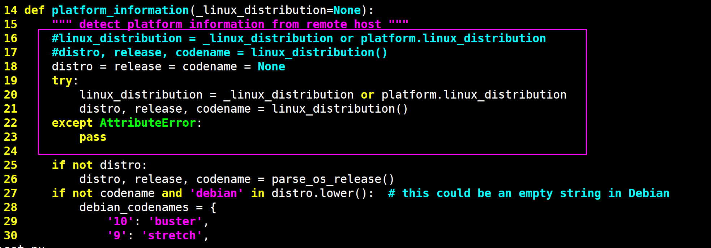

### 2.1.4 mon节点安装软件

初始化存储节点等于在存储节点安装了ceph 及ceph-rodsgw 安装包

```shell
#命令格式：
ceph-deploy install {ceph-node} [{ceph-node} ...]
#注意：这里主要是ceph的工作角色的的节点
#方法1:使用ceph-deploy命令能够以远程的方式连入Ceph集群各节点完成程序包安装等操作
# 一般情况下，不推荐使用这种直接的方法来进行安装，效率太低，实际上也是在各节点上执行方法2
ceph-deploy install mon01 mon02 mon03

#还有另外一种方法，手工在所有节点上安装ceph软件
apt install -y ceph ceph-osd ceph-mds ceph-mon radosgw
```

如：在mon010203上安装mon相关的包

```shell
#在mon节点安装mon组件
cephadm@admin:~/ceph-cluster$ ceph-deploy install --no-adjust-repos --nogpgcheck --mon mon01 mon02 mon03

#或者直接在mon节点安装软件
[root@mon01 ~] apt -y install ceph-mon
```

安装完成后，发现创建了ceph用户

```shell
#自动创建ceph用户
[root@mon01 ~] getent passwd ceph
```

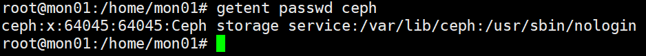

验证在mon 节点已经自动安装并启动了ceph-mon 服务，并且后期在ceph-deploy 节点初始化目录会生成一些bootstrap ceph mds/mgr/osd/rgw 等服务的keyring 认证文件，这些初始化文件拥有对ceph 集群的最高权限，所以一定要保存好。

```shell
#查看到mon01节点安装了ceph相关的包
[root@mon01 ~] dpkg -l |grep ceph

#自动运行相关进程
[root@mon01 ~] ps aux|grep ceph
```

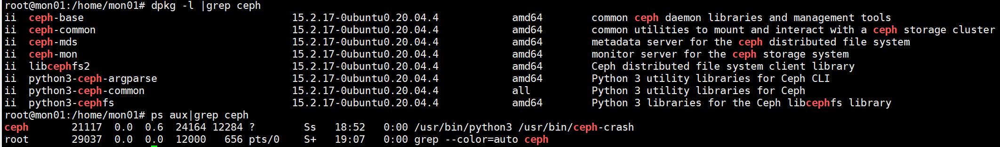

### 2.1.5 集群认证和管理

#### 初始化mon节点生成配置信息并分发密钥

```shell
#配置初始化MON节点,同时向所有节点同步配置
cephadm@admin:~/ceph-cluster$ ceph-deploy --overwrite-conf mon create-initial
#注意：为了避免因为认证方面导致的通信失败，推荐使用 --overwrite-conf 参数

#如果是在一个现有的环境上部署业务，可以先推送基准配置文件
ceph-deploy --overwrite-conf config push mon01 mon02 mon03
```

范例: 初始化 mon 节点

```shell
cephadm@admin:~/ceph-cluster$ ceph-deploy --overwrite-conf mon create-initial
[ceph_deploy.gatherkeys][INFO  ] Storing ceph.client.admin.keyring
[ceph_deploy.gatherkeys][INFO  ] Storing ceph.bootstrap-mds.keyring
[ceph_deploy.gatherkeys][INFO  ] Storing ceph.bootstrap-mgr.keyring
[ceph_deploy.gatherkeys][INFO  ] keyring 'ceph.mon.keyring' already exists
[ceph_deploy.gatherkeys][INFO  ] Storing ceph.bootstrap-osd.keyring
[ceph_deploy.gatherkeys][INFO  ] Storing ceph.bootstrap-rgw.keyring
[ceph_deploy.gatherkeys][INFO  ] Destroy temp directory /tmp/tmpf0cb5m1s

#生成配置文件
cephadm@admin:~/ceph-cluster$ ls
ceph.bootstrap-mds.keyring 引导启动 mds的密钥文件
ceph.bootstrap-mgr.keyring 引导启动 mgr的密钥文件
ceph.bootstrap-osd.keyring 引导启动 osd的密钥文件
ceph.bootstrap-rgw.keyring 引导启动 rgw的密钥文件
ceph.client.admin.keyring ceph客户端和管理端通信的认证密钥，是最重要的
ceph.conf
ceph-deploy-ceph.log
ceph.mon.keyring
#结果显示：这里生成了一系列的与ceph集群相关的 认证文件
#注意：ceph.client.admin.keyring 拥有ceph集群的所有权限，一定不能有误。
```

这时在mon01上启动了一些进程

```shell
#到mon的节点上查看mon的自动开启相应的守护进程
[root@mon01 ~]ps aux|grep ceph
```

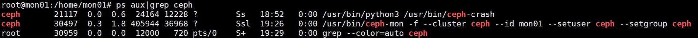

#### 推送密钥实现集群的管理

为了后续的监控环境认证操作，在admin角色主机上，把配置文件和admin密钥拷贝到Ceph集群各监控角色节点mon

> 若不在这些mon节点机器上管理集群，则不需要这一步

```shell
##注意：原则上要求，所有mon节点上的 ceph.conf 内容必须一致，如果不一致的话，可以通过下面命令同步
ceph-deploy --overwrite-conf config push mon01 mon02 mon03

#执行集群的认证文件的拷贝动作
ceph-deploy admin --help
usage: ceph-deploy admin [-h] HOST [HOST ...]

Push configuration and client.admin key to a remote host.

positional arguments:
	HOST 	host to configure for Ceph administration

optional arguments:
	-h, --help show this help message and exit

ceph-deploy admin mon01 mon02 mon03
```

如：在mon节点实现集群管理

```shell
#拷贝前效果
[root@mon01 ~] ls /etc/ceph/
ceph.conf  rbdmap  tmpk0vsd0on
root@mon02:/home/mon02# ls /etc/ceph
ceph.conf  rbdmap  tmprm7hc0mf
root@mon03:~# ls /etc/ceph/
ceph.conf  rbdmap  tmp1mrnb7qm

cephadm@admin:~/ceph-cluster$ ceph-deploy admin mon01 mon02 mon03

#查看效果
root@mon01:/home/mon01# ls /etc/ceph/
ceph.client.admin.keyring  ceph.conf  rbdmap  tmpk0vsd0on
root@mon02:/home/mon02# ls /etc/ceph
ceph.client.admin.keyring  ceph.conf  rbdmap  tmprm7hc0mf
root@mon03:~# ls /etc/ceph/
ceph.client.admin.keyring  ceph.conf  rbdmap  tmp1mrnb7qm
#结果显示：这里多了一个 ceph的客户端与服务端进行认证的密钥文件了。
# ceph.client.admin.keyring 主要用于 ceph客户端与管理端的一个通信认证。
#注意：如果我们不做交互式操作的话，这个文件可以不用复制。
root@mon01:/home/mon01# cat /etc/ceph/ceph.client.admin.keyring 
[client.admin]
	key = AQAyrTRl2m24GBAAT5lAYOvgyOejaU4URoZCUw==
	caps mds = "allow *"
	caps mgr = "allow *"
	caps mon = "allow *"
root@mon02:/home/mon02# cat /etc/ceph/ceph.client.admin.keyring 
[client.admin]
	key = AQAyrTRl2m24GBAAT5lAYOvgyOejaU4URoZCUw==
	caps mds = "allow *"
	caps mgr = "allow *"
	caps mon = "allow *"
	caps osd = "allow *"
root@mon03:~# cat /etc/ceph/ceph.client.admin.keyring 
[client.admin]
	key = AQAyrTRl2m24GBAAT5lAYOvgyOejaU4URoZCUw==
	caps mds = "allow *"
	caps mgr = "allow *"
	caps mon = "allow *"
	caps osd = "allow *"
```

问题：虽然我们把认证文件传递给对应的监控角色主机了，但是我们的管理机是通过普通用户cephadm来进行交流的。而默认情况下，传递过去的认证文件，cephadm普通用户是无法正常访问的，如下：

```shell
[root@mon01 ~] ll /etc/ceph/
#cephadm用户执行命令因文件权限会出错
[root@mon01 ~] su - cephadm
[cephadm@mon01 ~]$ceph -s
```

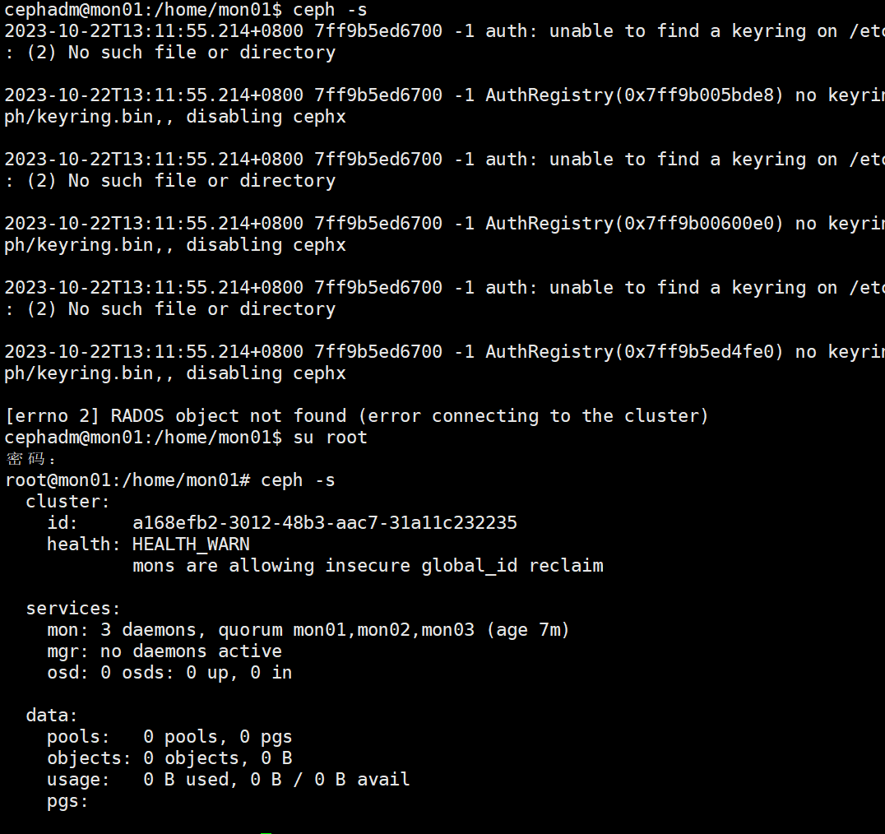

需要在Ceph集群中需要运行ceph命令的节点上，以root用户的身份设定普通用户cephadm能够读取/etc/ceph/ceph.client.admin.keyring文件的权限。

```shell
[root@mon01,02,03 ~] sudo apt install acl
[root@mon01,02,03 ~] sudo setfacl -m u:cephadm:r /etc/ceph/ceph.client.admin.keyring
```

然后监控节点就可以自己来收集相关的数据了，比如我们在mon01上执行如下命令

```shell
[root@mon01 ~] su - cephadm

#查看状态
[cephadm@mon01 ~]$ceph -s

#集群状态不正常的原因，我们可以通过 ceph health命令来进行确认，效果如下
[cephadm@mon01 ~]$ceph health
```

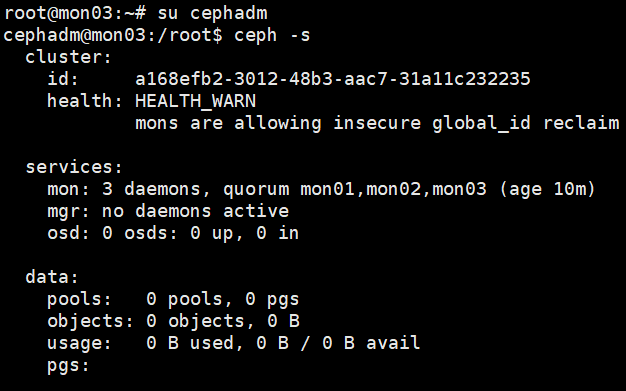

### 2.1.6 部署集群的管理节点实现远程管理

在哪个主机上管理集群，就在哪个集群上安装 `ceph-common`

当前的这些状态查看，只能到对应的节点主机上来进行，这个ceph命令是依赖于 ceph-common软件的。

其实为了方便集群的管理，一般会通过远程的方式来进行远程主机状态的查询。

```shell
#1.安装管理工具包
cephadm@admin:~/ceph-cluster$sudo apt -y install ceph-common

#自动生成目录和配置文件
cephadm@admin:~/ceph-cluster$ ls /etc/ceph/
rbdmap

#2. 推送配置和相关key文件到管理节点
cephadm@admin:~/ceph-cluster$ceph-deploy admin admin

#验证文件
cephadm@admin:~/ceph-cluster$ ls /etc/ceph/
ceph.client.admin.keyring  ceph.conf  rbdmap  tmpzp2_08ah

#3. 一些文件因为权限问题无法复制，需要acl修改权限后复制
cephadm@admin:~/ceph-cluster$sudo apt install acl -y
cephadm@admin:~/ceph-cluster$sudo setfacl -m u:cephadm:rw /etc/ceph/ceph.client.admin.keyring

#检查效果
cephadm@admin:~/ceph-cluster$ ceph -s
  cluster:
    id:     75c70a9d-790a-4859-9374-39159d37eca1
    health: HEALTH_WARN
            mon is allowing insecure global_id reclaim
 
  services:
    mon: 1 daemons, quorum mon01 (age 31m)
    mgr: no daemons active
    osd: 0 osds: 0 up, 0 in
 
  data:
    pools:   0 pools, 0 pgs
    objects: 0 objects, 0 B
    usage:   0 B used, 0 B / 0 B avail
    pgs:  

#消除 mon is allowing insecure global_id reclaim的报警信息
cephadm@admin:~/ceph-cluster$ ceph config set mon auth_allow_insecure_global_id_reclaim false

#再次查看没有告警信息
cephadm@admin:~/ceph-cluster$ ceph -s
```

### 2.1.7 部署mgr节点

Ceph-MGR工作的模式是事件驱动型的，简单来说，就是等待事件，事件来了则处理事件返回结果，又继续等待。
Ceph MGR 事自从 Ceph 12.2 依赖主推的功能之一，是负责 Ceph 集群管理的组件，它主要功能是把集群的一些指标暴露给外界使用。根据官方的架构原则上来说，mgr要有两个节点来进行工作。

对于测试环境其实一个就能够正常使用了,暂时先安装一个节点，后面再安装第二个节点。

#### 安装mgr相关软件

```shell
#方法1:在管理节点远程安装mgr软件到mgr节点
cephadm@admin:~/ceph-cluster$ ceph-deploy install --mgr mgr01

#方法2:在mgr01节点手动安装软件
[root@mgr01 ~] apt -y install ceph-mgr

#发现安装了相关包
[root@mgr01 ~] dpkg -l | grep ceph
```

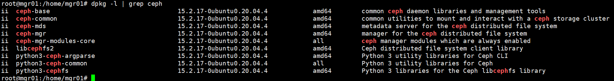

#### 配置Mgr节点启动ceph-mgr进程

```shell
#创建mgr节点并生成相关配置
cephadm@admin:~/ceph-cluster$ ceph-deploy mgr create mgr01

#自动在mgr01节点生成配置文件和用户
[root@mgr01 ~] ls /etc/ceph/
ceph.conf  rbdmap  tmp8zt3kkj8

[root@mgr01 ~] getent passwd ceph
ceph:x:64045:64045:Ceph storage service:/var/lib/ceph:/usr/sbin/nologin

#开启相关进程
[root@mgr01 ~] ps aux|grep ceph
ceph       35476  0.0  0.5  24468 11532 ?        Ss   20:45   0:00 /usr/bin/python3 /usr/bin/ceph-crash
ceph       43250  8.3  8.9 897816 176364 ?       Ssl  20:54   0:05 /usr/bin/ceph-mgr -f --cluster ceph --id mgr01 --setuser ceph --setgroup ceph
root       43375  0.0  0.0  12000   720 pts/2    S+   20:55   0:00 grep --color=auto ceph

#查看集群状态
cephadm@admin:~/ceph-cluster$ ceph -s
#结果显示：这个时候，service上，多了一个mgr的服务，在mgr01节点上，服务状态是 active。
```

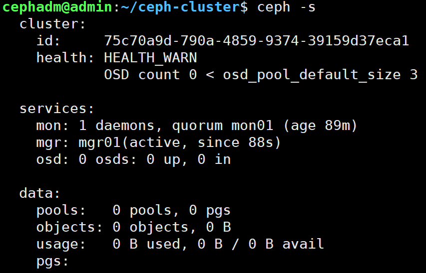

### 2.1.8 部署 OSD 存储节点

要设置OSD环境，一般执行下面步骤：

- 要知道对应的主机上有哪些磁盘可以提供给主机来进行正常的使用。
- 格式化磁盘(非必须)
- ceph擦除磁盘上的数据
- 添加osd

#### 准备

```shell
#所有的存储节点主机都准备了两块额外的磁盘，
[root@store01 ~] lsblk
NAME   MAJ:MIN RM   SIZE RO TYPE MOUNTPOINT
loop0    7:0    0  63.3M  1 loop /snap/core20/1828
loop1    7:1    0     4K  1 loop /snap/bare/5
loop2    7:2    0  63.5M  1 loop /snap/core20/2015
loop3    7:3    0 346.3M  1 loop /snap/gnome-3-38-2004/119
loop4    7:4    0 349.7M  1 loop /snap/gnome-3-38-2004/143
loop5    7:5    0  91.7M  1 loop /snap/gtk-common-themes/1535
loop6    7:6    0    46M  1 loop /snap/snap-store/638
loop7    7:7    0  49.9M  1 loop /snap/snapd/18357
loop8    7:8    0  40.9M  1 loop /snap/snapd/20290
sda      8:0    0    20G  0 disk 
├─sda1   8:1    0   512M  0 part /boot/efi
├─sda2   8:2    0     1K  0 part 
└─sda5   8:5    0  19.5G  0 part /
sdb      8:16   0    20G  0 disk 
sdc      8:32   0    20G  0 disk 
sr0     11:0    1   4.1G  0 rom  /media/store01/Ubuntu 20.04.6 LTS amd64

#如果不想查看大量无效设备的话，可以执行下面清理操作
sudo apt autoremove --purge snapd -y
```

#### 安装OSD存储结点相关软件

```shell
#1. 确认仓库配置
[root@store01 ~] cat /etc/apt/sources.list.d/ceph.list
deb https://mirror.tuna.tsinghua.edu.cn/ceph/debian-pacific/ focal main wget -q -O- https://download.ceph.com/keys/release.asc

#2. 安装OSD相关软件
#方法1: 在管理节点远程安装
cephadm@admin:~/ceph-cluster$ ceph-deploy install --release pacific --osd store01 
#方法2: 在OSD主机手动安装
[root@store01 ~] apt -y install ceph-osd

#3. 确认安装结果
#自动生成用户ceph
[root@store01 ~] tail -n1 /etc/passwd
[root@store01 ~] dpkg -l |grep ceph
ii ceph-base 16.2.14-1focal amd64 common ceph daemon libraries and management tools
ii ceph-common 16.2.14-1focal amd64 common utilities to mount and interact with a ceph storage cluster
ii ceph-osd 16.2.14-1focal amd64 OSD server for the ceph storage system
ii libcephfs2 16.2.14-1focal amd64 Ceph distributed file system client library
ii python3-ceph-argparse 16.2.14-1focal all Python 3 utility libraries for Ceph CLI
ii python3-ceph-common 16.2.14-1focal all Python 3 utility libraries for Ceph
ii python3-cephfs 16.2.14-1focal amd64 Python 3 libraries for the Ceph libcephfs library

[root@store01 ~] ls /etc/ceph/

[root@store01 ~] ps aux|grep ceph
ceph       30953  0.0  0.6  24164 11940 ?        Ss   21:18   0:00 /usr/bin/python3.8 /usr/bin/ceph-crash
store01    39320  0.0  0.0  12000   716 pts/1    S+   21:22   0:00 grep --color=auto ceph
```

#### 查看所有可用的osd磁盘

```shell
#检查并列出OSD节点上所有可用的磁盘的相关信息
cephadm@admin:~/ceph-cluster$ ceph-deploy disk list store01
```

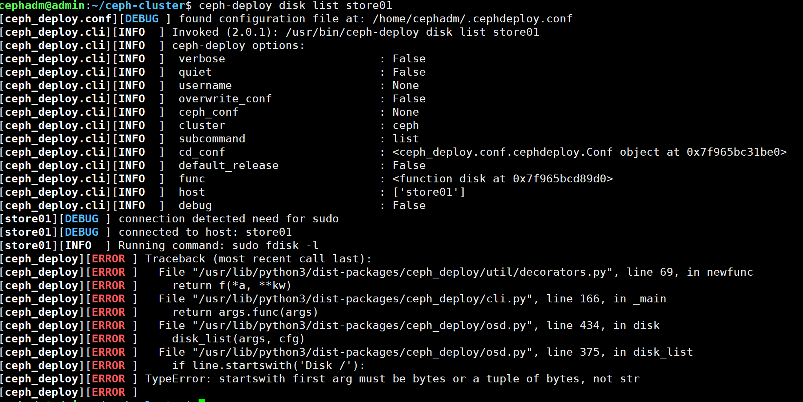

报错原因是 python 版本问题

```shell
# 修改375行,将 if line.startswith('Disk /'): 更改为 if line.startswith(b'Disk /')
#只在'Disk前加一个字母 b 即可
cephadm@admin:~$sudo vim +375 /usr/lib/python3/dist-packages/ceph_deploy/osd.py
```

```shell
cephadm@admin:~/ceph-cluster$ ceph-deploy disk list store01
```

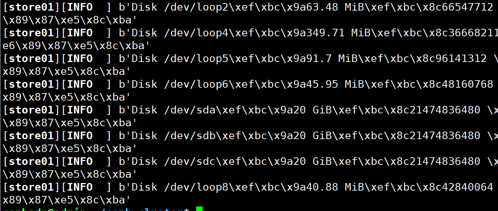

##### 清除OSD磁盘数据

在管理节点上使用ceph-deploy命令擦除计划专用于OSD磁盘上的所有分区表和数据以便用于OSD

注意: 如果硬盘是无数据的新硬盘此步骤可以不做

```shell
ceph-deploy disk zap [-h] [--debug] [HOST] DISK [DISK ...]
#说明此操操作本质上就是执行dd if=/dev/zero of=disk bs=1M count=10
```

如：

```shell
cephadm@admin:~/ceph-cluster$for i in {1..3};do ceph-deploy disk zap store0$i /dev/sdb /dev/sdc;done
```

#### 配置OSD存储结点

对于OSD的相关操作，可以通过 `ceph-deploy osd` 命令来进行，帮助信息如下

```shell
#查看帮助
cephadm@admin:~/ceph-cluster$ ceph-deploy osd --help

#帮助显示：这里提示了两类的存储机制：
#默认情况下用的就是 bluestore类型
#对于bluestore来说，它主要包括三类数据：
--data /path/to/data #ceph 保存的对象数据
--block-db /path/to/db-device #数据库,即为元数据
--block-wal /path/to/wal-device #数据库的 wal 日志
#生产建议data和wal日志分别存放

#对于filestore来说，它主要包括两类数据
--data /path/to/data #ceph的文件数据
--journal /path/to/journal #文件系统日志数据

#对于 osd来说，它主要有两个动作：
list 列出osd相关的信息
create 创建osd设备
```

如: 创建OSD存储所有信息都存储在一起

```shell
cephadm@admin:~/ceph-cluster$ ceph-deploy --overwrite-conf osd create store01 --data /dev/sdb
#查看命令执行后的ceph的集群状态
cephadm@admin:~/ceph-cluster$ ceph -s
#查看osd状态
cephadm@admin:~/ceph-cluster$ ceph osd status
```

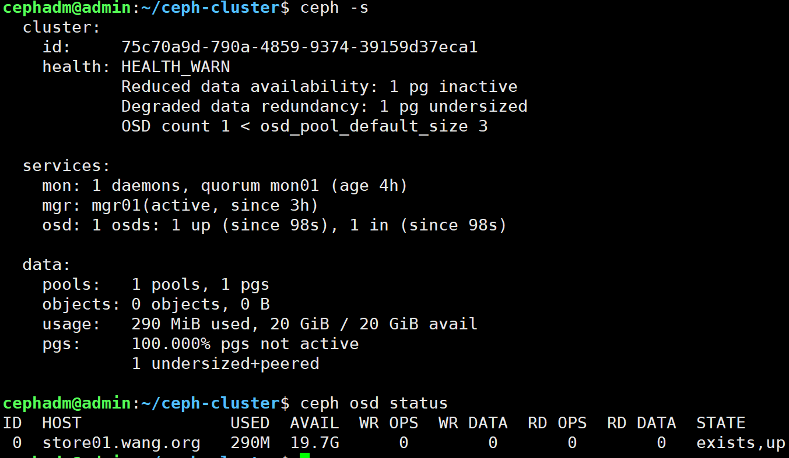

```shell
cephadm@admin:~/ceph-cluster$ ceph-deploy osd list store01

#查看自动启动相关进程
[root@store01 ~] ps aux|grep ceph

#将第二块磁盘也加入OSD
cephadm@admin:~/ceph-cluster$ ceph-deploy --overwrite-conf osd create store01 --data /dev/sdc

#每个磁盘对应一个OSD进程
[root@store01 ~] ps aux|grep ceph
```

- 每个磁盘生成对应的一个逻辑卷
- 每个osd磁盘生成一个service

#### 添加后续所有OSD结点的磁盘

```shell
#安装软件
#方法1: 在管理节点远程安装
cephadm@admin:~/ceph-cluster$ ceph-deploy install --release pacific --osd store02 store03
#方法2: 在OSD主机手动安装
[root@store02 ~]#apt -y install ceph-osd
[root@store03 ~]#apt -y install ceph-osd


#接下来通过批量操作的方式，将其他节点主机的磁盘都格式化
for i in {2..3};do
	ceph-deploy --overwrite-conf osd create store0$i --data /dev/sdb
	ceph-deploy --overwrite-conf osd create store0$i --data /dev/sdc
done
```

### 2.1.9 查看集群最终状态

```shell
cephadm@admin:~/ceph-cluster$ ceph -s
  cluster:
    id:     75c70a9d-790a-4859-9374-39159d37eca1
    health: HEALTH_OK
 
  services:
    mon: 1 daemons, quorum mon01 (age 4h)
    mgr: mgr01(active, since 3h)
    osd: 6 osds: 6 up (since 75s), 6 in (since 75s)
 
  data:
    pools:   1 pools, 1 pgs
    objects: 0 objects, 0 B
    usage:   1.7 GiB used, 118 GiB / 120 GiB avail
    pgs:     1 active+clean
    
# 查看管理配置完毕后的osd数量
cephadm@admin:~/ceph-cluster$ ceph-deploy osd list store0{1..3}

#查看状态
cephadm@admin:~/ceph-cluster$ ceph osd status
```

### 2.1.10 扩展高可用

#### 实现mgr节点高可用

当前只有一个Mgr节点主机,存在SPOF,添加新的Mgr节点实现高可用

Ceph Manager守护进程以Active/Standby模式运行，部署其它ceph-mgr守护程序可确保在Active节点或其上的ceph-mgr守护进程故障时，其中的一个Standby实例可以在不中断服务的情况下接管其任务。

注意:如果所有Mgr节点故障,将集群将无法正常工作

添加后续的Mgr节点命令格式

```shell
ceph-deploy mgr create 节点名称
```

如：

```shell
#1. 在新mgr结点上安装mgr软件
#方法1:在管理节点远程在mgr02节点上安装Mgr软件
cephadm@admin:~/ceph-cluster$ ceph-deploy install --mgr mgr02
#方法2:在mgr02节点手动安装软件
[root@mgr02 ~]#apt -y install ceph-mgr

#2. 添加第二个 Mgr节点
cephadm@admin:~/ceph-cluster$ ceph-deploy mgr create mgr02

#3. 查看
cephadm@admin:~/ceph-cluster$ ceph -s
#结果显示：mgr01节点就是主角色节点，mgr02是从角色节点。
#关闭mgr01节点,mgr02节点自动成为active节点
[root@mgr01 ~]#poweroff
[root@admin ~]#ceph -s
```

#### 扩展mon结点高可用

当前只有一个mon结点主机，存在SPOF，添加新的mon结点实现高可用

如果 $n$ 个结点，至少需要保证 $\frac{n}{2}$ 个以上的健康mon结点，ceph集群才能正常使用

```shell
#先在新mon节点安装mon软件
ceph-deploy install --mon mon节点名称
#添加后续的mon节点命令
ceph-deploy mon add mon节点名称
#注意：如果add换成destroy，则变成移除mon节点
```

如：

```shell
#1. 在新的mon结点安装mon软件
#方法1:在mon02节点上安装mon软件
cephadm@admin:~/ceph-cluster$ ceph-deploy install --mon mon02
#方法2:在mon02节点手动安装mon软件也可以
[root@mon02 ~] apt -y install ceph-mon

#2. 添加在mon02节点
cephadm@admin:~/ceph-cluster$ ceph-deploy mon add mon02

#3. 添加mon03节点
cephadm@admin:~/ceph-cluster$ ceph-deploy install --mon mon03
cephadm@admin:~/ceph-cluster$ ceph-deploy mon add mon03

#4. 修改ceph配置添加后续的Mon节点信息
cephadm@admin:~/ceph-cluster$vim ceph.conf
mon_host = 192.168.192.131,192.168.192.132,192.168.192.133
#同步ceph配置文件到所有ceph节点主机
cephadm@admin:~/ceph-cluster$ ceph-deploy --overwrite-conf config push admin mon0{1,2,3} mgr0{1,2} store0{1,2,3}

#5. 重新生成初始化配置信息
ceph-deploy --overwrite-conf mon create-initial
#注意：为了避免因为认证方面导致的通信失败，推荐使用 --overwrite-conf 参数
#如果是在一个现有的环境上部署业务，可以先推送基准配置文件
ceph-deploy --overwrite-conf config push mon01 mon02 mon03

#6. 查看
cephadm@admin:~/ceph-cluster$ ceph -s
```

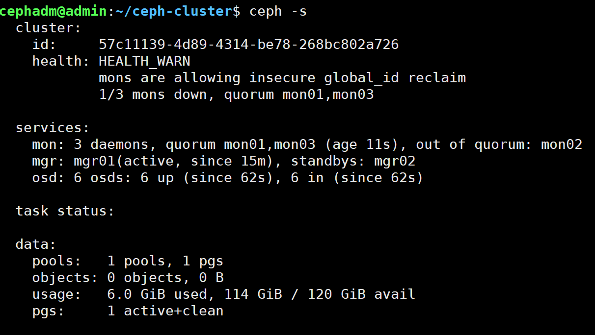

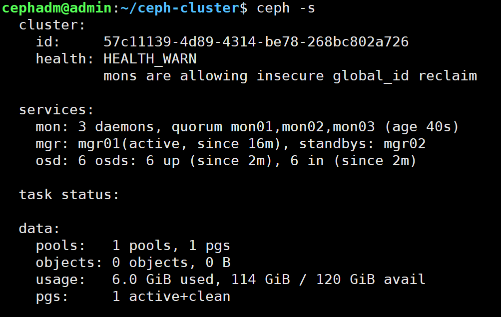

