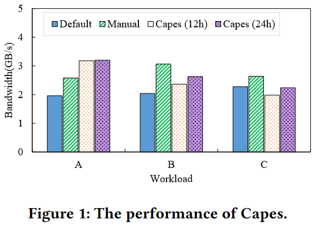
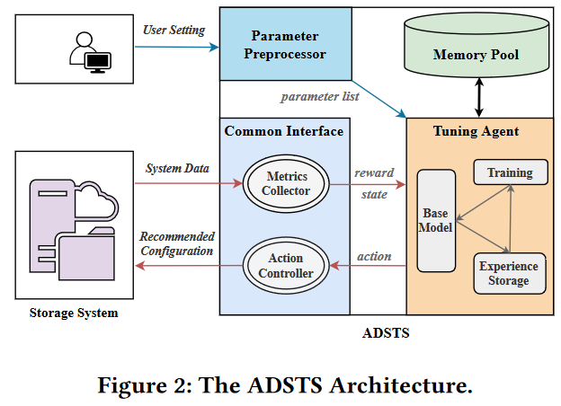
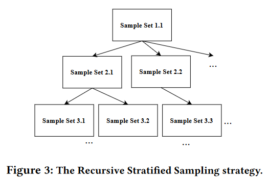
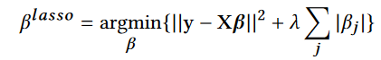
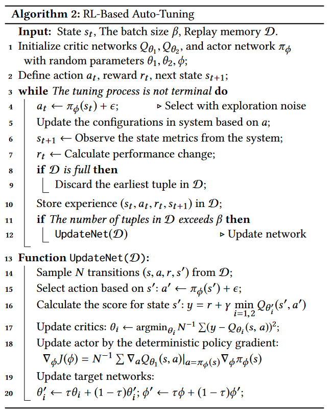
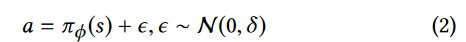
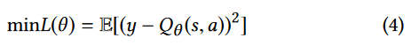
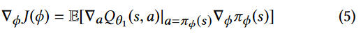

## ADSTS: Automatic Distributed Storage Tuning System Using Deep Reinforcement Learning

> 基于深度强化学习的自动分布式存储调优系统

### MARK

#### 参数剪枝

DSS中的参数约束可以概括为四类：

- C1：不可配置的

  静态硬件模块和用户信息模块（IP地址、端口号、路径字符串）

- C2：具有严格的边界

- C3：决定其他参数是否起作用。

  Ceph提供了Bluestore和文件存储两个不同的存储后端，并使用参数osd_objectstore来决定使用哪个。

- C4：有些参数值是相互依赖的( C4 ):

  比如它们必须有一个固定的总和或者一个必须低于另一个。例如，bluestore_cache _kv _ ratio和bluestore _ cache _ meta _ ratio之和不能超过1。

在模块树中，ADSTS首先对C1C3 剪枝

> 直接去掉决定型参数，不合理
>
> 对Ceph的应用场景做全面分类，场景确定，则C3已经确定
>
> 相当于建立离线初始基模型

工作量导向模型Fine - Tuning

基于相同类型工作负载的最优配置接近，模型具有相同的参数[ 18、33 ]。根据这一发现，用3个工作负载(读密集型、写密集型和读写混合型)离线训练3个基模型。如果已知用户的近似工作负载类型，则使用相应的基模型初始化调优模型。

#### 参数抽样方法

RSS递归分层抽样：替换？

根据这项研究，可能的后续研究方向包括： 

1. 参数处理算法的改进：研究可以进一步改进参数处理算法，包括模块树构建和边界处理，使其更加自动化和高效。

   LASSO对参数重要性排序

2. 调参代理：其他深度强化学习算法的应用：探索其他深度强化学习算法在分布式存储系统自动调优中的应用，比如Proximal Policy Optimization (PPO)、Trust Region Policy Optimization (TRPO)等。 

3. 参数空间的进一步研究：研究分布式存储系统参数空间的特性和规律，探索更加高效的参数搜索和调优方法。 

### AB

#### 分布式系统参数现状+DRL调参现状（局限性）

现代分布式存储系统配置数量巨大、负载难以预测、性能评估困难，对参数调优提出了更高的要求。为分布式存储系统提供一种参数自动调优的解决方案迫在眉睫。大量研究尝试构建基于深度强化学习( RL )的自动调参系统。然而，它们在面对一些要求时存在局限性，包括缺乏参数空间处理、较低级的RL模型和耗时且不稳定的训练过程。

#### 实现步骤

1. 预处理：通用的预处理准则，用于生成标准化的可调参数域（具有增量性质的递归分层抽样(RSS)旨在对庞大的参数空间进行抽样，并采用Lasso回归识别重要参数）
2. 策略：采用双延迟深度确定性策略梯度方法来寻找可调参数的最优值。
3. 算法：采用多处理训练和负载导向的模型微调来加速模型收敛。

#### 结果评估

ADSTS在Park上实现，并在真实系统Ceph中使用。评估结果表明，ADSTS可以在可接受的开销下，推荐接近最优的配置，并将系统性能提升1.5 ×2.5 。

### 1. Intro

#### 1.1 课题来源

##### 1.1.1 课题来源：DSS发展+DSS参数配置复杂=>自动调参亟需

新兴的分布式存储通过为存储大规模数据提供高性价比、高可扩展性和高可靠性的平台，已成为最广泛接受的基础设施服务之一。目前比较流行的分布式存储系统有分布式文件系统( GFS[27]、HDFS[25]、Lustre[9] 等)，分布式对象存储系统(Swift[2]、Ceph[32]等)，分布式块存储系统(Sheepdog[22]、Ursa[15]等)等。

构建一个复杂的DSS（数据存储系统）伴随着许多设计选择，产生了大量可调的配置参数[16、18]。优越的配置设置可以在性能和高服务质量( QoS )方面提供显著的增益。然而，随着数据的爆炸式增长，DSS变得越来越复杂，系统运营商很难改变存储配置以更好地支持不同的用户情况。为DSS提供一个自动参数调优的解决方案是很有必要的。

##### 1.1.2 DSS参数分析：参数空间大+更复杂的参数约束+不可预测的工作负荷较多+调参效果评价难度较大

现代DSS具有以下特点，这给确定最优配置带来了更高的要求和挑战。

1. 较大的参数空间。DSS是具有多层、高度模块化的软件架构、跨越大型网络和由异构存储设备组成的分布式环境。控制系统性能的可调参数有上百个甚至上千个[5,18]。例如，Ceph[32]作为一个具有代表性的DSS，在最新版本中提供了1536个参数，比原始版本大了近3倍。在如此巨大的参数空间中搜索最优设置是具有挑战性的。
2. 更复杂的参数约束。参数可以取多种值，包括连续的、离散的、非数值的等等。更糟糕的是，这些参数有许多取值限制，例如有些参数有严格的界限，有些参数决定其他参数是否起作用。
3. 不可预测的工作负荷较多。在现代存储环境中，由于项目的大量用户和数据，工作负载往往是动态和不可预测的，导致不同的最佳配置设置和不同工作负载之间的样本重用失效。
4. 评价难度较大。评估结果中往往包含随机噪声，这些随机噪声在分布式环境中变得非常显著。取多次试验的平均值是处理噪声的常规方法[5, 18]。但在DSS中，评估单个配置可能需要几分钟甚至几小时，这使得这种方法非常耗时。

#### 1.2 前人不足+引出本课题研究方向

##### 1.2.1 基于学习的TS缺陷

近年来，有许多基于学习的存储系统自动调参研究。例如遗传算法[ 3 ]，模拟退火[ 10 ]，贝叶斯优化[ 4 ]，随机搜索[ 35 ]等。这些传统的策略在DSS中使用时暴露出很大的局限性。

1. 由于参数空间较大，他们无法找到全局最优参数，因为他们反复推荐已经探索过的最佳配置，缺乏探索更多未试用配置组合的能力[33]
2. 其次，它们对动态工作负载的适应性较差，需要频繁地重新训练模型。
3. 最后，它们依赖于大规模高质量的训练样本，由于评估困难而难以获得。

##### 1.2.2 基于DRL的TS：DRL适用于TS+前置研究Capes+缺陷分析

因此，越来越多的研究提出使用深度强化学习( RL )来实现自动调参。利用RL模型强大的学习能力，基于RL的自动调参系统表现出良好的**性能和适应性——衡量指标**，并且不需要大量的样本。尽管基于RL的自动调谐在数据库领域已经有了很大的发展，但它在DSS领域仍处于探索阶段。一个最先进的案例是**Capes [ 16 ]，它采用深度Q网络( DQN )来提高Lustre的性能**。

然而，在实际运行Capes时，我们发现了三个缺陷。

- 缺乏参数空间处理。Capes只人为选取两个参数进行调整，取值范围非常有限。在庞大的参数空间中，影响性能的参数有很多。辨识重要参数也是自整定的重要任务之一。
- 更高级的强化学习模型。强化学习算法发展迅速。原始DQN算法在训练速度和模型能力方面与前沿算法有明显差距。此外，DQN是一种面向离散的控制算法，即输出的动作是离散的，而DSS中的许多参数可以取连续值。
- 训练耗时长且不稳定。众所周知，RL最大的问题是训练的不稳定性和收敛的困难性。Capes的训练过载比较高，往往需要上千次迭代才能找到最优参数，这在生产环境中是不可接受的。

#### 1.3 本课题如何解决上述缺陷+评价

为了解决这些问题，更好地使用RL模型，本文提出了一种新的自动分布式存储调优系统ADSTS。ADSTS从DSSs的整个参数空间中进行关键参数的采样和选择，并利用先进的强化学习模型自动推荐接近最优的配置。具体来说，ADSTS具有四个关键特征：

1. ADSTS提出了一个通用的预处理准则来处理大参数空间，包括参数剪枝、处理和筛选( § 4.1 )。
2. ADSTS利用递归分层抽样和Lasso回归( § 4.2 , § 4.3)，根据参数对**性能**的影响筛选重要参数。
3. ADSTS通过双延迟深度确定性策略梯度( TD3 )模型构造调优代理，对这些重要参数的取值进行调优，以实现性能最优
4. ADSTS通过多处理训练和工作负载导向的模型微调来解决RL模型训练耗时长的挑战

ADSTS在Park[19]平台上实现，并在真实的分布式存储系统Ceph中使用。评估结果表明，与其他策略相比，ADSTS将Ceph性能提升了1.5 ×2.5 ×。

## 2. 研究背景（分解+课题来源）

背景包括自动调参、参数识别和强化学习的基本概念。动机包括Capes的介绍和缺点。

### 2.1 自动调参

#### 2.1.2 调参对性能提升很重要

对于现代分布式存储系统，性能调优是一项重要但困难的任务，系统操作员收集和分析系统的历史和实时性能指标，并调整参数的值，以便为运行某些工作负载提升一定的性能指标[16, 35]。

#### 2.1.3 调参目前困境

**复杂的工作环境**

一方面，调优对于从部署的系统中获得良好的性能至关重要。随着新存储设备的出现和更复杂的工作负载(特别是在云环境下)，不同用户和不同工作岗位的需求千差万别。默认的配置参数往往导致资源利用率低、性能差。需要根据具体情况对参数进行调整。

**人工经验不足以应对复杂多变的环境+耗时长**

另一方面，在现代存储环境中，参数调优具有挑战性。面对引言中提到的更高要求，即使对于人类专家来说，调优参数也需要耗费大量的时间和漫长的试错过程。更糟糕的是，工作负载可能会随时间变化或具有周期性，并且一个工作负载的最佳配置可能不会对其他工作负载表现得更好。为所有可能的工作负载找到最佳值是昂贵的，几乎是不可能的。对于普通用户来说，调优更是令人望而却步。大多数用户只能简单地回到遵循一个不灵活的、不定制的性能调优指南。然而，许多系统甚至缺乏关于参数和调优指导的功能描述[9，32]，使用户无从下手。

#### 2.1.4 参数筛选——调参困境的一个解决方向

因此，自动参数整定(自整定)应运而生，并在系统优化方面取得了巨大的效益。一个理想的自动参数调整系统可以根据当前的工作负载自动调整所有参数值以获得最优性能。

然而，由于现代系统具有大量的配置参数，穷尽地测试所有可能的参数值组合是非常困难的，这个过程可以持续几周到几个月。大量的研究和我们的实验表明，有些参数对性能的影响比其他参数更大，而其他参数似乎根本没有影响。

此外，聚焦于更少数量的更重要的参数可以加快自校正系统的速度，因为它们将具有更小的探索空间。

因此，大多数自整定系统都会识别出对性能影响最大的参数，然后调整其取值( Parameter Identification )：特征筛选大大提高了自动调参的效率，是自动调参系统的关键步骤之一。近年来，越来越多的基于学习的自动调参系统被提出，其中强化学习是主流方案之一。

### 2.2 强化学习

强化学习( Reinforcement Learning )[28]是机器学习的一个领域，它关注的是在一定的环境中，人工代理应该如何采取行为，其目标是最大化一些累积奖励的概念。RL问题可以表述为一个马尔科夫（Markov）决策过程，用来描述代理与环境之间的交互过程，其基本要素由状态、动作、回报构成。

Q学习[ 31 ]和深度Q网络( Deep Q-Network，DQN ) [ 21 ]是最经典的基于值的强化学习方法。Q - learning通过一个Q表来记录Q值，Q表通常是状态和动作的二维表。策略是根据状态选择Q表中Q值最大的动作。DQN使用神经网络而不是Q - Learning中的Q - tables来估计Q值。经验回放消除了观测序列中的相关性，平滑了数据分布的变化。迭代更新将Q值调整到只周期性地更新的目标值，进一步降低与目标的相关性。

然而，Q - Learning和DQN是面向离散的控制算法，无法处理连续空间。

深度确定性策略梯度( Deep Deterministic Policy Gradient，DDPG ) 算法结合了DQN和Actor - Critic算法，在连续空间中表现良好，成为最受欢迎的用于自校正的RL算法之一。然而，DDPG可能会由于对奖励的高估而导致局部最优。因此，ADSTS采用双延迟DDPG ( TD3 )算法，该算法使用双Q网络来避免过估计问题。

### 2.3 Capes（评价性能，进而分析原因，得到改进点）

Capes [ 16 ]是目前最先进的基于RL的DSS自校正系统。Capes采用DQN模型，在Lustre中只对两个参数(拥塞窗口大小和输入输出操作限制)进行调优。我们发现像Capes这样的基于RL的自动调参系统在实际运行时存在局限性。此外，Capes的改进也面临许多新的挑战。

1. 性能提升有限。如图1所示，我们比较了使用经过12小时和24小时训练的Capes的系统带宽，默认参数，以及在不同工作负载( COSBench工作负载、实验配置见§ 6)下手动调整的参数。结果表明，Capes在工作负载A上表现良好，但在其他工作负载上表现较差。

   

   局部最优结果和较差的适应性是由两个原因造成的：

   - 首先，DQN不适用于DSS中可取连续值的参数。为了使用DQN，需要对参数值进行离散化，并设置调节步长，导致参数值有限。因此，Capes可能无法获得最优的参数值。此外，直接改变RL模型是非常具有挑战性的，因为RL的元素、调优和训练算法需要重新设计
   - 缺乏参数识别和处理导致次优性能。显然，DSSs中高维参数空间的处理是非常困难的，包括高成本的采样、复杂的参数预处理等。

2. 可用性差。第一种是耗时的强化学习模型训练。如图1所示，尽管训练24小时，但与12小时相比，表现改善不大。在Capes中，模型收敛是困难的，特别是当有大量的调整参数时。在使用RL模型时，需要减少训练开销。其次，需要更改目标系统(改动不大)才能使用Capes，对用户来说不方便，可移植性差。

## 3. 系统概述

为了解决这些挑战，我们提出了一种新的基于RL的分布式存储系统自动调谐系统ADSTS。ADSTS被设计为非侵入式的，并且可以与任何存储系统一起工作。图2说明了ADSTS的体系结构，它由四个主要部分组成：参数预处理器、公共接口、存储池和调谐代理。下面对工作流程和四个主要组成部分进行详细说明：

#### 系统的输入输出（数据来源，反馈来源）

当收到调优请求时，ADSTS首先收集用户设置和工作负载。预处理程序( Parameter预处理程序)负责根据用户设置获取和预处理完整的参数列表，并识别重要参数。之后，预处理程序生成标准化的可配置参数列表，供后期调优过程使用。

通用接口( Common Interface )是ADSTS与目标分布式存储系统(包括Metrics Collector和Action Controller )之间的一种规范的请求/响应接口。Metrics Collectionor负责从系统中收集表示系统状态和系统性能/延迟的系统数据。这些度量值分别作为状态信息和奖励信息发送给Tuning Agent。Action Controller在获得用户许可证后应用Tuning Agent建议的配置。

#### 核心（模型）

调参代理可以看作ADSTS系统的大脑。当调优过程开始时，调优Agent接收来自接口的奖励和状态，并更新策略来指导如何调整参数列表中的配置以获得更高的奖励。如图2所示，采用**经验回放技术**[ 21 ]，增加训练过程的稳定性和效率。Tuning Agent可以并行地生成经验(内存池中的经验存储) ( § 5.2 )。接下来，当经验缓冲区达到训练基模型和参数更新的批大小时，Tuning Agent执行经验回放。

#### 内存池（存中间态）

内存池的使用分为两部分：

1. 经验回放内存(回放记忆D)，用于存储Tuning Agent中的状态-动作奖赏样本。每个经验样本为一个元组( s , a , r , s′)(称之为过渡)，包含4类信息：当前系统状态s、参数更新动作a、奖励值r、动作a后的下一个状态s′。具体的状态-动作-奖励配置将在后面介绍( § 5 )。
2. 存储模型中的神经网络参数和训练过程中更新的中间结果。

## 4. 理论上创新点介绍（参数预选+调参代理）

### 4.1 参数预处理

在这一部分，我们介绍了参数预处理器，包括

- 预处理准则
- 参数采样
- 特征选择

处理大参数空间最有效的方法是降维[ 4、5]，即背景( § 2 )中提到的特征筛选。寻找影响最大的参数是预处理器的主要任务。然而，相关工作( § 7 )中的参数处理方法在直接用于DSS时表现不佳，其中参数空间非常大，约束条件较多。因此，本文提出了一个通用的预处理准则来处理参数约束和识别重要参数。接下来，我们以Ceph为例展示了该准则是如何工作的。

#### 4.1.1 预处理准则

DSS中的参数约束可以概括为四类：

- 有些参数是不可配置的(Constraint 1 , C1)，
- 有些具有严格的边界( C2 )
- 一些参数决定其他参数是否起作用( C3 )。例如，Ceph提供了Bluestore和文件存储两个不同的存储后端，并使用参数osd_objectstore来决定使用哪个。
- 有些参数值是相互依赖的( C4 )，比如它们必须有一个固定的总和或者一个必须低于另一个。例如，bluestore_cache _kv _ ratio和bluestore _ cache _ meta _ ratio之和不能超过1。

为了解决这些约束，提出了预处理准则，并将其分为三个步骤：

- 参数修剪：获取完整的参数列表，去除不可调节的参数(对C1、C3 )；
- 参数处理：对所有参数的值进行归一化处理，设置取值边界(对C2、C4 )；
- 参数筛选：采样庞大的参数空间，识别重要参数。

##### 参数剪枝

ADSTS通过开发人员提供的系统文档或者直接分析配置源代码来获取完整的参数集。ADSTS基于存储系统的模块层次结构，构建了基于树的索引结构( Module Tree )，其中每个树节点是每个模块或子模块的名称。虽然对于不同的分布式存储系统，模块树可能会有所不同，但是构建模块树是轻而易举的，因为它只包含模块名而不涉及具体的参数，并且只需要在一个版本中构建一次。

在模块树中，ADSTS首先对不可配置节点( C1 )进行剪枝，如静态硬件模块和用户信息模块，实例参数包括IP地址、端口号、路径字符串等。此外，部分模块没有针对特定的用户情况( C3 )使用。在上述算例中，当使用Bluestore时，文件存储子模块的所有参数将不被使用。ADSTS会根据用户设置将这些未使用的模块移除。

经过参数修剪后，将所有可调模块排列成模块树，下一步将对属于这些模块的所有参数进行处理。

##### 参数处理

在ADSTS中，参数被安排为一个具有6个属性的条目- -名称、模块、类型、默认、范围、边界，即参数名称、所属模块、取值类型、默认值、取值范围和边界类型。一个示例项是[ ' bluestore _ cache _ size _ ssd ' , ' bluestore ' , ' integer ' , 3221225472 , ' [ 0,3e10] '，' dynamic ' ]，这意味着在SSD的支持下，内存Bluestore的缺省量将用于其缓存。这些属性可以从源代码中生成，对于不存在的值设置为无。对于每个参数，标准的处理流程如下：

1 )查找模型树中的模块，如果没有找到，则删除该参数。

2 )基于类型的过程数据。如上所述，参数的取值有数值和非数值之分。对于包含布尔型、字符串型和符号型的非数值型数据，**ADSTS首先通过将候选值映射为连续的索引将其转换为数字**。例如，对于分类/布尔型参数，ADSTS将其转化为取值为0或1的虚拟二进制参数，即属性范围设置为{ 0，1 }。例如，bluestore _ allocator ( Ceph中Bluestore的内存分配器)有四个值：stupid、bitmap、avl和hybrid。因此，Bluestore _ allocator的属性范围为{ 0，1，2，3 }，分别代表四个值。

3 ) 设置带范围的参数边界。

- 对于因变量( C4 )，其取值范围等于固定的因变量取值范围。

- 对于有界参数( C2 )，范围等于一个特定的范围。这两类参数的边界类型均设置为静态，即边界为"静态"。

  不幸的是，大多数参数值没有明确的边界，这可能会导致RL模型动作空间中的"维数灾难"。当然，用户可以指定参数的范围。否则，ADSTS根据默认值直观地设定粗略的参数范围，采用动态ADSTS：边界逼近(在§ 5中描述)，在探测点靠近边界时动态放大参数范围。这些参数的边界属性被标记为"动态"，如上面的例子bluestore _ cache _ size _ ssd。

> MARK：存在参数变化不大的情况
>
> 微调可能对性能影响不大，影响收敛速度

##### 特征筛选

经过参数处理后，ADSTS得到可调参数条目列表。

1 ) 对整个参数空间进行采样。如前所述，在大参数空间中评估一个存储单一配置是非常耗时的。为了减少特征筛选所需的实验次数，ADSTS设计了递归分层抽样算法对参数空间进行高效动态采样。

2 )利用这些样本配置对目标存储系统进行探测，并收集相应的系统性能。

3 )基于特征选择算法识别重要参数。随后，我们将详细阐述采样算法的设计和特征的选择

#### 4.1.2 递归分层抽样

分层抽样[ 6 ]是一种探索性的方法，它将整个空间划分为子空间，并从每个子空间中随机选择一点。如拉丁超立方采样( Latin Hypercube Sampling，LHS ) [ 20 ]、分散式采样( Division-and-Diverge Sampling，DDS ) [ 35 ]等，被广泛应用于计算机系统[ 4、35]的采样配置。这些采样算法能够均匀且广泛地覆盖高维参数空间。然而，这些传统的算法并不适合我们的问题，因为它们从固定的集合大小作为输入开始。然而，事先确定所需的样本数是非常困难的。样本不足容易导致过拟合，而样本过大则会增加搜索成本。

递归分层抽样( RSS )是在分层拉丁超立方抽样( HLHS ) [ 30 ]的基础上提出的，用于克服传统分层抽样( SS )算法的非增量性质。

不是如SS算法通过将整个空间同时分层到许多子空间构建RSS集合。RSS集合是由具有相同子空间的RSS / SS集合对递归组合而来。

最上层的样本集1.1可以看作是一个样本序列，它是由其他子序列2.x拼接而成，它们本身就是RSS / SS集，并且每个子序列也是RSS / SS集的拼接。SS方法可以是LHS方法，也可以是其他方法。

算法1给出了一个二进制RSS集合生成的例子，任意π集合( N个样本)由两个较小的集合π i和π j ( N / 2个样品)与随机矩阵C组合而成，C由置换π i索引。算法1将递归到log2N个深度，最底层是SS集。算法1可以自然地推广到为N的任意分解提供层次子序列.与HLHS类似，RSS序列是RSS子序列的串联。因此，RSS可以通过从一个较大的RSS序列中增加样本到一个初始的RSS子序列来很容易地扩展，并且即使在中间步骤中也保持相对高度分层的集合。

对于参数采样，ADSTS首先通过对数变换将数据值进行归一化处理，使其具有相同的数量级。接下来，ADSTS生成R较小的RSS样本，每次增加R个样本进行特征选择，直到参数重要性排序结果稳定为止。

#### 4.1.3 特征选择算法

以Lasso回归[ 36 ]为代表的多种特征选择算法被广泛应用于计算系统中重要参数的识别。与其他正则化( e.g.岭)和特征选择方法相比，Lasso具有更高的稳定性、可解释性和计算效率，这使得它被ADSTS所采用。Lasso通过对权重较大的模型进行惩罚，降低了回归模型中无关变量的影响。以线性回归为例，y = Xβ + e，其Lasso估计定义为：

式中：λ为非负正则化参数。在抽样和评估之后，ADSTS使用样本参数作为自变量( X )，性能指标作为因变量( y )，与通常的回归场景一样。ADSTS然后使用Lasso算法确定参数的重要性顺序，并选择最重要的K (默认32 ,由用户指定)参数作为调优过程的参数列表。

### 4.2 调参代理

- 如何构建基于强化学习的Tuning Agent模型
- 以及如何加速模型训练。

#### 4.2.1 基于强化学习构建调参代理

强化学习( Reinforcement Learning )是机器学习的一个领域，它关注的是在确定的环境中，人工代理应该如何采取行动，其目标是最大化一些累积奖励的概念。RL问题可以描述为一个马尔可夫决策过程( Markov Decision Process，MDP )，用来描述Agent与环境交互的过程，其基本要素包括状态( State )、动作( Action )和回报( Reward )。ADSTS将待调优的分布式存储系统实例视为一个环境。调参Agent可以从环境中获取归一化的状态度量状态。然后Tuning Agent生成配置设置动作，并在之后获得奖励

我们问题的状态-动作-报酬配置可以描述如下：

**状态**：我们将时间步长t的状态描述为St，表示系统当前的状态。ADSTS选择一定数量的( N ,默认值20 ,由用户指定)初、次级系统状态作为度量指标。示例原始状态包括缓冲区大小、CPU数量、CPU利用率、空闲内存等，辅助系统状态包括数据读取量、活动线程总数，需要通过统计正在运行的线程数等进行计算。St可由指标列表定义：St = { Mt 1，Mt 2，..，Mt N }，其中Mt i等于第t步的第i个指标。这些指标可以通过存储系统的监控组件获得。例如，Ceph Monitor用于监控Ceph中的整体集群状态。

**动作**：动作决定了从预处理器中选择的K个参数应该是什么。定义t时刻的动作为At，At = { Vt1，Vt2，..，VtK }，其中Vti等于t时刻第i个参数值的变化.由于TD3允许连续的动作空间，因此不必像Capes那样为每个参数设定一个调节步长。每个参数的动作V有3个选项：增加或减少任意大小的值或不动作。动作总数为3K。参数值不能超过规定范围。如果边界是"动态"的，其值不能超过上限(动态边界)的L (默认10 ,由用户指定) %。例如，如果L为10，且bluestore _ cache _ size _ ssd的值域为( 0G、30G)，则其值不能超过30 + 30⋅10 % = 33

**奖励**：奖励是一个标量，记为Rt。我们用Pt来表示St处的性能，它直接反映了当前的性能，包括带宽、iops等。Rt等于t时刻的性能与t - 1时刻或初始设定值的性能之差，即. Rt = PT - Pt - 1。Rt表示系统在t时刻执行ADSTS推荐的新配置后的性能变化。此外，由于高噪声引起的性能波动( § 1 )，ADSTS中的性能评估较为谨慎。在系统中部署调优动作后，Tuning Agent增加运行时间，直到达到稳定状态，以不随时间产生性能波动为判断依据。

##### TD3

TD3是一种演员-评论家算法，

- 演员网络输出将状态映射到动作值的策略
- 评论家网络旨在用特定的动作和状态表示值(分数)，指导演员的学习

TD3使用两个Q网络来估计评价网络，其中较小的Q网络作为更新目标。

**算法流程**：

1. 用随机参数初始化评论家网络，如果获得稳定的性能或调优时间超时，调优过程终止。

2. 在此之前，将根据每一步t的状态st选择带有探索噪声的调节动作at：

   

   式中：ε为随机勘探噪声值。

3. 然后Tuning Agent将获得系统指标st + 1，并计算在系统中部署at后的性能变化作为奖励rt。一个元组( st , at , rt , st + 1)将存储在回放存储器D中，在训练过程中可以用于训练代理和更新神经网络参数。

**训练过程**

通过函数UpdateNet ( ) (算法2中的13行)显示。

1. 首先，从经验回放内存中抽取小批量的N个变迁( s , a , r , s′)。

2. 然后将s′输入到行动者网络，根据方程( 2 )输出配置设置a′，得到评价网络的得分y (两个Q网络的最小值)：

   

   式中：γ为折现因子，表示未来报酬相对于当前报酬r的重要程度。

3. 然后利用梯度下降法更新评价网络的参数θ 1，θ 2，使训练目标最小化：

   

4. 与DDPG类似，行动者网络的参数φ由确定性策略梯度更新：

   

5. 最后，目标网络采用慢速移动的更新率，参数为τ：θ′←τ0θ + ( 1 - τ)θ′。

#### 4.2.2 优化

虽然预处理器减少了参数空间，但训练时间仍然较长。具体来说，发现了两个瓶颈：

1 )串行训练过程不能充分利用计算资源。

2 )模型在接收到新的用户请求时需要从头开始训练，增加了不必要的开销。

##### 解决1——多进程训练，并行探索环境

采用多进程训练，并行收集经验，加快训练进程。在每轮训练中，

- 主过程执行TD3训练任务。在得到主进程的网络后创建多个子进程(默认为4 )并行探索环境，收集更多的变迁( s , a , r , s′)。
- 然后，这些经验通过管道返回，并存储在主进程的回放缓冲区中。当缓冲区满时，主进程开始下一轮训练。

##### 解决2：工作量导向模型Fine - Tuning。

我们发现，基于相同类型工作负载的最优配置接近，模型具有相同的参数[ 18、33 ]。根据这一发现，用3个工作负载(读密集型、写密集型和读写混合型)离线训练3个基模型。如果已知用户的近似工作负载类型，则使用相应的基模型初始化调优模型。随后，ADSTS回放用户当前的工作负载，对目标系统进行压力测试，以便对模型进行微调。为了使用这个特性(由一个参数控制)，用户需要通过ADSTS的参数load _ type (默认的"读写混合" ,由用户指定)输入他们估计的工作负载类型。

然而，在现实的大规模生产环境中，各种各样的工作负载往往同时与存储系统进行交互。ADSTS对工作负载变化有两种选择：微调和手动触发重部署。微调是指只对RL模型进行微调，使其性能达到最优。重新部署意味着重新选择参数列表并重新训练模型

模型微调方法用于更复杂的情况，用户想要监控更多的系统指标或调整更多的参数值(如N从20增加到30 , K从32增加到64)，此时模型的输入或输出维度会发生变化。具体来说，当神经网络的维度增加时，旧模型的参数将作为新模型较低维度的初始参数，新维度将被归零或随机初始化。

## 5.  实验

### 5.1 实现

### 5.2 实验设置

Ceph发布的Rados _bench [ 32 ]、测量分布式对象存储服务性能的基准测试工具COSBench [ 34 ] ( 3项工作量,见表1)和YCSB - on - Ceph [ 1 ] ( 6项工作量,见表2)。

我们将ADSTS与四种策略：Default，Sapphire，Rfga和Capes进行了比较。

- Default使用Ceph的默认参数。
- Sapphire [ 18 ]是使用贝叶斯优化的Ceph自动调参系统。注意，Sapphire对参数空间进行处理，选取了16个关键参数。
- Rfga [ 7 ]采用随机森林( RF )和遗传算法( GA )对Ceph进行自动调优。具体选取了7个参数，包括osd操作线程数、osd map缓存大小、osd max写大小等。
- Capes使用DQN只调整两个参数，拥塞窗口大小和输入输出操作限制( Ceph中的bluestore _ orifice _ bytes和osd _ agent _ max _ ops)，其中状态和奖励与ADSTS相同，动作是通过步长(每个参数都有一个大小)一次增加或减少所有参数值。

### 5.3 性能评估

实验分为训练和调优两个过程

为了公平起见，所有系统首先基于Rados _ workbench构建( training )，并在不同的工作负载下进行微调( Tuned )。训练过程停止，直到模型收敛或性能不发生变化。

性能评估处于调优过程中。

1. 我们首先基于Rados _ workbench比较这些系统的整体性能。
2. 然后使用YCSB和COSBench对这些系统的适应性进行了比较。

**性能**

Rados _ bench包括顺序写( Write )、顺序读( Seq )和随机读( Rand )操作。图4 ( a )和图4 ( b )显示了在不同操作下使用这些策略推荐的配置的Ceph的吞吐量( IOPS )和平均延迟。结果表明，ADSTS性能最好，写性能提升到1.5 ×左右，读性能提升到2 ×左右，且延迟低于Default。由于高效的参数处理和BO算法，Sapphire的Ceph性能提升也非常明显，约为1.2 ×⋅1.8 ×。Rfga的性能优化很少，主要集中在写性能上，约为20 %。

**适应性**

我们比较了这些策略在不同工作负载下的适应性，如图5 ( COSBench )和图6 ( YCSB )所示。结果表明，ADSTS具有良好的变负荷适应性。具体来说，在COSBench工作负载中，与其他策略相比，ADSTS将Ceph性能显著提升至1.5 ×至2.5 ×。蓝宝石在COSBench工作负载下的表现比在Rados _bench下更差，仅有20 % ~ 30 %的提升。其根本原因在于Sapphire高度依赖训练数据集，并使用简单的贝叶斯优化进行推荐。而Rfga和Capes具有更好的适应性。与Rados _bench类似，Rfga主要在写密集型工作负载( B )下提升性能(约为1.4 × )，Capes主要在读密集型工作负载( A )下提升性能(约为1.7 × )。

综上所述，Sapphire和ADSTS由于参数空间处理和参数识别，无论读写操作都表现出更好的性能。在固定的可调参数和较差的模型下，Rfga和Capes仅限于分别提高写或读性能。另一方面，基于贝叶斯优化的Sapphire自适应性较差，无法适用于现代存储环境中不可预测的工作负载。当外界环境发生变化时，缺乏训练数据集中的相关数据将直接给Sapphire带来较差的性能。相反，ADSTS，Rfga和Cpaes使用基于搜索的算法，如RL和GA，具有良好的适应性。特别是，RL使得ADSTS和Cpaes能够模拟人脑，朝着优化的方向学习，并进行推荐

### 5.4 系统开销

开销用使用(内存和CPU)的系统资源和平均运行时间来衡量。从开始调优到性能稳定的运行时间，包括调优时间(训练过程)，以及针对特定工作负载的推荐时间(调谐过程)。

##### 运行时间

平均运行时间：从开始调参到性能稳定，包括调优时间(训练过程)，以及针对具体工作负载的推荐时间(调参过程)

Rfga具有最短的运行时间，因为在每次迭代中，遗传算法只需要对性能模型进行评估，而不需要运行Ceph。

相反，RL和BO是黑盒优化技术，它们是迭代地尝试不同的配置，测量一个目标函数的值，并根据先前学习到的信息，选择下一个配置进行尝试[ 5 ]。采用强化学习的队长训练时间较长，而ADSTS通过优化加快了训练过程。此外，这些系统可以在不到10分钟的时间内完成对新工作负载的参数推荐。

##### CPU / GPU的利用率

虽然CPU / GPU的利用率受很多因素的影响，包括batch _ size和模型大小，但图9显示ADSTS和Rfga在总体上更好地利用了GPU和CPU资源。由于ADSTS采用多进程训练，而Rfga需要大量的计算。图10表明，Capes和ADSTS的内存消耗最多，因为它们设置了一个大的回放缓冲区来加速训练。Capes和ADSTS中的回放缓冲区大小固定，约为10GB，包含10w条记录，每条记录120KB。

综上，ADSTS因训练优化而具有较小的运行时开销。ADSTS需要更多的CPU / GPU和内存资源来保证优异的性能，但这些资源与现有资源相比是可以接受的。

## 6. 研究现状

#### 参数识别

针对不同类型的计算机系统，已经提出了许多关于重要参数识别的工作。Carver [ 4 ]使用基于方差的度量和LHS映射来计算存储参数的重要性。此外，Plackett-Burman ( P & B )试验设计[ 24 ]也被用于评估参数的影响。Sapphire [ 18 ]和Aken et al [ 29 ]分别使用随机抽样和Lasso方法为Ceph和数据库选择重要的参数。Bestconfig [ 35 ]采用分而治之的采样方法对庞大的参数空间进行采样。然而，这些采样方法暴露了显著的非增量性质，导致特征选择的性能较差。

ADSTS是第一个为DSS提供参数预处理指南的工作。在该准则下，ADSTS有效地处理了参数约束，并对重要参数进行了采样和辨识。

#### 分布式存储系统调优

许多研究建立了系统来自动调整存储系统。Cao等人[ 5 ]提供了将多种黑盒优化算法应用于自动调谐存储系统的比较研究。Babak等人[ 3 ]采用遗传算法对HDFS的I/O性能应用进行优化。Friesz等人[ 10 ]设计了一种模拟退火算法来解决网络设计问题。Sapphire [ 18 ]和Rfga [ 7 ]分别基于贝叶斯优化和随机森林找到了Ceph的近似最优配置。然而，这些传统的机器学习算法在分布式存储环境下表现出很大的局限性，包括局部最优、自适应性差等。

#### 基于强化学习的自动调参

近年来，一些研究使用RL模型来构建自调参系统，主要集中在数据库领域，如CDBTune [ 33 ]使用DDPG和QTune [ 14 ]使用DS - DDPG。然而，基于RL的存储系统自适应调优的研究还处于探索阶段。Capes [ 16 ]采用深度Q网络( Deep Q- Networks，DQN )对Lustre进行性能优化。ARM [ 23 ]通过Q - learning调整OSD的重加权和主亲和力两个参数来改善Ceph集群的负载均衡和数据迁移。相比较而言，ADSTS通过重要参数识别和改进的TD3算法，性能提升更为显著。

## 7. 总结

