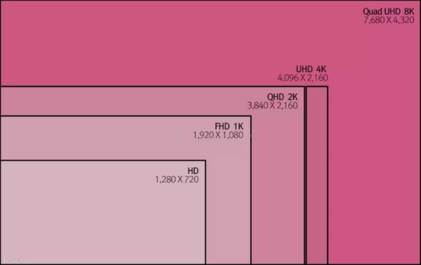

> 计算机配置
>
> [转载(参考)](https://zhuanlan.zhihu.com/p/84580494)

<!--more-->

# 笔记本电脑分类

比较前排的笔记本电脑品牌商：

苹果，联想，惠普，戴尔，其中还有台湾的华硕，微星，宏碁，韩国的三星，LG，以及后期崛起的像小米，华为也不错，国内的还有机械师等等。

---

操作系统，又分为苹果和微软操作系统。苹果系统的环境非常适合音乐、影视以及程序员工作，轻度办公和影视也可以，而微软系统有超多的软件和游戏，比较适合游戏用户

---

从使用角度目前主要有3大类划分：

- **轻薄本**定位于工作/学习/差旅的长待机
- **游戏本**定于于便携/游戏的的性能机
- **高端本**定位于土豪科技公司的移动工作站

## 轻薄本

目标是实现一个极其轻薄的设计理念，目标如下：

- 一种低电压的 `Core-i U` 系列CPU，具有 `5到8小时` 的电池续航
- 建议采用 `固态硬盘`（SSD）
- 消除不必要的插槽/端口
- 建议采用全外置（One-Spindle）设计，在外形设计上取消光驱
- 把重量限制在一般电脑的一半——1.4公斤
- 限制厚度不大于20毫米

> U系列基础标准：轻薄，高续航，无光驱，插槽，采用固态硬盘

---

在标准基础上，有了更多的需求：

- 更好的屏幕：不再拘泥于1080P分辨率，屏占比
- 快速充电功能：支持PD充电，可以和手机混用

> 缺陷：

- 性能瓶颈
- 屏幕小
- 外部接口少，不便于增加外设

> 适用群体：适用于出差党，轻薄本的主要客户群体是几乎不怎么游戏，有着大量学习、工作需求的用户（平板电脑生产力比较匮乏，属于娱乐品）

## 全能本

> 全能本外观、重量基本和轻薄本没有太多差距，但是配置了MX系列显卡，可以提供更强的3D性能，但是还不如游戏本的专用显卡。几乎轻薄本优缺点，全能本都有。价格相对较高。

## 游戏本

> 各种硬件配置规格都很高，比如CPU，显卡，以及供电系统都更加庞大

缺点：

- 加大散热设计和放入更多的散热模块：体型，重量
- 更差的续航能力：更高的功耗
- 更贵的价格：成本差距大

# 笔记本电脑配置

对笔记本性能有较大影响的三个配件：

- CPU（intel i3/**i5/i7** ，**AMD(锐龙)**）
- 显卡（核显/MX系列/***NVIDIA*(N卡)**/AMD独显）
- 显示屏（电竞144/IPS 高色域/2K）

次要影响配件

- 内存（DDR4，8/16/32G）
- 硬盘（M2硬盘品牌及大小速度）
- 外部接口数量及类型
- 品牌溢价
- 散热模组（热管及风扇性能）
- 电池（充电速度）
- 键盘（键位、手感）

> 其中，大部分笔记本内存和硬盘都可以更换，只有少数品牌比较极端（降低机身厚度），如华为和Mac

## CPU

intel至今一直是笔记本的老大，一个是因为其一手推动了轻薄本的潮流，另外因为intel的模块化生态非常成熟，无论是板载CPU还是显卡，在功耗和发热方面都普遍低于AMD，不过AMD最新的锐龙系列笔记本也得到了优化。Intel对于做编程项目，特别是比较底层的C语言来说执行效率更高，但是者科学运算语言没有太多影响，AMD过去在一些数据库软件会有一些未知的错误，省事intel，省钱AMD。

### AMD与intel对比

| 等级 | AMD            | Intel           |
| ---- | -------------- | --------------- |
| 入门 | 5500U，5600U   | 11370H，11400H  |
| 主流 | 5700U，5800H   | 11800H          |
| 高端 | 5900HX，5980HK | 11900H，11950HK |

### CPU标配

|           | 轻薄本                   | 游戏本               |
| --------- | ------------------------ | -------------------- |
| CPU       | 12450H\6600U\6800U       | 12700H\6800H         |
| 显卡      | 核显、MX550、2050        | 3050\3060\3070       |
| 内存/硬盘 | 16G/512                  | 16G/512              |
| 屏幕      | 高色域、高分辨率（2.5K） | 高刷新165HZ+2K分辨率 |

新一代的intel酷睿核显也提高非常多，性能直接翻倍，而AMD核显跑分更高，玩LOL这些4600U的核显是完全足够的（1080P），如果是轻薄本一般建议4600U，最新一代的锐龙5000系列。AMD一般低端核显笔记本较多，但是从使用上看，Intel笔记本的续航通常更长更稳定。

对于经常编程的用户来说，建议inte的笔记本电脑或者苹果笔记本。

intel：https://www.zhihu.com/question/338233685/answer/855018171

CPU天梯图：https://zhuanlan.zhihu.com/p/143283849

## 显卡

对于笔记本而言，只要区分三种显卡就行：集显、游戏显卡、专业显卡。

| 显卡等级 | AMD、INTEL   | NVIDIA         |
| -------- | ------------ | -------------- |
| 入门     | VEGA、XE核显 | MX450、GTX1650 |
| 中端     | RX 6600M     | RTX3050、3060  |
| 高端     | RX 6800M     | RTX3070、3080  |

### 核显#轻薄笔记本

> 一般来说为了减少重量，压缩体积，轻薄笔记本的性能都不会太强，而且多数为英特尔集成显卡（也经常叫核显）为主

集显来说，主要INTEL/AMD平台的，R5 4600U和R7 4800H内置了不错的VG10核心显卡都能流畅玩LOL一些游戏，性能比intel大部分集显都要强，性能跟MX150差不多。11代的英特尔酷睿核显xe系列则直接提高了一倍性能，两者差价大幅度缩小。

- 英特尔集成显卡：UHD630 和 Iris Plus G系列
- AMD核显：Vega8（3500U）Vega11（3700U/H）

### MX#全能笔记本

全能笔记本电脑并不是真的全能，电脑品牌也没有这个，而是大V们常年自己给的称呼，一般来说是指**轻薄本**加了个**低端独显**的产品，全能本独立显卡目前常见：

- MX450(2020)
- MX550(2022)

### 游戏本

在专业显卡显卡领域，之前还是 NVIDIA Quadro P5200 ，目前已经到 Quadro RTX 5000，专业显卡和游戏显卡最大的不同是支持一些专业软件，一般的有限在开一些专业软件的时候某些功能会被锁死，特别在一些工业设计领域。这类显卡不但核心多得吓人，显存也巨大，价格也惊人。目前只有一些高端移动工作站才会配，采购领域很多是工业公司，影视工作室等，不差钱土豪公司常用。

30系显卡推荐：https://zhuanlan.zhihu.com/p/344803747

显卡天梯图：https://zhuanlan.zhihu.com/p/143283181

## 内存

由于系统占用，建议大家购买笔记本的时候，**8G内存起步，推荐16G！！！**

简单的说，假设是4G，win10启动运作，有时候要占到2.8G内存，而开个LOL加载，会导致严重的卡顿。游戏在加载的时候也会出现这种情况。**另外，由于轻薄本很多是一体化设计，后期不好拆卸！基本无法换内存，建议一步到位。**

## 硬盘

目前主流是M.2固态硬盘，建议512G起步，资料多的可以配大一点，也可以另外加移动硬盘

**M.2 NVME协议接口的硬盘读取是最快的，笔记本机械硬盘读取速度：**

机械(5400-90M/S)<固态SATA3.0(400M/S)<固态M.2 NVME(2000M/S)，不过具体要看哪家的，目前铺货比较大的是三星的981，也有联想的亿联等，用户感知不会很大，最新的PCIE4.0可以冲到7G/S，对于视频拷贝的用户比较有用。

目前笔记本大部分使用的三星981A，用户后续可以自行更换，或者通过外接移动硬盘进行，速度虽然有所损失，但多数可以达到一半的速度以上，依旧很快。

https://zhuanlan.zhihu.com/p/83510679

## 屏幕

| 要素     | 轻薄笔记本           | 游戏本               |
| -------- | -------------------- | -------------------- |
| 分辨率   | 2K以上居多           | 1080P，逐步转2K      |
| 刷新率   | 60Hz居多，逐步转90Hz | 144Hz居多，最高240Hz |
| 色域     | 100% sRGB            | 100%sRGB             |
| 护眼     | 逐步在加入           | 不常见               |
| 触控支持 | 少，WIN11会逐步多    | 没有                 |

### 分辨率

笔记本屏幕是最影响笔记本的外观，大部分都使用1080p（1980\*1080）以上，部分采用2k（2560\*1440），大部分刷新都是60hz，游戏本平板已经开始采用144hz@1080P.

防坑建议：凡是分辨率低于1920\*1080的都不要买了，1440\*900工作区太小看PPT网页老费劲了，而很快都是2K屏幕的天下了（实际使用13寸还是建议调整缩放150%）。游戏本要多看看笔记本屏幕的刷新频率（一般都是60hz），但是游戏本建议144Hz，有钱买200Hz的，不然你显卡跑120FPS，你显示器根本没有来得及刷新，白瞎了显卡。此外，对于专业领域，对色域要求较高，常规sRGB色域上面可以考虑 100% SRGB\DCI-P3色域的显示器。

### 屏幕刷新

电脑屏幕的刷新对于游戏本用处较大，在显卡足够强悍的时候，画面在切换过程中会多一些画面帧数，不会显得卡顿，如果是轻薄笔记本一般60Hz，高的会的奥90Hz，不过对于用户来说这项提高没有屏幕分辨率提高来得有用。60Hz也会更加省电，目前笔记本已经开始有刷新率自适应了。

### 屏幕色彩

大部分优秀的笔记本电脑目前已经基本普及100% sRGB，简单的说，屏幕的颜色展现能力更强。

显示器：https://zhuanlan.zhihu.com/p/110281051

## 散热

笔记本的热量主要来源有三个：**CPU、显卡、固态硬盘、主板电感**

过高的温度会导致电脑寿命降低，性能也急剧下降，所以一台好的笔记本，有良好的散热系统，这个系统包括风道、风扇还有铜管设计，风扇转速。

除了散热，笔记本的功耗控制PL1\PL2也对电脑性能影响巨大，即便是同样的配置，不同的主板功耗墙控制，也会让笔记本的性能表现差距巨大。相比于轻薄，游戏本的厚度增加主要是机器的散热模块增加导致。

## 接口

对于笔记本来说USB+HDMI是目前的标配，USB当然多了比较好，因为即便我们单独购买USB-HUB经常还是会忘记带的，而且电压不够有时候一些设备插上去也无法正常工作。

> USB接口目前常用的是USB2.0/3.1规格，3.1规格的速度很快！

> HDMI也分为两个规格HDMI1.4/HDMI2.0！

HDMI 1.4带宽有限，这个最高只能支持1080p@120Hz、1440p@60Hz、2160p@30Hz，三种规格，也就是说你如果买的游戏本计划外接电竞显示器，比如外接显示器为2k/144hz，就会很尴尬了，刷新跟不上。能选到HDMI 2.0尽量选。

## 笔记本电脑重量

影响笔记本重量的因素很多：

- 碳纤维比铝镁合金更轻
- 散热系统小的比散热系统大轻
- 屏幕小的比屏幕大的更轻

轻薄本一定比游戏本轻很多，大部分在1.5kg以内，部分品牌做到1.0kg以内，而轻薄本里面还有2个特殊品：超极本、二合一，这两个的重量会更轻一些，但是散热能力也跟着急剧下降。

对于用户来说，碳纤维外壳会更轻，但是质感不如铝镁合金。

## 显卡直连

目前有Nvidia独显（3050以上）的很多笔记本都能支持显卡直连，和过去的混合输出（核显+独显）不同，显卡直连对于等级越高的显卡，输出的性能提升越明显，不过也带来两个副作用，一个是大部分type-c接口无法正常支持显示器，另外一个就是耗电会快一些——这个对于经常插着电源的游戏本影响不大，但是不管直连与否，优先级依旧小于显卡最大功耗的提高。
