> 计算机常识

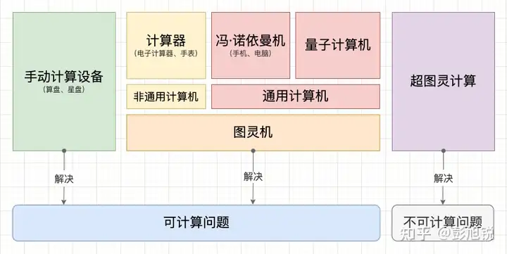

<!--more-->

## 0.1 计算机概述

> 【鸟哥linux私房菜（基础篇）】接受输入的指令或数据，经由CPU的数学与逻辑单元运算处理后，产生或转储为有用的信息。

### 0.1.1 计算机发展历程

- 1936年**英国数学家图灵**首先提出了 **一种以程序和输入数据相互作用产生输出** 的计算机**构想**，后人将这种机器命名为 **通用图灵计算机**

- 1938年**克兰德·楚泽**发明了首台采用**继电器**进行工作的计算机,这台计算机命名为**Z1**，但是继电器是机械式的，并不是完全的电子器材

- 1942年 **阿坦那索夫和贝利** 发明了首台采用**真空管**的计算机，这台计算机命名为ABC

- 1946年ENIAC诞生,它拥有了今天计算机的主要结构和功能，是通用计算机

  现在世界上**公认**的第一台现代电子计算机是1946年在美国宾夕法尼亚大学诞生的ENIAC(Electronic Numerical Integrator And Calculator)

### 0.1.2 分类

- 超算（Super computer）：运行速度最快、维护和操作费用最高

  国防军事、气象预测、太空科技，用在仿真的领域较多

- 大型计算机（Mainframe Computer）：具有数个高速的CPU，可用来处理大量数据与复杂的运算

  大型企业的主机、全国性的证券交易所等

- 迷你电脑（Minicomputer）：可以放在一般作业场所， 不必像前两个大型计算机需要特殊的空调场所

  用来为科学研究、工程分析与工厂的流程管理等。

- 工作站（Workstation）：比迷你电脑便宜许多，是针对特殊用途而设计的电脑

  强调的是稳定不死机，并且运算过程要完全正确，

- 微电脑（Microcomputer）：个人电脑

### 0.1.3 计算机特点

- 计算机是一种电器, 所以计算机只能识别两种状态, **一种是通电一种是断电**

  最初ENIAC的程序是由很多开关和连接电线来完成的。但是这样导致**改动一次程序要花很长时间**(需要人工重新设置很多开关的状态和连接线)

  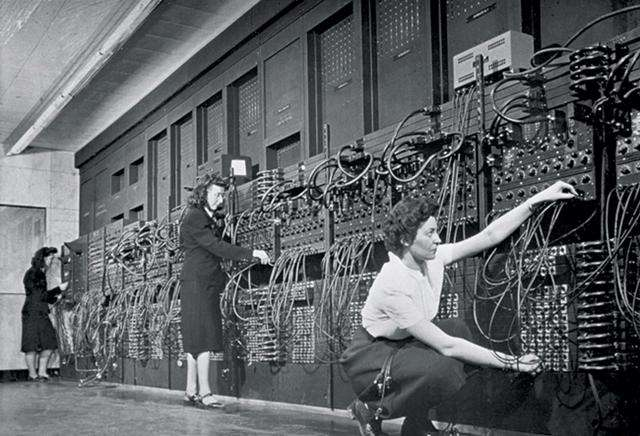

- 数学家冯·诺依曼将 **把程序和数据都放在存储器中** 以数学语言系统阐述，提出了存储程序计算机模型(存储程序控制原理，这是所谓的冯·诺依曼机)，**这种设计思想导致了硬件和软件的分离，即硬件设计和程序设计可以分开执行**

  数学语言用0和1表示计算机能够识别的通电和断电两种状态

  - 在计算机中存储的存储和操作的数据都是由0和1组成

> 冯诺依曼机设计思想
>
> - **二进制编码**：程序、数据的最终形态都是[二进制编码](https://zhida.zhihu.com/search?content_id=118519899&content_type=Article&match_order=1&q=二进制编码&zhida_source=entity)，程序和数据都是以二进制方式存储在存储器中的，二进制编码也是计算机能够所识别和执行的编码。（可执行二进制文件：.bin文件）
> - 存储程序：程序、数据和指令序列，都是事先存在主（内）存储器中，以便于计算机在工作时能够高速地从存储器中提取指令并加以分析和执行。
> - 五大部件：确定了计算机的五个基本组成部分：运算器、控制器、存储器、输入设备、输出设备

## 0.2 计算机硬件

### 0.2.1 五大单元

> 输入、输出、控制单元、算数逻辑单元、存储单元

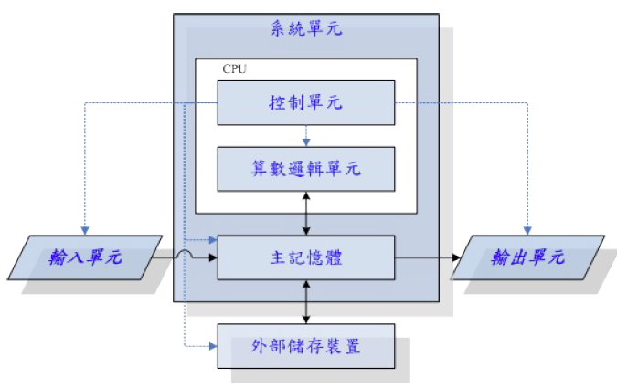

- 控制单元、算数逻辑单元被集成于CPU
  - 所有单元都由CPU内部的控制单元来负责协调
- 存储单元包含内存和辅助存储设备（硬盘、磁盘等）

- CPU要处理的所有数据来源于内存，CPU发出控制命令以控制数据在内存的流入/流出

### 0.2.2 x86架构

> 主板上有链接所有设备的芯片组，这个芯片组可将所有单元的设备链接起来

 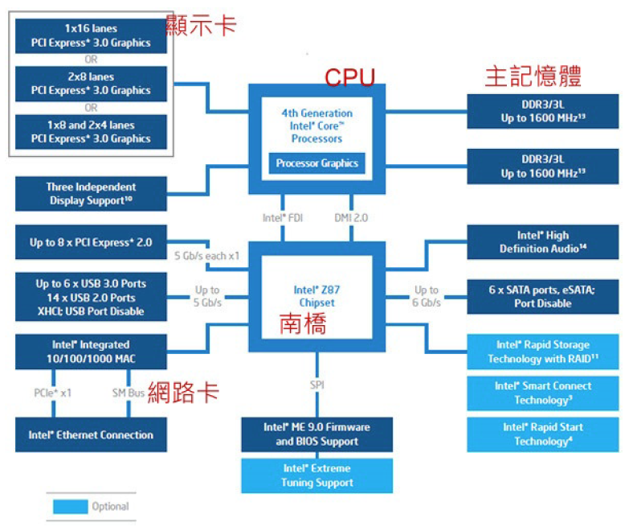

#### 主板

早期主板上的芯片组分为北桥、南桥芯片组

- 北桥：通过前端总线（FSB）链接速度较快的CPU、内存与显卡等元件

  但CPU与内存经过北桥进行数据读写，会瓜分北桥的可用带宽

- 南桥：连接速度较慢的设备接口， 包括硬盘、USB、网卡等等。

现代架构，将北桥的内存控制芯片整合到CPU内，CPU与内存、显卡通过系统总线直接传递各种数据与信号

- 南桥通过DMI 总线，与北桥或集成芯片组中的其他部分连接
  - 南桥通过I/O总线连接系硬盘、USB、网卡等低速外设，南桥接受这些外设发送的信号，通过 I/O 总线将其状态传递给其他芯片组（如北桥芯片，或者在现代主板架构中可能是直接传递给 CPU 内部相关组件）进行进一步处理。
  - 部分高性能硬盘（如采用 NVMe 协议的 SSD）通常是通过 PCI - E 总线直接连接到 CPU 或主板上的 PCI - E 控制器

##### 连接外设的接口

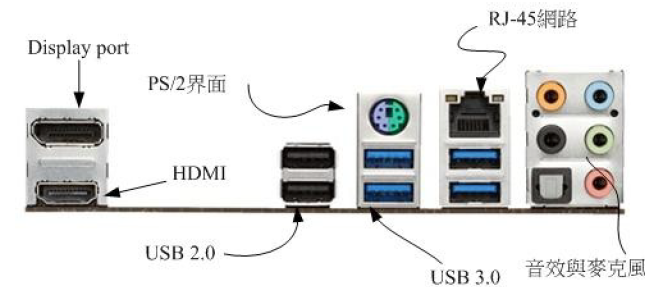

- USB2.0、USB3.0
- 声音输出、输入、麦克风接口：圆形插孔，主板上内置音效芯片
- RJ-45网络头：主板上内置网络芯片
- HDMI：主板内置显示芯片

##### 设备I/O地址与IRQ中断信道

主板上的每个设备都有独一的I/O位址，通过IRQ中断信道连接到CPU

- 传统主板芯片组IRQ只有15个，可连接的外设数量有限

##### 固件、BIOS与ROM

主板上集成了多种元件，每个元件具有可调整参数，这些元件的可配置参数都被记录到CMOS芯片——ROM只读存储器（Read Only Memory）上，这个芯片需要额外的（纽扣）电池。

- 内存的频率是可调整的
- 主板上面如果有内置的网卡或者是显卡时，该功能是否要启动与该功能的各项参数
- 系统时间、CPU电压与频率
- 各设备的I/O位址与IRQ

CMOS芯片中的参数通过BIOS（Basic Input Output System）程序读取与更新。

- BIOS写死到内存的一个内存芯片中
- BIOS是一种固件，控制着开机时各项硬件参数的获取。

固件（filmware）是在硬件内部被执行的程序，很多也是使用ROM进行软件写入

现代主板，BIOS通常是写入闪存（flash）或EEPROM中，便于更新BIOS程序。

####  中 央处理器CPU

> 主要功能：运算（程序运算与逻辑判断）与控制（协调各周边元件与各单元间的工作）
>
> CPU运算能力：CPU微指令集设计的优劣+运算速度+二级缓存+计算机制等

##### CPU微指令集及其分类

精简指令集（RISC）与复杂指令集（CISC）系统

- CISC：每条微指令完成的动作单一，执行性能较佳。复杂动作需要多个微指令配合

  SPARC CPU（学术领域的大型工作站中，包括银行金融体系）

  PowerPC（Play Station 3）

  ARM CPU（手机OS、交换机路由器等网络设备、PDA）

- RISC：每条微指令可完成一些较低阶的硬件操作，所以每条指令花费的时间较长，指令数量多且复杂，每条指令长度不一

  AMD，Intel等X86架构的CPU

  > Intel最早的CPU为8086，后据此架构开发出80286等，所以命名为x86
  >
  > AMD据X86的16/32位CPU开发出64位CPU，64位的CPU被统称为x86_64
  >
  > 不同X86架构除整体架构的差异（二级缓存、每次运行可执行指令数等）外，主要区别为微指令集（这些微指令集可以加速多媒体程序的运行、加强虚拟化的性能、增加能源效率、降低CPU耗电量等）

##### CPU性能指标

- 速度单位：Mbps、MB/S

**工作频率**

CPU频率：CPU单位时间可进行的工作/运算次数

> 通过CPU频率仅能用于比较同款CPU的速度

外频*倍频=频率

- 早期主板架构采用北桥芯片与前端总线（FSB）连接CPU、内存与显卡设备，因此每个设备的工作频率要相同

  但CPU工作频率远大于其他元件，所以厂商在CPU内部再进行加速，有外频与倍频的概念（内频为 3.0GHz，而外频是333MHz，倍频为9（3.0G=333Mx9, 其中1G=1000M））

  - 外频：CPU与外部元件传输数据时的速度

  - 倍频：CPU内部用于加速工作性能的倍数

  北桥成为系统性能的瓶颈

- 现代主板架构：CPU直接与内存、显卡设备分别沟通

  内存控制器被整合到CPU内部，CPU与内存、显卡控制器的连接，Intel使用QPI（Quick Path Interconnect）与DMI技术，AMD使用Hyper Transport技术，

超频：将CPU的倍频或外频通过主板设置为更高频率的方式，一般情况倍频在出厂时被锁定无法修改，所以较常超频的为外频（上述3.0GHz的CPU如果想要超频，可将其外频333MHz调整成为400MHz）

- 现代Intel CPU会主动超频（Turbo技术）

**总线宽度**

> 字组大小：CPU每次能够处理的数据量称为字组大小——位数 32位、64位

若CPU 内置的内存控制芯片对内存的工作频率为1600MHz，位数为64，则CPU可以从内存中取得的最快带宽就是 $1600MHz\times 64bit = 1600MHz\times 8 Bytes = 12.8GByte/s$

##### 超线程（Hyper-Threading）

> 多核：一个CPU多个运算单元

CPU 运算速度，因此运算核心经常处于闲置状态。

对于多任务的OS，可以让CPU同时执行多个任务。因此，超线程为令CPU同时执行两个或多个程序。

最简单的理解，每个CPU内重要的寄存器分为两群，程序分别使用这两群寄存器，即同时竞争CPU的运算单元。

即大部分I7处理器仅有4个核心，但通过超线程可将每个核心逻辑上分离，操作系统可以抓到8个核心，即同时运行8个程序/任务。

#### 主存

内存主要采用动态随机存取内存（Dynamic Random Access Memory，DRAM），CPU内部的二级高速缓存采用静态随机存取内存（Static Random Access Memory，SRAM）

- 随机存取内存只有在通电时才能记录和使用，断电后数据消失——RAM称为易失性内存

DRAM 分为SDRAM与DDR SDRAM两种

- 区别
  - 引脚
  - 工作电压
  - DDR是双倍数据传送：在一个工作周期进行两次数据传送

##### 性能指标

**内存频率**（频率速度）：每个时钟周期，内存对外部系统的数据传递次数（如CPU）（外部频率），以MHZ或MT/s（每秒百万次传输）为单位

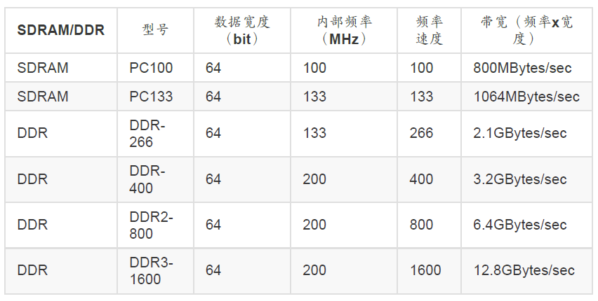

- DDR X的内存数据传输速度为传统SDRAM的 $2^X$ 倍

**容量**：容量越大的内存通常性能较好

**多通道设计** ：数据宽度越大越好，芯片组厂商可将两个内存汇整在一起，形成双通道设计（如一根64位的内存，采用双通道设计能提供128位的）

- 启用双通道，需要安插至少两条内存，最好容量、型号都一模一样

##### DRAM与SRAM

**DRAM**：每个存储单元由一个电容和一个晶体管组成。电容用于存储电荷，晶体管用于控制数据的读写。由于电容会随时间泄漏电荷，因此需要定期刷新（refresh）以保持数据的完整性，这会增加访问延迟。**读写速度相对较慢**

- 由于每个存储单元只包含一个电容和一个晶体管，因此在相同芯片面积上可以实现更高的存储密度，单位容量的成本较低。适合用于大容量存储场景，内存条

**SRAM** ：每个存储单元由多个晶体管（通常为6个）组成，形成一个触发器电路，利用晶体管的开关状态来存储数据，不需要定期刷新，通常具有较低的延迟，读写速度快

- 每个存储单元需要更多的晶体管，导致其存储密度较低，单位容量的成本较高。
  适用于小容量、对速度要求极高的存储场景，如CPU缓存

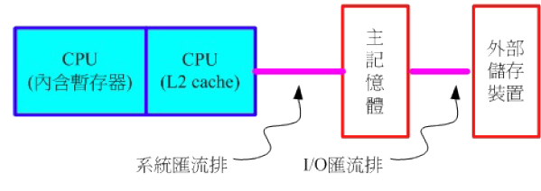

L2 Cache需要被整合到CPU内部，所以其频率必须与CPU想通，SRAM可以满足。

#### 外设

主流的外接卡接口大多为 PCIe 接口，且最新为 PCIe 3.0，单信道速度高达
1GB/s

PCIE采用“管线”概念，每条管线有250MB/s的带宽，管线越多，总带宽越高

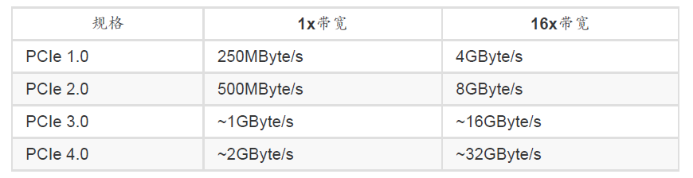

##### 显卡

> 显卡又称为VGA（Video Graphics Array）

**性能指标**

分辨率、色深

显示器分辨率 $1024\times 768$ ，且全彩（每个像素占3B容量），则至少要 $1024\times 768\times 3B$ 的显存才能使用，还需考虑屏幕刷新率（每秒屏幕刷新次数），所以显存容量越大越好

**显卡与CPU连接**

显卡通过CPU的控制芯片与CPU和内存沟通，

- 图像数据的传输也是越快越好

- 显卡规格（将显卡连接到计算机主板上的接口标准）从早期PCI导向AGP，再转向PCIE

  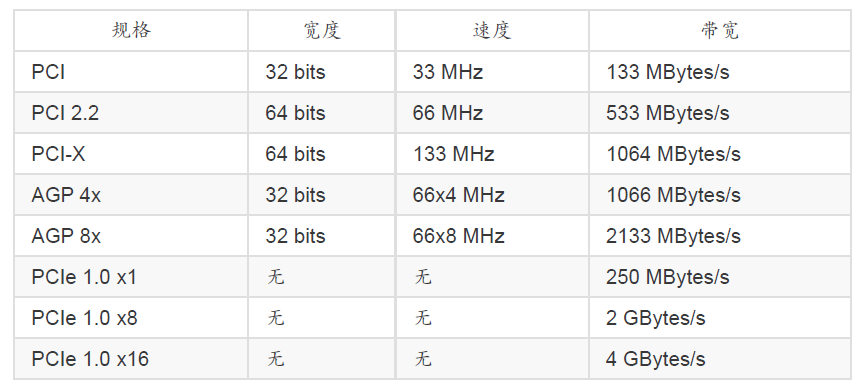

**显卡与屏幕的连接端口**

- D-Sub（VGA端子）：15针，传输模拟信号
- DVI常用于液晶屏幕
- HDMI与Display Port：能同时传递影像与声音信号

##### 存储设备与硬盘

> 电脑系统上面的储存设备包括有：硬盘、软盘、MO、CD、DVD、磁带机、U盘（闪存）、还有新一代的蓝光光驱等， 乃至于大型机器的区域网络储存设备（SAN, NAS）等等，都是可以用来储存数据的

**传统硬盘结构**

传统硬盘的组成为：圆形盘片、机械手臂、 磁头与主轴马达所组成的，其中盘片的组成为扇区、磁道与柱面；

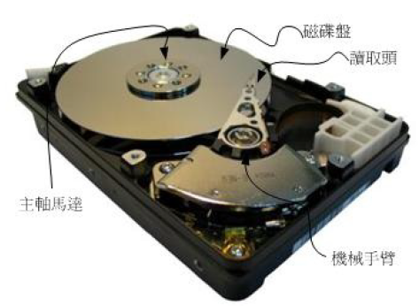

> 注意：电脑通电后，尽量不要移动主机，避免抖动硬盘，导致数据混乱
>
> 正常的关机程序才会将机械臂归位，而直接端点并不行

**读写流程** 

实际的数据写在具有磁性物质的盘片上

运行时， 主轴马达让盘片转动，然后机械手臂可伸展让磁头在盘片上头进行读写的动作。

**盘片上的数据**

从盘片上的同心圆划分出多个小区块，作为磁盘的最小物理存储单元——扇区（sector）。在同一同心圆的扇区组成磁道（track）。不同盘片上的同一磁道组成柱面（cylinder）

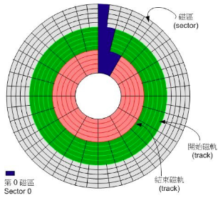

当盘片转一圈时，外圈的扇区数量比较多，因此如果数据写入在外圈，转一圈能够读写的数据量当然比内圈还要多！ 因此默认的数据读写会由外圈开始往内写 

原本硬盘的扇区都是设计成 512Byte 的容量，新的大容量硬盘已经有 4KByte 的扇区设计——减少数据的拆解

- 相应的有不同磁盘分区方式，旧式MSDOS相容模式，较新的GPT模式

  GPT模式下，磁盘分区采用扇区号来设计

  MSDOS模式，通过柱面号来分区

**传输接口**

磁盘连接到主板的接口大多为 SATA 或 SAS，目前台式机主流为 SATA 3.0，理论极速可达 600MB/s。

- SATA线比较窄小之故，所以对于安装与机箱内的通风都比较

  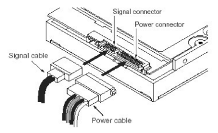

  SATA接口传输10bit的编码数据时，仅有8bit为数据，其余2bit作为检验位，所以计算带宽时，1.5Gbit/s换算后为150MB/s

  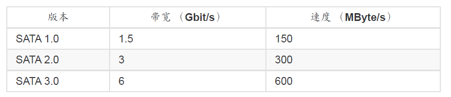

  尽管SATA3理论带宽为600MB/s，但受限于目前传统的硬盘物理组成，峰值带宽在 150~200MByte/s

  传统硬盘，传输速率为80~120MB/s

- SAS（Serial Attached SCSI, SAS），串行SCSI

  接口速度比SATA快，连接SAS硬盘的盘片转速比SATA硬盘快。但贵

  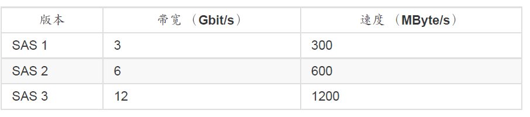

- USB接口

  与主板链接的外接式接口，USB接口速度很慢，USB2.0传输速率约为60MBytes/s

  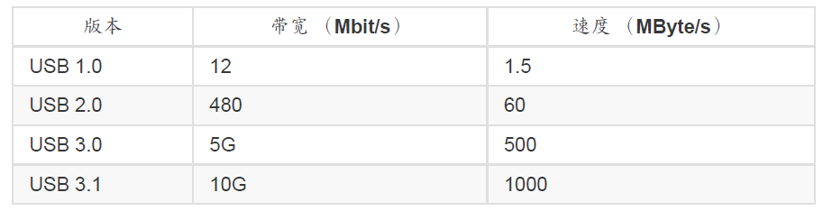

**固态硬盘**

将闪存作为固态大容量的存储设备

- 优点：不存在读写延迟且速度快，通过内存直接读写，省电
- 缺点：有写入次数限制

读写存储设备，连续读写情况很少，大部分是读写大量小文件

小文件的读写，很耗硬盘，盘片需要转很多圈。

**硬盘性能指标**

- 硬盘类型，HDD适合存储冷数据，但不适合存储小文件，SSD适合存储小文件，但成本高

- 容量

- 缓冲内存：硬盘上也有换成内存，临时存放常用数据，通常越大越好

- 转速：转速快慢会影响性能

  7200r/5400r

####  扩展卡与接口

主板上通常会预留多个扩展接口，现代大多为PCIe接口，还保留个别PCI插槽

主板上通常已经整合了相当多的设备元件，包括声卡、网卡、USB控制卡、显卡、磁盘阵列卡等

注意区分PCI接口与PCIe接口，以插槽的长度来区分PCIe接口的信道数 x1、x4、x8、x16等

- 多信道卡可安装在少信道插槽

  主板会做出x16的插槽，但可能只有x4或x8的信道有用，其余都是空的没有金手指

  PCIe接口可以让多信道卡仅使用有金手指的信道传输数据，但会降低传输速度

- 一般服务器的扩展卡，大多使用PCIe x8的接口（未必能用完PCIe3.0的速度）

##### 发挥扩展卡性能的插槽位置

系统上可有多个x8插槽，安装在与CPU直连的插槽性能最佳

若安装在与南桥连接的插槽，扩展卡数据需要先进入南桥竞争带宽，之后才传向CPU（DMI）

- DMI2.0 的传输速度为4GT/s，大约仅有2GB/s的速度，
- PCIe 2.0 x8的理论速度已经达到4GB/s，因此性能瓶颈会发生在CPU与南桥的沟通上
- 因此，卡安装在哪个插槽上，对扩展卡性能影响很大

#### 电源

电源本身也会吞掉一部分电力，在选择电源供应器时，要大于主机系统的峰值功率

此外，应尽量选择**能源转换效率**高的电源供应器
$$
\frac{输出的功率}{输入的功率}
$$

## 0.3 计算机软件

> 包括能使计算机运行所需的各种程序及其资料（文档和数据）

### 0.4.1 数据

> 数据在计算机中可被识别与表示的形式为二进制的01编码

#### 静态数据

静态数据是指一些永久性的数据，一般存储在 **硬盘** 中

计算机关闭之后再开启，这些数据依旧还在。

静态数据一般是以**文件的形式**存储在硬盘上，如文档，照片，视频等

#### 动态数据

在程序运行过程中，动态产生的临时数据，一般存储在 **内存** 中

计算机关闭后，这些临时数据就会被清除

当运行某个程序(软件)时，整个程序就会被加载到内存中，在程序运行过程中，会产生各种各样的数据，这些数据临时存储在内存中

#### 静态数据和动态数据转换

静态数据到动态数据：从磁盘加载到内存

动态数据到静态数据：从内存保存到磁盘

#### 文字编码系统

常见的文字编码为 ASCII，繁体中文编码主要有 Big5 及 UTF8 两种，目前主流为 UTF8（国际组织ISO/IEC制订了Unicode编码系统）

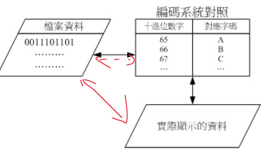

### 0.4.2 计算机程序

一条或多条指令的集合叫做计算机程序，计算机的一切操作都是由程序控制。

> 指令系统：一台计算机硬件系统能识别并执行的所有指令的集合
>
> 计算机程序：是为了告诉计算机 **做某件事或解决某个问题** 而用计算机语言编写的命令集合

#### 机器程序

CPU的运算与逻辑判断受其微指令集控制，依据微指令集，撰写CPU能读懂的指令码才可执行。

> 所有代码只有0和1，0表示低电平，1表示高电平（纸带存储时，1有孔，0无孔）

优点：直接对硬件作用，程序执行效率高

缺点：

- 需要了解01机器码
- 需要了解计算机系统内，所有硬件的相关功能函数
- 机器程序不具有移植性
- 程序具有专一性：必须要针对硬件功能函数撰写

#### 编译程序

编译器：将人类能够读懂的程序语言，转译为机器能够看懂的机器码


源程序：用各种语言写出的代码

目标程序：源程序通过翻译加工后生成的程序，机器语言或低级语言

翻译程序：用于把源程序翻译成目标程序的程序

- 汇编程序
- 编译程序
- 解释程序

> 三种语言编写1+1
>
> 机器语言
>
> * ```10111000 00000001 00000000 00000101 00000001 00000000```
>
> 汇编语言
>
> * ```MOV AX, 1 ADD AX, 1```
>
> 高级语言
>
> * ```1 + 1```

##### 汇编程序

> 符号化的机器语言，用一个符号（英文单词，数字）代表一条机器指令

优点：直接对硬件产生作用，程序执行效率高，可读性稍差

缺点：符号非常多和难记、无可移植性

##### 高级语言

> 接近自然语言，语法和结构接近普通英文

优点：简单，易用，易于理解，原理对硬件的直接操作，有可移植性

缺点：执行效率不高

> 转换机器码的时机不同

- 编译型语言
  - C语言
  - 在代码执行前将代码编译为机器码
- 解释型语言
  - Python ,js ,Java
  - 执行时，一遍执行一遍编译

- 解释型语言具有跨平台性

#### 结构化程序设计

> 按功能将其划分为若干基本模块，形成树状结构，各模块之间功能上相互独立；各模块之间的关系尽可能简单；

- 自顶向下，逐步求精
- 每一模块内都是由顺序，选择、循环三种基本结构组成；
- 模块化实现的具体方法是使用子程序。

#### 缺陷

即使有了编译器的辅助，在进行程序设计时，还需要考虑整体的硬件系统来撰写控制码

因此，产生了操作系统。

### 0.4.3 操作系统

操作系统（Operating System, OS）是**管理电脑所有活动以及驱动系统中的所有硬件**的一套程序，并对外**提供系统调用/接口**，便于用户调用内核功能，进一步利用硬件资源

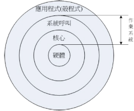

- 内核：直接参考硬件规格写成，不同的硬件架构具有不同的操作系统内核（如X86架构、ARM架构）

  - 程序管理功能：多任务；CPU调度机制等

  - 内存管理功能：通常内核会提供虚拟内存功能，当内存容量不足时提供内存交换功能

  - 设备驱动（驱动程序由厂商提供）：控制设备的功能，如存取硬盘、网络功能、CPU资源取得等

    “可载入模块”功能，将驱动程序编辑为模块，就不需要重编译内核

    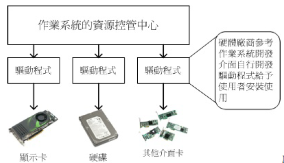

  - 文件系统管理：数据的输入输出工作

- 系统调用：向用户提供统一的开发接口，只要遵循公认的系统调用参数来开发软件，就能在操作系统内核运行

  如将C相关的语法转译为内核相关的函数

- 应用程序的开发都是参考操作系统提供的开发接口，应用程序也需要按照操作系统调整

内核在开机后常驻内存，其所在的内存区块受保护

#### 常见操作系统分类

1. **桌面操作系统**
   - Windows
   - MacOS
   - Linux

2. **服务器操作系统**
   - Linux
   - Windows Server
   
3. **嵌入式操作系统**
   - Linux
   
4. **移动设备操作系统**

   - IOS
   - Android

#### 市场占有率

单用户操作系统：（Windows）一个用户独享系统的全部硬件和软件资源

多用户操作系统：（Linux，Unix）

1. **Unix**

   多用户同一时间登录到同一电脑上

   - 1970年 

     肯.汤普逊 Unix


   - 1972年 

     Dennis C语言


2. **Linux**

   - 1991年

     林纳斯


# Windows命令行

## 用户界面

分为：

- 文本交互界面(TUI)：命令行，Dos窗口，命令提示符，cmd，shell，终端(Terminal)
- 图形交互界面(GUI)

## 命令行启动方式

1. 快捷键：Win+R->运行 `cmd` 

   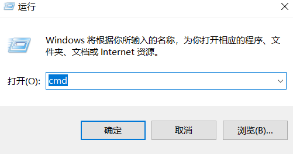

2. 在文件管理器的目录地址栏输入 `cmd`

   

   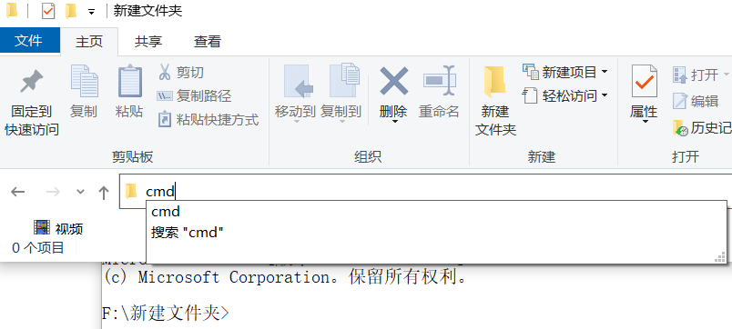

## 命令行结构

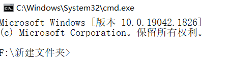

`Microsoft Windows [版本] (C) Microsoft Corporation`

- 版本及版权声明

`F:\新建文件夹>`

- F:\ ：当前所在的磁盘目录

  切换方式

  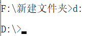

- 新建文件夹：所在磁盘的路径，当前所在文件夹

  切换方式

  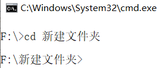

## 常用Dos命令

`命令 [参数]/[选项]`

### 查看——dir

> 查看当前盘符的所有文件

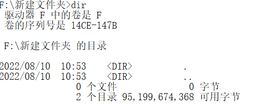

### 创建目录——md及mkdir

> 创建目录

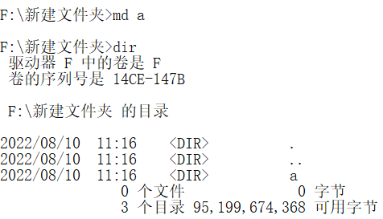

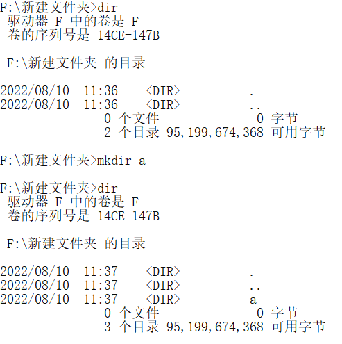

### 删除目录——rd/rmdir

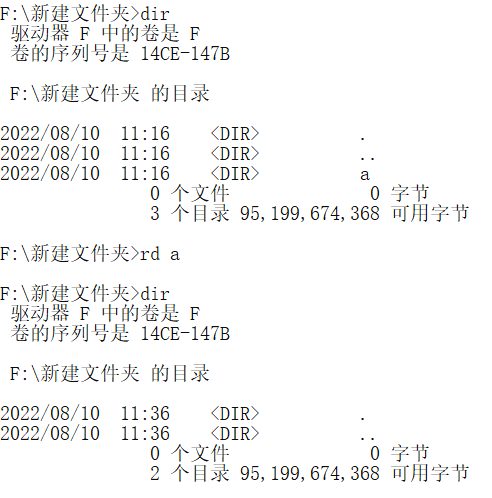

#### 强制删除

`rd/s/q 目录名` 或 `rmdir/s/q 目录名`

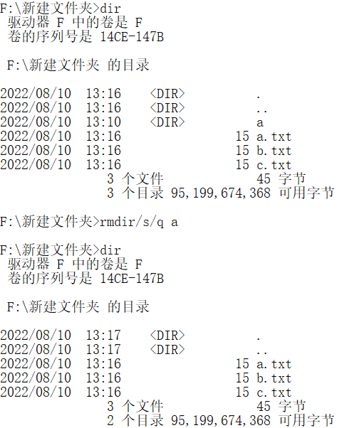

### 创建文件

#### 创建空文件

1. `cd>文件名`

   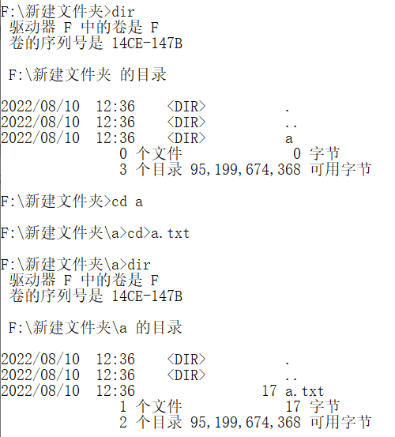

2. `type nul>b.txt`

3. `copy nul>c.txt`

   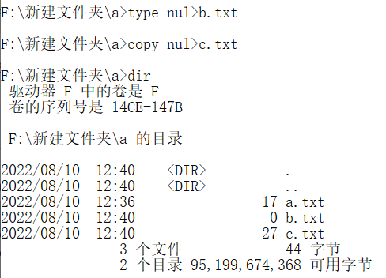

#### 创建非空文件

`echo 内容>文件名`

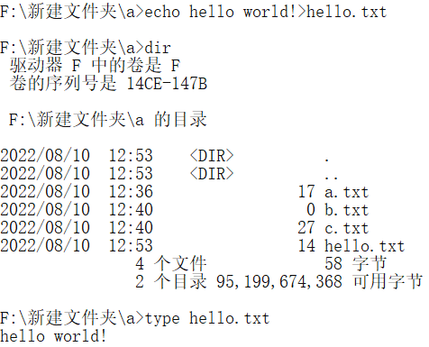

### 删除文件

`del 文件名` 或 `del 通配符`

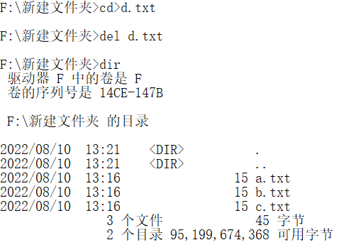

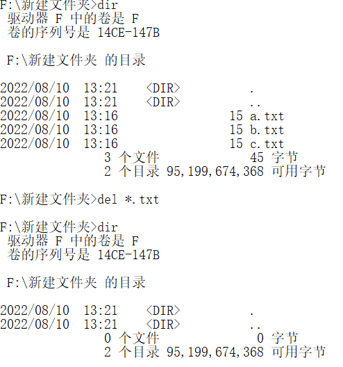

### 清屏——cls

## Dos命令参数查看

`cd/?` ：即可查看 `cd` 命令的所有参数

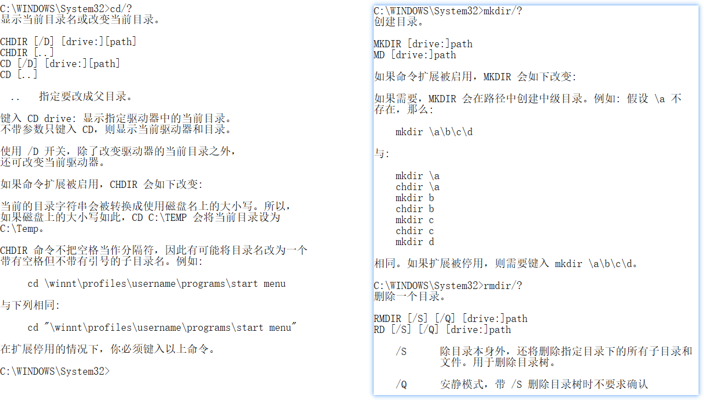

# 环境变量

## 程序的启动方式

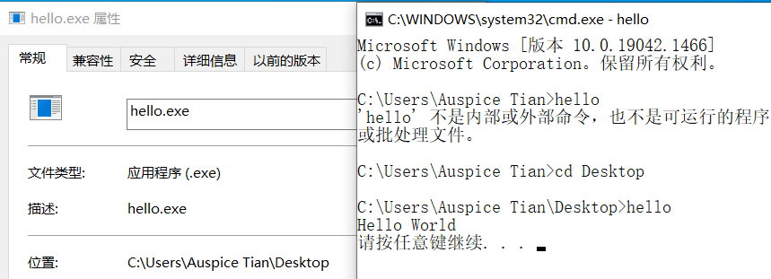

-   程序调用是OS根据输入的程序名调用路径下对应的可运行文件 (.exe)

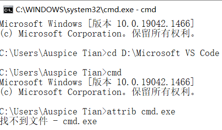

`cmd` 命令在任何文件夹下可用的原因是 **环境变量**

## 环境变量 `Path` 的作用

>   程序调用时，不仅在当前文件夹下进行，也会去配置好的环境变量下寻找。
>
>   配置 `Path` 实质上就是将常用的文件夹路径添加到系统的扫描路径中

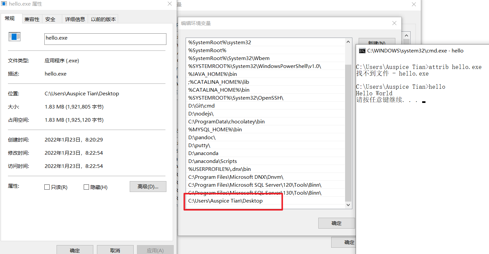
