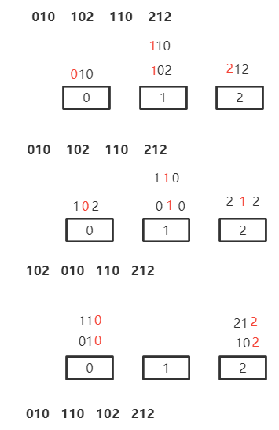

> 排序算法总结

<!--more-->

# 6.1 基本概念

## 6.1.1 目标

> 使关键字有序

## 6.1.2 分类

### 内部排序

> 数据元素在排序期间全在内存中

### 外部排序

> 排序过程中，数据不断在内外存之间移动

## 6.1.3 稳定性

> 经过排序，关键字相同的元素保持原先的先后顺序

## 6.1.4 两种操作

### 比较

> 确定关键字先后关系

### 移动

> 移动元素，达到序列有序

## 6.1.5 一趟排序

> 对所有未处理的元素处理一遍


<div STYLE="page-break-after: always;"></div>

# 6.2 内部排序

## 6.2.1 总结归纳

### 稳定性

**插冒归基 稳**

- 折半插入
- 直接插入
- 冒泡排序
- 归并排序
- 基数排序

是稳定的

---

不稳定排序算法有

- 希尔排序
- 快排
- 简单选择排序
- 堆排序

### 适用链式存储

**插冒选归基**

- 直接插入排序
- 冒泡排序
- 简单选择排序
- 归并排序
- 基数排序

### 不会形成有序子序列

快排

### 时间复杂度


#### 时间复杂度与初始状态无关

**一堆()乌龟()选()基友()**

- 简单选择 $O(n^2)$
- 堆排序 $O(nlogn)$
- 归并排序 $O(nlogn)$
- 基数排序 $O(rd(n+r))$

#### 比较次数与初始状态无关

选择排序

#### 与初始状态有关

##### 插入排序

- 最好：有序

  直接 $O(n)$

  折半 $O(nlogn)$		

- 最坏：逆序

##### 交换排序

- 冒泡

  最好：有序 $O(n)$

  最坏：逆序 $O(n^2)$

- 快排

  最好：枢轴中分 $O(nlogn)$
  最坏：基本有序，逆序 $O(n^2)$

##### 冒泡排序趟数与初始状态有关

#### 为O(nlogn)

- 快排
- 堆排
- 归并

### 空间复杂度

#### O(1)

- 直接插入
- 折半插入
- 希尔排序
- 冒泡排序
- 简单选择
- 堆排序

#### O(logn)

快排最好

#### O(n)

- 快排最坏
- 归并排序
- 基数最坏O(r)

### 适用场景

#### 规模


#### 取第k小

- k趟冒泡排序
- k趟简单选择排序
- **k趟堆排序**

### 形成部分有序序列

- 直接插入
- 冒泡排序
- 快排
- 简单选择
- 堆排序

<div STYLE="page-break-after: always;"></div>

## 6.2.2 五大类排序


<div STYLE="page-break-after: always;"></div>

### 插入排序

#### 思路


**在最后一趟之前，所有元素都可能不在最终位置上**

#### 直接插入排序

##### 思路


##### 实现

```c
//从小到大排序
void Direct_InsertSort(ElemType A[],int n){
	int i,j;
    for(i = 2;i <= n;++i){
        if(A[i] < A[i-1]){
            //若待插入元素A[i] < A[i-1] ，从后向前找插入位置
            A[0] = A[i];
            //A为一固定序列，且数据存储已定，所以需要哨兵记录待插入元素      
            for(j = i-1;A[0] > A[j];--j)
                A[j+1] = A[j];
           	A[j+1] = A[0];
        }
    }
}
```

##### 特点


#### 折半插入

直接插入查找插入位置时遍历改为折半插入

##### 实现

```c
void Binary_InsertSort(ElemType A[],int n){
    int i,j,low,high,mid;
    
    for(i = 2;i <= n;++i){//依次将A[2]~A[n]插入到有序子序列
        A[0] = A[i];
        
        low = 1;high = i - 1;
        while(low <= high){
            mid = (low+high)/2;
            if(A[mid] > A[0])
                high = mid - 1;
            else
                low = mid + 1;
        }
        //mid为插入位置
        for(j = i - 1;j >= mid;--j)
            A[j+1] = A[j];
        A[high + 1] = A[0];
    }
}
```

##### 特点


#### 希尔排序

> 理解：由于直接插入排序适合大致有序的序列，故可对数据进行预处理，再进行直接插入排序

##### 思路

- 每隔一个步长取一个数
- 步长为两次取数之间的间隔数

##### 特点


### 选择排序

思路：选最值，作为有序子序列的端点

<div STYLE="page-break-after: always;"></div>

#### 简单选择排序

##### 思路


##### 实现

```c
void selectSort(ElemType A[],int n){
    int i,j,min;
    for(i = 0;i < n-1;++i){
        minIndex = i;
        for(j = i + 1;j < n;++j)
            if(A[j] < A[minIndex])
                minIndex = j;
        if(minIndex != i)
            swap(A[minIndex],A[i]);
    }
    
}
```

##### 特点


#### 堆排序

##### 思路


##### 存储结构


##### 步骤

1. 建初始堆

   从最后一个非叶结点开始调整 $\frac{n}{2}或\frac{n}{2}+1 \sim 1$

   

2. 取根与堆的最后一个元素交换

3. 重新调整堆，重复上述步骤

   

##### 操作

删除

- 从上到下比较
- 调用一次 `HeapAdjust` ，从根开始调整，两个结点先比，根据结果交换
- 时间复杂度 $O(h) = O(logn)$

插入

- 从下往上比

- 比较范围：本子树

  将 $K_{n+1}$ 作为叶子结点插入末尾，重复将 $K_{n+1}$ 与其新双亲比较，直至 $K_{n+1}$ 满足堆的特点 

##### 实现

```c
void BuildMaxHeap(ElemType A[],int n){
    for(i = n/2;i >= 1;--i)
        HeapAdjust(A,i,n);
}

void HeapAdjust(ElemType A[],int k,int n){
    A[0] = A[k];
    
    for(i = 2*k;i <= n;i*=2){//逐层向下调整，最值一定在左右孩子结点
        if(i < n && A[i] < A[i+1])//若右孩子结点比左孩子结点元素大
            i++;	//取右孩子结点下标
        if(A[0] >= A[i])
            break;	//将最大值放到根
        else{
            A[k] = A[i];
            l = i;//k为最值下标
        }
    }
    
    A[k] = A[0];
}

void HeapSort(ElemType A[],int n){
    BuildMaxHeap(A,n);
    for(i = n;i > 1;--i){
        swap(A[i],A[1]);
        HeapAdjust(A,1,i-2);
    }
}
```

##### 特点


<div STYLE="page-break-after: always;"></div>

### 交换排序

#### 冒泡排序

##### 思路

每一趟都将一个最大或最小元素放在最终位置上


##### 实现

```c
void BubbleSort(int arr[],int n){
    for(int i = 0;i < n;++i){
        bool flag = false;//标记是否发生交换
        for(int j = 0;j > n-i-1;++j){//一趟冒泡排序
            if(arr[i] > arr[j+1]){//将大的放在后面
                swap(arr[j],arr[j+1]);
                flag = true;
            }
        }
        
        if(flag = false)//若某一趟未发生交换，说明已经有序
            return ;
    }
}
```

##### 特点


#### 快速排序

##### 思路

> 冒泡排序的改进：**分治法**
>
> 不断移动枢轴位置，寻找平衡点


整体流程


一趟排序


##### 实现

```c
int Partition(ElemType A[],int low,int high){
    ElemType pivot = A[low];
    while(low < high){
        while(low < high && A[high] >= pivot)
            --high;
        A[low] = A[high];
        while(low < high && A[low] <= pivot)
            ++low;
        A[low] = A[high];
    }
    
    A[low] = pivot;
    
    return low;
}

void QuickSort(ElemType A[],int low,int high){
    if(low < high){
        int pivotpos = Partition(A,low,high);
        QuickSort(A,low,pivotpos-1);
        QuickSort(A,pivotpos+1,high);
    }
}
```

##### 特点


### 归并排序

##### 思路

分解

> 将含n个元素的带排序表分为 $\frac{n}{2}$ 元素的子表，分别对两个子表排序

合并

> 合并两个已排序的子表得到结果


##### 实现

```c
void Merge(ElemType A[],int low,int mid,int high){
    //表中 A[low,...,mid],A[mid+1,...,high]分别有序
    ElemType *B = (ElemType *)malloc(sizeof(ElemType)*(high-low+1));
    
    for(int i = 1;i <= high;++i)
        B[i] = A[i];//初始化辅助数组
    for(int i = low,j = mid+1,k = 1;i <= mid && j <= high;++k){
		if(B[i] <= B[j])
            A[k] = B[i++];
        else
            A[k] = B[j++];
    }
    
    while(i <= mid)
        A[k++] = B[i++];//第一个表未检测完，赋值
    while(j <= high)
        A[k++] = B[j++];//第二个表未检测完，赋值
}

void MergeSort(ElemTypeA[],int low,int high){
	if(low < high){
        int mid = (low + high)/2;
        MergeSort(A,low,mid);
        MergeSort(A,mid+1,high);
        Merge(A,low,mid,high);
    }
}
```

##### 特点


### 基数排序

> 不是基于比较和查找

#### 思路

每组关键字，按同一逻辑排序

先排主关键字，再排次关键字

> 先排主关键字，则主关键字排好后，无法处理次关键字相同的情况，实际情况 **先排次关键字，再排主关键字**

如：010 102 110 212基数排序

##### 先主后次



显然不能先主后次

##### 先次后主


<div STYLE="page-break-after: always;"></div>

#### 特点


<div STYLE="page-break-after: always;"></div>

### 桶排序(计数排序)

适用于：对一定范围内的整数排序

```c
# include<stdio.h>

void countSort(int nums[],int );

int main(){
    int nums[] = {2,3,1,4,3}; 

    countSort(nums,5);

    return 0;
}

void countSort(int nums[],int n){
    // 1. 确定桶数组
    //最大值是4，则需要0-4，即5个数组占用6个数组元素位置
    int max = 0;
    for(int i = 0;i < n;++i){
        if(max < nums[i])
            max = nums[i];
    }

    int bucket[max+1] = {0};

    // 3. 计数
    for(int i = 0;i < n;++i)
        bucket[nums[i]]++;
    
    for(int i = 0;i < max;++i)
        printf("%d ",i);
    printf("的数量\n");
    for(int i = 0;i < max;++i)
        printf("%d ",bucket[i]);
}
```

# 6.3 外部排序

## 6.3.1 存储空间

> K路归并排序，内存中一个输出缓存区，K个输入缓存区，对r个元素进行排序

## 6.3.2 过程

### 1. 生成k个初始归并段

把K个归并段的块读入K个输入缓冲区

对每个输入缓冲区中的L个记录进行内部排序，组成K个有序的初始归并段

### 2. 进行S趟K路归并 $S=\lceil log_kr\rceil$

用归并排序的思想从K个归并段中选出各段最小记录，暂存到输出缓冲区

- 当某一输入缓冲区为空，立马读入新块
- 缓冲区不空才进行下一轮比较

输出缓冲区满，写出外存

## 6.3.3 时间开销

$$
t_{总时间}=t_{读写外存}+t_{内部排序}+t_{内部归并}
$$

- 读写外出：归并多少趟，则读入多少次

- 内部排序：可优化段数，但读写IO次数不变

  块内排序：构造初始归并段花费时间

- 内部归并：K路中选择最值放入输出缓冲区

## 6.3.4 优化

### 增加归并路数

#### 代价

增加响应的输入缓冲区

每次从k个归并段中选出一个最小元素需要 $k-1$ 次关键字比较
$$
S(n-1)(k-1) = \lceil log_kr\rceil(n-1)(k-1)=\frac{\lceil log_2r\rceil(n-1)(k-1)}{\lceil log_2r \rceil}
$$

#### 内部归并优化

> 败者树，减少关键字比较次数

K路有K个叶

- $树高=比较次数=\lceil log_2K \rceil$

总比较次数

- $S(n-1)\lceil log_2k \rceil = \lceil log_kr \rceil(n-1)\lceil log_2k \rceil = \lceil log_2r \rceil(n-1)$

### k路平衡归并

最多k个段并为1个

每一趟若有m个段，处理完后会有 $\lceil \frac{m}{r} \rceil$

### 减少初始归并段数量


### 多路平衡归并


