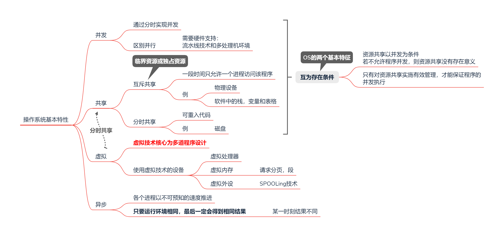
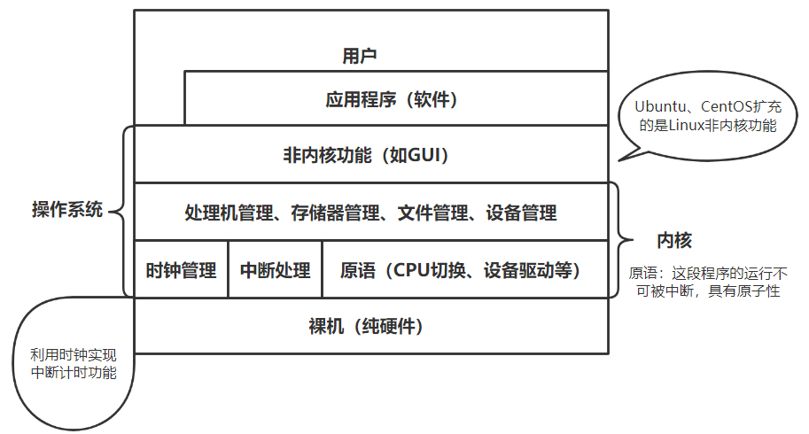
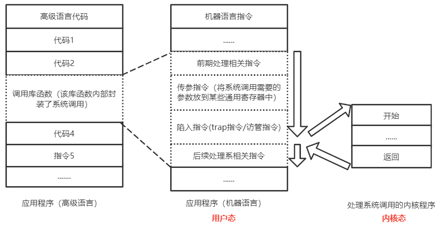
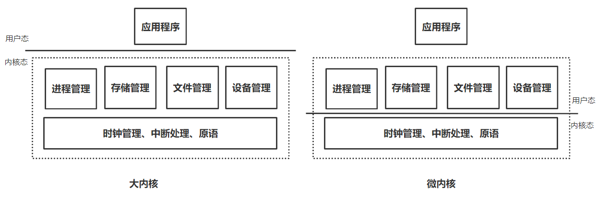

>   数据结构是内功在所有计算机软件中都会涉及，组成原理研究一台计算机怎么组织工作，操作系统研究怎么分配资源，计算机网络研究计算机间的信息交换。
>
>   用于完成系统资源管理的系统软件

<!--more-->

# 1. 操作系统总述

## 1.1 OS是什么

>   提供计算机与用户接口、实现系统资源管理功能的系统软件

### 1.1.1 OS发展历程

#### a. 未配置OS的计算机系统

人工操作方式

脱机输入/输出方式

#### b. 单道批处理系统(单用户单任务)

系统对作业的处理成批进行，内存中始终保持一道作业

缺点：

高速CPU等待低速IO设备

#### c. 多道批处理系统(多用户多任务)

##### 多道批处理系统特点

-   内存中存在多个作业

-   并发：

    宏观上并行：同一时间段，多个作业在执行

    微观上串行：同一时刻只能一个进程占用CPU

-   不提供人机交互

##### 涉及问题

-   处理机分配
-   内存分配
-   设备分配
-   程序、数据的组织与存储

#### d. 分时系统(多用户多任务)

-   **时间片轮转**

-   支持多道批处理同时，支持人机交互

-   各用户通过各自终端请求OS为其服务

#### e. 实时系统

收到什么请求处理什么

-   硬实时系统：绝对实时
-   软实时系统：相对实时，允许偶尔延迟

抢占式实时系统：优先级的进程高优先

#### f. 网络操作系统

>   由计算机网络实现网络中各类资源的共享与通信

服务于计算机网络，集中控制

#### g. 分布式计算机系统

>   系统中若干计算机完成同一任务

建立在网络系统上，分布控制

### 1.1.2 OS功能(做什么)

#### a. 提供计算机与用户之间的接口

##### 命令接口

###### 联机命令接口(命令行)

>   用户在控制台或终端输入命令，向系统请求服务
>
>   将控制权交给OS的命令解释程序，解释并执行当前指令

-   用于分时或实时操作系统（用户可干预正在进行的进程）

###### 脱机命令接口

>   用作业控制命令写成一份操作说明书，连同作业一起提交给系统

-   适用于批处理命令接口

##### 程序接口(GUI)

>   一组程序调用组成，用户在程序中使用系统调用请求OS为其服务

#### b. 系统资源的管理者

>   合理组织、调度计算机工作和资源分配

##### 处理机管理(多道程序环境)

-   进程控制
-   进程同步
-   进程通信
-   进程调度

##### 存储器管理

-   内存分配
-   内存保护
-   地址映射
-   内存扩充

##### 文件管理

-   文件存储空间管理
-   目录管理
-   文件读/写管理和保护

##### 设备管理

-   缓冲管理
-   设备分配
-   设备处理

#### c. 用作扩充机器

将覆盖了软件的机器称为扩充机器或虚拟机

实现了对系统硬件资源的抽象

### 1.1.3 **特性**

#### 多道程序设计

工作过程：

1.  CPU启动通道后便去处理其他工作，通道进行IO操作

2.  通道完成输入后，通过终中断机构向CPU发出请求，CPU暂停正在执行的操作，对中断进行处理

特点：

-   间断性
-   无序性
-   共享性
-   制约性

## 1.2 体系结构

### 1.2.1 基本概念

#### a. 内核

##### 时钟管理

-   提供标准系统时间
-   分时系统中的时间片管理需要时钟管理为前提

##### 中断机制

只有一小部分属于内核，PC与PSW由中断隐指令（硬件）完成

-   保护和恢复中断现场（通用寄存器中的值）
-   将控制权转移给相关的处理程序

##### 原语

>   处于OS底层，最接近硬件

具有原子性

运行时间短，调用频繁

##### 系统控制的数据结构及处理

>   用于登记各数据结构的状态信息

-   作业控制块
-   进程控制块
-   设备控制块
-   各种链路、队列、缓冲区、表

#### b. 程序分类

-   应用程序：完成某种特定功能自编的程序
-   内核程序：实现操作系统的程序，组成OS内核

#### c. 特权指令

>   用户不可调用，只允许内核程序调用

如：

-   IO指令
-   置中断指令
-   存取用于内存保护的指令
-   PSW置数指令

#### d. 两种状态

在PSW中，用1bit标记CPU状态

##### 内核态(管态，核心态)

CPU此时运行的是内核程序

在此状态下可以调用特权指令，系统调用

##### 用户态(目态)

CPU此时运行的是应用程序

不可执行特权指令

##### 内核态->用户态

执行特权指令，修改PSW标志位为 用户态

##### 用户态->内核态

>   **中断是OS内核重新获得CPU控制权的唯一途径**
>
>   如：访管指令产生访管中断

由中断引发，硬件自动完成变态过程

OS重新拿回控制权

#### e.系统调用

>   应用程序通过系统调用请求OS内核的服务，所以**使用系统调用，CPU需要从用户态切换到内核态**
>

系统中各类共享资源都由OS内核同一管理。凡是**与共享资源有关的操作**，都必须**通过系统调用的方式向OS提出服务请求**，由OS代为完成。

##### 系统调用与库函数

|          |                                                              |
| -------- | ------------------------------------------------------------ |
| 普通程序 | 可直接进行系统调用，也可使用库函数，有的库函数会涉及系统调用，有的不涉及 |
| 编程语言 | 向上提供库函数。有时会将系统调用封装成库函数，隐藏系统调用的一些细节 |
| 操作系统 | 向上提供系统调用，使得上层程序能请求内核服务                 |

##### 系统调用过程

**系统调用可以理解为一种中断服务程序**

1.  传递系统调用参数：编译产生若干参数和陷入指令

2.  用户程序执行陷入指令（用户态）

    通过引发内中断，将CPU使用权主动归还给OS内核程序

3.  OS内核程序对系统调用请求作出相应处理（内核态）

4.  处理完成后，OS将CPU使用权归还给当前用户程序

### 1.2.2 微内核

具有微内核结构的OS，实际上是将时钟管理、中断处理、原语作为微内核，加上上层的处理机管理、存储器管理、文件管理、设备管理形成大内核

**非内核功能运行在用户态，内核运行在内核态**

若采用微内核结构，CPU需要频繁地在内核态与用户态切换，造成较大开销

## 1.3 运行机制

### 1.3.1 启动过程

1.  基本输入输出系统(BIOS)常驻内存ROM区

    固化在主板

2.  BIOS将Bootloader从硬盘加载到内存

3.  CPU运行引导加载程序（Bootloader）

    Bootloader完成一系列功能，将OS程序从磁盘加载到内存的RAM区

5.  系统运行OS内核程序

6.  在OS内核程序退出CPU前，执行特权指令，修改PSW中的CPU状态位进入用户态