>   进程管理：进程是由于OS通过 **创建原语** 创建，运行所需的信息保存于 **PCB** 中，完成 **进程调度** 后，通过 **进程控制原语** ，进行 **进程状态切换**。
>
>   进程可以划分成更小的调度单位 **线程**，用来提高系统并行度

<!--more-->

# 2. 进程管理

>   为更好的描述和控制多道程序的并发执行，引入 **进程** 的概念

## 2.1 进程基本概念

### 2.1.1 进程

>   **进程是运行中的进程实体在某一时刻的快照**

-   同一程序，运行在不同的数据集上形成不同的进程
-   同一系统的进程（线程）由系统调用被用于不同的进程，仍是这一进程（线程）

>   **线程间有独立性也有相关性**

-   进程实体的一次运行，是系统进行**资源分配和调度**的一个独立单位
-   系统资源是有限的，各进程对共享资源互斥访问，相互制约

#### 进程 $\neq$ 程序

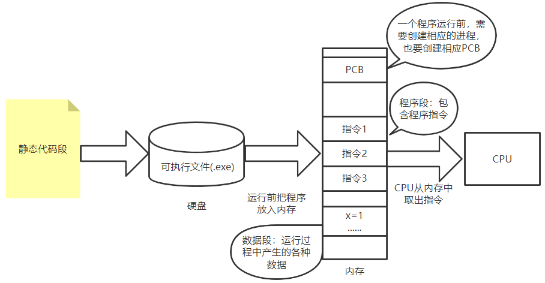

关联：进程是程序的一次执行过程

>   程序：存放于磁盘中的静态可执行文件
>
>   -   程序封闭性：运行结果取决于程序本身，不受外界影响

---

>   进程：在内存中运行的进程实体，是一个动态过程
>
>   -   进程执行速度不会改变执行结果

---

**单个进程某一时刻只能执行一个程序**

### 2.1.2 进程实体(进程映像)

进程实体=PCB+程序段+数据段

#### a. PCB

>   程序控制块是进程存在的唯一标识
>
>   描述进程的基本情况和运行状态：OS对进程管理工作所需的信息都保存在PCB中

组成：

-   进程描述信息

    PID：进程ID

    UID：进程归属的用户ID

-   进程控制和管理信息

    进程优先级

    进程当前状态

-   资源分配清单

    说明与该进程相关的内存地址空间或虚拟地址空间的使用情况

    所示用的IO设备信息

-   处理机相关信息

    CPU 中各寄存器的值

PCB的创建与销毁

-   PCB在进程创建时，由OS创建并常驻在内存，最后由OS回收

#### b. 程序段

>   指令集

多个进程可独立运行同一段程序

#### c. 数据段

>   进程运行期间的相关数据

数据

-   原始数据
-   中间结果
-   最终结果
-   局部变量
-   全局变量：全局变量是对同一进程而言，不同进程是不同的变量，没有关系，不可用于交换数据

### 2.1.3 进程特性

-   动态性

    进程的生命周期：创建，活动，暂停，终止

    **动态性时最基本特征**

-   并发性

    一段时间多个进程并发执行

-   独立性

    进程实体是一个能独立运行、获取资源和接受调度的基本单位

-   异步性

    进程按各自速度向不可预知的方向推进

    进程不可复现

### 2.1.4 进程的组织方式

即PCB的组织方式

##### 队列方式

>   按照进程状态不同，分为多个队列

OS持有各队列的指针

##### 索引方式

>   根据进程状态的不同，创建索引表

OS持有各索引表的指针

## 2.2 线程基本概念

>   引入进程：更好的描述和控制多道程序的并发执行
>
>   引入线程：
>
>   -   一个进程内，并发处理多个事务
>   -   减少程序在并发执行时，所付出的时空开销

支持线程的OS中：

-   **进程是系统资源（除CPU）的分配单位**
-   **线程是调度（处理机）的分配单位**

### 2.2.1 线程属性

-   线程可创建和撤销另一个线程

-   多核计算机中，各线程可占用不同的CPU

-   线程状态：就绪，阻塞，运行

-   同一进程的线程切换，不会引起进程切换

    不同进程中的线程切换，会引起进程切换

-   切换线程，系统开销小

### 2.2.2 多任务与多线程

#### a. 多任务

>   对于操作系统而言，可同时执行多个程序

#### b. 多线程

>   对同一程序而言，一个程序可执行多个线程，完成不同事务

### 2.2.3 线程与进程对比

<!-- prettier-ignore-start -->

|      | 调度(处理机分配)                                             | 资源分配                 | 地址空间和其他资源                                           | 通信                            | 并发性                                   | 切换开销                 |
| ---- | ------------------------------------------------------------ | ------------------------ | ------------------------------------------------------------ | ------------------------------- | ---------------------------------------- | ------------------------ |
| 进程 | 传统OS，进程是资源分配和调度的基本单位                       | 进程是拥有资源的基本单位 | 进程的地址空间独立                                           | 进程间通信需要同步与互斥机制    | 进程间的并发提高任务的并发度             | 需改变运行环境           |
| 线程 | 引入线程的OS，线程是调度的基本单位，进程是资源分配的基本单位 | 进程是拥有资源的基本单位 | 同一进程的线程间共享进程的资源，某进程内的线程对其他进程不可见 | 线程间共享存储，直接读/写数据段 | 多进程间的并发，多线程间的并发提高并发度 | 同一进程内线程切换开销小 |

<!-- prettier-ignore-end -->

### 2.2.4 线程实现方式

一段**代码逻辑**只有获得**运行机会**才能被CPU执行

#### a. 分类

##### 用户级线程（代码逻辑）

>   由应用程序完成线程管理的工作，线程的状态切换无需OS干预（在用户态完成），OS感受不到线程的存在

优点：

-   线程切换在用户空间完成
-   CPU不需要换态，系统开销小

缺点

-   并发度不高，一个用户级线程阻塞，整个进程阻塞
-   多线程无法在多核CPU上运行

##### 内核级线程（运行机会）

>   由OS完成线程管理工作，线程状态切换需要切换到 **内核态** 才能完成

**内核级线程才是调度的基本单位**

优点

-   并发能力强：一个线程被阻塞后，本进程的其他线程还可以运行
-   多线程可以在多核计算机上运行

缺点

-   线程切换需要OS内核完成
-   线程管理成本高

#### b. 线程模型

##### 一对一模型（纯内核级线程）

>   一个用户级线程映射到一个内核级线程。
>
>   每个用户进程都有与用户级线程同等数量的内核级线程

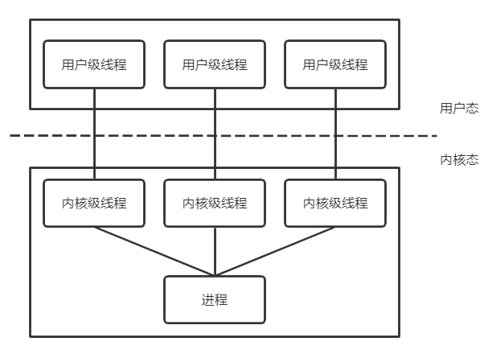

优点：

-   并发能力强：当一个线程被阻塞后，其他线程还可以继续执行
-   可以在多核CPU上运行

缺点

-   一个用户进程占用多个内核级线程
-   线程管理成本高，开销大：线程切换由OS完成，需要切换到内核态

##### 多对一模型（纯用户级线程）

>   多个用户线程映射到一个内核级线程
>
>   一个进程只能被分配到一个内核级线程

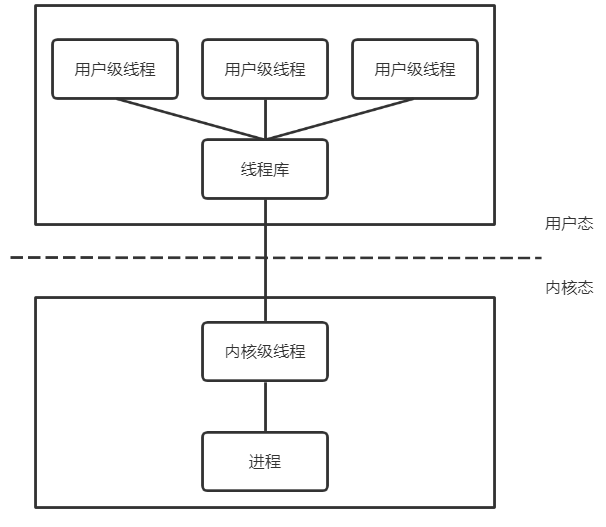

优点：

-   用户级线程切换在用户空间即可完成，不需要切换到内核态
-   线程管理的系统开销小，效率高

缺点

-   当一个用户级线程被阻塞后，整个进程都会被阻塞，并发度不高
-   多线程不能在多核CPU上运行

##### 多对多模型

>   n个用户线程映射到m个内核级线程 $n\ge m$ 
>
>   每个用户进程对应 m 个内核级线程

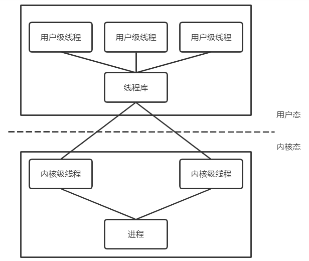

## 2.3 进程状态与进程调度

### 2.3.1 进程状态

#### a. 五状态模型

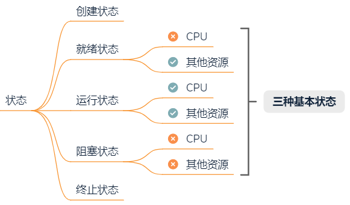

#### b. 进程状态切换条件

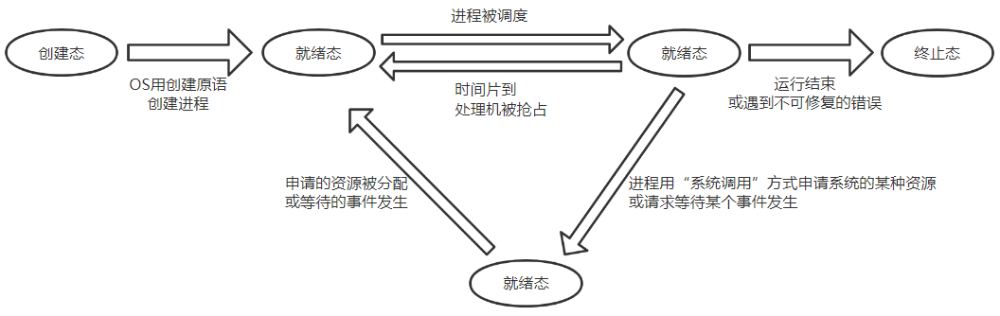

就绪->阻塞 进程自身做出的 **主动行为**

阻塞->就绪 不是进程自身控制 **被动行为**

---

运行->就绪：时间片用完；有优先级更高的进程抢占CPU

---

没有运行态的进程，一定没有阻塞态的进程

没有运行态的进程不代表没有进程，发生死锁时，所有进程都在阻塞态

#### c. 进程控制原语

>   进程控制的程序段，称为原语
>
>   通过相关的系统调用进入内核态，由内核态的CPU执行相应的程序段

原语具有原子性，用 `关中断` 和 `开中断` 这两个特权指令实现原子性

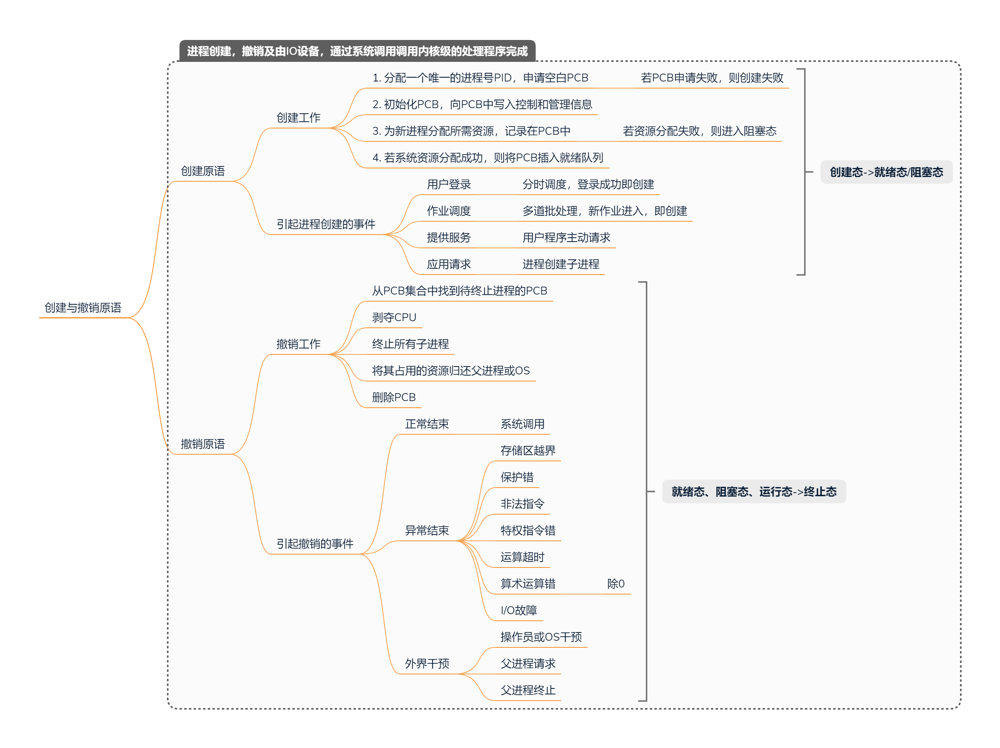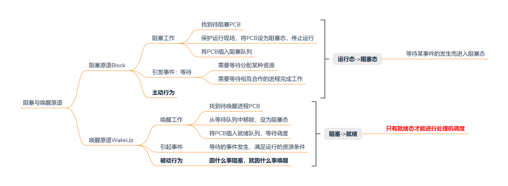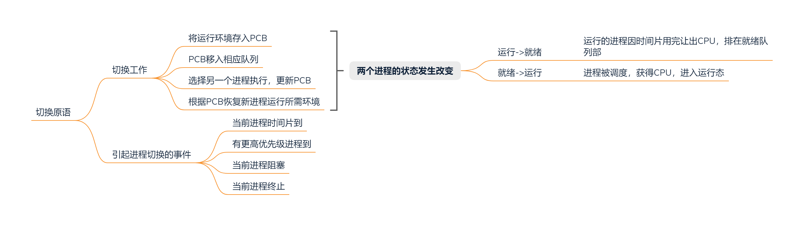

#### d. 调度与切换

调度是**决策行为**

-   解决 **给哪个** 的问题，资源分配原则

切换是**执行行为**

-   解决 **怎么给** 的问题，实际的分配行动：剥夺与分配

---

>   CPU模式切换与进程切换：区别在于是否改变运行环境（寄存器的值）

模式切换：在一个进程执行期间，因中断或异常进入内核态，执行完成后回到用户态

-   OS只需恢复进程进入内核态时的CPU现场，不涉及运行环境的改变

进程切换

-   一定涉及运行环境的改变

---

>   进程调度与进程切换

进程调度：从就绪队列中选一个进程

进程切换：

-   处理机的让渡
-   原进程现场的保存，将各寄存器的值保存到PCB中
-   新进程现场的恢复，根据PCB中信息恢复现场，如：PC，PSW，通用寄存器值，处理机现场

**进程调度与切换会带来系统开销，不是切换越频繁，并发度越高**

### 2.3.2 进程调度

>   调度：按某种算法从就绪队里中选择一个进程，分配CPU

调度是多道程序设计的基础

#### a. 基本概念

##### 作业

>   一个具体任务，一段程序

批处理系统中作业与进程的关系：**一个作业一个根进程**

1.  作业调度从后备队列中选择一个作业运行
2.  首先为该作业创建一个根进程
    -   OS执行作业解释程序，解释作业的说明书
    -   父进程在执行过程中动态创建多个子进程
3.  当父进程执行到 “撤出语句” 时，作业从运行态转换到完成态，将作业及相关结果送到输出井
4.  作业终止进程：输出作业结果；回收资源；清理现场

分时系统中作业与进程关系：**一个用户一个根进程**

-   作业：用户的一次上机交互过程

-   系统为每个终端创建一个进程

    进程执行解释程序

    每条终端命令，创建一个子进程执行

##### 挂起态

>   为提高内存利用率，将暂时不能运行的进程调到外存中等待

-   阻塞挂起
-   就绪挂起

挂起与阻塞都得不到CPU服务，但从运行态到阻塞态是进程映像留在内存中，到挂起态是将进程映像放入外存，主存中不存

#### b. 三种调度的对比

<!-- prettier-ignore-start -->

|                    | 做什么                                                       | 调度场所             | 发生频率 | 对进程状态的影响                         |
| ------------------ | ------------------------------------------------------------ | -------------------- | -------- | ---------------------------------------- |
| 作业调度(高级调度) | 从后备队列中选择一个作业，分配内存呢等必要资源，建立根进程 一个作业只发生一次调入，一次调出 | 外存->内存(面向作业) | 最低     | $无\rightarrow 创建态\rightarrow 就绪态$ |
| 内存调度(中级调度) | 从**挂起队列**中选择合适的进程将数据调回内存                 | 外存->内存(面向进程) | 中       | $挂起态\rightarrow就绪态$                |
| 进程调度(低级调度) | 从**就绪队列**中选择合适进程，分配处理机                     |                      | 高       | $就绪态\rightarrow运行态$                |

<!-- prettier-ignore-end -->

#### c. 进程调度时机

##### 需要进行进程调度的情况

当前进程 **主动放弃** 处理机

-   进程正常终止
-   运行过程发生异常终止
-   进程主动请求阻塞(等待IO)

当前进程 **被动放弃** 处理机

-   时间片用完
-   有更紧急的事件处理(IO中断)
-   有更高优先级的进程进入就绪队列

##### 不能进行进程调度的情况

在 **处理中断的过程** 中

当前进程在 **操作系统内核程序临界区**

当前进程在 **原子操作过程中**

#### d. 进程调度方式

>   有更高优先级的进程进入就绪队列，如何分配处理机

##### 非剥夺调度方式(非抢占方式)

>   只允许进程主动放弃处理机

-   无法及时处理紧急任务，适用于早期批处理系统

##### 剥夺式调度方式(抢占式)

>   可优先处理更紧急进程，也可让各进程按时间片轮流执行

-   适用于分时操作系统、实时操作系统

#### e. 进程调度算法

##### 性能评价指标

###### CPU利用率

$$
CPU利用率=\frac{忙碌时间}{总时间}
$$

如：某计算机只支持单道程序，某作业刚开始需要在CPU上执行5s，再在打印机上输出5s，之后再执行5s，才结束。CPU利用率，打印机利用率分别为多少

$CPU利用率=\frac{5+5}{5+5+5}=66.67%$

$打印机利用率=\frac{5}{15}=33.33%$

###### 系统吞吐率

>   单位时间CPU完成的作业数

$$
系统吞吐率=\frac{作业数量}{时长}
$$

如：某计算机系统处理10道作业，共花费100s，则系统吞吐率为

$系统吞吐率=\frac{10}{100}=0.1道/s$

###### 周转时间

>   从作业提交到系统到处理完成的时间
>
>   -   一次高级调度时间——在后备队列中等待时间
>   -   多次低级调度时间——在就绪队列中时间
>   -   运行时间
>   -   等待IO操作完成时间

$$
\begin{aligned}
&周转时间=t_{作业完成时刻}-t_{作业提交时刻}\\\\
&平均周转时间=\frac{各作业周转时间}{作业数}\\\\
&带权周转时间=\frac{作业周转时间}{系统为其服务时间}
\end{aligned}
$$

-   周转时间相同的作业，带权周转时间越小，用户满意度越高
-   实际运行时间相同的作业，周转时间越小，用户满意度越高

###### 等待时间

>   进程等待CPU的时间之和

进程等待时间：从进程建立开始计时，等待IO的时间不算等待时间

作业等待时间：进程等待时间+处于后备队列的时间

###### 响应时间

>   用户提交请求到首次产生响应的时间

##### FCFS先来先服务

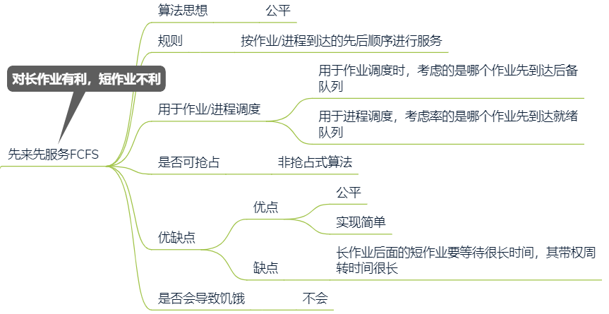

##### SJF短作业优先

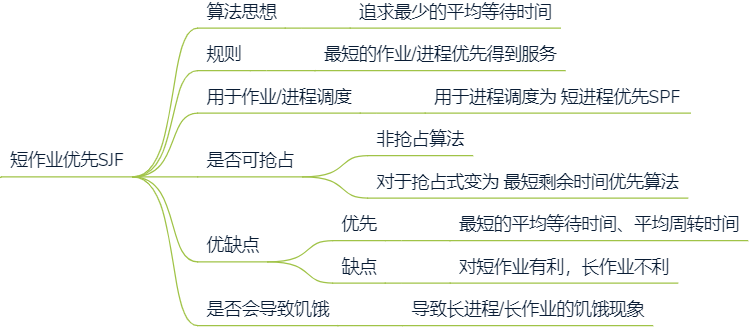

如：

| 进程  | 到达时间 | 运行时间 |
| ----- | -------- | -------- |
| $P_1$ | 0        | 7        |
| $P_2$ | 2        | 4        |
| $P_3$ | 4        | 1        |
| $P_4$ | 5        | 4        |

-   非抢占式短作业优先：每次调度选择当前已到达且运行时间最短的作业/进程

    调度顺序为：$P_1\rightarrow P_3 \rightarrow P_2\rightarrow P4$

    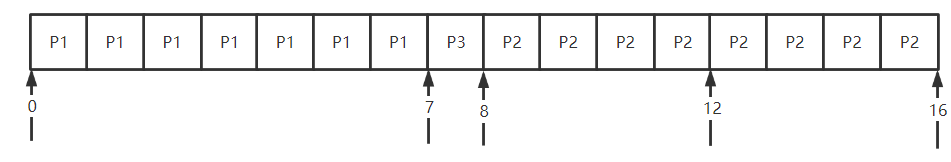

-   最短剩余时间优先(抢占式短作业优先)

    调度顺序：$P_1\rightarrow P_2\rightarrow P_3\rightarrow P_2\rightarrow P4\rightarrow P_1$

    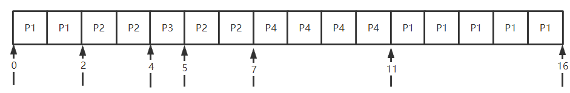

##### 高响应比优先

>   非抢占式，只有当期运行的进程 **主动放弃CPU** 才需要调度。
>
>   首先计算所有进程的响应比，选响应比最高的进程上处理机

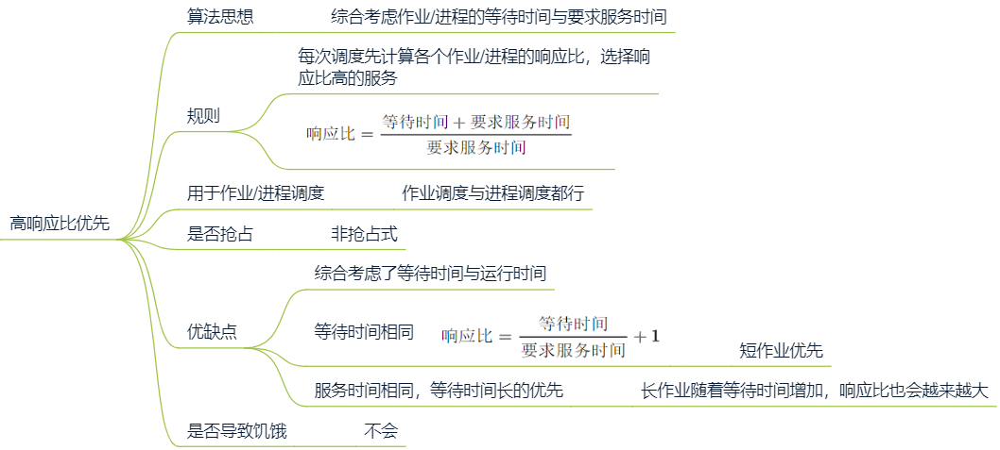

##### 优先级调度

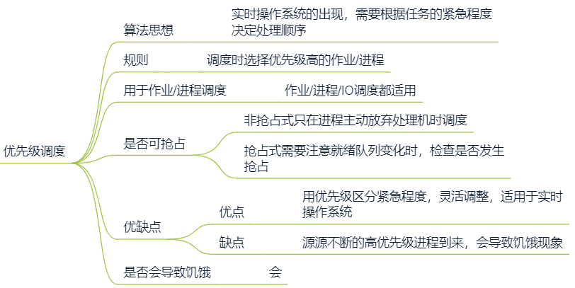

就绪队列未必只有一个，可以按照不同优先级来组织

-   静态优先级：创建进程后，优先级不变
-   动态优先级：创建进程时，有一个初始值，之后根据情况动态调整优先级

通常

**系统进程优先级高于用户进程**

**前台进程优先级高于后台进程**

**操作系统更偏向IO型进程**

-   IO设备和CPU可以并行工作，若优先让IO繁忙的进程运行，则越有可能让IO设备今早投入工作，资源利用率、系统吞吐量都会得到提升

##### 时间片轮转

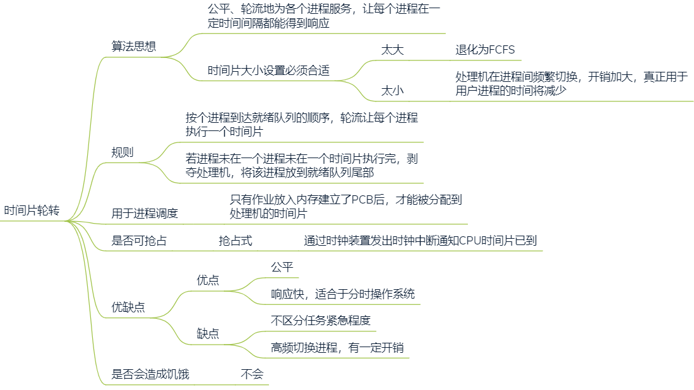

##### 多级反馈队列

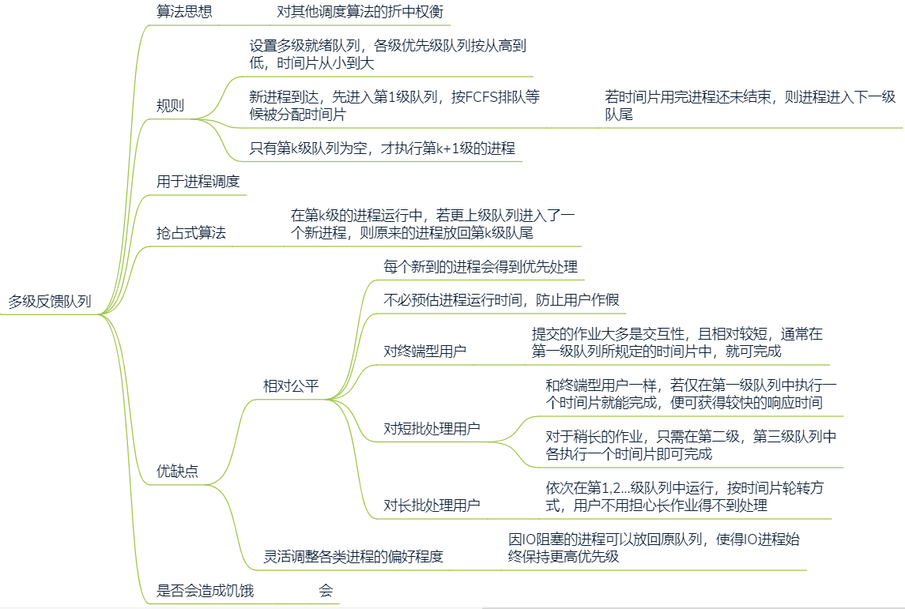

### 2.3.3 题型

#### a. 调度算法

假设某计算机系统有4个进程，用时间片轮转调度算法进行调度，分别计算各进程的调度次序和平均周转时间

| 进程  | 到达时间 | 运行时间 |
| ----- | -------- | -------- |
| $P_1$ | 0        | 8        |
| $P_2$ | 1        | 4        |
| $P_3$ | 2        | 9        |
| $P_4$ | 3        | 5        |

P1用完前两个时间片被放到队尾，此时就绪队列为 $P_2\rightarrow P_3\rightarrow P_1$，取队头的P2调度
P2运行完两个时间片被放到队尾，此时就绪队为 $P_3\rightarrow P_1\rightarrow P_4\rightarrow P_2$，取队头的P3调度

......

| 进程  | 到达就绪队列时刻 | 预计执行时间 | 执行时间段                           | 周转时间 |
| ----- | ---------------- | ------------ | ------------------------------------ | -------- |
| $P_1$ | 0                | 8            | 0\~2；6\~8；14\~16；20\~22           | 22-0=22  |
| $P_2$ | 1                | 4            | 2\~4；10\~12                         | 12-1=11  |
| $P_3$ | 2                | 9            | 4\~6；12\~14；18\~20；23\~25；25\~26 | 26-2=24  |
| $P_4$ | 3                | 5            | 8\~10；16\~18；22\~23                | 23-3=20  |

平均周转时间=$\frac{22+11+24+20}{4}=19.25$

#### b. 甘特图

##### 1

某单CPU系统中有输入和输出设备各一台，3个并发执行的作业，每个作业输入、计算、输出时间内分别为 2ms、3ms和4ms，且按输入、计算、输出的顺序执行，则执行完3个作业最少需要的时间是

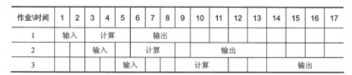

##### 2

某计算机系统有一个CPU，一台输入设备，一台打印机。进程A先获得CPU运行，进程B后运行。A：计算50ms，打印100ms，计算50ms，打印100ms。B：计算50ms，输入80ms，计算100ms

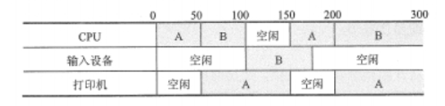
$$
\begin{aligned}
&CPU等待时间：100ms-150ms\\
&CPU利用率=\frac{300-(150-100)}{300}=0.833\\
&进程B的等待时间：0-50ms,180-200ms
\end{aligned}
$$

##### 3

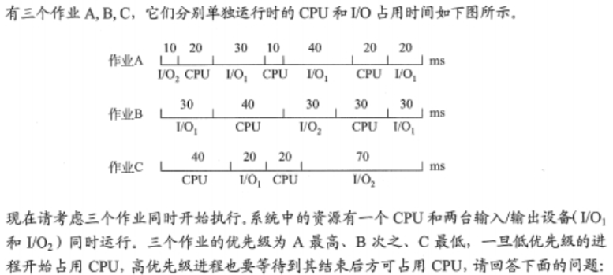

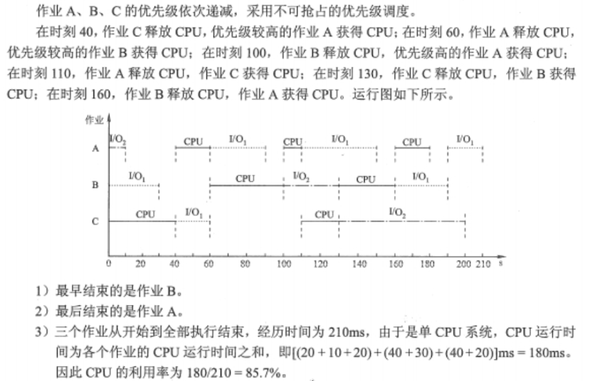

## 2.4 